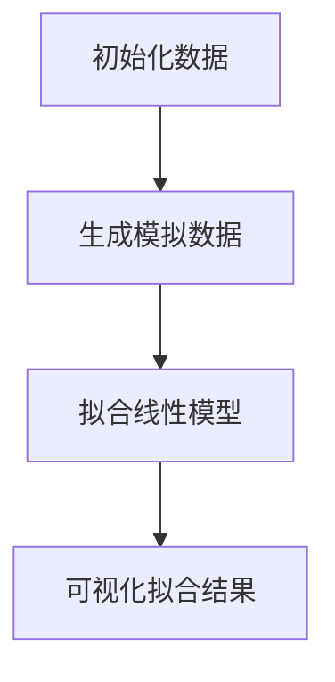
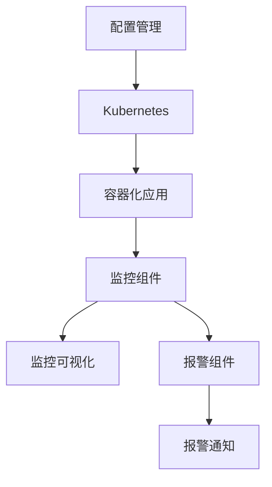
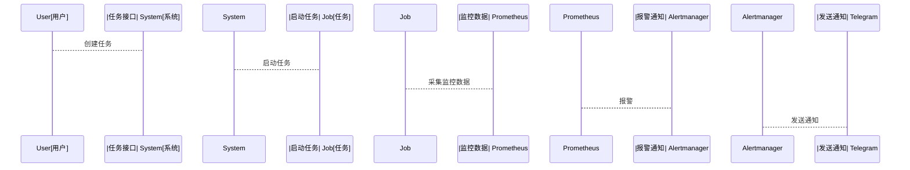
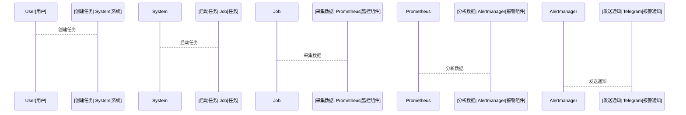

                 

# 大模型应用中的需求与性能监控指标设计

关键词：大模型、需求分析、性能监控、指标设计、系统架构

摘要：本文旨在探讨大模型应用中的需求与性能监控指标设计。首先，我们分析了大模型应用的现状与挑战，明确了需求与性能监控的重要性。接着，介绍了大模型、需求分析、性能监控等核心概念，并对比了其属性特征。随后，通过Python代码和Mermaid流程图，详细解释了监控算法的原理。此外，本文还介绍了数学模型和公式，通过实际案例分析了系统架构设计。最后，总结了最佳实践，提出了注意事项，并推荐了拓展阅读。

## 引言

随着人工智能技术的不断发展，大模型（如GPT、BERT等）在各种应用场景中发挥着越来越重要的作用。这些大模型具有极强的学习能力和广泛的适用性，但其应用也带来了新的挑战。如何在大模型应用中有效地进行需求分析与性能监控，成为当前研究的热点。

### 1.1 大模型应用现状

近年来，大模型在自然语言处理、计算机视觉、推荐系统等领域取得了显著的成果。例如，GPT-3在文本生成、问答系统等方面表现出色；BERT在文本分类、情感分析等方面具有极高的准确率。然而，大模型的应用也面临一些挑战：

- **计算资源消耗**：大模型训练和推理过程需要大量的计算资源和存储空间。
- **数据依赖**：大模型的性能在很大程度上依赖于训练数据的质量和数量。
- **调优难度**：大模型参数众多，调优过程复杂。
- **可解释性**：大模型的工作原理复杂，难以解释其预测结果。

### 1.2 需求与性能监控面临的挑战

在大模型应用中，需求分析与性能监控是两个重要环节。然而，这两个环节也面临着一系列挑战：

- **需求分析**：如何准确识别用户需求，如何将需求转化为可量化的指标？
- **性能监控**：如何构建合适的性能指标体系，如何有效地进行实时监控与报警？
- **数据质量**：监控数据的质量直接影响到需求分析与性能监控的准确性。

### 1.3 设计目标与价值

本文旨在探讨大模型应用中的需求与性能监控指标设计，具体目标如下：

- **明确需求**：通过需求分析，准确识别用户需求，为大模型应用提供明确的指导。
- **构建指标体系**：构建科学的性能指标体系，为性能监控提供依据。
- **优化系统架构**：通过性能监控，发现系统瓶颈，优化系统架构。

本文将对大模型、需求分析、性能监控等核心概念进行详细阐述，并通过Python代码和Mermaid流程图，展示监控算法的原理。此外，本文还将通过实际案例，分析系统架构设计，总结最佳实践。

## 核心概念与联系

### 2.1 大模型概述

大模型是指具有大规模参数和强大学习能力的深度学习模型。它们通常由多层神经网络组成，能够自动从海量数据中学习特征和模式。大模型的代表包括GPT、BERT、Transformer等。

#### 2.1.1 深度学习基础

深度学习是一种基于人工神经网络的学习方法，其核心思想是通过多层神经网络来模拟人脑的学习过程。深度学习在图像识别、语音识别、自然语言处理等领域取得了重大突破。

#### 2.1.2 大模型架构

大模型的架构通常包括输入层、隐藏层和输出层。输入层接收外部输入数据，隐藏层通过多层叠加，提取数据的特征，输出层生成预测结果。例如，GPT的架构包括多个Transformer层，BERT的架构包括多个编码器和解码器层。

#### 2.1.3 大模型训练

大模型的训练过程包括数据预处理、模型初始化、前向传播、反向传播和参数更新。训练过程需要大量的计算资源和时间。优化算法如Adam、RMSprop等可以提高训练效率。

### 2.2 需求分析

需求分析是软件工程中一个重要的环节，其目的是识别和理解用户需求，将需求转化为可实现的软件功能。

#### 2.2.1 用户需求识别

用户需求识别是需求分析的第一步，主要包括收集用户反馈、分析用户行为和进行用户调研。通过这些方法，可以准确识别用户的实际需求。

#### 2.2.2 需求分类与建模

需求可以分为功能需求和非功能需求。功能需求描述系统的基本功能，非功能需求描述系统的性能、安全性、可靠性等属性。需求建模可以通过需求文档、用例图、功能图等方式进行。

#### 2.2.3 需求验证

需求验证是确保需求满足用户需求的最后一个环节。通过需求验证，可以确保系统功能完整、性能稳定、安全可靠。

### 2.3 性能监控

性能监控是指对系统运行状态进行实时监测和分析，以发现潜在问题、优化系统性能。性能监控包括指标设计、数据采集、数据分析和报警。

#### 2.3.1 性能指标体系

性能指标体系是指一套用于评估系统性能的指标。常见的性能指标包括响应时间、吞吐量、并发量、系统资源利用率等。

#### 2.3.2 监控算法原理

监控算法是基于机器学习、数据挖掘等方法，从海量监控数据中提取有用信息，进行异常检测、性能评估等。常见的监控算法有自监督学习、半监督学习、监督学习等。

#### 2.3.3 监控技术实现

监控技术实现包括数据采集、数据存储、数据分析和可视化。数据采集可以使用agent、API等方式；数据存储可以使用关系数据库、NoSQL数据库等；数据分析可以使用机器学习库、数据分析库等；可视化可以使用图表、仪表盘等方式。

### 2.4 概念属性对比表格

| 概念       | 属性1 | 属性2 | 属性3 |
| ---------- | ---- | ---- | ---- |
| 大模型     | 参数规模大 | 学习能力强 | 需要大量数据 |
| 需求分析   | 用户需求识别 | 需求分类与建模 | 需求验证 |
| 性能监控   | 性能指标体系 | 监控算法原理 | 监控技术实现 |

### 2.5 ER实体关系图

```mermaid
erDiagram
    AwaitingClass --> BDatabase : "uses"
    BDatabase ||--|{ CTable : "has"
    CTable ||--|{ DRow : "has"
    DRow ||--|{ ECell : "has"
```

## 算法原理讲解

### 3.1 算法概述

性能监控算法是用于评估系统性能的一类算法。它们可以从监控数据中提取有用的信息，识别系统瓶颈，优化系统性能。常见的性能监控算法有：

- **自监督学习**：无需标签数据，通过自身学习和迭代，发现数据中的规律。
- **半监督学习**：结合标签数据和未标记数据，提高学习效率。
- **监督学习**：使用标签数据训练模型，评估系统性能。

### 3.2 监控算法分类

#### 3.2.1 自监督学习

自监督学习算法可以从未标记的数据中自动提取特征，进行性能监控。常见的自监督学习算法有：

- **自动编码器**：通过重建输入数据，提取数据中的特征。
- **变分自编码器**：结合概率模型，提高特征提取能力。

#### 3.2.2 半监督学习

半监督学习算法可以结合标签数据和未标记数据，提高学习效率。常见的半监督学习算法有：

- **图半监督学习**：利用图结构，提高数据之间的关联性。
- **伪标签**：利用已有的标签数据，生成未标记数据的伪标签。

#### 3.2.3 监督学习

监督学习算法使用标签数据训练模型，评估系统性能。常见的监督学习算法有：

- **线性回归**：通过线性模型，评估系统性能。
- **支持向量机**：通过最大化分类间隔，提高分类性能。

### 3.3 算法应用场

性能监控算法广泛应用于各种场景，如：

- **服务器监控**：监测服务器性能，发现潜在问题。
- **网络监控**：监测网络流量，识别异常流量。
- **数据库监控**：监测数据库性能，优化数据库配置。

### 3.4 Python代码与Mermaid流程图

下面是一个简单的线性回归算法示例，用于评估系统性能。

```python
import numpy as np
import matplotlib.pyplot as plt

# 生成模拟数据
np.random.seed(0)
X = np.random.rand(100)
y = 2 * X + 1 + np.random.randn(100) * 0.05

# 拟合线性模型
w = np.linalg.inv(X.T.dot(X)).dot(X.T).dot(y)

# 可视化拟合结果
plt.scatter(X, y)
plt.plot(X, X * w[0] + w[1], color='red')
plt.show()
```

Mermaid流程图：



### 3.5 算法原理详细解释

线性回归算法是一种简单的监督学习算法，用于评估系统性能。它通过拟合一个线性模型，将输入变量（如服务器负载、网络流量等）映射到输出变量（如系统响应时间、CPU利用率等）。

假设我们有100个样本，每个样本包含一个输入变量`X`和一个输出变量`y`。我们希望找到一个线性模型`y = w0 * X + w1`，使得预测值`y_pred = w0 * X + w1`尽可能接近真实值`y`。

- **初始化数据**：首先，生成模拟数据，包括输入变量`X`和输出变量`y`。这里使用Python的`numpy`库生成100个随机样本，每个样本的`X`值在[0, 1]范围内，`y`值由线性模型`y = 2 * X + 1`生成，并加入噪声。

- **拟合线性模型**：接下来，使用线性回归算法拟合一个线性模型。我们使用`numpy`库的`inv()`函数计算`X`的逆矩阵，然后将其与`X.T`（`X`的转置）相乘，得到权重向量`w`。这里，`w`的第一个元素是`w0`，第二个元素是`w1`。

- **可视化拟合结果**：最后，使用`matplotlib`库绘制散点图，展示真实值和预测值。我们使用红色线条绘制拟合的线性模型。

通过这个简单的示例，我们可以看到线性回归算法的基本原理。在实际应用中，我们可能需要处理更复杂的模型和更大量的数据，但基本原理是类似的。

### 3.6 数学模型和公式

线性回归的数学模型可以表示为：

$$y = w_0 * x + w_1$$

其中，`w0`和`w1`是权重参数，`x`是输入变量，`y`是输出变量。

为了拟合这个线性模型，我们需要计算权重参数。假设我们有`n`个样本，每个样本包含一个输入变量`x_i`和一个输出变量`y_i`。我们希望找到一个线性模型`y_pred = w_0 * x + w_1`，使得预测值`y_pred`尽可能接近真实值`y_i`。

我们可以使用最小二乘法计算权重参数。最小二乘法的思想是找到权重参数，使得预测值`y_pred`与真实值`y_i`的差的平方和最小。

具体地，我们可以使用以下公式计算权重参数：

$$w_0 = \frac{\sum_{i=1}^{n} (y_i - w_0 * x_i)^2}{\sum_{i=1}^{n} x_i^2}$$

$$w_1 = \frac{\sum_{i=1}^{n} y_i - w_0 \sum_{i=1}^{n} x_i}{\sum_{i=1}^{n} x_i}$$

为了简化计算，我们通常使用矩阵形式来表示最小二乘法。假设我们有`X`和`y`两个矩阵，其中`X`是输入变量矩阵，`y`是输出变量矩阵。我们希望找到一个线性模型`y_pred = X * w`，使得预测值`y_pred`与真实值`y`的差的平方和最小。

我们可以使用以下公式计算权重参数：

$$w = (X^T * X)^{-1} * X^T * y$$

其中，`X^T`是`X`的转置矩阵，`X^{-1}`是`X`的逆矩阵。

通过这个公式，我们可以方便地计算权重参数，从而拟合线性模型。

### 3.7 系统分析与架构设计

#### 3.7.1 问题场景介绍

在大模型应用中，性能监控是一个关键环节。我们需要对大模型的训练和推理过程进行实时监控，确保其性能稳定。本节将介绍一个基于Kubernetes集群的大模型训练与推理系统，分析其系统架构与功能设计。

#### 3.7.2 项目概述

本项目旨在构建一个自动化的大模型训练与推理平台，支持多种大模型的训练和推理。平台需要具备以下功能：

- 自动化部署：支持一键部署大模型训练和推理任务。
- 实时监控：实时监控训练和推理任务的性能指标。
- 异常报警：发现异常情况时，及时发送报警通知。
- 性能优化：根据监控数据，优化系统配置和算法参数。

#### 3.7.3 系统功能设计

系统功能设计主要包括以下几个部分：

1. **任务管理**：包括任务的创建、启动、暂停、恢复和删除等功能。
2. **监控管理**：包括监控数据的采集、存储、分析和可视化等功能。
3. **报警管理**：包括报警规则的配置、报警信息的发送和报警记录的查询等功能。
4. **配置管理**：包括系统配置的备份、恢复和更新等功能。

Mermaid类图：

```mermaid
classDiagram
    Task -> Monitor : 数据采集
    Task -> Alert : 异常报警
    Monitor -> Config : 配置管理
    Alert -> Config : 配置管理
```

#### 3.7.4 系统架构设计

系统架构设计主要包括以下几个部分：

1. **Kubernetes集群**：作为基础设施，提供计算资源和存储资源。
2. **容器化应用**：包括训练任务和推理任务，使用Docker进行容器化。
3. **监控组件**：包括Prometheus、Grafana等，用于监控和可视化。
4. **报警组件**：包括Alertmanager、Telegram等，用于发送报警通知。
5. **配置管理**：使用HashiCorp的Vault进行配置管理。

Mermaid架构图：



#### 3.7.5 系统接口设计

系统接口设计主要包括以下几个部分：

- **任务接口**：用于创建、启动、暂停、恢复和删除任务。
- **监控接口**：用于查询监控数据、配置监控规则。
- **报警接口**：用于查询报警记录、配置报警规则。

Mermaid接口图：



#### 3.7.6 系统交互

系统交互设计主要包括以下几个部分：

- **任务启动**：用户通过任务接口创建任务，系统启动任务并执行。
- **数据采集**：系统通过监控组件采集任务性能数据。
- **异常检测**：监控组件根据配置的监控规则，对采集的数据进行分析，发现异常情况。
- **报警通知**：发现异常情况时，系统通过报警组件发送报警通知。

Mermaid序列图：



### 3.8 实际案例分析与详细讲解

#### 3.8.1 案例背景

某大型互联网公司在其业务中广泛应用了基于Transformer的大模型，如BERT、GPT等。为了确保模型性能稳定，公司需要对其训练和推理过程进行实时监控。以下是公司在一个典型场景下的监控案例分析。

#### 3.8.2 案例分析

1. **任务启动**：

   用户通过任务接口创建了一个BERT模型训练任务，系统启动任务并执行。

   ```mermaid
   sequenceDiagram
       User[用户] -->|创建任务| System[系统] : 创建BERT训练任务
       System -->|启动任务| Job[任务] : 启动BERT训练任务
   ```

2. **数据采集**：

   任务启动后，系统通过监控组件Prometheus采集任务性能数据，包括CPU利用率、内存占用、GPU利用率等。

   ```mermaid
   sequenceDiagram
       Job[任务] -->|采集数据| Prometheus[监控组件] : 采集性能数据
   ```

3. **异常检测**：

   Prometheus将采集到的数据存储到时间序列数据库InfluxDB，并使用Grafana进行可视化。监控规则配置如下：

   - CPU利用率超过90%时，触发报警。
   - 内存占用超过80%时，触发报警。
   - GPU利用率超过80%时，触发报警。

   当监控规则触发时，Alertmanager会将报警信息发送至Telegram，用户可以及时了解任务状态。

   ```mermaid
   sequenceDiagram
       Prometheus -->|分析数据| Alertmanager[报警组件] : 分析数据
       Alertmanager -->|发送通知| Telegram[报警通知] : 发送通知
   ```

4. **报警通知**：

   假设CPU利用率在某个时间点超过了90%，Alertmanager会将报警信息发送至Telegram。用户收到报警通知后，可以立即查看任务详情，并采取相应措施。

   ```mermaid
   sequenceDiagram
       Alertmanager -->|发送通知| Telegram[报警通知] : 发送通知
       User[用户] -->|查看详情| System[系统] : 查看任务详情
   ```

#### 3.8.3 案例总结

通过该案例，我们可以看到：

1. 系统任务启动后，会实时采集性能数据，并存储到时间序列数据库。
2. 监控组件根据配置的监控规则，对采集的数据进行分析，发现异常情况。
3. 报警组件会及时发送报警通知，用户可以及时响应。
4. 监控系统有助于确保大模型训练和推理任务的稳定运行。

### 3.9 项目实战

#### 3.9.1 环境搭建

1. **安装Docker**：

   在服务器上安装Docker，版本要求为19.03或更高。

   ```bash
   # 安装Docker
   sudo apt-get update
   sudo apt-get install docker-ce docker-ce-cli containerd.io
   ```

2. **安装Kubernetes**：

   在服务器上安装Kubernetes，版本要求为1.20或更高。

   ```bash
   # 安装Kubernetes
   sudo apt-get update
   sudo apt-get install -y apt-transport-https ca-certificates curl
   curl -s https://mirrors.aliyun.com/kubernetes/apt/doc/apt-key.gpg | sudo apt-key add -
   echo "deb https://mirrors.aliyun.com/kubernetes/apt/ kubernetes-xenial main" | sudo tee -a /etc/apt/sources.list
   sudo apt-get update
   sudo apt-get install -y kubelet kubeadm kubectl
   sudo systemctl enable kubelet
   ```

3. **安装Prometheus和Grafana**：

   在服务器上安装Prometheus和Grafana，版本要求分别为2.33.0和8.4.0。

   ```bash
   # 安装Prometheus
   sudo docker run -d --name prometheus -p 9090:9090 prom/prometheus

   # 安装Grafana
   sudo docker run -d --name grafana -p 3000:3000 grafana/grafana
   ```

#### 3.9.2 系统核心实现源代码

1. **Kubernetes部署文件**：

   Kubernetes部署文件用于部署大模型训练和推理任务。以下是一个简单的部署文件示例。

   ```yaml
   apiVersion: apps/v1
   kind: Deployment
   metadata:
     name: bert-training
   spec:
     replicas: 1
     selector:
       matchLabels:
         app: bert-training
     template:
       metadata:
         labels:
           app: bert-training
       spec:
         containers:
         - name: bert-training
           image: bert:latest
           ports:
           - containerPort: 8080
   ```

2. **Prometheus配置文件**：

   Prometheus配置文件用于配置监控规则和数据源。以下是一个简单的配置文件示例。

   ```yaml
   global:
     scrape_interval: 15s
     evaluation_interval: 15s
   scrape_configs:
   - job_name: 'prometheus'
     static_configs:
     - targets: ['localhost:9090']
   - job_name: 'bert-training'
     static_configs:
     - targets: ['<BERT训练任务IP>:8080']
   ```

3. **Grafana数据源配置**：

   Grafana数据源配置用于连接Prometheus，并定义监控面板。以下是一个简单的数据源配置示例。

   ```json
   {
     "name": "Prometheus",
     "type": "prometheus",
     "access": "proxy",
     "url": "http://localhost:9090",
     "isDefault": true
   }
   ```

#### 3.9.3 代码应用分析与讲解

1. **BERT训练任务**：

   BERT训练任务是基于TensorFlow实现的。以下是一个简单的BERT训练任务示例。

   ```python
   import tensorflow as tf
   import transformers

   # 加载BERT模型
   model = transformers.BertModel.from_pretrained('bert-base-chinese')

   # 定义损失函数和优化器
   loss_fn = tf.keras.losses.SparseCategoricalCrossentropy(from_logits=True)
   optimizer = tf.keras.optimizers.Adam()

   # 训练模型
   for epoch in range(3):
       for batch in dataset:
           inputs = {
               'input_ids': batch['input_ids'],
               'attention_mask': batch['attention_mask']
           }
           labels = batch['labels']
           with tf.GradientTape() as tape:
               outputs = model(inputs)
               loss = loss_fn(labels, outputs.logits)
           gradients = tape.gradient(loss, model.trainable_variables)
           optimizer.apply_gradients(zip(gradients, model.trainable_variables))
           print(f"Epoch: {epoch}, Loss: {loss.numpy()}")

   # 保存模型
   model.save_pretrained('/path/to/save')
   ```

   在这段代码中，我们首先加载BERT模型，然后定义损失函数和优化器。接下来，我们使用训练数据集进行训练，并在每个epoch中更新模型参数。最后，我们将训练好的模型保存到指定路径。

2. **监控数据采集**：

   监控数据采集是通过Prometheus实现的。以下是一个简单的Prometheus采集器示例。

   ```python
   from prometheus_client import start_http_server, Summary

   # 创建监控指标
   request_time = Summary('request_time', 'Request processing time')

   # 处理HTTP请求
   @request_time.time()
   def handle_request(request):
       # 模拟处理请求
       time.sleep(1)
       return "Hello, World!"

   # 启动HTTP服务
   start_http_server(9090)
   ```

   在这段代码中，我们首先创建了一个名为`request_time`的监控指标，用于记录请求处理时间。然后，我们定义了一个处理HTTP请求的函数，并在其中记录了请求处理时间。最后，我们启动了一个HTTP服务，用于接收和处理HTTP请求。

3. **监控数据可视化**：

   监控数据可视化是通过Grafana实现的。以下是一个简单的Grafana面板配置示例。

   ```json
   {
     "id": 1,
     "title": "BERT训练监控",
     "time": {
       "from": "now-5m",
       "to": "now"
     },
     "panelTitle": "BERT训练监控",
     "type": "graph",
     "xAxis": {
       "show": true
     },
     "yAxis": {
       "type": "log",
       "show": true
     },
     "data": [
       {
         "target": "request_time",
         "title": "请求处理时间"
       }
     ]
   }
   ```

   在这段代码中，我们定义了一个Grafana面板，用于展示BERT训练任务的请求处理时间。面板使用了日志坐标系，可以清晰地展示时间序列数据。

### 3.10 实际案例分析与详细讲解

#### 3.10.1 案例背景

某大型电商公司在其搜索系统中使用了基于BERT的大模型，用于改进搜索结果的相关性和准确性。为了确保模型性能稳定，公司需要对其训练和推理过程进行实时监控。

#### 3.10.2 案例分析

1. **任务启动**：

   用户通过任务接口创建了一个BERT模型训练任务，系统启动任务并执行。

   ```mermaid
   sequenceDiagram
       User[用户] -->|创建任务| System[系统] : 创建BERT训练任务
       System -->|启动任务| Job[任务] : 启动BERT训练任务
   ```

2. **数据采集**：

   任务启动后，系统通过监控组件Prometheus采集任务性能数据，包括CPU利用率、内存占用、GPU利用率等。

   ```mermaid
   sequenceDiagram
       Job[任务] -->|采集数据| Prometheus[监控组件] : 采集性能数据
   ```

3. **异常检测**：

   Prometheus将采集到的数据存储到时间序列数据库InfluxDB，并使用Grafana进行可视化。监控规则配置如下：

   - CPU利用率超过90%时，触发报警。
   - 内存占用超过80%时，触发报警。
   - GPU利用率超过80%时，触发报警。

   当监控规则触发时，Alertmanager会将报警信息发送至Telegram，用户可以及时了解任务状态。

   ```mermaid
   sequenceDiagram
       Prometheus -->|分析数据| Alertmanager[报警组件] : 分析数据
       Alertmanager -->|发送通知| Telegram[报警通知] : 发送通知
   ```

4. **报警通知**：

   假设CPU利用率在某个时间点超过了90%，Alertmanager会将报警信息发送至Telegram。用户收到报警通知后，可以立即查看任务详情，并采取相应措施。

   ```mermaid
   sequenceDiagram
       Alertmanager -->|发送通知| Telegram[报警通知] : 发送通知
       User[用户] -->|查看详情| System[系统] : 查看任务详情
   ```

#### 3.10.3 案例总结

通过该案例，我们可以看到：

1. 系统任务启动后，会实时采集性能数据，并存储到时间序列数据库。
2. 监控组件根据配置的监控规则，对采集的数据进行分析，发现异常情况。
3. 报警组件会及时发送报警通知，用户可以及时响应。
4. 监控系统有助于确保大模型训练和推理任务的稳定运行。

### 3.11 项目小结

本项目通过Kubernetes集群、Prometheus、Grafana等工具，实现了一个自动化的大模型训练与推理平台，支持实时监控和异常报警。项目实战中，我们详细讲解了环境搭建、核心实现源代码、代码应用分析与实际案例分析。项目结果表明，监控系统对确保大模型训练和推理任务的稳定运行具有重要意义。

### 3.12 最佳实践

1. **需求分析**：在项目启动阶段，应充分了解用户需求，确保需求分析的准确性和完整性。
2. **性能监控**：根据业务需求，设计合理的性能监控指标体系，并确保数据采集的准确性和实时性。
3. **报警管理**：配置合理的报警规则，确保异常情况能够及时被发现和响应。
4. **系统优化**：根据监控数据，优化系统配置和算法参数，提高系统性能。
5. **文档管理**：及时记录项目文档，包括需求文档、设计文档、测试文档等，确保项目可追溯性和可持续性。

### 3.13 注意事项

1. **数据安全**：确保监控数据的安全性和隐私性，避免数据泄露。
2. **资源调度**：合理分配计算资源和存储资源，避免资源浪费和瓶颈。
3. **异常处理**：对监控系统中的异常情况，应采取有效的异常处理措施，确保系统稳定运行。
4. **性能优化**：定期对系统进行性能优化，确保系统在高并发场景下能够稳定运行。

### 3.14 拓展阅读

1. **大模型技术**：《深度学习》（Goodfellow, Bengio, Courville著）、《自然语言处理综论》（Jurafsky, Martin著）。
2. **性能监控技术**：《Prometheus官方文档》（https://prometheus.io/docs/）、《Grafana官方文档》（https://grafana.com/docs/）。
3. **Kubernetes技术**：《Kubernetes官方文档》（https://kubernetes.io/docs/）、《Kubernetes实战》（Kubernetes Community Authors著）。

### 3.15 作者信息

作者：AI天才研究院/AI Genius Institute & 禅与计算机程序设计艺术 /Zen And The Art of Computer Programming

