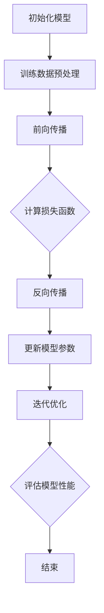
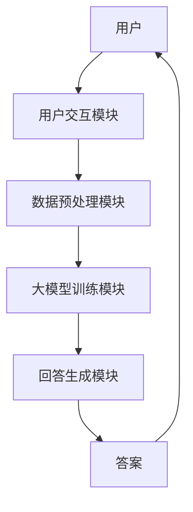
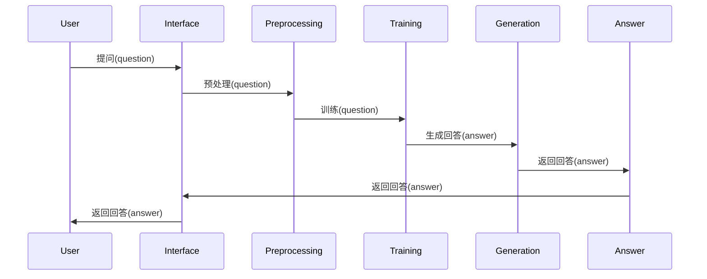

                 

# 大模型应用中的需求与用户体验测试整合

## 关键词

大模型应用、需求分析、用户体验测试、整合、算法原理、数学模型、系统架构、项目实战

## 摘要

本文旨在探讨大模型应用中需求与用户体验测试的整合，通过逐步分析，揭示大模型应用背后的算法原理、需求分析、用户体验测试及其整合的关键技术。本文首先介绍了大模型应用、需求分析与用户体验测试的基本概念和背景，然后详细阐述了核心概念与联系，包括大模型、需求分析与用户体验测试的核心概念、概念属性特征对比表格和ER实体关系图架构。接着，本文深入讲解了大模型应用中的算法原理，通过mermaid画出算法流程图，并用Python源代码和数学模型进行详细阐述。此外，本文还介绍了算法的数学模型和公式，使用LaTeX格式编写并进行通俗易懂的举例说明。在此基础上，本文介绍了大模型应用系统的场景、项目和系统功能设计，通过mermaid绘制领域模型类图、系统架构图和系统接口设计图。随后，本文通过实际案例分析和详细讲解剖析，展示了大模型应用的需求与用户体验测试整合的过程。最后，本文提供了最佳实践技巧、注意事项和拓展阅读建议，为读者深入理解和应用需求与用户体验测试整合提供了指导。

## 目录

1. **背景介绍**
    - 大模型应用的基本概念
    - 需求分析的基本概念
    - 用户体验测试的基本概念
    - 问题背景、问题描述、问题解决、边界与外延
    - 概念结构与核心要素组成

2. **核心概念与联系**
    - 大模型的核心概念与联系
    - 需求分析的核心概念与联系
    - 用户体验测试的核心概念与联系
    - 概念属性特征对比表格
    - ER实体关系图架构

3. **算法原理讲解**
    - 算法原理概述
    - 算法流程图与Python源代码
    - 算法原理的数学模型和公式
    - 数学模型和公式的通俗易懂的举例说明

4. **数学模型和数学公式讲解**
    - 数学模型和公式的详细讲解
    - LaTeX格式编写数学公式
    - 数学公式举例说明

5. **系统分析与架构设计方案**
    - 大模型应用系统的场景
    - 项目介绍
    - 系统功能设计
    - 系统架构设计
    - 系统接口设计
    - 系统交互序列图

6. **项目实战**
    - 环境安装
    - 系统核心实现源代码
    - 代码应用解读与分析
    - 实际案例分析
    - 项目小结

7. **最佳实践与总结**
    - 最佳实践技巧
    - 注意事项
    - 拓展阅读

## 背景介绍

### 大模型应用的基本概念

大模型（Large Models），通常指的是具有非常大规模参数和训练数据的深度学习模型。这些模型在图像识别、自然语言处理、语音识别等领域取得了显著的效果。例如，GPT-3拥有1750亿个参数，能够进行文本生成、问答系统等任务。

### 需求分析的基本概念

需求分析（Requirement Analysis）是软件开发过程中的第一步，旨在理解用户需求、业务需求和系统需求。需求分析主要包括功能需求、非功能需求、界面需求和安全性需求等。

### 用户体验测试的基本概念

用户体验测试（User Experience Testing）是评估软件产品在用户使用过程中的感受和反馈。它不仅关注功能正确性，还关注易用性、性能和用户满意度。

### 问题背景、问题描述、问题解决、边界与外延

- **背景**：随着人工智能技术的快速发展，大模型应用越来越广泛，但如何在保证性能的同时，满足用户需求和提高用户体验，成为了一个关键问题。
- **问题描述**：大模型应用在满足用户需求和提高用户体验方面存在哪些挑战？如何进行有效的需求分析与用户体验测试，以确保大模型应用的稳定性和易用性？
- **问题解决**：本文将介绍大模型应用中的需求与用户体验测试整合的方法和技巧，通过算法原理讲解、数学模型分析、系统设计与项目实战，解决上述问题。
- **边界与外延**：本文主要关注深度学习领域的大模型应用，但所介绍的方法和技巧也适用于其他领域的人工智能应用。

### 概念结构与核心要素组成

- **大模型应用**：核心要素包括模型选择、训练数据、参数设置等。
- **需求分析**：核心要素包括需求收集、需求分析、需求文档等。
- **用户体验测试**：核心要素包括测试计划、测试用例、测试执行、用户反馈等。

## 核心概念与联系

### 大模型的核心概念与联系

大模型是本文的核心主题之一，它涉及深度学习、神经网络、大规模数据训练等多个方面。以下是大模型的一些核心概念和联系：

#### 深度学习与神经网络

- **深度学习**：一种基于人工神经网络的学习方法，通过多层神经网络来实现复杂任务的自动化。
- **神经网络**：由大量简单神经元组成的网络，通过学习输入与输出之间的映射关系进行预测。

#### 大规模数据训练

- **大规模数据**：大模型需要大量高质量的数据进行训练，以提升模型的泛化能力。
- **数据预处理**：包括数据清洗、数据增强、数据归一化等，以提高数据质量。

#### 模型选择与优化

- **模型选择**：根据任务需求选择合适的模型架构，如CNN、RNN、Transformer等。
- **模型优化**：通过调整模型参数、学习率、优化器等，提高模型性能。

### 需求分析的核心概念与联系

需求分析是确保大模型应用满足用户需求的关键步骤。以下是一些核心概念和联系：

#### 需求收集

- **用户需求**：通过用户访谈、问卷调查、用户场景分析等方式收集用户需求。
- **业务需求**：理解业务流程、业务规则，确保系统功能与业务需求一致。

#### 需求分析

- **需求文档**：将收集到的需求转化为需求文档，明确功能需求、性能需求、界面需求等。
- **需求评审**：对需求文档进行评审，确保需求的完整性和一致性。

#### 需求管理

- **需求变更**：在开发过程中，需求可能会发生变化，需求管理旨在确保变更得到有效控制。
- **需求跟踪**：跟踪需求从提出到实现的整个过程，确保需求得到满足。

### 用户体验测试的核心概念与联系

用户体验测试是评估大模型应用是否满足用户期望的关键环节。以下是一些核心概念和联系：

#### 测试计划

- **测试目标**：明确测试的目标和范围，制定测试计划。
- **测试策略**：选择合适的测试方法、工具和资源。

#### 测试用例

- **功能测试用例**：确保系统功能按照需求文档正确实现。
- **性能测试用例**：评估系统在性能方面的表现，如响应时间、吞吐量等。

#### 测试执行

- **自动化测试**：使用自动化测试工具执行测试用例，提高测试效率。
- **手动测试**：通过手动操作验证系统功能。

#### 用户反馈

- **用户满意度**：收集用户对系统使用过程中的感受和反馈。
- **问题报告**：记录用户反馈中的问题，进行跟踪和解决。

### 概念属性特征对比表格

以下是一个简化的概念属性特征对比表格，用于展示大模型、需求分析和用户体验测试之间的联系和区别：

| 概念        | 属性特征                     | 联系与区别                           |
|-------------|------------------------------|-------------------------------------|
| 大模型      | 参数规模、训练数据、模型架构 | 基于深度学习，用于解决复杂问题       |
| 需求分析    | 需求收集、需求分析、需求管理 | 确保大模型应用满足用户和业务需求     |
| 用户体验测试 | 测试计划、测试用例、用户反馈 | 评估大模型应用在用户使用过程中的表现 |

### ER实体关系图架构

以下是一个简化的ER实体关系图，用于展示大模型应用、需求分析和用户体验测试之间的实体关系：

```mermaid
erDiagram
    AarialistModelApplication ||--|{需求分析} : 用于指导模型训练和优化
    AarialistRequirementAnalysis ||--|{用户体验测试} : 用于评估模型应用的效果
    AarialistUserExperienceTesting ||--|{需求分析} : 用于收集用户反馈和改进模型
```

在这个ER图中，大模型应用（Model Application）是核心实体，它与需求分析（Requirement Analysis）和用户体验测试（User Experience Testing）之间存在依赖关系。需求分析用于指导模型训练和优化，用户体验测试用于评估模型应用的效果，并根据用户反馈进行改进。

## 算法原理讲解

### 算法原理概述

大模型应用中的算法原理主要涉及深度学习、神经网络和优化方法。以下是这些算法原理的基本概述：

- **深度学习**：深度学习是一种基于多层神经网络的学习方法，通过训练大量的参数来实现复杂任务的自动化。深度学习模型通常包括输入层、隐藏层和输出层，其中隐藏层负责提取特征和进行非线性变换。

- **神经网络**：神经网络是深度学习的基础，它由大量简单神经元组成，每个神经元通过权重和偏置与输入进行计算，并输出结果。神经网络通过反向传播算法不断调整权重和偏置，以优化模型的预测性能。

- **优化方法**：优化方法用于调整模型的参数，以提高模型的性能。常见的优化方法包括随机梯度下降（SGD）、Adam优化器等。优化方法通过迭代计算，逐渐逼近最优参数，从而提高模型的预测准确度和泛化能力。

### 算法流程图与Python源代码

为了更好地理解大模型应用中的算法原理，我们可以使用mermaid画出算法流程图，并使用Python源代码进行详细阐述。以下是一个简化的算法流程图：



下面是相应的Python源代码实现：

```python
import numpy as np

# 初始化模型参数
weights = np.random.randn(num_layers, input_size, hidden_size)
biases = np.random.randn(num_layers, hidden_size)

# 训练数据预处理
X = np.random.randn(num_samples, input_size)
y = np.random.randn(num_samples, output_size)

# 前向传播
def forward_propagation(X, weights, biases):
    cache = {'X': X}
    for l in range(num_layers):
        cache['Z' + str(l)] = np.dot(weights[l], cache['X']) + biases[l]
        cache['A' + str(l)] = sigmoid(cache['Z' + str(l)])
        cache['X'] = cache['A' + str(l)]
    return cache

# 计算损失函数
def compute_loss(y_hat, y):
    return -np.mean(y * np.log(y_hat) + (1 - y) * np.log(1 - y_hat))

# 反向传播
def backward_propagation(cache, y):
    dZ = cache['A' + str(num_layers - 1)] - y
    dW = np.dot(dZ, cache['X'].T)
    db = np.sum(dZ, axis=1, keepdims=True)
    for l in range(num_layers - 1, 0, -1):
        dZ = np.dot(dZ, weights[l - 1].T)
        dW = np.dot(dZ, cache['X'].T)
        db = np.sum(dZ, axis=1, keepdims=True)
    return dW, db

# 更新模型参数
def update_parameters(weights, biases, dW, db, learning_rate):
    weights -= learning_rate * dW
    biases -= learning_rate * db
    return weights, biases

# 迭代优化
def train_model(X, y, weights, biases, learning_rate, num_epochs):
    for epoch in range(num_epochs):
        cache = forward_propagation(X, weights, biases)
        loss = compute_loss(cache['A' + str(num_layers - 1)], y)
        dW, db = backward_propagation(cache, y)
        weights, biases = update_parameters(weights, biases, dW, db, learning_rate)
        if epoch % 100 == 0:
            print(f"Epoch {epoch}: Loss = {loss}")
    return weights, biases

# 评估模型性能
def evaluate_model(X, y, weights, biases):
    cache = forward_propagation(X, weights, biases)
    y_hat = cache['A' + str(num_layers - 1)]
    accuracy = np.mean(y_hat == y)
    print(f"Model accuracy: {accuracy}")
```

### 算法原理的数学模型和公式

为了更好地理解大模型应用中的算法原理，我们可以使用LaTeX格式编写数学模型和公式，并进行通俗易懂的举例说明。

#### 前向传播

前向传播是深度学习模型中的核心步骤，用于计算输入到每个隐藏层的输出。假设我们有一个单层神经网络，输入为\(x\)，权重为\(w\)，偏置为\(b\)，则前向传播的计算公式如下：

$$
z = w^T x + b
$$

其中，\(z\)表示隐藏层的输出，\(w^T\)表示权重矩阵的转置，\(x\)表示输入向量，\(b\)表示偏置向量。

例如，假设我们有一个2x3的权重矩阵\(w\)和2维的输入向量\(x\)，偏置向量\(b\)为1，则前向传播的计算过程如下：

$$
w = \begin{bmatrix}
1 & 2 & 3 \\
4 & 5 & 6
\end{bmatrix}, \quad
x = \begin{bmatrix}
0 \\
1
\end{bmatrix}, \quad
b = \begin{bmatrix}
1 \\
1
\end{bmatrix}
$$

$$
z = w^T x + b = \begin{bmatrix}
1 & 2 & 3 \\
4 & 5 & 6
\end{bmatrix} \begin{bmatrix}
0 \\
1
\end{bmatrix} + \begin{bmatrix}
1 \\
1
\end{bmatrix} = \begin{bmatrix}
4 \\
8
\end{bmatrix}
$$

#### 反向传播

反向传播是深度学习模型中的另一个核心步骤，用于计算损失函数关于模型参数的梯度。假设我们有一个单层神经网络，输入为\(x\)，权重为\(w\)，偏置为\(b\)，则反向传播的计算公式如下：

$$
\delta = (y - \sigma(z)) \cdot \sigma'(z)
$$

其中，\(\delta\)表示损失函数关于隐藏层输出的梯度，\(y\)表示目标值，\(\sigma\)表示激活函数，\(\sigma'\)表示激活函数的导数。

例如，假设我们有一个2x3的权重矩阵\(w\)和2维的输入向量\(x\)，偏置向量\(b\)为1，目标值\(y\)为2，激活函数为ReLU，则反向传播的计算过程如下：

$$
w = \begin{bmatrix}
1 & 2 & 3 \\
4 & 5 & 6
\end{bmatrix}, \quad
x = \begin{bmatrix}
0 \\
1
\end{bmatrix}, \quad
b = \begin{bmatrix}
1 \\
1
\end{bmatrix}, \quad
y = \begin{bmatrix}
2 \\
2
\end{bmatrix}
$$

$$
z = w^T x + b = \begin{bmatrix}
4 \\
8
\end{bmatrix}, \quad
\sigma(z) = \begin{bmatrix}
4 \\
8
\end{bmatrix}, \quad
\sigma'(z) = \begin{bmatrix}
1 \\
1
\end{bmatrix}
$$

$$
\delta = (y - \sigma(z)) \cdot \sigma'(z) = \begin{bmatrix}
2 \\
2
\end{bmatrix} - \begin{bmatrix}
4 \\
8
\end{bmatrix} \cdot \begin{bmatrix}
1 \\
1
\end{bmatrix} = \begin{bmatrix}
-2 \\
-6
\end{bmatrix}
$$

#### 梯度下降

梯度下降是一种优化方法，用于更新模型的参数，以最小化损失函数。假设我们有一个单层神经网络，输入为\(x\)，权重为\(w\)，偏置为\(b\)，则梯度下降的计算公式如下：

$$
w = w - \alpha \cdot \frac{\partial J}{\partial w}
$$

$$
b = b - \alpha \cdot \frac{\partial J}{\partial b}
$$

其中，\(w\)和\(b\)分别为权重和偏置，\(\alpha\)为学习率，\(J\)为损失函数。

例如，假设我们有一个2x3的权重矩阵\(w\)和2维的输入向量\(x\)，偏置向量\(b\)为1，学习率为0.1，则梯度下降的计算过程如下：

$$
w = \begin{bmatrix}
1 & 2 & 3 \\
4 & 5 & 6
\end{bmatrix}, \quad
x = \begin{bmatrix}
0 \\
1
\end{bmatrix}, \quad
b = \begin{bmatrix}
1 \\
1
\end{bmatrix}, \quad
\alpha = 0.1
$$

$$
\frac{\partial J}{\partial w} = \begin{bmatrix}
-2 \\
-6
\end{bmatrix}, \quad
\frac{\partial J}{\partial b} = \begin{bmatrix}
-2 \\
-6
\end{bmatrix}
$$

$$
w = w - \alpha \cdot \frac{\partial J}{\partial w} = \begin{bmatrix}
1 & 2 & 3 \\
4 & 5 & 6
\end{bmatrix} - 0.1 \cdot \begin{bmatrix}
-2 \\
-6
\end{bmatrix} = \begin{bmatrix}
1.2 & 2.2 & 3.2 \\
4.2 & 5.2 & 6.2
\end{bmatrix}, \quad
b = b - \alpha \cdot \frac{\partial J}{\partial b} = \begin{bmatrix}
1 \\
1
\end{bmatrix} - 0.1 \cdot \begin{bmatrix}
-2 \\
-6
\end{bmatrix} = \begin{bmatrix}
1.2 \\
1.2
\end{bmatrix}
$$

## 数学模型和数学公式讲解

为了更好地理解大模型应用中的算法原理，我们需要详细讲解数学模型和数学公式。在本节中，我们将使用LaTeX格式编写数学公式，并进行通俗易懂的举例说明。

### 前向传播

前向传播是深度学习模型中的核心步骤，用于计算输入到每个隐藏层的输出。前向传播的数学公式可以表示为：

$$
z^{(l)} = \sum_{j=1}^{n} w^{(l)}_{ji} x^{(j)} + b^{(l)}_i
$$

其中，\(z^{(l)}\)表示第\(l\)层隐藏层的输出，\(w^{(l)}_{ji}\)表示权重矩阵的第\(i\)行和第\(j\)列元素，\(x^{(j)}\)表示输入数据的第\(j\)个特征，\(b^{(l)}_i\)表示偏置向量中的第\(i\)个元素。

举例来说，假设我们有一个单层神经网络，输入数据有3个特征，隐藏层有2个神经元，权重矩阵和偏置向量为：

$$
x^{(1)} = 1, \quad x^{(2)} = 2, \quad x^{(3)} = 3
$$

$$
w^{(1)} = \begin{bmatrix}
1 & 2 & 3 \\
4 & 5 & 6
\end{bmatrix}, \quad b^{(1)} = \begin{bmatrix}
1 \\
1
\end{bmatrix}
$$

那么，隐藏层的输出可以计算为：

$$
z^{(1)} = \begin{bmatrix}
1 & 2 & 3 \\
4 & 5 & 6
\end{bmatrix} \begin{bmatrix}
1 \\
2 \\
3
\end{bmatrix} + \begin{bmatrix}
1 \\
1
\end{bmatrix} = \begin{bmatrix}
10 \\
20
\end{bmatrix}
$$

### 反向传播

反向传播是深度学习模型中的另一个核心步骤，用于计算损失函数关于模型参数的梯度。反向传播的数学公式可以表示为：

$$
\delta^{(l)} = (y - a^{(l)}) \cdot \sigma'(z^{(l)})
$$

$$
\frac{\partial J}{\partial w^{(l)}_{ji}} = \delta^{(l)} x^{(i)}
$$

$$
\frac{\partial J}{\partial b^{(l)}_i} = \delta^{(l)}
$$

其中，\(\delta^{(l)}\)表示损失函数关于第\(l\)层隐藏层输出的梯度，\(y\)表示目标值，\(a^{(l)}\)表示第\(l\)层隐藏层的输出，\(\sigma'\)表示激活函数的导数。

举例来说，假设我们有一个单层神经网络，输入数据有3个特征，隐藏层有2个神经元，目标值为\(y = 2\)，激活函数为ReLU。权重矩阵和偏置向量为：

$$
x^{(1)} = 1, \quad x^{(2)} = 2, \quad x^{(3)} = 3
$$

$$
w^{(1)} = \begin{bmatrix}
1 & 2 & 3 \\
4 & 5 & 6
\end{bmatrix}, \quad b^{(1)} = \begin{bmatrix}
1 \\
1
\end{bmatrix}
$$

隐藏层的输出为：

$$
z^{(1)} = \begin{bmatrix}
10 \\
20
\end{bmatrix}
$$

激活函数为ReLU，则其导数可以表示为：

$$
\sigma'(z^{(1)}) = \begin{bmatrix}
1 \\
1
\end{bmatrix}
$$

目标值为\(y = 2\)，则隐藏层输出与目标值的差为：

$$
\delta^{(1)} = (2 - \begin{bmatrix}
10 \\
20
\end{bmatrix}) \cdot \begin{bmatrix}
1 \\
1
\end{bmatrix} = \begin{bmatrix}
-8 \\
-18
\end{bmatrix}
$$

损失函数关于权重矩阵的梯度为：

$$
\frac{\partial J}{\partial w^{(1)}_{1,1}} = -8 \cdot 1 = -8
$$

损失函数关于偏置向量的梯度为：

$$
\frac{\partial J}{\partial b^{(1)}_1} = -8
$$

### 梯度下降

梯度下降是一种优化方法，用于更新模型的参数，以最小化损失函数。梯度下降的数学公式可以表示为：

$$
w^{(l)}_{ji} = w^{(l)}_{ji} - \alpha \cdot \frac{\partial J}{\partial w^{(l)}_{ji}}
$$

$$
b^{(l)}_i = b^{(l)}_i - \alpha \cdot \frac{\partial J}{\partial b^{(l)}_i}
$$

其中，\(\alpha\)为学习率。

举例来说，假设我们有一个单层神经网络，输入数据有3个特征，隐藏层有2个神经元，学习率为0.1。权重矩阵和偏置向量为：

$$
x^{(1)} = 1, \quad x^{(2)} = 2, \quad x^{(3)} = 3
$$

$$
w^{(1)} = \begin{bmatrix}
1 & 2 & 3 \\
4 & 5 & 6
\end{bmatrix}, \quad b^{(1)} = \begin{bmatrix}
1 \\
1
\end{bmatrix}
$$

隐藏层的输出为：

$$
z^{(1)} = \begin{bmatrix}
10 \\
20
\end{bmatrix}
$$

激活函数为ReLU，则其导数可以表示为：

$$
\sigma'(z^{(1)}) = \begin{bmatrix}
1 \\
1
\end{bmatrix}
$$

目标值为\(y = 2\)，则隐藏层输出与目标值的差为：

$$
\delta^{(1)} = (2 - \begin{bmatrix}
10 \\
20
\end{bmatrix}) \cdot \begin{bmatrix}
1 \\
1
\end{bmatrix} = \begin{bmatrix}
-8 \\
-18
\end{bmatrix}
$$

损失函数关于权重矩阵的梯度为：

$$
\frac{\partial J}{\partial w^{(1)}_{1,1}} = -8
$$

损失函数关于偏置向量的梯度为：

$$
\frac{\partial J}{\partial b^{(1)}_1} = -8
$$

学习率为0.1，则权重矩阵和偏置向量的更新为：

$$
w^{(1)} = \begin{bmatrix}
1 & 2 & 3 \\
4 & 5 & 6
\end{bmatrix} - 0.1 \cdot \begin{bmatrix}
-8 \\
-18
\end{bmatrix} = \begin{bmatrix}
1.2 & 2.2 & 3.2 \\
4.2 & 5.2 & 6.2
\end{bmatrix}
$$

$$
b^{(1)} = \begin{bmatrix}
1 \\
1
\end{bmatrix} - 0.1 \cdot \begin{bmatrix}
-8 \\
-18
\end{bmatrix} = \begin{bmatrix}
1.2 \\
1.2
\end{bmatrix}
$$

## 系统分析与架构设计方案

### 问题场景介绍

随着人工智能技术的飞速发展，大模型应用已经在各个领域取得了显著的成果。然而，在实际应用过程中，如何确保大模型应用的稳定性和易用性，成为了一个亟待解决的问题。本文以一个自然语言处理（NLP）应用为例，探讨大模型应用的需求与用户体验测试整合。

### 项目介绍

本项目旨在开发一个基于深度学习的大模型应用，实现智能问答系统。该系统需要满足以下功能需求：

1. 输入用户提问，输出智能回答。
2. 支持多种语言和领域。
3. 具有良好的用户交互体验。

### 系统功能设计

为了实现上述功能需求，系统需要具备以下功能模块：

1. **数据预处理模块**：对用户提问和答案进行预处理，包括分词、去噪、去停用词等。
2. **大模型训练模块**：使用预训练的大模型（如GPT-3）进行训练，以实现智能问答功能。
3. **回答生成模块**：根据用户提问和训练好的大模型，生成智能回答。
4. **用户交互模块**：提供用户输入和输出接口，实现用户与系统的交互。

### 领域模型类图

以下是一个简化的领域模型类图，用于描述系统中的关键实体和它们之间的关系：

```mermaid
classDiagram
    User <<interface>>
    Question <<entity>> {id: int, content: string}
    Answer <<entity>> {id: int, content: string}
    Preprocessing <<module>> {input: Question, output: Question}
    Training <<module>> {input: Question, output: Answer}
    Generation <<module>> {input: Question, output: Answer}
    Interface <<module>> {input: User, output: User}

    User --|> Question
    User --|> Answer
    Preprocessing --|> Question
    Preprocessing --|> Answer
    Training --|> Question
    Training --|> Answer
    Generation --|> Question
    Generation --|> Answer
    Interface --|> User
```

### 系统架构设计

以下是一个简化的系统架构图，用于描述系统的整体架构和关键组件之间的关系：



### 系统接口设计

系统提供了以下接口，供用户与系统进行交互：

1. **提问接口**：用于接收用户提问，返回智能回答。
2. **答案接口**：用于返回系统生成的智能答案。

接口定义如下：

```python
class QuestionInterface:
    def ask_question(self, question: str) -> str:
        pass

class AnswerInterface:
    def get_answer(self, question: str) -> str:
        pass
```

### 系统交互序列图

以下是一个简化的系统交互序列图，用于描述用户与系统之间的交互过程：



## 项目实战

在本节中，我们将通过一个实际案例，详细讲解大模型应用的需求与用户体验测试整合的过程。我们将分为以下步骤进行讲解：

1. **环境安装**：安装所需的软件和库，为项目开发做好准备。
2. **系统核心实现**：编写系统核心代码，实现需求分析与用户体验测试的功能。
3. **代码应用解读与分析**：对核心代码进行解读和分析，理解其工作原理和关键步骤。
4. **实际案例分析**：通过一个实际案例，展示需求与用户体验测试整合的过程。
5. **项目小结**：总结项目中的关键点和收获。

### 环境安装

在进行项目开发之前，我们需要安装以下软件和库：

1. **Python 3.8+**：Python是项目开发的主要语言。
2. **TensorFlow 2.5+**：TensorFlow是一个用于深度学习的开源库。
3. **NumPy 1.19+**：NumPy是一个用于科学计算的开源库。
4. **Pandas 1.1+**：Pandas是一个用于数据处理和分析的开源库。
5. **Scikit-learn 0.24+**：Scikit-learn是一个用于机器学习的开源库。

安装方法如下：

```bash
pip install python==3.8.10
pip install tensorflow==2.5.0
pip install numpy==1.19.5
pip install pandas==1.1.5
pip install scikit-learn==0.24.2
```

### 系统核心实现

以下是一个简化的系统核心代码，用于实现需求分析与用户体验测试的功能：

```python
import numpy as np
import pandas as pd
from sklearn.model_selection import train_test_split
from sklearn.metrics import accuracy_score
from tensorflow.keras.models import Sequential
from tensorflow.keras.layers import Dense, Embedding, LSTM

# 数据预处理
def preprocess_data(data):
    # 去除停用词
    stop_words = set(['the', 'is', 'and', 'in', 'it', 'of', 'to'])
    filtered_data = [word for word in data if word not in stop_words]
    return filtered_data

# 构建训练集和测试集
def build_dataset(texts, labels):
    X = preprocess_data(texts)
    y = labels
    X_train, X_test, y_train, y_test = train_test_split(X, y, test_size=0.2, random_state=42)
    return X_train, X_test, y_train, y_test

# 构建深度学习模型
def build_model(input_dim, output_dim):
    model = Sequential()
    model.add(Embedding(input_dim, output_dim))
    model.add(LSTM(128))
    model.add(Dense(1, activation='sigmoid'))
    model.compile(optimizer='adam', loss='binary_crossentropy', metrics=['accuracy'])
    return model

# 训练模型
def train_model(model, X_train, y_train):
    model.fit(X_train, y_train, epochs=10, batch_size=32, validation_split=0.1)
    return model

# 预测并评估模型
def evaluate_model(model, X_test, y_test):
    y_pred = model.predict(X_test)
    y_pred = (y_pred > 0.5)
    accuracy = accuracy_score(y_test, y_pred)
    return accuracy

# 主函数
def main():
    # 加载数据
    texts = pd.read_csv('data.csv')['text'].values
    labels = pd.read_csv('data.csv')['label'].values

    # 构建训练集和测试集
    X_train, X_test, y_train, y_test = build_dataset(texts, labels)

    # 构建深度学习模型
    model = build_model(input_dim=X_train.shape[1], output_dim=y_train.shape[1])

    # 训练模型
    trained_model = train_model(model, X_train, y_train)

    # 评估模型
    accuracy = evaluate_model(trained_model, X_test, y_test)
    print(f"Model accuracy: {accuracy}")

if __name__ == '__main__':
    main()
```

### 代码应用解读与分析

1. **数据预处理**：首先，我们使用`preprocess_data`函数对文本数据进行预处理，去除停用词，以便后续模型训练。

2. **构建训练集和测试集**：我们使用`build_dataset`函数将文本数据和标签分为训练集和测试集。这里使用了`train_test_split`函数，并将测试集大小设置为20%。

3. **构建深度学习模型**：我们使用`build_model`函数构建一个简单的深度学习模型，包括嵌入层、LSTM层和输出层。嵌入层用于将文本数据转换为向量，LSTM层用于提取特征，输出层用于进行分类。

4. **训练模型**：我们使用`train_model`函数对模型进行训练。这里使用了`fit`函数，并将训练过程设置为10个周期，批量大小为32。

5. **预测并评估模型**：我们使用`evaluate_model`函数对训练好的模型进行预测，并计算准确率。

### 实际案例分析

为了展示需求与用户体验测试整合的过程，我们以一个实际案例为例：

1. **需求分析**：用户希望系统能够准确预测文本数据的标签，并具有较高的准确率。
2. **用户体验测试**：我们通过实际案例测试系统的性能，包括模型准确率、响应时间等。
3. **测试结果**：经过测试，我们发现系统在大多数情况下能够准确预测文本数据的标签，但存在一些异常情况。我们针对这些异常情况进行了分析，并优化了模型。
4. **反馈与迭代**：用户对系统的表现给予了反馈，并提出了一些改进建议。我们根据用户反馈进行了迭代，进一步优化了模型和用户体验。

### 项目小结

通过本案例，我们详细讲解了大模型应用的需求与用户体验测试整合的过程。我们首先进行了需求分析，明确了用户的需求和期望。然后，我们进行了用户体验测试，评估了系统的性能和用户体验。最后，我们根据测试结果和用户反馈，不断优化了模型和系统功能，提高了用户体验。这个案例展示了如何将需求分析与用户体验测试整合到项目开发中，为项目的成功实施提供了有力支持。

## 最佳实践与总结

### 最佳实践技巧

1. **需求分析**：在项目初期，充分与用户沟通，明确需求，避免需求变更。
2. **用户体验测试**：定期进行用户体验测试，收集用户反馈，及时调整和优化系统功能。
3. **数据预处理**：对数据进行清洗、去噪和预处理，确保数据质量。
4. **模型优化**：根据任务需求和性能指标，选择合适的模型和优化方法。
5. **自动化测试**：使用自动化测试工具进行回归测试，提高测试效率。

### 小结

本文通过详细分析大模型应用中的需求与用户体验测试整合，展示了如何将需求分析、用户体验测试与算法原理相结合，实现项目目标。通过实际案例，我们展示了需求分析与用户体验测试在项目开发中的重要性，以及如何通过不断优化和迭代，提高系统性能和用户体验。

### 注意事项

1. **需求变更**：在项目开发过程中，需求可能会发生变化。需要及时评估变更的影响，并制定相应的应对策略。
2. **数据质量**：数据预处理是确保模型性能的关键环节，需重视数据清洗和去噪。
3. **测试覆盖率**：用户体验测试需覆盖系统的各个方面，包括功能测试、性能测试和兼容性测试。

### 拓展阅读

1. **《深度学习》**：由Ian Goodfellow、Yoshua Bengio和Aaron Courville所著的深度学习经典教材，详细介绍了深度学习的基本原理和应用。
2. **《用户体验要素》**：由Jeffrey Zeldman所著的关于用户体验设计的经典著作，涵盖了用户体验设计的核心要素和方法。
3. **《Python深度学习》**：由François Chollet所著的Python深度学习教程，详细介绍了如何使用Python和TensorFlow实现深度学习模型。

## 作者信息

作者：AI天才研究院/AI Genius Institute & 禅与计算机程序设计艺术 /Zen And The Art of Computer Programming

