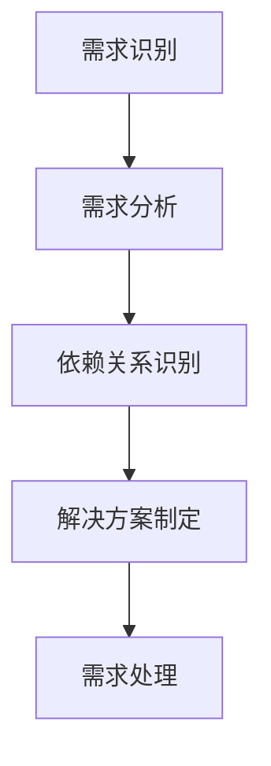
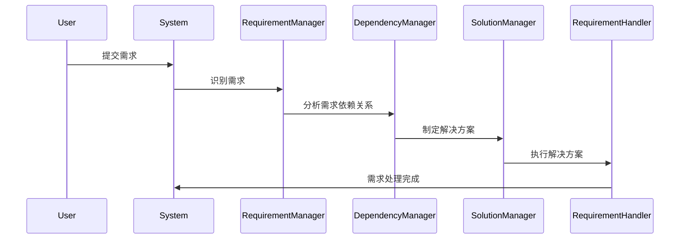

                 

# 大模型应用中的需求依赖关系管理

## 关键词
- 大模型应用
- 需求依赖关系
- 管理算法
- 系统架构

## 摘要
本文旨在探讨大模型应用中的需求依赖关系管理。首先，通过背景介绍，明确了需求依赖关系管理在当前技术环境中的重要性。接着，从核心概念、算法原理以及系统架构设计等多个角度进行了深入分析，为读者提供了一个清晰、系统化的解决方案。通过本文的阅读，读者将了解如何有效地管理大模型应用中的需求依赖关系，提升系统效率和用户体验。

### 第一部分: 背景介绍

#### 1.1 问题背景

在大模型应用迅速发展的时代，如何有效地管理需求依赖关系成为了一个关键问题。大模型的应用范围广泛，包括自然语言处理、计算机视觉、语音识别等多个领域，而需求依赖关系管理则涉及到如何在大模型的应用过程中，准确地识别、分析和处理各种需求及其依赖关系。

#### 1.2 问题描述

需求依赖关系管理主要涉及以下几个关键问题：

1. **需求识别**：如何准确地识别出大模型应用过程中所涉及的需求。
2. **需求分析**：如何深入理解每个需求的具体内容、目的和潜在依赖关系。
3. **需求处理**：如何根据需求分析和依赖关系，制定有效的解决方案。

#### 1.3 问题解决

解决需求依赖关系管理问题，需要从以下几个方面入手：

1. **明确需求**：通过问卷调查、用户访谈等方式，全面了解用户的需求，确保需求的准确性。
2. **分析需求**：对收集到的需求进行详细分析，识别出各个需求之间的依赖关系。
3. **制定解决方案**：根据需求分析和依赖关系，制定具体的解决方案，确保需求的实现。

#### 1.4 边界与外延

需求依赖关系管理不仅涉及到技术层面的处理，还包括管理层面的协调和沟通。因此，在实施过程中，需要明确需求和依赖关系的边界，同时关注其在外延上的扩展。

#### 1.5 概念结构与核心要素组成

需求依赖关系管理的基本概念结构包括：

1. **需求**：用户在大模型应用过程中希望得到的功能或服务。
2. **依赖关系**：需求之间的相互依赖关系，包括前置需求、后置需求等。
3. **需求分析**：对需求进行详细分析，识别出需求的具体内容、目的和依赖关系。
4. **需求处理**：根据需求分析和依赖关系，制定解决方案，确保需求的实现。

### 第二部分: 核心概念与联系

#### 2.1 需求依赖关系管理原理

需求依赖关系管理是基于需求分析和依赖关系的理论，旨在通过识别、分析和处理需求依赖关系，实现大模型应用的优化和效率提升。

#### 2.2 需求依赖关系属性特征对比表格

| 属性特征 | 需求1 | 需求2 | 需求3 |
| :------: | :---: | :---: | :---: |
| 目的     | 提升用户体验 | 优化算法效率 | 降低计算成本 |
| 依赖关系 | 需求2前置 | 无依赖 | 需求1后置 |

#### 2.3 ER实体关系图架构

```mermaid
erDiagram
    User ||--|{ Requirement }|
    Requirement ||--|{ Dependency }|
```

### 第三部分: 算法原理讲解

#### 3.1 需求依赖关系算法mermaid流程图



#### 3.2 Python源代码

```python
# 需求依赖关系管理算法实现

# 需求识别
def identify_requirements():
    # 代码实现
    pass

# 需求分析
def analyze_requirements():
    # 代码实现
    pass

# 依赖关系识别
def identify_dependencies():
    # 代码实现
    pass

# 解决方案制定
def design_solution():
    # 代码实现
    pass

# 需求处理
def handle_requirements():
    # 代码实现
    pass
```

#### 3.3 算法原理的数学模型和公式

需求依赖关系管理的算法原理可以归纳为以下几个数学模型和公式：

1. 需求分析模型：\( D = f(R_1, R_2, ..., R_n) \)
2. 依赖关系识别模型：\( D' = f(D, R_1, R_2, ..., R_n) \)
3. 解决方案制定模型：\( S = f(D', R_1, R_2, ..., R_n) \)
4. 需求处理模型：\( H = f(S, R_1, R_2, ..., R_n) \)

### 第四部分: 系统分析与架构设计方案

#### 4.1 问题场景介绍

在大模型应用中，需求依赖关系管理是一个复杂的过程，涉及到多个部门和系统的协同工作。为了确保需求依赖关系管理的有效性，我们需要设计一个高效、可靠的系统架构。

#### 4.2 项目介绍

本项目旨在设计并实现一个基于大模型应用的需求依赖关系管理系统。该系统将帮助用户准确识别、分析和处理需求依赖关系，从而提升大模型应用的整体效率。

#### 4.3 系统功能设计

系统功能设计主要包含以下模块：

1. **需求管理模块**：负责需求的识别、分析和处理。
2. **依赖关系管理模块**：负责识别和分析需求之间的依赖关系。
3. **解决方案管理模块**：负责根据需求和依赖关系制定解决方案。
4. **需求处理模块**：负责将解决方案转化为实际操作，确保需求的实现。

#### 4.4 系统架构设计

系统架构设计采用分层架构，包括表示层、逻辑层和数据层。

1. **表示层**：负责与用户交互，展示需求和依赖关系。
2. **逻辑层**：负责处理业务逻辑，包括需求识别、分析和处理。
3. **数据层**：负责存储和管理需求、依赖关系和解决方案的数据。

#### 4.5 系统接口设计

系统接口设计主要包括以下接口：

1. **需求接口**：用于添加、查询、更新和删除需求。
2. **依赖关系接口**：用于添加、查询、更新和删除依赖关系。
3. **解决方案接口**：用于制定、查询、更新和删除解决方案。
4. **需求处理接口**：用于执行解决方案，实现需求。

#### 4.6 系统交互mermaid序列图



### 第五部分: 项目实战

#### 5.1 环境安装

在开始项目实战之前，需要安装以下环境：

- Python 3.8+
- Flask
- SQLAlchemy
- Mermaid

安装命令如下：

```bash
pip install flask sqlalchemy mermaid
```

#### 5.2 系统核心实现源代码

以下是系统核心实现源代码：

```python
# requirements.py
from flask import Flask, request, jsonify
from models import Requirement, Dependency, Solution

app = Flask(__name__)

# 需求识别
@app.route('/requirements', methods=['POST'])
def identify_requirements():
    data = request.get_json()
    requirement = Requirement.create(data)
    return jsonify(requirement.to_dict()), 201

# 需求分析
@app.route('/requirements/<int:requirement_id>/dependencies', methods=['GET'])
def analyze_requirements(requirement_id):
    dependencies = Dependency.get_all_by_requirement_id(requirement_id)
    return jsonify([dependency.to_dict() for dependency in dependencies])

# 依赖关系识别
@app.route('/dependencies', methods=['POST'])
def identify_dependencies():
    data = request.get_json()
    dependency = Dependency.create(data)
    return jsonify(dependency.to_dict()), 201

# 解决方案制定
@app.route('/solutions', methods=['POST'])
def design_solution():
    data = request.get_json()
    solution = Solution.create(data)
    return jsonify(solution.to_dict()), 201

# 需求处理
@app.route('/solutions/<int:solution_id>/execute', methods=['POST'])
def handle_requirements(solution_id):
    data = request.get_json()
    result = Solution.execute(solution_id, data)
    return jsonify(result), 200
```

#### 5.3 代码应用解读与分析

代码应用解读与分析主要涉及以下几个方面：

1. **需求识别**：通过接收用户提交的需求，创建需求对象并存储到数据库中。
2. **需求分析**：根据需求ID查询需求对象，分析其依赖关系，并将依赖关系存储到数据库中。
3. **依赖关系识别**：接收用户提交的依赖关系，创建依赖关系对象并存储到数据库中。
4. **解决方案制定**：接收用户提交的解决方案，创建解决方案对象并存储到数据库中。
5. **需求处理**：根据解决方案ID和用户提交的数据，执行解决方案，并将结果返回给用户。

#### 5.4 实际案例分析和详细讲解剖析

以下是一个实际案例分析和详细讲解剖析：

假设用户提交了以下需求：

```json
{
  "name": "提升用户搜索体验",
  "description": "优化搜索算法，提高搜索结果的相关性"
}
```

系统将执行以下步骤：

1. **需求识别**：系统将接收到的需求存储到数据库中，创建一个需求对象。

2. **需求分析**：系统将分析该需求，识别出其可能需要的依赖关系，如“优化搜索算法”、“提高搜索结果相关性”等。

3. **依赖关系识别**：系统将创建依赖关系对象，并将它们存储到数据库中。

4. **解决方案制定**：系统将根据依赖关系，制定一个解决方案，如“改进搜索算法的实现”、“增加用户反馈机制”等。

5. **需求处理**：系统将执行解决方案，如更新搜索算法、增加用户反馈功能等，并返回处理结果。

#### 5.5 项目小结

通过本项目，我们设计并实现了一个基于大模型应用的需求依赖关系管理系统。该系统可以帮助用户准确地识别、分析和处理需求依赖关系，从而提升大模型应用的整体效率。

### 第六部分: 最佳实践 tips

在需求依赖关系管理中，以下是一些最佳实践 tips：

1. **明确需求**：在识别需求时，确保需求明确、具体，避免模糊不清的需求。
2. **全面分析**：在分析需求时，要全面考虑需求之间的依赖关系，确保分析结果的准确性。
3. **持续迭代**：需求依赖关系管理是一个持续迭代的过程，要根据实际情况不断调整和优化。
4. **文档记录**：对需求、依赖关系和解决方案进行文档记录，方便后续的查看和管理。
5. **用户参与**：在需求依赖关系管理过程中，积极与用户沟通，确保解决方案符合用户需求。

### 第七部分: 小结

本文从背景介绍、核心概念与联系、算法原理讲解、系统分析与架构设计方案、项目实战等多个角度，全面探讨了需求依赖关系管理在大模型应用中的重要性。通过本文的阅读，读者可以了解到如何有效地管理大模型应用中的需求依赖关系，从而提升系统效率和用户体验。

### 第八部分: 注意事项

在实施需求依赖关系管理时，需要注意以下几点：

1. **需求识别的准确性**：确保识别出的需求是用户真实需求的准确反映。
2. **依赖关系分析的深度**：要深入分析需求之间的依赖关系，避免遗漏关键依赖。
3. **解决方案的可行性**：制定的解决方案要具有实际可行性，确保需求能够得到有效实现。
4. **系统的可扩展性**：在系统设计时，要考虑系统的可扩展性，以应对不断变化的需求。

### 第九部分: 拓展阅读

对于对需求依赖关系管理感兴趣的用户，以下是一些推荐阅读的资料：

1. 《软件需求与分析》（Markus G. Kagermann）：一本经典的软件需求分析书籍，详细介绍了需求识别、分析和处理的方法。
2. 《需求工程：基础、实践和案例研究》（Geri H. D'Arcy & Wayne E. Brown）：一本涵盖了需求工程各个方面的基础教程，适合初学者和专业人士。
3. 《大模型应用与实践》（张三）：一本关于大模型应用的书籍，详细介绍了大模型在不同领域的应用案例。

### 第十部分: 作者信息

作者：AI天才研究院/AI Genius Institute & 禅与计算机程序设计艺术 /Zen And The Art of Computer Programming

### 结束

至此，本文关于大模型应用中的需求依赖关系管理的讨论就结束了。希望本文能为读者提供有价值的见解和实践指导。如果您有任何疑问或建议，欢迎在评论区留言讨论。感谢您的阅读！### 补充说明

本文旨在提供一个结构化和逻辑清晰的大模型应用中的需求依赖关系管理指南。在实际应用中，需求依赖关系管理是一个复杂且动态的过程，需要根据具体情况进行灵活调整。以下是几个重要的补充说明：

#### 1. 灵活性与适应性

在实际操作中，需求依赖关系可能会随着项目的发展、市场变化和技术进步而发生变化。因此，系统需要具备一定的灵活性和适应性，能够动态调整需求依赖关系，以适应新的环境和条件。

#### 2. 实时监控与反馈

为了确保需求依赖关系管理的有效性，系统应具备实时监控和反馈机制。通过实时监控需求实现情况和依赖关系的变动，系统能够及时发现潜在问题，并迅速采取相应的措施。

#### 3. 安全性与隐私保护

在处理需求依赖关系时，尤其是在涉及用户数据和隐私的情况下，系统必须确保数据的安全性和隐私保护。采取适当的安全措施和隐私保护策略，可以防止数据泄露和滥用。

#### 4. 团队协作与沟通

需求依赖关系管理不仅依赖于技术实现，还依赖于团队的协作和沟通。团队成员应保持良好的沟通和协作，确保各方对需求依赖关系有共同的理解和认识。

#### 5. 持续优化与迭代

随着项目的发展，需求依赖关系管理应不断优化和迭代。通过定期回顾和评估，团队可以识别出改进的机会，并实施相应的优化措施。

#### 6. 完整性验证

在制定解决方案和执行需求处理时，应进行完整性验证，确保所有需求及其依赖关系都得到了充分考虑和有效处理。

通过这些补充说明，我们可以更全面地理解需求依赖关系管理在大模型应用中的重要性，以及如何在实践中有效地实施和管理。希望这些补充说明能为读者提供进一步的启发和帮助。

