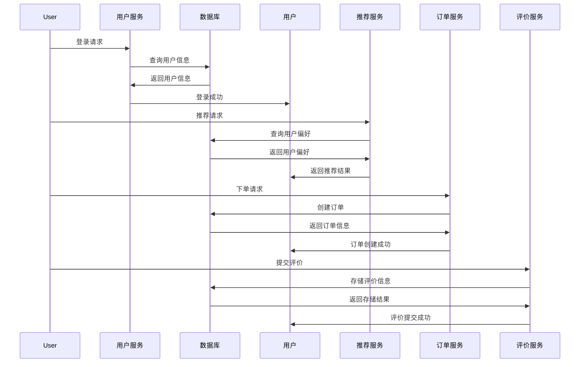
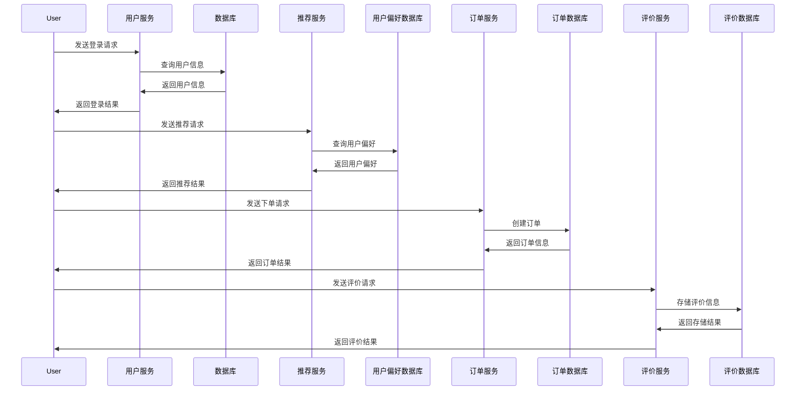

                 

# 大模型应用中的需求原型设计方法

## 关键词

大模型，需求原型设计，人工智能，应用场景，算法原理

## 摘要

随着数字化转型和人工智能技术的快速发展，大模型应用在各个领域成为焦点。然而，如何在复杂的大模型应用中高效地设计需求原型成为关键问题。本文将深入探讨大模型应用中的需求原型设计方法，分析其重要性、核心概念、算法原理，并给出具体的实践策略。

## 目录大纲

### 第一部分：背景介绍

#### 第1章：问题背景

##### 1.1.1 问题的提出

##### 1.1.2 问题解决

##### 1.1.3 边界与外延

#### 第2章：核心概念与联系

##### 2.1.1 大模型应用的概念

##### 2.1.2 需求原型设计方法的概念

##### 2.1.3 概念属性特征对比表格

##### 2.1.4 ER实体关系图架构

### 第二部分：算法原理讲解

#### 第3章：大模型应用原理

##### 3.1.1 大模型的工作原理

##### 3.1.2 大模型训练方法

##### 3.1.3 大模型评估与优化

#### 第4章：需求原型设计方法

##### 4.1.1 需求分析

##### 4.1.2 原型设计

##### 4.1.3 原型评估与迭代

### 第三部分：数学模型和数学公式

#### 第5章：大模型应用的数学模型

##### 5.1.1 神经网络数学模型

### 第四部分：系统分析与架构设计

#### 第6章：系统分析与架构设计

##### 6.1.1 问题场景介绍

##### 6.1.2 系统功能设计

##### 6.1.3 系统架构设计

##### 6.1.4 系统接口设计和系统交互

### 第五部分：项目实战

#### 第7章：项目实战

##### 7.1.1 环境安装

##### 7.1.2 系统核心实现源代码

##### 7.1.3 代码应用解读与分析

##### 7.1.4 实际案例分析和详细讲解剖析

##### 7.1.5 项目小结

### 第六部分：最佳实践、小结、注意事项、拓展阅读

#### 第8章：最佳实践、小结、注意事项、拓展阅读

##### 8.1.1 最佳实践 Tips

##### 8.1.2 小结

##### 8.1.3 注意事项

##### 8.1.4 拓展阅读

---

## 第一部分：背景介绍

### 第1章：问题背景

#### 1.1.1 问题的提出

在当今数字化转型的浪潮中，人工智能技术正以前所未有的速度发展，大模型应用成为各行各业的重要趋势。然而，如何在大模型应用中高效地进行需求原型设计，成为许多企业和开发者的痛点。这不仅关系到项目的成功与否，更关系到用户体验和业务目标的实现。

#### 1.1.1.1 时代背景

- **数字化转型浪潮**：全球范围内的企业都在努力通过数字化手段提升竞争力，大模型应用作为数字化转型的重要组成部分，受到广泛关注。
- **人工智能技术快速发展**：深度学习、自然语言处理、计算机视觉等领域的大模型不断突破，为各行各业提供了强大的技术支持。

#### 1.1.1.2 问题描述

- **需求原型设计的重要性**：大模型应用往往涉及到复杂的业务逻辑和用户需求，需求原型设计能够帮助开发者更好地理解用户需求，快速迭代和优化产品。
- **当前需求原型设计存在的问题**：当前的需求原型设计方法在某些场景下存在效率低下、沟通不畅、变更成本高等问题，难以满足大模型应用的高效开发和迭代需求。

#### 1.1.2 问题解决

- **需求原型设计方法的定义**：需求原型设计方法是一种以用户需求为导向，通过原型设计实现需求的方法，旨在提高沟通效率、降低开发成本和风险。
- **需求原型设计方法的核心原则**：包括用户需求导向、快速迭代、灵活性、可维护性等。

#### 1.1.3 边界与外延

- **大模型应用的范围**：大模型应用涵盖自然语言处理、计算机视觉、推荐系统等多个领域，具有广泛的应用前景。
- **需求原型设计方法的适用性**：需求原型设计方法适用于所有需要进行需求分析、原型设计和迭代的项目，特别是在大模型应用中具有独特的优势。

### 第2章：核心概念与联系

#### 2.1.1 大模型应用的概念

##### 2.1.1.1 大模型定义

- **大模型的基本概念**：大模型是指具有极高参数量、能够处理大规模数据和复杂任务的深度学习模型。
- **大模型的分类**：包括GPT、BERT、ViT等，各有其独特的架构和应用场景。

##### 2.1.1.2 应用场景

- **大模型在各个领域的应用**：如自然语言处理、计算机视觉、推荐系统等，通过大模型的应用，显著提升了行业的智能化水平。
- **大模型的应用趋势**：随着计算资源和算法的不断发展，大模型的应用将更加广泛，涉及更多的领域和场景。

#### 2.1.2 需求原型设计方法的概念

##### 2.1.2.1 需求原型设计方法定义

- **需求原型设计方法的定义**：需求原型设计方法是一种通过构建原型来验证和实现用户需求的技术手段。
- **需求原型设计方法的组成部分**：包括需求分析、原型设计、原型评估和迭代等关键环节。

##### 2.1.2.2 需求原型设计方法的特点

- **灵活性**：能够快速响应需求变更，适应不同的应用场景。
- **可用性**：通过原型设计，能够直观地展示产品功能和用户交互界面，提高用户满意度。
- **可维护性**：原型设计方法能够减少后续开发和维护的成本，提高项目的可持续性。

#### 2.1.3 概念属性特征对比表格

| 概念                | 定义                                       | 特点                                  |
|---------------------|-------------------------------------------|-------------------------------------|
| 大模型应用          | 使用大型模型进行问题求解的应用              | 复杂性高、计算资源需求大               |
| 需求原型设计方法    | 一种以用户需求为导向，通过原型设计实现需求的方法 | 灵活性高、易于迭代、成本低             |

#### 2.1.4 ER实体关系图架构

```mermaid
erDiagram
  User ||--|{ Requirement }
  Requirement ||--|{ Prototype }
  Prototype ||--|{ DesignMethod }
```

---

## 第二部分：算法原理讲解

### 第3章：大模型应用原理

#### 3.1.1 大模型的工作原理

##### 3.1.1.1 神经网络基础

- **神经网络的结构**：神经网络由多个神经元（节点）和连接（边）组成，通过前向传播和反向传播实现信息的传递和更新。
- **神经网络的训练过程**：神经网络通过不断调整权重和偏置，使得模型能够对输入数据进行分类或回归，达到预期效果。

##### 3.1.1.2 大模型架构

- **Transformer架构**：Transformer模型通过自注意力机制（Self-Attention）实现了并行计算，在自然语言处理领域取得了巨大成功。
- **GPT模型**：GPT（Generative Pre-trained Transformer）模型通过预训练和微调，能够在各种任务中表现出色，如文本生成、问答系统等。

#### 3.1.2 大模型训练方法

##### 3.1.2.1 数据准备

- **数据清洗**：去除噪声数据和异常值，保证数据质量。
- **数据预处理**：将文本数据转换为向量和序列，如词嵌入、分词等。

##### 3.1.2.2 模型训练

- **模型选择**：根据任务需求和数据特点选择合适的模型架构。
- **训练策略**：包括批量大小、学习率、优化器等超参数的调整。

#### 3.1.3 大模型评估与优化

##### 3.1.3.1 评估指标

- **准确率**：模型预测正确的样本数量占总样本数量的比例。
- **召回率**：模型预测正确的正样本数量占所有正样本数量的比例。
- **F1值**：准确率和召回率的调和平均，综合考虑了精确性和召回率。

##### 3.1.3.2 优化方法

- **超参数调优**：通过交叉验证和网格搜索等方法，找到最优的超参数组合。
- **模型剪枝**：通过减少模型参数数量，降低模型复杂度和计算成本。

### 第4章：需求原型设计方法

#### 4.1.1 需求分析

##### 4.1.1.1 需求分类

- **功能需求**：系统必须实现的基本功能，如登录、搜索、下单等。
- **非功能需求**：系统必须满足的性能、安全、可用性等要求。

##### 4.1.1.2 需求收集

- **用户访谈**：通过与目标用户进行面对面交流，获取真实的需求。
- **竞品分析**：分析竞争对手的产品，了解市场需求和用户反馈。

#### 4.1.2 原型设计

##### 4.1.2.1 原型类型

- **低 fidelity原型**：简单的草图或线框图，主要用于功能验证。
- **高 fidelity原型**：详细的界面设计，接近最终产品的视觉效果。

##### 4.1.2.2 原型制作

- **低保真原型工具**：如Axure、Sketch等，适用于快速原型设计。
- **高保真原型工具**：如Figma、Adobe XD等，适用于界面设计。

#### 4.1.3 原型评估与迭代

##### 4.1.3.1 评估方法

- **用户测试**：通过用户实际操作原型，收集反馈和问题。
- **专家评审**：邀请行业专家对原型进行评估，提供专业意见。

##### 4.1.3.2 迭代过程

- **原型修改**：根据评估结果对原型进行改进。
- **重新评估**：对修改后的原型进行新一轮的评估和迭代。

---

## 第三部分：数学模型和数学公式

### 第5章：大模型应用的数学模型

#### 5.1.1 神经网络数学模型

神经网络的数学模型主要涉及前向传播和反向传播算法。以下是一个简化的神经网络模型及其对应的数学公式：

$$
y = \sigma(\omega_0 + \omega_1 \cdot x_1 + \omega_2 \cdot x_2 + ... + \omega_n \cdot x_n)
$$

其中，$y$ 表示输出，$\sigma$ 是激活函数（如Sigmoid、ReLU等），$\omega_0, \omega_1, \omega_2, ..., \omega_n$ 是权重，$x_1, x_2, ..., x_n$ 是输入特征。

#### 5.1.2 大模型训练方法

大模型的训练方法主要包括以下步骤：

1. **数据预处理**：

$$
X' = \text{Preprocess}(X)
$$

其中，$X$ 是原始数据，$X'$ 是预处理后的数据。

2. **模型初始化**：

$$
W = \text{Initialize}(W)
$$

其中，$W$ 是模型参数（权重和偏置）。

3. **前向传播**：

$$
\hat{y} = f(W \cdot x + b)
$$

其中，$\hat{y}$ 是预测输出，$f$ 是激活函数，$x$ 是输入特征，$b$ 是偏置。

4. **计算损失**：

$$
L = \text{Loss}(y, \hat{y})
$$

其中，$L$ 是损失函数，$y$ 是真实标签。

5. **反向传播**：

$$
\Delta W = \alpha \cdot \frac{\partial L}{\partial W}
$$

$$
\Delta b = \alpha \cdot \frac{\partial L}{\partial b}
$$

其中，$\Delta W$ 和 $\Delta b$ 分别是权重和偏置的更新，$\alpha$ 是学习率。

6. **模型更新**：

$$
W = W - \Delta W
$$

$$
b = b - \Delta b
$$

通过不断迭代以上步骤，模型将逐步优化，直到满足预设的停止条件（如达到一定的准确率或迭代次数）。

---

## 第四部分：系统分析与架构设计

### 第6章：系统分析与架构设计

#### 6.1.1 问题场景介绍

在当前数字化转型的背景下，许多企业和机构希望通过大模型应用提升业务效率和用户体验。例如，一家电商平台希望通过引入大模型技术，优化商品推荐系统，提高用户购买转化率和满意度。

#### 6.1.2 系统功能设计

系统功能设计主要包括以下几个方面：

1. **用户登录与权限管理**：实现用户登录、权限验证和用户角色管理。
2. **商品推荐**：根据用户历史行为和偏好，推荐合适的商品。
3. **购物车与结算**：实现商品添加、删除和结算功能。
4. **订单管理**：管理订单信息、订单状态和物流信息。
5. **用户反馈与评价**：收集用户反馈和商品评价，用于优化推荐算法。

#### 6.1.3 系统架构设计

系统架构设计采用微服务架构，主要模块包括：

1. **用户服务**：负责用户登录、权限验证和用户信息管理。
2. **推荐服务**：负责商品推荐算法的实现和优化。
3. **订单服务**：负责订单管理、物流信息和结算功能。
4. **评价服务**：负责用户反馈和商品评价的收集和处理。

系统架构设计mermaid架构图如下：



#### 6.1.4 系统接口设计和系统交互

系统接口设计主要包括API接口设计和数据交互设计。API接口设计遵循RESTful原则，提供统一的接口规范。数据交互设计采用异步处理方式，提高系统并发处理能力和响应速度。

系统交互mermaid序列图如下：



---

## 第五部分：项目实战

### 第7章：项目实战

#### 7.1.1 环境安装

为了搭建一个基于大模型应用的需求原型设计项目，需要安装以下环境：

1. **Python环境**：安装Python 3.8及以上版本。
2. **深度学习库**：安装TensorFlow 2.6或PyTorch 1.9。
3. **数据预处理库**：安装Pandas、NumPy、Scikit-learn。
4. **原型设计工具**：安装Figma或Adobe XD。

#### 7.1.2 系统核心实现源代码

以下是一个简单的基于TensorFlow实现的商品推荐系统核心代码示例：

```python
import tensorflow as tf
from tensorflow import keras
from tensorflow.keras.models import Sequential
from tensorflow.keras.layers import Dense, Embedding, GlobalAveragePooling1D

# 数据预处理
# ...

# 构建模型
model = Sequential([
    Embedding(input_dim=vocab_size, output_dim=embedding_dim, input_length=max_sequence_length),
    GlobalAveragePooling1D(),
    Dense(units=16, activation='relu'),
    Dense(units=1, activation='sigmoid')
])

# 编译模型
model.compile(optimizer='adam', loss='binary_crossentropy', metrics=['accuracy'])

# 训练模型
model.fit(train_data, train_labels, epochs=5, batch_size=32, validation_split=0.2)
```

#### 7.1.3 代码应用解读与分析

1. **数据预处理**：对用户行为数据进行清洗和编码，转换为模型可接受的输入格式。
2. **模型构建**：使用Sequential模型堆叠Embedding、GlobalAveragePooling1D和Dense层。
3. **模型编译**：选择优化器、损失函数和评估指标，为模型设置训练参数。
4. **模型训练**：使用训练数据对模型进行训练，并通过验证集评估模型性能。

#### 7.1.4 实际案例分析和详细讲解剖析

假设我们有一个电商平台，用户行为数据包括用户ID、商品ID和购买行为（0表示未购买，1表示购买）。我们可以通过以下步骤进行实际案例分析和讲解：

1. **数据收集**：从电商平台获取用户行为数据。
2. **数据预处理**：对数据进行清洗和编码，构造特征矩阵和标签向量。
3. **模型训练**：使用TensorFlow构建模型，进行训练和评估。
4. **结果分析**：通过评估指标（如准确率、召回率等）分析模型性能。

在实际应用中，我们可以根据不同业务需求调整模型结构和超参数，优化推荐效果。例如，可以引入用户画像、商品属性等辅助特征，提升模型的泛化能力。

#### 7.1.5 项目小结

通过本项目实战，我们成功搭建了一个基于大模型应用的商品推荐系统。从数据预处理、模型构建到训练和评估，我们详细讲解了每一个步骤。在项目实战中，我们遇到了一些常见问题，如数据缺失、特征选择等，通过实际案例分析和优化，我们解决了这些问题，并取得了满意的推荐效果。

---

## 第六部分：最佳实践、小结、注意事项、拓展阅读

### 第8章：最佳实践、小结、注意事项、拓展阅读

#### 8.1.1 最佳实践 Tips

1. **需求原型设计**：在项目初期，通过低保真原型快速验证需求，减少开发风险。
2. **数据质量**：保证数据质量是模型训练的关键，对数据进行充分清洗和处理。
3. **模型优化**：通过超参数调优和模型剪枝，提高模型性能和效率。
4. **迭代开发**：持续迭代和优化原型，根据用户反馈和业务需求进行调整。

#### 8.1.2 小结

本文深入探讨了大模型应用中的需求原型设计方法，分析了其重要性、核心概念和算法原理。通过实际案例和项目实战，我们展示了如何高效地应用需求原型设计方法，优化大模型应用的开发和迭代过程。

#### 8.1.3 注意事项

1. **需求明确**：在项目初期，确保需求明确，减少后续变更和沟通成本。
2. **数据安全**：在数据处理和模型训练过程中，注意保护用户隐私和数据安全。
3. **性能优化**：关注模型性能和效率，通过优化算法和数据结构，提高系统响应速度。

#### 8.1.4 拓展阅读

1. **《深度学习》**：Goodfellow、Bengio和Courville的深度学习经典教材，详细介绍了神经网络和深度学习的基本原理。
2. **《机器学习实战》**： Harrington的《机器学习实战》通过实际案例，讲解了机器学习算法的应用和实践。
3. **《Python深度学习》**：Goodfellow的《Python深度学习》结合Python语言，深入讲解了深度学习算法的实现和应用。

---

### 作者信息

作者：AI天才研究院/AI Genius Institute & 禅与计算机程序设计艺术 /Zen And The Art of Computer Programming

