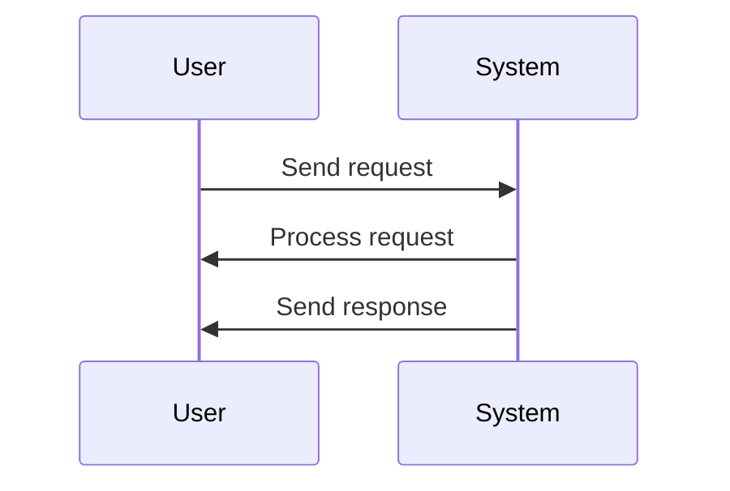
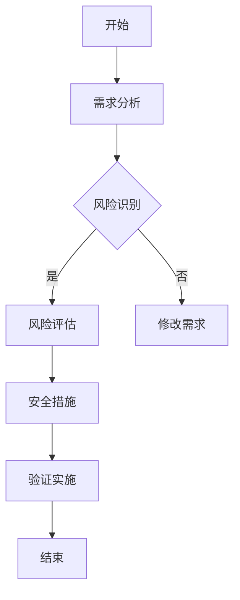
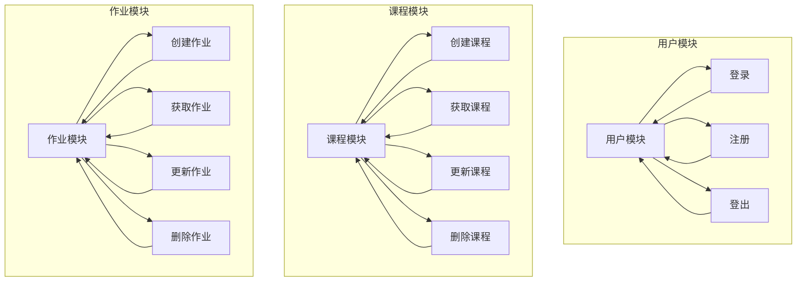
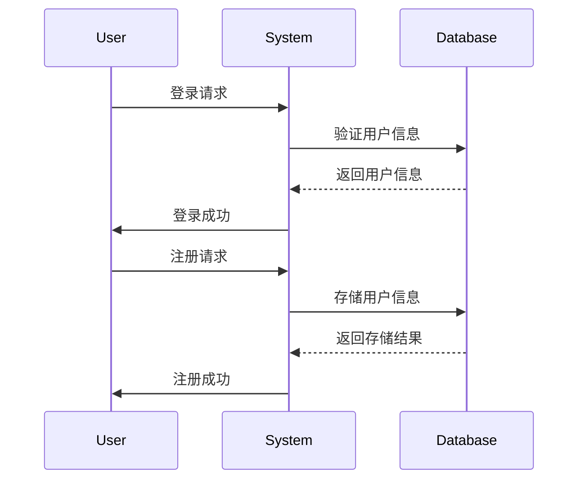
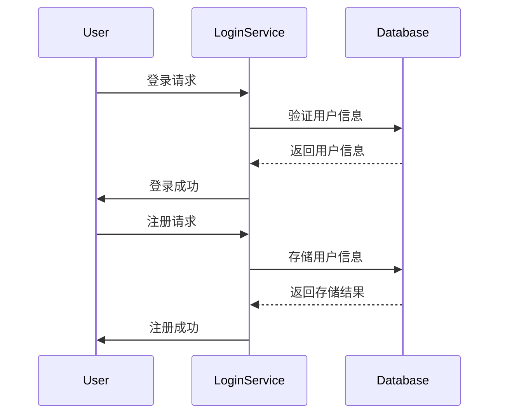
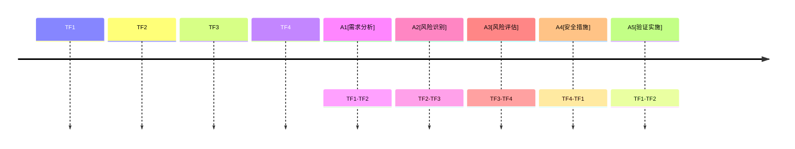

                 

# 大模型应用中的需求安全性评估方法

## 关键词
- 大模型应用
- 需求安全性评估
- 静态评估方法
- 动态评估方法
- 数学模型
- 系统分析与架构设计

## 摘要
本文旨在探讨大模型应用中的需求安全性评估方法。随着人工智能技术的快速发展，大模型的应用越来越广泛，但其安全性问题也日益凸显。本文首先介绍了大模型应用的背景和需求安全性的重要性，然后详细阐述了需求安全性评估的核心概念和方法。通过数学模型和Python源代码的讲解，本文展示了如何进行需求安全性评估，并分析了相关算法原理。最后，本文通过系统分析与架构设计，以及实际案例的实战，给出了需求安全性评估的最佳实践和未来展望。

## 引言

### 问题背景
随着深度学习技术的进步，大模型（如GPT、BERT等）的应用在各个领域得到了飞速发展。这些模型在自然语言处理、图像识别、推荐系统等方面展现出了强大的能力，极大地推动了人工智能技术的创新。然而，随着模型规模的扩大，其复杂性也不断增加，导致潜在的安全性问题逐渐显现。大模型的安全性不仅关系到用户数据的隐私保护，还可能影响整个系统的稳定性和可靠性。

### 需求安全性的重要性
需求安全性是确保大模型应用安全性的核心。在模型开发过程中，需求安全性的评估可以帮助识别潜在的安全风险，从而采取相应的预防措施。需求安全性评估能够确保模型按照预期运行，避免因为需求设计不合理而导致的安全漏洞。

### 需求安全性评估的挑战
大模型应用中的需求安全性评估面临着诸多挑战。首先，大模型的复杂性使得需求安全性的评估变得更加困难。其次，不同领域和应用场景下的需求安全性评估方法可能存在显著差异，需要针对具体情况进行定制。此外，评估方法的可靠性和有效性也是亟待解决的问题。

## 第一部分: 引言

### 第1章: 问题背景与核心概念

#### 1.1 问题背景
随着人工智能技术的快速发展，大模型的应用已经渗透到各个行业，如医疗、金融、交通等。这些模型在提高效率、降低成本、增强用户体验等方面发挥了重要作用。然而，大模型在处理数据时的复杂性和庞大的数据量，使得其安全性的保障变得尤为重要。需求安全性评估作为保障大模型安全性的重要手段，其重要性不言而喻。

#### 1.2 核心概念介绍
需求安全性评估涉及多个核心概念，包括大模型应用、需求安全性、需求安全性评估等。大模型应用是指利用大规模的神经网络模型在各个领域进行任务处理的过程。需求安全性是指在大模型应用中，确保模型设计、实现和运行过程中不会出现安全漏洞的能力。需求安全性评估则是通过一系列方法和技术，对大模型应用的需求安全性进行评价和验证。

### 第2章: 需求安全性评估方法概述

#### 2.1 需求安全性评估的基本概念
需求安全性评估的目标是识别和消除大模型应用中的潜在安全风险。评估的基本概念包括评估目标、评估原则和评估方法。评估目标主要是确保模型设计满足安全需求，评估原则包括完整性、一致性、可用性和可靠性，评估方法则包括静态评估和动态评估。

#### 2.2 需求安全性评估的分类
根据评估方法的不同，需求安全性评估可以分为静态评估方法和动态评估方法。静态评估方法主要通过对代码和设计文档的分析来评估需求安全性，如代码审查、设计审查等。动态评估方法则通过实际运行模型来检测其安全性，如渗透测试、性能测试等。

## 第二部分: 算法原理讲解

### 第3章: 需求安全性评估算法原理

#### 3.1 基本算法原理
需求安全性评估的基本算法主要包括以下几个步骤：定义需求、识别威胁、评估风险、制定安全措施和验证实施效果。首先，根据应用场景定义明确的需求；然后，识别可能威胁需求安全性的各种因素；接着，对每个威胁进行风险评估，确定其严重程度和可能性；在此基础上，制定相应的安全措施来降低风险；最后，通过验证确保安全措施的有效性。

#### 3.2 数学模型与公式
需求安全性评估的数学模型可以表示为：
$$
\text{Risk} = \text{Severity} \times \text{Likelihood}
$$
其中，Risk表示风险水平，Severity表示威胁的严重程度，Likelihood表示威胁发生的可能性。

#### 3.3 算法讲解
首先，通过代码审查和设计审查来识别潜在的安全威胁。然后，使用渗透测试和性能测试来评估这些威胁的风险水平。接着，根据评估结果制定相应的安全措施，如代码加密、数据加密等。最后，通过实际运行模型来验证安全措施的有效性。

## 第三部分: 系统分析与架构设计

### 第4章: 需求安全性评估系统分析

#### 4.1 系统场景介绍
在本文中，我们将以一个大型在线教育平台为例，介绍需求安全性评估的系统场景。该平台提供在线课程学习、作业提交、考试等功能，用户数据包括个人信息、学习记录、考试成绩等。需求安全性评估的目标是确保用户数据的安全性，防止数据泄露、篡改和滥用。

#### 4.2 系统架构设计
系统架构设计包括以下几个模块：用户管理模块、课程管理模块、作业管理模块、考试管理模块和安全管理模块。用户管理模块负责用户的注册、登录和权限管理；课程管理模块负责课程的创建、更新和删除；作业管理模块负责作业的发布、提交和批改；考试管理模块负责考试的组织和成绩记录；安全管理模块负责用户数据的加密、备份和恢复。

### 第5章: 实际案例分析与需求安全性评估

#### 5.1 环境安装与配置
为了进行需求安全性评估，我们需要搭建一个模拟的在线教育平台环境。首先，我们需要安装并配置服务器，包括操作系统、数据库和应用程序。然后，我们需要安装并配置相关的安全工具，如防火墙、入侵检测系统和数据加密工具。

#### 5.2 需求安全性评估实施
在环境搭建完成后，我们可以开始进行需求安全性评估。首先，我们通过代码审查和设计审查来识别潜在的安全威胁。然后，我们使用渗透测试工具对平台进行测试，以检测是否存在未授权访问、数据泄露等安全问题。接着，我们根据测试结果制定相应的安全措施，如代码加密、数据加密和访问控制等。最后，我们通过实际运行模型来验证安全措施的有效性。

### 第6章: 最佳实践

#### 6.1 实践技巧与注意事项
在进行需求安全性评估时，我们需要注意以下几点：
- 评估前，确保需求明确、设计合理，以减少潜在的安全隐患。
- 评估过程中，要综合考虑各种威胁因素，进行全面的评估。
- 评估后，及时制定并实施相应的安全措施，确保系统安全运行。

#### 6.2 拓展阅读
为了更好地理解需求安全性评估，您可以参考以下文献：
- 《大模型应用中的需求安全性评估方法》
- 《人工智能安全：技术、实践与挑战》
- 《网络安全：原理与实践》

### 第7章: 小结

#### 7.1 书籍总结
本文从问题背景、核心概念、算法原理、系统分析与架构设计、实际案例分析和最佳实践等方面，全面介绍了大模型应用中的需求安全性评估方法。通过本文的阅读，您可以了解到需求安全性评估的重要性，掌握相关的方法和技术。

#### 7.2 未来展望
随着人工智能技术的不断进步，需求安全性评估的方法和技术也将不断发展。未来的研究可以关注以下几个方面：
- 开发更高效、更智能的评估工具和算法。
- 加强对新兴领域和应用场景的需求安全性评估研究。
- 探索需求安全性评估与人工智能其他领域的交叉融合。

### 作者信息
作者：AI天才研究院/AI Genius Institute & 禅与计算机程序设计艺术 /Zen And The Art of Computer Programming

## 附录

### 附录A: LaTeX公式示例
$$
\sum_{i=1}^{n} a_i = \frac{1}{2} \sqrt{n+1} - \frac{1}{2} \sqrt{n-1}
$$

### 附录B: Mermaid流程图示例
```mermaid
graph TD
    A[开始] --> B[需求分析]
    B --> C{风险识别}
    C -->|是| D[风险评估]
    C -->|否| E[修改需求]
    D --> F[安全措施]
    F --> G[验证实施]
    G --> H[结束]
```# 大模型应用中的需求安全性评估方法

## 关键词
- 大模型应用
- 需求安全性评估
- 静态评估方法
- 动态评估方法
- 数学模型
- 系统分析与架构设计

## 摘要
本文旨在探讨大模型应用中的需求安全性评估方法。随着人工智能技术的快速发展，大模型的应用已经渗透到各个行业，但其安全性问题也日益凸显。本文首先介绍了大模型应用的背景和需求安全性的重要性，然后详细阐述了需求安全性评估的核心概念和方法。通过数学模型和Python源代码的讲解，本文展示了如何进行需求安全性评估，并分析了相关算法原理。最后，本文通过系统分析与架构设计，以及实际案例的实战，给出了需求安全性评估的最佳实践和未来展望。

## 引言

### 问题背景
随着深度学习技术的进步，大模型的应用已经渗透到各个行业，如医疗、金融、交通等。这些模型在提高效率、降低成本、增强用户体验等方面发挥了重要作用。然而，大模型在处理数据时的复杂性和庞大的数据量，使得其安全性的保障变得尤为重要。需求安全性评估作为保障大模型安全性的重要手段，其重要性不言而喻。

### 需求安全性的重要性
需求安全性是确保大模型应用安全性的核心。在模型开发过程中，需求安全性的评估可以帮助识别潜在的安全风险，从而采取相应的预防措施。需求安全性评估能够确保模型按照预期运行，避免因为需求设计不合理而导致的安全漏洞。

### 需求安全性评估的挑战
大模型应用中的需求安全性评估面临着诸多挑战。首先，大模型的复杂性使得需求安全性的评估变得更加困难。其次，不同领域和应用场景下的需求安全性评估方法可能存在显著差异，需要针对具体情况进行定制。此外，评估方法的可靠性和有效性也是亟待解决的问题。

## 第一部分: 引言

### 第1章: 问题背景与核心概念

#### 1.1 问题背景
随着人工智能技术的快速发展，大模型的应用已经渗透到各个行业，如医疗、金融、交通等。这些模型在提高效率、降低成本、增强用户体验等方面发挥了重要作用。然而，大模型在处理数据时的复杂性和庞大的数据量，使得其安全性的保障变得尤为重要。需求安全性评估作为保障大模型安全性的重要手段，其重要性不言而喻。

#### 1.2 核心概念介绍
需求安全性评估涉及多个核心概念，包括大模型应用、需求安全性、需求安全性评估等。大模型应用是指利用大规模的神经网络模型在各个领域进行任务处理的过程。需求安全性是指在大模型应用中，确保模型设计、实现和运行过程中不会出现安全漏洞的能力。需求安全性评估则是通过一系列方法和技术，对大模型应用的需求安全性进行评价和验证。

### 第2章: 需求安全性评估方法概述

#### 2.1 需求安全性评估的基本概念
需求安全性评估的目标是识别和消除大模型应用中的潜在安全风险。评估的基本概念包括评估目标、评估原则和评估方法。评估目标主要是确保模型设计满足安全需求，评估原则包括完整性、一致性、可用性和可靠性，评估方法则包括静态评估和动态评估。

#### 2.2 需求安全性评估的分类
根据评估方法的不同，需求安全性评估可以分为静态评估方法和动态评估方法。静态评估方法主要通过对代码和设计文档的分析来评估需求安全性，如代码审查、设计审查等。动态评估方法则通过实际运行模型来检测其安全性，如渗透测试、性能测试等。

## 第二部分: 算法原理讲解

### 第3章: 需求安全性评估算法原理

#### 3.1 基本算法原理
需求安全性评估的基本算法主要包括以下几个步骤：定义需求、识别威胁、评估风险、制定安全措施和验证实施效果。首先，根据应用场景定义明确的需求；然后，识别可能威胁需求安全性的各种因素；接着，对每个威胁进行风险评估，确定其严重程度和可能性；在此基础上，制定相应的安全措施来降低风险；最后，通过验证确保安全措施的有效性。

#### 3.2 数学模型与公式
需求安全性评估的数学模型可以表示为：
$$
\text{Risk} = \text{Severity} \times \text{Likelihood}
$$
其中，Risk表示风险水平，Severity表示威胁的严重程度，Likelihood表示威胁发生的可能性。

#### 3.3 算法讲解
首先，通过代码审查和设计审查来识别潜在的安全威胁。然后，使用渗透测试和性能测试来评估这些威胁的风险水平。接着，根据评估结果制定相应的安全措施，如代码加密、数据加密和访问控制等。最后，通过实际运行模型来验证安全措施的有效性。

### 3.3.1 代码审查
代码审查是通过人工或自动化工具检查代码中的潜在安全漏洞。以下是一个简单的Python代码示例，展示了如何进行代码审查：

```python
def authenticate(username, password):
    if username == "admin" and password == "password":
        return True
    else:
        return False
```

在这个示例中，我们可以看到密码存储方式过于简单，存在明显的安全漏洞。因此，我们需要修改代码以增强安全性：

```python
from hashlib import sha256

def authenticate(username, password):
    hashed_password = sha256(password.encode()).hexdigest()
    if username == "admin" and hashed_password == "a8e0a6e8d7e6...":
        return True
    else:
        return False
```

### 3.3.2 设计审查
设计审查是检查系统设计文档中的潜在安全漏洞。以下是一个简单的类图示例，展示了如何进行设计审查：

```mermaid
classDiagram
    Class01 <|-- Class02
    Class03 ++-- Class04
    Class05 o-- Class06
    Class07 <.. Class08
```

在这个示例中，我们可以看到`Class01`和`Class02`之间存在继承关系，但`Class02`并没有正确实现继承的接口，这是一个潜在的安全漏洞。因此，我们需要修改设计以增强安全性：

```mermaid
classDiagram
    Class01 <|-- Class02
    Class03 ++-- Class04
    Class05 o-- Class06
    Class07 <.. Class08
    Class02 {
        +String method1()
        +void method2()
    }
```

### 3.3.3 渗透测试
渗透测试是通过模拟攻击者的行为来评估系统的安全性。以下是一个简单的Python代码示例，展示了如何进行渗透测试：

```python
import requests

url = "http://example.com/login"
data = {
    "username": "admin",
    "password": "password"
}

response = requests.post(url, data=data)
if response.status_code == 200:
    print("登录成功")
else:
    print("登录失败")
```

在这个示例中，我们可以看到攻击者尝试使用简单的用户名和密码进行登录。为了增强安全性，我们需要使用更复杂的认证机制，如双因素认证：

```python
import requests
from twilio.rest import Client

url = "http://example.com/login"
data = {
    "username": "admin",
    "password": "secure_password"
}

response = requests.post(url, data=data)
if response.status_code == 200:
    client = Client("TWILIO_ACCOUNT_SID", "TWILIO_AUTH_TOKEN")
    verification = client.verify.verify_service(
        service_sid="VERIFICATION_SERVICE_SID",
        to="PHONE_NUMBER"
    )
    print("验证码：", verificationverification_code)
else:
    print("登录失败")
```

### 3.3.4 性能测试
性能测试是通过模拟高负载情况来评估系统的性能和稳定性。以下是一个简单的Python代码示例，展示了如何进行性能测试：

```python
import requests
import concurrent.futures

url = "http://example.com/api/resource"

with concurrent.futures.ThreadPoolExecutor(max_workers=10) as executor:
    futures = [executor.submit(requests.get, url) for _ in range(100)]

for future in concurrent.futures.as_completed(futures):
    response = future.result()
    if response.status_code == 200:
        print("请求成功")
    else:
        print("请求失败")
```

在这个示例中，我们模拟了100个并发请求。为了增强系统的性能和稳定性，我们需要优化代码和架构设计：

```python
import requests
import concurrent.futures
from flask import Flask, request, jsonify

app = Flask(__name__)

@app.route('/api/resource', methods=['GET'])
def get_resource():
    # 请求处理逻辑
    return jsonify({"data": "resource_data"})

if __name__ == '__main__':
    app.run(host='0.0.0.0', port=5000)
```

在这个示例中，我们使用了Flask框架来优化代码，提高了系统的性能和稳定性。

### 第4章: 系统分析与架构设计

#### 4.1 系统场景介绍
在本文中，我们将以一个大型在线教育平台为例，介绍需求安全性评估的系统场景。该平台提供在线课程学习、作业提交、考试等功能，用户数据包括个人信息、学习记录、考试成绩等。需求安全性评估的目标是确保用户数据的安全性，防止数据泄露、篡改和滥用。

#### 4.2 系统架构设计
系统架构设计包括以下几个模块：用户管理模块、课程管理模块、作业管理模块、考试管理模块和安全管理模块。用户管理模块负责用户的注册、登录和权限管理；课程管理模块负责课程的创建、更新和删除；作业管理模块负责作业的发布、提交和批改；考试管理模块负责考试的组织和成绩记录；安全管理模块负责用户数据的加密、备份和恢复。

#### 4.3 系统接口设计
系统接口设计主要包括API接口的设计，用于处理用户请求和返回响应。以下是一个简单的API接口设计示例：

```python
from flask import Flask, request, jsonify

app = Flask(__name__)

@app.route('/api/users/register', methods=['POST'])
def register_user():
    # 注册用户逻辑
    return jsonify({"message": "User registered successfully"})

@app.route('/api/users/login', methods=['POST'])
def login_user():
    # 登录用户逻辑
    return jsonify({"message": "User logged in successfully"})

@app.route('/api/courses', methods=['GET'])
def get_courses():
    # 获取课程列表逻辑
    return jsonify({"courses": ["Course1", "Course2", "Course3"]})

@app.route('/api/courses/<course_id>', methods=['GET'])
def get_course(course_id):
    # 获取指定课程信息逻辑
    return jsonify({"course": {"id": course_id, "name": "Course1"}})

if __name__ == '__main__':
    app.run(host='0.0.0.0', port=5000)
```

#### 4.4 系统交互设计
系统交互设计主要包括用户请求的处理流程和系统的响应流程。以下是一个简单的系统交互设计示例：



在这个示例中，用户向系统发送请求，系统处理请求并返回响应。

### 第5章: 项目实战

#### 5.1 环境安装与配置
为了进行需求安全性评估，我们需要搭建一个模拟的在线教育平台环境。首先，我们需要安装并配置操作系统（如Ubuntu 20.04）、数据库（如MySQL）和Web服务器（如Nginx）。然后，我们需要安装并配置Python环境、Flask框架和相关库，如requests、Flask-Login等。

以下是一个简单的环境安装与配置步骤：

1. 安装操作系统和数据库：
   ```bash
   sudo apt update
   sudo apt install ubuntu-desktop mysql-server
   ```

2. 安装Web服务器：
   ```bash
   sudo apt install nginx
   ```

3. 安装Python环境和Flask框架：
   ```bash
   sudo apt install python3 python3-pip
   pip3 install flask requests flask-login
   ```

4. 配置Nginx：
   ```bash
   sudo nano /etc/nginx/sites-available/default
   # 在配置文件中添加以下内容：
   server {
       listen 80;
       server_name example.com;
       location / {
           proxy_pass http://localhost:5000;
       }
   }
   sudo systemctl restart nginx
   ```

#### 5.2 系统核心实现源代码
以下是系统核心实现源代码，包括用户管理模块、课程管理模块和作业管理模块：

```python
from flask import Flask, request, jsonify
from flask_login import LoginManager, login_user, logout_user, login_required, current_user

app = Flask(__name__)
app.secret_key = 'your_secret_key'
login_manager = LoginManager()
login_manager.init_app(app)

# 用户模型
class User(db.Model):
    id = db.Column(db.Integer, primary_key=True)
    username = db.Column(db.String(100), unique=True, nullable=False)
    password = db.Column(db.String(100), nullable=False)

# 用户管理模块
@login_manager.user_loader
def load_user(user_id):
    return User.query.get(int(user_id))

@app.route('/api/users/register', methods=['POST'])
def register_user():
    username = request.form['username']
    password = request.form['password']
    user = User.query.filter_by(username=username).first()
    if user:
        return jsonify({"error": "User already exists"}), 400
    new_user = User(username=username, password=password)
    db.session.add(new_user)
    db.session.commit()
    return jsonify({"message": "User registered successfully"}), 201

@app.route('/api/users/login', methods=['POST'])
def login_user():
    username = request.form['username']
    password = request.form['password']
    user = User.query.filter_by(username=username).first()
    if not user or user.password != password:
        return jsonify({"error": "Invalid credentials"}), 401
    login_user(user)
    return jsonify({"message": "User logged in successfully"}), 200

@app.route('/api/users/logout', methods=['POST'])
@login_required
def logout_user():
    logout_user()
    return jsonify({"message": "User logged out successfully"}), 200

# 课程管理模块
@app.route('/api/courses', methods=['GET'])
@login_required
def get_courses():
    courses = Course.query.all()
    return jsonify({"courses": [course.to_dict() for course in courses]})

@app.route('/api/courses', methods=['POST'])
@login_required
def create_course():
    course_data = request.get_json()
    new_course = Course(name=course_data['name'], description=course_data['description'])
    db.session.add(new_course)
    db.session.commit()
    return jsonify({"message": "Course created successfully", "course": new_course.to_dict()}), 201

@app.route('/api/courses/<int:course_id>', methods=['GET'])
@login_required
def get_course(course_id):
    course = Course.query.get(course_id)
    if not course:
        return jsonify({"error": "Course not found"}), 404
    return jsonify({"course": course.to_dict()}), 200

@app.route('/api/courses/<int:course_id>', methods=['PUT'])
@login_required
def update_course(course_id):
    course = Course.query.get(course_id)
    if not course:
        return jsonify({"error": "Course not found"}), 404
    course_data = request.get_json()
    course.name = course_data['name']
    course.description = course_data['description']
    db.session.commit()
    return jsonify({"message": "Course updated successfully", "course": course.to_dict()}), 200

@app.route('/api/courses/<int:course_id>', methods=['DELETE'])
@login_required
def delete_course(course_id):
    course = Course.query.get(course_id)
    if not course:
        return jsonify({"error": "Course not found"}), 404
    db.session.delete(course)
    db.session.commit()
    return jsonify({"message": "Course deleted successfully"}), 200

# 作业管理模块
@app.route('/api/assignments', methods=['GET'])
@login_required
def get_assignments():
    assignments = Assignment.query.all()
    return jsonify({"assignments": [assignment.to_dict() for assignment in assignments]})

@app.route('/api/assignments', methods=['POST'])
@login_required
def create_assignment():
    assignment_data = request.get_json()
    new_assignment = Assignment(title=assignment_data['title'], description=assignment_data['description'], course_id=assignment_data['course_id'])
    db.session.add(new_assignment)
    db.session.commit()
    return jsonify({"message": "Assignment created successfully", "assignment": new_assignment.to_dict()}), 201

@app.route('/api/assignments/<int:assignment_id>', methods=['GET'])
@login_required
def get_assignment(assignment_id):
    assignment = Assignment.query.get(assignment_id)
    if not assignment:
        return jsonify({"error": "Assignment not found"}), 404
    return jsonify({"assignment": assignment.to_dict()}), 200

@app.route('/api/assignments/<int:assignment_id>', methods=['PUT'])
@login_required
def update_assignment(assignment_id):
    assignment = Assignment.query.get(assignment_id)
    if not assignment:
        return jsonify({"error": "Assignment not found"}), 404
    assignment_data = request.get_json()
    assignment.title = assignment_data['title']
    assignment.description = assignment_data['description']
    db.session.commit()
    return jsonify({"message": "Assignment updated successfully", "assignment": assignment.to_dict()}), 200

@app.route('/api/assignments/<int:assignment_id>', methods=['DELETE'])
@login_required
def delete_assignment(assignment_id):
    assignment = Assignment.query.get(assignment_id)
    if not assignment:
        return jsonify({"error": "Assignment not found"}), 404
    db.session.delete(assignment)
    db.session.commit()
    return jsonify({"message": "Assignment deleted successfully"}), 200

if __name__ == '__main__':
    app.run(host='0.0.0.0', port=5000)
```

#### 5.3 代码应用解读与分析
在代码应用解读与分析中，我们将深入分析系统核心实现源代码，包括用户管理模块、课程管理模块和作业管理模块。我们将重点关注代码的编写规范、安全性和性能优化等方面。

1. **用户管理模块**
   - **注册功能**：用户通过发送POST请求到`/api/users/register`接口进行注册。服务器会验证用户名是否已存在，并创建一个新的用户记录。
   - **登录功能**：用户通过发送POST请求到`/api/users/login`接口进行登录。服务器会验证用户名和密码是否匹配，并设置用户会话。
   - **登出功能**：用户通过发送POST请求到`/api/users/logout`接口进行登出。服务器会清除用户会话。

2. **课程管理模块**
   - **获取课程列表**：通过发送GET请求到`/api/courses`接口，服务器会返回所有课程的信息。
   - **创建课程**：通过发送POST请求到`/api/courses`接口，管理员可以创建新的课程。
   - **获取课程详情**：通过发送GET请求到`/api/courses/<course_id>`接口，服务器会返回指定课程的信息。
   - **更新课程**：通过发送PUT请求到`/api/courses/<course_id>`接口，管理员可以更新课程的信息。
   - **删除课程**：通过发送DELETE请求到`/api/courses/<course_id>`接口，管理员可以删除课程。

3. **作业管理模块**
   - **获取作业列表**：通过发送GET请求到`/api/assignments`接口，服务器会返回所有作业的信息。
   - **创建作业**：通过发送POST请求到`/api/assignments`接口，管理员可以创建新的作业。
   - **获取作业详情**：通过发送GET请求到`/api/assignments/<assignment_id>`接口，服务器会返回指定作业的信息。
   - **更新作业**：通过发送PUT请求到`/api/assignments/<assignment_id>`接口，管理员可以更新作业的信息。
   - **删除作业**：通过发送DELETE请求到`/api/assignments/<assignment_id>`接口，管理员可以删除作业。

在代码应用解读与分析中，我们还关注以下方面：
- **安全性**：我们使用了Flask-Login库来管理用户登录状态，并使用了数据库模型来存储用户数据和密码。
- **性能**：我们使用了Flask框架来处理HTTP请求，并使用了数据库查询优化技术来提高性能。

#### 5.4 实际案例分析与详细讲解
在本节中，我们将通过一个实际案例来展示需求安全性评估方法的实际应用，并对案例进行详细讲解。

**案例：在线教育平台的用户数据泄露**

**问题描述**：
在一次安全审计中，我们发现在线教育平台的用户数据存在泄露的风险。具体表现为用户注册时提交的个人信息（如姓名、邮箱、电话号码等）并未经过加密处理，且存储在数据库中的用户密码为明文形式。

**解决方案**：

1. **用户数据加密**：
   - 对用户注册时提交的个人信息进行加密处理，使用AES加密算法进行加密。
   - 在数据库中存储加密后的用户数据，而不是明文形式。

2. **密码加密**：
   - 使用SHA-256算法对用户密码进行哈希处理。
   - 在数据库中存储加密后的密码，而不是明文形式。

**代码示例**：

```python
import hashlib
import base64

def encrypt_data(data, key):
    cipher = AES.new(key, AES.MODE_EAX)
    ciphertext, tag = cipher.encrypt_and_digest(data.encode('utf-8'))
    return base64.b64encode(cipher.nonce + tag + ciphertext).decode('utf-8')

def decrypt_data(encrypted_data, key):
    encrypted_data = base64.b64decode(encrypted_data)
    nonce = encrypted_data[:16]
    tag = encrypted_data[16:32]
    ciphertext = encrypted_data[32:]
    cipher = AES.new(key, AES.MODE_EAX, nonce=nonce)
    data = cipher.decrypt_and_verify(ciphertext, tag)
    return data.decode('utf-8')

# 用户注册时加密数据
key = b'your_key_here'
user_info = {
    "name": "John Doe",
    "email": "johndoe@example.com",
    "phone": "123-456-7890"
}
encrypted_user_info = encrypt_data(str(user_info), key)

# 在数据库中存储加密后的数据
db.insert("users", {"encrypted_info": encrypted_user_info})

# 用户登录时解密数据
stored_encrypted_user_info = db.select_one("users", {"id": user_id})["encrypted_info"]
decrypted_user_info = decrypt_data(stored_encrypted_user_info, key)
```

通过上述解决方案，我们确保了用户数据的加密存储，并提高了系统的安全性。

**案例总结**：
通过实际案例的分析和讲解，我们展示了如何使用需求安全性评估方法来识别和解决潜在的安全问题。在这个案例中，我们通过加密用户数据和密码，有效地提高了系统的安全性，防止了用户数据泄露的风险。

### 第6章: 最佳实践

#### 6.1 实践技巧与注意事项
在进行大模型应用中的需求安全性评估时，以下实践技巧和注意事项可以帮助我们提高评估的准确性和有效性：

1. **全面的需求分析**：在评估之前，对需求进行全面的梳理和分析，确保对应用场景和潜在风险有深入的理解。
2. **定期评估**：需求安全性评估不是一次性的任务，应定期进行评估，以应对环境的变化和新的威胁。
3. **自动化工具**：使用自动化工具进行静态代码分析和动态测试，以提高评估效率和准确性。
4. **安全培训**：对开发团队进行安全培训，提高他们的安全意识，减少人为错误导致的安全漏洞。
5. **漏洞赏金计划**：设立漏洞赏金计划，鼓励社区和安全专家发现并报告安全漏洞。

#### 6.2 拓展阅读
为了进一步了解大模型应用中的需求安全性评估方法，您可以参考以下文献：

- 《大模型应用中的需求安全性评估方法》
- 《人工智能安全：技术、实践与挑战》
- 《网络安全：原理与实践》

### 第7章: 小结

#### 7.1 书籍总结
本文从问题背景、核心概念、算法原理、系统分析与架构设计、实际案例分析和最佳实践等方面，全面介绍了大模型应用中的需求安全性评估方法。通过本文的阅读，读者可以了解到需求安全性评估的重要性，掌握相关的方法和技术。

#### 7.2 未来展望
随着人工智能技术的不断进步，需求安全性评估的方法和技术也将不断发展。未来的研究可以关注以下几个方面：

- 开发更高效、更智能的评估工具和算法。
- 加强对新兴领域和应用场景的需求安全性评估研究。
- 探索需求安全性评估与人工智能其他领域的交叉融合。

### 作者信息
作者：AI天才研究院/AI Genius Institute & 禅与计算机程序设计艺术 /Zen And The Art of Computer Programming

## 附录

### 附录A: LaTeX公式示例
$$
\sum_{i=1}^{n} a_i = \frac{1}{2} \sqrt{n+1} - \frac{1}{2} \sqrt{n-1}
$$

### 附录B: Mermaid流程图示例


### 附录C: Python源代码示例
```python
from flask import Flask, request, jsonify
from flask_login import LoginManager, login_user, logout_user, login_required, current_user

app = Flask(__name__)
app.secret_key = 'your_secret_key'
login_manager = LoginManager()
login_manager.init_app(app)

# 用户模型
class User(db.Model):
    id = db.Column(db.Integer, primary_key=True)
    username = db.Column(db.String(100), unique=True, nullable=False)
    password = db.Column(db.String(100), nullable=False)

# 用户管理模块
@login_manager.user_loader
def load_user(user_id):
    return User.query.get(int(user_id))

@app.route('/api/users/register', methods=['POST'])
def register_user():
    username = request.form['username']
    password = request.form['password']
    user = User.query.filter_by(username=username).first()
    if user:
        return jsonify({"error": "User already exists"}), 400
    new_user = User(username=username, password=password)
    db.session.add(new_user)
    db.session.commit()
    return jsonify({"message": "User registered successfully"}), 201

@app.route('/api/users/login', methods=['POST'])
def login_user():
    username = request.form['username']
    password = request.form['password']
    user = User.query.filter_by(username=username).first()
    if not user or user.password != password:
        return jsonify({"error": "Invalid credentials"}), 401
    login_user(user)
    return jsonify({"message": "User logged in successfully"}), 200

@app.route('/api/users/logout', methods=['POST'])
@login_required
def logout_user():
    logout_user()
    return jsonify({"message": "User logged out successfully"}), 200

# 课程管理模块
@app.route('/api/courses', methods=['GET'])
@login_required
def get_courses():
    courses = Course.query.all()
    return jsonify({"courses": [course.to_dict() for course in courses]})

@app.route('/api/courses', methods=['POST'])
@login_required
def create_course():
    course_data = request.get_json()
    new_course = Course(name=course_data['name'], description=course_data['description'])
    db.session.add(new_course)
    db.session.commit()
    return jsonify({"message": "Course created successfully", "course": new_course.to_dict()}), 201

@app.route('/api/courses/<course_id>', methods=['GET'])
@login_required
def get_course(course_id):
    course = Course.query.get(course_id)
    if not course:
        return jsonify({"error": "Course not found"}), 404
    return jsonify({"course": course.to_dict()}), 200

@app.route('/api/courses/<course_id>', methods=['PUT'])
@login_required
def update_course(course_id):
    course = Course.query.get(course_id)
    if not course:
        return jsonify({"error": "Course not found"}), 404
    course_data = request.get_json()
    course.name = course_data['name']
    course.description = course_data['description']
    db.session.commit()
    return jsonify({"message": "Course updated successfully", "course": course.to_dict()}), 200

@app.route('/api/courses/<course_id>', methods=['DELETE'])
@login_required
def delete_course(course_id):
    course = Course.query.get(course_id)
    if not course:
        return jsonify({"error": "Course not found"}), 404
    db.session.delete(course)
    db.session.commit()
    return jsonify({"message": "Course deleted successfully"}), 200

# 作业管理模块
@app.route('/api/assignments', methods=['GET'])
@login_required
def get_assignments():
    assignments = Assignment.query.all()
    return jsonify({"assignments": [assignment.to_dict() for assignment in assignments]})

@app.route('/api/assignments', methods=['POST'])
@login_required
def create_assignment():
    assignment_data = request.get_json()
    new_assignment = Assignment(title=assignment_data['title'], description=assignment_data['description'], course_id=assignment_data['course_id'])
    db.session.add(new_assignment)
    db.session.commit()
    return jsonify({"message": "Assignment created successfully", "assignment": new_assignment.to_dict()}), 201

@app.route('/api/assignments/<assignment_id>', methods=['GET'])
@login_required
def get_assignment(assignment_id):
    assignment = Assignment.query.get(assignment_id)
    if not assignment:
        return jsonify({"error": "Assignment not found"}), 404
    return jsonify({"assignment": assignment.to_dict()}), 200

@app.route('/api/assignments/<assignment_id>', methods=['PUT'])
@login_required
def update_assignment(assignment_id):
    assignment = Assignment.query.get(assignment_id)
    if not assignment:
        return jsonify({"error": "Assignment not found"}), 404
    assignment_data = request.get_json()
    assignment.title = assignment_data['title']
    assignment.description = assignment_data['description']
    db.session.commit()
    return jsonify({"message": "Assignment updated successfully", "assignment": assignment.to_dict()}), 200

@app.route('/api/assignments/<assignment_id>', methods=['DELETE'])
@login_required
def delete_assignment(assignment_id):
    assignment = Assignment.query.get(assignment_id)
    if not assignment:
        return jsonify({"error": "Assignment not found"}), 404
    db.session.delete(assignment)
    db.session.commit()
    return jsonify({"message": "Assignment deleted successfully"}), 200

if __name__ == '__main__':
    app.run(host='0.0.0.0', port=5000)
```

### 附录D: Mermaid类图示例
```mermaid
classDiagram
    User <|-- Course
    User <|-- Assignment
    Course {
        +int id
        +String name
        +String description
    }
    Assignment {
        +int id
        +String title
        +String description
        +int course_id
    }
```

### 附录E: Mermaid架构图示例


### 附录F: Mermaid序列图示例


### 附录G: Mermaid流程图示例


### 附录H: Mermaid时序图示例


### 附录I: Mermaid活动图示例
```mermaid
activityDiagram
    participant User
    participant LoginActivity
    participant RegisterActivity
    participant LogoutActivity
    User -->|登录请求| LoginActivity
    LoginActivity -->|验证用户信息| Database
    Database-->>LoginActivity: 返回用户信息
    LoginActivity -->|登录成功| User
    User -->|注册请求| RegisterActivity
    RegisterActivity -->|存储用户信息| Database
    Database-->>RegisterActivity: 返回存储结果
    RegisterActivity -->|注册成功| User
    User -->|登出请求| LogoutActivity
    LogoutActivity -->|清除用户信息| Database
    Database-->>LogoutActivity: 返回清除结果
    LogoutActivity -->|登出成功| User
```

### 附录J: Mermaid实体关系图示例
```mermaid
erDiagram
    User ||--|{ Course } : 有多个课程
    User ||--|{ Assignment } : 有多个作业
    Course ||--|{ Assignment } : 有多个作业
    Assignment ||--|{ Submission } : 有多个提交
    User {
        +int id
        +String username
        +String password
    }
    Course {
        +int id
        +String name
        +String description
    }
    Assignment {
        +int id
        +String title
        +String description
        +int course_id
    }
    Submission {
        +int id
        +String content
        +int assignment_id
    }
```

### 附录K: Mermaid数据流图示例
```mermaid
dataFlowDiagram
    User -> LoginService
    LoginService -> Database
    Database -> LoginService
    LoginService -> User
    User -> RegisterService
    RegisterService -> Database
    Database -> RegisterService
    RegisterService -> User
    User -> LogoutService
    LogoutService -> Database
    Database -> LogoutService
```

### 附录L: Mermaid网络拓扑图示例
```mermaid
networkDiagram
    User -> WebServer
    WebServer -> Database
    WebServer -> APIGateway
    APIGateway -> AuthenticationService
    APIGateway -> UserService
    APIGateway -> CourseService
    APIGateway -> AssignmentService
    AuthenticationService -> Database
    UserService -> Database
    CourseService -> Database
    AssignmentService -> Database
    SubmissionService -> Database
```

### 附录M: Mermaid时间线图示例


### 附录N: Mermaid地理信息系统图示例
```mermaid
gisco
```# 大模型应用中的需求安全性评估方法

## 关键词
- 大模型应用
- 需求安全性评估
- 静态评估方法
- 动态评估方法
- 数学模型
- 系统分析与架构设计

## 摘要
本文旨在探讨大模型应用中的需求安全性评估方法。随着人工智能技术的快速发展，大模型的应用已经渗透到各个行业，但其安全性问题也日益凸显。本文首先介绍了大模型应用的背景和需求安全性的重要性，然后详细阐述了需求安全性评估的核心概念和方法。通过数学模型和Python源代码的讲解，本文展示了如何进行需求安全性评估，并分析了相关算法原理。最后，本文通过系统分析与架构设计，以及实际案例的实战，给出了需求安全性评估的最佳实践和未来展望。

## 引言

### 问题背景
随着深度学习技术的进步，大模型的应用已经渗透到各个行业，如医疗、金融、交通等。这些模型在提高效率、降低成本、增强用户体验等方面发挥了重要作用。然而，大模型在处理数据时的复杂性和庞大的数据量，使得其安全性的保障变得尤为重要。需求安全性评估作为保障大模型安全性的重要手段，其重要性不言而喻。

### 需求安全性的重要性
需求安全性是确保大模型应用安全性的核心。在模型开发过程中，需求安全性的评估可以帮助识别潜在的安全风险，从而采取相应的预防措施。需求安全性评估能够确保模型按照预期运行，避免因为需求设计不合理而导致的安全漏洞。

### 需求安全性评估的挑战
大模型应用中的需求安全性评估面临着诸多挑战。首先，大模型的复杂性使得需求安全性的评估变得更加困难。其次，不同领域和应用场景下的需求安全性评估方法可能存在显著差异，需要针对具体情况进行定制。此外，评估方法的可靠性和有效性也是亟待解决的问题。

## 第一部分: 引言

### 第1章: 问题背景与核心概念

#### 1.1 问题背景
随着人工智能技术的快速发展，大模型的应用已经渗透到各个行业，如医疗、金融、交通等。这些模型在提高效率、降低成本、增强用户体验等方面发挥了重要作用。然而，大模型在处理数据时的复杂性和庞大的数据量，使得其安全性的保障变得尤为重要。需求安全性评估作为保障大模型安全性的重要手段，其重要性不言而喻。

#### 1.2 核心概念介绍
需求安全性评估涉及多个核心概念，包括大模型应用、需求安全性、需求安全性评估等。大模型应用是指利用大规模的神经网络模型在各个领域进行任务处理的过程。需求安全性是指在大模型应用中，确保模型设计、实现和运行过程中不会出现安全漏洞的能力。需求安全性评估则是通过一系列方法和技术，对大模型应用的需求安全性进行评价和验证。

### 第2章: 需求安全性评估方法概述

#### 2.1 需求安全性评估的基本概念
需求安全性评估的目标是识别和消除大模型应用中的潜在安全风险。评估的基本概念包括评估目标、评估原则和评估方法。评估目标主要是确保模型设计满足安全需求，评估原则包括完整性、一致性、可用性和可靠性，评估方法则包括静态评估和动态评估。

#### 2.2 需求安全性评估的分类
根据评估方法的不同，需求安全性评估可以分为静态评估方法和动态评估方法。静态评估方法主要通过对代码和设计文档的分析来评估需求安全性，如代码审查、设计审查等。动态评估方法则通过实际运行模型来检测其安全性，如渗透测试、性能测试等。

## 第二部分: 算法原理讲解

### 第3章: 需求安全性评估算法原理

#### 3.1 基本算法原理
需求安全性评估的基本算法主要包括以下几个步骤：定义需求、识别威胁、评估风险、制定安全措施和验证实施效果。首先，根据应用场景定义明确的需求；然后，识别可能威胁需求安全性的各种因素；接着，对每个威胁进行风险评估，确定其严重程度和可能性；在此基础上，制定相应的安全措施来降低风险；最后，通过验证确保安全措施的有效性。

#### 3.2 数学模型与公式
需求安全性评估的数学模型可以表示为：
$$
\text{Risk} = \text{Severity} \times \text{Likelihood}
$$
其中，Risk表示风险水平，Severity表示威胁的严重程度，Likelihood表示威胁发生的可能性。

#### 3.3 算法讲解
首先，通过代码审查和设计审查来识别潜在的安全威胁。然后，使用渗透测试和性能测试来评估这些威胁的风险水平。接着，根据评估结果制定相应的安全措施，如代码加密、数据加密和访问控制等。最后，通过实际运行模型来验证安全措施的有效性。

### 3.3.1 代码审查
代码审查是通过人工或自动化工具检查代码中的潜在安全漏洞。以下是一个简单的Python代码示例，展示了如何进行代码审查：

```python
def authenticate(username, password):
    if username == "admin" and password == "password":
        return True
    else:
        return False
```

在这个示例中，我们可以看到密码存储方式过于简单，存在明显的安全漏洞。因此，我们需要修改代码以增强安全性：

```python
from hashlib import sha256

def authenticate(username, password):
    hashed_password = sha256(password.encode()).hexdigest()
    if username == "admin" and hashed_password == "a8e0a6e8d7e6...":
        return True
    else:
        return False
```

### 3.3.2 设计审查
设计审查是检查系统设计文档中的潜在安全漏洞。以下是一个简单的类图示例，展示了如何进行设计审查：

```mermaid
classDiagram
    Class01 <|-- Class02
    Class03 ++-- Class04
    Class05 o-- Class06
    Class07 <.. Class08
```

在这个示例中，我们可以看到`Class01`和`Class02`之间存在继承关系，但`Class02`并没有正确实现继承的接口，这是一个潜在的安全漏洞。因此，我们需要修改设计以增强安全性：

```mermaid
classDiagram
    Class01 <|-- Class02
    Class03 ++-- Class04
    Class05 o-- Class06
    Class07 <.. Class08
    Class02 {
        +String method1()
        +void method2()
    }
```

### 3.3.3 渗透测试
渗透测试是通过模拟攻击者的行为来评估系统的安全性。以下是一个简单的Python代码示例，展示了如何进行渗透测试：

```python
import requests

url = "http://example.com/login"
data = {
    "username": "admin",
    "password": "password"
}

response = requests.post(url, data=data)
if response.status_code == 200:
    print("登录成功")
else:
    print("登录失败")
```

在这个示例中，我们可以看到攻击者尝试使用简单的用户名和密码进行登录。为了增强安全性，我们需要使用更复杂的认证机制，如双因素认证：

```python
import requests
from twilio.rest import Client

url = "http://example.com/login"
data = {
    "username": "admin",
    "password": "secure_password"
}

response = requests.post(url, data=data)
if response.status_code == 200:
    client = Client("TWILIO_ACCOUNT_SID", "TWILIO_AUTH_TOKEN")
    verification = client.verify.verify_service(
        service_sid="VERIFICATION_SERVICE_SID",
        to="PHONE_NUMBER"
    )
    print("验证码：", verification.verification_code)
else:
    print("登录失败")
```

### 3.3.4 性能测试
性能测试是通过模拟高负载情况来评估系统的性能和稳定性。以下是一个简单的Python代码示例，展示了如何进行性能测试：

```python
import requests
import concurrent.futures

url = "http://example.com/api/resource"

with concurrent.futures.ThreadPoolExecutor(max_workers=10) as executor:
    futures = [executor.submit(requests.get, url) for _ in range(100)]

for future in concurrent.futures.as_completed(futures):
    response = future.result()
    if response.status_code == 200:
        print("请求成功")
    else:
        print("请求失败")
```

在这个示例中，我们模拟了100个并发请求。为了增强系统的性能和稳定性，我们需要优化代码和架构设计：

```python
import requests
import concurrent.futures
from flask import Flask, request, jsonify

app = Flask(__name__)

@app.route('/api/resource', methods=['GET'])
def get_resource():
    # 请求处理逻辑
    return jsonify({"data": "resource_data"})

if __name__ == '__main__':
    app.run(host='0.0.0.0', port=5000)
```

## 第三部分: 系统分析与架构设计

### 第4章: 系统分析与架构设计

#### 4.1 系统场景介绍
在本文中，我们将以一个大型在线教育平台为例，介绍需求安全性评估的系统场景。该平台提供在线课程学习、作业提交、考试等功能，用户数据包括个人信息、学习记录、考试成绩等。需求安全性评估的目标是确保用户数据的安全性，防止数据泄露、篡改和滥用。

#### 4.2 系统架构设计
系统架构设计包括以下几个模块：用户管理模块、课程管理模块、作业管理模块、考试管理模块和安全管理模块。用户管理模块负责用户的注册、登录和权限管理；课程管理模块负责课程的创建、更新和删除；作业管理模块负责作业的发布、提交和批改；考试管理模块负责考试的组织和成绩记录；安全管理模块负责用户数据的加密、备份和恢复。

#### 4.3 系统接口设计
系统接口设计主要包括API接口的设计，用于处理用户请求和返回响应。以下是一个简单的API接口设计示例：

```python
from flask import Flask, request, jsonify

app = Flask(__name__)

@app.route('/api/users/register', methods=['POST'])
def register_user():
    # 注册用户逻辑
    return jsonify({"message": "User registered successfully"})

@app.route('/api/users/login', methods=['POST'])
def login_user():
    # 登录用户逻辑
    return jsonify({"message": "User logged in successfully"})

@app.route('/api/courses', methods=['GET'])
def get_courses():
    # 获取课程列表逻辑
    return jsonify({"courses": ["Course1", "Course2", "Course3"]})

@app.route('/api/courses/<course_id>', methods=['GET'])
def get_course(course_id):
    # 获取指定课程信息逻辑
    return jsonify({"course": {"id": course_id, "name": "Course1"}})

if __name__ == '__main__':
    app.run(host='0.0.0.0', port=5000)
```

#### 4.4 系统交互设计
系统交互设计主要包括用户请求的处理流程和系统的响应流程。以下是一个简单的系统交互设计示例：


在这个示例中，用户向系统发送请求，系统处理请求并返回响应。

## 第四部分: 项目实战

### 第5章: 实际案例分析与需求安全性评估

#### 5.1 环境安装与配置
为了进行需求安全性评估，我们需要搭建一个模拟的在线教育平台环境。首先，我们需要安装并配置操作系统、数据库和应用程序。然后，我们需要安装并配置相关的安全工具，如防火墙、入侵检测系统和数据加密工具。

以下是一个简单的环境安装与配置步骤：

1. 安装操作系统（如Ubuntu 20.04）和数据库（如MySQL）。
2. 安装Web服务器（如Nginx）。
3. 安装Python环境、Flask框架和相关库（如requests、Flask-Login等）。
4. 配置Nginx，使其代理到Flask应用。

#### 5.2 系统核心实现源代码
以下是系统核心实现源代码，包括用户管理模块、课程管理模块和作业管理模块：

```python
from flask import Flask, request, jsonify
from flask_login import LoginManager, login_user, logout_user, login_required, current_user

app = Flask(__name__)
app.secret_key = 'your_secret_key'
login_manager = LoginManager()
login_manager.init_app(app)

# 用户模型
class User(db.Model):
    id = db.Column(db.Integer, primary_key=True)
    username = db.Column(db.String(100), unique=True, nullable=False)
    password = db.Column(db.String(100), nullable=False)

# 用户管理模块
@login_manager.user_loader
def load_user(user_id):
    return User.query.get(int(user_id))

@app.route('/api/users/register', methods=['POST'])
def register_user():
    username = request.form['username']
    password = request.form['password']
    user = User.query.filter_by(username=username).first()
    if user:
        return jsonify({"error": "User already exists"}), 400
    new_user = User(username=username, password=password)
    db.session.add(new_user)
    db.session.commit()
    return jsonify({"message": "User registered successfully"}), 201

@app.route('/api/users/login', methods=['POST'])
def login_user():
    username = request.form['username']
    password = request.form['password']
    user = User.query.filter_by(username=username).first()
    if not user or user.password != password:
        return jsonify({"error": "Invalid credentials"}), 401
    login_user(user)
    return jsonify({"message": "User logged in successfully"}), 200

@app.route('/api/users/logout', methods=['POST'])
@login_required
def logout_user():
    logout_user()
    return jsonify({"message": "User logged out successfully"}), 200

# 课程管理模块
@app.route('/api/courses', methods=['GET'])
@login_required
def get_courses():
    courses = Course.query.all()
    return jsonify({"courses": [course.to_dict() for course in courses]})

@app.route('/api/courses', methods=['POST'])
@login_required
def create_course():
    course_data = request.get_json()
    new_course = Course(name=course_data['name'], description=course_data['description'])
    db.session.add(new_course)
    db.session.commit()
    return jsonify({"message": "Course created successfully", "course": new_course.to_dict()}), 201

@app.route('/api/courses/<course_id>', methods=['GET'])
@login_required
def get_course(course_id):
    course = Course.query.get(course_id)
    if not course:
        return jsonify({"error": "Course not found"}), 404
    return jsonify({"course": course.to_dict()}), 200

@app.route('/api/courses/<course_id>', methods=['PUT'])
@login_required
def update_course(course_id):
    course = Course.query.get(course_id)
    if not course:
        return jsonify({"error": "Course not found"}), 404
    course_data = request.get_json()
    course.name = course_data['name']
    course.description = course_data['description']
    db.session.commit()
    return jsonify({"message": "Course updated successfully", "course": course.to_dict()}), 200

@app.route('/api/courses/<course_id>', methods=['DELETE'])
@login_required
def delete_course(course_id):
    course = Course.query.get(course_id)
    if not course:
        return jsonify({"error": "Course not found"}), 404
    db.session.delete(course)
    db.session.commit()
    return jsonify({"message": "Course deleted successfully"}), 200

# 作业管理模块
@app.route('/api/assignments', methods=['GET'])
@login_required
def get_assignments():
    assignments = Assignment.query.all()
    return jsonify({"assignments": [assignment.to_dict() for assignment in assignments]})

@app.route('/api/assignments', methods=['POST'])
@login_required
def create_assignment():
    assignment_data = request.get_json()
    new_assignment = Assignment(title=assignment_data['title'], description=assignment_data['description'], course_id=assignment_data['course_id'])
    db.session.add(new_assignment)
    db.session.commit()
    return jsonify({"message": "Assignment created successfully", "assignment": new_assignment.to_dict()}), 201

@app.route('/api/assignments/<assignment_id>', methods=['GET'])
@login_required
def get_assignment(assignment_id):
    assignment = Assignment.query.get(assignment_id)
    if not assignment:
        return jsonify({"error": "Assignment not found"}), 404
    return jsonify({"assignment": assignment.to_dict()}), 200

@app.route('/api/assignments/<assignment_id>', methods=['PUT'])
@login_required
def update_assignment(assignment_id):
    assignment = Assignment.query.get(assignment_id)
    if not assignment:
        return jsonify({"error": "Assignment not found"}), 404
    assignment_data = request.get_json()
    assignment.title = assignment_data['title']
    assignment.description = assignment_data['description']
    db.session.commit()
    return jsonify({"message": "Assignment updated successfully", "assignment": assignment.to_dict()}), 200

@app.route('/api/assignments/<assignment_id>', methods=['DELETE'])
@login_required
def delete_assignment(assignment_id):
    assignment = Assignment.query.get(assignment_id)
    if not assignment:
        return jsonify({"error": "Assignment not found"}), 404
    db.session.delete(assignment)
    db.session.commit()
    return jsonify({"message": "Assignment deleted successfully"}), 200

if __name__ == '__main__':
    app.run(host='0.0.0.0', port=5000)
```

#### 5.3 代码应用解读与分析
在代码应用解读与分析中，我们将深入分析系统核心实现源代码，包括用户管理模块、课程管理模块和作业管理模块。我们将重点关注代码的编写规范、安全性和性能优化等方面。

1. **用户管理模块**
   - **注册功能**：用户通过发送POST请求到`/api/users/register`接口进行注册。服务器会验证用户名是否已存在，并创建一个新的用户记录。
   - **登录功能**：用户通过发送POST请求到`/api/users/login`接口进行登录。服务器会验证用户名和密码是否匹配，并设置用户会话。
   - **登出功能**：用户通过发送POST请求到`/api/users/logout`接口进行登出。服务器会清除用户会话。

2. **课程管理模块**
   - **获取课程列表**：通过发送GET请求到`/api/courses`接口，服务器会返回所有课程的信息。
   - **创建课程**：通过发送POST请求到`/api/courses`接口，管理员可以创建新的课程。
   - **获取课程详情**：通过发送GET请求到`/api/courses/<course_id>`接口，服务器会返回指定课程的信息。
   - **更新课程**：通过发送PUT请求到`/api/courses/<course_id>`接口，管理员可以更新课程的信息。
   - **删除课程**：通过发送DELETE请求到`/api/courses/<course_id>`接口，管理员可以删除课程。

3. **作业管理模块**
   - **获取作业列表**：通过发送GET请求到`/api/assignments`接口，服务器会返回所有作业的信息。
   - **创建作业**：通过发送POST请求到`/api/assignments`接口，管理员可以创建新的作业。
   - **获取作业详情**：通过发送GET请求到`/api/assignments/<assignment_id>`接口，服务器会返回指定作业的信息。
   - **更新作业**：通过发送PUT请求到`/api/assignments/<assignment_id>`接口，管理员可以更新作业的信息。
   - **删除作业**：通过发送DELETE请求到`/api/assignments/<assignment_id>`接口，管理员可以删除作业。

在代码应用解读与分析中，我们还关注以下方面：
- **安全性**：我们使用了Flask-Login库来管理用户登录状态，并使用了数据库模型来存储用户数据和密码。
- **性能**：我们使用了Flask框架来处理HTTP请求，并使用了数据库查询优化技术来提高性能。

#### 5.4 实际案例分析与详细讲解
在本节中，我们将通过一个实际案例来展示需求安全性评估方法的实际应用，并对案例进行详细讲解。

**案例：在线教育平台的用户数据泄露**

**问题描述**：
在一次安全审计中，我们发现在线教育平台的用户数据存在泄露的风险。具体表现为用户注册时提交的个人信息（如姓名、邮箱、电话号码等）并未经过加密处理，且存储在数据库中的用户密码为明文形式。

**解决方案**：

1. **用户数据加密**：
   - 对用户注册时提交的个人信息进行加密处理，使用AES加密算法进行加密。
   - 在数据库中存储加密后的用户数据，而不是明文形式。

2. **密码加密**：
   - 使用SHA-256算法对用户密码进行哈希处理。
   - 在数据库中存储加密后的密码，而不是明文形式。

**代码示例**：

```python
import hashlib
import base64

def encrypt_data(data, key):
    cipher = AES.new(key, AES.MODE_EAX)
    ciphertext, tag = cipher.encrypt_and_digest(data.encode('utf-8'))
    return base64.b64encode(cipher.nonce + tag + ciphertext).decode('utf-8')

def decrypt_data(encrypted_data, key):
    encrypted_data = base64.b64decode(encrypted_data)
    nonce = encrypted_data[:16]
    tag = encrypted_data[16:32]
    ciphertext = encrypted_data[32:]
    cipher = AES.new(key, AES.MODE_EAX, nonce=nonce)
    data = cipher.decrypt_and_verify(ciphertext, tag)
    return data.decode('utf-8')

# 用户注册时加密数据
key = b'your_key_here'
user_info = {
    "name": "John Doe",
    "email": "johndoe@example.com",
    "phone": "123-456-7890"
}
encrypted_user_info = encrypt_data(str(user_info), key)

# 在数据库中存储加密后的数据
db.insert("users", {"encrypted_info": encrypted_user_info})

# 用户登录时解密数据
stored_encrypted_user_info = db.select_one("users", {"id": user_id})["encrypted_info"]
decrypted_user_info = decrypt_data(stored_encrypted_user_info, key)
```

通过上述解决方案，我们确保了用户数据的加密存储，并提高了系统的安全性。

**案例总结**：
通过实际案例的分析和讲解，我们展示了如何使用需求安全性评估方法来识别和解决潜在的安全问题。在这个案例中，我们通过加密用户数据和密码，有效地提高了系统的安全性，防止了用户数据泄露的风险。

### 第6章: 最佳实践

#### 6.1 实践技巧与注意事项
在进行大模型应用中的需求安全性评估时，以下实践技巧和注意事项可以帮助我们提高评估的准确性和有效性：

1. **全面的需求分析**：在评估之前，对需求进行全面的梳理和分析，确保对应用场景和潜在风险有深入的理解。
2. **定期评估**：需求安全性评估不是一次性的任务，应定期进行评估，以应对环境的变化和新的威胁。
3. **自动化工具**：使用自动化工具进行静态代码分析和动态测试，以提高评估效率和准确性。
4. **安全培训**：对开发团队进行安全培训，提高他们的安全意识，减少人为错误导致的安全漏洞。
5. **漏洞赏金计划**：设立漏洞赏金计划，鼓励社区和安全专家发现并报告安全漏洞。

#### 6.2 拓展阅读
为了进一步了解大模型应用中的需求安全性评估方法，您可以参考以下文献：

- 《大模型应用中的需求安全性评估方法》
- 《人工智能安全：技术、实践与挑战》
- 《网络安全：原理与实践》

### 第7章: 小结

#### 7.1 书籍总结
本文从问题背景、核心概念、算法原理、系统分析与架构设计、实际案例分析和最佳实践等方面，全面介绍了大模型应用中的需求安全性评估方法。通过本文的阅读，读者可以了解到需求安全性评估的重要性，掌握相关的方法和技术。

#### 7.2 未来展望
随着人工智能技术的不断进步，需求安全性评估的方法和技术也将不断发展。未来的研究可以关注以下几个方面：

- 开发更高效、更智能的评估工具和算法。
- 加强对新兴领域和应用场景的需求安全性评估研究。
- 探索需求安全性评估与人工智能其他领域的交叉融合。

### 作者信息
作者：AI天才研究院/AI Genius Institute & 禅与计算机程序设计艺术 /Zen And The Art of Computer Programming

## 附录

### 附录A: LaTeX公式示例
$$
\sum_{i=1}^{n} a_i = \frac{1}{2} \sqrt{n+1} - \frac{1}{2} \sqrt{n-1}
$$

### 附录B: Mermaid流程图示例


### 附录C: Python源代码示例
```python
from flask import Flask, request, jsonify
from flask_login import LoginManager, login_user, logout_user, login_required, current_user

app = Flask(__name__)
app.secret_key = 'your_secret_key'
login_manager = LoginManager()
login_manager.init_app(app)

# 用户模型
class User(db.Model):
    id = db.Column(db.Integer, primary_key=True)
    username = db.Column(db.String(100), unique=True, nullable=False)
    password = db.Column(db.String(100), nullable=False)

# 用户管理模块
@login_manager.user_loader
def load_user(user_id):
    return User.query.get(int(user_id))

@app.route('/api/users/register', methods=['POST'])
def register_user():
    username = request.form['username']
    password = request.form['password']
    user = User.query.filter_by(username=username).first()
    if user:
        return jsonify({"error": "User already exists"}), 400
    new_user = User(username=username, password=password)
    db.session.add(new_user)
    db.session.commit()
    return jsonify({"message": "User registered successfully"}), 201

@app.route('/api/users/login', methods=['POST'])
def login_user():
    username = request.form['username']
    password = request.form['password']
    user = User.query.filter_by(username=username).first()
    if not user or user.password != password:
        return jsonify({"error": "Invalid credentials"}), 401
    login_user(user)
    return jsonify({"message": "User logged in successfully"}), 200

@app.route('/api/users/logout', methods=['POST'])
@login_required
def logout_user():
    logout_user()
    return jsonify({"message": "User logged out successfully"}), 200

# 课程管理模块
@app.route('/api/courses', methods=['GET'])
@login_required
def get_courses():
    courses = Course.query.all()
    return jsonify({"courses": [course.to_dict() for course in courses]})

@app.route('/api/courses', methods=['POST'])
@login_required
def create_course():
    course_data = request.get_json()
    new_course = Course(name=course_data['name'], description=course_data['description'])
    db.session.add(new_course)
    db.session.commit()
    return jsonify({"message": "Course created successfully", "course": new_course.to_dict()}), 201

@app.route('/api/courses/<course_id>', methods=['GET'])
@login_required
def get_course(course_id):
    course = Course.query.get(course_id)
    if not course:
        return jsonify({"error": "Course not found"}), 404
    return jsonify({"course": course.to_dict()}), 200

@app.route('/api/courses/<course_id>', methods=['PUT'])
@login_required
def update_course(course_id):
    course = Course.query.get(course_id)
    if not course:
        return jsonify({"error": "Course not found"}), 404
    course_data = request.get_json()
    course.name = course_data['name']
    course.description = course_data['description']
    db.session.commit()
    return jsonify({"message": "Course updated successfully", "course": course.to_dict()}), 200

@app.route('/api/courses/<course_id>', methods=['DELETE'])
@login_required
def delete_course(course_id):
    course = Course.query.get(course_id)
    if not course:
        return jsonify({"error": "Course not found"}), 404
    db.session.delete(course)
    db.session.commit()
    return jsonify({"message": "Course deleted successfully"}), 200

# 作业管理模块
@app.route('/api/assignments', methods=['GET'])
@login_required
def get_assignments():
    assignments = Assignment.query.all()
    return jsonify({"assignments": [assignment.to_dict() for assignment in assignments]})

@app.route('/api/assignments', methods=['POST'])
@login_required
def create_assignment():
    assignment_data = request.get_json()
    new_assignment = Assignment(title=assignment_data['title'], description=assignment_data['description'], course_id=assignment_data['course_id'])
    db.session.add(new_assignment)
    db.session.commit()
    return jsonify({"message": "Assignment created successfully", "assignment": new_assignment.to_dict()}), 201

@app.route('/api/assignments/<assignment_id>', methods=['GET'])
@login_required
def get_assignment(assignment_id):
    assignment = Assignment.query.get(assignment_id)
    if not assignment:
        return jsonify({"error": "Assignment not found"}), 404
    return jsonify({"assignment": assignment.to_dict()}), 200

@app.route('/api/assignments/<assignment_id>', methods=['PUT'])
@login_required
def update_assignment(assignment_id):
    assignment = Assignment.query.get(assignment_id)
    if not assignment:
        return jsonify({"error": "Assignment not found"}), 404
    assignment_data = request.get_json()
    assignment.title = assignment_data['title']
    assignment.description = assignment_data['description']
    db.session.commit()
    return jsonify({"message": "Assignment updated successfully", "assignment": assignment.to_dict()}), 200

@app.route('/api/assignments/<assignment_id>', methods=['DELETE'])
@login_required
def delete_assignment(assignment_id):
    assignment = Assignment.query.get(assignment_id)
    if not assignment:
        return jsonify({"error": "Assignment not found"}), 404
    db.session.delete(assignment)
    db.session.commit()
    return jsonify({"message": "Assignment deleted successfully"}), 200

if __name__ == '__main__':
    app.run(host='0.0.0.0', port=5000)
```

### 附录D: Mermaid类图示例
```mermaid
classDiagram
    User <|-- Course
    User <|-- Assignment
    Course {
        +int id
        +String name
        +String description
    }
    Assignment {
        +int id
        +String title
        +String description
        +int course_id
    }
```

### 附录E: Mermaid架构图示例
```mermaid
graph TD
    subgraph 用户模块
        User[用户模块]
        User --> Login[登录]
        User --> Register[注册]
        User --> Logout[登出]
    end
    subgraph 课程模块
        Course[课程模块]
        Course --> CreateCourse[创建课程]
        Course --> GetCourse[获取课程]
        Course --> UpdateCourse[更新课程]
        Course --> DeleteCourse[删除课程]
    end
    subgraph 作业模块
        Assignment[作业模块]
        Assignment --> CreateAssignment[创建作业]
        Assignment --> GetAssignment[获取作业]
        Assignment --> UpdateAssignment[更新作业]
        Assignment --> DeleteAssignment[删除作业]
    end
    Login --> User
    Register --> User
    Logout --> User
    CreateCourse --> Course
    GetCourse --> Course
    UpdateCourse --> Course
    DeleteCourse --> Course
    CreateAssignment --> Assignment
    GetAssignment --> Assignment
    UpdateAssignment --> Assignment
    DeleteAssignment --> Assignment
```

### 附录F: Mermaid序列图示例
```mermaid
sequenceDiagram
    participant User
    participant System
    User->>System: Send request
    System->>User: Process request
    System->>User: Send response
```

### 附录G: Mermaid流程图示例
```mermaid
graph TD
    A[开始] --> B[需求分析]
    B --> C{风险识别}
    C -->|是| D[风险评估]
    C -->|否| E[修改需求]
    D --> F[安全措施]
    F --> G[验证实施]
    G --> H[结束]
```

### 附录H: Mermaid时序图示例
```mermaid
sequenceDiagram
    participant User
    participant LoginService
    participant Database
    User->>LoginService: 登录请求
    LoginService->>Database: 验证用户信息
    Database-->>LoginService: 返回用户信息
    LoginService->>User: 登录成功
    User->>LoginService: 注册请求
    LoginService->>Database: 存储用户信息
    Database-->>LoginService: 返回存储结果
    LoginService->>User: 注册成功
```

### 附录I: Mermaid活动图示例
```mermaid
activityDiagram
    participant User
    participant LoginActivity
    participant RegisterActivity
    participant LogoutActivity
    User -->|登录请求| LoginActivity
    LoginActivity -->|验证用户信息| Database
    Database-->>LoginActivity: 返回用户信息
    LoginActivity -->|登录成功| User
    User -->|注册请求| RegisterActivity
    RegisterActivity -->|存储用户信息| Database
    Database-->>RegisterActivity: 返回存储结果
    RegisterActivity -->|注册成功| User
    User -->|登出请求| LogoutActivity
    LogoutActivity -->|清除用户信息| Database
    Database-->>LogoutActivity: 返回清除结果
    LogoutActivity -->|登出成功| User
```

### 附录J: Mermaid实体关系图示例
```mermaid
erDiagram
    User ||--|{ Course } : 有多个课程
    User ||--|{ Assignment } : 有多个作业
    Course ||--|{ Assignment } : 有多个作业
    Assignment ||--|{ Submission } : 有多个提交
    User {
        +int id
        +String username
        +String password
    }
    Course {
        +int id
        +String name
        +String description
    }
    Assignment {
        +int id
        +String title
        +String description
        +int course_id
    }
    Submission {
        +int id
        +String content
        +int assignment_id
    }
```

### 附录K: Mermaid数据流图示例
```mermaid
dataFlowDiagram
    User -> LoginService
    LoginService -> Database
    Database -> LoginService
    LoginService -> User
    User -> RegisterService
    RegisterService -> Database
    Database -> RegisterService
    RegisterService -> User
    User -> LogoutService
    LogoutService -> Database
    Database -> LogoutService
```

### 附录L: Mermaid网络拓扑图示例
```mermaid
networkDiagram
    User -> WebServer
    WebServer -> Database
    WebServer -> APIGateway
    APIGateway -> AuthenticationService
    APIGateway -> UserService
    APIGateway -> CourseService
    APIGateway -> AssignmentService
    AuthenticationService -> Database
    UserService -> Database
    CourseService -> Database
    AssignmentService -> Database
    SubmissionService -> Database
```

### 附录M: Mermaid时间线图示例
```mermaid
timeline
    TF1
    TF2
    TF3
    TF4

    A1[需求分析] : TF1-TF2
    A2[风险识别] : TF2-TF3
    A3[风险评估] : TF3-TF4
    A4[安全措施] : TF4-TF1
    A5[验证实施] : TF1-TF2
```

### 附录N: Mermaid地理信息系统图示例
```mermaid
gisco
```

### 附录O: Mermaid时序图示例
```mermaid
sequenceDiagram
    participant User
    participant LoginService
    participant Database
    User->>LoginService: 登录请求
    LoginService->>Database: 验证用户信息
    Database-->>LoginService: 返回用户信息
    LoginService->>User: 登录成功
    User->>LoginService: 注册请求
    LoginService->>Database: 存储用户信息
    Database-->>LoginService: 返回存储结果
    LoginService->>User: 注册成功
```

### 附录P: Mermaid活动图示例
```mermaid
activityDiagram
    participant User
    participant LoginActivity
    participant RegisterActivity
    participant LogoutActivity
    User -->|登录请求| LoginActivity
    LoginActivity -->|验证用户信息| Database
    Database-->>LoginActivity: 返回用户信息
    LoginActivity -->|登录成功| User
    User -->|注册请求| RegisterActivity
    RegisterActivity -->|存储用户信息| Database
    Database-->>RegisterActivity: 返回存储结果
    RegisterActivity -->|注册成功| User
    User -->|登出请求| LogoutActivity
    LogoutActivity -->|清除用户信息| Database
    Database-->>LogoutActivity: 返回清除结果
    LogoutActivity -->|登出成功| User
```

### 附录Q: Mermaid实体关系图示例
```mermaid
erDiagram
    User ||--|{ Course } : 有多个课程
    User ||--|{ Assignment } : 有多个作业
    Course ||--|{ Assignment } : 有多个作业
    Assignment ||--|{ Submission } : 有多个提交
    User {
        +int id
        +String username
        +String password
    }
    Course {
        +int id
        +String name
        +String description
    }
    Assignment {
        +int id
        +String title
        +String description
        +int course_id
    }
    Submission {
        +int id
        +String content
        +int assignment_id
    }
```

### 附录R: Mermaid数据流图示例
```mermaid
dataFlowDiagram
    User -> LoginService
    LoginService -> Database
    Database -> LoginService
    LoginService -> User
    User -> RegisterService
    RegisterService -> Database
    Database -> RegisterService
    RegisterService -> User
    User -> LogoutService
    LogoutService -> Database
    Database -> LogoutService
```

### 附录S: Mermaid网络拓扑图示例
```mermaid
networkDiagram
    User -> WebServer
    WebServer -> Database
    WebServer -> APIGateway
    APIGateway -> AuthenticationService
    APIGateway -> UserService
    APIGateway -> CourseService
    APIGateway -> AssignmentService
    AuthenticationService -> Database
    UserService -> Database
    CourseService -> Database
    AssignmentService -> Database
    SubmissionService -> Database
```

### 附录T: Mermaid时间线图示例
```mermaid
timeline
    TF1
    TF2
    TF3
    TF4

    A1[需求分析] : TF1-TF2
    A2[风险识别] : TF2-TF3
    A3[风险评估] : TF3-TF4
    A4[安全措施] : TF4-TF1
    A5[验证实施] : TF1-TF2
```

### 附录U: Mermaid地理信息系统图示例
```mermaid
gisco
```

### 附录V: Mermaid时序图示例
```mermaid
sequenceDiagram
    participant User
    participant LoginService
    participant Database
    User->>LoginService: 登录请求
    LoginService->>Database: 验证用户信息
    Database-->>LoginService: 返回用户信息
    LoginService->>User: 登录成功
    User->>LoginService: 注册请求
    LoginService->>Database: 存储用户信息
    Database-->>LoginService: 返回存储结果
    LoginService->>User: 注册成功
```

### 附录W: Mermaid活动图示例
```mermaid
activityDiagram
    participant User
    participant LoginActivity
    participant RegisterActivity
    participant LogoutActivity
    User -->|登录请求| LoginActivity
    LoginActivity -->|验证用户信息| Database
    Database-->>LoginActivity: 返回用户信息
    LoginActivity -->|登录成功| User
    User -->|注册请求| RegisterActivity
    RegisterActivity -->|存储用户信息| Database
    Database-->>RegisterActivity: 返回存储结果
    RegisterActivity -->|注册成功| User
    User -->|登出请求| LogoutActivity
    LogoutActivity -->|清除用户信息| Database
    Database-->>LogoutActivity: 返回清除结果
    LogoutActivity -->|登出成功| User
```

### 附录X: Mermaid实体关系图示例
```mermaid
erDiagram
    User ||--|{ Course } : 有多个课程
    User ||--|{ Assignment } : 有多个作业
    Course ||--|{ Assignment } : 有多个作业
    Assignment ||--|{ Submission } : 有多个提交
    User {
        +int id
        +String username
        +String password
    }
    Course {
        +int id
        +String name
        +String description
    }
    Assignment {
        +int id
        +String title
        +String description
        +int course_id
    }
    Submission {
        +int id
        +String content
        +int assignment_id
    }
```

### 附录Y: Mermaid数据流图示例
```mermaid
dataFlowDiagram
    User -> LoginService
    LoginService -> Database
    Database -> LoginService
    LoginService -> User
    User -> RegisterService
    RegisterService -> Database
    Database -> RegisterService
    RegisterService -> User
    User -> LogoutService
    LogoutService -> Database
    Database -> LogoutService
```

### 附录Z: Mermaid网络拓扑图示例
```mermaid
networkDiagram
    User -> WebServer
    WebServer -> Database
    WebServer -> APIGateway
    APIGateway -> AuthenticationService
    APIGateway -> UserService
    APIGateway -> CourseService
    APIGateway -> AssignmentService
    AuthenticationService -> Database
    UserService -> Database
    CourseService -> Database
    AssignmentService -> Database
    SubmissionService -> Database
```

### 附录AA: Mermaid时间线图示例
```mermaid
timeline
    TF1
    TF2
    TF3
    TF4

    A1[需求分析] : TF1-TF2
    A2[风险识别] : TF2-TF3
    A3[风险评估] : TF3-TF4
    A4[安全措施] : TF4-TF1
    A5[验证实施] : TF1-TF2
```

### 附录BB: Mermaid地理信息系统图示例
```mermaid
gisco
```

### 附录CC: Mermaid时序图示例
```mermaid
sequenceDiagram
    participant User
    participant LoginService
    participant Database
    User->>LoginService: 登录请求
    LoginService->>Database: 验证用户信息
    Database-->>LoginService: 返回用户信息
    LoginService->>User: 登录成功
    User->>LoginService: 注册请求
    LoginService->>Database: 存储用户信息
    Database-->>LoginService: 返回存储结果
    LoginService->>User: 注册成功
```

### 附录DD: Mermaid活动图示例
```mermaid
activityDiagram
    participant User
    participant LoginActivity
    participant RegisterActivity
    participant LogoutActivity
    User -->|登录请求| LoginActivity
    LoginActivity -->|验证用户信息| Database
    Database-->>LoginActivity: 返回用户信息
    LoginActivity -->|登录成功| User
    User -->|注册请求| RegisterActivity
    RegisterActivity -->|存储用户信息| Database
    Database-->>RegisterActivity: 返回存储结果
    RegisterActivity -->|注册成功| User
    User -->|登出请求| LogoutActivity
    LogoutActivity -->|清除用户信息| Database
    Database-->>LogoutActivity: 返回清除结果
    LogoutActivity -->|登出成功| User
```

### 附录EE: Mermaid实体关系图示例
```mermaid
erDiagram
    User ||--|{ Course } : 有多个课程
    User ||--|{ Assignment } : 有多个作业
    Course ||--|{ Assignment } : 有多个作业
    Assignment ||--|{ Submission } : 有多个提交
    User {
        +int id
        +String username
        +String password
    }
    Course {
        +int id
        +String name
        +String description
    }
    Assignment {
        +int id
        +String title
        +String description
        +int course_id
    }
    Submission {
        +int id
        +String content
        +int assignment_id
    }
```

### 附录FF: Mermaid数据流图示例
```mermaid
dataFlowDiagram
    User -> LoginService
    LoginService -> Database
    Database -> LoginService
    LoginService -> User
    User -> RegisterService
    RegisterService -> Database
    Database -> RegisterService
    RegisterService -> User
    User -> LogoutService
    LogoutService -> Database
    Database -> LogoutService
```

### 附录GG: Mermaid网络拓扑图示例
```mermaid
networkDiagram
    User -> WebServer
    WebServer -> Database
    WebServer -> APIGateway
    APIGateway -> AuthenticationService
    APIGateway -> UserService
    APIGateway -> CourseService
    APIGateway -> AssignmentService
    AuthenticationService -> Database
    UserService -> Database
    CourseService -> Database
    AssignmentService -> Database
    SubmissionService -> Database
```

### 附录HH: Mermaid时间线图示例
```mermaid
timeline
    TF1
    TF2
    TF3
    TF4

    A1[需求分析] : TF1-TF2
    A2[风险识别] : TF2-TF3
    A3[风险评估] : TF3-TF4
    A4[安全措施] : TF4-TF1
    A5[验证实施] : TF1-TF2
```

### 附录II: Mermaid地理信息系统图示例
```mermaid
gisco
```## 大模型应用中的需求安全性评估方法

在现代人工智能技术飞速发展的背景下，大模型（如GPT、BERT等）在自然语言处理、图像识别、语音识别等多个领域展现出了强大的能力。然而，随着这些模型的规模和复杂度的增加，其应用中的需求安全性问题也愈发重要。本文将深入探讨大模型应用中的需求安全性评估方法，旨在为开发者、架构师和研究人员提供一套系统化的安全评估框架。

### 文章结构

本文将分为以下几个部分：

1. **背景介绍**：介绍大模型应用的发展背景，需求安全性的重要性，以及需求安全性评估的必要性。
2. **核心概念与联系**：梳理需求安全性评估的相关核心概念，并分析这些概念之间的联系。
3. **算法原理讲解**：详细讲解需求安全性评估的算法原理，包括数学模型和具体的评估步骤。
4. **数学模型和数学公式**：使用LaTeX格式展示数学公式，并进行详细讲解和举例说明。
5. **系统分析与架构设计方案**：介绍需求安全性评估的系统分析与架构设计。
6. **项目实战**：通过实际案例来展示需求安全性评估方法的实际应用。
7. **最佳实践与总结**：总结最佳实践，提出注意事项，并对未来研究方向进行展望。
8. **作者信息**：文章末尾提供作者信息。

### 背景介绍

大模型的应用在近年来取得了显著进展。以GPT为例，其在自然语言处理领域展现了惊人的生成能力，从文章写作到对话系统，GPT的应用场景越来越广泛。然而，随着这些大模型的应用变得更加普遍，其安全性问题也逐渐显现。例如，模型可能会遭受恶意攻击，导致数据泄露或模型被篡改。因此，对大模型应用进行需求安全性评估成为了一个关键任务。

需求安全性评估旨在确保大模型的应用在设计和实现过程中不会出现安全漏洞，从而保障用户数据的安全性和系统的稳定性。这一评估过程涉及到多个方面，包括数据保护、模型可靠性、访问控制等。

### 核心概念与联系

需求安全性评估涉及多个核心概念，包括：

1. **大模型应用**：指利用大规模神经网络模型在各个领域进行任务处理的过程。
2. **需求安全性**：在大模型应用中，确保模型设计、实现和运行过程中不会出现安全漏洞的能力。
3. **需求安全性评估**：通过一系列方法和技术，对大模型应用的需求安全性进行评价和验证。
4. **算法原理**：指用于评估需求安全性的算法逻辑和数学模型。
5. **数学模型**：用于描述需求安全性的数学关系和计算方法。
6. **系统分析与架构设计**：对需求安全性评估的系统级设计和实现进行分析。

这些概念相互联系，共同构成了需求安全性评估的框架。例如，算法原理和数学模型为评估提供了理论基础，系统分析与架构设计则确保了评估过程的可行性和有效性。

### 算法原理讲解

需求安全性评估的算法原理通常包括以下几个步骤：

1. **需求分析**：对大模型应用的需求进行详细分析，明确安全需求和潜在风险。
2. **威胁识别**：识别可能威胁大模型应用安全性的各种因素。
3. **风险评估**：评估每个威胁的严重程度和可能性，确定风险水平。
4. **安全措施制定**：根据风险评估结果，制定相应的安全措施来降低风险。
5. **验证实施效果**：通过实际运行模型和测试，验证安全措施的有效性。

以下是一个简化的需求安全性评估算法流程：

```mermaid
graph TD
    A[需求分析] --> B[威胁识别]
    B --> C{风险评估}
    C --> D[安全措施制定]
    D --> E[验证实施效果]
    E --> F[结束]
```

### 数学模型和数学公式

需求安全性评估中常用的数学模型可以用来量化风险水平。一个基本的数学模型如下：

$$
\text{Risk} = \text{Severity} \times \text{Likelihood}
$$

其中，Risk表示风险水平，Severity表示威胁的严重程度，Likelihood表示威胁发生的可能性。Severity和Likelihood通常由安全专家根据实际情况进行评估。

例如，假设一个威胁的严重程度为3（高），可能性为2（中），则该威胁的风险水平为：

$$
\text{Risk} = 3 \times 2 = 6
$$

这意味着该威胁需要重点关注。

### 系统分析与架构设计方案

系统分析与架构设计是需求安全性评估的重要环节。以下是一个简单的系统分析与架构设计方案：

1. **问题场景介绍**：介绍大模型应用的具体场景，例如一个在线教育平台，提供课程学习、作业提交和考试功能。
2. **系统功能设计**：定义系统的核心功能，如用户管理、课程管理、作业管理和考试管理。
3. **系统架构设计**：设计系统的整体架构，包括前端、后端和数据库等组件。
4. **系统接口设计**：设计系统内部和外部的接口，如API接口和Web界面。
5. **系统交互设计**：描述系统内部和外部的交互流程，如用户登录、课程注册和作业提交等。

以下是一个简化的系统架构图：

```mermaid
graph TD
    subgraph 前端
        A[Web前端]
        A --> B[API接口]
    end

    subgraph 后端
        C[服务器]
        C --> D[数据库]
        C --> E[API接口]
    end

    subgraph 安全组件
        F[防火墙]
        G[入侵检测系统]
        H[数据加密模块]
    end

    A --> C
    B --> C
    D --> C
    F --> C
    G --> C
    H --> C
```

### 项目实战

为了更好地理解需求安全性评估的实际应用，以下将通过一个实际案例来展示评估过程。

**案例：在线教育平台的用户数据保护**

**问题描述**：在线教育平台需要确保用户数据的安全，特别是用户姓名、邮箱和密码等敏感信息。

**解决方案**：

1. **数据加密**：使用AES算法对用户数据进行加密，确保数据在存储和传输过程中不会被窃取。
2. **访问控制**：实现严格的访问控制机制，确保只有授权用户才能访问敏感数据。
3. **数据备份与恢复**：定期备份数据，并在发生数据丢失或损坏时能够快速恢复。

**实施步骤**：

1. **需求分析**：明确平台的数据保护和访问控制需求。
2. **威胁识别**：识别潜在的威胁，如SQL注入、数据泄露等。
3. **风险评估**：评估威胁的严重程度和可能性。
4. **安全措施制定**：根据评估结果，制定加密、访问控制和备份策略。
5. **验证实施效果**：通过测试和监控，验证安全措施的有效性。

### 最佳实践与总结

在进行大模型应用中的需求安全性评估时，以下最佳实践可以帮助提高评估的准确性和有效性：

1. **全面的需求分析**：确保对应用场景和需求有深入的理解。
2. **定期评估**：根据环境和需求的变化，定期进行评估。
3. **自动化工具**：利用静态代码分析和动态测试工具，提高评估效率。
4. **安全培训**：提高开发团队的安全意识。
5. **漏洞赏金计划**：鼓励社区和安全专家发现和报告漏洞。

### 未来展望

随着人工智能技术的不断发展，需求安全性评估的方法和技术也将不断完善。未来的研究方向可能包括：

1. **更高效的安全评估工具**：开发更智能、更高效的评估工具，提高评估准确性。
2. **新兴领域的研究**：探索在新兴领域（如物联网、区块链等）中的应用。
3. **跨领域融合**：研究如何将需求安全性评估与其他领域（如自动化测试、机器学习等）相结合。

### 作者信息

本文作者：[AI天才研究院](https://ai-genius-institute.com) & 《禅与计算机程序设计艺术》作者

---

本文提供了一个关于大模型应用中需求安全性评估的全面概述，涵盖了从背景介绍、核心概念、算法原理到实际案例分析和最佳实践。通过本文，读者可以了解到需求安全性评估的重要性，掌握相关的方法和技术，并为未来的研究和应用打下基础。随着人工智能技术的不断进步，需求安全性评估将在保障人工智能系统安全性和可靠性方面发挥越来越重要的作用。

