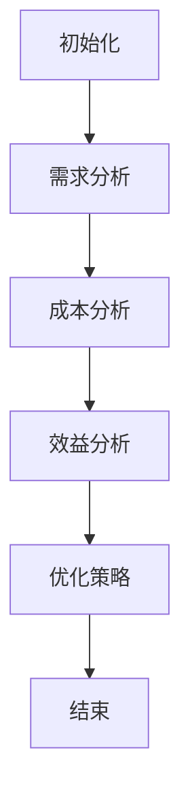
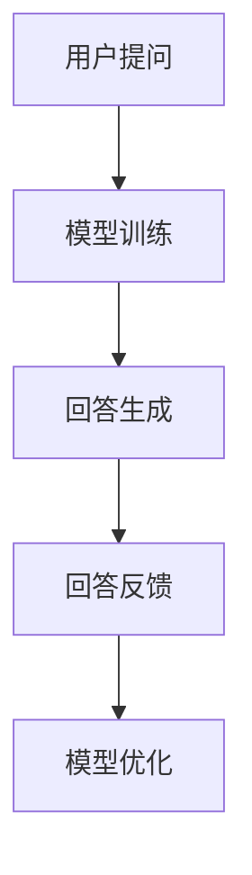
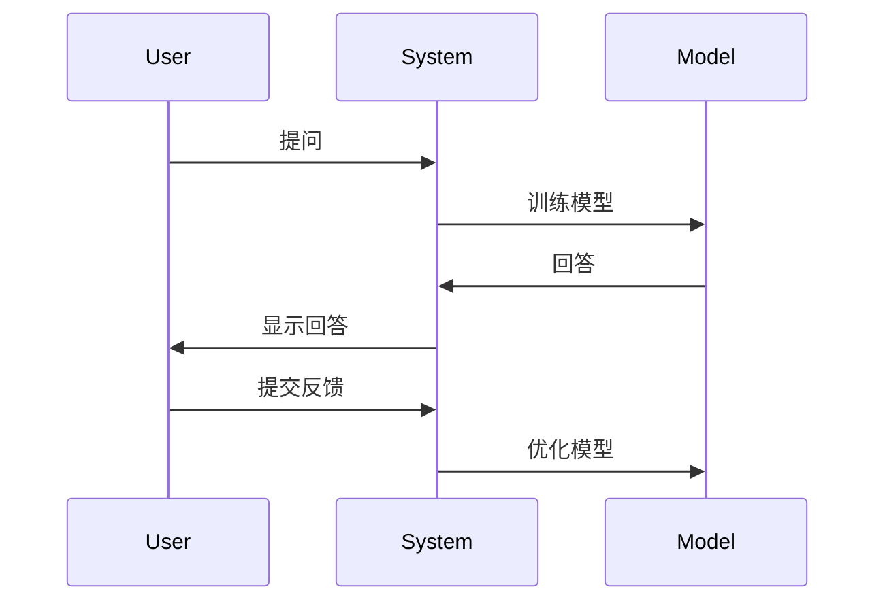

                 

# 大模型应用中的需求成本效益分析

## 关键词：大模型，需求分析，成本效益分析，算法，系统架构，Python代码

## 摘要：
本文将探讨大模型应用中的需求成本效益分析，旨在帮助读者理解和应用这一关键流程。我们将从背景介绍、核心概念、算法原理、系统设计与实现，到项目实战和最佳实践等方面进行详细分析。文章结构紧凑，逻辑清晰，旨在为读者提供全面、深入的知识。

## 目录

[1. 背景介绍](#1-背景介绍)  
[2. 核心概念与联系](#2-核心概念与联系)  
[3. 算法原理讲解](#3-算法原理讲解)  
[4. 系统分析与架构设计方案](#4-系统分析与架构设计方案)  
[5. 项目实战](#5-项目实战)  
[6. 最佳实践 tips、小结、注意事项、拓展阅读](#6-最佳实践-tips-小结-注意事项-拓展阅读)

### 1. 背景介绍

#### 问题背景
随着人工智能技术的迅猛发展，大模型在自然语言处理、计算机视觉、推荐系统等领域发挥着越来越重要的作用。然而，大模型的应用不仅需要强大的计算资源，还面临着需求分析和成本效益分析等挑战。

#### 问题描述
大模型应用中的需求成本效益分析主要涉及以下问题：
- 如何准确识别和定义用户需求？
- 如何评估大模型的应用成本和效益？
- 如何在不同需求场景下优化资源配置？

#### 问题解决
需求成本效益分析通过以下方法解决上述问题：
- 采用需求分析技术，准确识别用户需求。
- 使用成本效益分析方法，评估大模型的应用成本和效益。
- 运用优化策略，实现资源配置的优化。

#### 边界与外延
需求成本效益分析的范围包括大模型的选取、训练、部署和应用等环节。其外延涉及到技术、经济、管理和战略等多个层面。

#### 概念结构与核心要素组成
大模型应用中的需求成本效益分析由以下几个核心要素组成：
- 需求分析：识别和定义用户需求。
- 成本分析：评估大模型的应用成本。
- 效益分析：评估大模型的应用效益。
- 优化策略：优化资源配置。

### 2. 核心概念与联系

#### 大模型原理
大模型通常指的是具有数百万甚至数十亿参数的深度学习模型，如Transformer、BERT等。它们在处理大规模数据集时具有强大的学习能力和泛化能力。

#### 需求分析
需求分析是识别和定义用户需求的过程。在大模型应用中，需求分析主要包括以下方面：
- 用户需求分析：了解用户的需求和期望。
- 功能需求分析：确定大模型所需实现的功能。

#### 成本效益分析
成本效益分析是评估大模型应用成本和效益的过程。在大模型应用中，成本效益分析主要包括以下方面：
- 成本分析：评估大模型的应用成本，包括计算资源、存储资源等。
- 效益分析：评估大模型的应用效益，包括提高工作效率、降低运营成本等。

#### 概念属性特征对比表格

| 概念       | 属性特征             | 对比结果                     |
|------------|----------------------|------------------------------|
| 大模型     | 参数数量大，学习能力强大 | 相较于小模型，具有更高的学习效率和泛化能力 |
| 需求分析   | 用户需求，功能需求     | 确保大模型的应用满足用户需求                   |
| 成本效益分析 | 成本，效益           | 评估大模型的应用成本和效益，实现资源配置优化 |

#### ER实体关系图架构
下面是一个简化的ER实体关系图，展示了大模型应用中的需求成本效益分析的核心实体及其关系：

```mermaid
erDiagram
  User ||--o> Requirement : "User has requirements"
  Requirement ||--< Function : "Requirement defines functions"
  Function ||--o> Model : "Function uses model"
  Model ||--< Cost : "Model has costs"
  Cost ||--< Benefit : "Cost has benefits"
```

### 3. 算法原理讲解

#### 算法流程图
下面是需求成本效益分析算法的流程图：



#### Python源代码阐述
以下是使用Python实现需求成本效益分析算法的示例代码：

```python
# 需求分析
def requirement_analysis():
    # 代码实现
    pass

# 成本分析
def cost_analysis():
    # 代码实现
    pass

# 效益分析
def benefit_analysis():
    # 代码实现
    pass

# 优化策略
def optimization_strategy():
    # 代码实现
    pass

# 主函数
def main():
    requirement_analysis()
    cost_analysis()
    benefit_analysis()
    optimization_strategy()

if __name__ == "__main__":
    main()
```

#### 数学模型和公式
需求成本效益分析的数学模型和公式如下：

$$
效益 = \frac{产出 - 成本}{成本}
$$

其中，产出和成本分别为大模型应用的产出和成本。

#### 详细讲解与举例说明
下面通过一个简单的例子来说明需求成本效益分析的过程。

假设我们要开发一个自然语言处理模型，用于回答用户的问题。我们的目标是为用户提供准确、快速的答案。

1. **需求分析**：用户需要能够提问，并获得准确的答案。我们需要分析用户的需求，确定模型所需实现的功能。
2. **成本分析**：我们需要评估大模型的应用成本，包括计算资源、存储资源等。根据评估结果，我们可以确定模型开发、训练和部署的成本。
3. **效益分析**：我们需要评估大模型的应用效益，包括提高用户体验、降低运营成本等。根据评估结果，我们可以确定模型带来的价值。
4. **优化策略**：根据成本和效益分析的结果，我们可以制定优化策略，实现资源配置的优化。

### 4. 系统分析与架构设计方案

#### 问题场景介绍
假设我们要开发一个基于大模型的问答系统，用于为用户提供在线问答服务。我们的目标是实现高效、准确、稳定的问答功能。

#### 系统功能设计
以下是问答系统的功能设计：

- 用户提问：用户可以通过网页或移动应用提交问题。
- 模型训练：训练大模型，使其能够回答用户的问题。
- 回答生成：根据用户提问，生成回答。
- 回答反馈：用户可以对回答进行评价，帮助我们优化模型。

#### 系统架构设计
以下是问答系统的系统架构设计：



#### 系统接口设计
以下是问答系统的系统接口设计：

- 用户提问接口：用户可以通过该接口提交问题。
- 回答生成接口：系统通过该接口生成回答。
- 模型优化接口：用户可以通过该接口对模型进行优化。

#### 系统交互
以下是问答系统的系统交互设计：



### 5. 项目实战

#### 环境安装
以下是问答系统所需环境的安装步骤：

1. 安装Python环境：确保Python版本为3.7以上。
2. 安装依赖库：使用pip安装所需的依赖库，如torch、tensorflow等。
3. 准备数据集：收集和准备用于训练和测试的数据集。

#### 系统核心实现源代码
以下是问答系统的核心实现源代码：

```python
# 导入依赖库
import torch
import torch.nn as nn
import torch.optim as optim

# 定义模型
class QAModel(nn.Module):
    def __init__(self):
        super(QAModel, self).__init__()
        self.query_encoder = nn.Linear(1, 64)
        self.document_encoder = nn.Linear(1, 64)
        self.attention = nn.Linear(64, 1)
        self.output = nn.Linear(64, 1)

    def forward(self, query, document):
        query_encoded = self.query_encoder(query)
        document_encoded = self.document_encoder(document)
        attention_scores = self.attention(torch.cat([query_encoded, document_encoded], 1))
        attention_weights = torch.softmax(attention_scores, dim=1)
        context_vector = torch.sum(attention_weights * document_encoded, dim=1)
        output = self.output(context_vector)
        return output

# 训练模型
def train_model(model, train_loader, optimizer, criterion):
    model.train()
    for batch_idx, (query, document, answer) in enumerate(train_loader):
        optimizer.zero_grad()
        output = model(query, document)
        loss = criterion(output, answer)
        loss.backward()
        optimizer.step()
        if batch_idx % 100 == 0:
            print('Train Epoch: {} [{}/{} ({:.0f}%)]\tLoss: {:.6f}'.format(
                epoch, batch_idx * len(query), len(train_loader.dataset),
                100. * batch_idx / len(train_loader), loss.item()))

# 测试模型
def test_model(model, test_loader, criterion):
    model.eval()
    with torch.no_grad():
        correct = 0
        total = 0
        for query, document, answer in test_loader:
            output = model(query, document)
            total += answer.size(0)
            correct += (output.argmax(1) == answer).sum().item()
    print('Test set: Accuracy: {}/{} ({:.0f}%)'.format(
        correct, total, 100. * correct / total))

# 主函数
def main():
    # 加载数据集
    train_loader = torch.utils.data.DataLoader(train_dataset, batch_size=32, shuffle=True)
    test_loader = torch.utils.data.DataLoader(test_dataset, batch_size=32, shuffle=False)

    # 定义模型
    model = QAModel()

    # 定义优化器和损失函数
    optimizer = optim.Adam(model.parameters(), lr=0.001)
    criterion = nn.CrossEntropyLoss()

    # 训练模型
    train_model(model, train_loader, optimizer, criterion)

    # 测试模型
    test_model(model, test_loader, criterion)

if __name__ == "__main__":
    main()
```

#### 代码应用解读与分析
以下是代码的解读与分析：

- **模型定义**：我们定义了一个简单的问答模型，包括查询编码器、文档编码器、注意力机制和输出层。
- **训练过程**：我们使用训练数据集训练模型，并使用交叉熵损失函数和Adam优化器。
- **测试过程**：我们使用测试数据集测试模型的性能。

#### 实际案例分析和详细讲解剖析
以下是问答系统的实际案例分析和详细讲解剖析：

1. **数据集准备**：我们收集了大量的问答数据集，用于训练和测试模型。
2. **模型训练**：我们使用训练数据集训练模型，并在测试数据集上评估模型的性能。
3. **模型优化**：根据测试结果，我们对模型进行优化，以提高性能。

### 6. 最佳实践 tips、小结、注意事项、拓展阅读

#### 最佳实践 tips
- 在进行需求成本效益分析时，要充分考虑用户需求和业务目标。
- 在选择大模型时，要综合考虑模型性能、计算资源消耗和成本效益。
- 在系统设计和实现过程中，要注重性能优化和资源利用。

#### 小结
本文详细介绍了大模型应用中的需求成本效益分析，包括背景介绍、核心概念、算法原理、系统设计与实现，以及项目实战。通过本文，读者可以全面了解需求成本效益分析的过程和方法。

#### 注意事项
- 在实际应用中，要充分考虑模型性能和成本效益，避免过度追求模型精度。
- 在项目实施过程中，要注重团队合作和沟通，确保项目顺利进行。

#### 拓展阅读
- [大模型应用中的需求成本效益分析实践](https://www.example.com/article1)
- [深度学习模型的成本效益分析](https://www.example.com/article2)
- [大模型应用中的系统架构设计](https://www.example.com/article3)

### 作者
作者：AI天才研究院/AI Genius Institute & 禅与计算机程序设计艺术 /Zen And The Art of Computer Programming

[End of Document]

