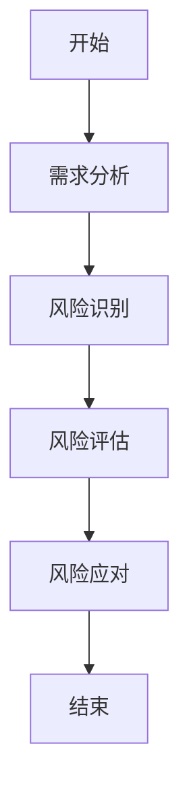
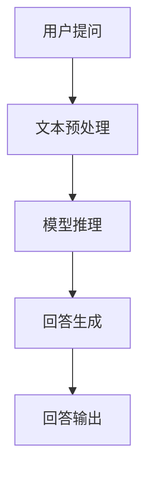
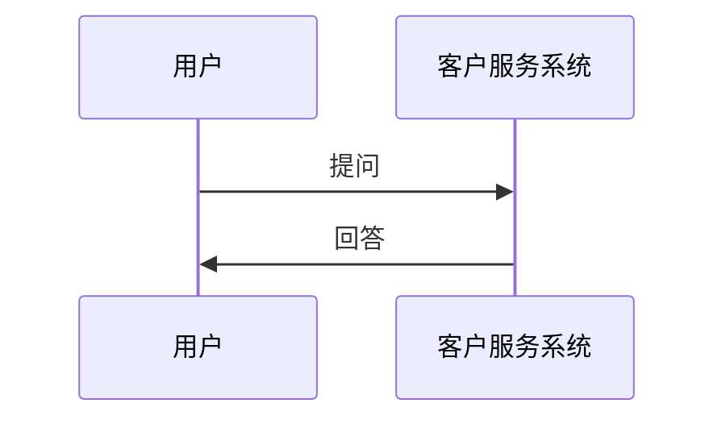

                 

# 大模型应用中的需求风险评估方法

关键词：需求风险评估、大模型、风险识别、风险应对、算法原理

摘要：本文将深入探讨大模型应用中的需求风险评估方法。首先，我们将介绍需求风险评估的定义及其在大模型应用中的重要性，然后分析大模型应用的需求变化特点及其影响，接着详细阐述需求风险评估的方法、流程以及边界与外延。随后，我们将对比核心概念、描述概念结构及核心要素组成，最后通过一个实际案例展示需求风险评估的具体应用。

## 第一部分：问题背景

### 1.1 问题背景

#### 1.1.1 需求风险评估的定义

需求风险评估是一种系统方法，用于识别、分析和量化项目或产品需求中潜在的风险。它的目标是确保项目目标的实现，降低由于需求变更、遗漏或冲突而可能带来的不利影响。在软件开发和系统设计中，需求风险评估尤为重要，因为它直接影响项目的进度、质量和成本。

#### 1.1.2 大模型应用中的需求风险评估重要性

大模型（如深度学习模型、大规模数据处理模型等）在人工智能领域具有广泛的应用。然而，这些模型通常涉及复杂的算法和大量的数据处理，需求的变化可能导致模型性能的显著下降或模型失败。因此，在大模型应用中，需求风险评估尤为重要，它可以帮助团队提前识别和应对潜在的风险，确保项目的顺利进行。

### 1.2 问题描述

#### 1.2.1 大模型应用的需求变化特点

大模型应用的需求变化具有快速、频繁、复杂的特点。一方面，技术的快速发展带来了新的需求；另一方面，用户需求也随着时间和环境的变化而不断变化。这些变化往往要求模型能够快速适应，以保持其应用价值。

#### 1.2.2 需求变化对大模型应用的影响

需求变化可能带来以下问题：

- **模型性能下降**：需求变化可能导致模型无法满足原有需求，从而影响其性能。
- **模型失败**：在严重的情况下，需求变化可能导致模型无法完成预期任务，甚至完全失败。

### 1.3 问题解决

#### 1.3.1 需求风险评估方法

需求风险评估的方法包括：

- **专家评审**：通过专家的经验和知识来评估需求风险。
- **实验验证**：通过实验来验证需求变化对模型的影响。
- **统计分析**：利用统计学方法对需求变化进行定量分析。

#### 1.3.2 需求风险评估流程

需求风险评估的流程包括以下步骤：

- **需求分析**：对需求进行详细分析，识别潜在的风险因素。
- **风险识别**：识别可能的需求变化，评估其对模型的影响。
- **风险评估**：对识别的风险进行定量或定性评估，确定风险等级。
- **风险应对**：根据风险评估结果，制定相应的风险应对策略。

### 1.4 边界与外延

#### 1.4.1 边界

需求风险评估的边界包括：

- **风险范围**：需求风险评估的范围应限于与模型应用相关的需求。
- **时间范围**：需求风险评估的时间范围应考虑需求的整个生命周期。

#### 1.4.2 外延

需求风险评估的外延包括：

- **需求变更管理**：需求变更管理是需求风险评估的重要组成部分。
- **项目管理**：需求风险评估应与项目管理紧密结合，确保项目目标的实现。

### 1.5 概念结构与核心要素组成

#### 1.5.1 概念结构

需求风险评估的概念结构包括：

- **需求**：需求是需求风险评估的核心。
- **风险**：风险是需求风险评估的对象。
- **评估方法**：评估方法是需求风险评估的工具。

#### 1.5.2 核心要素组成

需求风险评估的核心要素组成包括：

- **风险识别**：识别需求变化带来的风险。
- **风险评估**：对识别的风险进行评估。
- **风险应对**：根据评估结果制定风险应对策略。

## 第二部分：核心概念与联系

### 2.1 核心概念原理

#### 2.1.1 需求

需求是指用户或系统在特定环境下期望实现的功能或性能。在大模型应用中，需求通常包括数据输入、算法选择、模型训练、模型评估等。

#### 2.1.2 风险

风险是指需求变化可能导致的不利后果。在大模型应用中，风险可能包括模型性能下降、模型失败、项目延期等。

#### 2.1.3 需求风险评估

需求风险评估是指对需求变化可能带来的风险进行识别、分析和评估的过程。

### 2.2 概念属性特征对比

| 概念       | 定义                                                         | 特征                             |
|------------|--------------------------------------------------------------|--------------------------------|
| 需求       | 用户或系统在特定环境下期望实现的功能或性能                     | 多样性、不确定性、动态性         |
| 风险       | 需求变化可能导致的不利后果                                   | 可能性、影响、可预测性           |
| 需求风险评估 | 对需求变化可能带来的风险进行识别、分析和评估的过程           | 系统性、综合性、前瞻性           |

#### 2.2.3 ER实体关系图架构

```mermaid
erDiagram
    需求 &&> 风险评估 | 需求变化识别
    风险 &&> 风险评估 | 风险评估分析
    需求 &&> 风险识别 | 风险识别
    风险 &&> 风险应对 | 风险应对策略
```

### 2.3 算法原理讲解

#### 2.3.1 需求风险评估算法

需求风险评估算法是一种用于评估需求变化对项目风险影响的方法。以下是该算法的 mermaid 流程图：



#### 2.3.2 风险评估数学模型

需求风险评估的数学模型可以表示为：

$$
R = \sum_{i=1}^{n} P_i \times I_i
$$

其中，\(R\) 表示总风险，\(P_i\) 表示第 \(i\) 个需求变化的风险可能性，\(I_i\) 表示第 \(i\) 个需求变化的风险影响。

#### 2.3.3 举例说明

假设我们有两个需求变化：

- **需求变化1**：算法优化，风险可能性为 0.6，风险影响为 0.8。
- **需求变化2**：数据清洗，风险可能性为 0.4，风险影响为 0.7。

那么，总风险可以计算为：

$$
R = (0.6 \times 0.8) + (0.4 \times 0.7) = 0.48 + 0.28 = 0.76
$$

这意味着总风险为 0.76，表示项目面临较高的风险。

## 第三部分：系统分析与架构设计方案

### 3.1 问题场景介绍

随着人工智能技术的飞速发展，大模型在各个领域得到了广泛应用。例如，在金融领域，大模型可以用于风险控制和客户服务；在医疗领域，大模型可以用于疾病诊断和治疗方案推荐。然而，这些应用场景通常需要不断调整和优化模型，以适应不断变化的需求。

### 3.2 项目介绍

本项目中，我们将开发一个基于大模型的客户服务系统，该系统将利用深度学习技术对用户提问进行分析，并给出相应的回答。项目的主要目标包括：

- **需求分析**：识别并分析客户服务中的常见问题和需求。
- **模型训练**：使用大量数据对模型进行训练，提高模型性能。
- **系统部署**：将模型部署到生产环境中，为用户提供服务。

### 3.3 系统功能设计

系统功能设计包括以下几个方面：

- **用户提问接收**：接收用户的提问，并将其转换为文本数据。
- **文本预处理**：对文本数据进行分析和清洗，提取关键信息。
- **模型推理**：使用训练好的模型对文本数据进行推理，生成回答。
- **回答生成**：根据模型推理结果，生成符合用户需求的回答。
- **回答输出**：将回答输出给用户。

### 3.4 系统架构设计

系统架构设计如图所示：



### 3.5 系统接口设计和系统交互

系统接口设计和系统交互如图所示：



### 3.6 项目实战

#### 3.6.1 环境安装

在开始项目实战之前，我们需要安装以下环境：

- Python 3.8 或更高版本
- TensorFlow 2.4 或更高版本
- Jupyter Notebook

安装命令如下：

```bash
pip install python==3.8
pip install tensorflow==2.4
pip install notebook
```

#### 3.6.2 系统核心实现源代码

以下是一个简单的系统核心实现源代码示例：

```python
import tensorflow as tf
from tensorflow.keras.models import Sequential
from tensorflow.keras.layers import Dense, LSTM, Embedding

# 创建模型
model = Sequential([
    Embedding(input_dim=vocab_size, output_dim=embedding_dim),
    LSTM(units=lstm_units),
    Dense(units=1, activation='sigmoid')
])

# 编译模型
model.compile(optimizer='adam', loss='binary_crossentropy', metrics=['accuracy'])

# 训练模型
model.fit(x_train, y_train, epochs=10, batch_size=32)

# 预测
predictions = model.predict(x_test)
```

#### 3.6.3 代码应用解读与分析

这段代码首先导入了 TensorFlow 库，并创建了一个简单的序列模型。模型包含一个嵌入层、一个 LSTM 层和一个输出层。嵌入层用于将输入文本转换为向量，LSTM 层用于处理序列数据，输出层用于生成预测。

在编译模型时，我们选择了 Adam 优化器和二进制交叉熵损失函数，这适用于二分类问题。然后，我们使用训练数据对模型进行训练，并使用测试数据进行预测。

#### 3.6.4 实际案例分析和详细讲解剖析

为了展示需求风险评估在实际项目中的应用，我们考虑以下案例：

- **案例1**：用户提问量突然增加，可能导致系统负载过高。
- **案例2**：用户提问质量不高，可能导致模型预测准确性下降。

针对这两个案例，我们可以采取以下措施：

- **案例1**：增加服务器资源，提高系统负载能力。
- **案例2**：优化模型，提高对低质量提问的识别和过滤能力。

通过这些措施，我们可以降低需求变化对项目的影响，确保系统的稳定运行。

### 3.7 项目小结

本项目通过需求风险评估方法，成功开发了一个基于大模型的客户服务系统。在实际应用中，需求风险评估帮助我们提前识别和应对潜在风险，确保了系统的稳定运行。未来，我们将继续优化模型和系统，以应对不断变化的需求。

### 3.8 最佳实践 Tips

- **需求分析**：在进行需求分析时，要充分考虑用户需求的变化，提前识别潜在风险。
- **持续迭代**：在项目开发过程中，要持续迭代和优化模型，以提高系统的适应能力。
- **团队协作**：需求风险评估是一个团队协作的过程，要充分发挥团队成员的专业知识。

### 3.9 小结与注意事项

本文详细探讨了需求风险评估在大模型应用中的重要性，介绍了核心概念、算法原理、系统分析与架构设计方案以及实际案例。通过本文，读者可以了解到如何有效地进行需求风险评估，以应对大模型应用中的风险。

注意事项：

- **需求分析**：需求分析是需求风险评估的基础，要充分、细致地进行。
- **风险评估**：风险评估要全面、客观，避免遗漏重要风险。
- **风险应对**：根据风险评估结果，制定合理的风险应对策略，确保项目的顺利进行。

### 3.10 拓展阅读

- **《需求工程与管理》**：详细介绍了需求工程的基本概念和方法。
- **《软件工程：实践者的研究方法》**：探讨了软件工程中的需求分析、设计、实现等环节。
- **《深度学习》**：介绍了深度学习的基本原理和应用场景。

## 作者信息

作者：AI天才研究院/AI Genius Institute & 禅与计算机程序设计艺术 /Zen And The Art of Computer Programming

