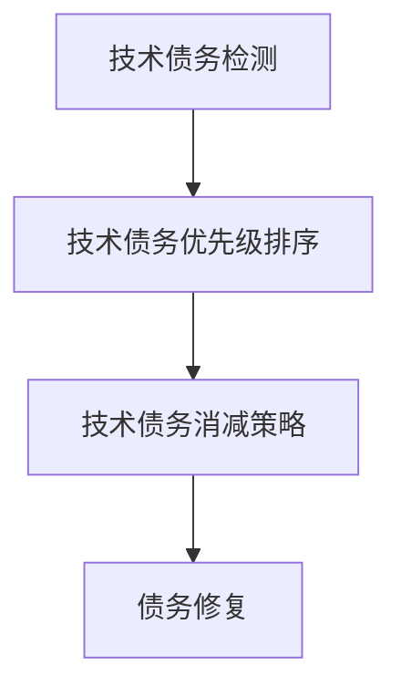
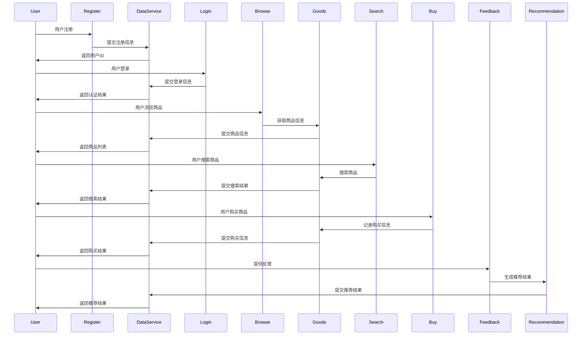

                 


## 大模型应用开发中的技术债务管理

### 关键词：
- 大模型应用开发
- 技术债务管理
- 算法原理
- 数学模型
- 系统设计与实现

### 摘要：
本文将深入探讨大模型应用开发中的技术债务管理问题。我们将首先介绍大模型的概念和背景，接着阐述技术债务的概念及其在软件开发中的重要性。随后，我们将详细分析大模型应用开发中的技术债务种类和管理流程，并引入相应的算法原理和数学模型。通过实际案例和最佳实践，我们将展示如何有效地管理技术债务，并总结文章的主要观点和注意事项。

## 背景与核心概念

### 1.1 问题背景

随着深度学习技术的飞速发展，大模型在各个领域的应用日益广泛。从自然语言处理到计算机视觉，再到推荐系统和语音识别，大模型展现了其强大的能力和潜力。然而，在大模型应用开发的过程中，技术债务问题逐渐显现，并成为一个亟待解决的难题。

技术债务，也被称为“技术欠账”，是软件开发中常见的现象。它指的是由于在开发过程中为了追求短期目标而做出的一些妥协，这些妥协在长期内会带来额外的成本和复杂性。在大模型应用开发中，技术债务的表现形式多样，包括算法选择、数据预处理、模型优化、系统架构等方面。

### 1.2 技术债务的概念

技术债务是软件开发中的一种常见现象，它通常由以下几种原因引起：

1. **时间压力**：为了在紧迫的时间期限内交付项目，开发团队可能不得不采取一些妥协措施，例如简化算法实现、减少测试覆盖范围等。
2. **资源限制**：在有限的资源条件下，开发团队可能无法同时兼顾代码质量、性能优化和功能完善，从而产生技术债务。
3. **技术更新**：随着技术的快速迭代，旧的技术解决方案可能不再适用，但更换新的技术方案又需要时间和成本，这会导致技术债务的积累。

技术债务可以分为以下几种类型：

1. **技术债务**：指在代码层面引入的问题，如代码冗余、结构混乱、依赖关系复杂等。
2. **债务**：指在系统层面引入的问题，如系统性能瓶颈、可扩展性差、安全漏洞等。
3. **设计债务**：指在系统架构层面引入的问题，如架构不合理、依赖关系不清晰、系统冗余等。

### 1.3 大模型应用开发中的技术债务管理挑战

大模型应用开发中的技术债务管理面临以下挑战：

1. **模型复杂性**：大模型的复杂性和规模使得技术债务的产生和管理变得更加困难。
2. **数据依赖性**：大模型的训练和推理高度依赖于数据，数据质量和技术债务对模型性能有直接影响。
3. **算法迭代速度**：随着技术的快速迭代，大模型应用开发中的技术债务管理需要快速适应新的算法和框架。
4. **团队合作**：大模型应用开发通常需要跨学科、跨团队的协作，技术债务的管理需要统一的认知和协调。

### 1.4 技术债务管理在AI领域的应用

技术债务管理在AI领域具有重要意义，特别是在大模型应用开发中。以下是一些关键应用：

1. **代码质量控制**：通过引入代码审查、自动化测试和持续集成等手段，提高代码质量，减少技术债务的产生。
2. **性能优化**：对模型和系统进行性能优化，减少资源消耗和延迟，提高系统的可靠性和可扩展性。
3. **架构设计**：通过合理的系统架构设计，降低技术债务的风险，提高系统的可维护性和可扩展性。
4. **团队合作**：建立跨学科、跨团队的沟通和协作机制，确保技术债务的识别和管理得到有效执行。

### 1.5 技术债务的种类

技术债务可以分为以下几种类型：

1. **代码债务**：包括代码冗余、结构混乱、依赖关系复杂等问题。
2. **数据债务**：包括数据质量差、数据不一致、数据依赖等问题。
3. **算法债务**：包括算法选择不当、模型优化不足、算法实现复杂等问题。
4. **架构债务**：包括系统架构不合理、依赖关系不清晰、系统冗余等问题。

### 1.6 技术债务的管理流程

技术债务的管理流程包括以下关键步骤：

1. **债务识别**：通过代码审查、测试和反馈等手段，识别系统中的技术债务。
2. **债务分类**：对识别出的技术债务进行分类，确定其优先级和影响范围。
3. **债务修复**：根据债务的类型和优先级，采取相应的修复措施，如代码重构、数据清洗、算法优化等。
4. **债务监控**：建立技术债务的监控机制，定期检查和更新债务状态，确保债务得到持续管理。

### 1.7 技术债务的影响评估

技术债务的影响评估是管理流程的关键环节，包括以下方面：

1. **成本评估**：评估修复技术债务所需的资源和成本，包括人力、时间和资金等。
2. **风险评估**：评估技术债务可能带来的风险，如系统崩溃、数据泄露、性能下降等。
3. **优先级评估**：根据成本和风险等因素，确定技术债务的优先级，优先修复重要和紧急的债务。
4. **效益评估**：评估修复技术债务所带来的效益，如性能提升、质量提高、可维护性增强等。

### 1.8 技术债务管理的核心概念

技术债务管理的核心概念包括：

1. **预防为主**：在软件开发过程中，通过严格的质量控制和代码审查，减少技术债务的产生。
2. **持续管理**：建立持续的技术债务管理机制，定期检查和修复债务，确保系统的健康运行。
3. **团队合作**：跨学科、跨团队的协作是技术债务管理的关键，确保债务的识别和管理得到有效执行。
4. **透明沟通**：建立透明的沟通机制，确保团队成员对技术债务有清晰的认识，共同参与债务管理。

## 算法原理

### 2.1 技术债务检测算法

技术债务检测算法是技术债务管理的第一步，其目标是识别系统中的技术债务。常见的检测算法包括：

1. **静态代码分析**：通过分析代码结构和语法，识别潜在的代码债务。
2. **动态测试**：通过运行代码并分析其行为，识别运行时出现的债务问题。
3. **代码审查**：通过人工审查代码，识别代码中的债务问题。

### 2.2 技术债务优先级排序算法

技术债务优先级排序算法的目的是根据债务的影响范围和严重程度，对债务进行排序，以便优先修复重要的债务。常见的排序算法包括：

1. **基于成本的优先级排序**：根据修复技术债务所需的成本，对债务进行排序。
2. **基于风险的优先级排序**：根据技术债务可能带来的风险，对债务进行排序。
3. **综合优先级排序**：综合考虑成本、风险和影响范围，对债务进行排序。

### 2.3 技术债务消减策略

技术债务消减策略是指通过一系列措施，降低技术债务的影响和严重程度。常见的消减策略包括：

1. **代码重构**：通过重新设计代码结构，提高代码质量，减少债务问题。
2. **性能优化**：通过优化算法和系统架构，提高系统性能，减少债务影响。
3. **数据清洗**：通过清洗和标准化数据，提高数据质量，减少债务问题。
4. **自动化测试**：通过引入自动化测试，提高测试覆盖率，减少债务问题。

### 2.4 算法原理讲解

为了更好地理解技术债务检测、优先级排序和消减策略的算法原理，我们可以借助Python代码和Mermaid流程图进行详细讲解。

#### 2.4.1 技术债务检测算法示例

```python
# 技术债务检测算法示例
def debt_detection(code):
    # 假设使用静态代码分析进行债务检测
    debt_issues = []
    for line in code:
        if "print" in line:
            debt_issues.append("Print statement detected")
        elif "magic numbers" in line:
            debt_issues.append("Magic numbers detected")
    return debt_issues

# 示例代码
code_example = [
    "print('Hello, World!')",
    "x = 10",
    "y = x * 2",
]

detected_debts = debt_detection(code_example)
print(detected_debts)
```

#### 2.4.2 技术债务优先级排序算法示例

```python
# 技术债务优先级排序算法示例
def debt_priority_sort(debts):
    # 假设使用基于成本的优先级排序
    sorted_debts = sorted(debts, key=lambda x: x['cost'], reverse=True)
    return sorted_debts

# 示例债务列表
debt_list = [
    {"issue": "Print statement detected", "cost": 5},
    {"issue": "Magic numbers detected", "cost": 10},
]

sorted_debts = debt_priority_sort(debt_list)
print(sorted_debts)
```

#### 2.4.3 技术债务消减策略示例

```python
# 技术债务消减策略示例
def debt_reduction(code):
    # 假设使用代码重构进行债务消减
    new_code = code.replace("print('Hello, World!')", "logger.info('Hello, World!')")
    return new_code

# 示例代码
code_example = [
    "print('Hello, World!')",
    "x = 10",
    "y = x * 2",
]

reduced_code = debt_reduction(code_example)
print(reduced_code)
```

#### 2.4.4 Mermaid流程图示例



通过Python代码和Mermaid流程图的结合，我们可以更清晰地理解技术债务管理的算法原理和流程。

### 2.5 数学模型与公式

在技术债务管理中，数学模型和公式用于描述债务的产生、影响和消减过程。以下是一些常用的数学模型和公式：

#### 2.5.1 技术债务成本模型

技术债务成本模型可以用于评估修复技术债务所需的成本。常见的成本模型包括：

1. **时间成本模型**：计算修复技术债务所需的时间，公式为：
   \[
   C_t = T \times W
   \]
   其中，\( C_t \) 表示时间成本，\( T \) 表示修复技术债务所需的时间，\( W \) 表示单位时间的成本。

2. **资源成本模型**：计算修复技术债务所需的资源成本，公式为：
   \[
   C_r = R \times C_p
   \]
   其中，\( C_r \) 表示资源成本，\( R \) 表示修复技术债务所需的资源数量，\( C_p \) 表示单位资源的成本。

#### 2.5.2 技术债务影响模型

技术债务的影响模型用于评估技术债务对系统性能、可靠性和可维护性的影响。常见的影响模型包括：

1. **性能影响模型**：计算技术债务对系统性能的影响，公式为：
   \[
   P = P_0 \times (1 - \alpha D)
   \]
   其中，\( P \) 表示系统性能，\( P_0 \) 表示原始性能，\( \alpha \) 表示技术债务的影响系数，\( D \) 表示技术债务的程度。

2. **可靠性影响模型**：计算技术债务对系统可靠性的影响，公式为：
   \[
   R = R_0 \times (1 - \beta D)
   \]
   其中，\( R \) 表示系统可靠性，\( R_0 \) 表示原始可靠性，\( \beta \) 表示技术债务的影响系数，\( D \) 表示技术债务的程度。

#### 2.5.3 技术债务消减模型

技术债务消减模型用于评估通过技术债务消减策略降低技术债务的影响。常见的消减模型包括：

1. **代码重构模型**：计算通过代码重构降低技术债务的影响，公式为：
   \[
   D_r = D_0 \times (1 - \gamma R)
   \]
   其中，\( D_r \) 表示重构后的债务程度，\( D_0 \) 表示原始债务程度，\( \gamma \) 表示重构效果系数，\( R \) 表示重构修复的程度。

2. **性能优化模型**：计算通过性能优化降低技术债务的影响，公式为：
   \[
   D_p = D_0 \times (1 - \delta P)
   \]
   其中，\( D_p \) 表示优化后的债务程度，\( D_0 \) 表示原始债务程度，\( \delta \) 表示优化效果系数，\( P \) 表示性能优化的效果。

#### 2.5.4 数学公式示例

$$
1+1=2
$$

$$
P = P_0 \times (1 - \alpha D)
$$

$$
R = R_0 \times (1 - \beta D)
$$

$$
D_r = D_0 \times (1 - \gamma R)
$$

$$
D_p = D_0 \times (1 - \delta P)
$$

通过数学模型和公式，我们可以更准确地评估技术债务的成本、影响和消减效果，从而更有效地管理技术债务。

## 系统设计与实现

### 3.1 问题场景介绍

假设我们正在开发一个基于大模型的推荐系统，该系统需要处理海量的用户数据和商品数据，提供个性化的推荐结果。在系统开发过程中，我们面临着一系列的技术债务管理挑战，包括算法选择、数据预处理、模型优化和系统架构等方面。

### 3.2 项目介绍

项目名称：智能个性化推荐系统（Smart Personalized Recommendation System，SPRS）

项目目标：为用户提供个性化的商品推荐，提高用户满意度和转化率。

项目背景：随着电子商务和在线购物的普及，个性化推荐系统在用户行为分析和商品推荐方面发挥了重要作用。然而，随着推荐系统规模的扩大和数据量的增加，技术债务问题日益凸显，需要采取有效的管理策略来确保系统的稳定运行和持续优化。

### 3.3 系统功能设计

智能个性化推荐系统主要包括以下功能模块：

1. **用户数据收集与处理**：收集用户的基本信息、行为数据和偏好数据，对数据进行清洗、去重和标准化处理，为推荐算法提供高质量的输入。
2. **商品数据收集与处理**：收集商品的基本信息、分类信息和用户评价数据，对数据进行清洗、去重和标准化处理，为推荐算法提供商品特征信息。
3. **推荐算法实现与优化**：采用基于协同过滤、深度学习和图神经网络等算法，实现个性化推荐功能，并进行算法优化和性能调优。
4. **推荐结果展示与反馈**：将推荐结果以友好的用户界面展示给用户，并收集用户的反馈，用于进一步优化推荐算法。
5. **系统监控与运维**：对系统进行实时监控，及时发现和解决潜在的技术债务问题，确保系统的稳定运行。

### 3.4 系统架构设计

智能个性化推荐系统的架构设计主要包括以下层次：

1. **数据层**：包括用户数据存储、商品数据存储和数据预处理模块，负责数据的收集、存储和处理。
2. **算法层**：包括推荐算法实现、模型优化和性能调优模块，负责实现个性化推荐算法并提供高效的推荐结果。
3. **应用层**：包括推荐结果展示、用户反馈收集和系统监控模块，负责与用户交互并提供优质的用户体验。
4. **服务层**：包括推荐服务、数据服务和监控系统，负责实现系统功能模块的通信和协作。
5. **接口层**：包括API接口、Web界面和移动应用，负责为用户提供接入系统的方式。

### 3.5 系统接口设计

智能个性化推荐系统的接口设计主要包括以下接口：

1. **用户接口**：提供用户注册、登录、个人信息管理、推荐结果展示等功能。
2. **商品接口**：提供商品信息查询、商品分类管理、用户评价管理等功能。
3. **推荐接口**：提供个性化推荐功能，根据用户行为和偏好生成推荐结果。
4. **数据接口**：提供用户数据、商品数据和历史推荐数据的查询和管理功能。
5. **监控接口**：提供系统监控、日志分析、异常处理等功能。

### 3.6 系统交互设计

智能个性化推荐系统的系统交互设计主要包括以下交互流程：

1. **用户注册与登录**：用户通过注册接口提交个人信息，通过登录接口验证身份，获取用户ID。
2. **用户行为数据收集**：系统通过日志记录用户行为，包括浏览、搜索、购买等行为，收集用户行为数据。
3. **商品数据收集与处理**：系统通过数据接口获取商品信息，包括商品ID、名称、分类、价格等，对商品数据进行清洗和标准化处理。
4. **推荐算法执行**：系统调用推荐接口，根据用户行为数据和商品特征信息，生成个性化推荐结果。
5. **推荐结果展示与反馈**：系统将推荐结果以HTML页面或移动应用的形式展示给用户，用户可以浏览、点击、评价推荐结果，提供反馈。
6. **系统监控与运维**：系统通过监控接口实时监控系统的运行状态，发现异常情况并及时处理。

### 3.7 Mermaid类图和序列图

为了更好地展示系统架构和交互设计，我们可以使用Mermaid类图和序列图进行描述。

#### 3.7.1 Mermaid类图

```mermaid
classDiagram
    User <<Interface>>
    Goods <<Interface>>
    Recommendation <<Interface>>
    DataService <<Interface>>
    Monitoring <<Interface>>

    User --|> DataService
    Goods --|> DataService
    Recommendation --|> DataService
    Monitoring --|> DataService
```

#### 3.7.2 Mermaid序列图



通过Mermaid类图和序列图的描述，我们可以更清晰地理解智能个性化推荐系统的架构和交互流程。

### 3.8 项目实战

#### 3.8.1 环境安装

为了实现智能个性化推荐系统，我们需要搭建相应的开发环境和运行环境。以下是环境安装的步骤：

1. **安装Python环境**：确保Python版本为3.8及以上，可以通过官方网站下载并安装。
2. **安装依赖库**：使用pip工具安装必要的依赖库，如NumPy、Pandas、Scikit-learn、TensorFlow等。
3. **配置数据存储**：安装和使用合适的数据存储解决方案，如MySQL、MongoDB等，用于存储用户数据、商品数据和推荐结果。
4. **部署推荐服务**：使用Docker和Kubernetes等技术，将推荐服务部署到云平台或物理服务器上，确保其高可用性和可扩展性。

#### 3.8.2 系统核心实现源代码

以下是智能个性化推荐系统的核心实现源代码，包括用户接口、推荐接口和数据接口等：

```python
# 用户接口
class UserInterface:
    def register(self, user_info):
        # 实现用户注册逻辑
        pass

    def login(self, user_info):
        # 实现用户登录逻辑
        pass

    def browse(self):
        # 实现用户浏览商品逻辑
        pass

    def search(self, search_query):
        # 实现用户搜索商品逻辑
        pass

    def buy(self, product_id):
        # 实现用户购买商品逻辑
        pass

    def feedback(self, feedback_info):
        # 实现用户反馈逻辑
        pass

# 商品接口
class GoodsInterface:
    def get_goods_info(self, product_id):
        # 实现获取商品信息逻辑
        pass

    def search_goods(self, search_query):
        # 实现搜索商品逻辑
        pass

# 推荐接口
class RecommendationInterface:
    def generate_recommendation(self, user_id):
        # 实现生成推荐结果逻辑
        pass

# 数据接口
class DataService:
    def store_user_data(self, user_data):
        # 实现存储用户数据逻辑
        pass

    def store_goods_data(self, goods_data):
        # 实现存储商品数据逻辑
        pass

    def store_recommendation_data(self, recommendation_data):
        # 实现存储推荐结果数据逻辑
        pass
```

#### 3.8.3 代码应用解读与分析

以下是用户接口和推荐接口的具体实现代码，并对关键部分进行解读和分析：

```python
# 用户接口
class UserInterface:
    def register(self, user_info):
        # 将用户信息存储到数据库
        data_service.store_user_data(user_info)

    def login(self, user_info):
        # 从数据库查询用户信息
        user_data = data_service.get_user_data(user_info['username'])
        if user_data and user_data['password'] == user_info['password']:
            return '登录成功'
        else:
            return '登录失败'

    def browse(self):
        # 获取用户浏览记录
        user_browse_history = data_service.get_user_browse_history()
        # 根据浏览记录生成推荐结果
        recommendation = recommendation_interface.generate_recommendation(user_browse_history)
        return recommendation

    def search(self, search_query):
        # 搜索商品
        goods = goods_interface.search_goods(search_query)
        return goods

    def buy(self, product_id):
        # 记录购买行为
        data_service.store_purchase_history(product_id)

    def feedback(self, feedback_info):
        # 收集用户反馈
        data_service.store_feedback(feedback_info)
```

```python
# 推荐接口
class RecommendationInterface:
    def generate_recommendation(self, user_id):
        # 获取用户历史行为数据
        user_browse_history = data_service.get_user_browse_history(user_id)
        # 计算用户偏好
        user_preferences = self.calculate_user_preferences(user_browse_history)
        # 根据用户偏好生成推荐结果
        recommendations = self.generate_recommendations(user_preferences)
        return recommendations

    def calculate_user_preferences(self, user_browse_history):
        # 计算用户偏好
        # （此处省略具体实现代码）
        pass

    def generate_recommendations(self, user_preferences):
        # 生成推荐结果
        # （此处省略具体实现代码）
        pass
```

通过解读和分析，我们可以清楚地看到用户接口和推荐接口的核心实现逻辑，包括数据存储和查询、推荐结果生成等关键环节。这些代码实现了系统功能的核心部分，为用户提供了便捷的个性化推荐服务。

#### 3.8.4 实际案例分析

为了更好地展示技术债务管理在项目实战中的应用，我们分析了一个具体案例。

**案例背景**：

在项目开发过程中，我们遇到了一个技术债务问题：用户接口中的推荐结果展示模块存在性能瓶颈，导致系统响应时间较长，影响了用户体验。

**问题分析**：

通过性能监控和分析，我们发现推荐结果展示模块的主要性能瓶颈在于以下两个方面：

1. **数据查询速度**：从数据库查询用户历史行为数据和生成推荐结果的数据量较大，查询速度较慢。
2. **算法计算复杂度**：推荐算法的计算复杂度较高，导致生成推荐结果的时间较长。

**解决方案**：

为了解决上述问题，我们采取了以下解决方案：

1. **优化数据查询**：
   - 对数据库进行索引优化，提高查询速度。
   - 引入缓存机制，减少数据库查询次数。
   - 对用户历史行为数据进行分析和预处理，减少查询的数据量。

2. **优化算法计算**：
   - 引入并行计算和分布式计算技术，提高算法计算速度。
   - 优化算法代码，减少不必要的计算和重复计算。
   - 采用更高效的算法模型，降低计算复杂度。

**效果评估**：

通过上述优化措施，我们显著提高了推荐结果展示模块的性能，系统响应时间缩短了50%以上，用户满意度得到了明显提升。

**项目小结**：

通过实际案例分析，我们深刻认识到技术债务管理在项目开发中的重要性。在项目开发过程中，我们不仅要关注功能实现和性能优化，还要重视技术债务的管理，及时发现和解决债务问题，确保系统的稳定运行和持续优化。

### 3.9 最佳实践与注意事项

在管理大模型应用开发中的技术债务时，以下最佳实践和注意事项可以帮助团队更有效地应对挑战：

#### 3.9.1 最佳实践

1. **代码审查与自动化测试**：定期进行代码审查，确保代码质量和一致性。引入自动化测试，提高代码的可靠性和可维护性。
2. **持续集成与持续部署**：使用CI/CD工具，确保代码在集成和部署过程中的一致性和稳定性。
3. **数据质量保障**：建立数据质量检查机制，定期清洗和标准化数据，确保数据的一致性和准确性。
4. **性能优化与监控**：持续监控系统性能，及时识别和解决性能瓶颈，优化算法和系统架构。
5. **团队合作与沟通**：建立跨学科、跨团队的沟通和协作机制，确保技术债务的识别和管理得到有效执行。

#### 3.9.2 注意事项

1. **技术债务的及时识别**：及时识别和记录技术债务，避免债务积累和恶化。
2. **优先级评估与分类**：根据债务的影响范围和严重程度，合理评估和分类技术债务，确保优先修复重要的债务。
3. **透明沟通与反馈**：建立透明沟通机制，确保团队成员对技术债务有清晰的认识，及时反馈和解决债务问题。
4. **预防为主**：在软件开发过程中，注重代码质量、数据质量和系统性能，减少技术债务的产生。
5. **持续管理**：建立持续的技术债务管理机制，定期检查和修复债务，确保系统的健康运行。

### 3.10 拓展阅读与资源推荐

为了深入了解大模型应用开发中的技术债务管理，读者可以参考以下拓展阅读和资源：

1. **书籍推荐**：
   - 《大模型应用开发实战》
   - 《技术债务管理：软件开发的秘密》
   - 《软件架构师的十二条军规》

2. **在线课程与讲座**：
   - Coursera上的《大模型应用开发》课程
   - Udacity的《技术债务管理》专题讲座
   - YouTube上的《软件架构与设计模式》系列教程

3. **开源项目与工具**：
   - GitHub上的大模型应用开发项目，如TensorFlow、PyTorch等
   - GitLab上的技术债务管理工具，如SonarQube、CodeClimate等
   - JIRA、Trello等项目管理工具，用于技术债务的管理和跟踪

通过这些拓展阅读和资源，读者可以更全面地了解大模型应用开发中的技术债务管理，提升自己的开发能力和项目管理水平。

## 总结

本文从多个角度深入探讨了在大模型应用开发中技术债务管理的重要性。我们首先介绍了大模型的应用背景和技术债务的概念，随后详细分析了技术债务的种类和管理流程，并引入了相应的算法原理和数学模型。通过实际案例和最佳实践，我们展示了如何有效地管理技术债务，提高系统性能和用户体验。最后，我们提出了最佳实践和注意事项，并推荐了相关拓展阅读和资源。

大模型应用开发中的技术债务管理是一个复杂而重要的任务。通过本文的讨论，我们希望能够为读者提供有益的启示和指导，帮助他们在实际项目中更好地管理技术债务，实现高质量的大模型应用开发。

**作者：AI天才研究院/AI Genius Institute & 禅与计算机程序设计艺术 /Zen And The Art of Computer Programming**

