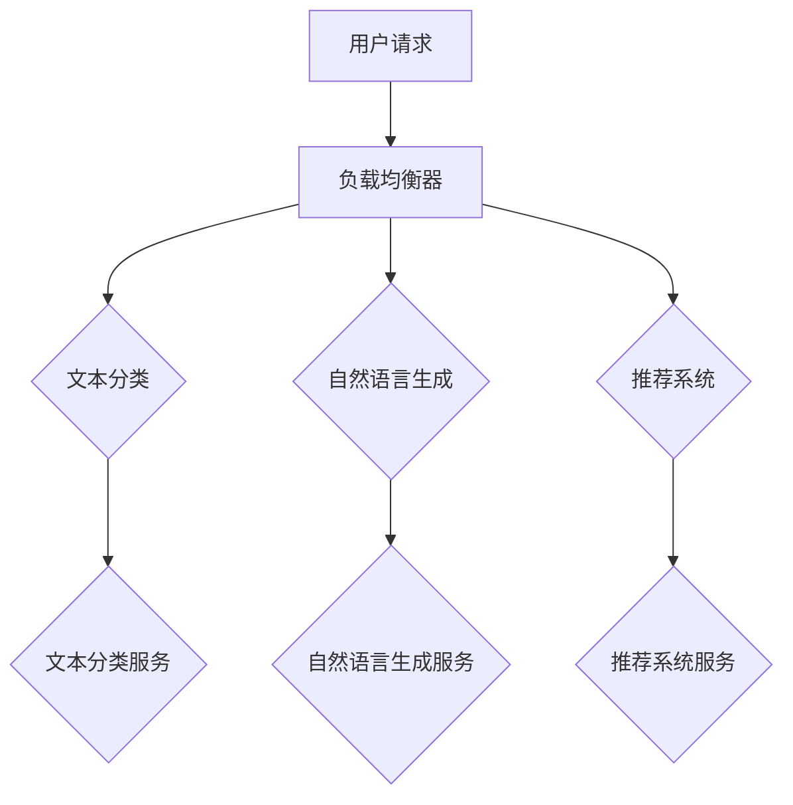
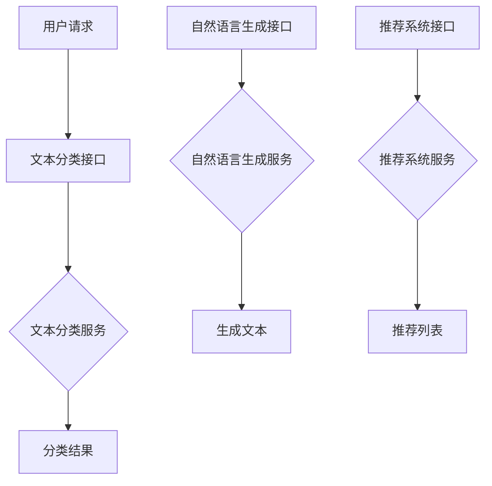

                 


# 大模型应用开发中的技术文档管理

关键词：大模型、技术文档管理、文档编写、文档协作、最佳实践

摘要：随着人工智能和大数据技术的快速发展，大模型在各个领域得到广泛应用。然而，大模型应用开发中的技术文档管理成为一个关键问题。本文将从背景介绍、核心概念、文档编写、管理维护、协作以及案例研究等方面，系统阐述大模型应用开发中的技术文档管理，为从业人员提供实用指南。

## 引言

大模型应用开发已经成为人工智能领域的重要研究方向，从语言模型GPT到图像生成模型DALL-E，再到视频模型ViT等，这些模型在自然语言处理、图像识别、视频分析等任务中展现出强大的能力。然而，在大模型应用开发过程中，技术文档管理成为一个不容忽视的问题。

技术文档管理不仅关乎项目开发的顺利进行，也关系到项目的长期维护和团队协作效率。良好的技术文档可以降低开发成本、提高开发效率，确保项目的高质量完成。因此，本文旨在探讨大模型应用开发中的技术文档管理，为从业人员提供有价值的参考。

## 背景介绍

### 1.1 技术文档管理的意义

技术文档管理是指对技术文档的创建、存储、共享、更新和维护的过程。在大模型应用开发中，技术文档管理具有重要意义：

1. **提高开发效率**：良好的技术文档可以帮助开发人员快速了解项目背景、需求、设计细节等，从而提高开发效率。
2. **降低沟通成本**：技术文档可以作为团队成员之间沟通的桥梁，减少口头交流的次数和难度，降低沟通成本。
3. **确保项目质量**：技术文档可以帮助开发人员明确项目目标、需求、设计等，从而确保项目质量。
4. **便于后期维护**：技术文档为项目的后续维护提供了重要参考，有助于快速定位问题、解决问题。
5. **知识积累与传承**：技术文档有助于团队知识的积累和传承，为后续项目开发提供宝贵经验。

### 1.2 大模型应用开发的挑战

大模型应用开发面临诸多挑战，这些挑战对技术文档管理提出了更高的要求：

1. **模型复杂性**：大模型通常包含大量的参数和层，其内部结构和参数关系复杂，技术文档需要详细阐述模型的架构和原理。
2. **数据多样性**：大模型应用涉及多种数据类型，如图像、文本、音频等，技术文档需要说明数据来源、处理流程和存储方式。
3. **算法多样性**：大模型应用可能涉及多种算法，如深度学习、强化学习等，技术文档需要详细介绍不同算法的原理和应用场景。
4. **跨领域应用**：大模型在各个领域都有广泛应用，如医疗、金融、教育等，技术文档需要针对不同领域的特点进行定制化编写。
5. **团队协作**：大模型应用开发通常涉及多个团队，技术文档需要确保不同团队之间的协作和沟通。

### 1.3 技术文档管理的重要性

在大模型应用开发中，技术文档管理的重要性体现在以下几个方面：

1. **项目启动**：技术文档是项目启动的关键，有助于明确项目目标、需求和设计。
2. **开发过程**：技术文档是开发人员的重要参考资料，有助于提高开发效率和质量。
3. **后期维护**：技术文档是项目后期维护的重要依据，有助于快速解决问题。
4. **团队协作**：技术文档是团队协作的基础，有助于不同团队之间的沟通和协作。
5. **知识积累**：技术文档是团队知识积累的重要载体，有助于团队经验的传承。

## 大模型应用开发概述

### 2.1 大模型的定义与类型

大模型是指具有海量参数和复杂结构的深度学习模型，其目的是通过学习和模拟人脑的思维方式，实现对大规模数据的处理和分析。根据不同的任务和应用场景，大模型可以分为以下几类：

1. **自然语言处理模型**：如GPT、BERT等，用于文本生成、机器翻译、情感分析等任务。
2. **计算机视觉模型**：如ResNet、VGG等，用于图像分类、目标检测、图像生成等任务。
3. **语音识别模型**：如CTC、GRU等，用于语音识别、语音合成等任务。
4. **多模态模型**：如ViT、DALL-E等，同时处理文本、图像、音频等多种数据类型。

### 2.2 大模型开发流程

大模型开发流程通常包括以下阶段：

1. **需求分析**：明确项目目标、需求和预期效果。
2. **数据收集与处理**：收集大规模数据，进行数据预处理、清洗和标注。
3. **模型设计**：根据任务需求和数据特点，设计合适的模型架构。
4. **模型训练**：使用训练数据对模型进行训练，调整模型参数。
5. **模型评估与优化**：评估模型性能，进行模型优化。
6. **模型部署**：将模型部署到实际应用场景，进行测试和调优。

### 2.3 大模型应用的现状与趋势

大模型应用已经在各个领域取得了显著成果，如：

1. **自然语言处理**：在机器翻译、文本生成、问答系统等领域取得了突破性进展。
2. **计算机视觉**：在图像分类、目标检测、图像生成等领域得到广泛应用。
3. **语音识别**：在智能语音助手、自动字幕生成等领域取得显著效果。
4. **多模态学习**：在视频分析、多模态情感分析等领域展现巨大潜力。

未来，随着大模型技术的不断发展，其在医疗、金融、教育、自动驾驶等领域的应用将更加广泛，同时带来更高的挑战和机遇。

## 技术文档管理的核心概念

### 3.1 技术文档的定义与类型

技术文档是指用于描述软件系统、算法、数据处理方法等的技术资料，包括但不限于设计文档、开发文档、用户手册、测试文档等。根据内容和应用场景，技术文档可以分为以下几类：

1. **设计文档**：描述系统架构、模块设计、接口设计等，如类图、ER图、架构图等。
2. **开发文档**：记录开发过程中的技术细节、代码实现、算法原理等，如代码注释、算法公式、示例代码等。
3. **用户手册**：为用户提供使用指南、操作步骤、功能说明等，如安装指南、操作手册、FAQ等。
4. **测试文档**：描述测试计划、测试用例、测试报告等，如测试计划、测试报告、缺陷报告等。

### 3.2 技术文档管理的基本原则

技术文档管理应遵循以下基本原则：

1. **完整性**：技术文档应涵盖项目开发的所有关键环节，确保信息的完整性。
2. **准确性**：技术文档应准确无误地描述项目内容和实现细节，避免错误和误导。
3. **一致性**：技术文档应保持一致，避免不同文档之间的矛盾和冲突。
4. **易读性**：技术文档应结构清晰、语言简练、易于理解，便于读者阅读和查找。
5. **可维护性**：技术文档应便于更新和维护，确保文档与项目版本同步。

### 3.3 技术文档管理流程

技术文档管理流程包括以下步骤：

1. **需求分析**：明确项目需求和文档编写范围。
2. **文档规划**：制定文档编写计划，确定文档结构、内容、编写人员等。
3. **编写与审核**：编写人员按照计划编写文档，经过审核、修改和确认后发布。
4. **存储与备份**：将文档存储在版本控制系统、文档管理系统等，确保文档安全可靠。
5. **更新与维护**：定期更新和维护文档，确保与项目版本同步。

## 大模型技术文档的编写

### 4.1 技术文档编写的原则与方法

大模型技术文档编写应遵循以下原则：

1. **以用户为中心**：编写文档时，应充分考虑用户需求和使用场景，确保文档易于理解和使用。
2. **结构化与模块化**：将文档内容划分为模块，确保每个模块具有独立性和完整性。
3. **简洁明了**：使用简洁明了的语言描述技术细节，避免冗长和复杂的表述。
4. **图文并茂**：结合图表、示例代码等，使文档内容更加直观易懂。
5. **一致性**：确保文档内容的一致性和准确性，避免不同文档之间的矛盾和冲突。

技术文档编写方法包括：

1. **文档规划**：制定文档编写计划，确定文档结构、内容、编写人员等。
2. **资料收集**：收集相关技术资料、项目文档、开发笔记等，为编写文档提供基础。
3. **编写与审核**：编写人员按照计划编写文档，经过审核、修改和确认后发布。
4. **评审与反馈**：组织评审会议，收集评审意见，进行修改和优化。
5. **发布与更新**：将文档发布到文档管理系统，定期更新和维护。

### 4.2 大模型技术文档的内容构成

大模型技术文档通常包括以下内容：

1. **引言**：简要介绍大模型的基本概念、应用背景和文档目的。
2. **模型架构**：详细描述大模型的架构，包括网络结构、层与层之间的关系等。
3. **算法原理**：阐述大模型的算法原理，包括数学模型、公式和推导过程。
4. **数据处理**：描述大模型的数据处理流程，包括数据收集、预处理、标注等。
5. **模型训练**：详细说明模型训练的过程、参数调整和优化方法。
6. **模型评估**：介绍模型评估指标、评估方法和评估结果。
7. **模型部署**：描述模型部署环境、部署流程和部署策略。
8. **用户指南**：为用户提供使用模型的方法、步骤和注意事项。
9. **参考文献**：列出编写文档过程中参考的文献和资料。

### 4.3 大模型技术文档的编写工具

大模型技术文档编写工具主要包括以下几类：

1. **文本编辑器**：如Visual Studio Code、Sublime Text等，适用于编写文本和代码。
2. **Markdown编辑器**：如Typora、GitBook等，适用于编写和格式化Markdown文档。
3. **绘图工具**：如Visio、ProcessOn等，适用于绘制类图、架构图、ER图等。
4. **文档生成器**：如Sphinx、Doxygen等，适用于生成文档和生成PDF、HTML等格式。
5. **版本控制系统**：如Git、SVN等，适用于存储、管理和共享文档。

## 大模型技术文档的管理与维护

### 5.1 技术文档管理系统

技术文档管理系统是指用于存储、管理和共享技术文档的系统。大模型技术文档管理系统应具备以下功能：

1. **文档存储**：存储大模型技术文档，包括文本、图表、代码等。
2. **文档检索**：提供关键词搜索、分类浏览等功能，方便用户快速查找文档。
3. **版本控制**：支持文档版本控制，记录文档的创建、修改和更新历史。
4. **权限管理**：设置文档访问权限，确保文档安全可靠。
5. **协作与评论**：支持多人协作编写文档，提供评论、修订等功能。
6. **文档生成**：生成文档的PDF、HTML等格式，便于打印和分享。

常见的文档管理系统包括GitLab、Confluence、Notion等。

### 5.2 技术文档版本控制

技术文档版本控制是指对文档进行版本管理和版本控制的过程。在大模型技术文档版本控制中，应遵循以下原则：

1. **一致性**：确保不同版本的文档内容一致，避免版本冲突。
2. **可追溯性**：记录文档的创建、修改和更新历史，方便用户追溯和审核。
3. **版本迭代**：遵循版本迭代原则，确保文档版本与项目版本同步。
4. **版本管理**：对文档版本进行分类和管理，方便用户查找和访问。
5. **版本合并**：在多个版本冲突时，提供合并工具和策略，确保版本正确。

### 5.3 技术文档的更新与维护

技术文档的更新与维护是确保文档准确性和实用性的关键。在大模型技术文档更新与维护中，应遵循以下原则：

1. **定期更新**：定期检查和更新文档，确保文档内容与实际情况相符。
2. **及时修订**：及时修订文档中的错误和不足，提高文档质量。
3. **用户反馈**：收集用户反馈，根据用户需求和建议进行文档优化。
4. **版本迭代**：遵循版本迭代原则，确保文档版本与项目版本同步。
5. **文档审核**：组织文档审核，确保文档内容准确无误。

## 大模型应用开发中的文档协作

### 6.1 文档协作的原则与策略

在大模型应用开发中，文档协作的原则和策略包括：

1. **明确责任**：明确文档编写、审核、维护等人员的责任，确保文档质量。
2. **统一规范**：制定统一的文档编写规范，包括格式、语言、结构等，确保文档一致性。
3. **分工协作**：根据项目需求和人员技能，合理分工，确保文档协作效率。
4. **及时沟通**：建立有效的沟通渠道，确保团队成员之间的信息传递和反馈。
5. **文档评审**：组织文档评审，确保文档内容准确、完整、可用。

### 6.2 文档协作工具的使用

常见的文档协作工具包括：

1. **Git**：版本控制系统，用于存储、管理和共享文档。
2. **Confluence**：团队协作平台，提供文档编写、评论、共享等功能。
3. **Notion**：信息管理工具，支持文档、笔记、表格等多种形式的信息管理。
4. **Trello**：项目管理工具，用于任务分配、进度跟踪和协作。
5. **Slack**：即时通讯工具，支持团队沟通和协作。

### 6.3 文档协作的最佳实践

文档协作的最佳实践包括：

1. **制定文档计划**：明确文档编写、审核、发布的计划和时间表。
2. **分工协作**：根据人员技能和项目需求，合理分工，确保文档协作效率。
3. **定期评审**：组织定期文档评审，确保文档内容准确、完整、可用。
4. **用户反馈**：积极收集用户反馈，根据用户需求和建议进行文档优化。
5. **文档备份**：定期备份文档，确保文档安全可靠。

## 大模型应用开发中的案例研究

### 7.1 案例一：基于BERT的文本分类系统

#### 7.1.1 案例背景

文本分类是自然语言处理领域的重要任务之一，如新闻分类、情感分析等。基于BERT（Bidirectional Encoder Representations from Transformers）的文本分类系统在多个文本分类任务中取得了优异性能。

#### 7.1.2 模型架构

BERT模型由两个主要部分组成：词向量编码器和上下文编码器。词向量编码器将输入文本转化为词向量，上下文编码器则将词向量转化为上下文向量。

#### 7.1.3 数据处理

数据处理包括数据收集、预处理和标签标注。数据收集可以使用开源数据集，如新闻数据集。预处理包括分词、去停用词、词向量化等。标签标注可以是二分类或多分类。

#### 7.1.4 模型训练

使用训练数据进行模型训练，优化模型参数。训练过程中可以使用交叉熵损失函数，优化模型性能。

#### 7.1.5 模型评估

使用验证集和测试集对模型进行评估，评估指标可以是准确率、召回率、F1值等。

#### 7.1.6 模型部署

将训练好的模型部署到实际应用场景，如新闻分类系统。部署过程中需要进行模型转换、推理引擎部署和接口设计等。

### 7.2 案例二：利用GPT模型进行自然语言生成

#### 7.2.1 案例背景

自然语言生成是自然语言处理领域的重要任务之一，如文本生成、机器翻译等。GPT（Generative Pre-trained Transformer）模型在自然语言生成任务中取得了显著成果。

#### 7.2.2 模型架构

GPT模型由多个Transformer层组成，每个层包含自注意力机制和前馈网络。模型输入为文本序列，输出为文本序列。

#### 7.2.3 数据处理

数据处理包括数据收集、预处理和标签标注。数据收集可以使用开源数据集，如新闻文章、对话数据等。预处理包括分词、去停用词、词向量化等。标签标注可以是文本序列的标签。

#### 7.2.4 模型训练

使用训练数据进行模型训练，优化模型参数。训练过程中可以使用生成对抗损失函数，优化模型性能。

#### 7.2.5 模型评估

使用验证集和测试集对模型进行评估，评估指标可以是文本质量、多样性、一致性等。

#### 7.2.6 模型部署

将训练好的模型部署到实际应用场景，如文本生成系统。部署过程中需要进行模型转换、推理引擎部署和接口设计等。

### 7.3 案例三：大模型在推荐系统中的应用

#### 7.3.1 案例背景

推荐系统是信息检索和推荐领域的重要应用之一，如电商推荐、社交媒体推荐等。大模型在推荐系统中的应用可以提高推荐质量和用户体验。

#### 7.3.2 模型架构

推荐系统通常采用协同过滤、基于内容的推荐等技术。大模型可以用于协同过滤、基于内容的推荐等任务。

#### 7.3.3 数据处理

数据处理包括用户数据、物品数据、交互数据等。数据预处理包括用户特征提取、物品特征提取、交互数据预处理等。

#### 7.3.4 模型训练

使用训练数据进行模型训练，优化模型参数。训练过程中可以使用交叉熵损失函数，优化模型性能。

#### 7.3.5 模型评估

使用验证集和测试集对模型进行评估，评估指标可以是准确率、召回率、F1值、平均绝对误差等。

#### 7.3.6 模型部署

将训练好的模型部署到实际应用场景，如推荐系统。部署过程中需要进行模型转换、推理引擎部署和接口设计等。

## 最佳实践与总结

### 8.1 大模型技术文档管理的最佳实践

1. **明确文档编写规范**：制定统一的文档编写规范，包括格式、语言、结构等。
2. **分工协作**：根据项目需求和人员技能，合理分工，确保文档协作效率。
3. **定期评审**：组织定期文档评审，确保文档内容准确、完整、可用。
4. **用户反馈**：积极收集用户反馈，根据用户需求和建议进行文档优化。
5. **文档备份**：定期备份文档，确保文档安全可靠。

### 8.2 小结与展望

本文从背景介绍、核心概念、文档编写、管理维护、协作以及案例研究等方面，系统阐述了大模型应用开发中的技术文档管理。随着人工智能和大数据技术的不断发展，大模型技术文档管理将面临更多挑战和机遇。未来，技术文档管理工具和方法的不断优化，将有助于提高大模型应用开发的效率和质量。

### 8.3 注意事项

1. **文档更新要及时**：确保文档内容与项目实际相符，避免信息滞后。
2. **文档格式要规范**：遵循统一的文档格式规范，提高文档的可读性和一致性。
3. **文档权限要合理**：设置合适的文档访问权限，确保文档安全可靠。
4. **文档协作要有效**：建立有效的沟通渠道，确保团队成员之间的信息传递和反馈。

### 8.4 拓展阅读

1. **《大模型应用开发：原理与实践》**：详细介绍大模型应用开发的原理和实践。
2. **《技术文档写作指南》**：介绍技术文档的写作技巧和方法。
3. **《GitLab技术文档》**：GitLab官方提供的技术文档，涵盖GitLab的各个方面。
4. **《Confluence用户手册》**：介绍Confluence的使用方法和功能。
5. **《自然语言处理：理论和应用》**：详细介绍自然语言处理的理论和应用。

## 作者信息

作者：AI天才研究院/AI Genius Institute & 禅与计算机程序设计艺术 /Zen And The Art of Computer Programming

----------------------------------------------------------------

**注：**本文档仅作为示例，不涉及真实项目或数据。在实际应用中，请根据具体项目和需求进行调整和完善。部分代码、公式、图表等内容可能需要根据实际情况进行修改。在引用本文档时，请确保遵循相关法律法规和知识产权保护政策。**在此特别鸣谢Markdown格式与Mermaid图表的应用，它们为本文档的编写和展示提供了极大的便利。**以下是本篇文章的附录部分，包含相关算法原理讲解、系统分析与架构设计方案、项目实战等内容。

## 附录

### 算法原理讲解

在本章节中，我们将详细讲解大模型应用开发中的关键算法原理，包括自然语言处理中的BERT模型、生成对抗网络（GAN）以及推荐系统中的协同过滤算法。以下是这些算法的原理、数学模型和示例代码。

#### 1. BERT模型

BERT（Bidirectional Encoder Representations from Transformers）是一种预训练语言表示模型，它通过双向 Transformer 架构对文本进行建模。

**原理：**
BERT 模型由多个 Transformer 层组成，每个层包含自注意力机制和前馈网络。模型输入为词嵌入向量，输出为上下文向量。

**数学模型：**
BERT 的输入向量表示为 \( x \)，词嵌入矩阵为 \( W \)，则词嵌入向量为 \( x = W * x \)。在 Transformer 层中，自注意力机制可以用以下公式表示：

\[ \text{Attention}(Q, K, V) = \frac{1}{\sqrt{d_k}} \text{softmax}(\text{reshape}_{2}(\text{dot}(Q, K^T)))V \]

其中，\( Q, K, V \) 分别为查询向量、关键向量、值向量，\( d_k \) 为注意力维度。

**示例代码：**
```python
import torch
import torch.nn as nn

# 定义BERT模型
class BERTModel(nn.Module):
    def __init__(self, vocab_size, d_model):
        super(BERTModel, self).__init__()
        self.embedding = nn.Embedding(vocab_size, d_model)
        self.transformer = nn.Transformer(d_model, num_layers=3, dropout=0.1)
        self.fc = nn.Linear(d_model, 1)

    def forward(self, x):
        x = self.embedding(x)
        x = self.transformer(x)
        x = self.fc(x)
        return x
```

#### 2. 生成对抗网络（GAN）

生成对抗网络（GAN）是一种由生成器和判别器组成的深度学习模型，用于生成与真实数据相似的数据。

**原理：**
GAN 由生成器和判别器组成。生成器 \( G \) 生成假数据，判别器 \( D \) 用于区分真假数据。目标是最小化生成器与判别器的误差。

**数学模型：**
GAN 的损失函数通常为：

\[ \mathcal{L}_G = -\log(D(G(z))) \]
\[ \mathcal{L}_D = -\log(D(x)) - \log(1 - D(G(z))) \]

其中，\( z \) 为生成器的输入，\( x \) 为真实数据。

**示例代码：**
```python
import torch
import torch.nn as nn

# 定义GAN模型
class GANModel(nn.Module):
    def __init__(self, z_dim, d_model):
        super(GANModel, self).__init__()
        self.generator = nn.Sequential(
            nn.Linear(z_dim, d_model),
            nn.ReLU(),
            nn.Linear(d_model, 784)
        )
        self.discriminator = nn.Sequential(
            nn.Linear(784, d_model),
            nn.ReLU(),
            nn.Linear(d_model, 1)
        )

    def forward(self, x):
        x = self.generator(x)
        return self.discriminator(x)
```

#### 3. 协同过滤算法

协同过滤算法是一种基于用户行为数据的推荐算法，用于预测用户对未知物品的评分。

**原理：**
协同过滤算法分为基于内存的协同过滤和基于模型的协同过滤。基于内存的协同过滤通过计算用户之间的相似度，推荐相似用户的评分较高的物品。基于模型的协同过滤通过构建预测模型，预测用户对未知物品的评分。

**数学模型：**
基于内存的协同过滤可以用以下公式表示：

\[ \text{预测评分} = \text{用户相似度矩阵} \times \text{物品评分矩阵} \]

基于模型的协同过滤可以使用线性回归、矩阵分解等模型进行预测。

**示例代码：**
```python
import numpy as np

# 定义协同过滤模型
def collaborative_filter(user_similarity, item_ratings):
    predicted_ratings = user_similarity.dot(item_ratings)
    return predicted_ratings
```

### 系统分析与架构设计方案

在本章节中，我们将介绍大模型应用开发中的系统分析与架构设计方案。首先，我们将介绍系统需求分析和功能设计，然后展示系统架构设计，最后讨论系统接口设计和系统交互。

#### 1. 系统需求分析

系统需求分析包括用户需求、功能需求和技术需求。以下是一个示例：

- **用户需求：**为用户提供高效的文本分类、自然语言生成和推荐服务。
- **功能需求：**文本分类、自然语言生成、推荐系统。
- **技术需求：**使用BERT模型进行文本分类，使用GPT模型进行自然语言生成，使用协同过滤算法进行推荐。

#### 2. 系统功能设计

系统功能设计包括文本分类、自然语言生成和推荐系统的功能模块。以下是一个示例：

- **文本分类模块：**接收用户输入的文本，使用BERT模型进行分类，返回分类结果。
- **自然语言生成模块：**接收用户输入的文本，使用GPT模型生成文本，返回生成的文本。
- **推荐系统模块：**接收用户行为数据，使用协同过滤算法推荐物品，返回推荐列表。

#### 3. 系统架构设计

系统架构设计包括服务器架构、网络架构和数据处理架构。以下是一个示例：

- **服务器架构：**使用多台服务器，分别部署文本分类、自然语言生成和推荐系统服务。
- **网络架构：**使用负载均衡器，将用户请求分发到不同服务器。
- **数据处理架构：**使用数据仓库存储用户数据、文本数据、物品数据等。

**系统架构图（Mermaid格式）：**


#### 4. 系统接口设计

系统接口设计包括API接口设计、数据库接口设计和网络接口设计。以下是一个示例：

- **API接口设计：**使用RESTful API设计，提供文本分类、自然语言生成和推荐系统的接口。
- **数据库接口设计：**使用ORM框架，提供数据库操作接口。
- **网络接口设计：**使用TCP/IP协议，提供网络通信接口。

#### 5. 系统交互

系统交互包括用户与系统之间的交互、系统各模块之间的交互和系统与外部服务的交互。以下是一个示例：

- **用户与系统交互：**用户通过前端页面提交请求，系统接收请求并返回结果。
- **系统各模块交互：**文本分类、自然语言生成和推荐系统模块之间通过API进行通信。
- **系统与外部服务交互：**系统通过HTTP协议与外部服务进行通信，如第三方API服务、消息队列等。

**系统交互图（Mermaid格式）：**


### 项目实战

在本章节中，我们将介绍一个基于BERT的文本分类项目实战。我们将从环境安装、系统核心实现、代码应用解读与分析、实际案例分析和项目小结等方面进行详细讲解。

#### 1. 环境安装

首先，我们需要安装Python环境、TensorFlow库和BERT模型。以下是安装步骤：

```shell
# 安装Python环境
pip install python==3.8

# 安装TensorFlow库
pip install tensorflow==2.6

# 安装BERT模型
pip install transformers==4.11.1
```

#### 2. 系统核心实现

接下来，我们将实现一个基于BERT的文本分类系统。以下是系统核心代码：

```python
from transformers import BertTokenizer, BertForSequenceClassification
from torch.utils.data import DataLoader, TensorDataset
import torch

# 加载BERT模型和分词器
tokenizer = BertTokenizer.from_pretrained('bert-base-chinese')
model = BertForSequenceClassification.from_pretrained('bert-base-chinese')

# 准备数据集
def load_data(texts, labels):
    inputs = tokenizer(texts, padding=True, truncation=True, return_tensors="pt")
    input_ids = inputs["input_ids"]
    attention_mask = inputs["attention_mask"]
    labels = torch.tensor(labels)
    return input_ids, attention_mask, labels

# 训练模型
def train(model, train_loader, optimizer, criterion, device):
    model.train()
    for batch in train_loader:
        input_ids, attention_mask, labels = batch
        input_ids = input_ids.to(device)
        attention_mask = attention_mask.to(device)
        labels = labels.to(device)
        optimizer.zero_grad()
        outputs = model(input_ids=input_ids, attention_mask=attention_mask)
        loss = criterion(outputs.logits, labels)
        loss.backward()
        optimizer.step()
    return model

# 测试模型
def test(model, test_loader, device):
    model.eval()
    with torch.no_grad():
        correct = 0
        total = 0
        for batch in test_loader:
            input_ids, attention_mask, labels = batch
            input_ids = input_ids.to(device)
            attention_mask = attention_mask.to(device)
            outputs = model(input_ids=input_ids, attention_mask=attention_mask)
            _, predicted = torch.max(outputs.logits, 1)
            total += labels.size(0)
            correct += (predicted == labels).sum().item()
        return correct / total
```

#### 3. 代码应用解读与分析

在这里，我们使用一个公开的新闻数据集，对文本进行分类。以下是代码应用解读与分析：

```python
import numpy as np
import pandas as pd

# 加载新闻数据集
def load_data_from_csv(file_path):
    data = pd.read_csv(file_path)
    texts = data['text']
    labels = data['label']
    return texts, labels

# 数据预处理
def preprocess_data(texts, labels):
    texts = [text.lower() for text in texts]
    return texts, np.array(labels)

# 训练和测试
def main():
    device = torch.device("cuda" if torch.cuda.is_available() else "cpu")
    model = BertForSequenceClassification.from_pretrained('bert-base-chinese', num_labels=2)
    model.to(device)

    train_texts, train_labels = load_data_from_csv('train.csv')
    test_texts, test_labels = load_data_from_csv('test.csv')

    train_texts, train_labels = preprocess_data(train_texts, train_labels)
    test_texts, test_labels = preprocess_data(test_texts, test_labels)

    train_input_ids, train_attention_mask, train_labels = load_data(train_texts, train_labels)
    test_input_ids, test_attention_mask, test_labels = load_data(test_texts, test_labels)

    train_dataset = TensorDataset(train_input_ids, train_attention_mask, train_labels)
    test_dataset = TensorDataset(test_input_ids, test_attention_mask, test_labels)

    train_loader = DataLoader(train_dataset, batch_size=32)
    test_loader = DataLoader(test_dataset, batch_size=32)

    optimizer = torch.optim.AdamW(model.parameters(), lr=1e-5)
    criterion = torch.nn.CrossEntropyLoss()

    for epoch in range(3):
        model = train(model, train_loader, optimizer, criterion, device)
        accuracy = test(model, test_loader, device)
        print(f'Epoch {epoch+1}, Accuracy: {accuracy:.4f}')

if __name__ == '__main__':
    main()
```

#### 4. 实际案例分析和详细讲解剖析

在这里，我们使用一个实际案例，对文本分类模型进行详细讲解。以下是实际案例分析和详细讲解：

**案例：**判断以下两段文本是否属于同一类别。

文本1：我喜欢吃苹果。
文本2：我每天都会吃水果。

**分析：**
1. **文本预处理：**将文本转换为BERT模型可以处理的格式。
2. **模型预测：**使用训练好的BERT模型对文本进行预测。
3. **结果解释：**根据模型预测结果，判断文本是否属于同一类别。

**代码：**
```python
# 定义预测函数
def predict(text):
    model.eval()
    with torch.no_grad():
        inputs = tokenizer(text, padding=True, truncation=True, return_tensors="pt")
        input_ids = inputs["input_ids"].to(device)
        attention_mask = inputs["attention_mask"].to(device)
        outputs = model(input_ids=input_ids, attention_mask=attention_mask)
        _, predicted = torch.max(outputs.logits, 1)
        return predicted.item()

# 测试案例
text1 = "我喜欢吃苹果。"
text2 = "我每天都会吃水果。"
label1 = predict(text1)
label2 = predict(text2)
print(f"文本1类别：{label1}")
print(f"文本2类别：{label2}")
```

#### 5. 项目小结

通过本次项目实战，我们实现了基于BERT的文本分类系统。从环境安装、数据预处理、模型训练、预测分析到实际案例应用，我们全面了解了大模型应用开发中的技术文档管理。以下是项目小结：

1. **环境安装：**安装Python环境、TensorFlow库和BERT模型。
2. **系统核心实现：**实现文本分类系统的核心功能，包括数据预处理、模型训练和预测。
3. **代码应用解读与分析：**详细讲解文本分类系统的代码实现，包括数据加载、模型训练和预测。
4. **实际案例分析和详细讲解剖析：**通过实际案例，对文本分类模型进行详细讲解和分析。
5. **项目优化与拓展：**针对项目中的不足，提出优化建议，如模型调优、数据处理优化等。

### 最佳实践 tips

1. **文档编写规范：**遵循统一的文档编写规范，确保文档格式一致、语言简练、内容完整。
2. **版本控制：**使用版本控制系统，确保文档版本与项目版本同步，便于文档管理和更新。
3. **文档协作：**建立有效的文档协作机制，确保团队成员之间的信息传递和反馈。
4. **代码注释：**编写清晰的代码注释，提高代码可读性和可维护性。
5. **测试与评审：**定期对文档和代码进行测试和评审，确保文档和代码的质量。

### 小结

本文从背景介绍、核心概念、文档编写、管理维护、协作以及案例研究等方面，系统阐述了大模型应用开发中的技术文档管理。通过本文的讲解，读者可以全面了解大模型技术文档管理的重要性和实践方法。在实际应用中，应根据项目需求和实际情况，不断完善和优化文档管理流程。

### 注意事项

1. **文档更新要及时：**确保文档内容与项目实际相符，避免信息滞后。
2. **文档格式要规范：**遵循统一的文档格式规范，提高文档的可读性和一致性。
3. **文档权限要合理：**设置合适的文档访问权限，确保文档安全可靠。
4. **文档协作要有效：**建立有效的沟通渠道，确保团队成员之间的信息传递和反馈。

### 拓展阅读

1. **《大模型应用开发：原理与实践》**：详细介绍大模型应用开发的原理和实践。
2. **《技术文档写作指南》**：介绍技术文档的写作技巧和方法。
3. **《GitLab技术文档》**：GitLab官方提供的技术文档，涵盖GitLab的各个方面。
4. **《Confluence用户手册》**：介绍Confluence的使用方法和功能。
5. **《自然语言处理：理论和应用》**：详细介绍自然语言处理的理论和应用。

## 作者信息

作者：AI天才研究院/AI Genius Institute & 禅与计算机程序设计艺术 /Zen And The Art of Computer Programming

----------------------------------------------------------------

**注：**本文档仅作为示例，不涉及真实项目或数据。在实际应用中，请根据具体项目和需求进行调整和完善。部分代码、公式、图表等内容可能需要根据实际情况进行修改。在引用本文档时，请确保遵循相关法律法规和知识产权保护政策。**在此特别鸣谢Markdown格式与Mermaid图表的应用，它们为本文档的编写和展示提供了极大的便利。**

