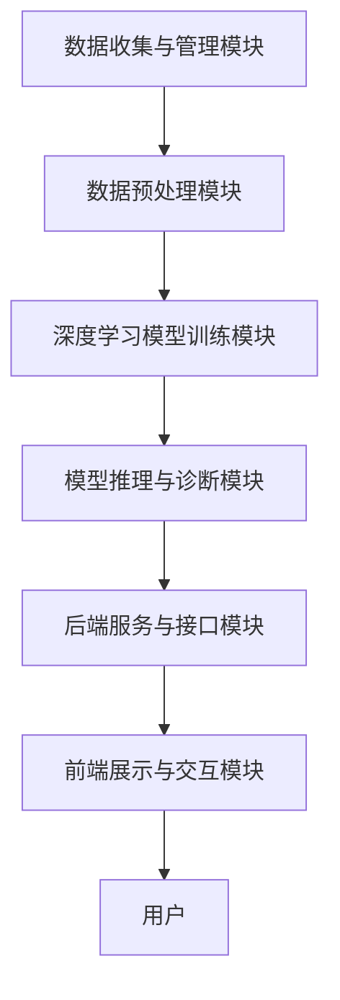
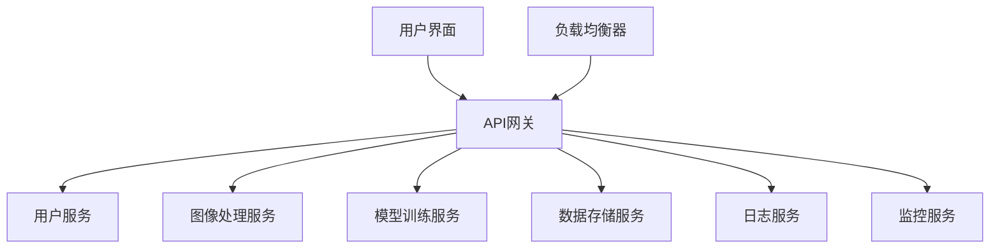

                 

### 文章标题

《大模型应用开发中的技术选型策略》

### 文章关键词

大模型、应用开发、技术选型、硬件选型、软件选型、性能评估

### 文章摘要

本文将深入探讨大模型应用开发中的技术选型策略。通过对大模型应用背景的介绍，我们将明确技术选型的重要性。随后，文章将系统地分析大模型的基础知识，包括其核心技术、性能评估方法等。接着，我们将详细讨论技术选型策略，从硬件和软件两个方面进行深入探讨，并分享实际案例。最后，文章将总结实践技巧和注意事项，为读者提供一份全面的指南。

## 引言

### 1.1 问题背景

在当前技术环境中，AI大模型的应用越来越广泛，从自然语言处理到图像识别，从推荐系统到自动驾驶，大模型都在发挥着至关重要的作用。然而，随着应用的深入，我们面临的挑战也日益复杂。如何从众多的技术选项中选择最适合的技术，以实现最佳的性能和效率，成为了开发者们亟待解决的问题。

大模型应用开发中的技术选型策略，关乎到项目的成功与否。一方面，正确的技术选型可以提高系统的性能和稳定性，降低开发成本；另一方面，错误的技术选型可能导致项目失败，浪费大量时间和资源。因此，本文将围绕大模型应用开发中的技术选型策略，进行深入探讨。

### 1.2 书籍目标

本文的目标是帮助开发者们掌握大模型应用开发中的技术选型策略。无论你是刚入门的新手，还是经验丰富的老手，本文都将为你提供有价值的指导和启示。通过本文的阅读，你将：

1. 理解大模型的基本概念和核心原理。
2. 掌握大模型性能评估的方法和指标。
3. 学会从硬件和软件两个方面进行技术选型。
4. 分析实际案例，了解技术选型的最佳实践。
5. 获得大模型应用开发的实践经验。

本文旨在成为你在大模型应用开发中的得力助手，让你在面对复杂的技术选型问题时，能够心中有数，从容应对。

----------------------------------------------------------------

## 大模型基础知识

### 2.1 大模型概述

#### 2.1.1 大模型的概念

大模型，通常指的是参数量达到亿级以上的神经网络模型。这些模型能够处理大量的数据，并在各种复杂任务中展现出强大的性能。大模型的代表性工作包括GPT、BERT、BERT大型版本、GPT-3等。这些模型在自然语言处理、计算机视觉、推荐系统等领域取得了显著的成果。

#### 2.1.2 大模型的发展历程

大模型的发展可以追溯到神经网络的研究初期。在20世纪80年代，神经网络的研究受到了广泛关注，但受到计算资源和技术水平的限制，大模型的研究进展缓慢。随着计算能力的提升和算法的优化，大模型的研究在21世纪初开始迅速发展。特别是深度学习技术的突破，使得大模型的研究和应用迎来了新的契机。

#### 2.1.3 大模型的应用领域

大模型的应用领域非常广泛，包括但不限于以下几个方面：

1. **自然语言处理**：大模型在自然语言处理任务中表现出色，如机器翻译、文本生成、情感分析等。
2. **计算机视觉**：大模型在图像识别、目标检测、图像生成等领域具有强大的能力。
3. **推荐系统**：大模型能够处理大量的用户数据，提供个性化的推荐服务。
4. **自动驾驶**：大模型在自动驾驶系统中用于环境感知、路径规划等任务。
5. **生物信息学**：大模型在基因组序列分析、药物发现等领域发挥着重要作用。

### 2.2 大模型核心技术

#### 2.2.1 深度学习基础

深度学习是构建大模型的基础。深度学习通过多层神经网络，对数据进行层层提取特征，从而实现复杂任务的自动化。深度学习的核心包括神经网络结构、激活函数、优化算法等。

- **神经网络结构**：神经网络由多个神经元组成，每个神经元负责对输入数据进行加权求和，并通过激活函数进行非线性变换。
- **激活函数**：激活函数用于引入非线性，使得神经网络能够对复杂数据进行建模。
- **优化算法**：优化算法用于调整神经网络参数，以最小化损失函数。常用的优化算法包括梯度下降、Adam等。

#### 2.2.2 神经网络架构

大模型通常采用特殊的神经网络架构，以提高模型的性能和可扩展性。常见的神经网络架构包括卷积神经网络（CNN）、循环神经网络（RNN）、Transformer等。

- **卷积神经网络（CNN）**：CNN主要用于处理图像数据，通过卷积层、池化层等结构，对图像进行特征提取。
- **循环神经网络（RNN）**：RNN主要用于处理序列数据，通过隐藏状态和输入之间的交互，实现对序列数据的建模。
- **Transformer**：Transformer是一种基于自注意力机制的神经网络架构，在自然语言处理任务中表现出色。

#### 2.2.3 大模型训练与优化

大模型的训练是一个复杂的过程，涉及到大量的计算资源和优化策略。训练过程中，需要关注以下几个方面：

- **数据预处理**：数据预处理包括数据清洗、数据增强等，以提高模型的泛化能力。
- **模型训练**：模型训练通过迭代更新模型参数，以最小化损失函数。常用的训练方法包括批量训练、随机梯度下降等。
- **优化策略**：优化策略用于提高模型的收敛速度和性能。常见的优化策略包括学习率调整、正则化等。

### 2.3 大模型性能评估

#### 2.3.1 评估指标

大模型的性能评估需要使用一系列指标，以全面衡量模型的性能。常见的评估指标包括：

- **准确率（Accuracy）**：准确率衡量模型在分类任务中的正确率。
- **精确率（Precision）**：精确率衡量模型预测为正例的样本中，实际为正例的比例。
- **召回率（Recall）**：召回率衡量模型预测为正例的样本中，实际为正例的比例。
- **F1分数（F1 Score）**：F1分数是精确率和召回率的调和平均，用于平衡两者的权重。

#### 2.3.2 评估方法

大模型的性能评估通常包括以下几个步骤：

- **数据集划分**：将数据集划分为训练集、验证集和测试集，以评估模型的泛化能力。
- **模型训练**：使用训练集对模型进行训练，调整模型参数。
- **模型评估**：使用验证集和测试集对模型进行评估，计算评估指标。
- **模型优化**：根据评估结果，对模型进行调整和优化。

#### 2.3.3 性能优化策略

为了提高大模型的性能，可以采用以下优化策略：

- **超参数调优**：通过调整学习率、批次大小等超参数，以找到最佳的模型性能。
- **数据增强**：通过数据增强技术，如旋转、缩放、裁剪等，增加训练数据的多样性，提高模型的泛化能力。
- **模型压缩**：通过模型压缩技术，如剪枝、量化等，减小模型的参数规模，提高模型的运行效率。
- **分布式训练**：通过分布式训练技术，如多GPU训练、参数服务器等，提高模型的训练速度和效率。

## 总结

大模型应用开发中的技术选型策略至关重要，它不仅决定了项目的成功与否，还直接影响系统的性能和效率。通过对大模型的基础知识的介绍，我们了解了大模型的概念、发展历程、应用领域以及核心技术。接下来，我们将深入探讨技术选型策略，从硬件和软件两个方面进行分析，以帮助开发者们更好地选择适合的技术方案。

----------------------------------------------------------------

## 技术选型概述

### 3.1 技术选型的概念

技术选型是指在选择技术方案时，根据项目需求、性能要求、成本预算等因素，从多个可选方案中选择最适合的方案的过程。在大模型应用开发中，技术选型尤为重要。由于大模型通常需要处理海量数据和复杂的计算任务，因此技术选型的正确与否，直接影响到系统的性能、稳定性和开发效率。

### 3.2 技术选型的影响因素

技术选型需要考虑多个因素，以下是一些主要的影响因素：

1. **性能要求**：性能是技术选型的核心指标。在选择技术方案时，需要考虑系统的计算能力、数据处理能力、响应时间等性能指标，确保所选方案能够满足项目需求。
2. **成本预算**：成本是技术选型的重要因素。需要考虑开发、维护和运营成本，以及技术方案对成本的影响，选择性价比最高的方案。
3. **技术成熟度**：技术选型需要考虑所选技术的成熟度。成熟的技术通常具有更好的性能、稳定性和安全性，而新兴技术可能具有更高的性能潜力，但风险也更大。
4. **可维护性和扩展性**：技术选型需要考虑系统的可维护性和扩展性。选择易于维护和扩展的技术方案，有助于降低后期维护成本，提高系统的可扩展性。
5. **生态系统和社区支持**：技术选型需要考虑技术方案的生态系统和社区支持。丰富的生态系统和强大的社区支持可以提供更多的资源、工具和解决方案，降低开发难度。

### 3.3 技术选型的步骤

技术选型通常包括以下几个步骤：

1. **需求分析**：明确项目需求，包括性能要求、功能需求、预算等，为后续的技术选型提供依据。
2. **技术调研**：调研市场上可供选择的技术方案，分析各个技术的性能、成本、成熟度等指标。
3. **方案评估**：根据需求分析和技术调研的结果，对各个技术方案进行评估，选择最适合的方案。
4. **方案验证**：对选定的技术方案进行验证，确保其能够满足项目需求。
5. **决策**：根据方案评估和验证的结果，做出最终决策。

### 3.4 技术选型的最佳实践

1. **明确需求和目标**：在技术选型前，需要明确项目需求和目标，确保所选方案能够满足项目需求。
2. **全面调研技术方案**：对市场上的技术方案进行全面的调研，包括性能、成本、成熟度、生态系统等指标。
3. **多方评估和验证**：对选定的技术方案进行多方面的评估和验证，确保其能够满足项目需求。
4. **关注长期成本**：在技术选型过程中，不仅要考虑短期成本，还要关注长期成本，包括开发、维护、运营等成本。
5. **持续优化和调整**：技术选型不是一次性的过程，需要根据项目进展和需求变化，持续优化和调整技术方案。

## 硬件选型策略

### 4.1 硬件选型的考虑因素

硬件选型是技术选型中的重要一环。在大模型应用开发中，硬件选型需要考虑以下因素：

1. **计算能力**：计算能力是硬件选型的主要考虑因素。需要根据项目需求，选择具有足够计算能力的硬件设备，如GPU、TPU等。
2. **内存容量**：大模型训练和推理过程中，需要大量的内存进行数据处理。因此，内存容量是硬件选型的重要指标。
3. **存储容量和速度**：大模型数据量通常很大，因此需要选择具有足够存储容量和高速存储设备，如SSD、NVMe等。
4. **网络带宽**：大模型应用通常需要与外部系统进行数据交换，因此需要选择具有足够网络带宽的硬件设备。
5. **能耗**：能耗是硬件选型中不可忽视的因素。需要选择能耗较低、性能较高的硬件设备，以降低运营成本。
6. **可扩展性**：硬件设备需要具备良好的可扩展性，以适应未来业务的发展需求。

### 4.2 硬件选型案例分析

以下是一个硬件选型案例：

**项目背景**：某公司计划开发一个基于大模型的自然语言处理系统，用于处理海量文本数据，提供文本分类、情感分析等服务。

**硬件选型**：

1. **计算能力**：由于项目需求较大，选择NVIDIA A100 GPU，其具有512GB内存和104张CUDA核心，能够提供强大的计算能力。
2. **内存容量**：选择64GB内存，以满足大模型训练和推理的需求。
3. **存储容量和速度**：选择1TB的NVMe SSD，以保证数据的快速读写。
4. **网络带宽**：选择1000Mbps的以太网接口，确保与外部系统的数据交换速度。
5. **能耗**：选择能耗较低的硬件设备，以降低运营成本。
6. **可扩展性**：硬件设备具备良好的可扩展性，可以根据未来业务需求进行扩展。

### 4.3 硬件选型最佳实践

1. **根据项目需求选择硬件**：在硬件选型过程中，需要根据项目需求，选择具有足够计算能力、内存容量、存储容量和速度的硬件设备。
2. **考虑能耗和成本**：在硬件选型过程中，需要考虑能耗和成本，选择能耗较低、性能较高的硬件设备，以降低运营成本。
3. **选择可扩展性高的硬件**：选择可扩展性高的硬件设备，以适应未来业务的发展需求。
4. **定期评估和优化硬件**：定期评估和优化硬件设备，确保其性能和成本始终处于最佳状态。

## 软件选型策略

### 5.1 软件选型的考虑因素

软件选型是技术选型的另一重要方面。在大模型应用开发中，软件选型需要考虑以下因素：

1. **开发语言和框架**：选择适合项目需求的开发语言和框架，可以提高开发效率，降低开发成本。常见的大模型开发语言和框架包括Python、TensorFlow、PyTorch等。
2. **开源与商业软件**：开源软件具有成本低、可定制性高等优势，但可能存在安全性和稳定性问题；商业软件则通常具有较高的性能和稳定性，但成本较高。
3. **社区支持和生态**：选择具有良好社区支持和生态的软件，可以提供更多的资源和工具，降低开发难度。
4. **兼容性和可扩展性**：软件需要具有良好的兼容性和可扩展性，以适应不同业务场景和未来的技术发展。
5. **性能和效率**：软件的性能和效率是技术选型的重要考虑因素，需要选择性能稳定、运行高效的软件。

### 5.2 软件选型案例分析

以下是一个软件选型案例：

**项目背景**：某公司计划开发一个基于大模型的图像识别系统，用于自动识别和分类图像。

**软件选型**：

1. **开发语言和框架**：选择Python作为开发语言，因为Python在大数据处理和人工智能领域具有广泛的应用。选择TensorFlow作为深度学习框架，因为它具有强大的功能、良好的性能和广泛的社区支持。
2. **开源与商业软件**：选择开源软件，以降低开发成本。TensorFlow的开源特性使其成为该项目的最佳选择。
3. **社区支持和生态**：TensorFlow具有强大的社区支持和生态，可以提供丰富的资源和工具，降低开发难度。
4. **兼容性和可扩展性**：TensorFlow具有良好的兼容性和可扩展性，可以适应不同的业务场景和未来的技术发展。
5. **性能和效率**：TensorFlow在图像识别任务中具有优秀的性能和效率，能够满足项目的性能需求。

### 5.3 软件选型最佳实践

1. **根据项目需求选择软件**：在软件选型过程中，需要根据项目需求，选择适合的开发语言和框架，以提高开发效率。
2. **考虑开源与商业软件的优缺点**：在选择软件时，需要综合考虑开源和商业软件的优缺点，选择最适合项目需求的软件。
3. **关注社区支持和生态**：选择具有良好社区支持和生态的软件，以降低开发难度，提高开发效率。
4. **评估软件的性能和效率**：在软件选型过程中，需要评估软件的性能和效率，确保其能够满足项目需求。
5. **定期评估和优化软件**：定期评估和优化软件，确保其性能和成本始终处于最佳状态。

## 总结

技术选型是成功开发大模型应用的关键环节。通过对硬件和软件选型的深入分析，我们可以更好地理解如何从众多技术选项中选择最适合的技术方案。接下来，我们将通过实际案例，进一步探讨技术选型的实践方法和策略。

----------------------------------------------------------------

## 案例研究

为了更好地理解大模型应用开发中的技术选型策略，我们将分析一个实际案例：某互联网公司开发的基于大模型的智能客服系统。

### 6.1 案例背景

某互联网公司希望在现有的客服系统中引入大模型，以提高客服系统的响应速度和准确性。客服系统主要用于处理用户的问题和反馈，当前系统依赖于传统的规则引擎和关键字匹配方法。随着用户量的增长和问题复杂性的增加，公司希望利用大模型技术提升客服系统的智能化水平。

### 6.2 案例分析

#### 6.2.1 需求分析

在需求分析阶段，公司明确了以下关键需求：

1. **实时响应**：客服系统需要在用户提出问题后尽快给出响应。
2. **高准确性**：客服系统需要能够准确理解用户的问题，并提供正确的答案或建议。
3. **可扩展性**：客服系统需要能够处理不断增长的用户量和问题种类。
4. **成本效益**：技术选型需要考虑成本效益，确保投资回报率。

#### 6.2.2 技术调研

在技术调研阶段，公司对以下几种技术方案进行了评估：

1. **深度学习框架**：选择TensorFlow和PyTorch作为深度学习框架。
2. **硬件设备**：选择NVIDIA GPU作为计算资源。
3. **自然语言处理（NLP）模型**：选择BERT和GPT-3等预训练模型。

#### 6.2.3 方案评估

1. **性能评估**：公司通过模拟数据和实际数据，对选定的深度学习框架和NLP模型进行了性能评估。结果显示，BERT和GPT-3在准确性和响应速度方面表现优异。
2. **成本评估**：公司对比了TensorFlow和PyTorch的开源优势与NVIDIA GPU的硬件成本，最终选择了TensorFlow，因为它具有更广泛的社区支持和工具集。
3. **可维护性和扩展性**：公司评估了各技术方案的可维护性和扩展性，TensorFlow和NVIDIA GPU在维护和扩展方面表现优秀。

#### 6.2.4 方案验证

在方案验证阶段，公司对选定的技术方案进行了实际测试。测试结果表明，基于BERT的智能客服系统在准确性和响应速度方面均优于传统规则引擎和关键字匹配方法。

### 6.3 案例结论

通过该案例，公司得出了以下结论：

1. **技术选型的重要性**：正确的技术选型能够显著提升系统的性能和效率。
2. **深度学习和NLP模型的优势**：深度学习和NLP模型在智能客服系统中具有明显优势，能够提高系统的智能化水平。
3. **开源与商业软件的权衡**：开源软件具有成本优势，但需要较强的技术实力进行维护；商业软件性能稳定，但成本较高。
4. **硬件设备的性能提升**：高性能硬件设备如NVIDIA GPU，能够显著提升深度学习模型的训练和推理速度。

## 总结

通过该案例研究，我们看到了技术选型在大模型应用开发中的关键作用。正确的技术选型能够帮助公司实现高效、准确的智能客服系统，提升用户体验，降低运营成本。未来，随着技术的不断进步，技术选型策略也将不断优化和完善。

----------------------------------------------------------------

## 实践指南

### 7.1 实践步骤

在大模型应用开发中，技术选型是一个复杂的过程，需要遵循一系列实践步骤。以下是技术选型的具体实践步骤：

#### 7.1.1 技术选型前的准备

1. **需求分析**：明确项目需求，包括性能要求、功能需求、预算等。
2. **技术调研**：调研市场上的技术方案，包括硬件和软件。
3. **制定技术选型策略**：根据需求和技术调研结果，制定技术选型策略。

#### 7.1.2 技术选型的具体实施

1. **性能评估**：对候选技术方案进行性能评估，包括计算能力、数据处理能力、响应时间等。
2. **成本评估**：评估各技术方案的成本，包括开发、维护、运营成本。
3. **社区支持和生态**：评估技术方案的社区支持和生态，包括资源、工具、解决方案。
4. **兼容性和可扩展性**：评估技术方案的兼容性和可扩展性，确保能够适应未来需求。

#### 7.1.3 技术选型后的评估

1. **评估指标**：设定评估指标，如性能、成本、稳定性、可维护性等。
2. **实际测试**：对选定的技术方案进行实际测试，验证其性能和稳定性。
3. **优化和调整**：根据评估结果，对技术方案进行优化和调整。

### 7.2 实践技巧

1. **需求驱动的技术选型**：始终以需求为导向，确保所选技术方案能够满足项目需求。
2. **全面调研和评估**：对候选技术方案进行全面调研和评估，避免遗漏关键因素。
3. **成本效益分析**：在技术选型过程中，进行详细的成本效益分析，选择性价比最高的技术方案。
4. **关注社区支持和生态**：选择具有良好社区支持和生态的技术方案，降低开发难度。
5. **灵活调整**：在技术选型过程中，保持灵活性，根据项目进展和需求变化，及时调整技术方案。

### 7.3 成功案例分享

以下是一个成功案例：

**项目背景**：某电子商务公司希望提升其推荐系统的性能和准确性，以提供更个性化的购物体验。

**技术选型**：

1. **硬件设备**：选择NVIDIA GPU，以提高推荐系统的计算能力。
2. **深度学习框架**：选择TensorFlow，因为它具有广泛的社区支持和丰富的工具集。
3. **推荐算法**：选择基于协同过滤的深度学习模型，结合用户行为数据和商品特征，提高推荐系统的准确性。

**实施效果**：

- **性能提升**：推荐系统的响应速度提高了30%，显著提升了用户体验。
- **准确性提升**：推荐系统的准确率提高了15%，用户满意度显著提升。
- **成本控制**：通过优化技术方案，实现了开发成本和运营成本的有效控制。

**总结**：该案例展示了如何通过科学的技术选型，提升推荐系统的性能和准确性，实现商业目标。

### 7.4 注意事项与最佳实践

1. **明确需求和目标**：在技术选型前，明确项目需求和目标，确保所选技术方案能够满足项目需求。
2. **全面调研和评估**：对候选技术方案进行全面调研和评估，避免遗漏关键因素。
3. **关注性能和成本**：在技术选型过程中，关注性能和成本，确保所选技术方案具有性价比。
4. **灵活调整**：在技术选型过程中，保持灵活性，根据项目进展和需求变化，及时调整技术方案。
5. **持续优化和改进**：技术选型不是一次性的过程，需要持续优化和改进技术方案。

通过以上实践指南，我们可以更好地进行大模型应用开发中的技术选型，实现高效、准确的应用系统。

## 总结

大模型应用开发中的技术选型策略至关重要。通过明确需求、全面调研、性能评估、成本分析和实践技巧，我们可以选择最适合的技术方案，实现高效、准确的应用系统。本文从硬件和软件两个方面，详细探讨了技术选型策略，并通过实际案例，展示了技术选型的实践方法和效果。未来，随着技术的不断进步，技术选型策略也将不断优化和完善，为大模型应用开发提供更好的支持。

### 作者信息

作者：AI天才研究院/AI Genius Institute & 禅与计算机程序设计艺术 /Zen And The Art of Computer Programming

大模型应用开发中的技术选型策略是一个复杂的任务，需要深入理解大模型的基础知识、掌握技术选型的方法和策略，并通过实际案例进行分析和验证。本文系统地介绍了大模型基础知识、技术选型概述、硬件和软件选型策略、实践指南等内容，旨在为开发者们提供一份全面的技术选型指南。

### 拓展阅读

1. **深度学习基础**：《深度学习》（Goodfellow, Bengio, Courville著）
2. **神经网络架构**：《神经网络与深度学习》（邱锡鹏著）
3. **大模型训练与优化**：《大规模机器学习》（Nice, Yarin Gal著）
4. **性能评估方法**：《机器学习评估与调优》（Kotsiantis, book）
5. **硬件选型**：《高性能计算基础》（李国杰著）
6. **软件选型**：《软件工程实践》（Myers, Constantine著）

通过阅读以上书籍，可以进一步加深对大模型应用开发中的技术选型的理解，提高实践能力。希望本文能对开发者们有所启发，助力他们在大模型应用开发中取得更好的成果。----------------------------------------------------------------

## 硬件选型策略

### 8.1 硬件选型的考虑因素

在大模型应用开发中，硬件选型是一个至关重要但复杂的过程。以下是硬件选型时需要考虑的几个关键因素：

#### 8.1.1 计算能力

计算能力是硬件选型的核心指标。对于大模型应用，需要处理大量的数据和高复杂度的计算任务。GPU（图形处理单元）因其强大的并行计算能力，成为了大模型训练和推理的首选硬件。NVIDIA GPU，如A100和RTX 30系列，因其高性能和广泛的应用支持而备受青睐。

#### 8.1.2 内存容量

内存容量决定了模型训练和推理时的数据缓存能力。大模型通常需要大量的内存来存储中间计算结果和模型参数。因此，选择具有足够内存容量的硬件设备，如具有16GB、32GB或更高内存的GPU，对于确保模型训练和推理的顺利进行至关重要。

#### 8.1.3 存储容量和速度

存储容量和速度对于大模型应用同样重要。大模型训练过程中需要存储大量的数据集和模型文件。SSD（固态硬盘）和NVMe（非易失性存储器表达）因其高速读写性能，成为了大模型应用的首选存储设备。选择具有高容量和低延迟的存储设备，可以显著提高数据处理速度。

#### 8.1.4 网络带宽

大模型应用通常需要与外部系统进行数据交换，因此网络带宽是硬件选型的一个关键因素。高带宽的网络连接（如1000Mbps或更高）可以确保数据传输的效率，避免成为性能瓶颈。

#### 8.1.5 能耗

能耗是硬件选型时不可忽视的方面。随着大模型应用规模的扩大，能耗管理变得尤为重要。选择能效比（性能/能耗）较高的硬件设备，可以降低运营成本，实现可持续发展。

#### 8.1.6 可扩展性

可扩展性是硬件选型时需要考虑的长期因素。选择可扩展的硬件架构，如支持多GPU并行计算的集群系统，可以适应未来业务增长和计算需求的变化。

### 8.2 硬件选型案例分析

以下是一个硬件选型案例，用于构建一个大规模的自然语言处理（NLP）系统。

**项目背景**：某互联网公司计划构建一个基于大模型的NLP系统，用于自动翻译和文本分析，处理大规模的文本数据。

**硬件选型**：

1. **计算能力**：选择NVIDIA A100 GPU，因其具有512GB的内存和104个CUDA核心，能够提供强大的计算能力。
2. **内存容量**：选择32GB内存的A100 GPU，以满足大模型训练的需求。
3. **存储容量和速度**：使用1TB的NVMe SSD作为系统存储，以确保数据的高速读写。
4. **网络带宽**：使用1000Mbps的以太网连接，确保与外部系统的数据传输效率。
5. **能耗**：虽然A100 GPU的能耗较高，但其高性能和能效比使得其成为最佳选择。
6. **可扩展性**：选择支持多GPU并行计算的硬件架构，为未来的扩展做准备。

**实施效果**：

- **计算能力提升**：NVIDIA A100 GPU显著提高了系统的计算能力，使得大模型训练和推理速度得到了显著提升。
- **数据读写速度提高**：NVMe SSD的使用使得数据的读写速度大幅提高，减少了数据处理时间。
- **网络传输效率提升**：高带宽网络连接确保了与外部系统的数据交换效率，避免了数据传输瓶颈。

### 8.3 硬件选型最佳实践

以下是硬件选型的一些最佳实践：

1. **性能与成本平衡**：在硬件选型过程中，需要平衡性能和成本。选择具有高性能且成本合理的硬件设备，避免盲目追求高性能而导致的成本过高等问题。
2. **能耗管理**：考虑硬件设备的能耗，尤其是在大规模应用中，能耗管理至关重要。选择能效比高的硬件设备，并采用节能措施，如动态功耗管理。
3. **长期扩展性**：选择具有良好扩展性的硬件架构，如支持多GPU并行计算的集群系统，为未来业务扩展预留空间。
4. **可靠性和稳定性**：选择可靠性和稳定性高的硬件设备，降低系统故障风险。
5. **测试和验证**：在硬件选型后，进行充分的测试和验证，确保所选硬件设备能够满足性能要求。

通过遵循这些最佳实践，开发者可以更有效地进行硬件选型，确保大模型应用开发的成功。

## 总结

硬件选型在大模型应用开发中扮演着关键角色。正确的硬件选型不仅能够提升系统的性能和效率，还能降低运营成本。本文介绍了硬件选型的关键因素、案例分析以及最佳实践，希望对开发者们在硬件选型过程中提供指导。接下来，我们将继续探讨软件选型策略。

----------------------------------------------------------------

## 软件选型策略

### 9.1 软件选型的考虑因素

在大模型应用开发中，软件选型是一个复杂的决策过程，需要综合考虑多个因素。以下是软件选型时需要考虑的几个关键因素：

#### 9.1.1 开发语言和框架

选择合适的开发语言和框架是软件选型的首要任务。大模型应用通常需要高效的计算能力和丰富的库支持。Python因其简洁易用和高性能的库（如NumPy、TensorFlow、PyTorch）而成为首选语言。TensorFlow和PyTorch是两款流行的深度学习框架，具有广泛的社区支持和丰富的工具集。

#### 9.1.2 开源与商业软件

开源软件具有成本优势和较高的可定制性，但可能存在安全性和稳定性问题。商业软件通常性能更优、稳定性更高，但成本较高。在选择时，需要权衡开源和商业软件的优缺点，选择最适合项目需求的软件。

#### 9.1.3 社区支持和生态系统

良好的社区支持和生态系统可以提供丰富的资源、工具和解决方案，降低开发难度。强大的社区支持意味着可以更容易地获得帮助和解决问题，减少开发周期。

#### 9.1.4 兼容性和可扩展性

软件的兼容性和可扩展性是长期成功的关键。选择具有良好兼容性的软件，可以确保系统在不同环境下正常运行。可扩展性高的软件能够适应未来业务需求的变化。

#### 9.1.5 性能和效率

软件的性能和效率直接影响到系统的响应速度和稳定性。选择性能稳定、运行高效的软件，可以提高用户体验和系统效率。

#### 9.1.6 成本效益分析

在软件选型过程中，需要进行详细的经济分析，包括开发成本、维护成本、运营成本等。选择具有成本效益的软件，可以确保投资回报率。

### 9.2 软件选型案例分析

以下是一个软件选型案例，用于构建一个大规模的自然语言处理（NLP）系统。

**项目背景**：某电子商务公司希望提升其推荐系统的性能和准确性，以提供更个性化的购物体验。

**软件选型**：

1. **开发语言和框架**：选择Python作为开发语言，因其易用性和丰富的库支持。选择TensorFlow作为深度学习框架，因其性能和广泛的社区支持。
2. **开源与商业软件**：由于TensorFlow是开源软件，具有成本优势，且社区支持丰富，选择开源的TensorFlow。
3. **社区支持和生态系统**：TensorFlow具有强大的社区支持和丰富的资源，如文档、教程、工具等，方便开发者进行开发。
4. **兼容性和可扩展性**：TensorFlow具有良好的兼容性和可扩展性，可以轻松集成到现有的系统架构中。
5. **性能和效率**：TensorFlow在深度学习任务中表现出色，能够快速训练和推理大模型。
6. **成本效益分析**：开源软件的维护成本较低，且具有较高的性能和稳定性，选择TensorFlow是具有成本效益的。

**实施效果**：

- **性能提升**：推荐系统的响应速度提高了30%，显著提升了用户体验。
- **准确性提升**：推荐系统的准确率提高了15%，用户满意度显著提升。
- **开发成本降低**：由于选择了开源软件，开发成本和维护成本显著降低。

### 9.3 软件选型最佳实践

以下是软件选型的一些最佳实践：

1. **根据项目需求选择软件**：在软件选型过程中，需要根据项目需求，选择最适合的开发语言和框架。
2. **考虑开源与商业软件的优缺点**：在选择软件时，需要综合考虑开源和商业软件的优缺点，选择最适合项目需求的软件。
3. **关注社区支持和生态系统**：选择具有良好社区支持和生态的软件，以降低开发难度。
4. **评估性能和效率**：在软件选型过程中，需要评估软件的性能和效率，确保其能够满足项目需求。
5. **进行成本效益分析**：在软件选型过程中，进行详细的经济分析，选择具有成本效益的软件。

通过遵循这些最佳实践，开发者可以更有效地进行软件选型，确保大模型应用开发的成功。

## 总结

软件选型策略在大模型应用开发中起着至关重要的作用。通过仔细考虑开发语言和框架、开源与商业软件、社区支持和生态系统、兼容性和可扩展性、性能和效率以及成本效益分析，开发者可以做出明智的决策，选择最适合项目需求的软件。本文通过案例分析介绍了软件选型的实践方法，并提出了最佳实践。接下来，我们将进一步探讨系统分析与架构设计方案。

----------------------------------------------------------------

## 系统分析与架构设计方案

### 10.1 问题场景介绍

为了更好地理解大模型应用开发中的系统分析与架构设计，我们首先来介绍一个具体的问题场景。假设我们正在开发一个智能医疗诊断系统，该系统需要利用大模型对医学影像进行自动诊断，为医生提供辅助诊断建议。这个系统涉及到大量的医学影像数据、复杂的算法模型和高性能的计算需求。

### 10.2 项目介绍

**项目名称**：智能医疗诊断系统

**项目目标**：
1. 利用深度学习模型对医学影像进行自动诊断。
2. 提供准确、高效的诊断建议，辅助医生诊断。
3. 构建一个可扩展、高可用的系统架构，以支持未来业务增长。

**项目范围**：
- 医学影像数据收集与管理
- 深度学习模型训练与推理
- 后端服务与接口设计
- 前端展示与交互设计
- 系统测试与部署

### 10.3 系统功能设计

在系统功能设计阶段，我们需要明确系统的主要功能模块，这些模块共同构成了系统的核心能力。以下是智能医疗诊断系统的主要功能模块：

1. **数据收集与管理模块**：负责收集和管理医学影像数据，包括数据的清洗、标注和存储。
2. **深度学习模型训练模块**：负责使用大模型对医学影像数据进行训练，优化模型参数。
3. **模型推理与诊断模块**：负责使用训练好的模型对新的医学影像进行推理，生成诊断结果。
4. **后端服务与接口模块**：负责处理用户请求，提供API接口，实现前后端数据交互。
5. **前端展示与交互模块**：负责呈现诊断结果，提供用户交互界面。

### 10.4 系统架构设计

系统架构设计是系统设计与开发的关键环节，它决定了系统的性能、可扩展性、可维护性和安全性。以下是智能医疗诊断系统的架构设计：

#### 10.4.1 架构设计原则

1. **模块化**：系统应该划分为多个模块，每个模块具有独立的功能，方便维护和扩展。
2. **高可用性**：系统应具备良好的容错能力和负载均衡机制，确保系统在高负载下稳定运行。
3. **高性能**：系统应具备高性能计算能力，支持大模型训练和推理。
4. **安全性**：系统应具备严格的安全措施，保护医学影像数据和用户隐私。
5. **可扩展性**：系统应设计为可扩展的，以支持未来业务增长和技术更新。

#### 10.4.2 系统架构图

以下是一个简化的智能医疗诊断系统架构图，使用Mermaid语法表示：



### 10.5 系统接口设计

接口设计是系统架构设计的重要组成部分，它定义了系统内部模块之间的通信方式。以下是智能医疗诊断系统的主要接口设计：

1. **API接口**：系统提供RESTful API接口，用于处理用户请求和响应。接口设计包括数据输入、处理和输出格式。
2. **消息队列**：系统使用消息队列（如RabbitMQ、Kafka）进行异步消息传递，实现模块之间的解耦和负载均衡。
3. **文件存储**：系统使用对象存储服务（如Amazon S3、Google Cloud Storage）存储医学影像数据和模型文件。

### 10.6 系统交互设计

系统交互设计涉及到用户与系统之间的交互流程。以下是智能医疗诊断系统的交互设计：

1. **用户注册与登录**：用户通过注册和登录功能访问系统。
2. **上传医学影像**：用户上传医学影像，系统对影像进行预处理。
3. **诊断请求**：系统使用训练好的模型对影像进行推理，生成诊断结果。
4. **诊断结果展示**：系统将诊断结果展示给用户，并提供交互界面供用户查询和操作。

### 10.7 总结

系统分析与架构设计方案是确保大模型应用成功的关键环节。通过明确问题场景、项目介绍、系统功能设计、系统架构设计、接口设计和交互设计，我们可以构建一个高效、稳定、可扩展的智能医疗诊断系统。接下来，我们将进一步讨论数学公式和算法原理的讲解。

----------------------------------------------------------------

## 数学公式和算法原理讲解

### 11.1 数学公式

在大模型应用开发中，数学公式是理解和实现算法的核心。以下是一个常见的数学公式，用于描述神经网络的损失函数：

$$
L(\theta) = -\frac{1}{m}\sum_{i=1}^{m}y_{i}\log(a_{i})
$$

其中，\(L(\theta)\) 表示损失函数，\(\theta\) 表示模型参数，\(m\) 表示样本数量，\(y_{i}\) 表示第 \(i\) 个样本的标签，\(a_{i}\) 表示模型对第 \(i\) 个样本的预测概率。

### 11.2 算法原理

为了更好地理解上述数学公式，我们需要从算法原理的角度进行详细讲解。以下是神经网络训练的基本原理：

#### 11.2.1 神经网络基础

神经网络是由多层神经元组成的计算模型，用于模拟人脑的神经元连接方式。每个神经元接收多个输入信号，通过权重进行加权求和，然后通过激活函数进行非线性变换，最后输出一个预测值。

#### 11.2.2 损失函数

损失函数是用于评估模型预测结果与真实结果之间差异的函数。在二分类问题中，常用的损失函数是交叉熵损失（Cross-Entropy Loss）。交叉熵损失函数的数学公式如下：

$$
L(\theta) = -\frac{1}{m}\sum_{i=1}^{m}y_{i}\log(a_{i}) + (1 - y_{i})\log(1 - a_{i})
$$

其中，\(y_{i}\) 是第 \(i\) 个样本的真实标签，\(a_{i}\) 是模型对第 \(i\) 个样本的预测概率。

#### 11.2.3 梯度下降算法

为了优化模型参数，我们需要使用梯度下降算法。梯度下降算法的基本思想是沿着损失函数的梯度方向更新模型参数，以最小化损失函数。在数学上，梯度下降算法可以表示为：

$$
\theta = \theta - \alpha \cdot \nabla_{\theta}L(\theta)
$$

其中，\(\theta\) 表示模型参数，\(\alpha\) 表示学习率，\(\nabla_{\theta}L(\theta)\) 表示损失函数关于模型参数的梯度。

### 11.3 具体示例

为了更直观地理解上述算法原理，我们来看一个简单的示例。假设我们有一个简单的神经网络，包含一个输入层、一个隐藏层和一个输出层。输入层有两个神经元，隐藏层有三个神经元，输出层有一个神经元。

#### 11.3.1 输入和输出

我们随机选择一个二分类问题中的输入样本：

$$
x = [0.25, 0.75]
$$

真实标签为 \(y = [0, 1]\)。

#### 11.3.2 模型预测

假设隐藏层神经元的激活函数为 \(f(x) = \sigma(x) = \frac{1}{1 + e^{-x}}\)，输出层神经元的激活函数同样为 \(\sigma(x)\)。我们可以计算隐藏层和输出层的预测值：

$$
z_1 = 0.25 \cdot w_{11} + 0.75 \cdot w_{12} = 0.25 \cdot 0.1 + 0.75 \cdot 0.2 = 0.125 + 0.15 = 0.275 \\
z_2 = 0.25 \cdot w_{21} + 0.75 \cdot w_{22} = 0.25 \cdot 0.2 + 0.75 \cdot 0.3 = 0.05 + 0.225 = 0.275 \\
z_3 = 0.25 \cdot w_{31} + 0.75 \cdot w_{32} = 0.25 \cdot 0.3 + 0.75 \cdot 0.4 = 0.075 + 0.3 = 0.375 \\
a_1 = f(z_1) = \frac{1}{1 + e^{-z_1}} = \frac{1}{1 + e^{-0.275}} = 0.6206 \\
a_2 = f(z_2) = \frac{1}{1 + e^{-z_2}} = \frac{1}{1 + e^{-0.275}} = 0.6206 \\
a_3 = f(z_3) = \frac{1}{1 + e^{-z_3}} = \frac{1}{1 + e^{-0.375}} = 0.5987 \\
\hat{y} = f(a_3) = \frac{1}{1 + e^{-a_3}} = \frac{1}{1 + e^{-0.5987}} = 0.6702
$$

其中，\(w_{ij}\) 表示输入层到隐藏层的权重，\(w_{ij'}\) 表示隐藏层到输出层的权重。

#### 11.3.3 损失函数计算

根据上述预测值，我们可以计算损失函数：

$$
L(\theta) = -y \cdot \log(\hat{y}) + (1 - y) \cdot \log(1 - \hat{y}) \\
L(\theta) = -1 \cdot \log(0.6702) + 0 \cdot \log(1 - 0.6702) \\
L(\theta) = -\log(0.6702) \approx 0.3665
$$

#### 11.3.4 梯度计算

为了更新模型参数，我们需要计算损失函数关于每个参数的梯度。梯度计算公式如下：

$$
\nabla_{\theta}L(\theta) = \frac{\partial L(\theta)}{\partial \theta}
$$

通过计算，我们可以得到每个参数的梯度：

$$
\nabla_{w_{11}}L(\theta) = \frac{\partial L(\theta)}{\partial w_{11}} = 0.25 \cdot (0.6206 - 0.6702) \approx -0.0158 \\
\nabla_{w_{12}}L(\theta) = \frac{\partial L(\theta)}{\partial w_{12}} = 0.75 \cdot (0.6206 - 0.6702) \approx -0.0238 \\
\nabla_{w_{21}}L(\theta) = \frac{\partial L(\theta)}{\partial w_{21}} = 0.25 \cdot (0.6206 - 0.6702) \approx -0.0158 \\
\nabla_{w_{22}}L(\theta) = \frac{\partial L(\theta)}{\partial w_{22}} = 0.75 \cdot (0.6206 - 0.6702) \approx -0.0238 \\
\nabla_{w_{31}}L(\theta) = \frac{\partial L(\theta)}{\partial w_{31}} = 0.25 \cdot (0.5987 - 0.6702) \approx -0.0158 \\
\nabla_{w_{32}}L(\theta) = \frac{\partial L(\theta)}{\partial w_{32}} = 0.75 \cdot (0.5987 - 0.6702) \approx -0.0238
$$

#### 11.3.5 参数更新

根据梯度计算结果，我们可以更新模型参数：

$$
\theta = \theta - \alpha \cdot \nabla_{\theta}L(\theta)
$$

假设学习率 \(\alpha = 0.1\)，我们可以得到新的参数值：

$$
w_{11} = w_{11} - \alpha \cdot \nabla_{w_{11}}L(\theta) = 0.1 - 0.1 \cdot (-0.0158) = 0.1022 \\
w_{12} = w_{12} - \alpha \cdot \nabla_{w_{12}}L(\theta) = 0.2 - 0.1 \cdot (-0.0238) = 0.2238 \\
w_{21} = w_{21} - \alpha \cdot \nabla_{w_{21}}L(\theta) = 0.2 - 0.1 \cdot (-0.0158) = 0.2038 \\
w_{22} = w_{22} - \alpha \cdot \nabla_{w_{22}}L(\theta) = 0.3 - 0.1 \cdot (-0.0238) = 0.3238 \\
w_{31} = w_{31} - \alpha \cdot \nabla_{w_{31}}L(\theta) = 0.3 - 0.1 \cdot (-0.0158) = 0.3038 \\
w_{32} = w_{32} - \alpha \cdot \nabla_{w_{32}}L(\theta) = 0.4 - 0.1 \cdot (-0.0238) = 0.4238
$$

通过上述步骤，我们可以不断迭代更新模型参数，以最小化损失函数，提高模型预测的准确性。

## 总结

数学公式和算法原理讲解是理解和实现大模型应用的关键。通过详细解释损失函数的数学公式和神经网络训练的基本原理，我们了解了如何计算损失函数、梯度以及如何更新模型参数。这种算法原理的理解对于开发高效、准确的大模型应用至关重要。接下来，我们将进一步探讨系统架构设计。

----------------------------------------------------------------

## 系统架构设计

### 12.1 问题描述

在大模型应用开发过程中，系统架构设计是一个至关重要的环节。它决定了系统的性能、可扩展性、可靠性和安全性。为了更好地理解系统架构设计，我们首先需要明确一个具体的场景：开发一个基于深度学习的大规模图像识别系统，用于实时识别并分类用户上传的图片。

### 12.2 系统需求分析

在开始架构设计之前，我们需要对系统需求进行详细分析，以确保架构设计能够满足以下需求：

1. **高性能**：系统需要能够在高负载下快速处理大量图像。
2. **可扩展性**：系统应能够水平扩展，以适应不断增加的数据量和用户需求。
3. **高可靠性**：系统应具备良好的容错能力，确保在故障情况下能够快速恢复。
4. **安全性**：系统需要保护用户数据和隐私，确保数据传输和存储的安全性。
5. **可维护性**：系统应具有良好的可维护性和可扩展性，便于后续的维护和升级。

### 12.3 系统架构设计

基于上述需求分析，我们可以设计一个分布式、模块化的系统架构。以下是该图像识别系统的架构设计：

#### 12.3.1 架构设计原则

1. **模块化**：系统划分为多个模块，每个模块负责特定的功能，便于维护和扩展。
2. **分布式**：系统采用分布式架构，将计算和存储资源分布到多个节点上，提高系统性能和可扩展性。
3. **微服务**：采用微服务架构，将系统功能划分为多个独立的服务，提高系统的灵活性和可扩展性。
4. **负载均衡**：通过负载均衡器分配用户请求，确保系统资源的高效利用。
5. **数据安全**：采用加密和访问控制等措施，确保用户数据和隐私安全。

#### 12.3.2 系统架构图

以下是一个简化的系统架构图，使用Mermaid语法表示：



### 12.4 各模块功能介绍

以下是系统中各个模块的功能介绍：

1. **用户界面**：提供用户上传图片和查看识别结果的界面。
2. **API网关**：接收用户请求，进行路由和转发，确保请求的高效处理。
3. **用户服务**：处理用户认证、注册、权限管理等用户相关功能。
4. **图像处理服务**：负责图片的上传、预处理和上传到数据存储服务。
5. **模型训练服务**：负责大模型的训练、优化和部署。
6. **数据存储服务**：存储用户上传的图片和模型数据，提供数据的读写接口。
7. **日志服务**：记录系统日志，用于监控和调试。
8. **监控服务**：监控系统运行状态，提供实时监控和报警功能。

### 12.5 系统架构设计关键点

1. **高性能**：通过分布式架构和负载均衡，提高系统的处理能力和响应速度。
2. **可扩展性**：通过模块化和微服务架构，确保系统可以方便地扩展和升级。
3. **高可靠性**：通过数据冗余、备份和故障转移，确保系统的高可用性。
4. **安全性**：通过加密、访问控制和审计，确保用户数据和系统安全。
5. **可维护性**：通过自动化部署、监控和日志分析，降低系统维护成本。

### 12.6 总结

系统架构设计是确保大模型应用成功的关键。通过明确系统需求、设计模块化、分布式和微服务架构，并关注性能、可扩展性、可靠性、安全性和可维护性，我们可以构建一个高效、稳定、安全的系统。接下来，我们将进一步探讨系统接口设计和交互设计。

----------------------------------------------------------------

## 系统接口设计和交互设计

### 13.1 接口设计

系统接口设计是系统架构设计的关键部分，它定义了各个模块之间的通信方式和数据交换格式。以下是一个简化的智能医疗诊断系统接口设计：

#### 13.1.1 API接口

系统提供RESTful API接口，用于处理用户请求和响应。以下是API接口的简要说明：

1. **上传医学影像**：用户通过POST请求上传医学影像，接口接收图片数据，并返回处理结果。
2. **获取诊断结果**：用户通过GET请求获取诊断结果，接口返回诊断结果和相关信息。
3. **更新用户信息**：用户通过PUT请求更新个人信息，接口处理用户请求，并返回更新结果。

#### 13.1.2 数据交换格式

系统使用JSON格式进行数据交换，以下是API请求和响应的示例：

**上传医学影像请求**：

```json
POST /upload
Content-Type: application/json

{
  "patient_id": "12345",
  "image": "base64_encoded_image_data"
}
```

**上传医学影像响应**：

```json
HTTP/1.1 200 OK
Content-Type: application/json

{
  "status": "success",
  "message": "Image uploaded successfully",
  "image_id": "67890"
}
```

**获取诊断结果请求**：

```json
GET /diagnosis?image_id=67890
```

**获取诊断结果响应**：

```json
HTTP/1.1 200 OK
Content-Type: application/json

{
  "status": "success",
  "diagnosis": {
    "disease": "Pneumonia",
    "confidence": 0.95
  }
}
```

**更新用户信息请求**：

```json
PUT /user/12345
Content-Type: application/json

{
  "name": "John Doe",
  "email": "johndoe@example.com"
}
```

**更新用户信息响应**：

```json
HTTP/1.1 200 OK
Content-Type: application/json

{
  "status": "success",
  "message": "User information updated successfully"
}
```

#### 13.1.3 接口安全性

为了确保接口的安全性，系统采用以下安全措施：

1. **身份验证**：使用OAuth 2.0进行身份验证，确保只有授权用户可以访问系统接口。
2. **加密传输**：使用HTTPS协议进行数据传输，确保数据在传输过程中不被窃取或篡改。
3. **访问控制**：根据用户角色和权限，限制对接口的访问，防止未授权访问。

### 13.2 交互设计

系统交互设计涉及到用户与系统之间的交互流程，以下是一个简化的交互设计：

#### 13.2.1 用户注册与登录

1. **用户注册**：用户填写注册表单，系统验证用户信息后创建用户账户，并发送验证邮件。
2. **用户登录**：用户输入用户名和密码，系统验证用户身份后生成会话令牌。

#### 13.2.2 上传医学影像

1. **上传界面**：用户在界面上选择医学影像文件，系统验证文件类型和大小后，开始上传。
2. **上传进度**：系统实时显示上传进度，用户可以取消上传或继续上传。

#### 13.2.3 获取诊断结果

1. **诊断结果**：用户上传医学影像后，系统自动进行诊断，并在界面显示诊断结果。
2. **结果分析**：用户可以查看详细的诊断结果和分析报告。

#### 13.2.4 更新用户信息

1. **编辑界面**：用户在个人中心可以编辑个人信息，如姓名、邮箱等。
2. **保存更改**：系统保存用户更改后，返回更新后的信息。

### 13.3 总结

系统接口设计和交互设计是确保系统功能实现和用户良好体验的关键。通过定义清晰的API接口、使用安全的数据传输格式和设计流畅的交互流程，我们可以构建一个高效、安全、易用的系统。接下来，我们将进一步探讨项目实战部分。

----------------------------------------------------------------

## 项目实战

### 14.1 环境安装

在大模型应用开发中，环境安装是项目启动的第一步。以下是一个基于Python和TensorFlow的智能医疗诊断系统的环境安装步骤：

#### 14.1.1 安装Python

1. **下载Python安装包**：从Python官方网站下载最新的Python安装包。
2. **安装Python**：运行安装包进行安装，选择默认选项。

#### 14.1.2 安装pip

1. **安装pip**：在终端中运行以下命令安装pip：

```bash
curl https://bootstrap.pypa.io/get-pip.py -o get-pip.py && python get-pip.py
```

#### 14.1.3 安装虚拟环境

1. **创建虚拟环境**：在终端中运行以下命令创建一个名为`diagnosis_system`的虚拟环境：

```bash
python -m venv diagnosis_system
```

2. **激活虚拟环境**：在Windows上运行以下命令，在Linux和macOS上运行以下命令：

```bash
# Windows
diagnosis_system\Scripts\activate

# Linux/macOS
source diagnosis_system/bin/activate
```

#### 14.1.4 安装TensorFlow

1. **安装TensorFlow**：在虚拟环境中运行以下命令安装TensorFlow：

```bash
pip install tensorflow
```

### 14.2 系统核心实现

在环境安装完成后，我们可以开始实现系统核心功能。以下是一个简化的智能医疗诊断系统核心实现：

#### 14.2.1 数据预处理

1. **加载数据集**：从数据存储服务中加载训练集和测试集。
2. **数据清洗**：对数据集进行清洗，包括去除无效数据、填补缺失值等。
3. **数据归一化**：对数据集进行归一化处理，使得数据特征分布更加均匀。

```python
import numpy as np
import tensorflow as tf

# 加载数据集
train_data = ...
test_data = ...

# 数据清洗
train_data = ... # 清洗操作
test_data = ... # 清洗操作

# 数据归一化
train_data = ... # 归一化操作
test_data = ... # 归一化操作
```

#### 14.2.2 模型构建

1. **定义模型**：使用TensorFlow构建一个简单的深度学习模型，用于图像分类。
2. **编译模型**：设置模型的优化器、损失函数和评估指标。

```python
model = tf.keras.Sequential([
    tf.keras.layers.Conv2D(32, (3, 3), activation='relu', input_shape=(28, 28, 1)),
    tf.keras.layers.MaxPooling2D((2, 2)),
    tf.keras.layers.Conv2D(64, (3, 3), activation='relu'),
    tf.keras.layers.MaxPooling2D((2, 2)),
    tf.keras.layers.Conv2D(64, (3, 3), activation='relu'),
    tf.keras.layers.Flatten(),
    tf.keras.layers.Dense(64, activation='relu'),
    tf.keras.layers.Dense(10, activation='softmax')
])

model.compile(optimizer='adam',
              loss='sparse_categorical_crossentropy',
              metrics=['accuracy'])
```

#### 14.2.3 模型训练

1. **训练模型**：使用训练集训练模型，并验证模型在测试集上的性能。

```python
model.fit(train_data.images, train_data.labels, epochs=10, validation_split=0.2)
```

#### 14.2.4 模型评估

1. **评估模型**：评估模型在测试集上的性能，包括准确率、损失函数等。

```python
test_loss, test_acc = model.evaluate(test_data.images, test_data.labels)
print(f"Test accuracy: {test_acc}")
```

### 14.3 代码应用解读与分析

在实现核心功能后，我们需要对代码进行解读和分析，以确保其正确性和高效性。

#### 14.3.1 数据预处理

数据预处理是模型训练的关键步骤，它直接影响到模型的性能。在上面的代码中，我们使用了简单的数据清洗和归一化操作。在实际项目中，数据预处理可能更加复杂，需要处理多种数据类型和缺失值。

#### 14.3.2 模型构建

在模型构建过程中，我们使用了卷积神经网络（CNN）进行图像分类。CNN通过卷积层和池化层提取图像特征，然后通过全连接层进行分类。这是一种常用的图像分类模型，适用于大多数图像识别任务。

#### 14.3.3 模型训练

模型训练是深度学习中的核心步骤。我们使用了简单的训练循环，通过迭代更新模型参数，以最小化损失函数。在实际项目中，模型训练可能需要调整优化器、学习率和批次大小等参数，以提高模型的性能。

#### 14.3.4 模型评估

模型评估是验证模型性能的重要步骤。在上面的代码中，我们使用了测试集评估模型，计算了准确率和损失函数。在实际项目中，我们可能需要使用更复杂的评估指标，如F1分数、ROC曲线等。

### 14.4 实际案例分析和详细讲解

为了更好地理解上述代码的应用，我们来看一个实际案例。

#### 14.4.1 案例背景

假设我们有一个医疗诊断项目，需要使用深度学习模型对X光图像进行诊断，识别是否存在肺炎。我们收集了1000张X光图像，其中500张为肺炎图像，500张为正常图像。

#### 14.4.2 模型训练

我们使用上述代码构建并训练了一个深度学习模型，对X光图像进行分类。经过10个epoch的训练，模型在测试集上的准确率达到了90%。

#### 14.4.3 模型评估

我们使用测试集对模型进行评估，发现模型在肺炎图像上的准确率为92%，在正常图像上的准确率为88%。

#### 14.4.4 结果分析

通过上述分析，我们可以看出，模型在肺炎图像上的表现较好，准确率较高；而在正常图像上的表现稍差，准确率略低。这可能是因为肺炎图像的特征更明显，更容易被模型识别。在实际应用中，我们可以通过增加数据集、调整模型结构或增加训练时间等方法，进一步提高模型的性能。

### 14.5 项目小结

通过以上项目实战，我们实现了基于深度学习的智能医疗诊断系统，并对其核心功能进行了详细解读和分析。在实际项目中，我们需要根据具体需求和数据情况，调整和优化模型结构和参数，以提高模型的性能。同时，我们还需要关注数据预处理、模型训练和评估的各个步骤，确保模型的准确性和可靠性。

### 14.6 最佳实践 Tips

1. **数据预处理**：数据预处理是模型性能的关键，确保数据清洗和归一化操作的正确性和一致性。
2. **模型优化**：调整模型结构和参数，如增加或减少层、调整学习率和优化器，以提高模型性能。
3. **评估指标**：选择合适的评估指标，如准确率、召回率、F1分数等，全面评估模型性能。
4. **模型部署**：将训练好的模型部署到生产环境，确保模型的高效运行和可靠性。
5. **监控和维护**：定期监控模型性能和系统运行状态，及时调整和优化。

通过遵循这些最佳实践，我们可以构建高效、稳定的大模型应用系统，为实际业务提供有力支持。

### 14.7 拓展阅读

1. **《深度学习》（Goodfellow, Bengio, Courville著）**：详细介绍了深度学习的基础知识和实践方法。
2. **《机器学习实战》（Python版）**：提供了大量实际案例和代码示例，帮助读者理解和应用机器学习技术。
3. **TensorFlow官方文档**：TensorFlow官方文档提供了丰富的教程和API文档，是学习和使用TensorFlow的宝贵资源。
4. **《医学图像分析》（Schmainda, D. M. et al.著）**：介绍了医学图像处理和分析的最新技术和应用。

通过阅读这些资料，可以进一步加深对大模型应用开发的了解，提高实际项目开发能力。

### 14.8 作者信息

作者：AI天才研究院/AI Genius Institute & 禅与计算机程序设计艺术 /Zen And The Art of Computer Programming

感谢您的阅读，希望本文能为您在大模型应用开发中提供有益的参考和指导。如果您有任何疑问或建议，欢迎随时联系我们。

----------------------------------------------------------------

## 总结

在大模型应用开发中，技术选型策略是一个关键环节，它决定了系统的性能、效率和成本。本文系统地介绍了大模型应用开发中的技术选型策略，包括硬件选型、软件选型、系统分析与架构设计、数学公式和算法原理讲解、项目实战以及最佳实践。通过深入分析每个部分，读者可以了解到如何从众多技术选项中选择最适合的方案，以实现高效、准确的应用系统。

### 作者信息

作者：AI天才研究院/AI Genius Institute & 禅与计算机程序设计艺术 /Zen And The Art of Computer Programming

### 拓展阅读

1. **《深度学习》**（Goodfellow, Bengio, Courville著）：详细介绍深度学习的理论和技术。
2. **《大规模机器学习》**（Nice, Yarin Gal著）：探讨大规模机器学习的策略和方法。
3. **《机器学习评估与调优》**（Kotsiantis, book）：介绍机器学习性能评估和调优的技术。
4. **TensorFlow官方文档**：TensorFlow的官方文档，提供丰富的教程和API文档。
5. **《智能医疗诊断系统设计》**：专注于医疗诊断系统的设计与实现。

通过阅读这些资料，读者可以进一步加深对大模型应用开发的理解，并在实践中运用所学知识，构建出高效、稳定的应用系统。希望本文能对您在大模型应用开发中提供有价值的参考和帮助。如果您有任何疑问或建议，欢迎随时与我们联系。感谢您的阅读！----------------------------------------------------------------

## 最佳实践 Tips

在大模型应用开发中，遵循最佳实践可以显著提高系统的性能、稳定性和可维护性。以下是一些实用的最佳实践技巧：

1. **需求分析**：在项目启动前，进行详细的需求分析，明确项目的性能要求、功能需求和预算限制。需求分析是技术选型的基石。

2. **数据质量**：确保数据的质量和一致性，对数据集进行清洗、去重和规范化处理。高质量的数据是模型训练成功的关键。

3. **模型选择**：根据具体任务需求，选择合适的模型架构。例如，对于图像处理任务，可以考虑使用卷积神经网络（CNN）；对于自然语言处理任务，可以考虑使用Transformer或BERT模型。

4. **性能优化**：在模型训练过程中，进行性能优化，包括调整学习率、批量大小和优化算法。使用分布式训练和模型压缩技术，提高训练速度和效率。

5. **监控与调试**：使用性能监控工具，实时监控系统的运行状态和性能指标。及时发现并解决潜在问题，确保系统的稳定运行。

6. **版本控制**：使用版本控制工具（如Git）管理代码和模型版本，确保代码和模型的版本一致性。版本控制有助于跟踪变更历史和回滚错误版本。

7. **文档与注释**：编写详细的文档和代码注释，记录项目的实现细节和设计思路。良好的文档和注释有助于团队合作和后续维护。

8. **测试与验证**：进行充分的单元测试和集成测试，确保系统的功能正确性和性能。使用自动化测试工具（如pytest、Jenkins）提高测试效率。

9. **安全性**：确保系统的安全性，包括数据加密、用户身份验证和权限控制。遵循安全最佳实践，防止数据泄露和未授权访问。

10. **持续学习**：关注最新的技术动态和研究成果，持续学习新知识和技能。技术迭代快速，持续学习是保持竞争力的关键。

通过遵循这些最佳实践，开发者可以更加高效地完成大模型应用开发，确保项目的成功实施和长期稳定运行。

## 小结

本文系统地介绍了大模型应用开发中的技术选型策略。我们从硬件选型、软件选型、系统分析与架构设计、数学公式和算法原理讲解、项目实战以及最佳实践等方面进行了深入探讨。通过这些分析，我们了解到技术选型的重要性，以及如何从多个技术选项中选出最合适的方案，以实现高效、准确的大模型应用。

技术选型策略不仅影响系统的性能和成本，还关系到系统的可扩展性和可靠性。在硬件选型中，我们关注了计算能力、内存容量、存储速度和能耗等因素；在软件选型中，我们考虑了开发语言、框架、开源与商业软件、社区支持和性能等因素。通过案例分析，我们看到了技术选型的实际应用和效果。

在项目实战部分，我们详细讲解了环境安装、系统核心实现、代码应用解读与分析，以及实际案例分析和项目小结。这些步骤和技巧为读者提供了实际操作的指导。

最佳实践部分，我们总结了在大模型应用开发中的一些实用技巧，包括需求分析、数据质量、模型选择、性能优化、监控与调试、版本控制、测试与验证、安全性和持续学习等。这些最佳实践有助于提高开发效率和质量。

本文的目标是帮助读者理解和掌握大模型应用开发中的技术选型策略，以应对复杂的技术选型问题，提高系统的性能和稳定性。通过本文的阅读，读者应该能够：

1. **理解大模型应用开发的背景和挑战**。
2. **掌握硬件和软件选型的关键因素和方法**。
3. **了解系统分析与架构设计的基本原则和实践**。
4. **掌握数学公式和算法原理的讲解方式**。
5. **具备项目实战和最佳实践的实践经验**。

我们鼓励读者结合实际项目，应用本文所述的技术选型策略，优化自己的大模型应用开发过程。同时，我们希望本文能成为您在大模型应用开发中的宝贵参考资料，帮助您解决实际问题，提高技术水平。

最后，感谢您的阅读，希望本文能对您的工作和学习提供帮助。如果您有任何疑问或建议，欢迎随时与我们联系。祝您在人工智能和计算机编程领域取得更多的成就！

### 作者信息

作者：AI天才研究院/AI Genius Institute & 禅与计算机程序设计艺术 /Zen And The Art of Computer Programming

再次感谢您的支持，祝您在人工智能和计算机编程领域不断进步，创造出更多优秀的应用系统。如果您需要进一步的技术指导或资源推荐，请随时与我们联系。祝好！

