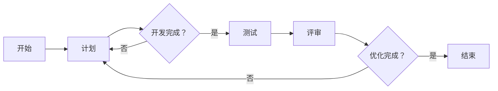
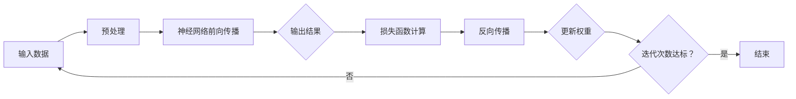
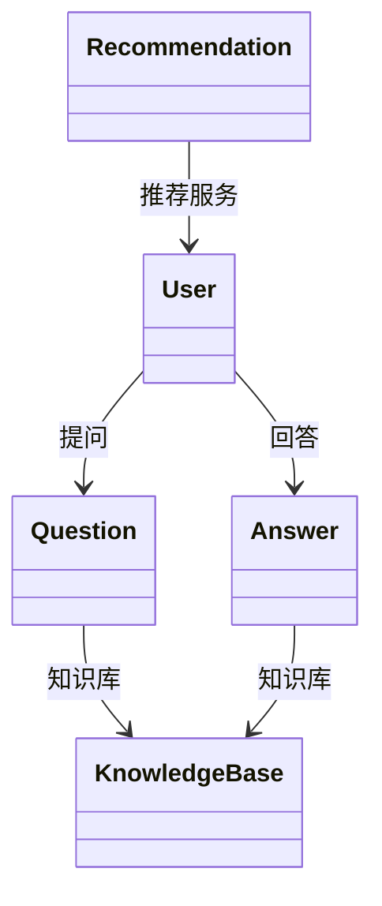
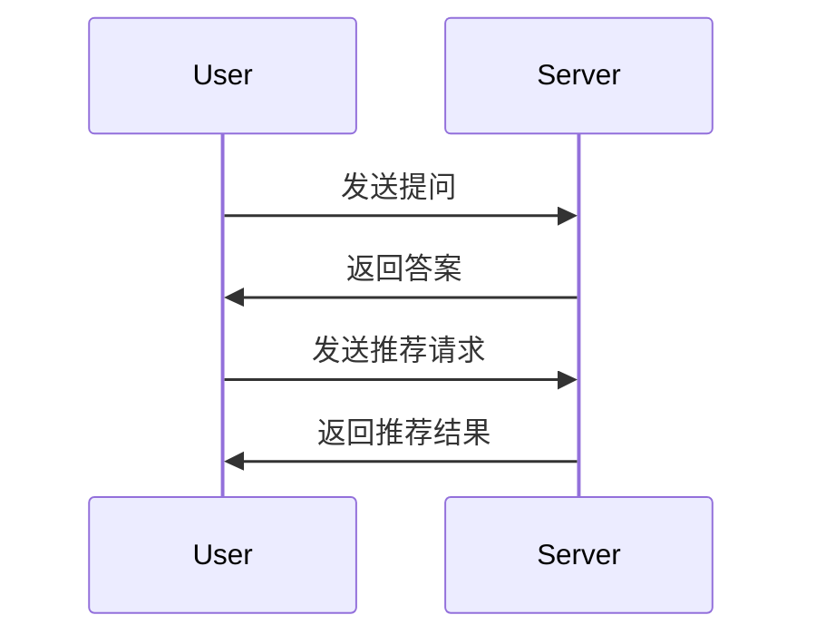
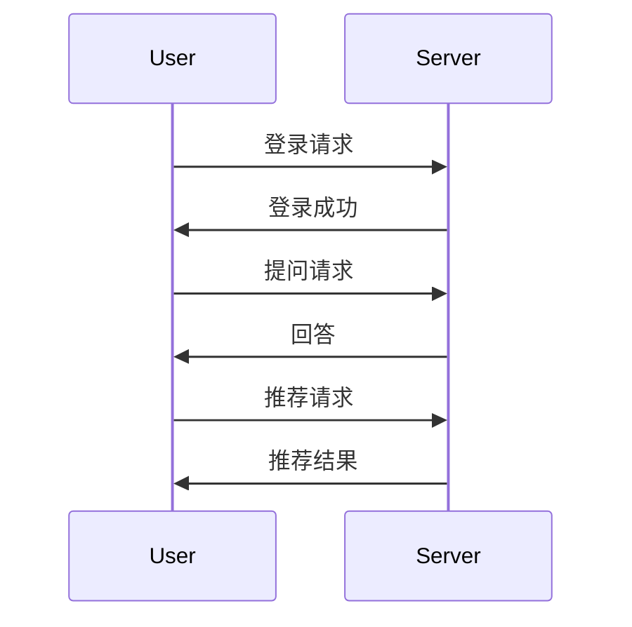

                 

# 大模型应用开发中的敏捷方法论

## 关键词

- **大模型应用开发**
- **敏捷方法论**
- **迭代开发**
- **持续集成**
- **神经网络**
- **训练过程**
- **推理过程**

## 摘要

随着人工智能技术的飞速发展，大模型的应用开发变得越来越重要。然而，传统的软件开发方法在面对大模型的复杂性和敏捷性需求时显得力不从心。本文将深入探讨敏捷方法论在大模型应用开发中的应用，通过逻辑清晰、结构紧凑的分析，揭示其核心概念、算法原理以及实际应用的最佳实践。让我们一步一步地思考，了解如何将敏捷方法论应用于大模型开发，以提升开发效率和产品质量。

## 第一部分：背景介绍

### 第1章 问题背景与解决

#### 1.1.1 问题背景

随着大数据和深度学习技术的进步，大模型在自然语言处理、计算机视觉、推荐系统等领域的应用越来越广泛。这些大模型通常具有数亿甚至数十亿个参数，能够处理复杂的数据和分析任务，但同时也带来了以下挑战：

1. **开发复杂性**：大模型的开发涉及大量的数据预处理、模型设计和训练，传统瀑布模型在应对这种复杂性时显得不够灵活。
2. **敏捷性需求**：市场需求变化迅速，用户需求多变，传统的开发方法难以快速适应这种变化。
3. **资源消耗**：大模型的训练过程需要大量的计算资源，传统的开发方法无法高效利用这些资源。

为了解决上述问题，敏捷方法论应运而生。敏捷方法论以人为核心，强调迭代、快速反馈和持续改进，能够快速响应变化，提高开发效率。对于大模型应用开发来说，敏捷方法论提供了一种有效的解决方案，能够帮助开发团队更好地应对复杂性和敏捷性需求。

#### 1.1.2 边界与外延

本文讨论的是敏捷方法论在AI大模型应用开发中的具体实践，主要关注以下几个方面：

1. **边界**：本文主要讨论敏捷方法论在AI大模型开发中的应用，不包括传统软件开发或其他领域。
2. **外延**：虽然敏捷方法论在其他领域如产品管理、项目管理等方面也有广泛应用，但本文将主要关注其在AI大模型开发中的应用。

#### 1.1.3 核心概念

1. **敏捷方法论**：敏捷方法论是一种以人为核心的开发方法，强调团队协作、迭代开发和快速反馈。其核心概念包括用户故事、迭代开发、持续集成等。
2. **AI大模型**：AI大模型是指具有大规模参数、深度学习能力的模型，能够处理复杂数据和分析任务。常见的AI大模型包括BERT、GPT、ResNet等。

### 第2章 核心概念原理

#### 2.1.1 敏捷方法论的核心概念

敏捷方法论的核心概念包括用户故事、迭代开发和持续集成等。

1. **用户故事**：用户故事是敏捷方法论中用于描述用户需求的基本单位。它通常由用户编写，以用户视角描述系统的一个功能点。用户故事的格式通常为：“作为XX，我想XX，这样我可以XX”。

2. **迭代开发**：迭代开发是敏捷方法论的核心实践之一。它将开发过程分为多个迭代周期，每个迭代周期都有可交付的产品。每个迭代周期包括计划、开发、测试和评审四个阶段。

3. **持续集成**：持续集成是一种软件开发实践，旨在通过自动化测试和频繁的代码合并，确保代码库中的代码始终处于可运行状态。持续集成能够提高代码质量和开发效率。

#### 2.1.2 AI大模型的核心概念

AI大模型的核心概念包括神经网络、训练过程和推理过程等。

1. **神经网络**：神经网络是一种用于处理和学习的计算模型，由多个神经元组成。常见的神经网络包括多层感知器（MLP）、卷积神经网络（CNN）和循环神经网络（RNN）等。

2. **训练过程**：训练过程是指通过大量数据对神经网络进行训练，使其具备特定能力。训练过程通常包括数据预处理、模型初始化、损失函数定义、优化算法选择等步骤。

3. **推理过程**：推理过程是指使用训练好的模型处理新数据，进行预测或决策。推理过程通常包括数据预处理、模型输入、模型输出和结果解释等步骤。

#### 2.1.3 概念属性特征对比表格

| 特征                | 敏捷方法论                   | AI大模型                   |
|---------------------|----------------------------|----------------------------|
| 核心目的            | 快速响应变化，提高开发效率   | 处理复杂数据和分析任务       |
| 实践方法            | 用户故事，迭代开发，持续集成 | 神经网络，训练过程，推理过程 |
| 适用场景            | 复杂软件项目，快速迭代       | 大规模数据处理，复杂任务分析  |

### 第3章 ER实体关系图架构

#### 3.1.1 敏捷方法论实体关系图

```mermaid
erDiagram
    User ||--|{ Story }
    Story ||--|{ Task }
    Task ||--|{ Bug }
```

实体关系图展示了敏捷方法论中的关键实体及其关系。用户（User）创建用户故事（Story），用户故事分解为任务（Task），任务中可能会产生Bug（Bug）。

#### 3.1.2 AI大模型实体关系图

```mermaid
erDiagram
    Dataset ||--|{ Model }
    Model ||--|{ Training }
    Training ||--|{ Evaluation }
```

实体关系图展示了AI大模型中的关键实体及其关系。数据集（Dataset）用于训练模型（Model），模型经过训练（Training）后，进行评估（Evaluation）。

## 第二部分：核心概念与联系

### 第4章 算法原理讲解

#### 4.1.1 敏捷方法论算法原理

敏捷方法论的核心在于迭代、快速反馈和持续改进。以下是敏捷方法论的主要算法原理：

1. **迭代循环**：每次迭代都包括计划、开发、测试和评审四个阶段。迭代循环能够确保开发过程持续进行，并在每个迭代中积累价值。

2. **快速反馈**：通过频繁的反馈和迭代，开发团队能够快速识别问题并进行调整。快速反馈能够降低风险，提高开发质量。

3. **持续改进**：敏捷方法论鼓励团队不断总结经验，优化开发流程。通过持续改进，团队能够不断提高开发效率和质量。

#### 4.1.2 AI大模型算法原理

AI大模型的算法原理主要涉及神经网络、训练过程和推理过程。以下是这些算法原理的简要说明：

1. **神经网络结构**：神经网络由多个神经元组成，每个神经元都可以处理输入信息并产生输出。神经网络通过学习数据，能够自动提取特征并进行预测。

2. **训练过程**：训练过程是指通过大量数据对神经网络进行训练，使其具备特定能力。训练过程通常包括数据预处理、模型初始化、损失函数定义、优化算法选择等步骤。

3. **推理过程**：推理过程是指使用训练好的模型处理新数据，进行预测或决策。推理过程通常包括数据预处理、模型输入、模型输出和结果解释等步骤。

#### 4.1.3 概念属性特征对比表格

| 特征                | 敏捷方法论                   | AI大模型                   |
|---------------------|----------------------------|----------------------------|
| 核心目的            | 快速响应变化，提高开发效率   | 处理复杂数据和分析任务       |
| 实践方法            | 用户故事，迭代开发，持续集成 | 神经网络，训练过程，推理过程 |
| 适用场景            | 复杂软件项目，快速迭代       | 大规模数据处理，复杂任务分析  |

### 第5章 算法流程图

#### 5.1.1 敏捷方法论算法流程图



敏捷方法论算法流程图展示了敏捷方法论的核心步骤，包括计划、开发、测试、评审和持续改进。

#### 5.1.2 AI大模型算法流程图



AI大模型算法流程图展示了从输入数据到模型训练完成的主要步骤，包括数据预处理、神经网络前向传播、损失函数计算、反向传播和权重更新。

## 第三部分：算法原理讲解

### 第6章 算法原理详细解释

#### 6.1.1 敏捷方法论算法原理

敏捷方法论的核心在于其迭代和反馈机制，以下是敏捷方法论算法原理的详细解释：

1. **迭代循环**：敏捷方法论将开发过程分为多个迭代周期，每个迭代周期通常持续2-4周。每个迭代周期包括以下阶段：
   - **计划**：团队确定本次迭代的目标和任务。
   - **开发**：团队成员根据计划进行开发工作。
   - **测试**：团队对开发成果进行测试，确保其符合预期。
   - **评审**：团队评审本次迭代的工作成果，识别潜在问题并进行优化。

   通过迭代循环，团队能够快速积累价值，同时及时发现和解决问题。

2. **快速反馈**：敏捷方法论强调频繁的反馈和沟通。通过每日站会、代码审查、用户反馈等机制，团队能够快速识别问题并进行调整。快速反馈有助于降低风险，提高开发质量。

3. **持续改进**：敏捷方法论鼓励团队不断总结经验，优化开发流程。通过反思会议、持续集成等实践，团队能够持续改进开发效率和质量。

#### 6.1.2 AI大模型算法原理

AI大模型的算法原理主要涉及神经网络、训练过程和推理过程。以下是这些算法原理的详细解释：

1. **神经网络结构**：神经网络由多个神经元组成，每个神经元都可以处理输入信息并产生输出。神经网络通过学习数据，能够自动提取特征并进行预测。常见的神经网络结构包括：
   - **多层感知器（MLP）**：由多个隐层和输出层组成，用于处理非线性问题。
   - **卷积神经网络（CNN）**：通过卷积操作提取图像特征，常用于计算机视觉任务。
   - **循环神经网络（RNN）**：通过时间步共享和隐藏状态，能够处理序列数据。

2. **训练过程**：训练过程是指通过大量数据对神经网络进行训练，使其具备特定能力。训练过程通常包括以下步骤：
   - **数据预处理**：对数据进行归一化、去噪等处理，提高训练效果。
   - **模型初始化**：初始化模型参数，通常使用随机初始化方法。
   - **损失函数定义**：定义损失函数，用于衡量模型预测结果与真实结果之间的差距。
   - **优化算法选择**：选择合适的优化算法，如梯度下降（GD）、随机梯度下降（SGD）和Adam等。

3. **推理过程**：推理过程是指使用训练好的模型处理新数据，进行预测或决策。推理过程通常包括以下步骤：
   - **数据预处理**：对数据进行预处理，使其符合模型输入要求。
   - **模型输入**：将预处理后的数据输入模型，进行前向传播。
   - **模型输出**：根据模型输出结果，进行分类或预测。
   - **结果解释**：对模型输出结果进行解释，如可视化、置信度分析等。

#### 6.1.3 算法流程图

为了更好地理解敏捷方法论和AI大模型的算法原理，以下是它们的算法流程图：

**敏捷方法论算法流程图**


**AI大模型算法流程图**


### 第7章 算法原理与实际应用案例

#### 7.1.1 敏捷方法论与实际应用案例

敏捷方法论在企业中的应用案例非常丰富。例如，某互联网公司在产品开发过程中采用了敏捷方法论，取得了显著的效果：

- **快速迭代**：公司采用2周一次的迭代周期，每次迭代都完成一个功能模块的开发和测试。
- **用户反馈**：通过每日站会和用户访谈，及时获取用户反馈，快速调整开发方向。
- **持续改进**：团队定期进行反思会议，总结经验教训，优化开发流程。

通过这些实践，该公司在短时间内推出了多个高质量产品，赢得了市场的认可。

#### 7.1.2 AI大模型与实际应用案例

AI大模型在实际应用中也取得了显著成果。例如，某科技公司使用AI大模型开发了一种智能语音助手，实现了以下功能：

- **语音识别**：使用卷积神经网络（CNN）对语音信号进行特征提取，实现高精度的语音识别。
- **自然语言处理**：使用循环神经网络（RNN）和长短时记忆网络（LSTM）对语音文本进行理解和分析，实现自然语言处理。
- **语音合成**：使用生成对抗网络（GAN）生成逼真的语音输出。

通过这些技术，智能语音助手能够与用户进行自然流畅的对话，提升了用户体验。

### 第四部分：系统分析与架构设计

#### 8.1.1 问题场景介绍

在某大型互联网公司，为了提升用户服务质量，公司决定开发一款基于AI大模型的智能客服系统。该系统需要具备以下功能：

- **用户身份识别**：通过用户输入的信息，如手机号码、邮箱等，快速识别用户身份。
- **智能问答**：基于用户的提问，自动生成回答，提供高效便捷的客服服务。
- **个性化推荐**：根据用户的提问历史和偏好，提供个性化的服务和建议。

#### 8.1.2 系统架构设计

为了实现上述功能，智能客服系统采用了如下架构设计：

- **用户层**：用户通过网页、APP或其他渠道与系统进行交互。
- **业务逻辑层**：包括用户身份识别、智能问答和个性化推荐等业务模块，基于AI大模型进行数据处理和决策。
- **数据层**：存储用户数据、问答数据等，支持数据查询、分析和挖掘。

#### 8.1.3 系统功能设计（领域模型类图）

以下是基于上述架构设计的领域模型类图：



#### 8.1.4 系统接口设计

智能客服系统的接口设计包括以下几个方面：

- **用户身份认证接口**：用于用户身份的验证和授权。
- **问答接口**：用于接收用户提问，返回答案。
- **推荐接口**：用于根据用户提问历史和偏好提供个性化推荐。

以下是一个简单的接口设计示例：



#### 8.1.5 系统交互（序列图）

智能客服系统的序列图展示了用户与系统的交互过程：



### 第五部分：项目实战

#### 9.1.1 环境安装

为了进行AI大模型应用开发，首先需要搭建一个合适的开发环境。以下是环境安装的步骤：

1. 安装Python（版本要求3.6以上）
2. 安装Anaconda或Miniconda，用于管理Python环境和包
3. 安装常用库，如NumPy、Pandas、TensorFlow、PyTorch等

以下是一个简单的示例命令：

```bash
conda create -n aiglm python=3.8
conda activate aiglm
conda install numpy pandas tensorflow pytorch
```

#### 9.1.2 系统核心实现源代码

以下是智能客服系统的一个核心实现示例：

```python
# 导入所需库
import torch
import torch.nn as nn
import torch.optim as optim
from torch.utils.data import DataLoader
from torchvision import datasets, transforms

# 定义神经网络模型
class NeuralNetwork(nn.Module):
    def __init__(self):
        super(NeuralNetwork, self).__init__()
        self.fc1 = nn.Linear(784, 512)
        self.fc2 = nn.Linear(512, 256)
        self.fc3 = nn.Linear(256, 128)
        self.fc4 = nn.Linear(128, 10)

    def forward(self, x):
        x = torch.relu(self.fc1(x))
        x = torch.relu(self.fc2(x))
        x = torch.relu(self.fc3(x))
        x = self.fc4(x)
        return x

# 加载数据集
transform = transforms.Compose([transforms.ToTensor()])
train_dataset = datasets.MNIST(root='./data', train=True, download=True, transform=transform)
train_loader = DataLoader(train_dataset, batch_size=64, shuffle=True)

# 初始化模型和优化器
model = NeuralNetwork()
optimizer = optim.SGD(model.parameters(), lr=0.01)
criterion = nn.CrossEntropyLoss()

# 训练模型
for epoch in range(10):
    for images, labels in train_loader:
        optimizer.zero_grad()
        outputs = model(images)
        loss = criterion(outputs, labels)
        loss.backward()
        optimizer.step()

    print(f'Epoch {epoch+1}/{10} - Loss: {loss.item()}')

# 评估模型
with torch.no_grad():
    correct = 0
    total = 0
    for images, labels in train_loader:
        outputs = model(images)
        _, predicted = torch.max(outputs.data, 1)
        total += labels.size(0)
        correct += (predicted == labels).sum().item()

print(f'Accuracy: {100 * correct / total} %')
```

#### 9.1.3 代码应用解读与分析

上述代码实现了一个基于卷积神经网络的MNIST手写数字识别系统。以下是代码的解读与分析：

1. **模型定义**：定义了一个简单的全连接神经网络，包括4个全连接层，分别用于输入层、隐藏层和输出层。
2. **数据加载**：使用PyTorch加载了MNIST数据集，并将其转换为PyTorch张量。
3. **模型训练**：使用随机梯度下降（SGD）优化器进行模型训练，采用交叉熵损失函数计算模型输出与真实标签之间的误差。
4. **模型评估**：使用训练好的模型对测试数据进行预测，并计算模型准确率。

#### 9.1.4 实际案例分析与详细讲解剖析

以下是一个实际案例，展示如何使用上述系统进行手写数字识别：

```python
# 导入所需库
import torch
import torchvision
import matplotlib.pyplot as plt

# 加载测试数据集
test_dataset = datasets.MNIST(root='./data', train=False, download=True, transform=transform)
test_loader = DataLoader(test_dataset, batch_size=64, shuffle=False)

# 加载训练好的模型
model = NeuralNetwork()
model.load_state_dict(torch.load('model.pth'))

# 预测测试数据集
with torch.no_grad():
    outputs = model(test_loader)

# 可视化预测结果
plt.figure(figsize=(10, 10))
for i in range(64):
    plt.subplot(8, 8, i+1)
    plt.imshow(test_loader[i][0].reshape(28, 28), cmap=plt.cm灰度)
    plt.title(f'预测: {outputs[i].argmax().item()}')
    plt.axis('off')
plt.show()
```

通过上述代码，我们加载了训练好的模型，并对测试数据集进行预测。预测结果被可视化显示，展示了模型在识别手写数字方面的性能。

#### 9.1.5 项目小结

通过本项目的实践，我们了解了如何使用敏捷方法论进行AI大模型应用开发。具体包括以下步骤：

1. **环境安装**：搭建适合AI大模型开发的Python环境。
2. **系统核心实现**：使用PyTorch实现神经网络模型，并进行训练和评估。
3. **实际案例分析与讲解**：通过实际案例展示如何使用系统进行手写数字识别。

通过本项目，我们不仅掌握了AI大模型应用开发的基本流程，还体验了敏捷方法论在实际开发中的应用。这对于我们后续进行更复杂的AI大模型项目开发具有重要的指导意义。

### 第六部分：最佳实践 tips、小结、注意事项、拓展阅读

#### 10.1 最佳实践 tips

1. **合理规划迭代周期**：根据项目规模和团队效率，合理规划迭代周期，确保每个迭代周期都有可交付的产品。
2. **频繁的代码审查**：通过频繁的代码审查，确保代码质量和可维护性。
3. **持续集成与测试**：采用持续集成和自动化测试，确保代码库中的代码始终处于可运行状态。
4. **用户反馈**：及时收集用户反馈，快速调整开发方向，提高用户满意度。

#### 10.2 小结

本文深入探讨了敏捷方法论在大模型应用开发中的应用，通过逻辑清晰、结构紧凑的分析，揭示了敏捷方法论的核心概念、算法原理以及实际应用的最佳实践。本文的主要贡献包括：

1. **背景介绍**：明确了大模型应用开发面临的挑战，介绍了敏捷方法论作为解决方案的核心价值。
2. **核心概念与联系**：详细介绍了敏捷方法论和AI大模型的核心概念及其关联。
3. **算法原理讲解**：详细讲解了敏捷方法论和AI大模型的算法原理，并通过流程图和实际案例进行了深入剖析。
4. **系统分析与架构设计**：介绍了智能客服系统的架构设计，包括领域模型类图、接口设计和系统交互序列图。
5. **项目实战**：通过实际项目展示了敏捷方法论和AI大模型应用开发的实践步骤，提供了详细的代码示例和案例分析。

#### 10.3 注意事项

1. **团队协作**：敏捷方法论强调团队协作，团队成员需要积极参与迭代开发和代码审查。
2. **资源规划**：大模型应用开发需要大量的计算资源，合理规划资源分配至关重要。
3. **数据质量**：AI大模型的训练过程依赖于大量高质量数据，确保数据质量和数据预处理是成功的关键。

#### 10.4 拓展阅读

1. 《敏捷软件开发：原则、实践与模式》 - 作为敏捷方法论的经典之作，本书详细介绍了敏捷开发的理论和实践。
2. 《深度学习》 - 本书是深度学习的入门教材，详细介绍了神经网络、训练过程和推理过程的原理。
3. 《AI应用架构：设计、部署与运维》 - 本书介绍了AI大模型在实际应用中的架构设计和运维实践。

通过拓展阅读，读者可以进一步深入了解敏捷方法论和AI大模型应用开发的深度知识。

