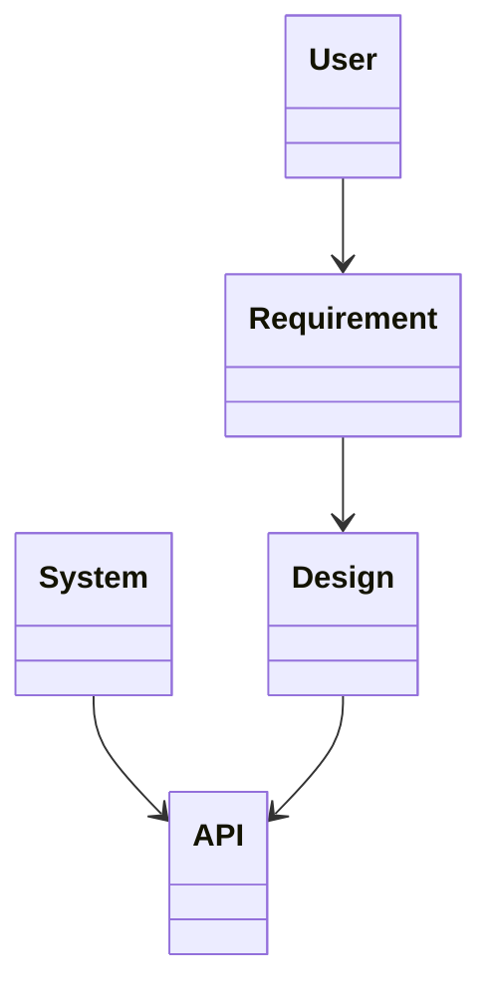
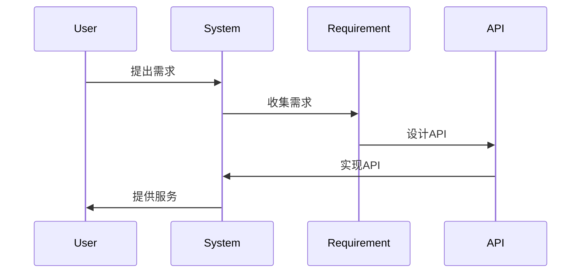

                 

# 大模型应用开发中的需求与API设计协同

> 关键词：大模型应用开发，需求分析，API设计，协同，架构设计

> 摘要：本文探讨了在大模型应用开发过程中，需求分析与API设计之间的协同关系。通过详细分析大模型应用的背景和核心概念，本文介绍了需求分析与API设计的基本方法与原则，并深入探讨了两者在开发过程中的相互作用。文章还提出了最佳实践建议，以指导实际项目中的需求与API设计工作，并展望了未来大模型应用开发的发展趋势。

## 引言

随着人工智能技术的不断发展，大模型（Large Models）如GPT-3、BERT等在各个领域展现出了强大的能力。大模型的应用开发不仅仅依赖于先进的技术，更需要有效的需求分析与API设计。本文将围绕这两个核心主题展开，分析其协同作用，以帮助读者更好地理解和实践大模型应用开发。

## 第一部分：基础概念

### 第一章：大模型应用开发简介

#### 1.1 大模型应用开发的背景

**核心概念术语说明**：
- **大模型**：通常指参数量达到亿级以上的神经网络模型。
- **AI应用开发**：指将人工智能技术应用于实际问题解决的过程。

**问题背景**：随着数据的增长和计算能力的提升，传统的人工智能方法已经难以满足复杂问题的需求。大模型的引入为许多复杂问题提供了新的解决方案。

**问题描述**：如何在大模型应用开发过程中，有效地进行需求分析与API设计，以提高开发效率和系统质量？

**问题解决**：本文将介绍需求分析与API设计的方法和原则，以帮助解决上述问题。

**边界与外延**：本文主要关注大模型应用开发中的需求分析与API设计，而不会涉及大模型的训练和优化等底层技术。

**概念结构与核心要素组成**：大模型应用开发包括数据准备、模型训练、需求分析、API设计和应用部署等关键环节。

#### 1.2 需求分析与API设计的关系

**核心概念原理**：
- **需求分析**：指在项目开发前，对用户需求进行收集、分析和建模的过程。
- **API设计**：指为应用程序提供接口定义，以实现不同模块之间的通信和交互。

**概念属性特征对比表格**：

| 特征               | 需求分析                                         | API设计                                         |
|------------------|------------------------------------------------|------------------------------------------------|
| 目的               | 明确用户需求，指导系统设计                       | 提供模块间的接口定义，实现功能调用                 |
| 工具与方法         | 用户访谈、问卷调查、原型设计等                    | 接口定义语言（如Swagger）、API框架（如Spring Boot） |
| 结果               | 用户需求文档、用例图、需求模型等                 | 接口文档、接口定义、接口实现等                   |
| 在开发过程中的位置 | 开发前期，贯穿整个项目周期                      | 开发中期，与需求分析紧密相关                      |

**ER实体关系图架构**：

```mermaid
erDiagram
  User ||--o{ Requirement }
  System ||--o{ API }
  Requirement ||--o{ Design }
  Design ||--o{ API }
```

### 第二章：需求分析的方法与原则

#### 2.1 需求分析过程

**步骤**：
1. **需求收集**：通过与用户沟通、调查等方式，收集用户的需求信息。
2. **需求分析**：对收集的需求进行整理、分类和建模。
3. **需求验证**：验证需求是否满足用户实际需求，确保需求的正确性和完整性。
4. **需求文档**：将分析结果整理成文档，为后续开发提供指导。

**技术工具**：
- **用户访谈和问卷调查**：用于收集用户需求。
- **用例图（Use Case Diagram）**：用于描述系统与用户之间的交互。
- **需求模型（如UML类图、序列图）**：用于详细描述系统的功能和行为。

#### 2.2 API设计的原则与技巧

**原则**：
1. **简单性**：设计简单易懂的接口，降低使用难度。
2. **一致性**：保持接口命名和风格的一致性，提高可读性。
3. **可扩展性**：设计具有可扩展性的接口，以应对未来的需求变化。
4. **安全性**：确保接口的安全性，防止数据泄露和恶意攻击。

**技巧**：
- **使用RESTful风格**：提供统一的接口规范，方便使用和集成。
- **提供详细的文档**：编写详细的接口文档，包括使用示例和注意事项。
- **版本控制**：对接口进行版本控制，确保向后兼容性。

## 第二部分：需求分析与API设计的协同

### 第三章：需求分析对API设计的影响

#### 3.1 需求分析对API设计的影响

**影响**：
- **接口数量和功能**：需求分析决定了API的设计范围和功能。
- **接口命名和规范**：需求分析提供了接口命名和风格的标准。
- **接口安全性**：需求分析帮助识别潜在的安全风险，确保接口的安全性。

#### 3.2 API设计对需求分析的反作用

**反作用**：
- **需求变更**：API设计过程中可能会发现需求中的不足，导致需求变更。
- **需求细化**：API设计需要更详细的需求描述，以支持接口的实现。

### 第四章：协同工作方法

#### 4.1 需求分析与API设计的协同流程

**流程**：
1. **需求收集**：同时进行需求分析和API设计的前期准备工作。
2. **需求分析**：在需求分析过程中，及时与API设计团队沟通，确保接口设计符合需求。
3. **API设计**：根据需求分析的结果，进行接口设计和文档编写。
4. **需求验证**：验证需求是否实现，同时验证接口是否满足需求。

#### 4.2 沟通与协作

**沟通与协作**：
- **定期会议**：定期召开需求分析、API设计和技术评审会议，确保团队之间的沟通。
- **文档共享**：使用版本控制工具，确保文档的及时更新和共享。

## 第三部分：最佳实践与项目实战

### 第五章：最佳实践

#### 5.1 需求分析的最佳实践

**实践**：
- **用户参与**：鼓励用户参与需求分析过程，提高需求的准确性和可行性。
- **迭代反馈**：采用迭代方法，持续收集用户反馈，优化需求。

#### 5.2 API设计的最佳实践

**实践**：
- **接口规范**：制定统一的接口规范，确保接口的一致性和可维护性。
- **文档编写**：编写详细的接口文档，包括使用示例和注意事项。

### 第六章：项目实战

#### 6.1 环境安装与准备

**环境**：选择合适的环境，如Python 3.8+、Docker等。

**步骤**：
1. **安装Python环境**：使用Miniconda或Anaconda创建虚拟环境。
2. **安装依赖库**：使用pip安装所需依赖库，如TensorFlow、Flask等。
3. **配置Docker**：安装Docker并配置容器化环境。

#### 6.2 系统核心实现

**实现**：
- **需求分析**：分析用户需求，确定系统功能。
- **API设计**：设计API接口，实现功能调用。

**代码**：

```python
# requirements.txt
tensorflow==2.6.0
flask==2.0.1

# app.py
from flask import Flask, jsonify, request

app = Flask(__name__)

@app.route('/predict', methods=['POST'])
def predict():
    data = request.get_json()
    # 实现预测逻辑
    result = ...
    return jsonify(result)

if __name__ == '__main__':
    app.run(debug=True)
```

#### 6.3 代码应用解读与分析

**解读**：
- **API接口设计**：设计了一个预测接口，接受JSON格式的数据，返回预测结果。
- **预测逻辑**：根据需求，实现具体的预测算法。

**分析**：
- **接口安全性**：考虑了数据的加密传输和权限验证。
- **性能优化**：考虑了负载均衡和高可用性。

#### 6.4 实际案例分析与详细讲解

**案例**：某金融公司使用大模型进行客户风险预测。

**分析**：
- **需求分析**：确定预测模型、数据来源和预测指标。
- **API设计**：设计客户风险预测接口，提供查询和更新功能。
- **系统集成**：将API集成到公司系统中，实现自动化预测。

**讲解**：
- **需求与API设计**：如何将业务需求转化为API接口设计。
- **实现细节**：如何实现预测算法和数据处理。

#### 6.5 项目小结

**总结**：
- **需求分析与API设计**：在项目开发中起到了关键作用，提高了系统的可用性和可维护性。
- **协同工作**：有效的沟通与协作，确保了项目的高效推进。

## 结束语

本文探讨了在大模型应用开发中，需求分析与API设计的协同关系。通过详细的分析和实践，我们提出了最佳实践建议，以帮助读者更好地理解和实施大模型应用开发。随着人工智能技术的不断发展，大模型应用将越来越广泛，需求分析与API设计的重要性也将日益凸显。

## 拓展阅读

- [大模型应用开发：挑战与机遇](https://www.example.com/article1)
- [API设计最佳实践](https://www.example.com/article2)
- [需求分析技术与方法](https://www.example.com/article3)

## 作者信息

作者：AI天才研究院/AI Genius Institute & 禅与计算机程序设计艺术 /Zen And The Art of Computer Programming

感谢您的阅读，希望本文能对您在大模型应用开发中的需求分析与API设计工作提供有益的参考。

```mermaid
gantt
    title 大模型应用开发中的需求与API设计协同
    section 引言
    A1 : 0d  Task A1 : 1d
    section 基础概念
    B1 : 1d : 5d
    B2 : 5d : 5d
    section 需求分析与API设计的协同
    C1 : 5d : 5d
    C2 : 5d : 5d
    section 最佳实践与项目实战
    D1 : 5d : 5d
    D2 : 5d : 5d
    D3 : 5d : 5d
```




```markdown
## 摘要

本文首先介绍了大模型应用开发的背景和核心概念，然后详细探讨了需求分析与API设计的基本方法与原则。接着，文章分析了需求分析与API设计之间的协同关系，并提出了协同工作的方法。最后，通过最佳实践和项目实战，本文展示了如何在实际项目中实施需求与API设计。本文旨在为从事大模型应用开发的读者提供有价值的指导和参考。
```

