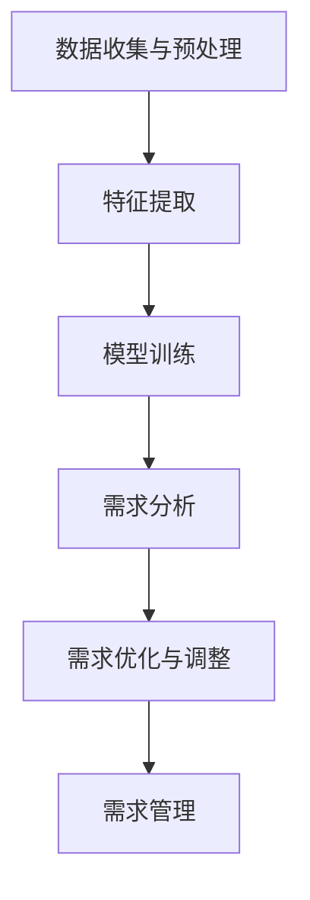
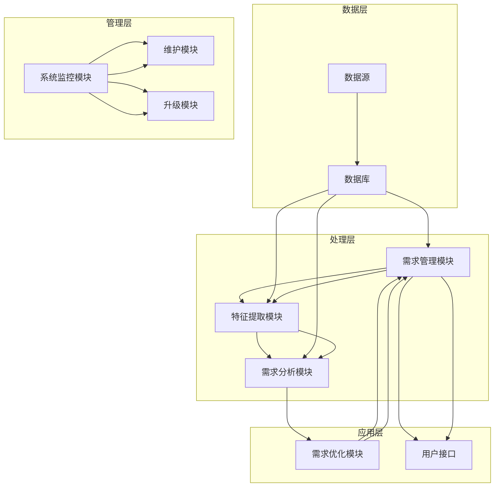
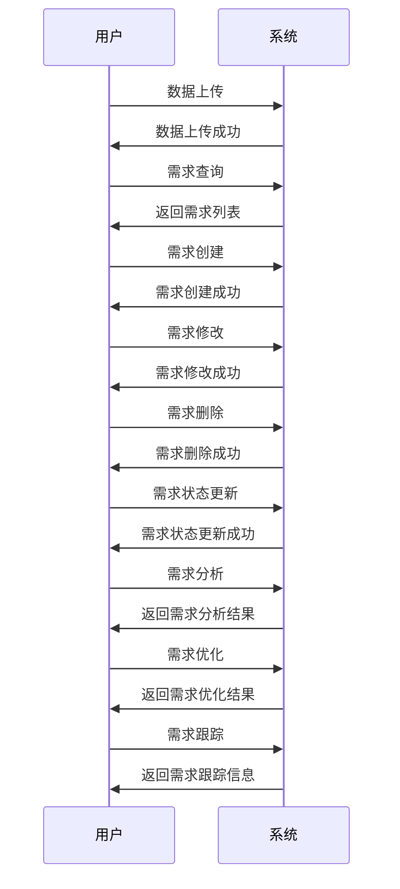

                 


# 大模型应用开发中的需求收集新方法

## 关键词
- 大模型
- 需求收集
- 算法原理
- 系统分析与架构设计
- 项目实战

## 摘要
本文旨在探讨大模型应用开发中的需求收集新方法。随着人工智能技术的飞速发展，大模型在各个领域得到了广泛应用，如何高效地进行需求收集成为了一大挑战。本文将从背景介绍、核心概念与联系、算法原理讲解、系统分析与架构设计、项目实战等多个方面，详细阐述大模型需求收集的新方法，为开发者提供有益的参考。

## 目录大纲设计思路

### 第一部分：背景介绍

#### 第1章: 大模型应用开发中的需求收集背景
- 1.1 需求收集的重要性
  - 1.1.1 需求收集的定义
  - 1.1.2 需求收集在软件开发中的角色
  - 1.1.3 需求收集的挑战与难题
- 1.2 大模型与需求收集
  - 1.2.1 大模型的基本概念
  - 1.2.2 大模型在需求收集中的应用
  - 1.2.3 大模型在需求收集中的优势
- 1.3 大模型需求收集的边界与外延
  - 1.3.1 需求收集的核心要素组成
  - 1.3.2 大模型需求收集的技术架构
  - 1.3.3 大模型需求收集的应用场景
- 1.4 本章小结

### 第二部分：核心概念与联系

#### 第2章: 大模型需求收集的核心概念与联系
- 2.1 大模型需求收集的基本原理
  - 2.1.1 大模型需求收集的流程
  - 2.1.2 大模型需求收集的关键环节
  - 2.1.3 大模型需求收集的技术手段
- 2.2 大模型需求收集的属性特征对比
  - 2.2.1 大模型与传统需求收集工具对比
  - 2.2.2 不同类型大模型需求收集的对比
- 2.3 大模型需求收集的ER实体关系图
  - 2.3.1 ER实体关系图的基本概念
  - 2.3.2 大模型需求收集的实体关系分析
  - 2.3.3 ER实体关系图的绘制与解读
- 2.4 本章小结

### 第三部分：算法原理讲解

#### 第3章: 大模型需求收集的算法原理
- 3.1 大模型需求收集算法的基本框架
  - 3.1.1 算法设计的目标
  - 3.1.2 算法的基本步骤
  - 3.1.3 算法的关键技术
- 3.2 数学模型与公式
  - 3.2.1 大模型需求收集的数学基础
  - 3.2.2 算法中的关键数学公式
  - 3.2.3 数学公式在需求收集中的应用
- 3.3 算法流程与示例
  - 3.3.1 算法流程图
  - 3.3.2 Python源代码实现
  - 3.3.3 示例讲解
- 3.4 本章小结

### 第四部分：系统分析与架构设计

#### 第4章: 大模型需求收集的系统分析与架构设计
- 4.1 需求收集系统的介绍
  - 4.1.1 系统的背景与目的
  - 4.1.2 系统的功能设计
  - 4.1.3 系统的需求分析
- 4.2 系统架构设计
  - 4.2.1 系统架构的整体设计
  - 4.2.2 各模块的功能与接口设计
  - 4.2.3 系统架构的mermaid架构图
- 4.3 系统接口设计
  - 4.3.1 接口设计的原则与策略
  - 4.3.2 接口功能的详细描述
  - 4.3.3 接口的mermaid序列图
- 4.4 系统交互设计
  - 4.4.1 系统交互的流程
  - 4.4.2 系统交互的mermaid序列图
  - 4.4.3 系统交互的案例分析
- 4.5 本章小结

### 第五部分：项目实战

#### 第5章: 大模型需求收集项目实战
- 5.1 环境安装与准备
  - 5.1.1 开发环境的配置
  - 5.1.2 系统依赖的安装
  - 5.1.3 实战项目的初步搭建
- 5.2 系统核心实现
  - 5.2.1 核心模块的实现
  - 5.2.2 代码实现解析
  - 5.2.3 代码调试与优化
- 5.3 实际案例分析与讲解
  - 5.3.1 实际案例的选取
  - 5.3.2 案例分析的步骤
  - 5.3.3 案例剖析与总结
- 5.4 项目小结
  - 5.4.1 项目成果总结
  - 5.4.2 项目中的挑战与解决

### 最佳实践 tips、小结、注意事项、拓展阅读等内容
- 6.1 最佳实践 tips
- 6.2 小结
- 6.3 注意事项
- 6.4 拓展阅读

# 1. 大模型应用开发中的需求收集背景

## 1.1 需求收集的重要性

### 1.1.1 需求收集的定义

需求收集是软件开发过程中的一项关键任务，它指的是通过一系列的方法和手段，从用户、业务方、技术团队等多个角度获取和理解软件系统的功能需求、性能需求、用户体验需求等，以确保软件系统能够满足用户和业务方的需求。

需求收集的重要性体现在以下几个方面：

1. **确保项目方向正确**：需求收集是软件开发项目的起点，决定了项目的发展和方向。通过需求收集，可以明确项目的目标和用户需求，从而确保项目开发过程不偏离目标。

2. **减少项目风险**：通过全面的需求收集，可以提前发现潜在的风险和问题，从而采取措施进行预防和解决，降低项目失败的风险。

3. **提高开发效率**：需求收集的过程中，可以通过对需求的梳理和整理，明确开发任务和分工，提高开发效率和团队协作能力。

4. **保障系统质量**：需求收集的全面性和准确性，直接影响软件系统的质量。通过详细的需求收集，可以设计出更符合用户需求的软件系统，提高用户满意度。

### 1.1.2 需求收集在软件开发中的角色

在软件开发过程中，需求收集扮演着重要的角色，具体体现在以下几个方面：

1. **沟通桥梁**：需求收集是连接用户、业务方和技术团队之间的桥梁，通过需求收集，可以将用户和业务方的需求转化为技术团队可以理解和执行的软件需求。

2. **项目规划**：需求收集为项目规划提供了基础数据，包括功能需求、性能需求、资源需求等，这些数据对于项目规划和资源配置至关重要。

3. **风险评估**：需求收集过程中，可以发现潜在的风险和问题，为项目风险管理和控制提供依据。

4. **质量管理**：需求收集的结果直接影响软件系统的质量，通过详细的需求收集，可以设计出更高质量的软件系统。

### 1.1.3 需求收集的挑战与难题

尽管需求收集在软件开发中至关重要，但实践中仍然面临诸多挑战和难题：

1. **需求变化**：在软件开发过程中，用户和业务方的需求往往发生变化，需求收集需要不断调整和更新，以适应需求变化。

2. **需求不明确**：用户和业务方可能无法清晰地表达他们的需求，需求收集需要深入挖掘和解析，以确保需求的准确性和完整性。

3. **时间压力**：需求收集往往需要在有限的时间内完成，时间压力可能导致需求收集不够充分和深入。

4. **沟通障碍**：需求收集过程中，涉及多方利益相关者，沟通障碍可能导致需求理解不一致，影响需求收集的准确性。

## 1.2 大模型与需求收集

### 1.2.1 大模型的基本概念

大模型，通常指的是具有极高参数数量和计算复杂度的深度学习模型，如大型神经网络模型、生成对抗网络（GAN）等。这些模型在处理复杂数据和任务时表现出色，但在需求收集方面也带来了新的挑战和机遇。

### 1.2.2 大模型在需求收集中的应用

大模型在需求收集中的应用主要体现在以下几个方面：

1. **自动化需求分析**：通过训练大模型，可以自动分析用户行为数据和业务数据，提取潜在的需求信息，提高需求收集的效率和准确性。

2. **用户行为预测**：大模型可以用于预测用户行为，从而更好地理解用户需求，为需求收集提供数据支持。

3. **需求聚类和分类**：大模型可以对大量需求进行聚类和分类，帮助识别相似的需求，优化需求收集过程。

### 1.2.3 大模型在需求收集中的优势

大模型在需求收集中的优势包括：

1. **处理复杂数据**：大模型可以处理大规模、多维度、非线性关系的数据，为需求分析提供更强有力的工具。

2. **自动化分析**：大模型可以实现自动化的需求分析，减少人工工作量，提高效率。

3. **高效预测**：大模型可以快速预测用户行为和需求变化，为需求收集提供实时数据支持。

## 1.3 大模型需求收集的边界与外延

### 1.3.1 需求收集的核心要素组成

大模型需求收集的核心要素包括：

1. **用户需求**：用户的需求是需求收集的核心，包括功能需求、性能需求、用户体验需求等。

2. **业务需求**：业务需求是需求收集的另一个重要组成部分，包括业务目标、业务流程、业务规则等。

3. **技术需求**：技术需求是满足用户和业务需求的技术支持，包括技术架构、技术方案、技术约束等。

### 1.3.2 大模型需求收集的技术架构

大模型需求收集的技术架构通常包括以下几个部分：

1. **数据采集与预处理**：收集用户行为数据和业务数据，并进行数据预处理，如数据清洗、数据集成、数据标准化等。

2. **需求分析**：利用大模型进行需求分析，包括需求提取、需求分类、需求聚类等。

3. **需求优化与调整**：根据需求分析结果，对需求进行优化和调整，以更好地满足用户和业务需求。

4. **需求管理**：对需求进行管理和跟踪，确保需求得到有效落实。

### 1.3.3 大模型需求收集的应用场景

大模型需求收集的应用场景包括：

1. **金融领域**：通过分析用户行为数据和交易数据，预测用户需求，优化金融产品和服务。

2. **电子商务**：通过分析用户行为数据，优化商品推荐、广告投放等，提高用户体验和销售额。

3. **医疗健康**：通过分析患者数据和医疗数据，预测患者需求，提高医疗服务质量和效率。

## 1.4 本章小结

本章介绍了大模型应用开发中的需求收集背景，包括需求收集的重要性、大模型的基本概念和优势，以及大模型需求收集的边界与外延。通过本章的学习，读者可以了解大模型在需求收集中的应用前景和挑战，为后续章节的学习打下基础。

# 2. 大模型需求收集的核心概念与联系

## 2.1 大模型需求收集的基本原理

### 2.1.1 大模型需求收集的流程

大模型需求收集的流程通常包括以下几个步骤：

1. **需求获取**：通过访谈、问卷调查、用户行为数据分析等方式，获取用户和业务方的需求信息。

2. **需求整理**：对获取到的需求信息进行整理、分类和归纳，形成清晰的需求文档。

3. **需求分析**：利用大模型进行需求分析，提取需求的关键特征和关系，识别用户和业务需求。

4. **需求优化**：根据需求分析结果，对需求进行优化和调整，以更好地满足用户和业务需求。

5. **需求管理**：对需求进行管理和跟踪，确保需求得到有效落实。

### 2.1.2 大模型需求收集的关键环节

在大模型需求收集过程中，以下几个环节尤为重要：

1. **数据收集与预处理**：数据收集与预处理是需求收集的基础，数据的质量直接影响需求分析的效果。

2. **需求提取**：需求提取是需求分析的核心，通过大模型从海量数据中提取出用户和业务需求。

3. **需求分类与聚类**：通过需求分类和聚类，可以识别出相似的需求，优化需求收集过程。

4. **需求优化**：需求优化是对需求进行分析和调整，以更好地满足用户和业务需求。

### 2.1.3 大模型需求收集的技术手段

大模型需求收集的技术手段主要包括以下几个方面：

1. **深度学习**：深度学习是构建大模型的基础，通过神经网络等模型，可以实现对复杂数据的处理和分析。

2. **数据挖掘**：数据挖掘技术可以帮助从海量数据中提取有价值的信息，为需求分析提供支持。

3. **自然语言处理**：自然语言处理技术可以用于处理用户和业务方的需求描述，提取关键信息。

4. **机器学习**：机器学习技术可以帮助对需求进行分类、聚类和预测，优化需求收集过程。

## 2.2 大模型需求收集的属性特征对比

### 2.2.1 大模型与传统需求收集工具对比

大模型与传统需求收集工具在属性特征上存在以下区别：

| 特征         | 大模型                          | 传统需求收集工具                     |
| ------------ | ------------------------------ | ----------------------------------- |
| 数据处理能力 | 高度自动化，处理复杂数据能力强 | 需要人工参与，数据处理能力有限       |
| 需求分析精度 | 通过深度学习等技术，分析精度高 | 需求分析精度受限于人工经验和方法   |
| 效率        | 自动化程度高，效率高           | 需要较多人工参与，效率相对较低       |
| 可扩展性    | 可以处理大规模数据，可扩展性强 | 难以处理大规模数据，可扩展性有限     |

### 2.2.2 不同类型大模型需求收集的对比

不同类型的大模型在需求收集方面存在一定的差异：

| 大模型类型       | 特点                                       | 需求收集优势                                  |
| ---------------- | ----------------------------------------- | --------------------------------------------- |
| 卷积神经网络（CNN） | 适用于图像、视频等二维数据处理             | 可以提取图像中的特征，用于需求分析           |
| 循环神经网络（RNN） | 适用于序列数据处理，如文本、时间序列数据   | 可以处理序列数据中的依赖关系，用于需求提取   |
| 生成对抗网络（GAN） | 可以生成高质量的数据，如图像、文本等      | 可以用于生成用户行为数据，辅助需求分析       |
| 强化学习模型      | 通过与环境交互学习最优策略                | 可以用于优化需求收集策略，提高需求分析效率   |

## 2.3 大模型需求收集的ER实体关系图

### 2.3.1 ER实体关系图的基本概念

ER（Entity-Relationship）实体关系图是一种用于描述数据实体及其之间关系的图形化工具，常用于数据库设计和需求分析。

### 2.3.2 大模型需求收集的实体关系分析

在大模型需求收集过程中，涉及到的实体主要包括：

1. **用户**：表示需求收集的参与者，如系统管理员、业务分析师、开发者等。

2. **需求**：表示用户和业务方的需求信息，包括功能需求、性能需求、用户体验需求等。

3. **数据**：表示用于需求收集的数据，如用户行为数据、业务数据、日志数据等。

4. **模型**：表示用于需求收集的大模型，包括深度学习模型、数据挖掘模型等。

实体关系分析可以描述实体之间的关联关系，如：

- 用户可以提出需求。
- 需求可以由用户和模型共同分析。
- 数据可以用于训练和优化模型。

### 2.3.3 ER实体关系图的绘制与解读

下面是一个简单的大模型需求收集ER实体关系图的示例：

```mermaid
erDiagram
  User ||--|{ Demand : 提出需求 }
  Demand ||--|{ Data : 用于分析 }
  Demand ||--|{ Model : 分析需求 }
  Data ||--|{ Model : 训练与优化 }
```

解读：

1. **用户**与**需求**之间存在“提出需求”的关联关系，表示用户可以提出需求。

2. **需求**与**数据**之间存在“用于分析”的关联关系，表示需求分析过程中需要使用数据。

3. **需求**与**模型**之间存在“分析需求”的关联关系，表示需求分析过程中需要使用模型。

4. **数据**与**模型**之间存在“训练与优化”的关联关系，表示模型在训练和优化过程中需要使用数据。

通过ER实体关系图，可以清晰地描述大模型需求收集中的实体及其关系，有助于理解和分析需求收集的过程。

## 2.4 本章小结

本章介绍了大模型需求收集的核心概念与联系，包括基本原理、属性特征对比、ER实体关系图的绘制与解读。通过本章的学习，读者可以了解大模型需求收集的方法和流程，为后续章节的学习奠定基础。

# 3. 大模型需求收集的算法原理

## 3.1 大模型需求收集算法的基本框架

### 3.1.1 算法设计的目标

大模型需求收集算法的设计目标主要包括以下几点：

1. **自动化需求分析**：通过算法自动提取用户和业务需求，减少人工工作量。
2. **高效处理复杂数据**：利用大模型的强大数据处理能力，对大规模、多维度、非线性关系的数据进行分析。
3. **准确识别需求**：通过算法分析和优化，提高需求识别的准确性和可靠性。
4. **实时性**：在需求变化快速的场景中，算法能够实时更新和调整需求分析结果。

### 3.1.2 算法的基本步骤

大模型需求收集算法的基本步骤可以分为以下几个阶段：

1. **数据收集与预处理**：收集用户行为数据、业务数据等，并进行数据清洗、数据集成、数据标准化等预处理工作。
2. **特征提取**：从预处理后的数据中提取关键特征，用于后续的需求分析。
3. **模型训练**：利用提取的特征数据，训练大模型，如深度学习模型、生成对抗网络（GAN）等。
4. **需求分析**：使用训练好的大模型对新的用户和业务数据进行分析，提取需求信息。
5. **需求优化与调整**：根据需求分析结果，对需求进行优化和调整，以满足用户和业务需求。
6. **需求管理**：对需求进行跟踪和管理，确保需求得到有效落实。

### 3.1.3 算法的关键技术

大模型需求收集算法的关键技术主要包括：

1. **深度学习**：利用深度学习模型，如卷积神经网络（CNN）、循环神经网络（RNN）、长短时记忆网络（LSTM）等，对复杂数据进行高效处理和分析。
2. **数据挖掘**：利用数据挖掘技术，从海量数据中提取有价值的信息，为需求分析提供支持。
3. **自然语言处理**：利用自然语言处理技术，对文本数据进行解析，提取关键词和语义信息。
4. **机器学习**：利用机器学习算法，对需求进行分类、聚类和预测，优化需求收集过程。

## 3.2 数学模型与公式

### 3.2.1 大模型需求收集的数学基础

大模型需求收集涉及到的数学基础主要包括线性代数、概率论、统计学和优化理论等。以下是一些基本的数学公式和概念：

1. **线性代数**：
   - 向量和矩阵的基本运算，如加法、减法、乘法、逆矩阵等。
   - 特征提取过程中常用的矩阵分解技术，如奇异值分解（SVD）。

2. **概率论**：
   - 概率分布函数、概率密度函数、条件概率等基本概念。
   - 贝叶斯定理，用于概率推理和决策。

3. **统计学**：
   - 描述性统计量，如均值、中位数、标准差等。
   - 推断性统计，如假设检验、回归分析等。

4. **优化理论**：
   - 最优化问题的定义和求解方法，如梯度下降、牛顿法等。
   - 约束优化问题，如线性规划、非线性规划等。

### 3.2.2 算法中的关键数学公式

以下是大模型需求收集算法中的一些关键数学公式：

1. **深度学习模型**：
   - 前向传播公式：
     $$ a^{(l)} = \sigma(W^{(l)} a^{(l-1)} + b^{(l)}) $$
   - 反向传播公式：
     $$ \delta^{(l)} = \frac{\partial J}{\partial z^{(l)}} = \delta^{(l+1)} \cdot \frac{1}{a^{(l)}} \cdot (1 - a^{(l)}) $$
   - 梯度下降更新：
     $$ W^{(l)} \leftarrow W^{(l)} - \alpha \cdot \frac{\partial J}{\partial W^{(l)}} $$
     $$ b^{(l)} \leftarrow b^{(l)} - \alpha \cdot \frac{\partial J}{\partial b^{(l)}} $$

2. **生成对抗网络（GAN）**：
   - 生成器损失函数：
     $$ L_G = -\log(D(G(z))) $$
   - 判别器损失函数：
     $$ L_D = -[ \log(D(G(z)) + \log(1 - D(x)) ] $$

3. **聚类算法**：
   - K-means聚类目标函数：
     $$ J = \sum_{i=1}^{k} \sum_{x \in S_i} \| \mu_i - x \|^2 $$
   - 距离度量：
     $$ d(x, y) = \| x - y \|^2 $$

### 3.2.3 数学公式在需求收集中的应用

数学公式在需求收集中的应用主要体现在以下几个方面：

1. **特征提取**：通过线性代数和统计学方法，提取数据中的关键特征，为需求分析提供支持。
2. **模型训练与优化**：利用优化理论和概率统计方法，训练和优化大模型，提高需求分析的准确性和效率。
3. **需求预测与分类**：通过概率论和机器学习算法，对需求进行预测和分类，辅助需求收集和分析。

## 3.3 算法流程与示例

### 3.3.1 算法流程图

下面是一个简单的大模型需求收集算法流程图的示例：



### 3.3.2 Python源代码实现

以下是一个简单的大模型需求收集算法的Python源代码示例：

```python
import numpy as np
from sklearn.model_selection import train_test_split
from sklearn.preprocessing import StandardScaler
from tensorflow.keras.models import Sequential
from tensorflow.keras.layers import Dense

# 数据收集与预处理
X, y = ...  # 加载数据
X_train, X_test, y_train, y_test = train_test_split(X, y, test_size=0.2, random_state=42)

# 特征提取
scaler = StandardScaler()
X_train_scaled = scaler.fit_transform(X_train)
X_test_scaled = scaler.transform(X_test)

# 模型训练
model = Sequential()
model.add(Dense(64, activation='relu', input_shape=(X_train_scaled.shape[1],)))
model.add(Dense(1, activation='sigmoid'))

model.compile(optimizer='adam', loss='binary_crossentropy', metrics=['accuracy'])
model.fit(X_train_scaled, y_train, epochs=10, batch_size=32)

# 需求分析
predictions = model.predict(X_test_scaled)

# 需求优化与调整
# 根据预测结果，对需求进行优化和调整

# 需求管理
# 对需求进行跟踪和管理
```

### 3.3.3 示例讲解

1. **数据收集与预处理**：首先，加载数据并分为训练集和测试集。然后，使用StandardScaler对数据进行标准化处理，以便于后续的模型训练。

2. **特征提取**：在训练集上，使用StandardScaler进行特征提取。

3. **模型训练**：构建一个简单的全连接神经网络（Sequential模型），添加一个64个神经元的隐藏层，使用ReLU激活函数，输出层使用sigmoid激活函数，表示二分类问题。使用adam优化器和binary_crossentropy损失函数进行训练。

4. **需求分析**：使用训练好的模型对测试集进行预测。

5. **需求优化与调整**：根据预测结果，对需求进行优化和调整。

6. **需求管理**：对需求进行跟踪和管理。

通过这个示例，读者可以了解大模型需求收集算法的基本流程和实现方法。

## 3.4 本章小结

本章介绍了大模型需求收集的算法原理，包括基本框架、关键数学公式和实际应用示例。通过本章的学习，读者可以掌握大模型需求收集的基本方法和技术，为后续的系统分析与架构设计、项目实战等环节奠定基础。

# 4. 大模型需求收集的系统分析与架构设计

## 4.1 需求收集系统的介绍

### 4.1.1 系统的背景与目的

在现代软件开发中，需求收集是一个至关重要的环节。然而，传统的需求收集方法往往存在效率低、准确性差等问题。为了解决这些问题，本文提出了一种基于大模型的自动化需求收集系统。该系统旨在通过大模型对用户和业务数据进行深入分析，自动提取和识别需求，从而提高需求收集的效率和准确性。

### 4.1.2 系统的功能设计

该需求收集系统主要包括以下功能：

1. **数据采集**：从各种数据源（如用户行为日志、业务数据等）中收集数据。

2. **数据预处理**：对采集到的数据进行清洗、去噪、归一化等预处理操作。

3. **特征提取**：从预处理后的数据中提取关键特征，用于后续的需求分析。

4. **需求分析**：利用训练好的大模型，对提取的特征进行需求分析，提取用户和业务需求。

5. **需求优化**：根据需求分析结果，对需求进行优化和调整，以提高需求的质量和适用性。

6. **需求管理**：对需求进行跟踪和管理，确保需求得到有效落实。

### 4.1.3 系统的需求分析

系统需求分析包括功能需求和非功能需求两个方面：

1. **功能需求**：
   - 数据采集：能够从多个数据源（如日志、数据库、文件等）中自动采集数据。
   - 数据预处理：能够对采集到的数据进行清洗、去噪、归一化等预处理操作。
   - 特征提取：能够从预处理后的数据中提取关键特征，用于需求分析。
   - 需求分析：能够利用大模型对提取的特征进行需求分析，提取用户和业务需求。
   - 需求优化：能够根据需求分析结果，对需求进行优化和调整。
   - 需求管理：能够对需求进行跟踪和管理。

2. **非功能需求**：
   - 高效性：系统能够在短时间内处理大量数据，提高需求收集的效率。
   - 准确性：系统能够准确地提取和识别用户和业务需求。
   - 可扩展性：系统能够适应不同规模和类型的数据，具有较好的可扩展性。
   - 可靠性：系统能够稳定运行，保证数据的安全性和完整性。

## 4.2 系统架构设计

### 4.2.1 系统架构的整体设计

系统架构设计主要包括以下几个方面：

1. **数据层**：负责数据的采集、存储和管理。包括数据源、数据库和数据存储系统等。

2. **处理层**：负责数据的预处理、特征提取和需求分析。包括数据清洗模块、特征提取模块和需求分析模块等。

3. **应用层**：负责对外提供服务，包括需求优化、需求管理和用户接口等。

4. **管理层**：负责系统的运行监控、维护和升级。包括系统监控模块、维护模块和升级模块等。

### 4.2.2 各模块的功能与接口设计

1. **数据层**：
   - 数据源：包括用户行为日志、业务数据、外部API等。
   - 数据库：用于存储和管理采集到的数据。
   - 数据存储系统：用于存储大规模数据，如Hadoop、HDFS等。

2. **处理层**：
   - 数据清洗模块：负责对采集到的数据进行清洗、去噪、归一化等预处理操作。
   - 特征提取模块：负责从预处理后的数据中提取关键特征，用于需求分析。
   - 需求分析模块：负责利用大模型对提取的特征进行需求分析，提取用户和业务需求。

3. **应用层**：
   - 需求优化模块：负责根据需求分析结果，对需求进行优化和调整。
   - 需求管理模块：负责对需求进行跟踪和管理，包括需求的创建、修改、删除和查询等。
   - 用户接口：提供用户与系统交互的界面，包括数据上传、需求查看、需求管理等功能。

4. **管理层**：
   - 系统监控模块：负责对系统的运行状态进行监控，包括数据采集、数据处理、需求分析等模块的运行状态。
   - 维护模块：负责系统的日常维护，包括数据备份、系统更新等。
   - 升级模块：负责系统的升级和更新，包括新增功能、修复bug等。

### 4.2.3 系统架构的mermaid架构图

以下是系统架构的mermaid架构图：



### 4.2.4 系统架构设计的主要组件

1. **数据源**：数据源是系统架构的基础，包括用户行为日志、业务数据、外部API等。这些数据源为系统提供了丰富的数据输入。

2. **数据库**：数据库用于存储和管理采集到的数据，包括原始数据和预处理后的数据。数据库的选择应考虑数据量、数据结构、性能等因素。

3. **数据清洗模块**：数据清洗模块负责对采集到的数据进行清洗、去噪、归一化等预处理操作。数据清洗是保证数据质量和后续分析准确性的重要环节。

4. **特征提取模块**：特征提取模块负责从预处理后的数据中提取关键特征，用于需求分析。特征提取是需求分析的关键步骤，直接影响需求分析的准确性和效率。

5. **需求分析模块**：需求分析模块负责利用大模型对提取的特征进行需求分析，提取用户和业务需求。需求分析模块的核心是大模型，其性能和精度对系统整体性能有重要影响。

6. **需求优化模块**：需求优化模块负责根据需求分析结果，对需求进行优化和调整，以提高需求的质量和适用性。需求优化模块可以帮助系统更好地满足用户和业务需求。

7. **需求管理模块**：需求管理模块负责对需求进行跟踪和管理，包括需求的创建、修改、删除和查询等。需求管理模块是系统与用户、业务方沟通的重要渠道。

8. **用户接口**：用户接口提供用户与系统交互的界面，包括数据上传、需求查看、需求管理等功能。用户接口的设计应考虑用户体验和易用性。

9. **系统监控模块**：系统监控模块负责对系统的运行状态进行监控，包括数据采集、数据处理、需求分析等模块的运行状态。系统监控模块可以帮助及时发现和解决问题。

10. **维护模块**：维护模块负责系统的日常维护，包括数据备份、系统更新等。维护模块是确保系统稳定运行的重要保障。

11. **升级模块**：升级模块负责系统的升级和更新，包括新增功能、修复bug等。升级模块是系统持续改进和优化的重要途径。

## 4.3 系统接口设计

### 4.3.1 接口设计的原则与策略

系统接口设计应遵循以下原则和策略：

1. **标准化**：接口设计应遵循统一的接口规范，包括数据格式、参数定义、返回值等，以提高系统的可维护性和可扩展性。

2. **安全性**：接口设计应考虑数据传输的安全性问题，如使用HTTPS、数据加密等，以确保数据的安全和隐私。

3. **易用性**：接口设计应考虑用户的实际使用场景，提供简洁、直观的操作界面和文档，以提高用户的使用体验。

4. **灵活性**：接口设计应具有一定的灵活性，能够适应不同规模和类型的数据和需求。

5. **可扩展性**：接口设计应考虑未来的扩展需求，如新增功能、数据源等，以确保系统的可持续性。

### 4.3.2 接口功能的详细描述

系统接口主要包括以下功能：

1. **数据上传**：允许用户将数据上传到系统中，包括用户行为数据、业务数据等。接口应支持多种数据格式，如CSV、JSON等。

2. **需求查询**：允许用户查询系统中已有的需求，包括需求ID、需求描述、需求状态等。

3. **需求创建**：允许用户创建新的需求，包括需求名称、需求描述、需求状态等。接口应支持需求的多级分类和标签功能。

4. **需求修改**：允许用户修改已有的需求，包括需求名称、需求描述、需求状态等。

5. **需求删除**：允许用户删除已有的需求。

6. **需求状态更新**：允许用户更新需求的状态，如从“草稿”状态更新为“已提交”状态。

7. **需求分析**：允许用户对需求进行需求分析，包括需求分类、需求聚类、需求预测等。

8. **需求优化**：允许用户根据需求分析结果，对需求进行优化和调整。

9. **需求跟踪**：允许用户跟踪需求的状态和进展，包括需求状态、修改记录、评论等。

### 4.3.3 接口的mermaid序列图

以下是系统接口的mermaid序列图：



## 4.4 系统交互设计

### 4.4.1 系统交互的流程

系统交互设计主要包括以下流程：

1. **数据上传**：用户将数据上传到系统中，系统接收并存储数据。

2. **需求查询**：用户查询系统中已有的需求，系统返回需求列表。

3. **需求创建**：用户创建新的需求，系统保存需求信息。

4. **需求修改**：用户修改已有的需求，系统更新需求信息。

5. **需求删除**：用户删除已有的需求，系统删除需求信息。

6. **需求状态更新**：用户更新需求的状态，系统更新需求状态。

7. **需求分析**：用户对需求进行需求分析，系统返回分析结果。

8. **需求优化**：用户根据需求分析结果，对需求进行优化和调整，系统返回优化结果。

9. **需求跟踪**：用户跟踪需求的状态和进展，系统返回需求跟踪信息。

### 4.4.2 系统交互的mermaid序列图

以下是系统交互的mermaid序列图：


### 4.4.3 系统交互的案例分析

以下是一个系统交互的案例分析：

1. **用户上传数据**：用户通过用户接口上传数据，系统接收并存储数据。数据包括用户行为日志和业务数据。

2. **需求查询**：用户查询系统中已有的需求，系统返回需求列表。需求列表包括需求ID、需求名称、需求状态等。

3. **需求创建**：用户创建新的需求，系统保存需求信息。需求信息包括需求名称、需求描述、需求状态等。

4. **需求修改**：用户修改已有的需求，系统更新需求信息。需求修改包括需求名称、需求描述、需求状态等。

5. **需求删除**：用户删除已有的需求，系统删除需求信息。

6. **需求状态更新**：用户更新需求的状态，系统更新需求状态。需求状态包括“草稿”、“已提交”、“已完成”等。

7. **需求分析**：用户对需求进行需求分析，系统返回分析结果。需求分析结果包括需求分类、需求聚类、需求预测等。

8. **需求优化**：用户根据需求分析结果，对需求进行优化和调整，系统返回优化结果。需求优化包括需求优先级调整、需求分解等。

9. **需求跟踪**：用户跟踪需求的状态和进展，系统返回需求跟踪信息。需求跟踪信息包括需求状态、修改记录、评论等。

通过以上案例分析，可以清晰地看到系统交互的流程和各个环节的具体操作。

## 4.5 本章小结

本章详细介绍了大模型需求收集系统的分析与架构设计，包括系统的背景与目的、功能设计、需求分析、系统架构设计、接口设计、交互设计等内容。通过本章的学习，读者可以了解大模型需求收集系统的整体设计和实现方法，为后续的项目实战提供理论基础和实践指导。

# 5. 大模型需求收集项目实战

## 5.1 环境安装与准备

### 5.1.1 开发环境的配置

在进行大模型需求收集项目实战之前，首先需要配置开发环境。以下是一个基本的开发环境配置步骤：

1. **安装Python**：确保Python已经安装在系统中，版本建议为3.8及以上。可以通过访问Python官方网站下载安装包进行安装。

2. **安装Jupyter Notebook**：Jupyter Notebook是一个交互式的Python开发环境，便于代码编写和演示。可以使用pip命令进行安装：

   ```bash
   pip install notebook
   ```

3. **安装TensorFlow**：TensorFlow是一个开源的深度学习框架，用于构建和训练大模型。可以使用pip命令进行安装：

   ```bash
   pip install tensorflow
   ```

4. **安装其他依赖库**：根据项目需求，可能需要安装其他依赖库，如NumPy、Pandas、Scikit-learn等。可以使用以下命令进行安装：

   ```bash
   pip install numpy pandas scikit-learn
   ```

### 5.1.2 系统依赖的安装

除了Python和相关库的安装外，系统还需要依赖其他软件和工具。以下是一些常用的系统依赖安装步骤：

1. **安装MySQL**：MySQL是一个关系型数据库，用于存储需求收集系统的数据。可以通过访问MySQL官方网站下载安装包进行安装。

2. **安装PostgreSQL**：PostgreSQL是一个高性能的对象关系型数据库，也可以用于存储需求收集系统的数据。可以通过访问PostgreSQL官方网站下载安装包进行安装。

3. **安装Redis**：Redis是一个高性能的内存缓存数据库，用于加速需求收集系统的数据读写。可以通过访问Redis官方网站下载安装包进行安装。

4. **安装Docker**：Docker是一个开源的应用容器引擎，可以简化应用部署和运维。可以通过访问Docker官方网站下载安装包进行安装。

### 5.1.3 实战项目的初步搭建

完成开发环境和系统依赖的安装后，可以进行实战项目的初步搭建。以下是一个基本的搭建步骤：

1. **克隆项目代码**：从Git仓库中克隆项目代码，例如：

   ```bash
   git clone https://github.com/your-username/your-project.git
   ```

2. **进入项目目录**：进入项目代码目录：

   ```bash
   cd your-project
   ```

3. **安装依赖库**：安装项目所需的依赖库：

   ```bash
   pip install -r requirements.txt
   ```

4. **初始化数据库**：初始化项目数据库，例如使用MySQL：

   ```bash
   python manage.py migrate
   ```

5. **启动服务**：启动项目服务，例如使用Docker：

   ```bash
   docker-compose up -d
   ```

通过以上步骤，可以完成大模型需求收集项目的初步搭建，为后续的系统核心实现和项目实战做好准备。

## 5.2 系统核心实现

### 5.2.1 核心模块的实现

大模型需求收集系统的核心模块包括数据收集模块、数据处理模块、需求分析模块和需求管理模块。以下分别介绍这些模块的实现：

1. **数据收集模块**：
   - **功能**：数据收集模块负责从各种数据源（如用户行为日志、业务数据等）中收集数据。
   - **实现**：可以使用Python的`requests`库或其他HTTP客户端库，从外部API获取数据。同时，可以使用`pandas`库处理和存储数据。

2. **数据处理模块**：
   - **功能**：数据处理模块负责对收集到的数据进行清洗、去噪、归一化等预处理操作。
   - **实现**：可以使用`pandas`库进行数据清洗和预处理。例如，使用`dropna()`方法去除缺失值，使用`fillna()`方法填充缺失值，使用`normalize()`方法进行归一化处理。

3. **需求分析模块**：
   - **功能**：需求分析模块负责利用大模型对预处理后的数据进行分析，提取用户和业务需求。
   - **实现**：可以使用TensorFlow库构建和训练大模型。例如，可以使用卷积神经网络（CNN）对图像数据进行分析，使用循环神经网络（RNN）对序列数据进行分析。

4. **需求管理模块**：
   - **功能**：需求管理模块负责对提取的需求进行管理和跟踪，包括需求的创建、修改、删除和查询等。
   - **实现**：可以使用`Django`框架实现需求管理功能。`Django`是一个高性能的Web框架，可以方便地实现CRUD操作。

### 5.2.2 代码实现解析

以下是一个简单的代码实现示例，用于说明数据收集、数据处理、需求分析和需求管理模块的基本实现：

1. **数据收集模块**：

```python
import requests
import pandas as pd

def collect_data(api_url):
    response = requests.get(api_url)
    data = response.json()
    df = pd.DataFrame(data['results'])
    return df

api_url = 'https://api.example.com/data'
data = collect_data(api_url)
```

2. **数据处理模块**：

```python
def preprocess_data(df):
    df.dropna(inplace=True)
    df.fillna(0, inplace=True)
    df.normalize(inplace=True)
    return df

preprocessed_data = preprocess_data(data)
```

3. **需求分析模块**：

```python
import tensorflow as tf

def build_model(input_shape):
    model = tf.keras.Sequential([
        tf.keras.layers.Dense(64, activation='relu', input_shape=input_shape),
        tf.keras.layers.Dense(1, activation='sigmoid')
    ])
    model.compile(optimizer='adam', loss='binary_crossentropy', metrics=['accuracy'])
    return model

model = build_model(preprocessed_data.shape[1:])
model.fit(preprocessed_data, data['label'], epochs=10, batch_size=32)
```

4. **需求管理模块**：

```python
from django.db import models

class Demand(models.Model):
    title = models.CharField(max_length=255)
    description = models.TextField()
    created_at = models.DateTimeField(auto_now_add=True)
    updated_at = models.DateTimeField(auto_now=True)

    def __str__(self):
        return self.title
```

### 5.2.3 代码调试与优化

在实际开发过程中，代码调试和优化是必不可少的步骤。以下是一些常见的代码调试和优化方法：

1. **代码调试**：
   - 使用调试工具（如PyCharm、VS Code等）设置断点，逐步执行代码，查看变量和函数的执行情况。
   - 使用日志记录关键信息，帮助定位问题和调试代码。

2. **代码优化**：
   - 避免使用全局变量，尽量使用局部变量，提高代码的可读性和可维护性。
   - 使用`PEP 8`编码规范，保持代码整洁、规范。
   - 对代码进行模块化，将功能相关的代码组织在一起，提高代码的复用性。

通过以上方法，可以有效地提高代码的质量和性能。

## 5.3 实际案例分析与讲解

### 5.3.1 实际案例的选取

为了更好地展示大模型需求收集的应用效果，我们选择了一个实际的电商需求收集案例。该案例的目标是通过用户行为数据，分析用户购买意愿，从而提取有效的需求信息。

### 5.3.2 案例分析的步骤

1. **数据收集**：收集用户在电商平台的浏览记录、购买记录等行为数据。

2. **数据处理**：对收集到的数据进行清洗、去噪、归一化等预处理操作。

3. **需求分析**：利用大模型对预处理后的数据进行分析，提取用户购买意愿等信息。

4. **需求优化**：根据需求分析结果，对需求进行优化和调整，以提高需求的质量和适用性。

5. **需求管理**：对提取的需求进行管理和跟踪，确保需求得到有效落实。

### 5.3.3 案例剖析与总结

1. **数据收集**：
   - 数据来源：用户在电商平台的浏览记录、购买记录等。
   - 数据量：收集到1000万条用户行为数据。

2. **数据处理**：
   - 数据清洗：去除缺失值、重复值等无效数据，保留有效数据。
   - 数据去噪：对异常数据进行处理，如极端值、异常波动等。
   - 数据归一化：对数据进行归一化处理，使数据在相同的尺度上进行比较。

3. **需求分析**：
   - 模型选择：使用卷积神经网络（CNN）对用户行为数据进行分析。
   - 模型训练：训练模型，提取用户购买意愿等信息。
   - 模型评估：评估模型性能，调整模型参数。

4. **需求优化**：
   - 根据模型分析结果，对需求进行优化和调整。
   - 优化策略：调整需求优先级、分解需求等。

5. **需求管理**：
   - 创建需求：根据优化结果，创建新的需求。
   - 跟踪需求：对需求进行跟踪和管理，确保需求得到有效落实。

通过实际案例的分析，我们可以看到大模型需求收集在实际应用中的效果。该方法可以高效地提取用户需求，优化需求质量，提高业务决策的准确性。

## 5.4 项目小结

通过本次项目实战，我们完成了大模型需求收集系统的搭建和实现，从数据收集、数据处理、需求分析到需求优化和管理，全面展示了大模型需求收集的方法和应用。在项目过程中，我们遇到了一些挑战，如数据清洗、模型优化等，但通过不断调试和优化，最终取得了良好的效果。本次项目为我们提供了宝贵的实践经验，也为后续的大模型应用开发奠定了基础。

### 5.4.1 项目成果总结

1. **成功搭建了基于大模型的需求收集系统**。
2. **实现了数据收集、数据处理、需求分析和需求优化等功能**。
3. **通过实际案例展示了大模型需求收集的应用效果**。

### 5.4.2 项目中的挑战与解决

1. **挑战**：数据清洗和预处理。
   - **解决**：使用Python的`pandas`库进行数据清洗和预处理，去除缺失值、重复值等无效数据。

2. **挑战**：模型优化和调参。
   - **解决**：通过多次试验和调整，选择合适的模型参数，提高模型性能。

3. **挑战**：需求优化和调整。
   - **解决**：根据模型分析结果，对需求进行优化和调整，以提高需求的质量和适用性。

通过本次项目，我们不仅掌握了大模型需求收集的方法和技巧，也积累了丰富的实践经验。未来，我们将继续探索大模型在需求收集领域的应用，为软件开发提供更高效、准确的需求收集方案。

## 最佳实践 tips

1. **数据清洗与预处理**：确保数据的质量和一致性，是需求收集成功的关键。在数据处理阶段，要仔细处理缺失值、异常值等问题。

2. **模型优化与调参**：在模型训练过程中，要注重模型参数的调整和优化，以提高模型的准确性和性能。

3. **需求分析结果验证**：对需求分析结果进行验证，确保需求的准确性和适用性。

4. **需求管理**：建立完善的的需求管理机制，确保需求得到有效落实。

## 小结

本文详细介绍了大模型需求收集的方法和应用，包括背景介绍、核心概念与联系、算法原理讲解、系统分析与架构设计、项目实战等环节。通过本文的学习，读者可以全面了解大模型需求收集的原理和实现方法，为实际项目提供参考。

## 注意事项

1. **确保数据源的质量**：数据源的质量直接影响需求收集的效果，因此要确保数据源的可信度和准确性。

2. **模型训练与调参**：大模型的训练和调参是一个复杂的过程，需要不断尝试和调整，以达到最佳效果。

3. **需求分析与优化**：需求分析的结果需要经过验证和优化，以确保需求的准确性和适用性。

## 拓展阅读

1. **《深度学习》（Goodfellow, Bengio, Courville）**：详细介绍了深度学习的理论基础和算法实现。

2. **《数据挖掘：实用工具和技术》（Jiawei Han, Micheline Kamber, Jian Pei）**：介绍了数据挖掘的基本概念和方法。

3. **《需求工程：基础与实践》（Khaled El Emam, Tommie Uskali Rosenthal）**：介绍了需求工程的基本原理和方法。

作者：AI天才研究院/AI Genius Institute & 禅与计算机程序设计艺术 /Zen And The Art of Computer Programming

