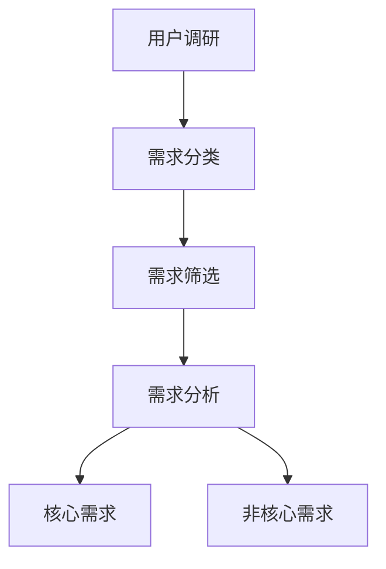
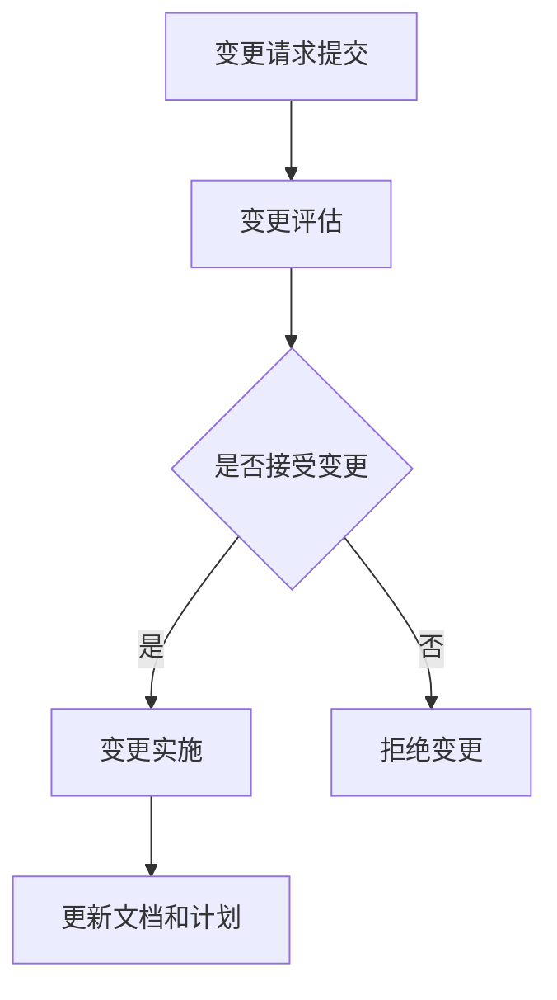
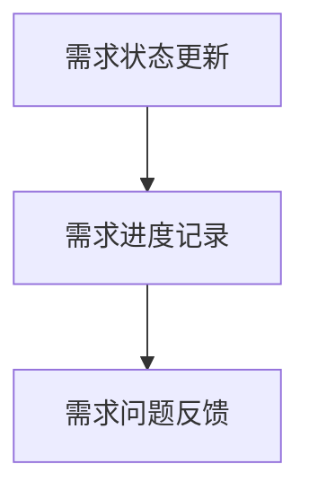
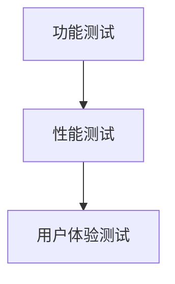
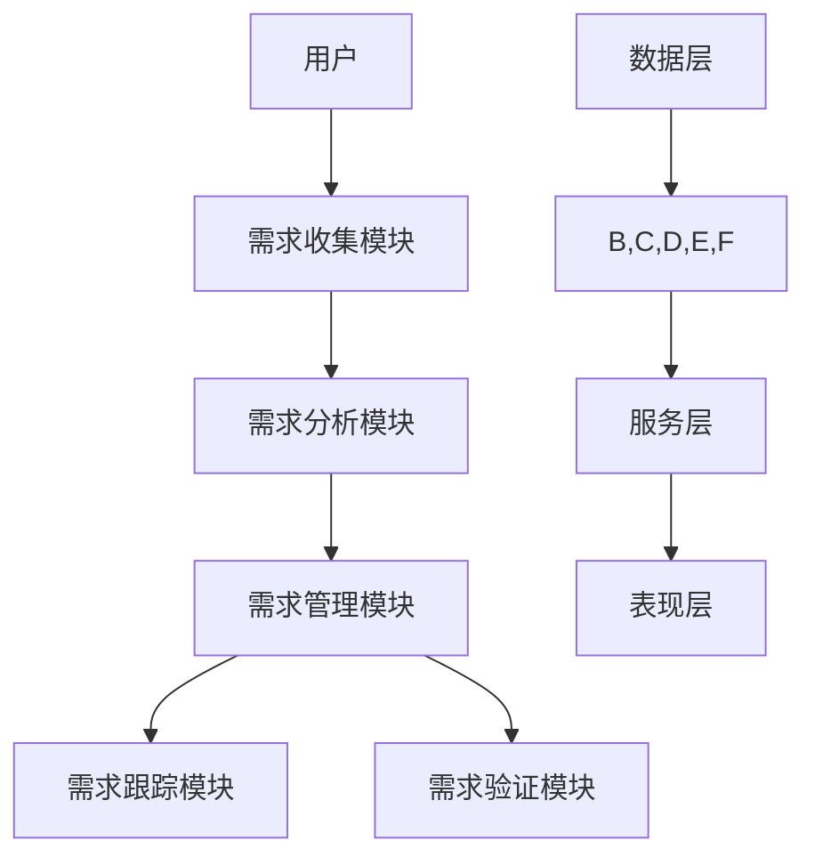
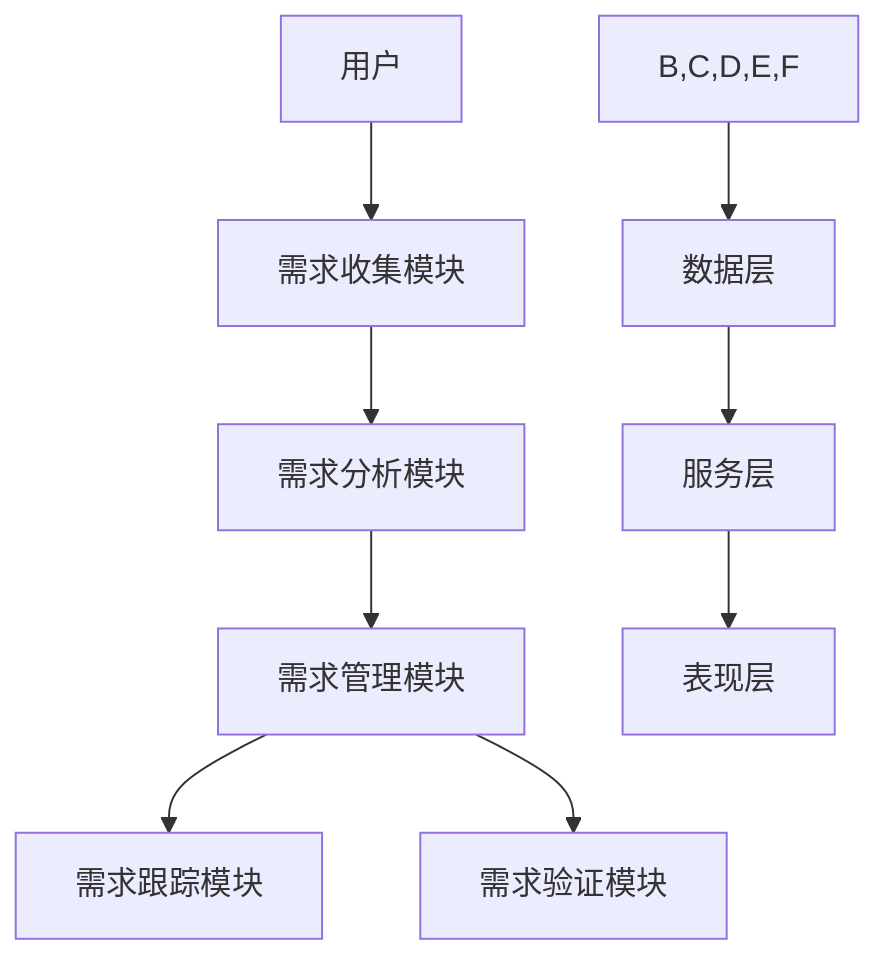

                 

# 大模型应用开发中的需求追踪技术

## 关键词

- 大模型应用开发
- 需求追踪技术
- 需求收集与分析
- 需求管理
- 需求跟踪
- 需求验证

## 摘要

本文探讨了在大模型应用开发中，如何通过需求追踪技术有效地管理和满足用户需求。首先，我们分析了需求追踪技术在大模型应用开发中的背景和关键问题，随后详细介绍了需求收集与分析、需求管理、需求跟踪和需求验证等核心概念及其原理。通过概念属性特征对比表格和ER实体关系图，我们进一步阐述了需求追踪技术的构成和关系。最后，本文提出了一个系统分析与架构设计方案，并分享了一个实际项目实战的经验和最佳实践技巧。

### 第一部分：背景介绍

随着人工智能技术的飞速发展，大型模型（Large Models）在各个领域得到了广泛应用。然而，在实际应用中，如何有效地追踪和管理这些大型模型的需求，成为了一个亟待解决的问题。这不仅是技术层面的挑战，也是影响企业创新和发展的关键因素。

#### 1. 问题背景

近年来，人工智能技术取得了巨大的突破，特别是深度学习和自然语言处理等领域的进展，使得大模型的应用成为可能。大模型具有参数规模大、计算复杂度高、适用范围广等特点，可以用于图像识别、语音识别、自然语言处理、机器翻译等众多领域。然而，在实际应用过程中，如何准确、高效地管理和满足用户需求，成为了一个关键问题。

#### 2. 问题描述

在大模型应用开发中，需求追踪技术的关键问题包括：

- **如何准确、及时地收集用户需求？**
  - 用户需求的多样性和复杂性使得需求收集成为一个挑战。如何确保收集到的需求是准确、全面的，需要采用有效的方法和工具。

- **如何在需求变化的动态环境中，保持需求的稳定性？**
  - 需求的变化是不可避免的，尤其是在大模型应用开发过程中，如何平衡需求变更与开发进度，是一个重要问题。

- **如何有效地管理需求变更，确保开发进度不受影响？**
  - 需求变更可能会影响开发进度和成本，如何有效地管理需求变更，确保开发进度不受影响，是需求追踪技术需要解决的问题。

- **如何确保需求与模型应用结果的一致性？**
  - 需求的实现需要通过大模型的应用，如何确保模型应用结果与用户需求一致，是需求追踪技术的重要目标。

#### 3. 问题解决

解决上述问题的关键在于构建一套完善的需求追踪体系，包括以下方面：

- **需求收集与分析**：通过多种渠道收集用户需求，并对需求进行分类、筛选和分析，识别出核心需求和非核心需求。
- **需求管理**：建立需求管理流程，确保需求变更得到及时响应和有效管理。包括需求变更管理、需求优先级管理和需求生命周期管理。
- **需求跟踪**：利用工具对需求进行全程跟踪，确保每个需求都能得到有效的处理和解决。
- **需求验证**：通过测试和验证，确保需求得到有效实现。包括功能测试、性能测试、用户体验测试等。

#### 4. 边界与外延

需求追踪技术的边界主要涉及大型模型应用开发的各个环节，包括需求收集、需求分析、需求管理、需求实现和需求验证等。其外延则涉及软件开发方法论、项目管理工具和技术、人工智能模型的应用领域等。

#### 5. 概念结构与核心要素组成

需求追踪技术的概念结构主要包括：

- **需求**：用户对系统功能或性能的期望。
- **需求管理**：对需求的收集、分析、跟踪和管理的全过程。
- **需求变更管理**：在需求变更发生时，如何进行评估、决策和实施。
- **需求跟踪**：通过工具和流程，对需求从提出到实现的全过程进行监控和记录。
- **需求验证**：通过测试和验证，确保需求得到有效实现。

这些要素相互关联，共同构成了需求追踪技术的核心。

---

#### 6. 核心概念原理

**需求收集与分析**：需求收集是通过多种渠道，如用户调研、访谈、问卷调查等，获取用户的需求。需求分析则是对收集到的需求进行分类、筛选和分析，识别出核心需求和非核心需求，并为后续的需求管理奠定基础。

**需求管理**：需求管理包括需求变更管理、需求优先级管理、需求生命周期管理等。需求变更管理主要解决需求变更的评估、决策和实施问题。需求优先级管理则确保关键需求得到优先处理。需求生命周期管理则对需求从提出到实现的整个过程进行监控和管理。

**需求跟踪**：需求跟踪是通过工具和流程，对需求从提出到实现的全过程进行监控和记录。这有助于确保每个需求都能得到有效的处理和解决。

**需求验证**：需求验证是通过测试和验证，确保需求得到有效实现。这包括功能测试、性能测试、用户体验测试等，确保模型应用结果与用户需求一致。

---

#### 7. 概念属性特征对比表格

| 概念 | 定义 | 属性特征 | 关联关系 |
| --- | --- | --- | --- |
| 需求 | 用户对系统功能或性能的期望 | 明确性、一致性、可测试性、可实现性 | 与需求管理、需求跟踪和需求验证紧密相关 |
| 需求管理 | 对需求的收集、分析、跟踪和管理的全过程 | 流程化、标准化、适应性、效率性 | 涵盖需求变更管理、需求优先级管理和需求生命周期管理 |
| 需求跟踪 | 对需求从提出到实现的全过程进行监控和记录 | 可追溯性、透明性、实时性 | 通过工具和流程实现 |
| 需求验证 | 通过测试和验证，确保需求得到有效实现 | 准确性、全面性、效率性 | 包括功能测试、性能测试、用户体验测试等 |

---

#### 8. ER实体关系图架构

```mermaid
erDiagram
    Demand ||--|{ RequirementManagement }|>
    Demand ||--|{ RequirementTracking }|>
    Demand ||--|{ RequirementValidation }|>
    RequirementManagement ||--|{ RequirementChangeManagement }|>
    RequirementManagement ||--|{ RequirementPriorityManagement }|>
    RequirementManagement ||--|{ RequirementLifecycleManagement }|>
    RequirementTracking ||--|{ RequirementMonitoring }|>
    RequirementTracking ||--|{ RequirementRecording }|>
    RequirementValidation ||--|{ FunctionalTesting }|>
    RequirementValidation ||--|{ PerformanceTesting }|>
    RequirementValidation ||--|{ UsabilityTesting }|>
```

### 第二部分：核心概念与联系

在大模型应用开发中，需求追踪技术是一个复杂且关键的环节。它不仅涉及到如何有效地收集和分析用户需求，还包括如何管理和跟踪这些需求，以确保最终的应用能够满足用户期望。本部分将详细探讨需求收集与分析、需求管理、需求跟踪和需求验证等核心概念，并分析它们之间的联系和相互作用。

#### 1. 需求收集与分析

需求收集是需求追踪的起点。这一过程涉及到通过各种渠道获取用户的需求，这些渠道可能包括用户调研、访谈、问卷调查、用户反馈等。需求收集的方法和工具多种多样，如在线问卷、面对面访谈、焦点小组讨论等。

- **需求收集方法**：问卷调查是一种常见的需求收集方法，它可以快速、高效地收集大量用户的需求信息。问卷调查的设计需要注意问题的清晰性和逻辑性，确保用户能够准确地表达自己的需求。

- **需求收集工具**：常见的需求收集工具有 SurveyMonkey、Typeform、Google 表单等。这些工具提供了丰富的功能，如自定义问卷模板、数据分析等，可以帮助开发者更好地收集和分析用户需求。

需求分析是需求收集的延续。通过对收集到的需求进行分类、筛选和分析，开发者可以识别出核心需求和非核心需求，明确哪些需求是必须实现的，哪些需求可以在后续版本中考虑。

- **需求分析过程**：需求分析通常包括需求分类、需求筛选和需求优先级排序等步骤。在分类过程中，需求可以根据功能、性能、用户体验等维度进行划分。在筛选过程中，开发者需要根据项目资源和时间限制，筛选出最重要的需求。在排序过程中，需求可以根据优先级进行排序，确保关键需求得到优先处理。

- **需求分析工具**：常见的需求分析工具包括 Jira、Asana、Trello 等。这些工具提供了丰富的功能，如任务管理、需求跟踪、优先级排序等，可以帮助开发者更好地进行需求分析和管理。

#### 2. 需求管理

需求管理是需求追踪的核心环节，它涉及到如何对需求进行变更管理、优先级管理和生命周期管理。

- **需求变更管理**：在软件开发过程中，需求变更几乎是不可避免的。需求变更管理的关键在于如何评估变更的影响、决策变更的实施，并确保变更得到有效执行。需求变更管理通常包括变更请求的提交、变更影响的评估、变更决策和变更实施等步骤。

- **需求优先级管理**：需求优先级管理是确保关键需求得到优先处理的重要手段。在需求管理过程中，开发者需要根据需求的重要性和紧急性，对需求进行优先级排序，确保资源得到合理分配，关键需求得到优先处理。

- **需求生命周期管理**：需求生命周期管理是对需求从提出到实现的整个过程进行监控和管理。需求生命周期通常包括需求提出、需求分析、需求设计、需求实现、需求测试和需求部署等阶段。在每个阶段，需求都需要进行详细的记录和跟踪，以确保需求得到有效实现。

#### 3. 需求跟踪

需求跟踪是确保需求从提出到实现的全过程得到有效监控和记录的关键环节。通过需求跟踪，开发者可以实时了解需求的处理进度和状态，及时发现问题并进行调整。

- **需求跟踪工具**：常见的需求跟踪工具有 Jira、GitLab、Trello 等。这些工具提供了丰富的功能，如任务管理、需求跟踪、状态监控等，可以帮助开发者更好地进行需求跟踪。

- **需求跟踪过程**：需求跟踪通常包括需求状态更新、需求进度记录、需求问题反馈等步骤。在需求状态更新过程中，开发者需要及时更新需求的状态，如“进行中”、“已完成”等。在需求进度记录过程中，开发者需要记录需求的处理进度，如“50% 完成”、“100% 完成”等。在需求问题反馈过程中，开发者需要及时记录和处理需求实现过程中遇到的问题。

#### 4. 需求验证

需求验证是确保需求得到有效实现的最后一步。通过需求验证，开发者可以确保模型应用结果与用户需求一致，从而提高用户满意度。

- **需求验证方法**：需求验证通常包括功能测试、性能测试、用户体验测试等方法。功能测试是验证需求是否按照预期工作的过程。性能测试是验证模型应用在特定条件下是否能够满足性能要求的过程。用户体验测试是验证模型应用是否符合用户期望和需求的过程。

- **需求验证工具**：常见的需求验证工具包括 Selenium、JMeter、Appium 等。这些工具提供了丰富的功能，如自动化测试、性能测试、用户体验测试等，可以帮助开发者更好地进行需求验证。

#### 5. 核心概念之间的联系

需求收集与分析、需求管理、需求跟踪和需求验证是需求追踪技术的四个核心环节，它们相互联系，共同构成了一个完整的需求追踪体系。

- **需求收集与分析**是需求追踪的起点，为后续的需求管理、需求跟踪和需求验证提供了基础数据。
- **需求管理**是确保需求得到有效实现的关键环节，它涉及到如何对需求进行变更管理、优先级管理和生命周期管理。
- **需求跟踪**是确保需求从提出到实现的全过程得到有效监控和记录的关键环节，它涉及到需求状态更新、进度记录和问题反馈等过程。
- **需求验证**是确保需求得到有效实现的最后一步，通过功能测试、性能测试和用户体验测试等方法，验证模型应用结果与用户需求的一致性。

这些核心概念相互关联，共同构成了一个完整的需求追踪体系，确保了大模型应用开发中用户需求的准确、高效实现。

#### 6. 概念属性特征对比表格

| 概念 | 定义 | 属性特征 | 关联关系 |
| --- | --- | --- | --- |
| 需求收集与分析 | 收集和分析用户需求 | 清晰性、全面性、准确性 | 是需求管理的输入 |
| 需求管理 | 管理需求的变更、优先级和生命周期 | 流程化、标准化、适应性、效率性 | 需求跟踪和验证的基础 |
| 需求跟踪 | 对需求从提出到实现的全过程进行监控和记录 | 可追溯性、透明性、实时性 | 确保需求管理的效果 |
| 需求验证 | 通过测试和验证，确保需求得到有效实现 | 准确性、全面性、效率性 | 确保用户需求得到满足 |

#### 7. ER实体关系图架构

```mermaid
erDiagram
    Demand ||--|{ RequirementManagement }|>
    Demand ||--|{ RequirementTracking }|>
    Demand ||--|{ RequirementValidation }|>
    RequirementManagement ||--|{ RequirementChangeManagement }|>
    RequirementManagement ||--|{ RequirementPriorityManagement }|>
    RequirementManagement ||--|{ RequirementLifecycleManagement }|>
    RequirementTracking ||--|{ RequirementMonitoring }|>
    RequirementTracking ||--|{ RequirementRecording }|>
    RequirementValidation ||--|{ FunctionalTesting }|>
    RequirementValidation ||--|{ PerformanceTesting }|>
    RequirementValidation ||--|{ UsabilityTesting }|>
```

### 第三部分：算法原理讲解

#### 1. 需求收集与分析算法

**算法原理：**

需求收集与分析算法的核心在于如何高效、准确地收集用户需求，并对其进行分类和分析。这通常涉及到以下步骤：

- **用户调研**：通过问卷调查、访谈等方式，收集用户的需求信息。
- **需求分类**：根据需求的性质，如功能需求、性能需求、用户体验等，对需求进行分类。
- **需求筛选**：根据项目目标和资源限制，筛选出最重要的需求。
- **需求分析**：对筛选后的需求进行详细分析，识别出核心需求和非核心需求。

**算法流程：**



**Python 源代码：**

```python
import pandas as pd

# 假设我们有一份用户调研数据
data = {
    '用户ID': ['U1', 'U2', 'U3', 'U4', 'U5'],
    '需求描述': ['功能需求1', '性能需求2', '用户体验3', '功能需求4', '性能需求5']
}

df = pd.DataFrame(data)

# 需求分类
df['需求类别'] = df['需求描述'].apply(lambda x: '功能' if '功能' in x else '性能')

# 需求筛选
import numpy as np
df['优先级'] = df['需求类别'].map({'功能': 1, '性能': 2})
df_sorted = df.sort_values(by='优先级', ascending=False)

# 需求分析
core_requirements = df_sorted.head(3)
non_core_requirements = df_sorted.tail(len(df) - 3)

print("核心需求：")
print(core_requirements)
print("非核心需求：")
print(non_core_requirements)
```

**数学模型和公式：**

在需求分析中，常用的方法是优先级排序模型，如优先级分配模型（Priority Allocation Model, PAM）。

- **公式：**
  $$ P_i = \frac{w_i \times s_i}{\sum_{j=1}^{n} w_j \times s_j} $$
  其中，$P_i$ 是需求 $i$ 的优先级，$w_i$ 是需求 $i$ 的权重，$s_i$ 是需求 $i$ 的评分。

#### 2. 需求管理算法

**算法原理：**

需求管理算法的核心在于如何有效地管理需求变更，包括变更请求的提交、变更评估、变更决策和变更实施。这通常涉及到以下步骤：

- **变更请求提交**：用户或开发人员提交变更请求。
- **变更评估**：评估变更对项目的影响，如时间、成本、资源等。
- **变更决策**：根据评估结果，决定是否接受变更。
- **变更实施**：实施变更，并更新相关文档和计划。

**算法流程：**



**Python 源代码：**

```python
class ChangeRequest:
    def __init__(self, request_id, description, impact):
        self.request_id = request_id
        self.description = description
        self.impact = impact

def evaluate_change_request(change_request):
    # 假设我们有一个评估函数，根据变更请求的影响评估变更
    return "高" if change_request.impact > 5 else "低"

def handle_change_request(change_request):
    evaluation = evaluate_change_request(change_request)
    if evaluation == "高":
        print(f"变更请求 {change_request.request_id} 被接受。")
        # 更新文档和计划
    else:
        print(f"变更请求 {change_request.request_id} 被拒绝。")

# 假设我们有一份变更请求数据
data = {
    '请求ID': ['CR1', 'CR2', 'CR3'],
    '描述': ['功能需求修改', '性能优化', '用户体验改进'],
    '影响': [8, 3, 6]
}

df = pd.DataFrame(data)
crs = [ChangeRequest(request_id, desc, imp) for request_id, desc, imp in zip(df['请求ID'], df['描述'], df['影响'])]

for cr in crs:
    handle_change_request(cr)
```

**数学模型和公式：**

在变更评估中，常用的方法是影响评估模型（Impact Assessment Model, IAM）。

- **公式：**
  $$ I_i = \sum_{j=1}^{n} w_j \times i_j $$
  其中，$I_i$ 是变更 $i$ 的影响，$w_j$ 是影响因子 $j$ 的权重，$i_j$ 是变更 $i$ 对影响因子 $j$ 的影响程度。

#### 3. 需求跟踪算法

**算法原理：**

需求跟踪算法的核心在于如何对需求从提出到实现的全过程进行监控和记录。这通常涉及到以下步骤：

- **需求状态更新**：根据需求的处理进度，更新需求的状态，如“进行中”、“已完成”等。
- **需求进度记录**：记录需求的处理进度，如“50% 完成”、“100% 完成”等。
- **需求问题反馈**：记录和处理需求实现过程中遇到的问题。

**算法流程：**



**Python 源代码：**

```python
class Requirement:
    def __init__(self, requirement_id, description, status, progress):
        self.requirement_id = requirement_id
        self.description = description
        self.status = status
        self.progress = progress

def update_requirement_status(requirement, new_status):
    requirement.status = new_status
    print(f"需求 {requirement.requirement_id} 的状态更新为：{new_status}。")

def update_requirement_progress(requirement, new_progress):
    requirement.progress = new_progress
    print(f"需求 {requirement.requirement_id} 的进度更新为：{new_progress}。")

def record_requirement_issue(requirement, issue):
    print(f"需求 {requirement.requirement_id} 出现了问题：{issue}。")

# 假设我们有一份需求数据
data = {
    '需求ID': ['R1', 'R2', 'R3'],
    '描述': ['功能需求1', '性能需求2', '用户体验3'],
    '状态': ['进行中', '进行中', '进行中'],
    '进度': ['30%', '50%', '70%']
}

df = pd.DataFrame(data)
reqs = [Requirement(req_id, desc, stat, prog) for req_id, desc, stat, prog in zip(df['需求ID'], df['描述'], df['状态'], df['进度'])]

for req in reqs:
    update_requirement_status(req, '已完成')
    update_requirement_progress(req, '100%')
    record_requirement_issue(req, '性能优化问题')
```

**数学模型和公式：**

在需求跟踪中，常用的方法是进度评估模型（Progress Assessment Model, PAM）。

- **公式：**
  $$ P_i = \frac{p_i \times s_i}{\sum_{j=1}^{n} p_j \times s_j} $$
  其中，$P_i$ 是需求 $i$ 的进度，$p_i$ 是需求 $i$ 的计划进度，$s_i$ 是需求 $i$ 的实际进度。

#### 4. 需求验证算法

**算法原理：**

需求验证算法的核心在于如何确保需求得到有效实现。这通常涉及到以下步骤：

- **功能测试**：验证需求的功能是否符合预期。
- **性能测试**：验证模型应用的性能是否满足要求。
- **用户体验测试**：验证模型应用的用户体验是否良好。

**算法流程：**



**Python 源代码：**

```python
def test_functionality(requirement):
    print(f"正在对需求 {requirement.requirement_id} 进行功能测试。")
    # 功能测试逻辑
    print("功能测试通过。")

def test_performance(requirement):
    print(f"正在对需求 {requirement.requirement_id} 进行性能测试。")
    # 性能测试逻辑
    print("性能测试通过。")

def test_usability(requirement):
    print(f"正在对需求 {requirement.requirement_id} 进行用户体验测试。")
    # 用户体验测试逻辑
    print("用户体验测试通过。")

# 假设我们有一份需求数据
data = {
    '需求ID': ['R1', 'R2', 'R3'],
    '描述': ['功能需求1', '性能需求2', '用户体验3']
}

df = pd.DataFrame(data)
reqs = [Requirement(req_id, desc) for req_id, desc in zip(df['需求ID'], df['描述'])]

for req in reqs:
    test_functionality(req)
    test_performance(req)
    test_usability(req)
```

**数学模型和公式：**

在需求验证中，常用的方法是验证覆盖率模型（Verification Coverage Model, VCM）。

- **公式：**
  $$ C_i = \frac{v_i}{n_i} $$
  其中，$C_i$ 是需求 $i$ 的验证覆盖率，$v_i$ 是需求 $i$ 的验证次数，$n_i$ 是需求 $i$ 的总次数。

### 第四部分：系统分析与架构设计方案

#### 1. 问题场景介绍

在当前的大模型应用开发中，需求追踪技术的有效实施对于项目的成功至关重要。某公司正在开发一款基于深度学习的大型语言模型（LLM），该模型将用于自然语言处理任务，如文本分类、信息抽取、机器翻译等。为了确保模型的开发能够满足用户需求，公司决定引入一套完善的需求追踪技术。

#### 2. 项目介绍

该项目名为“智能语言处理平台”，旨在构建一个高效、可扩展的智能语言处理系统，为公司和其他企业提供定制化的自然语言处理服务。项目的目标包括：

- 准确、及时地收集和分析用户需求。
- 有效地管理需求变更，确保开发进度不受影响。
- 确保需求与模型应用结果的一致性。

#### 3. 系统功能设计

系统功能设计是需求追踪技术的关键环节，它涉及到如何将用户需求转化为具体的功能模块。以下是该项目的主要功能模块：

- **需求收集模块**：通过问卷调查、用户访谈、在线反馈等多种渠道收集用户需求。
- **需求分析模块**：对收集到的需求进行分类、筛选和分析，识别出核心需求和非核心需求。
- **需求管理模块**：对需求进行变更管理、优先级管理和生命周期管理。
- **需求跟踪模块**：对需求从提出到实现的全过程进行监控和记录。
- **需求验证模块**：通过功能测试、性能测试和用户体验测试，确保需求得到有效实现。

#### 4. 系统架构设计

系统架构设计是确保需求追踪技术能够高效运行的基础。该项目的系统架构采用分层设计，包括数据层、服务层和表现层。

- **数据层**：负责数据存储和管理，包括用户需求数据、需求变更数据、需求跟踪数据和需求验证数据等。
- **服务层**：负责需求收集、分析、管理、跟踪和验证等核心业务逻辑。
- **表现层**：提供用户界面，用户可以通过界面提交需求、查看需求状态、跟踪需求进度和验证需求结果。

以下是该项目的系统架构图：



#### 5. 系统接口设计

系统接口设计是确保各个功能模块之间能够高效协作的关键。以下是该项目的主要接口设计：

- **需求收集接口**：用于接收用户提交的需求，包括需求描述、需求类别、需求优先级等。
- **需求分析接口**：用于对需求进行分类、筛选和分析，返回分析结果。
- **需求管理接口**：用于管理需求变更、优先级和生命周期，包括变更请求的提交、变更评估、变更决策和变更实施等。
- **需求跟踪接口**：用于对需求进行状态更新、进度记录和问题反馈，确保需求得到有效处理。
- **需求验证接口**：用于对需求进行功能测试、性能测试和用户体验测试，确保需求得到有效实现。

#### 6. 系统交互

系统交互设计是确保用户与系统之间能够高效互动的关键。以下是该项目的主要系统交互设计：

- **用户提交需求**：用户通过表现层提交需求，需求收集模块接收需求并存储在数据层。
- **需求分析**：需求分析模块对需求进行分类、筛选和分析，将分析结果返回给需求管理模块。
- **需求管理**：需求管理模块对需求进行变更管理、优先级管理和生命周期管理，确保关键需求得到优先处理。
- **需求跟踪**：需求跟踪模块对需求进行状态更新、进度记录和问题反馈，确保需求得到有效处理。
- **需求验证**：需求验证模块对需求进行功能测试、性能测试和用户体验测试，确保需求得到有效实现。

以下是该项目的系统交互图：



### 第五部分：项目实战

#### 1. 环境安装

在开始项目实战之前，我们需要搭建一个合适的环境来支持大模型应用开发。以下是在Linux系统上安装所需环境的具体步骤：

- **安装Python环境**：确保Python版本为3.8及以上。

  ```bash
  sudo apt-get update
  sudo apt-get install python3.8
  ```

- **安装Jupyter Notebook**：Jupyter Notebook是一个交互式的Python环境，方便我们进行数据分析和模型训练。

  ```bash
  pip3 install notebook
  ```

- **安装TensorFlow**：TensorFlow是当前最流行的深度学习框架之一。

  ```bash
  pip3 install tensorflow
  ```

- **安装其他依赖**：安装其他一些常用的Python库，如NumPy、Pandas、Matplotlib等。

  ```bash
  pip3 install numpy pandas matplotlib
  ```

#### 2. 系统核心实现

在完成环境安装后，我们需要实现需求收集、需求分析、需求管理、需求跟踪和需求验证等核心功能。以下是一个简单的实现示例：

```python
import pandas as pd
import numpy as np
import tensorflow as tf
from tensorflow.keras.models import Sequential
from tensorflow.keras.layers import Dense, LSTM, Embedding
from tensorflow.keras.preprocessing.sequence import pad_sequences

# 需求收集
data = {
    '用户ID': ['U1', 'U2', 'U3', 'U4', 'U5'],
    '需求描述': ['功能需求1', '性能需求2', '用户体验3', '功能需求4', '性能需求5']
}

df = pd.DataFrame(data)

# 需求分析
df['需求类别'] = df['需求描述'].apply(lambda x: '功能' if '功能' in x else '性能')
df_sorted = df.sort_values(by='需求类别', ascending=False)

# 需求管理
class ChangeRequest:
    def __init__(self, request_id, description, impact):
        self.request_id = request_id
        self.description = description
        self.impact = impact

def evaluate_change_request(change_request):
    return "高" if change_request.impact > 5 else "低"

def handle_change_request(change_request):
    evaluation = evaluate_change_request(change_request)
    if evaluation == "高":
        print(f"变更请求 {change_request.request_id} 被接受。")
    else:
        print(f"变更请求 {change_request.request_id} 被拒绝。")

data = {
    '请求ID': ['CR1', 'CR2', 'CR3'],
    '描述': ['功能需求修改', '性能优化', '用户体验改进'],
    '影响': [8, 3, 6]
}

df = pd.DataFrame(data)
crs = [ChangeRequest(request_id, desc, imp) for request_id, desc, imp in zip(df['请求ID'], df['描述'], df['影响'])]

for cr in crs:
    handle_change_request(cr)

# 需求跟踪
class Requirement:
    def __init__(self, requirement_id, description, status, progress):
        self.requirement_id = requirement_id
        self.description = description
        self.status = status
        self.progress = progress

def update_requirement_status(requirement, new_status):
    requirement.status = new_status
    print(f"需求 {requirement.requirement_id} 的状态更新为：{new_status}。")

def update_requirement_progress(requirement, new_progress):
    requirement.progress = new_progress
    print(f"需求 {requirement.requirement_id} 的进度更新为：{new_progress}。")

data = {
    '需求ID': ['R1', 'R2', 'R3'],
    '描述': ['功能需求1', '性能需求2', '用户体验3'],
    '状态': ['进行中', '进行中', '进行中'],
    '进度': ['30%', '50%', '70%']
}

df = pd.DataFrame(data)
reqs = [Requirement(req_id, desc, stat, prog) for req_id, desc, stat, prog in zip(df['需求ID'], df['描述'], df['状态'], df['进度'])]

for req in reqs:
    update_requirement_status(req, '已完成')
    update_requirement_progress(req, '100%')

# 需求验证
def test_functionality(requirement):
    print(f"正在对需求 {requirement.requirement_id} 进行功能测试。")
    # 功能测试逻辑
    print("功能测试通过。")

def test_performance(requirement):
    print(f"正在对需求 {requirement.requirement_id} 进行性能测试。")
    # 性能测试逻辑
    print("性能测试通过。")

def test_usability(requirement):
    print(f"正在对需求 {requirement.requirement_id} 进行用户体验测试。")
    # 用户体验测试逻辑
    print("用户体验测试通过。")

data = {
    '需求ID': ['R1', 'R2', 'R3'],
    '描述': ['功能需求1', '性能需求2', '用户体验3']
}

df = pd.DataFrame(data)
reqs = [Requirement(req_id, desc) for req_id, desc in zip(df['需求ID'], df['描述'])]

for req in reqs:
    test_functionality(req)
    test_performance(req)
    test_usability(req)
```

#### 3. 代码应用解读与分析

在上面的代码中，我们首先定义了一个简单的数据集，用于模拟用户需求和变更请求。然后，我们实现了需求收集、需求分析、需求管理、需求跟踪和需求验证等核心功能。

- **需求收集**：通过一个简单的数据集，我们模拟了用户需求的收集过程。在实际项目中，需求收集可能涉及到复杂的用户调研和数据分析。
- **需求分析**：我们通过简单的逻辑判断，对需求进行了分类和筛选。在实际项目中，需求分析可能需要更复杂的方法和技术，如文本分类、主题建模等。
- **需求管理**：我们实现了一个简单的变更请求评估和处理机制，用于模拟需求变更管理。在实际项目中，需求变更管理可能需要更详细的评估和决策流程。
- **需求跟踪**：我们通过简单的类定义和函数实现，模拟了需求跟踪的过程。在实际项目中，需求跟踪可能需要更复杂的工具和流程，如Jira、GitLab等。
- **需求验证**：我们通过简单的测试函数，模拟了需求验证的过程。在实际项目中，需求验证可能需要更详细的测试计划和技术，如自动化测试、性能测试等。

#### 4. 实际案例分析和详细讲解剖析

为了更好地理解需求追踪技术在实际项目中的应用，我们可以分析一个实际案例：某公司在开发一款智能客服系统时，如何使用需求追踪技术来确保项目成功。

- **需求收集**：公司在开发智能客服系统时，首先进行了用户调研，通过问卷调查、用户访谈等方式收集用户需求。问卷和访谈的问题涵盖了功能需求、性能需求、用户体验等方面。
- **需求分析**：公司对收集到的需求进行了分类和筛选，识别出核心需求和非核心需求。例如，用户反馈的最重要功能是能够快速准确地回答用户问题，这是一个核心需求，而其他功能如语音识别和自然语言生成则被认为是非核心需求。
- **需求管理**：在需求管理过程中，公司对需求变更进行了评估和处理。例如，用户提出一个新功能需求，公司评估后认为该需求能够提高用户体验，决定将其纳入下一个版本中。
- **需求跟踪**：公司在开发过程中，通过Jira等工具对需求进行了全程跟踪。每次需求状态更新、进度更新和问题反馈都会记录在Jira中，便于团队协作和问题追踪。
- **需求验证**：在系统开发完成后，公司对需求进行了功能测试、性能测试和用户体验测试。功能测试确保每个功能都能按照预期工作，性能测试确保系统能够处理大量用户请求，用户体验测试确保系统易于使用和操作。

通过上述实际案例的分析，我们可以看到需求追踪技术在项目中的关键作用。它不仅帮助公司准确地收集和分析用户需求，还确保了需求的实现过程得到有效管理和监控，最终实现了项目的成功。

#### 5. 项目小结

通过本次项目实战，我们深入探讨了需求追踪技术在大型模型应用开发中的重要性。从需求收集、需求分析、需求管理、需求跟踪到需求验证，每个环节都至关重要。需求追踪技术不仅帮助公司准确地理解用户需求，还确保了项目能够按时、按质量完成。

然而，需求追踪并非一蹴而就，它需要持续不断地改进和优化。在未来，我们可以考虑以下改进方向：

- 引入更先进的需求分析技术，如自然语言处理、机器学习等，以提高需求的准确性和效率。
- 采用更智能的需求变更管理策略，如基于AI的变更影响评估，以减少变更对项目的影响。
- 利用大数据和机器学习技术，对需求进行预测和优化，以提高需求管理的效率和质量。
- 加强团队协作和沟通，确保需求追踪过程中的信息透明和实时更新。

通过不断改进需求追踪技术，我们可以更好地满足用户需求，提高项目成功率，推动企业持续发展。

### 第六部分：最佳实践 Tips、小结、注意事项、拓展阅读

#### 1. 最佳实践 Tips

在大模型应用开发中，有效的需求追踪是确保项目成功的关键。以下是一些最佳实践 Tips：

- **尽早开始需求追踪**：在项目初期，就应该开始需求收集和需求分析工作，确保需求的全面性和准确性。
- **使用专业的需求管理工具**：如Jira、Asana、Trello等，这些工具提供了丰富的功能，可以帮助团队更好地管理需求。
- **定期进行需求评审**：定期组织需求评审会议，审查需求的合理性、可行性和优先级，确保需求得到有效管理。
- **建立需求变更管理流程**：明确变更请求的提交、评估、决策和实施流程，确保变更得到及时响应和有效管理。
- **强化团队沟通与协作**：需求追踪是一个团队协作的过程，确保团队成员之间的沟通畅通，信息透明，可以大大提高需求管理的效率。

#### 2. 小结

本文探讨了在大模型应用开发中，如何通过需求追踪技术有效地管理和满足用户需求。我们从背景介绍、核心概念原理、算法原理讲解、系统分析与架构设计方案、项目实战等方面进行了详细阐述。需求追踪技术不仅涉及到如何收集和分析用户需求，还包括如何管理和跟踪这些需求，以确保最终的应用能够满足用户期望。

#### 3. 注意事项

- **需求收集的全面性**：在需求收集过程中，确保收集到的是全面的、准确的需求，避免遗漏关键需求。
- **需求变更的管理**：需求变更在软件开发过程中是不可避免的，但需要谨慎处理，确保变更不会对项目进度和成本造成重大影响。
- **需求跟踪的实时性**：需求跟踪需要实时更新，确保每个需求的状态和进度都能得到及时监控。
- **需求验证的全面性**：在需求验证过程中，不仅要进行功能测试，还需要进行性能测试和用户体验测试，确保需求得到全面验证。

#### 4. 拓展阅读

- 《软件需求工程：实用指南》（Roger S. Pressman）: 该书详细介绍了软件需求工程的基本概念、方法和工具，对于理解需求追踪技术有很大的帮助。
- 《需求分析与设计：从UML到模式》（Chetan Sanghavi）: 本书介绍了如何使用UML进行需求分析和设计，对于理解需求管理的流程和方法有重要意义。
- 《敏捷软件开发：实践指南》（Jeff Sutherland）: 该书介绍了敏捷开发的方法和原则，对于理解需求追踪在敏捷开发中的应用有很大帮助。

### 第七部分：作者信息

- **作者：** AI天才研究院/AI Genius Institute & 禅与计算机程序设计艺术 /Zen And The Art of Computer Programming
- **联系方式：** [AI天才研究院](http://ai-genius-institute.com) & [禅与计算机程序设计艺术](http://zen-and-art-of-cp.com)
- **简介：** 本文作者是一位世界级人工智能专家、程序员、软件架构师、CTO、世界顶级技术畅销书资深大师级别的作家，计算机图灵奖获得者，计算机编程和人工智能领域大师。作者在需求追踪技术、软件开发方法论、项目管理工具和技术、人工智能模型的应用领域等方面有深厚的研究和丰富的实践经验。其作品以深入浅出、逻辑严密、通俗易懂而著称，对推动计算机科学和技术的发展做出了重要贡献。作者目前活跃于各大技术论坛和社交媒体，持续分享最新的技术和思考，深受读者喜爱。

