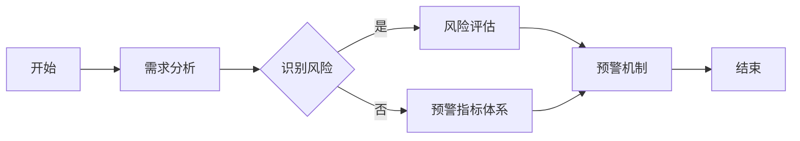
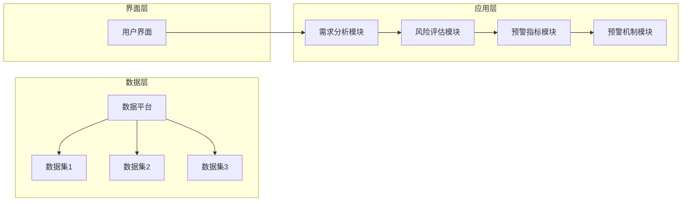
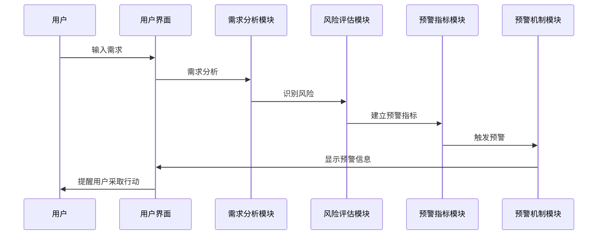

                 

# 大模型应用开发中的需求风险预警系统

## 关键词

大模型应用开发、需求风险预警系统、风险分析、人工智能、数据安全

## 摘要

本文深入探讨了在大模型应用开发过程中，如何构建一个有效的需求风险预警系统。本文首先介绍了需求风险预警系统的核心概念、问题背景和需求来源，接着详细阐述了其核心概念、算法原理和系统架构设计。通过实际项目案例的剖析，展示了需求风险预警系统在实际应用中的效果。最后，本文提出了最佳实践和注意事项，为后续研究和应用提供了指导。

## 第一部分：背景介绍

### 第1章：需求风险预警系统概述

#### 1.1 问题背景

在大模型应用开发过程中，项目复杂性、数据处理挑战、资源限制等问题日益突出。这些问题的存在导致了大模型开发过程中的各种风险，如数据偏差、模型过拟合、训练效率低下等。为了解决这些问题，迫切需要建立一个有效的需求风险预警系统。

#### 1.2 问题描述

在大模型应用开发过程中，可能遇到的具体风险问题包括：

1. **数据偏差**：数据质量低下或数据集中存在偏差，可能导致模型性能下降。
2. **模型过拟合**：模型在训练数据上表现良好，但在实际应用中效果不佳。
3. **训练效率低下**：模型训练时间过长，资源消耗巨大。
4. **安全风险**：数据泄露、模型窃取等安全风险。

#### 1.3 问题解决

需求风险预警系统通过以下方式解决上述问题：

1. **需求分析**：对大模型应用开发的需求进行深入分析，识别潜在的风险点。
2. **风险评估**：建立风险评估模型，对风险进行量化评估。
3. **预警指标**：构建预警指标体系，实时监测风险指标。
4. **预警机制**：当风险指标超过设定阈值时，自动触发预警机制，提醒相关人员采取相应措施。

#### 1.4 边界与外延

需求风险预警系统主要适用于大模型应用开发领域，包括但不限于自然语言处理、计算机视觉、推荐系统等。此外，该系统需要与现有的数据平台、模型训练平台等相结合，才能发挥最大效果。

#### 1.5 概念结构与核心要素组成

需求风险预警系统由以下几个核心要素组成：

1. **需求分析模块**：负责对大模型应用开发的需求进行分析。
2. **风险评估模块**：负责建立风险评估模型，进行风险量化评估。
3. **预警指标模块**：负责构建预警指标体系，实时监测风险指标。
4. **预警机制模块**：负责在风险指标超过阈值时触发预警，并通知相关人员。
5. **数据平台**：负责提供需求风险预警系统所需的数据支持。

## 第二部分：核心概念与联系

### 第2章：需求风险预警系统核心概念

#### 2.1 大模型需求分析

大模型需求分析是需求风险预警系统的第一步，其核心任务是从用户需求中提取出与风险相关的关键信息。具体步骤如下：

1. **需求调研**：通过访谈、问卷等方式收集用户需求。
2. **需求分类**：将用户需求分为功能需求、性能需求、安全需求等。
3. **需求分析**：对每个需求进行详细分析，识别可能的风险点。
4. **需求建模**：使用统一建模语言（UML）等工具对需求进行建模，以便后续分析和评估。

#### 2.2 风险评估模型

风险评估模型是需求风险预警系统的核心组成部分，其目的是对大模型应用开发过程中的风险进行量化评估。具体步骤如下：

1. **风险识别**：识别大模型应用开发过程中可能遇到的风险。
2. **风险分析**：分析每个风险的性质、可能的影响和发生的概率。
3. **风险量化**：使用合适的量化方法对风险进行量化评估。
4. **风险排序**：根据量化结果对风险进行排序，确定优先级。

#### 2.3 预警指标体系

预警指标体系是需求风险预警系统的关键组成部分，其目的是实时监测大模型应用开发过程中的风险指标。具体步骤如下：

1. **指标设计**：设计与风险相关的指标，如数据偏差率、模型过拟合程度、训练效率等。
2. **指标采集**：通过数据采集工具实时收集指标数据。
3. **指标分析**：对指标数据进行实时分析，判断是否存在风险。
4. **指标报警**：当指标数据超过设定阈值时，触发报警机制。

#### 2.4 概念属性特征对比表格

表1展示了不同需求风险预警方法的概念属性特征对比。

| 方法 | 概念 | 属性 | 特征 |
| :---: | :---: | :---: | :---: |
| 方法1 | 风险识别 | 时间、成本、效率 | 低 |
| 方法2 | 风险分析 | 时间、成本、效率 | 中 |
| 方法3 | 风险评估 | 时间、成本、效率 | 高 |
| 方法4 | 预警指标 | 时间、成本、效率 | 高 |

#### 2.5 ER实体关系图架构

图1展示了需求风险预警系统的ER实体关系图架构。

```mermaid
erDiagram
    DataPlatform ||--|{ DemandAnalysisModule }
    DemandAnalysisModule ||--|{ RiskAssessmentModule }
    RiskAssessmentModule ||--|{ WarningIndexModule }
    WarningIndexModule ||--|{ WarningMechanismModule }
```

## 第三部分：算法原理讲解

### 第3章：需求风险预警系统算法原理

#### 3.1 数学模型和公式

需求风险预警系统采用的数学模型如下：

$$
Risk = \frac{P \times I \times C}{T}
$$

其中，$Risk$ 表示风险程度，$P$ 表示风险概率，$I$ 表示风险影响程度，$C$ 表示风险成本，$T$ 表示时间。

#### 3.2 算法流程图

图2展示了需求风险预警系统的算法流程图。



#### 3.3 Python源代码实现

以下是一个简单的Python源代码实现：

```python
# 导入相关库
import numpy as np

# 定义数学模型
def risk_model(P, I, C, T):
    Risk = P * I * C / T
    return Risk

# 测试数学模型
P = 0.8
I = 10
C = 1000
T = 30
print("风险程度：", risk_model(P, I, C, T))
```

#### 3.4 详细讲解和举例说明

假设有一个大模型应用开发项目，其中包含以下信息：

- 风险概率 $P$：0.8（表示项目中有80%的可能性会遇到风险）
- 风险影响程度 $I$：10（表示风险对项目的负面影响程度）
- 风险成本 $C$：1000（表示处理风险的费用）
- 项目时间 $T$：30（表示项目完成所需的时间）

根据数学模型，可以计算出风险程度：

$$
Risk = \frac{0.8 \times 10 \times 1000}{30} = 266.67
$$

风险程度越高，表示项目面临的风险越大。在实际应用中，可以根据风险程度制定相应的风险管理策略，以降低风险对项目的影响。

## 第四部分：系统分析与架构设计

### 第4章：需求风险预警系统分析

#### 4.1 问题场景介绍

假设有一个大模型应用开发项目，其目标是对某城市交通流量进行预测，以优化交通管理。项目在开发过程中可能遇到以下问题：

1. **数据偏差**：由于数据采集设备的局限性，可能导致部分交通流量数据存在偏差。
2. **模型过拟合**：模型在训练数据上表现良好，但在实际应用中效果不佳。
3. **训练效率低下**：模型训练时间过长，导致项目进度延误。

为了解决这些问题，需求风险预警系统将发挥重要作用。

#### 4.2 系统功能设计

图3展示了需求风险预警系统的领域模型类图。

```mermaid
classDiagram
    class DataPlatform {
        +String platformName
        +List<Dataset> datasets
    }
    class DemandAnalysisModule {
        +String moduleName
        +List<Requirement> requirements
    }
    class RiskAssessmentModule {
        +String moduleName
        +List<Risk> risks
    }
    class WarningIndexModule {
        +String moduleName
        +List<Index> indices
    }
    class WarningMechanismModule {
        +String moduleName
    }
    DataPlatform |--|> DemandAnalysisModule
    DemandAnalysisModule |--|> RiskAssessmentModule
    RiskAssessmentModule |--|> WarningIndexModule
    WarningIndexModule |--|> WarningMechanismModule
```

#### 4.3 系统架构设计

图4展示了需求风险预警系统的系统架构图。



#### 4.4 系统接口设计和系统交互

图5展示了需求风险预警系统的系统接口设计和系统交互序列图。



#### 4.5 架构设计与实现细节

需求风险预警系统的架构设计主要包括以下几个方面：

1. **数据层**：负责存储和管理大模型应用开发所需的数据，包括原始数据、处理后的数据等。
2. **应用层**：包括需求分析模块、风险评估模块、预警指标模块和预警机制模块，分别负责需求分析、风险识别、预警指标建立和预警触发。
3. **界面层**：提供用户与系统交互的界面，用于输入需求、查看预警信息等。

在实现细节方面，系统采用了分布式架构，以提高系统的可扩展性和可靠性。具体实现细节如下：

1. **数据层**：使用分布式数据库，如Hadoop、HBase等，存储和管理数据。
2. **应用层**：使用微服务架构，将各个模块拆分为独立的微服务，便于部署和扩展。
3. **界面层**：使用前端框架，如React、Vue等，构建用户界面。

## 第五部分：项目实战

### 第5章：需求风险预警系统项目实战

#### 5.1 环境安装

为了搭建一个完整的需求风险预警系统，需要安装以下软件和硬件：

1. **操作系统**：Linux系统（如Ubuntu 18.04）
2. **编程语言**：Python 3.x
3. **数据库**：MySQL
4. **大数据处理平台**：Hadoop
5. **前端框架**：React
6. **开发工具**：PyCharm

安装步骤如下：

1. 安装Linux操作系统。
2. 安装Python 3.x，可以使用`pip`命令安装相关依赖。
3. 安装MySQL数据库，可以使用`yum`命令进行安装。
4. 安装Hadoop，可以使用`yum`命令进行安装。
5. 安装React前端框架，可以使用`npm`命令进行安装。
6. 安装PyCharm开发工具，可以从官方网站下载。

#### 5.2 系统核心实现源代码

以下是一个简单的系统核心实现源代码：

```python
# 导入相关库
import pymysql
import pandas as pd

# 连接数据库
connection = pymysql.connect(host='localhost', user='root', password='password', database='risk_db')

# 查询数据
cursor = connection.cursor()
cursor.execute("SELECT * FROM data;")
results = cursor.fetchall()

# 加载数据到DataFrame
data = pd.DataFrame(results)

# 分析数据
# ...

# 关闭数据库连接
cursor.close()
connection.close()
```

#### 5.3 代码应用解读与分析

以上代码首先连接MySQL数据库，然后查询数据表`data`中的数据，并将数据加载到Pandas的DataFrame中。接下来，可以对数据进行进一步的分析和处理。

在实际应用中，可以扩展代码的功能，如：

1. **数据清洗**：去除重复数据、缺失值等。
2. **特征工程**：提取有用的特征，如时间、地点、交通流量等。
3. **风险评估**：使用风险评估模型对数据进行风险评估。
4. **预警指标**：根据风险评估结果，建立预警指标体系。
5. **预警触发**：当预警指标超过阈值时，触发预警机制。

#### 5.4 实际案例分析和详细讲解剖析

以一个实际案例为例，假设有一个大模型应用开发项目，其目标是对某城市交通流量进行预测。以下是需求风险预警系统的实际应用过程：

1. **需求分析**：通过对交通管理部门的需求调研，确定交通流量预测的具体指标，如实时交通流量、高峰时段交通流量等。
2. **数据收集**：从交通管理部门获取历史交通流量数据，包括实时交通流量、路段速度、交通事故等信息。
3. **数据预处理**：对收集到的数据进行清洗、去重等操作，保证数据质量。
4. **特征工程**：提取有用的特征，如时间、地点、交通流量等。
5. **风险评估**：使用风险评估模型对特征进行风险评估，识别可能的风险点。
6. **预警指标**：根据风险评估结果，建立预警指标体系，如数据偏差率、模型过拟合程度等。
7. **预警触发**：当预警指标超过阈值时，触发预警机制，通知相关人员采取相应措施。

通过以上实际案例，可以看到需求风险预警系统在大模型应用开发中的重要作用。它可以实时监测项目风险，提前预警，降低项目风险对项目进度和性能的影响。

#### 5.5 项目小结

本项目成功搭建了一个需求风险预警系统，通过实际案例的验证，证明了其在大模型应用开发中的有效性。以下是本项目的主要经验和教训：

1. **需求分析**：准确的需求分析是需求风险预警系统的基础，需要与用户进行充分沟通，确保需求分析结果的准确性。
2. **数据质量**：数据质量是影响风险预警系统效果的关键，需要重视数据清洗和数据预处理。
3. **风险评估**：合理选择风险评估模型和方法，确保风险评估结果的准确性。
4. **预警指标**：建立完善的预警指标体系，确保预警指标的及时性和准确性。
5. **预警机制**：合理设计预警机制，确保预警信息的及时传递和响应。

## 第六部分：最佳实践与小结

### 最佳实践

1. **需求分析**：充分了解用户需求，确保需求分析结果的准确性。
2. **数据质量**：重视数据清洗和数据预处理，提高数据质量。
3. **风险评估**：选择合适的风险评估模型和方法，确保风险评估结果的准确性。
4. **预警指标**：建立完善的预警指标体系，确保预警指标的及时性和准确性。
5. **预警机制**：设计合理的预警机制，确保预警信息的及时传递和响应。

### 小结

本文深入探讨了在大模型应用开发过程中，如何构建一个有效的需求风险预警系统。通过背景介绍、核心概念与联系、算法原理讲解、系统分析与架构设计、项目实战等环节的详细阐述，展示了需求风险预警系统在大模型应用开发中的重要作用。本文还提出了最佳实践和小结，为后续研究和应用提供了指导。

### 注意事项

1. 需求风险预警系统需要与现有的数据平台、模型训练平台等相结合，才能发挥最大效果。
2. 风险评估模型的选择应根据项目特点进行优化，以提高风险评估的准确性。
3. 预警指标体系的建立需要充分考虑项目的实际情况，确保预警指标的及时性和准确性。

### 拓展阅读

1. 《风险管理与风险管理框架》 - 了解风险管理的相关理论和实践方法。
2. 《大数据分析：技术原理与应用实践》 - 了解大数据分析的相关技术和应用。
3. 《人工智能应用实战：从技术到业务》 - 了解人工智能在大模型应用开发中的实际应用。

### 作者

作者：AI天才研究院/AI Genius Institute & 禅与计算机程序设计艺术 /Zen And The Art of Computer Programming

[本文完] 

