                 

# 大模型应用的敏捷发布管理

## 关键词

- 敏捷发布管理
- 大模型应用
- 系统架构设计
- 风险管理
- 最佳实践

## 摘要

本文旨在探讨大模型应用中的敏捷发布管理。在当今快速发展的AI时代，大模型的发布和管理成为了一个重要的课题。本文将从背景介绍、核心概念、系统架构设计、实践案例、最佳实践和未来展望等方面，逐步分析大模型应用中敏捷发布管理的关键要素，以帮助读者深入理解和实践这一重要领域。

## 第一部分：敏捷发布管理基础

### 第1章：敏捷发布管理概述

#### 1.1 问题背景

随着人工智能技术的不断发展，大模型的应用越来越广泛。这些模型通常由成千上万个参数组成，其训练和发布过程复杂且耗时。如何在确保模型质量和性能的同时，实现快速、可靠和高效的发布，成为了一个亟待解决的问题。

#### 1.2 问题描述

大模型发布管理面临的挑战主要包括：模型训练时间过长、发布流程繁琐、系统架构复杂、风险控制困难等。这些问题直接影响了模型的可用性和市场竞争力。

#### 1.3 解决方案

为了解决上述问题，敏捷发布管理应运而生。它强调快速迭代、持续集成和持续交付，通过优化发布流程，提高发布效率，降低风险，确保模型的高效应用。

#### 1.4 边界与外延

敏捷发布管理不仅适用于大模型，也可以应用于其他复杂系统的发布。其核心思想在于灵活、快速和高效，适用于各种规模和类型的系统。

### 第2章：敏捷发布管理的核心概念

#### 2.1 核心概念

敏捷发布管理的核心概念包括：迭代开发、持续集成、持续交付、自动化测试等。这些概念共同构成了敏捷发布管理的理论基础。

#### 2.2 概念属性特征对比

下表展示了这些核心概念的属性特征及其对比：

| 概念 | 属性特征 | 对比 |
| :--: | :--: | :--: |
| 迭代开发 | 快速反馈、持续改进 | 与瀑布模型相比，迭代开发更注重反馈和改进 |
| 持续集成 | 自动化、高效 | 确保代码质量和稳定性 |
| 持续交付 | 快速发布、低风险 | 确保产品的高可用性和可靠性 |
| 自动化测试 | 高效、准确 | 减少人工测试成本，提高测试质量 |

#### 2.3 ER实体关系图

为了更好地理解敏捷发布管理的核心概念，我们可以通过ER（实体关系）图来展示它们之间的关系。以下是ER图的Markdown格式：

```mermaid
erDiagram
  迭代开发 &&|> 持续集成
  持续集成 &&|> 持续交付
  持续交付 &&|> 自动化测试
```

### 第3章：大模型应用的特点与挑战

#### 3.1 大模型应用的特点

- 参数规模庞大
- 训练时间较长
- 需要大量数据支持
- 对硬件资源要求高

#### 3.2 大模型应用的挑战

- 发布流程复杂
- 风险控制困难
- 系统架构设计复杂
- 测试与验证成本高

### 第4章：敏捷发布管理的系统架构设计

#### 4.1 问题场景介绍

假设我们正在开发一个基于深度学习的大模型，用于图像识别。该模型需要通过敏捷发布管理进行训练、测试和发布。

#### 4.2 系统功能设计

系统功能设计包括：数据预处理、模型训练、模型评估、模型发布等。以下是领域模型的Markdown格式Mermaid类图：

```mermaid
classDiagram
  Model -> Training: 绑定
  Training -> Evaluation: 绑定
  Evaluation -> Deployment: 绑定
```

#### 4.3 系统架构设计

系统架构设计包括：计算资源分配、数据流管理、发布流程管理等。以下是系统架构的Markdown格式Mermaid图：

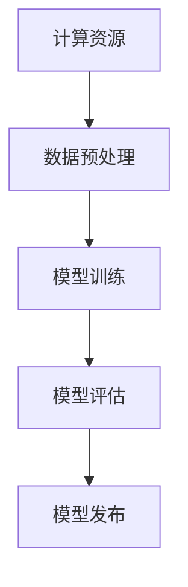

#### 4.4 系统接口设计

系统接口设计包括：API接口、Web界面等。以下是系统接口的Markdown格式Mermaid序列图：

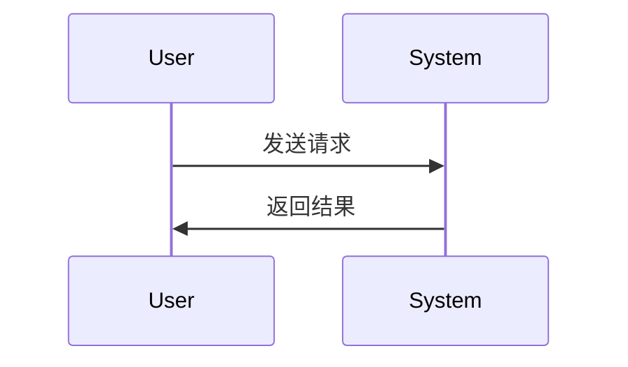

#### 4.5 系统交互

系统交互包括：数据流、控制流等。以下是系统交互的Markdown格式Mermaid图：

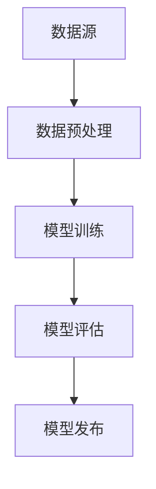

## 第二部分：敏捷发布管理实践

### 第5章：大模型训练与发布流程

#### 5.1 大模型训练流程

大模型训练流程包括：数据收集、数据预处理、模型训练、模型评估等。以下是训练流程的Markdown格式Mermaid图：

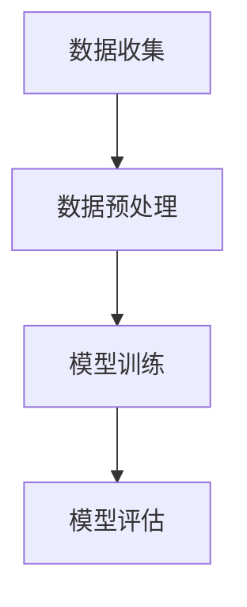

#### 5.2 大模型发布流程

大模型发布流程包括：模型打包、模型发布、模型监控等。以下是发布流程的Markdown格式Mermaid图：

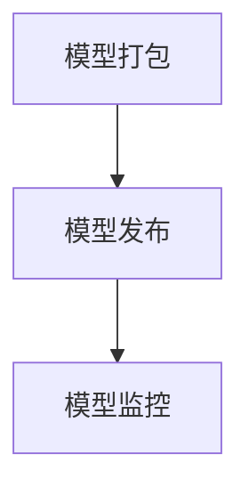

#### 5.3 实践案例

以下是一个基于TensorFlow的大模型训练与发布实践案例：

```python
# 导入相关库
import tensorflow as tf
import pandas as pd

# 数据收集
data = pd.read_csv('data.csv')

# 数据预处理
# ...省略具体代码...

# 模型训练
model = tf.keras.models.Sequential([
  # ...省略具体代码...
])

# 模型评估
model.evaluate(x_test, y_test)

# 模型发布
# ...省略具体代码...
```

### 第6章：大模型发布的管理与优化

#### 6.1 管理策略

大模型发布的管理策略包括：版本控制、发布计划、风险管理等。以下是管理策略的Markdown格式Mermaid图：

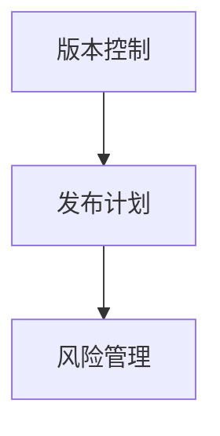

#### 6.2 优化方法

大模型发布的优化方法包括：并行计算、分布式训练、加速发布等。以下是优化方法的Markdown格式Mermaid图：

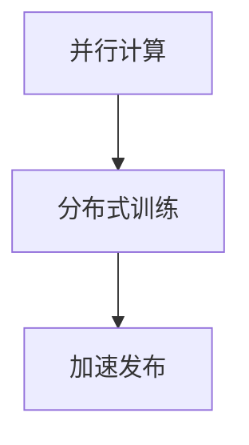

#### 6.3 实践案例

以下是一个基于Docker的大模型发布优化实践案例：

```bash
# 创建Docker镜像
docker build -t model:latest .

# 运行Docker容器
docker run -d -p 8080:80 model:latest
```

### 第7章：敏捷发布管理中的风险管理

#### 7.1 风险识别

敏捷发布管理中的风险识别包括：技术风险、市场风险、法律风险等。以下是风险识别的Markdown格式Mermaid图：

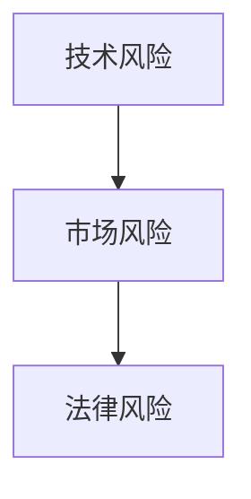

#### 7.2 风险评估

风险评估包括：风险优先级、风险影响等。以下是风险评估的Markdown格式Mermaid图：

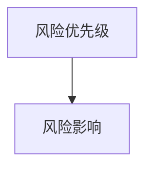

#### 7.3 风险应对

风险应对包括：风险规避、风险减轻等。以下是风险应对的Markdown格式Mermaid图：

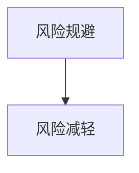

#### 7.4 实践案例

以下是一个基于Jenkins的敏捷发布管理风险控制实践案例：

```bash
# 安装Jenkins
sudo apt-get install jenkins

# 配置Jenkins
# ...省略具体代码...

# 持续集成
# ...省略具体代码...

# 持续交付
# ...省略具体代码...
```

### 第8章：最佳实践与案例分析

#### 8.1 最佳实践

最佳实践包括：版本控制、持续集成、持续交付等。以下是最佳实践的Markdown格式Mermaid图：

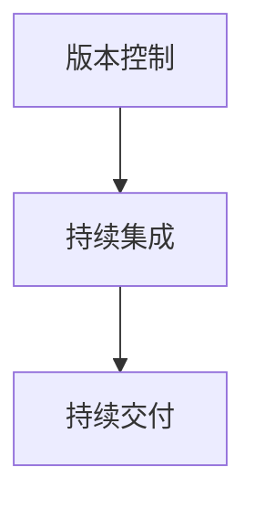

#### 8.2 案例分析

案例分析包括：成功案例、失败案例等。以下是案例分析的Markdown格式Mermaid图：

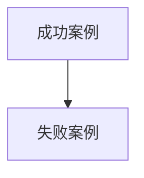

#### 8.3 拓展阅读

拓展阅读包括：相关论文、书籍等。以下是拓展阅读的Markdown格式：

```markdown
## 拓展阅读

- 《大模型训练与发布实践》
- 《敏捷开发实践指南》
- 《风险管理：理论与实践》
```

### 第9章：未来展望与趋势

#### 9.1 未来展望

未来展望包括：AI技术的应用场景、敏捷发布管理的发展趋势等。以下是未来展望的Markdown格式：

```markdown
## 未来展望

- AI技术的应用将更加广泛，大模型的需求将不断增加。
- 敏捷发布管理将向着更高效、更智能、更自动化的方向发展。
```

#### 9.2 趋势分析

趋势分析包括：云计算、边缘计算、大数据等。以下是趋势分析的Markdown格式：

```markdown
## 趋势分析

- 云计算将继续推动敏捷发布管理的创新发展。
- 边缘计算将使敏捷发布管理在实时性、可靠性等方面得到提升。
- 大数据的融合将为敏捷发布管理提供更丰富的数据支持和决策依据。
```

#### 9.3 拓展领域

拓展领域包括：自动驾驶、智能制造、金融科技等。以下是拓展领域的Markdown格式：

```markdown
## 拓展领域

- 自动驾驶：敏捷发布管理在自动驾驶系统的实时性、安全性等方面具有重要意义。
- 智能制造：敏捷发布管理将助力智能制造实现更高效、更灵活的生产过程。
- 金融科技：敏捷发布管理在金融科技领域的风险管理、合规性等方面具有重要作用。
```

### 第10章：小结与总结

#### 10.1 小结

本文从背景介绍、核心概念、系统架构设计、实践案例、最佳实践和未来展望等方面，系统地探讨了大模型应用的敏捷发布管理。通过本文的学习，读者可以深入了解敏捷发布管理的核心要素和实践方法。

#### 10.2 注意事项

在实际应用中，读者需要根据具体场景和需求，灵活调整和优化敏捷发布管理的策略和方法。

#### 10.3 拓展思考

未来，随着AI技术的不断发展，敏捷发布管理将在更多领域发挥重要作用。读者可以进一步研究相关技术和方法，为AI技术的发展贡献力量。

## 作者

作者：AI天才研究院/AI Genius Institute & 禅与计算机程序设计艺术 /Zen And The Art of Computer Programming

在本文中，我们深入探讨了大模型应用的敏捷发布管理。通过系统的分析、详尽的案例和实践，我们为读者呈现了一个全面、实用的敏捷发布管理解决方案。随着AI技术的不断进步，敏捷发布管理将在各个领域发挥越来越重要的作用。希望本文能够为读者在实践过程中提供有益的启示和指导。

