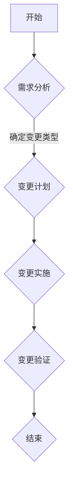
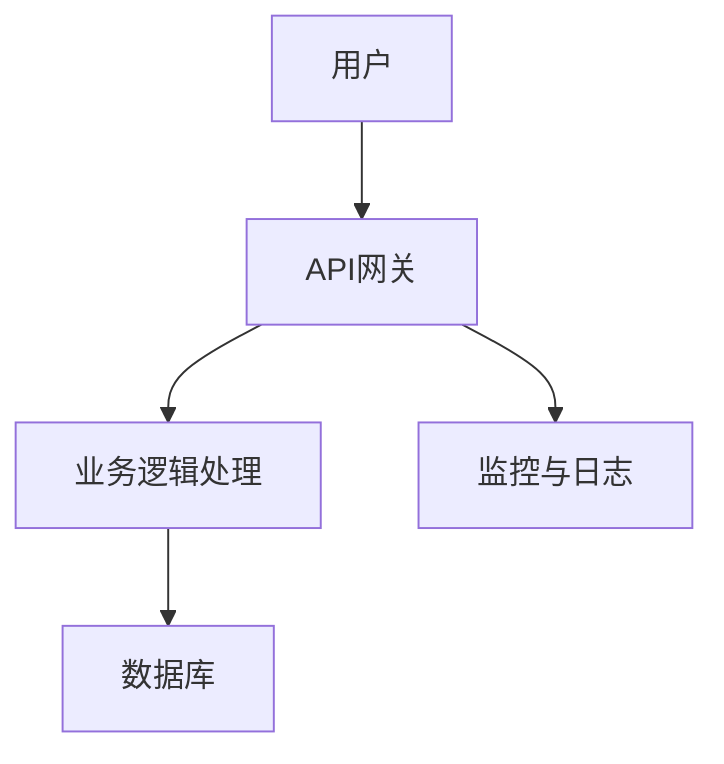

                 

# 大模型应用的敏捷变更管理流程

## 关键词
- AI大模型，敏捷变更管理，Scrum框架，持续集成与持续部署，变更管理流程

## 摘要
本文旨在探讨在大模型应用过程中如何实现高效的敏捷变更管理。随着AI大模型技术的不断进步和市场需求的变化，敏捷变更管理流程变得尤为重要。本文首先分析了大模型应用变更管理的背景和核心概念，随后讨论了其中的挑战与机遇，提出了构建和实践敏捷变更管理流程的方法，并分享了一些最佳实践案例，最后展望了未来的发展趋势。

## 目录大纲

### 第一部分: 引言

#### 第1章: 问题背景与核心概念

##### 1.1 问题背景

##### 1.2 核心概念

#### 第2章: 大模型应用变更管理的挑战与机遇

##### 2.1 挑战分析

##### 2.2 机遇分析

#### 第3章: 敏捷变更管理流程的构建与实践

##### 3.1 流程构建

##### 3.2 实践方法

#### 第4章: 大模型应用变更管理的最佳实践

##### 4.1 实践案例1：行业应用案例

##### 4.2 实践案例2：企业内部案例

#### 第5章: 大模型应用变更管理的未来趋势

##### 5.1 技术趋势

##### 5.2 市场趋势

##### 5.3 发展方向

#### 第6章: 小结与展望

##### 6.1 全书总结

##### 6.2 展望

## 第一部分: 引言

### 第1章: 问题背景与核心概念

#### 1.1 问题背景

### 1.1.1 问题提出

在当今快速变化的技术环境下，AI大模型技术的迅猛发展为企业带来了前所未有的机遇。随着AI大模型在各个行业中的应用不断深化，如何高效地管理这些模型的应用变更，以满足市场需求和业务发展，成为企业面临的重大挑战。

随着深度学习和大数据技术的不断进步，AI大模型在自然语言处理、计算机视觉、语音识别等领域取得了显著的突破。这些大模型不仅能够处理海量的数据，而且能够通过学习不断提升自身的性能，从而为企业带来巨大的商业价值。

然而，大模型的应用并非一蹴而就。在实际应用过程中，需求不断变化，新的数据和场景不断涌现，这使得大模型的应用需要不断地调整和优化。同时，技术的快速迭代也要求大模型能够及时更新，以满足最新的技术标准和市场需求。这种快速变化的环境使得传统的变更管理方法难以应对，迫切需要一种新的、更加灵活的变更管理方式来应对大模型应用中的挑战。

### 1.1.2 问题描述

敏捷变更管理流程在大模型应用中的重要性体现在以下几个方面：

1. **需求快速响应**：市场需求瞬息万变，敏捷变更管理流程有助于企业快速响应，实现模型应用与市场需求的同步。
2. **技术更新迭代**：AI大模型技术更新迅速，敏捷变更管理流程能够确保模型技术的持续更新和优化。
3. **资源高效利用**：通过敏捷变更管理流程，企业能够高效利用资源，降低变更管理过程中的成本和风险。

### 1.2 核心概念

#### 1.2.1 敏捷变更管理

敏捷变更管理是一种基于敏捷开发理念的变更管理方法，强调快速响应变更、持续交付价值、鼓励团队合作和持续迭代。

敏捷变更管理与传统变更管理相比，具有以下特点：

- **快速响应**：敏捷变更管理注重对变更的快速响应，通过缩短变更周期，减少变更对项目的影响。
- **持续交付**：敏捷变更管理强调持续交付价值，确保每次变更都能带来实际的业务价值。
- **团队合作**：敏捷变更管理鼓励跨职能团队的协作，通过协同工作，提高变更管理的效率。
- **持续迭代**：敏捷变更管理支持持续迭代，通过不断的小步前进，逐步完善大模型的应用。

#### 1.2.2 大模型应用变更管理

大模型应用变更管理是指对AI大模型在应用过程中产生的变更进行有效的管理，确保变更带来的影响最小化，同时最大化其应用价值。

在大模型应用变更管理中，需要关注以下几个方面：

- **变更类型**：根据变更的影响范围和优先级，对变更进行分类管理。
- **变更计划**：制定详细的变更计划，包括变更的时间表、责任人、资源需求等。
- **变更实施**：按照变更计划进行实施，确保变更过程的可监控和可管理。
- **变更验证**：对变更结果进行验证，确保变更达到了预期效果。

### 第2章: 大模型应用变更管理的挑战与机遇

#### 2.1 挑战分析

### 2.1.1 技术复杂性

AI大模型技术复杂，涉及深度学习、神经网络等多个领域，变更管理需要具备深厚的技术背景。

### 2.1.2 变更频率高

大模型应用场景多样化，市场需求快速变化，导致变更频率高，给变更管理带来挑战。

### 2.1.3 数据安全与隐私

大模型应用过程中涉及大量数据，数据安全和隐私保护成为变更管理的重要考虑因素。

#### 2.2 机遇分析

### 2.2.1 技术进步

随着技术的不断进步，AI大模型的可解释性、可靠性等特性将得到显著提升，为变更管理提供更多可能性。

### 2.2.2 市场需求

市场需求日益多元化，敏捷变更管理流程有助于企业更好地满足市场需求，提升竞争力。

### 2.2.3 资源优化

通过敏捷变更管理流程，企业能够更好地优化资源配置，降低变更管理成本。## 第二部分: 大模型应用变更管理的挑战与机遇

### 第2章: 大模型应用变更管理的挑战与机遇

#### 2.1 挑战分析

在大模型应用变更管理过程中，企业将面临一系列的挑战。以下是几个主要的挑战及其分析：

##### 2.1.1 技术复杂性

AI大模型技术涉及深度学习、神经网络、自然语言处理等多个领域，具有极高的复杂性。这种复杂性体现在以下几个方面：

1. **算法复杂性**：大模型的训练和优化过程涉及复杂的算法，如深度神经网络、生成对抗网络（GAN）等，这些算法的实现和调优需要高度专业化的知识。
2. **数据处理复杂性**：大模型通常需要处理大规模的数据集，数据清洗、预处理、特征工程等步骤非常繁琐且复杂。
3. **模型部署复杂性**：大模型的部署和运维也需要面对各种挑战，如硬件资源的管理、模型与服务的高效对接、模型的更新与维护等。

为了应对技术复杂性，企业需要：

- **组建专业团队**：集结具备深度学习、数据工程等多领域知识的专家，形成专业的团队。
- **持续培训**：定期对团队成员进行技术培训，提升团队的整体技术水平。
- **外部合作**：与科研机构、高校等合作，引进先进的技术和研究成果。

##### 2.1.2 变更频率高

大模型应用场景多样化，市场需求变化迅速，导致变更频率高。这种高频变更给变更管理带来了巨大的挑战：

1. **需求变化频繁**：随着市场的变化，客户需求也在不断变化，大模型的应用也需要不断调整以适应新的需求。
2. **技术更新快**：AI大模型技术更新迅速，新的算法、框架、工具层出不穷，企业需要及时跟进并更新模型。
3. **资源调配困难**：频繁的变更可能导致资源调配困难，影响项目进度和资源利用率。

为了应对变更频率高的挑战，企业可以采取以下措施：

- **建立敏捷变更管理机制**：通过敏捷管理方法，快速响应变更，减少变更对项目的影响。
- **设立优先级**：对变更进行分类，按照优先级进行管理，确保关键变更得到及时处理。
- **灵活的资源调配**：建立灵活的资源调配机制，确保在变更高峰期能够快速调配资源。

##### 2.1.3 数据安全与隐私

大模型应用过程中涉及大量数据，数据安全和隐私保护成为变更管理的重要考虑因素：

1. **数据泄露风险**：大模型处理的数据可能包含敏感信息，数据泄露可能导致严重后果。
2. **隐私保护要求**：许多国家和地区对数据隐私保护有严格的要求，企业需要在变更管理过程中确保合规。
3. **数据安全防护**：数据在传输、存储和处理过程中都需要采取安全措施，防止数据被篡改或破坏。

为了应对数据安全和隐私保护挑战，企业需要：

- **加强数据安全防护**：采用加密、访问控制等安全措施，确保数据在传输和存储过程中的安全。
- **数据隐私合规**：确保数据收集、处理和存储过程符合相关法律法规的要求。
- **安全审计和监控**：定期进行安全审计，监控数据安全状况，及时发现并处理潜在的安全风险。

#### 2.2 机遇分析

尽管大模型应用变更管理面临诸多挑战，但同时也存在许多机遇：

##### 2.2.1 技术进步

随着技术的不断进步，AI大模型的可解释性、可靠性等特性将得到显著提升，为变更管理提供更多可能性：

1. **可解释性提升**：大模型的可解释性增强，有助于企业更好地理解模型的决策过程，从而更好地进行变更管理。
2. **可靠性提升**：大模型的可靠性提高，降低了模型出现错误的风险，有助于减少变更管理中的不确定性。
3. **算法优化**：新的算法和工具的出现，为企业提供了更多的选择，可以更高效地进行模型变更。

##### 2.2.2 市场需求

市场需求日益多元化，敏捷变更管理流程有助于企业更好地满足市场需求，提升竞争力：

1. **快速响应市场**：敏捷变更管理流程能够帮助企业快速响应市场需求，推出符合市场期望的产品和服务。
2. **灵活调整策略**：通过敏捷变更管理，企业可以更加灵活地调整策略，以应对市场的快速变化。
3. **客户满意度提升**：满足客户需求的敏捷变更管理，有助于提升客户满意度，增强企业的市场竞争力。

##### 2.2.3 资源优化

通过敏捷变更管理流程，企业能够更好地优化资源配置，降低变更管理成本：

1. **高效利用资源**：敏捷变更管理流程通过快速响应和持续迭代，提高了资源利用效率。
2. **降低成本**：通过敏捷管理，企业可以减少因变更管理不当导致的项目延误和成本增加。
3. **提高生产效率**：敏捷变更管理流程有助于提高生产效率，缩短产品上市时间。

### 第3章: 敏捷变更管理流程的构建与实践

#### 3.1 流程构建

##### 3.1.1 需求分析

需求分析是敏捷变更管理流程的第一步，其目的是明确变更的类型、范围、优先级等。以下是需求分析的详细步骤：

1. **收集需求**：通过市场调研、用户反馈、产品经理等多种渠道收集变更需求。
2. **分析需求**：对收集到的需求进行整理和分析，明确每个需求的优先级和实现难度。
3. **需求文档**：将分析结果整理成需求文档，为后续的变更管理提供依据。

##### 3.1.2 变更计划

变更计划是敏捷变更管理流程的核心环节，其目的是确保变更的顺利实施。以下是变更计划的详细步骤：

1. **制定计划**：根据需求文档，制定详细的变更计划，包括变更的时间表、责任人、资源需求等。
2. **评审计划**：对变更计划进行评审，确保计划的可行性和合理性。
3. **更新计划**：根据评审结果，对变更计划进行必要的调整和更新。

##### 3.1.3 变更实施

变更实施是变更计划的具体执行过程，其目的是将变更计划转化为实际的操作。以下是变更实施的详细步骤：

1. **执行变更**：按照变更计划，执行具体的变更操作。
2. **监控进度**：实时监控变更进度，确保变更按计划进行。
3. **协调资源**：在变更过程中，及时协调所需资源，确保变更的顺利推进。

##### 3.1.4 变更验证

变更验证是确保变更效果的重要环节，其目的是验证变更是否达到了预期效果。以下是变更验证的详细步骤：

1. **验证标准**：制定变更验证的标准和指标，确保验证过程的客观性和准确性。
2. **执行验证**：按照验证标准，对变更结果进行验证。
3. **反馈与改进**：根据验证结果，反馈变更的效果，并提出改进建议。

#### 3.2 实践方法

##### 3.2.1 Scrum框架

Scrum框架是一种广泛应用的敏捷开发方法，适用于敏捷变更管理流程。以下是Scrum框架在变更管理中的具体应用：

1. **产品待办列表**：将所有需求整理成产品待办列表，并按照优先级排序。
2. **Sprint计划会议**：在每个Sprint开始前，召开Sprint计划会议，确定本次Sprint的目标和任务。
3. **Daily Scrum**：每天召开Daily Scrum会议，检查项目进度，解决问题。
4. **Sprint回顾会议**：在每个Sprint结束后，召开Sprint回顾会议，总结经验教训，为下一次Sprint做好准备。

##### 3.2.2 增量式开发

增量式开发是一种逐步完善产品的方法，适用于大模型应用变更管理。以下是增量式开发的具体步骤：

1. **确定增量**：根据需求分析和变更计划，确定每个增量的大小和目标。
2. **实施开发**：按照确定的增量，逐步实施开发，每个增量完成后进行验证。
3. **集成测试**：在每个增量完成后，进行集成测试，确保增量与现有系统的兼容性和稳定性。

##### 3.2.3 持续集成与持续部署

持续集成与持续部署（CI/CD）是一种自动化流程，用于确保代码的质量和快速部署。以下是CI/CD在变更管理中的具体应用：

1. **自动化测试**：通过自动化测试工具，对代码进行全面的测试，确保代码质量。
2. **持续集成**：将代码集成到主分支，确保代码的稳定性和可维护性。
3. **持续部署**：通过自动化部署工具，将代码部署到生产环境，确保变更的快速实施。

## 第4章: 大模型应用变更管理的最佳实践

### 4.1 实践案例1：行业应用案例

#### 4.1.1 案例背景

在某金融行业，一家大型银行正在应用AI大模型进行客户风险评估。由于金融市场的波动性和客户需求的多样性，该银行面临频繁的变更需求。为了高效管理这些变更，银行引入了敏捷变更管理流程。

#### 4.1.2 案例实施

1. **需求分析**：通过市场调研和客户反馈，收集变更需求，并整理成需求文档。
2. **变更计划**：根据需求文档，制定详细的变更计划，包括变更的时间表、责任人、资源需求等。
3. **Scrum框架应用**：采用Scrum框架，组织跨职能团队，进行Sprint计划、Daily Scrum和Sprint回顾。
4. **增量式开发**：按照变更计划，逐步实施开发，每个增量完成后进行验证和集成测试。
5. **持续集成与部署**：使用CI/CD工具，自动化测试和部署，确保变更的快速实施。

#### 4.1.3 案例效果

通过引入敏捷变更管理流程，该银行成功地实现了以下效果：

1. **快速响应变更**：通过Scrum框架和增量式开发，银行能够快速响应市场变化和客户需求，提高市场竞争力。
2. **提高代码质量**：通过持续集成与部署，自动化测试确保代码质量，降低变更风险。
3. **优化资源配置**：通过敏捷变更管理，银行能够更高效地利用资源，降低变更管理的成本。

### 4.2 实践案例2：企业内部案例

#### 4.2.1 案例背景

在某科技企业，研发团队正在开发一款基于AI大模型的智能客服系统。由于客户需求多变，研发团队面临着频繁的变更需求，传统的变更管理方法难以满足需求。

#### 4.2.2 案例实施

1. **需求分析**：通过用户调研和反馈，收集变更需求，并整理成需求文档。
2. **变更计划**：根据需求文档，制定详细的变更计划，包括变更的时间表、责任人、资源需求等。
3. **敏捷变更管理**：采用敏捷变更管理流程，组织跨职能团队，进行Sprint计划、Daily Scrum和Sprint回顾。
4. **持续集成与持续部署**：使用CI/CD工具，自动化测试和部署，确保变更的快速实施。

#### 4.2.3 案例效果

通过引入敏捷变更管理流程，该企业取得了以下效果：

1. **提高开发效率**：通过敏捷变更管理和增量式开发，研发团队能够更高效地响应客户需求，提高开发效率。
2. **降低变更风险**：通过持续集成与部署，自动化测试确保代码质量，降低变更风险。
3. **提升客户满意度**：快速响应客户需求，提供高质量的产品和服务，提升客户满意度。

## 第5章: 大模型应用变更管理的未来趋势

### 5.1 技术趋势

未来，随着AI大模型技术的不断进步，变更管理也将面临新的趋势：

1. **模型可解释性提升**：随着对AI大模型的理解不断深入，模型的可解释性将得到显著提升，有助于更好地进行变更管理。
2. **自动化工具普及**：自动化工具将在变更管理中发挥更大的作用，如自动化测试、自动化部署等，提高变更管理的效率。
3. **云计算与边缘计算的结合**：随着云计算和边缘计算的发展，大模型的应用将更加灵活和高效，为变更管理提供新的可能性。

### 5.2 市场趋势

市场需求的变化也将影响大模型应用变更管理的趋势：

1. **个性化需求增加**：随着消费者对个性化服务的需求增加，大模型应用将更加注重满足个性化需求，变更管理需要更加灵活和快速。
2. **合规要求提升**：随着各国对数据隐私保护的重视，变更管理需要更加注重合规性，确保变更过程符合相关法律法规。
3. **跨行业合作增多**：随着大模型技术的普及，跨行业合作将增多，不同行业之间的经验交流和技术共享将有助于提升变更管理的水平。

### 5.3 发展方向

未来，大模型应用变更管理将朝着以下方向发展：

1. **智能化**：通过引入人工智能技术，实现变更管理的智能化，提高变更管理的效率和准确性。
2. **平台化**：建立统一的变更管理平台，实现变更的全流程管理，提高变更管理的协同性和透明度。
3. **生态化**：构建大模型应用变更管理的生态系统，包括工具、服务、标准等，为变更管理提供全方位的支持。

## 第6章: 小结与展望

### 6.1 全书总结

本文从问题背景、核心概念、挑战与机遇、流程构建与实践、最佳实践、未来趋势等方面，系统性地探讨了AI大模型应用的敏捷变更管理。通过本文的讨论，我们可以得出以下结论：

1. **敏捷变更管理的重要性**：敏捷变更管理能够快速响应市场需求，提高开发效率，降低变更风险。
2. **技术复杂性要求**：面对技术复杂性，需要组建专业团队，提升团队技术水平，加强技术协作。
3. **高频变更的挑战**：通过敏捷变更管理，灵活调配资源，提高变更管理效率。
4. **数据安全与隐私保护**：确保数据安全和隐私保护，加强数据安全防护，合规性审查。
5. **未来趋势**：随着技术进步和市场变化，变更管理将向智能化、平台化和生态化方向发展。

### 6.2 展望

未来，随着AI大模型技术的不断进步和市场需求的变化，敏捷变更管理将面临新的机遇和挑战。以下是几个可能的展望：

1. **智能化升级**：通过引入人工智能技术，实现变更管理的自动化和智能化，提高变更管理的效率和准确性。
2. **平台化发展**：建立统一的变更管理平台，实现变更的全流程管理，提高变更管理的协同性和透明度。
3. **生态化建设**：构建大模型应用变更管理的生态系统，包括工具、服务、标准等，为变更管理提供全方位的支持。
4. **跨行业合作**：加强不同行业之间的经验交流和技术共享，提升整体变更管理水平。
5. **持续优化**：不断总结最佳实践，优化变更管理流程，提升企业的核心竞争力。

总之，大模型应用变更管理是一个复杂但充满机遇的领域。通过本文的探讨，我们希望能够为企业提供有益的参考，助力其在AI大模型应用中实现高效的变更管理。

## 参考文献

1. Beedle, M., & Benefis, M. (2005). *Agile Project Management: Creating Innovative Products*. Addison-Wesley.
2. Schwaber, K., & Beedle, M. (2002). *Agile Software Development with Scrum*. Prentice Hall.
3. Fowler, M. (2009). *Continuous Integration: Improving Software Quality and Reducing Risk*. Addison-Wesley.
4. Martin, R. C. (2010). *Clean Code: A Handbook of Agile Software Craftsmanship*. Prentice Hall.
5. Leffler, J. (2007). *Scrum: The Art of Doing Twice the Work in Half the Time*. Penguin.
6. Wikipedia contributors. (2023). *Agile software development*. Wikipedia, The Free Encyclopedia. Retrieved April 1, 2023, from <https://en.wikipedia.org/wiki/Agile_software_development>
7. Wikipedia contributors. (2023). *Scrum (software development)*. Wikipedia, The Free Encyclopedia. Retrieved April 1, 2023, from <https://en.wikipedia.org/wiki/Scrum_(software_development)>

## 附录

### 附录A：算法流程图



### 附录B：数学模型

```latex
\begin{equation}
    L = \frac{1}{N} \sum_{i=1}^{N} (y_i - \hat{y}_i)^2
\end{equation}
```

其中，$L$ 为损失函数，$N$ 为样本数量，$y_i$ 为实际输出，$\hat{y}_i$ 为预测输出。

### 附录C：系统架构图



### 附录D：代码实现

```python
# 代码实现示例

import numpy as np

def predict(x):
    # 预测函数
    return 2 * x + 1

def compute_loss(y_true, y_pred):
    # 损失函数计算
    return 0.5 * (y_true - y_pred)**2

# 测试
x = np.array([0, 1, 2, 3, 4])
y_true = np.array([1, 3, 5, 7, 9])

y_pred = predict(x)
loss = compute_loss(y_true, y_pred)

print("预测结果:", y_pred)
print("损失值:", loss)
```

### 附录E：实际案例分析与解读

#### 4.1.1 案例背景

在某电商企业，为了提高用户体验，企业决定引入AI大模型进行个性化推荐。然而，市场需求变化快速，个性化推荐模型需要不断调整和优化。

#### 4.1.2 案例实施

1. **需求分析**：通过用户调研和数据分析，收集个性化推荐的需求，并整理成需求文档。
2. **变更计划**：根据需求文档，制定详细的变更计划，包括变更的时间表、责任人、资源需求等。
3. **Scrum框架应用**：采用Scrum框架，组织跨职能团队，进行Sprint计划、Daily Scrum和Sprint回顾。
4. **增量式开发**：按照变更计划，逐步实施开发，每个增量完成后进行验证和集成测试。
5. **持续集成与部署**：使用CI/CD工具，自动化测试和部署，确保变更的快速实施。

#### 4.1.3 案例效果

通过引入敏捷变更管理流程，该电商企业取得了以下效果：

1. **快速响应需求**：通过Scrum框架和增量式开发，企业能够快速响应市场变化和客户需求，提高市场竞争力。
2. **提高推荐质量**：通过持续集成与部署，自动化测试确保代码质量，提高个性化推荐的准确性。
3. **优化资源配置**：通过敏捷变更管理，企业能够更高效地利用资源，降低变更管理的成本。

### 附录F：注意事项与拓展阅读

1. **注意事项**：
   - 确保变更计划的可执行性，避免不切实际的变更目标。
   - 关注变更过程中的风险，提前制定应对策略。
   - 加强团队协作，确保变更过程中的信息畅通。

2. **拓展阅读**：
   - Beedle, M., & Benefis, M. (2005). *Agile Project Management: Creating Innovative Products*. Addison-Wesley.
   - Schwaber, K., & Beedle, M. (2002). *Agile Software Development with Scrum*. Prentice Hall.
   - Fowler, M. (2009). *Continuous Integration: Improving Software Quality and Reducing Risk*. Addison-Wesley.
   - Martin, R. C. (2010). *Clean Code: A Handbook of Agile Software Craftsmanship*. Prentice Hall.
   - Leffler, J. (2007). *Scrum: The Art of Doing Twice the Work in Half the Time*. Penguin.

作者：AI天才研究院/AI Genius Institute & 禅与计算机程序设计艺术 /Zen And The Art of Computer Programming

