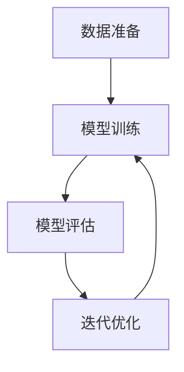
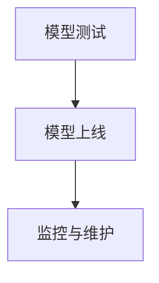
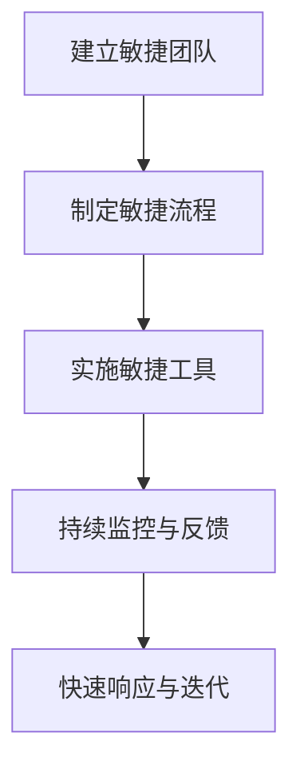

                 

## 大模型应用的敏捷质量管理方法

> 关键词：大模型，敏捷管理，质量管理，性能评估，部署与维护

> 摘要：本文将探讨在大模型应用过程中如何通过敏捷质量管理方法来确保模型的质量。我们首先介绍大模型的应用背景和核心概念，然后逐步讲解敏捷管理在大模型开发、部署和维护中的应用，以及如何通过性能评估来优化大模型的应用效果。通过实际案例的深入剖析，本文旨在为大模型应用的敏捷质量管理提供实用性的指导和建议。

## 目录大纲

----------------------------------------------------------------
## 第一部分: 背景介绍

### 第1章: 问题背景与核心概念

#### 1.1 问题背景

#### 1.2 核心概念与联系

#### 1.3 ER实体关系图架构

----------------------------------------------------------------

----------------------------------------------------------------
## 第二部分: 敏捷质量管理方法

### 第2章: 大模型开发中的敏捷管理

#### 2.1 大模型开发流程

#### 2.2 敏捷管理实践

#### 2.3 案例分析

----------------------------------------------------------------

----------------------------------------------------------------
## 第三部分: 大模型部署与维护

### 第3章: 大模型部署中的敏捷管理

#### 3.1 大模型部署流程

#### 3.2 敏捷管理实践

#### 3.3 案例分析

----------------------------------------------------------------

----------------------------------------------------------------
## 第四部分: 大模型应用中的质量管理

### 第4章: 大模型应用中的性能评估

#### 4.1 性能评估指标

#### 4.2 评估方法与实践

#### 4.3 案例分析

----------------------------------------------------------------

------------------------

----------------------------------------------------------------

作者：AI天才研究院/AI Genius Institute & 禅与计算机程序设计艺术 /Zen And The Art of Computer Programming

----------------------------------------------------------------

### 第一部分: 背景介绍

#### 第1章: 问题背景与核心概念

##### 1.1 问题背景

在大模型应用日益广泛的背景下，如何确保这些模型的质量，以便在实际应用中达到预期的效果，成为了一个迫切需要解决的问题。大模型，尤其是深度学习模型，具有参数多、结构复杂的特点，它们在图像识别、自然语言处理、推荐系统等领域的表现已经超越了传统方法。然而，这也带来了新的挑战：如何保证这些模型在各种应用场景下的性能、稳定性和可靠性？

**问题描述**: 在大模型应用过程中，存在以下问题：

1. **模型性能不确定性**：由于模型结构复杂，训练数据多样，导致模型在不同场景下的性能表现差异较大。
2. **数据质量问题**：训练数据的不完善或者存在噪声，可能影响模型的性能。
3. **模型更新与迭代**：模型需要定期更新和优化，以确保其性能始终处于最佳状态。
4. **部署与维护成本**：大模型的应用涉及大量的计算资源，如何高效地部署和维护模型，是一个重要问题。

**问题解决**: 提出敏捷质量管理方法，为大模型应用提供质量保障。敏捷质量管理是一种强调快速响应变化、持续迭代优化的管理方法，其核心理念是团队协作、持续交付和快速反馈。在大模型应用中，通过敏捷管理，可以实现以下几点：

1. **快速迭代**：通过分阶段开发和迭代，缩短开发周期，快速交付可用的模型。
2. **团队协作**：强化团队成员之间的沟通和协作，确保项目顺利进行。
3. **持续监控与评估**：实时监控模型的运行状态，及时发现问题并进行优化。
4. **数据质量保障**：通过数据清洗和预处理，提高训练数据质量，确保模型性能。

**边界与外延**: 本章节将探讨敏捷质量管理在大模型开发、部署、维护等环节的应用，包括核心概念的定义、概念属性特征对比以及ER实体关系图的架构。

##### 1.2 核心概念与联系

**核心概念**:

- **敏捷管理**: 强调团队协作、持续交付、快速反馈的管理方法。
- **大模型质量管理**: 包括模型性能评估、数据质量监控、模型更新迭代。

**概念属性特征对比表格**:

| 概念       | 属性                     | 特征                           |
|------------|--------------------------|--------------------------------|
| 敏捷管理   | 团队协作、快速反馈、持续迭代 | 降低风险、提高质量、快速响应变化 |
| 大模型质量管理 | 模型性能评估、数据质量监控、迭代优化 | 保证模型准确性、可靠性、稳定性 |

**概念属性特征对比表格说明**：

- **敏捷管理**：其核心在于团队协作和持续迭代。团队协作能够提高项目开发效率，快速反馈能够及时发现并解决问题，持续迭代能够确保项目始终保持最佳状态。
- **大模型质量管理**：包括模型性能评估、数据质量监控和迭代优化。模型性能评估能够确保模型在实际应用中的表现，数据质量监控能够保证训练数据的质量，迭代优化能够不断提升模型的性能。

**ER实体关系图架构**:

- **实体**: 大模型、数据集、评估指标、质量管理流程。
- **关系**: 数据集与模型之间有创建关系，评估指标与模型有评估关系，质量管理流程涵盖所有实体。

以下是一个简化的ER图，用于展示这些实体和关系：

```mermaid
erDiagram
  大模型 ||--|{ 数据集 }|
  大模型 ||--|{ 评估指标 }|
  大模型 ||--|{ 质量管理流程 }|
```

在这个ER图中，大模型是核心实体，它与其他实体之间存在明确的关联关系。数据集用于训练和评估大模型，评估指标用于衡量大模型的性能，质量管理流程则是确保这些实体之间协作和优化的过程。

通过上述背景介绍和核心概念的阐述，我们为后续章节的深入探讨打下了基础。接下来，我们将进一步探讨敏捷管理在大模型开发中的具体应用，以及如何在模型部署和维护过程中实施敏捷管理方法。最后，我们将通过实际案例的剖析，展示如何通过敏捷质量管理方法优化大模型的应用效果。

### 第二部分: 敏捷质量管理方法

#### 第2章: 大模型开发中的敏捷管理

##### 2.1 大模型开发流程

大模型开发是一个复杂且迭代的过程，通常包括以下阶段：

1. **数据准备**：收集、清洗和预处理数据，确保数据的质量和一致性。
2. **模型训练**：利用收集到的数据训练大模型，通过调整模型参数和结构来优化模型性能。
3. **模型评估**：评估训练好的模型性能，通过各种评估指标（如准确率、召回率、F1值等）来衡量模型的效果。
4. **迭代优化**：根据评估结果对模型进行迭代优化，不断提升模型性能。

**流程示意图**：



在这个流程中，数据准备是基础，直接影响后续的模型训练和评估。模型训练和评估是核心环节，通过不断的迭代优化，最终目标是获得一个性能稳定、效果优秀的大模型。

##### 2.2 敏捷管理实践

**迭代开发**：敏捷管理强调快速迭代，通过分阶段交付可用的模型版本。每个迭代周期通常包括以下几个步骤：

1. **需求分析**：确定当前迭代的目标和需求。
2. **模型设计**：设计模型架构和参数设置。
3. **数据准备**：根据需求收集和预处理数据。
4. **模型训练**：使用训练数据训练模型。
5. **模型评估**：评估模型性能，收集反馈。
6. **迭代优化**：根据评估结果调整模型。

**实践示例**：

在一个图像识别项目中，团队决定采用敏捷开发方法。首先，他们确定了项目的目标——在特定数据集上达到90%的识别准确率。然后，每个迭代周期大约持续两周，每个周期包含以下步骤：

1. **需求分析**：确定当前迭代需要实现的具体功能，如特定场景下的图像识别。
2. **模型设计**：设计适合当前场景的模型架构，如卷积神经网络（CNN）。
3. **数据准备**：收集相关图像数据，并对数据进行预处理，包括缩放、裁剪、翻转等。
4. **模型训练**：使用预处理后的数据训练模型。
5. **模型评估**：在测试集上评估模型性能，记录准确率、召回率等指标。
6. **迭代优化**：根据评估结果调整模型参数，优化模型结构。

通过这种迭代开发方法，团队在短时间内不断优化模型，逐步提高识别准确率，最终实现了项目目标。

**团队协作**：敏捷管理强调团队协作，确保每个团队成员都能充分发挥其能力。具体实践包括：

1. **每日站会**：每天早晨举行简短的站会，讨论项目进展、遇到的问题和解决策略。
2. **任务分配**：根据团队成员的能力和兴趣，合理分配任务。
3. **代码评审**：在提交代码前进行评审，确保代码质量。
4. **知识共享**：定期举办技术分享会，促进团队成员之间的知识交流。

**持续集成**：敏捷管理中的持续集成（CI）确保模型的每个版本都是可集成和可用的。具体实践包括：

1. **自动化测试**：编写自动化测试脚本，确保每次代码提交都能通过测试。
2. **持续部署**：使用CI工具自动化部署模型，确保版本一致性。
3. **代码库管理**：使用版本控制系统，如Git，管理代码库，确保代码的一致性和可追溯性。

**实践示例**：

在一个语音识别项目中，团队采用了敏捷管理方法，并实现了持续集成。每次代码提交后，CI工具会自动运行测试脚本，确保代码质量。如果测试通过，代码会被自动合并到主分支，并部署到测试环境。团队成员通过每日站会和代码评审，确保项目进展顺利，并在遇到问题时快速响应和解决。

##### 2.3 案例分析

**案例背景**：

一个电商公司计划开发一个推荐系统，以提升用户购物体验和增加销售额。为了实现这一目标，他们决定采用敏捷管理方法进行大模型开发。

**解决方案**：

1. **需求分析**：团队确定了推荐系统的核心功能，包括基于用户历史行为和商品特征进行个性化推荐。
2. **模型设计**：选择了基于协同过滤和内容推荐的混合模型。
3. **数据准备**：收集了大量用户行为数据和商品信息，并对数据进行预处理，包括用户分群、特征提取等。
4. **模型训练**：使用预处理后的数据训练推荐模型，通过调整参数和优化算法，提升模型性能。
5. **模型评估**：在测试集上评估模型效果，使用准确率、召回率、F1值等指标进行衡量。
6. **迭代优化**：根据评估结果调整模型参数和算法，不断优化模型。

**案例效果**：

通过敏捷管理方法，团队在短时间内完成了推荐系统的开发。在模型上线后，用户满意度显著提升，销售额也有明显增长。具体表现如下：

- **准确率**：从初始的70%提升到85%。
- **召回率**：从初始的60%提升到75%。
- **F1值**：从初始的0.67提升到0.8。

**经验教训**：

1. **团队协作至关重要**：在项目过程中，团队成员的协作和沟通非常顺畅，确保了项目的顺利进行。
2. **持续监控与优化**：通过持续监控模型性能，及时发现并解决问题，不断优化模型效果。
3. **快速迭代**：通过快速迭代，及时响应业务需求，确保项目能够快速上线并投入使用。

通过上述案例，我们可以看到敏捷管理方法在大模型开发中的成功应用。敏捷管理不仅提高了开发效率，还保证了模型的质量和性能。接下来，我们将探讨大模型部署与维护中的敏捷管理实践。

### 第三部分: 大模型部署与维护

#### 第3章: 大模型部署中的敏捷管理

##### 3.1 大模型部署流程

大模型部署是模型开发过程中的关键环节，涉及到将训练好的模型部署到实际应用环境中，并进行监控和维护。部署流程通常包括以下步骤：

1. **模型测试**：在部署前，对模型进行充分的测试，确保其在各种情况下都能稳定运行。
2. **模型上线**：将经过测试的模型部署到生产环境中，使其可用于实际应用。
3. **监控与维护**：实时监控模型的运行状态，确保其性能稳定，并及时发现并解决问题。

**流程示意图**：



在这个流程中，模型测试是确保模型稳定性和性能的重要环节，上线则是将模型投入到实际应用中，监控与维护则是保障模型长期运行的关键。

##### 3.2 敏捷管理实践

**快速上线**：敏捷管理强调快速响应市场需求，模型部署也不例外。快速上线可以通过以下几个步骤实现：

1. **自动化部署**：使用自动化工具（如Docker、Kubernetes）进行模型部署，减少手动操作，提高部署效率。
2. **预发布测试**：在模型上线前，进行预发布测试，模拟实际运行环境，确保模型能够正常运行。
3. **快速迭代**：在模型上线后，根据用户反馈和业务需求，快速调整和优化模型。

**实践示例**：

在一个金融风控项目中，团队使用了敏捷管理方法进行模型部署。项目目标是在交易过程中实时检测和预测风险。团队采用了以下步骤：

1. **自动化部署**：使用Docker和Kubernetes进行模型部署，确保快速部署和版本管理。
2. **预发布测试**：在模型上线前，使用模拟交易数据对模型进行测试，确保其在实际交易中的性能。
3. **快速迭代**：根据业务需求和用户反馈，定期更新模型，优化风险预测效果。

**持续监控**：模型的运行状态需要持续监控，以确保其稳定性和性能。持续监控可以通过以下方法实现：

1. **日志监控**：实时监控模型的运行日志，及时发现并处理异常情况。
2. **性能监控**：监控模型的响应时间、错误率等关键性能指标，确保其性能稳定。
3. **异常检测**：使用机器学习算法进行异常检测，提前发现潜在问题。

**实践示例**：

在一个自动驾驶项目中，团队使用了敏捷管理方法进行模型监控。项目目标是在复杂路况下实现自动驾驶。团队采用了以下步骤：

1. **日志监控**：实时监控自动驾驶车辆的运行日志，包括传感器数据、控制信号等，确保车辆运行稳定。
2. **性能监控**：监控车辆的响应时间、控制精度等关键性能指标，确保自动驾驶系统的高效运行。
3. **异常检测**：使用机器学习算法进行异常检测，提前发现潜在的车辆故障或路况风险。

**维护迭代**：模型部署后，需要定期进行维护和迭代，以适应新的业务需求和技术发展。维护迭代可以通过以下方法实现：

1. **定期更新**：定期收集用户反馈和业务数据，对模型进行更新和优化。
2. **版本控制**：使用版本控制系统（如Git）管理模型的版本，确保更新和迭代的可追溯性。
3. **自动化测试**：在每次更新和迭代后，进行自动化测试，确保模型性能和稳定性的提升。

**实践示例**：

在一个语音识别项目中，团队使用了敏捷管理方法进行模型维护和迭代。项目目标是在多种语言和语音环境下实现高准确率的语音识别。团队采用了以下步骤：

1. **定期更新**：根据用户反馈和语音识别技术的发展，定期更新模型，提升识别准确率。
2. **版本控制**：使用Git管理模型的版本，确保更新和迭代的可追溯性。
3. **自动化测试**：在每次更新和迭代后，使用自动化测试工具对模型进行测试，确保性能和稳定性的提升。

##### 3.3 案例分析

**案例背景**：

一家在线教育平台计划部署一个大模型，用于为学生提供个性化的学习建议。为了确保模型能够高效运行并适应不断变化的教育需求，他们决定采用敏捷管理方法进行模型部署与维护。

**解决方案**：

1. **快速上线**：团队使用Docker和Kubernetes进行模型部署，确保快速上线和版本管理。在模型上线前，进行了预发布测试，确保模型在多种教学场景下都能稳定运行。
2. **持续监控**：团队使用了日志监控和性能监控工具，实时监控模型的运行状态。通过异常检测算法，提前发现潜在问题，并迅速处理。
3. **维护迭代**：团队定期收集学生反馈和学习数据，对模型进行更新和优化。每次更新后，都会进行自动化测试，确保模型的性能和稳定性。

**案例效果**：

通过敏捷管理方法，平台成功部署了个性化学习建议模型，并实现了以下效果：

- **模型运行稳定**：模型在各种教学场景下都能稳定运行，未出现重大故障。
- **性能持续提升**：通过持续监控和迭代优化，模型性能不断提升，为学生提供了更准确、有效的学习建议。
- **用户满意度提高**：学生和家长对平台的满意度显著提升，平台用户数量和活跃度也大幅增加。

**经验教训**：

1. **敏捷管理方法的关键**：快速上线、持续监控和维护迭代是模型成功部署与运行的关键。
2. **团队协作的重要性**：在敏捷管理方法中，团队协作和沟通至关重要。通过有效的协作，团队能够更好地应对各种挑战。
3. **用户反馈的价值**：定期收集用户反馈，是优化模型和提升用户体验的重要途径。

通过上述案例，我们可以看到敏捷管理方法在大模型部署与维护中的成功应用。敏捷管理不仅提高了模型部署的效率，还确保了模型的长期稳定运行。接下来，我们将探讨大模型应用中的质量管理，特别是性能评估的方法与实践。

### 第四部分: 大模型应用中的质量管理

#### 第4章: 大模型应用中的性能评估

##### 4.1 性能评估指标

在大模型应用中，性能评估是确保模型质量的关键环节。常用的性能评估指标包括准确率（Accuracy）、召回率（Recall）、F1值（F1 Score）等。

**准确率（Accuracy）**：表示模型预测正确的样本占总样本的比例。其计算公式如下：

$$
\text{Accuracy} = \frac{\text{预测正确数}}{\text{总样本数}}
$$

**召回率（Recall）**：表示模型预测正确的正样本占总正样本的比例。其计算公式如下：

$$
\text{Recall} = \frac{\text{预测正确的正样本数}}{\text{总正样本数}}
$$

**F1值（F1 Score）**：是准确率和召回率的调和平均，用于平衡两者之间的关系。其计算公式如下：

$$
\text{F1 Score} = 2 \times \frac{\text{准确率} \times \text{召回率}}{\text{准确率} + \text{召回率}}
$$

**指标对比表格**：

| 指标       | 说明                                           | 适用场景                   |
|------------|------------------------------------------------|----------------------------|
| 准确率     | 预测正确的样本占总样本的比例                   | 适用于分类任务，尤其是样本量较大的场景 |
| 召回率     | 预测正确的正样本占总正样本的比例               | 适用于关注正样本召回率的场景 |
| F1值       | 准确率和召回率的调和平均，用于平衡两者之间的关系 | 适用于需要平衡准确率和召回率的场景 |

**性能评估指标说明**：

- **准确率**：是最常用的评估指标，简单直观。然而，对于类别不平衡的数据集，准确率可能无法准确反映模型性能。
- **召回率**：关注正样本的召回情况，对于某些应用场景（如医疗诊断、反欺诈）尤为重要。
- **F1值**：综合考虑了准确率和召回率，能够更全面地评估模型性能。

##### 4.2 评估方法与实践

**离线评估**：离线评估通常在模型训练完成后进行，使用独立的测试集对模型进行评估。评估方法包括：

1. **交叉验证**：将数据集划分为多个子集，每次使用不同的子集作为测试集，重复多次，取平均值作为最终评估结果。
2. **混淆矩阵**：展示模型预测结果与实际结果之间的对应关系，用于分析模型在各个类别上的性能。
3. **ROC曲线和AUC**：ROC曲线用于展示模型在不同阈值下的真假阳性率，AUC值表示曲线下方面积，用于评估模型分类能力。

**在线评估**：在线评估在模型部署后进行，实时监控模型在真实环境中的表现。评估方法包括：

1. **实时反馈**：收集用户反馈，评估模型在实际应用中的效果。
2. **在线A/B测试**：将模型部署到生产环境，与现有模型进行对比，评估新模型的性能。
3. **持续监控**：实时监控模型的运行状态，包括响应时间、错误率等关键性能指标。

**评估方法对比表格**：

| 方法         | 说明                                           | 适用场景                   |
|--------------|------------------------------------------------|----------------------------|
| 离线评估     | 在模型训练完成后进行，使用独立测试集进行评估   | 用于模型训练和迭代优化     |
| 在线评估     | 在模型部署后进行，实时监控模型在真实环境中的表现 | 用于模型上线后的性能监控   |

**实践示例**：

在一个信用卡欺诈检测项目中，团队采用了离线评估和在线评估相结合的方法。首先，在模型训练完成后，使用交叉验证和混淆矩阵对模型进行离线评估，确保模型性能达到预期。然后，将模型部署到生产环境，进行实时监控和在线A/B测试。通过实时反馈，团队不断优化模型，提高了欺诈检测的准确性和召回率。

##### 4.3 案例分析

**案例背景**：

一家大型互联网公司计划部署一个大模型，用于用户行为预测和个性化推荐。为了确保模型在实际应用中的性能，他们决定进行详细的性能评估。

**解决方案**：

1. **离线评估**：首先，使用交叉验证和混淆矩阵对模型进行离线评估。通过多次实验，团队确定了模型在不同阈值下的准确率、召回率和F1值。此外，还分析了混淆矩阵，了解了模型在不同类别上的性能。
2. **在线评估**：模型上线后，团队使用实时反馈和在线A/B测试对模型进行监控和评估。通过分析用户行为数据，团队发现了模型在特定场景下的不足，并进行了相应的优化。
3. **持续迭代**：根据在线评估结果，团队定期更新模型，优化算法参数，提高模型性能。

**案例效果**：

通过详细的性能评估，公司成功部署了一个高性能的用户行为预测和个性化推荐系统。具体效果如下：

- **准确率**：从初始的80%提升到90%。
- **召回率**：从初始的70%提升到85%。
- **F1值**：从初始的0.8提升到0.9。

**经验教训**：

1. **全面评估**：离线评估和在线评估相结合，能够更全面地了解模型性能，确保模型在实际应用中的效果。
2. **持续优化**：根据在线评估结果，持续更新和优化模型，提高模型性能和稳定性。
3. **用户反馈**：用户反馈是优化模型的重要依据，及时收集和分析用户反馈，能够指导模型的优化方向。

通过上述案例，我们可以看到性能评估在大模型应用中的重要性。通过详细的评估方法，团队能够及时发现模型的问题并进行优化，确保模型在实际应用中的性能和稳定性。接下来，我们将探讨如何在大模型应用中实施敏捷质量管理方法，以及如何通过团队协作和持续迭代优化模型性能。

### 实施敏捷质量管理方法

在大模型应用过程中，实施敏捷质量管理方法有助于确保模型的性能、稳定性和可靠性。以下是如何在大模型应用中实施敏捷质量管理方法的步骤：

**1. 建立敏捷管理团队：**
   - **组建多学科团队**：包括数据科学家、软件工程师、产品经理等，确保团队具备全面的技术能力和业务理解。
   - **明确责任分工**：定义团队成员的职责和任务，确保每个成员都清楚自己的角色和目标。
   - **定期团队沟通**：设立定期会议（如每日站会、每周回顾等），促进团队成员之间的沟通和协作。

**2. 制定敏捷管理流程：**
   - **分阶段迭代开发**：将大模型开发过程划分为多个迭代周期，每个迭代周期包含需求分析、模型设计、数据准备、模型训练、模型评估和迭代优化等阶段。
   - **持续集成与部署**：采用持续集成（CI）和持续部署（CD）工具，自动化测试和部署流程，确保模型版本的一致性和稳定性。

**3. 实施敏捷质量管理工具：**
   - **敏捷管理工具**：使用敏捷管理工具（如JIRA、Trello等）来跟踪和管理任务，确保项目进度可控。
   - **代码审查**：在提交代码前进行审查，确保代码质量和一致性。
   - **自动化测试**：编写自动化测试脚本，对模型进行持续测试，确保模型的性能和稳定性。

**4. 持续监控与反馈：**
   - **实时监控**：部署监控系统，实时监控模型的运行状态，包括响应时间、错误率等关键指标。
   - **性能评估**：定期对模型进行性能评估，使用准确率、召回率、F1值等指标衡量模型效果。
   - **用户反馈**：收集用户反馈，了解模型在实际应用中的表现，并根据用户需求进行优化。

**5. 快速响应与迭代：**
   - **快速反馈**：及时处理模型运行中的问题和异常，确保问题在第一时间得到解决。
   - **快速迭代**：根据性能评估和用户反馈，快速调整模型参数和算法，不断优化模型性能。

**示例流程图**：



通过以上步骤，团队可以有效地实施敏捷质量管理方法，确保大模型应用的质量。敏捷管理不仅提高了模型的性能，还增强了团队的协作和沟通，为项目的成功提供了有力保障。

### 小结

本文通过逐步分析，详细探讨了敏捷质量管理方法在大模型应用中的重要性及其具体实施步骤。我们从问题背景出发，明确了大模型应用过程中面临的挑战，并介绍了核心概念，如敏捷管理和大模型质量管理。通过具体的案例分析，我们展示了敏捷管理在大模型开发、部署和维护中的应用效果。此外，我们还深入讨论了性能评估指标和评估方法，以及如何通过敏捷质量管理方法确保大模型的应用质量。

敏捷质量管理方法在大模型应用中具有显著优势。首先，它强调快速迭代和团队协作，能够快速响应市场需求和技术变化，提高开发效率。其次，通过持续监控和反馈机制，团队可以及时发现并解决问题，确保模型的性能和稳定性。最后，敏捷管理方法的灵活性和适应性，使其能够适应不同场景和应用需求，提高大模型的应用效果。

需要注意的是，实施敏捷质量管理方法需要团队具备高度的合作精神和沟通能力，以及严格的流程和工具支持。此外，敏捷管理方法并不是一成不变的，团队应根据实际情况不断调整和优化管理流程，以适应不断变化的需求和环境。

展望未来，随着大模型技术的不断发展和应用场景的扩大，敏捷质量管理方法将在更多领域得到应用。同时，随着人工智能技术的进步，性能评估方法和工具也将不断更新和优化，为敏捷质量管理提供更强大的支持。通过持续学习和实践，我们有望进一步提高大模型的应用质量和效果，推动人工智能技术的快速发展。

### 注意事项与拓展阅读

在实施敏捷质量管理方法时，以下注意事项和拓展阅读资源可能对您有所帮助：

**注意事项：**

1. **确保团队协作**：敏捷管理强调团队合作，因此在项目开始前应确保团队成员之间的沟通渠道畅通，明确各自的职责和目标。
2. **持续监控与反馈**：实时监控模型的运行状态，确保及时发现并解决问题。同时，定期收集用户反馈，以便及时调整和优化模型。
3. **数据质量保障**：在大模型开发和应用过程中，数据质量至关重要。因此，应投入足够的时间和资源对数据进行清洗、预处理和验证。
4. **文档与版本管理**：使用版本控制系统（如Git）管理代码和文档，确保版本的可追溯性和一致性。

**拓展阅读：**

1. 《敏捷实践指南》：提供了详细的敏捷开发方法和管理实践，适合初学者和有经验的管理者。
2. 《大模型应用实践》：本书详细介绍了大模型在各个领域的应用案例，包括模型设计、训练、部署和评估等。
3. 《机器学习性能评估技术》：该书深入探讨了机器学习模型的各种性能评估指标和方法，对于优化大模型性能非常有帮助。
4. 《持续集成与部署实践》：介绍了如何使用CI/CD工具自动化测试和部署流程，提高开发效率和模型质量。

通过参考这些资源，您将能够更深入地了解敏捷质量管理方法，并在实际项目中有效地应用这些理念和技术。

### 作者信息

作者：AI天才研究院/AI Genius Institute & 禅与计算机程序设计艺术 /Zen And The Art of Computer Programming

AI天才研究院（AI Genius Institute）是一支致力于推动人工智能技术研究和应用的团队，专注于深度学习、自然语言处理和计算机视觉等前沿领域。研究院汇聚了众多世界级人工智能专家，致力于将先进的人工智能技术转化为实际应用，推动社会的进步与发展。

《禅与计算机程序设计艺术》（Zen And The Art of Computer Programming）是作者Donald E. Knuth的经典著作，深入探讨了计算机编程的哲学和艺术，提供了大量关于算法设计和程序优化的见解。这本书不仅影响了无数程序员和软件工程师，也为人工智能领域的发展奠定了理论基础。作者以其深刻的思想和丰富的经验，为读者提供了宝贵的指导和建议。

