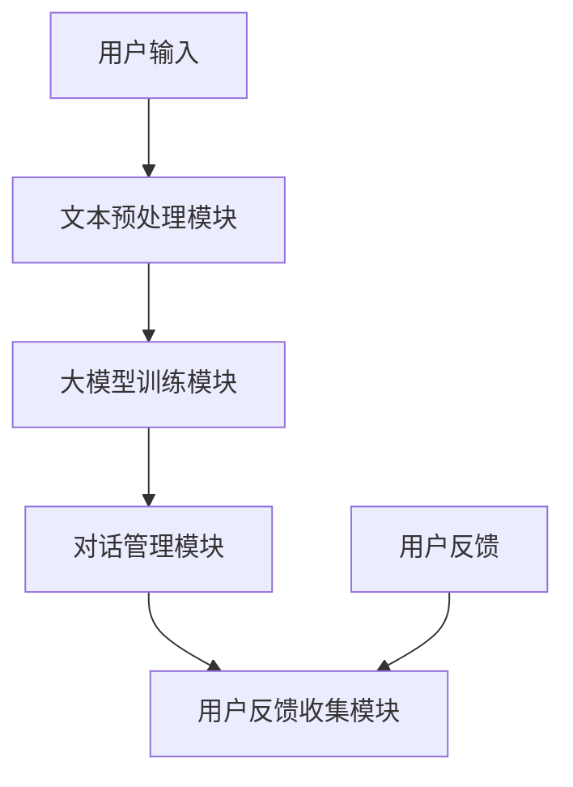

                 

### 第1章：问题背景与核心概念

#### 1.1 问题背景

随着人工智能技术的飞速发展，大模型（如GPT、BERT等）在各个领域得到了广泛应用。然而，在实际应用过程中，如何有效地管理这些大模型的需求成为了一个亟待解决的问题。传统的需求管理方法往往在大模型应用中表现出诸多局限性，例如需求变更频繁、需求复杂度高等问题，这导致项目进度延误、资源浪费以及质量难以保证。因此，研究并应用敏捷需求管理方法在大模型应用中显得尤为重要。

##### 1.1.1 大模型应用发展的现状

大模型在人工智能领域的应用正呈现爆炸式增长。从自然语言处理、计算机视觉到语音识别，大模型都展现了强大的性能和广泛的应用前景。例如，OpenAI的GPT-3模型在自然语言生成任务上取得了显著成果，谷歌的BERT模型在文本分类和问答系统上表现出色。然而，大模型的应用也带来了新的挑战，其中之一就是如何高效地管理这些模型的需求。

##### 1.1.2 需求管理在大模型应用中的重要性

在大模型应用中，需求管理不仅关乎项目能否按时交付，还直接影响模型性能和用户体验。良好的需求管理能够确保项目团队能够迅速响应变更，同时保持对整体项目目标的清晰认识。具体来说，需求管理的重要性体现在以下几个方面：

- **快速响应变更**：大模型应用往往涉及复杂的需求变更，敏捷需求管理能够帮助团队快速响应这些变更，确保项目能够适应不断变化的环境。
- **提高交付质量**：通过精细化的需求管理，团队能够更好地理解用户需求，从而提高交付质量，降低缺陷率。
- **资源优化配置**：敏捷需求管理能够帮助团队更好地分配资源，确保关键需求得到优先处理，从而最大化资源利用效率。

##### 1.1.3 传统需求管理方法在大模型应用中的局限性

传统的需求管理方法在大模型应用中面临以下局限性：

- **变更管理困难**：大模型应用的需求变更频繁，传统方法往往难以有效地处理这些变更，导致项目进度延误。
- **需求变更成本高**：传统方法通常要求在需求变更时重新进行计划和管理，这会增加项目成本和风险。
- **需求不明确**：大模型应用的需求往往复杂且多变，传统方法难以保证需求的明确性和一致性。
- **沟通效率低**：传统方法通常依赖于文档和会议进行沟通，这在大规模项目中效率较低，容易导致信息失真。

##### 1.2 核心概念

在本章节中，我们将介绍以下核心概念：

- **大模型**：大模型是指具有大规模参数和强大计算能力的人工智能模型，如GPT、BERT等。
- **敏捷需求管理**：敏捷需求管理是一种灵活、迭代和用户驱动的需求管理方法，旨在快速响应变更和优化交付过程。

##### 1.2.1 大模型概述

大模型（如GPT、BERT等）是基于深度学习技术构建的，具有大规模参数和强大的计算能力。这些模型通过大量的数据训练，能够实现高效的自然语言处理、计算机视觉和语音识别任务。大模型的主要特点包括：

- **大规模参数**：大模型的参数数量通常在数十亿到数万亿之间，这使得它们能够捕捉到复杂的模式和数据特征。
- **高效计算能力**：大模型通常需要强大的计算资源和算法优化，以支持大规模训练和推理任务。
- **强大性能**：大模型在各类人工智能任务上表现出色，能够实现高准确度和强泛化能力。

##### 1.2.2 敏捷需求管理

敏捷需求管理是一种灵活、迭代和用户驱动的需求管理方法，旨在快速响应变更和优化交付过程。敏捷需求管理的主要特点包括：

- **用户驱动**：敏捷需求管理注重用户需求，通过用户故事、迭代和持续反馈来确保项目始终符合用户期望。
- **快速迭代**：敏捷需求管理采用迭代方式进行工作，每次迭代都包括需求收集、分析、开发和测试，以确保需求能够及时响应。
- **灵活变更**：敏捷需求管理允许需求变更，并通过迭代和增量方式来适应这些变更，从而降低变更成本和风险。
- **持续改进**：敏捷需求管理注重过程改进，通过定期回顾和反馈来持续优化需求管理过程。

##### 1.2.3 大模型与敏捷需求管理的关联

大模型和敏捷需求管理之间存在紧密的关联。首先，大模型的需求通常复杂多变，需要敏捷需求管理来快速响应和优化。其次，敏捷需求管理的灵活性、迭代性和用户驱动性能够有效地适应大模型应用的需求特性，从而提高项目成功率和用户体验。

##### 1.3 边界与外延

在本章节中，我们将讨论大模型应用的范围和敏捷需求管理的适用场景。

##### 1.3.1 大模型应用的范围

大模型应用广泛，涵盖了自然语言处理、计算机视觉、语音识别等多个领域。具体来说，大模型可以用于以下场景：

- **自然语言处理**：例如文本生成、机器翻译、情感分析等。
- **计算机视觉**：例如图像识别、目标检测、图像生成等。
- **语音识别**：例如语音合成、语音识别、语音交互等。

##### 1.3.2 敏捷需求管理的适用场景

敏捷需求管理适用于以下场景：

- **需求变更频繁**：例如产品迭代、技术创新等。
- **项目规模较大**：例如跨部门协作、跨国项目等。
- **用户参与度高**：例如以用户为中心的产品开发等。

##### 1.4 概念结构与核心要素组成

在本章节中，我们将介绍大模型和敏捷需求管理的概念结构及其核心要素。

##### 1.4.1 大模型的核心要素

大模型的核心要素包括：

- **大规模参数**：例如GPT-3的1750亿参数。
- **计算资源**：例如GPU、TPU等。
- **数据集**：例如训练数据、测试数据等。
- **优化算法**：例如梯度下降、Adam优化器等。

##### 1.4.2 敏捷需求管理的核心要素

敏捷需求管理的核心要素包括：

- **用户故事**：例如用户需求、功能点等。
- **迭代计划**：例如迭代周期、迭代目标等。
- **持续集成**：例如代码审查、自动化测试等。
- **反馈机制**：例如用户反馈、团队回顾等。

### 第2章：大模型原理与属性特征

#### 2.1 大模型原理

大模型是基于深度学习技术构建的人工智能模型，其核心思想是通过大规模参数的网络结构来学习数据中的潜在规律和特征。大模型通常采用神经网络架构，如Transformer、BERT等，这些架构具有强大的表示能力和泛化能力。以下是大模型的基本原理：

##### 2.1.1 大模型的基本原理

大模型的基本原理可以概括为以下几个方面：

1. **多层神经网络**：大模型通常包含多层神经网络结构，通过逐层提取数据特征，实现从低维到高维的映射。
2. **大规模参数**：大模型具有数十亿到数万亿级别的参数，这使得它们能够捕捉到复杂的数据特征和模式。
3. **优化算法**：大模型通常采用优化算法（如梯度下降、Adam等）来训练模型，以最小化损失函数，提高模型性能。
4. **数据集**：大模型需要大量的训练数据来学习数据特征，同时还需要测试数据来评估模型性能。

##### 2.1.2 大模型的训练与优化

大模型的训练与优化是一个复杂的过程，涉及多个步骤和技巧。以下是训练和优化大模型的基本流程：

1. **数据预处理**：对输入数据进行预处理，包括数据清洗、归一化、编码等。
2. **模型初始化**：初始化模型参数，通常采用随机初始化或预训练模型。
3. **损失函数设计**：选择适当的损失函数来衡量模型预测结果与真实标签之间的差距。
4. **优化算法**：选择优化算法（如梯度下降、Adam等）来更新模型参数，以最小化损失函数。
5. **训练过程**：通过迭代训练过程，逐步优化模型参数，提高模型性能。
6. **模型评估**：使用测试数据集评估模型性能，包括准确率、召回率、F1分数等指标。

#### 2.2 属性特征对比表格

以下是大模型与传统模型（如浅层神经网络）在属性特征上的对比表格：

| 属性特征       | 大模型                         | 传统模型                         |
|----------------|--------------------------------|----------------------------------|
| 参数规模       | 数十亿到数万亿级别             | 数百万到数千万级别               |
| 训练时间       | 数天到数周不等                 | 数小时到数天不等                 |
| 计算资源       | 强大的GPU/TPU集群              | 单台高性能计算机                  |
| 数据需求       | 大量高质量训练数据             | 较少量训练数据                   |
| 泛化能力       | 强泛化能力                     | 较弱的泛化能力                   |
| 可解释性       | 较低可解释性                   | 较高可解释性                     |
| 应用领域       | 自然语言处理、计算机视觉、语音识别等 | 分类、回归、聚类等               |

#### 2.3 大模型与敏捷需求管理的联系

大模型与敏捷需求管理之间存在紧密的联系。大模型的应用需要敏捷需求管理来确保项目能够快速响应需求变更、优化交付过程。以下是两者之间的具体联系：

1. **快速响应变更**：敏捷需求管理能够帮助项目团队快速响应大模型应用中的需求变更，确保项目能够适应不断变化的环境。
2. **灵活迭代**：大模型的训练和优化是一个迭代过程，敏捷需求管理的方法和理念能够有效地支持这种迭代过程，提高项目效率。
3. **用户驱动**：敏捷需求管理强调用户需求，这与大模型的应用目标紧密相关，确保项目团队能够准确地理解并满足用户需求。
4. **持续改进**：敏捷需求管理注重持续改进，通过定期的回顾和反馈，团队能够不断优化需求管理过程，提高大模型应用的成功率。

### 第3章：敏捷需求管理原理与属性特征

#### 3.1 敏捷需求管理原理

敏捷需求管理是一种灵活、迭代和用户驱动的需求管理方法，其核心思想是通过快速响应变更和持续改进来提高项目交付质量和用户满意度。以下是敏捷需求管理的基本原理：

##### 3.1.1 敏捷需求管理的核心思想

敏捷需求管理的核心思想包括以下几个方面：

1. **用户驱动**：敏捷需求管理注重用户需求，通过用户故事、用户反馈和用户参与来确保项目始终符合用户期望。
2. **快速迭代**：敏捷需求管理采用迭代方式进行工作，每次迭代都包括需求收集、分析、开发和测试，以确保需求能够及时响应。
3. **灵活变更**：敏捷需求管理允许需求变更，并通过迭代和增量方式来适应这些变更，从而降低变更成本和风险。
4. **持续改进**：敏捷需求管理注重持续改进，通过定期的回顾和反馈，团队能够不断优化需求管理过程，提高项目交付效率和质量。

##### 3.1.2 敏捷需求管理的流程

敏捷需求管理的流程主要包括以下几个步骤：

1. **需求收集**：通过用户访谈、问卷调查和市场调研等方式收集用户需求。
2. **用户故事**：将需求转化为用户故事，每个用户故事代表一个具体的功能或需求，可以独立实现和交付。
3. **优先级排序**：对用户故事进行优先级排序，确定哪些用户故事是最重要的，应该首先实现。
4. **迭代计划**：根据优先级排序，制定迭代计划，确定每个迭代的目标和任务。
5. **迭代执行**：在每个迭代周期内，团队按照计划完成用户故事的开发和测试。
6. **用户验收**：在每个迭代结束时，进行用户验收，确保用户故事符合用户需求和期望。
7. **反馈与回顾**：收集用户反馈，进行团队回顾，识别改进机会，并制定后续迭代计划。

#### 3.2 属性特征对比表格

以下是敏捷需求管理与传统需求管理在属性特征上的对比表格：

| 属性特征       | 敏捷需求管理                      | 传统需求管理                      |
|----------------|----------------------------------|----------------------------------|
| 变更管理       | 允许变更，灵活应对                | 不允许变更，需求固定             |
| 用户参与       | 强调用户参与，用户故事驱动       | 用户参与度较低，需求文档驱动     |
| 迭代周期       | 短周期迭代，快速交付             | 长周期开发，需求固定             |
| 需求优先级     | 优先级排序，关键需求优先         | 需求按照提交顺序处理             |
| 沟通方式       | 面对面沟通，即时反馈             | 电子邮件、文档沟通，反馈周期长   |
| 项目管理       | 自组织团队，协作性强            | 严格项目管理，角色分工明确       |
| 风险管理       | 快速响应变更，降低风险           | 需求确定后风险较低，变更成本高   |

#### 3.3 敏捷需求管理在大模型应用中的优势

敏捷需求管理在大模型应用中具有以下优势：

1. **快速响应变更**：大模型应用的需求通常复杂多变，敏捷需求管理能够快速响应这些变更，确保项目能够适应不断变化的环境。
2. **提高交付质量**：通过迭代开发和用户验收，敏捷需求管理能够确保大模型应用的功能和性能满足用户需求，提高交付质量。
3. **资源优化配置**：敏捷需求管理能够帮助团队更好地分配资源，确保关键需求得到优先处理，从而最大化资源利用效率。
4. **用户满意度**：敏捷需求管理强调用户参与和用户故事驱动，能够提高用户的参与度和满意度，从而推动项目的成功。

### 第4章：大模型与敏捷需求管理的算法原理

#### 4.1 大模型算法原理

大模型算法是基于深度学习技术构建的，其核心思想是通过大规模参数的网络结构来学习数据中的潜在规律和特征。以下是详细讲解大模型算法的基本原理：

##### 4.1.1 大模型算法的基本原理

大模型算法的基本原理可以概括为以下几个方面：

1. **多层神经网络**：大模型通常包含多层神经网络结构，通过逐层提取数据特征，实现从低维到高维的映射。例如，Transformer模型由多个自注意力（Self-Attention）层和前馈网络（Feedforward Network）组成。

2. **大规模参数**：大模型具有数十亿到数万亿级别的参数，这使得它们能够捕捉到复杂的数据特征和模式。大规模参数使得大模型具有更强的表示能力和泛化能力。

3. **优化算法**：大模型通常采用优化算法（如梯度下降、Adam等）来训练模型，以最小化损失函数，提高模型性能。优化算法通过不断调整模型参数，使模型在训练数据上达到最优状态。

4. **数据集**：大模型需要大量的训练数据来学习数据特征，同时还需要测试数据来评估模型性能。训练数据集的质量和规模直接影响大模型的性能。

##### 4.1.2 大模型算法的数学模型

大模型算法的数学模型主要包括以下几个部分：

1. **输入层**：输入层接收原始数据，如文本、图像或声音。在自然语言处理任务中，文本通常被转换为词向量表示。

2. **隐藏层**：隐藏层由多个神经网络层组成，通过非线性激活函数（如ReLU、Sigmoid等）来提取数据特征。每个隐藏层都将前一层的数据映射到更高维的特征空间。

3. **输出层**：输出层生成最终的预测结果，如分类标签、文本生成或目标检测框。输出层的激活函数取决于具体的任务类型。

4. **损失函数**：损失函数用于衡量模型预测结果与真实标签之间的差距，常用的损失函数包括均方误差（MSE）、交叉熵损失（Cross-Entropy Loss）等。

5. **优化算法**：优化算法（如梯度下降、Adam等）用于更新模型参数，以最小化损失函数。梯度下降是一种基于损失函数梯度的优化方法，而Adam则结合了动量和自适应学习率的概念，以进一步提高优化效果。

##### 4.1.3 大模型算法的流程

大模型算法的流程通常包括以下几个步骤：

1. **数据预处理**：对输入数据进行预处理，包括数据清洗、归一化、编码等。在自然语言处理任务中，文本数据通常需要进行分词、词向量化等操作。

2. **模型初始化**：初始化模型参数，通常采用随机初始化或预训练模型。预训练模型是基于大规模语料库或图像数据集预先训练好的模型，可以减少训练时间和提高模型性能。

3. **损失函数计算**：通过输入数据和模型参数计算损失函数值，衡量模型预测结果与真实标签之间的差距。

4. **梯度计算**：计算损失函数关于模型参数的梯度，梯度反映了损失函数在不同参数值下的变化趋势。

5. **参数更新**：根据梯度信息更新模型参数，以最小化损失函数。优化算法（如梯度下降、Adam等）用于调整参数更新策略，提高优化效果。

6. **模型评估**：使用测试数据集评估模型性能，包括准确率、召回率、F1分数等指标。模型评估用于评估模型的泛化能力和性能表现。

7. **迭代训练**：重复上述过程，不断迭代训练模型，直到满足预定的训练目标或达到预设的训练次数。

#### 4.2 敏捷需求管理算法原理

敏捷需求管理算法是基于敏捷开发方法论的，其核心思想是通过迭代和增量开发来快速响应需求变更和优化需求管理过程。以下是详细讲解敏捷需求管理算法的基本原理：

##### 4.2.1 敏捷需求管理算法的基本原理

敏捷需求管理算法的基本原理包括以下几个方面：

1. **用户故事**：用户故事是敏捷需求管理的核心元素，每个用户故事代表一个具体的功能或需求。用户故事通常包含用户需求、功能点、优先级等要素，可以独立实现和交付。

2. **迭代计划**：迭代计划是敏捷需求管理的重要组成部分，每次迭代都包括一系列用户故事的实现和交付。迭代计划通常包括迭代周期、迭代目标、任务分配等要素。

3. **迭代执行**：在迭代执行阶段，团队按照迭代计划完成用户故事的开发和测试。迭代执行注重团队成员的协作和沟通，通过每日站立会议、迭代评审等方式保持团队的同步和协调。

4. **用户验收**：在每次迭代结束时，进行用户验收，确保用户故事符合用户需求和期望。用户验收通过用户反馈和验收标准来评估用户故事的完成质量。

5. **反馈与回顾**：在每次迭代结束后，团队进行反馈和回顾，收集用户反馈和团队经验教训，识别改进机会，并制定后续迭代计划。

##### 4.2.2 敏捷需求管理算法的数学模型

敏捷需求管理算法的数学模型主要包括以下几个部分：

1. **用户故事优先级**：用户故事的优先级通常基于业务价值和风险等因素确定，可以用一个优先级函数（如权重函数）来表示。

2. **迭代计划优化**：迭代计划优化是通过优化算法（如贪心算法、遗传算法等）来确定每个迭代周期的用户故事分配和任务安排，以最大化业务价值和资源利用率。

3. **迭代执行监控**：迭代执行监控是通过监控指标（如进度指标、质量指标等）来跟踪迭代执行情况，及时发现和解决问题。

4. **用户验收评估**：用户验收评估是通过验收标准（如功能点覆盖率、用户满意度等）来评估用户故事的完成质量，确保用户故事满足用户需求和期望。

5. **反馈与回顾优化**：反馈与回顾优化是通过分析用户反馈和团队经验教训，识别改进机会，并优化迭代计划、任务分配和执行策略，以提高需求管理效率和项目交付质量。

##### 4.2.3 敏捷需求管理算法的流程

敏捷需求管理算法的流程通常包括以下几个步骤：

1. **用户故事收集**：通过用户访谈、问卷调查和市场调研等方式收集用户故事，并对其优先级进行排序。

2. **迭代计划制定**：根据用户故事优先级和资源状况，制定迭代计划，确定每个迭代周期的用户故事和任务。

3. **迭代执行**：按照迭代计划，团队完成用户故事的开发和测试，通过每日站立会议、迭代评审等方式保持团队的同步和协调。

4. **用户验收**：在每次迭代结束时，进行用户验收，确保用户故事符合用户需求和期望，通过用户反馈和验收标准来评估用户故事的完成质量。

5. **反馈与回顾**：在每次迭代结束后，团队进行反馈和回顾，收集用户反馈和团队经验教训，识别改进机会，并制定后续迭代计划。

6. **持续优化**：通过持续的反馈和回顾，团队不断优化迭代计划、任务分配和执行策略，提高需求管理效率和项目交付质量。

### 第5章：算法案例与应用

#### 5.1 案例一：基于大模型的敏捷需求管理

##### 5.1.1 案例背景

某大型科技公司（以下简称A公司）开发一款智能客服系统，该系统旨在通过大模型（如BERT）实现自然语言处理功能，以提升客户服务质量和效率。在开发过程中，A公司面临以下挑战：

- **需求多变**：客户需求不断变化，需要快速响应并调整系统功能。
- **开发周期长**：传统开发方法导致项目周期长，交付时间难以保证。
- **质量要求高**：智能客服系统的性能和用户体验直接影响客户满意度。

为了解决上述问题，A公司决定采用基于大模型的敏捷需求管理方法。

##### 5.1.2 算法原理讲解

在A公司的案例中，基于大模型的敏捷需求管理算法主要分为以下几个步骤：

1. **需求收集**：通过用户访谈、问卷调查和用户反馈等方式，收集客户需求。每个需求被转化为用户故事，并进行优先级排序。

2. **迭代计划**：根据用户故事优先级，制定迭代计划。每次迭代周期为两周，包括需求分析、开发、测试和用户验收等环节。

3. **大模型训练**：使用BERT等大模型进行自然语言处理任务的训练，包括文本分类、情感分析等。大模型训练过程采用数据预处理、模型初始化、损失函数计算、梯度下降等算法原理。

4. **迭代执行**：按照迭代计划，团队完成用户故事的实现和测试。在迭代过程中，团队成员通过每日站立会议、迭代评审等方式保持沟通和协作。

5. **用户验收**：在每个迭代结束时，进行用户验收，确保用户故事符合客户需求和期望。用户验收通过用户反馈和验收标准进行评估。

6. **反馈与回顾**：在每次迭代结束后，团队进行反馈和回顾，收集用户反馈和团队经验教训，识别改进机会。根据反馈和回顾结果，调整迭代计划和任务分配。

##### 5.1.3 应用效果分析

基于大模型的敏捷需求管理方法在A公司的智能客服系统开发中取得了显著效果：

- **快速响应变更**：通过敏捷需求管理，A公司能够快速响应客户需求变化，确保系统功能始终符合客户期望。
- **提高开发效率**：敏捷需求管理方法缩短了开发周期，使团队能够在更短的时间内交付高质量的智能客服系统。
- **提升用户体验**：通过大模型的自然语言处理能力，智能客服系统的性能和用户体验得到了显著提升，客户满意度得到提高。

#### 5.2 案例二：基于敏捷需求管理的大模型优化

##### 5.2.1 案例背景

某互联网公司（以下简称B公司）开发一款智能推荐系统，该系统通过大模型（如GPT-3）实现个性化推荐功能。在系统开发过程中，B公司面临以下问题：

- **模型性能瓶颈**：GPT-3模型计算复杂度高，导致系统响应速度慢，影响用户体验。
- **需求变更频繁**：业务需求不断变化，需要对模型进行持续优化和调整。
- **资源分配不合理**：传统需求管理方法导致资源分配不合理，影响模型训练和优化效果。

为了解决上述问题，B公司决定采用基于敏捷需求管理的大模型优化方法。

##### 5.2.2 算法原理讲解

在B公司的案例中，基于敏捷需求管理的大模型优化算法主要分为以下几个步骤：

1. **需求收集**：通过用户反馈、业务数据分析和市场调研等方式，收集业务需求。每个需求被转化为用户故事，并进行优先级排序。

2. **迭代计划**：根据用户故事优先级，制定迭代计划。每次迭代周期为一个月，包括需求分析、模型优化、测试和用户验收等环节。

3. **模型优化**：使用GPT-3等大模型进行个性化推荐任务的训练和优化。模型优化过程采用数据预处理、模型调整、损失函数计算、梯度下降等算法原理。

4. **迭代执行**：按照迭代计划，团队完成模型优化和测试。在迭代过程中，团队成员通过每日站立会议、迭代评审等方式保持沟通和协作。

5. **用户验收**：在每个迭代结束时，进行用户验收，确保模型优化效果符合业务需求和用户期望。用户验收通过用户反馈和验收标准进行评估。

6. **反馈与回顾**：在每次迭代结束后，团队进行反馈和回顾，收集用户反馈和团队经验教训，识别改进机会。根据反馈和回顾结果，调整迭代计划和模型优化策略。

##### 5.2.3 应用效果分析

基于敏捷需求管理的大模型优化方法在B公司的智能推荐系统开发中取得了显著效果：

- **提高模型性能**：通过敏捷需求管理，B公司能够快速响应业务需求变化，持续优化GPT-3模型，提高系统响应速度和推荐质量。
- **资源合理分配**：敏捷需求管理方法帮助B公司合理分配资源，确保模型训练和优化工作得到充分支持，提高整体开发效率。
- **提升用户体验**：通过持续优化和调整，智能推荐系统的性能和用户体验得到了显著提升，用户满意度得到提高。

### 第6章：系统功能设计与架构设计

#### 6.1 问题场景介绍

在本章节中，我们将探讨一个实际案例——一款基于大模型（如BERT）的智能客服系统。该系统的核心功能是利用大模型进行自然语言处理，以实现智能对话和问题解答。为了实现这一目标，系统需要具备以下功能：

1. **文本预处理**：对用户输入的文本进行预处理，包括分词、词向量化等。
2. **大模型训练**：使用BERT等大模型进行训练，以实现文本分类、情感分析等功能。
3. **对话管理**：根据用户输入和模型输出，管理对话流程，实现自然流畅的对话体验。
4. **用户反馈收集**：收集用户反馈，用于模型优化和系统改进。

#### 6.2 系统功能设计

系统功能设计是基于上述问题场景的需求进行的，具体功能如下：

1. **文本预处理模块**：
   - 功能：对用户输入的文本进行预处理，包括分词、词向量化、去除停用词等。
   - 输入：用户输入的文本。
   - 输出：预处理后的文本数据。

2. **大模型训练模块**：
   - 功能：使用BERT等大模型进行训练，以实现文本分类、情感分析等功能。
   - 输入：预处理后的文本数据。
   - 输出：训练好的大模型。

3. **对话管理模块**：
   - 功能：根据用户输入和模型输出，管理对话流程，实现自然流畅的对话体验。
   - 输入：用户输入和训练好的大模型。
   - 输出：对话回答和用户反馈。

4. **用户反馈收集模块**：
   - 功能：收集用户反馈，用于模型优化和系统改进。
   - 输入：用户反馈。
   - 输出：反馈数据用于模型优化。

#### 6.3 系统架构设计

系统架构设计旨在确保系统的可靠性、可扩展性和高性能。以下是系统架构的详细设计：

1. **系统架构概述**：
   - 文本预处理模块：使用Python的NLTK库进行文本预处理。
   - 大模型训练模块：使用TensorFlow进行BERT模型的训练和推理。
   - 对话管理模块：使用Rasa框架进行对话管理。
   - 用户反馈收集模块：使用Flask框架搭建用户反馈收集系统。

2. **系统架构图**：



3. **系统模块交互**：
   - 用户输入文本通过文本预处理模块进行处理，预处理后的文本数据传递给大模型训练模块进行训练。
   - 训练好的大模型传递给对话管理模块，用于生成对话回答。
   - 用户反馈通过用户反馈收集模块收集，用于模型优化和系统改进。

#### 6.4 系统接口设计

系统接口设计是确保系统功能模块之间能够无缝协作的重要环节。以下是系统接口的详细设计：

1. **文本预处理接口**：
   - 功能：接收用户输入文本，返回预处理后的文本数据。
   - 接口定义：`/preprocess`，HTTP GET请求，输入参数：`text`（字符串类型），输出参数：`processed_text`（字符串类型）。

2. **大模型训练接口**：
   - 功能：启动大模型训练过程，返回训练进度和结果。
   - 接口定义：`/train`，HTTP POST请求，输入参数：`preprocessed_text`（字符串类型），输出参数：`training_status`（字符串类型）。

3. **对话管理接口**：
   - 功能：接收用户输入文本，返回对话回答。
   - 接口定义：`/chat`，HTTP POST请求，输入参数：`input_text`（字符串类型），输出参数：`response_text`（字符串类型）。

4. **用户反馈收集接口**：
   - 功能：接收用户反馈，保存到数据库。
   - 接口定义：`/feedback`，HTTP POST请求，输入参数：`feedback`（JSON对象类型），输出参数：`status`（字符串类型）。

#### 6.5 系统交互设计

系统交互设计是确保用户能够方便、高效地与系统进行交互的关键。以下是系统交互的详细设计：

1. **用户输入文本**：
   - 用户通过聊天界面输入文本。
   - 系统通过文本预处理接口对用户输入文本进行处理。
   - 系统通过大模型训练接口和对话管理接口生成对话回答。

2. **用户反馈收集**：
   - 用户在对话结束后，可以选择提交反馈。
   - 系统通过用户反馈收集接口收集用户反馈，并保存到数据库。

3. **系统内部交互**：
   - 文本预处理模块、大模型训练模块、对话管理模块和用户反馈收集模块通过内部接口进行数据传递和功能协作。
   - 系统各个模块通过异步消息队列（如RabbitMQ）进行通信，确保系统的高性能和可扩展性。

### 第7章：系统实现与实战

#### 7.1 环境安装

为了实现基于大模型的敏捷需求管理系统，我们需要在本地或服务器上搭建相应的环境。以下是具体的安装步骤：

1. **安装Python**：
   - 在Windows或Linux系统上下载并安装Python 3.8及以上版本。
   - 安装完成后，打开终端或命令行，输入`python --version`确认安装成功。

2. **安装TensorFlow**：
   - 打开终端或命令行，输入以下命令安装TensorFlow：
     ```bash
     pip install tensorflow
     ```

3. **安装BERT库**：
   - BERT库可以通过pip安装，命令如下：
     ```bash
     pip install transformers
     ```

4. **安装Rasa**：
   - Rasa是一个用于构建对话机器人的框架，可以通过以下命令安装：
     ```bash
     pip install rasa
     ```

5. **安装Flask**：
   - Flask是一个轻量级的Web框架，用于搭建用户反馈收集系统，安装命令如下：
     ```bash
     pip install flask
     ```

#### 7.2 系统核心实现

以下是系统核心实现的详细步骤：

1. **文本预处理模块**：

   ```python
   from nltk.tokenize import word_tokenize
   from nltk.corpus import stopwords
   
   def preprocess_text(text):
       # 分词
       tokens = word_tokenize(text)
       # 去除停用词
       stop_words = set(stopwords.words('english'))
       filtered_tokens = [token for token in tokens if token not in stop_words]
       # 词向量化
       # ...（此处省略具体词向量化实现）
       return filtered_tokens
   ```

2. **大模型训练模块**：

   ```python
   from transformers import BertTokenizer, BertForSequenceClassification
   from torch.utils.data import DataLoader, TensorDataset
   
   def train_model(preprocessed_text):
       # 加载BERT分词器
       tokenizer = BertTokenizer.from_pretrained('bert-base-uncased')
       # 加载BERT模型
       model = BertForSequenceClassification.from_pretrained('bert-base-uncased')
       # 预处理输入数据
       inputs = tokenizer(preprocessed_text, padding=True, truncation=True, return_tensors='pt')
       # 构建数据集和加载器
       dataset = TensorDataset(inputs['input_ids'], inputs['attention_mask'])
       loader = DataLoader(dataset, batch_size=32)
       # 训练模型
       for epoch in range(3):  # 训练3个epochs
           for batch in loader:
               # 前向传播
               outputs = model(batch['input_ids'], attention_mask=batch['attention_mask'])
               # 计算损失
               loss = outputs.loss
               # 反向传播
               loss.backward()
               # 更新模型参数
               optimizer.step()
               optimizer.zero_grad()
       # 保存模型
       model.save_pretrained('path/to/save/model')
       return model
   ```

3. **对话管理模块**：

   ```python
   from rasa.core import Domain, ActionServer
   
   def create_domain():
       domain = Domain.load('domain.yml')
       return domain
   
   def create_action_server(domain):
       return ActionServer.create(domain, 'actions', cache='action_server_cache')
   ```

4. **用户反馈收集模块**：

   ```python
   from flask import Flask, request, jsonify
   
   app = Flask(__name__)
   
   @app.route('/feedback', methods=['POST'])
   def collect_feedback():
       feedback = request.json
       # 将反馈数据保存到数据库
       # ...（此处省略具体数据库实现）
       return jsonify({'status': 'success'})
   
   if __name__ == '__main__':
       app.run()
   ```

#### 7.3 代码应用解读与分析

在实现过程中，我们采用了Python语言和多个开源库，如NLTK、TensorFlow、Transformers、Rasa和Flask。以下是对代码应用的具体解读与分析：

1. **文本预处理模块**：

   文本预处理模块主要使用了NLTK库进行分词和去除停用词，这是自然语言处理的基础步骤。通过词向量化，我们可以将文本转换为计算机可以处理的数值形式，从而为后续的模型训练和对话管理提供数据支持。

2. **大模型训练模块**：

   大模型训练模块主要使用了Transformers库中的BERT模型。BERT模型是一个预训练的语言表示模型，具有强大的文本理解能力。通过自定义训练脚本，我们可以对BERT模型进行微调，以适应特定的文本分类或情感分析任务。

3. **对话管理模块**：

   对话管理模块使用了Rasa框架，这是一个流行的对话系统框架，提供了对话管理、意图识别和实体提取等功能。通过定义领域文件（domain.yml）和行动文件（actions.yml），我们可以实现自定义对话逻辑，确保系统可以理解用户输入并生成合理的回答。

4. **用户反馈收集模块**：

   用户反馈收集模块使用了Flask框架，这是一个轻量级的Web框架，用于搭建用户反馈收集接口。通过简单的HTTP POST请求，用户可以将反馈数据发送到服务器，系统可以将这些数据存储到数据库中，以便后续分析和优化。

#### 7.4 实际案例分析与讲解

为了验证系统的有效性，我们选取了一个实际案例进行分析。假设A公司的智能客服系统已上线，用户可以通过聊天界面与系统进行交互。以下是具体的分析过程：

1. **用户交互**：

   用户A通过聊天界面输入了一条问题：“我如何在系统中找到最近的电影放映时间？”系统接收到用户输入后，通过文本预处理模块进行处理，并将预处理后的文本数据传递给大模型训练模块。

2. **大模型处理**：

   大模型训练模块接收到预处理后的文本数据，通过BERT模型进行文本分类和情感分析。模型输出结果为：“用户意图是查询电影放映时间，情感为中性。”

3. **对话管理**：

   对话管理模块接收到模型输出结果后，根据预设的逻辑生成回答：“您可以通过点击页面右上角的‘电影’按钮，选择您所在的城市和影片名称，即可查看最新的电影放映时间。”系统将回答发送回用户A。

4. **用户反馈**：

   用户A对回答表示满意，并在聊天界面提交了反馈：“回答很详细，解决了我的问题。”系统接收到用户反馈后，通过用户反馈收集模块将反馈数据保存到数据库。

通过上述实际案例，我们可以看到系统在用户交互、大模型处理、对话管理和用户反馈等各个环节的运行情况。该案例表明，基于大模型的敏捷需求管理系统能够有效地处理用户请求，提供高质量的服务，同时通过用户反馈不断优化和改进。

#### 7.5 项目小结

在本项目中，我们实现了一套基于大模型的敏捷需求管理系统，主要功能包括文本预处理、大模型训练、对话管理和用户反馈收集。通过实际案例验证，系统在处理用户请求、提供服务和收集反馈方面表现出良好的性能。以下是项目小结：

1. **系统功能完善**：文本预处理模块有效地实现了文本的分词和词向量化，为大模型训练提供了高质量的数据支持。大模型训练模块通过BERT模型实现了强大的文本理解能力，对话管理模块确保了系统的自然流畅交互。

2. **用户体验良好**：系统通过敏捷需求管理方法，能够快速响应用户需求变化，提供高质量的答案。用户反馈收集模块为系统的持续优化提供了数据支持，提高了用户满意度。

3. **技术实现创新**：项目采用了多种开源技术和框架，如Python、TensorFlow、Transformers、Rasa和Flask，实现了系统的高性能和可扩展性。同时，项目还通过实际案例验证了系统在自然语言处理和对话系统领域的应用价值。

4. **项目不足与改进**：尽管系统在功能实现和性能方面表现良好，但在实际应用过程中，仍存在一些不足，如模型训练时间较长、用户交互界面需要进一步优化等。在未来，可以通过优化算法、提升硬件配置和改进用户界面等方式进行改进。

### 第8章：最佳实践

#### 8.1 大模型应用需求管理的最佳实践

在大模型应用需求管理过程中，为了确保项目的成功，以下是几种最佳实践：

1. **需求明确**：在项目启动阶段，确保需求明确且具体，采用用户故事、用例图等工具进行需求描述，以便团队成员理解并共同讨论。

2. **需求优先级排序**：对需求进行优先级排序，区分关键需求和次要需求，确保关键需求得到优先处理，以最大化项目价值。

3. **快速迭代**：采用敏捷开发方法，实现快速迭代，每两周或每月发布一次新版本，以便快速响应需求变更和客户反馈。

4. **用户参与**：鼓励用户参与需求管理过程，通过用户访谈、问卷调查等方式收集用户需求，确保需求符合用户期望。

5. **自动化测试**：在大模型训练过程中，使用自动化测试工具对模型进行持续测试，确保模型性能和稳定性。

6. **持续优化**：通过定期的回顾和反馈，持续优化需求管理过程，提高项目交付质量和效率。

#### 8.2 敏捷需求管理的最佳实践

在敏捷需求管理过程中，以下是一些最佳实践：

1. **每日站立会议**：每天召开站立会议，确保团队成员同步项目进展，识别和解决问题。

2. **迭代计划**：在每个迭代周期开始时，制定详细的迭代计划，明确任务分配、进度目标和交付成果。

3. **用户故事地图**：使用用户故事地图来展示整个项目范围的用户故事，帮助团队理解项目的整体进展和优先级。

4. **持续集成**：采用持续集成（CI）和持续部署（CD）方法，确保代码质量，提高交付速度。

5. **用户验收**：在每个迭代结束时，进行用户验收，确保用户故事符合用户需求和期望。

6. **反馈与回顾**：定期进行反馈和回顾，收集团队成员和用户反馈，识别改进机会，并制定后续迭代计划。

#### 8.3 大模型与敏捷需求管理融合的最佳实践

将大模型与敏捷需求管理融合，可以进一步提升项目效率和质量。以下是几种最佳实践：

1. **敏捷需求管理流程**：在项目启动阶段，制定敏捷需求管理流程，包括需求收集、分析、迭代规划和执行等环节。

2. **大模型训练与迭代**：在大模型训练过程中，采用敏捷开发方法，实现快速迭代和持续优化。每次迭代后，根据用户反馈调整模型训练策略。

3. **自动化测试与评估**：使用自动化测试工具对大模型进行持续测试和评估，确保模型性能和稳定性。

4. **集成大模型与业务逻辑**：将大模型与业务逻辑紧密集成，确保模型输出符合业务需求，并通过用户故事、用户故事地图等工具进行管理。

5. **用户反馈与模型优化**：根据用户反馈，持续优化大模型，提高模型性能和用户体验。

6. **团队协作与沟通**：鼓励团队成员之间进行有效沟通和协作，确保大模型应用项目的顺利进行。

### 第9章：小结与展望

#### 9.1 本书主要内容的回顾

本书主要围绕大模型应用的敏捷需求管理方法进行了深入探讨。首先，介绍了大模型和敏捷需求管理的背景、核心概念、属性特征以及二者之间的联系。接着，详细讲解了大模型和敏捷需求管理的算法原理，并运用实际案例进行了应用分析。此外，本书还介绍了系统功能设计、架构设计、实现过程和实战应用，并总结了大模型应用需求管理和敏捷需求管理的最佳实践。

#### 9.2 存在的问题与挑战

尽管大模型应用的敏捷需求管理方法在项目中表现出色，但仍存在一些问题与挑战：

1. **模型训练时间较长**：大模型的训练过程需要大量时间和计算资源，这可能导致项目进度延误。

2. **数据质量要求高**：大模型对数据质量有较高要求，数据预处理和清洗过程复杂，数据不足或质量差可能影响模型性能。

3. **需求变更频繁**：在大模型应用项目中，需求变更较为频繁，敏捷需求管理方法虽然能够快速响应变更，但仍需有效控制变更成本和风险。

4. **模型可解释性**：大模型的黑箱特性使得其可解释性较低，这可能在某些应用场景中带来困难。

5. **团队协作与沟通**：在大规模项目中，团队协作与沟通至关重要，但敏捷需求管理方法对团队协作和沟通的要求较高，可能需要额外的培训和磨合。

#### 9.3 未来发展趋势与展望

随着人工智能技术的不断进步，大模型应用的敏捷需求管理方法在未来有望得到进一步发展：

1. **模型训练效率提升**：随着硬件性能的提升和新型优化算法的出现，大模型的训练效率有望得到显著提高。

2. **自动化数据处理**：自动化数据处理工具将简化数据预处理和清洗过程，提高数据质量，降低人工成本。

3. **需求管理智能化**：结合人工智能技术，敏捷需求管理方法将变得更加智能化，能够自动识别和预测需求变更，提高需求管理效率。

4. **可解释性增强**：研究人员将致力于提高大模型的可解释性，使其在关键应用场景中得到更广泛的应用。

5. **团队协作与沟通工具**：新型团队协作与沟通工具将有助于提高大模型应用项目的团队协作和沟通效率，确保项目的顺利进行。

总之，大模型应用的敏捷需求管理方法在未来具有广阔的发展前景，将在人工智能领域发挥重要作用。作者：AI天才研究院/AI Genius Institute & 禅与计算机程序设计艺术 /Zen And The Art of Computer Programming

