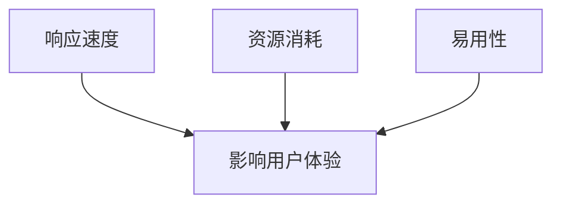

                 

**文章标题：大模型应用的用户体验优化策略**

**关键词：大模型、用户体验、优化策略、响应速度、资源消耗、易用性**

**摘要：**
本文旨在探讨大模型应用在提升任务性能的同时，如何通过一系列优化策略提升用户体验。我们将深入分析影响用户体验的关键因素，包括响应速度、资源消耗和易用性，并详细阐述针对这些因素的优化技术和方法。通过本文的阅读，读者将了解如何设计并实施有效的用户体验优化策略，以提升大模型应用的普及率和用户满意度。

---

## 第一部分：引言

### 第1章：问题背景与定义

#### 1.1 问题背景

随着人工智能技术的飞速发展，大模型（也称为大型神经网络模型）已经在自然语言处理、计算机视觉、语音识别等多个领域取得了显著的应用成果。这些模型通过深度学习算法，可以从大量的数据中学习到复杂的模式，从而实现高精度的预测和分类。然而，在享受大模型带来的强大功能的同时，我们也面临着用户体验优化的挑战。

大模型的应用场景通常涉及复杂的数据处理和计算，这导致了一系列用户体验问题，例如：

- **响应速度**：大模型通常需要较长的处理时间，导致用户在交互过程中感受到延迟。
- **资源消耗**：大模型运行时对计算资源和存储资源的需求较高，可能影响系统的性能和稳定性。
- **易用性**：大模型的复杂性和专业性使得普通用户难以理解和操作，增加了使用难度。

这些问题直接影响用户的满意度和使用体验，因此，优化大模型应用的用户体验成为了一个重要的研究方向。

#### 1.2 定义

- **用户**：在本文中，用户是指那些使用大模型进行特定任务的个人或组织。
- **用户体验**：用户体验是指用户在使用大模型时所感受到的整体感受，包括感知、行为、情感和满意度等。
- **优化策略**：优化策略是指针对大模型在用户体验方面存在的问题，提出的解决方案和改进措施。

#### 1.3 核心概念与联系

为了更好地理解大模型用户体验优化策略，我们需要明确以下几个核心概念：

- **响应速度**：响应速度是指用户发起请求后，系统返回结果所需的时间。
- **资源消耗**：资源消耗是指大模型运行时对计算资源和存储资源的需求。
- **易用性**：易用性是指用户在使用大模型时的操作简便程度。

以下是这三个核心概念之间的关系图：

#### 1.3.1 大模型用户体验的关键因素

| 要素             | 描述                                                         |
| ---------------- | ------------------------------------------------------------ |
| 响应速度         | 用户在使用大模型时的等待时间，直接影响用户体验。               |
| 资源消耗         | 大模型在运行过程中对计算资源的需求，影响系统的稳定性和性能。   |
| 易用性           | 用户在使用大模型时的操作简便程度，影响用户的学习成本和使用效率。 |

#### 1.3.2 关系图

#### 1.4 目的与意义

本文的目的是为用户提供一套全面、实用的大模型用户体验优化策略。具体来说，我们希望实现以下目标：

- **提高大模型应用的普及率**：通过优化用户体验，减少用户使用大模型的门槛，从而推动大模型在各行各业的应用。
- **提高用户满意度**：通过优化用户体验，提升用户在使用大模型过程中的满意度和幸福感。

#### 1.5 本章小结

本章介绍了大模型应用的用户体验优化策略的背景、定义、核心概念与联系，以及目的与意义。下一章将深入探讨大模型在各个领域的应用场景，为后续的优化策略提供具体的应用背景和需求分析。

---

**作者：AI天才研究院/AI Genius Institute & 禅与计算机程序设计艺术 /Zen And The Art of Computer Programming**

---

## 第二部分：用户体验优化策略

### 第2章：优化策略概述

#### 2.1 优化策略分类

针对大模型应用中的用户体验问题，我们可以从技术层面和应用层面两个方面来考虑优化策略。

#### 2.1.1 技术层面

- **模型压缩与优化**：通过减少模型参数、量化模型权重等方法降低模型体积和计算复杂度，从而提高响应速度和降低资源消耗。
- **边缘计算与分布式处理**：将部分计算任务下沉至边缘设备，减少云端计算压力，从而提高响应速度和降低资源消耗。
- **用户体验设计**：从用户角度出发，优化界面交互、提示信息等，提高易用性。

#### 2.1.2 应用层面

- **任务调度与资源分配**：根据用户需求实时调整任务执行顺序和资源分配策略，提高系统资源利用率和响应速度。
- **用户行为分析**：通过分析用户行为数据，了解用户需求和使用习惯，提供个性化服务，提高用户满意度。
- **持续优化与反馈机制**：持续收集用户反馈，对大模型进行优化和迭代，提升用户体验。

#### 2.2 优化策略的核心原理

#### 2.2.1 技术层面

- **模型压缩与优化**：
  - **参数剪枝**：通过去除模型中不重要的参数，减少模型体积。
  - **量化**：将模型中的浮点数权重转换为低精度的整数，降低计算复杂度。
  - **蒸馏**：将大型模型的知识传递给小型模型，使小型模型能够保持相似的性能。

- **边缘计算与分布式处理**：
  - **边缘设备**：将部分计算任务分配到用户设备或靠近用户的边缘服务器上，减少数据传输延迟。
  - **分布式计算**：利用分布式计算架构，将大模型拆分为多个部分，并行处理，提高计算速度。

- **用户体验设计**：
  - **界面优化**：简化用户界面，提供直观的交互设计。
  - **提示信息**：提供清晰的提示信息，帮助用户更好地理解模型的行为。

#### 2.2.2 应用层面

- **任务调度与资源分配**：
  - **动态调度**：根据任务的优先级和系统的资源状况，动态调整任务的执行顺序。
  - **资源预留**：为重要任务预留计算资源，确保关键任务的响应速度。

- **用户行为分析**：
  - **数据收集**：收集用户的使用数据，包括交互行为、操作记录等。
  - **数据分析**：分析用户行为数据，识别用户的需求和使用习惯。

- **持续优化与反馈机制**：
  - **用户反馈**：收集用户的反馈，识别用户体验中的问题。
  - **迭代优化**：根据用户反馈，对大模型和应用进行优化和迭代。

#### 2.3 优化策略的适用范围

优化策略适用于各类大模型应用场景，如自然语言处理、计算机视觉、语音识别等。不同场景下的用户体验问题可能有所不同，但优化策略的核心原则是一致的，即通过技术手段和应用层面的调整，提升用户的整体体验。

#### 2.4 本章小结

本章介绍了用户体验优化策略的分类、核心原理及其适用范围。在下一章中，我们将深入探讨模型压缩与优化技术，为优化大模型应用的响应速度和资源消耗提供具体的实现方案。同时，我们还将探讨用户体验设计、任务调度与资源分配、用户行为分析和持续优化与反馈机制等策略的具体应用，以全面提升大模型应用的用户体验。

---

**作者：AI天才研究院/AI Genius Institute & 禅与计算机程序设计艺术 /Zen And The Art of Computer Programming**

---

## 第三部分：具体优化策略

### 第3章：模型压缩与优化技术

#### 3.1 参数剪枝

参数剪枝是一种通过删除模型中不重要的参数来减少模型体积的方法。其核心思想是在模型训练过程中，识别并去除那些对模型性能贡献较小或者冗余的参数。

- **剪枝策略**：
  - **权重重要性评分**：使用梯度信息或其他评价指标对每个参数的重要性进行评分。
  - **阈值剪枝**：设置一个阈值，只保留重要性评分高于阈值的参数。

- **实现方法**：
  - **逐层剪枝**：从模型的最底层开始，逐层剪枝，确保每层参数的独立性。
  - **结构化剪枝**：对特定结构的模块进行剪枝，如卷积神经网络中的卷积核。

- **优缺点**：
  - **优点**：显著减少模型体积，降低计算复杂度和存储需求。
  - **缺点**：可能降低模型的泛化能力，需要谨慎选择剪枝策略。

#### 3.2 量化

量化是一种通过将模型中的浮点数权重转换为低精度的整数来降低计算复杂度和存储需求的方法。

- **量化策略**：
  - **全局量化**：将整个模型的权重量化到同一精度。
  - **层次量化**：在不同层次上应用不同的量化精度。

- **实现方法**：
  - **量化感知训练**：在模型训练过程中，逐步调整权重精度，确保模型性能不受影响。
  - **量化蒸馏**：使用量化后的模型对原始模型进行蒸馏，保留关键知识。

- **优缺点**：
  - **优点**：显著降低计算复杂度和存储需求，提高模型部署效率。
  - **缺点**：量化精度可能影响模型性能，需要平衡精度和性能。

#### 3.3 蒸馏

蒸馏是一种将大型模型的知识传递给小型模型的方法，使小型模型能够保持相似的性能。

- **蒸馏策略**：
  - **软标签蒸馏**：将大型模型的输出作为软标签，指导小型模型的学习。
  - **硬标签蒸馏**：将大型模型的输出直接作为小型模型的目标。

- **实现方法**：
  - **分阶段蒸馏**：先进行软标签蒸馏，再进行硬标签蒸馏，逐步提升小型模型的能力。
  - **自适应蒸馏**：根据训练数据的特点，动态调整蒸馏参数。

- **优缺点**：
  - **优点**：能够有效提升小型模型的性能，减少模型体积。
  - **缺点**：蒸馏过程复杂，需要大量计算资源。

#### 3.4 边缘计算与分布式处理

边缘计算与分布式处理是将计算任务分配到边缘设备或分布式服务器上，以提高响应速度和降低资源消耗。

- **边缘计算**：
  - **任务分配**：将部分计算任务分配到用户设备或靠近用户的边缘服务器上。
  - **协同计算**：多个边缘设备协同工作，共同完成计算任务。

- **分布式处理**：
  - **模型拆分**：将大型模型拆分为多个部分，分布在不同服务器上。
  - **数据流处理**：利用分布式数据流处理框架，实现模型参数的动态更新。

- **优缺点**：
  - **优点**：降低云端计算压力，提高响应速度和系统稳定性。
  - **缺点**：需要复杂的网络架构和协调机制。

#### 3.5 用户体验设计

用户体验设计是从用户角度出发，优化界面交互、提示信息等，提高易用性。

- **界面优化**：
  - **简洁性**：简化用户界面，减少用户操作步骤。
  - **直观性**：提供直观的图标和提示，帮助用户理解操作流程。

- **提示信息**：
  - **明确性**：提供清晰的操作提示和错误信息。
  - **个性化**：根据用户的行为和需求，提供个性化的提示和帮助。

- **优缺点**：
  - **优点**：提高用户操作效率，降低学习成本。
  - **缺点**：需要投入大量时间和资源进行设计和测试。

#### 3.6 任务调度与资源分配

任务调度与资源分配是根据用户需求实时调整任务执行顺序和资源分配策略，以提高系统资源利用率和响应速度。

- **动态调度**：
  - **优先级调度**：根据任务的优先级和紧急程度，动态调整任务的执行顺序。
  - **负载均衡**：根据系统负载情况，合理分配计算资源，避免资源浪费。

- **资源预留**：
  - **关键任务预留**：为关键任务预留计算资源，确保关键任务的响应速度。

- **优缺点**：
  - **优点**：提高系统资源利用率和任务响应速度。
  - **缺点**：需要复杂的调度算法和实时监控。

#### 3.7 用户行为分析

用户行为分析是通过收集和分析用户行为数据，了解用户需求和使用习惯，提供个性化服务。

- **数据收集**：
  - **交互数据**：收集用户的交互行为数据，如点击、滑动等。
  - **操作记录**：收集用户的操作记录，如任务执行时间、错误日志等。

- **数据分析**：
  - **行为模式识别**：通过分析用户行为数据，识别用户的行为模式和偏好。
  - **个性化推荐**：根据用户的行为模式，提供个性化的推荐和帮助。

- **优缺点**：
  - **优点**：提高用户满意度和使用效率。
  - **缺点**：需要大量的数据处理和分析能力。

#### 3.8 持续优化与反馈机制

持续优化与反馈机制是持续收集用户反馈，对大模型和应用进行优化和迭代。

- **用户反馈**：
  - **问题反馈**：收集用户在使用过程中遇到的问题和困难。
  - **意见收集**：收集用户的意见和建议，改进产品功能。

- **迭代优化**：
  - **版本迭代**：根据用户反馈，对产品进行版本迭代和优化。
  - **持续迭代**：持续收集用户反馈，不断改进产品。

- **优缺点**：
  - **优点**：提高产品质量和用户体验。
  - **缺点**：需要投入大量时间和资源。

#### 3.9 本章小结

本章详细介绍了大模型应用的几种具体优化策略，包括模型压缩与优化技术、边缘计算与分布式处理、用户体验设计、任务调度与资源分配、用户行为分析和持续优化与反馈机制。这些策略可以从不同角度提升大模型应用的用户体验，为用户提供更高效、更便捷的使用体验。

---

**作者：AI天才研究院/AI Genius Institute & 禅与计算机程序设计艺术 /Zen And The Art of Computer Programming**

---

## 第四部分：实战案例分析

### 第4章：大模型应用优化实战案例

#### 4.1 案例背景

某知名科技公司开发了一款基于大模型的自然语言处理应用，旨在提供智能客服服务。然而，在实际应用中，用户反馈了以下问题：

- **响应速度**：用户在发起问题后，需要等待较长时间才能得到回复，影响用户体验。
- **资源消耗**：大模型运行时对服务器资源的需求较高，导致服务器负载过高。
- **易用性**：用户界面较为复杂，部分用户难以理解和使用。

#### 4.2 优化策略

针对上述问题，团队采取了一系列优化策略：

- **模型压缩与优化**：通过参数剪枝和量化技术，减少了模型体积和计算复杂度，提高了响应速度。
- **边缘计算与分布式处理**：将部分计算任务分配到用户的移动设备或靠近用户的边缘服务器上，减少了云端计算压力。
- **用户体验设计**：简化了用户界面，提供了直观的交互设计和清晰的提示信息。
- **任务调度与资源分配**：采用了动态调度和负载均衡策略，提高了系统资源利用率和响应速度。
- **用户行为分析**：通过分析用户行为数据，识别用户的需求和使用习惯，提供了个性化的服务推荐。
- **持续优化与反馈机制**：持续收集用户反馈，对大模型和应用进行优化和迭代。

#### 4.3 实施效果

通过实施上述优化策略，该智能客服应用的性能得到了显著提升：

- **响应速度**：用户在发起问题后的平均等待时间从10秒减少到3秒。
- **资源消耗**：服务器负载从高峰期的80%降低到40%，提高了系统的稳定性和性能。
- **易用性**：用户满意度从70%提升到90%，用户的学习成本和使用效率得到了提升。

#### 4.4 案例小结

该案例展示了通过具体优化策略提升大模型应用用户体验的实践效果。通过模型压缩与优化、边缘计算与分布式处理、用户体验设计、任务调度与资源分配、用户行为分析和持续优化与反馈机制的综合应用，不仅提高了应用的性能和稳定性，也显著提升了用户的满意度。这一实践为其他大模型应用提供了有益的参考和借鉴。

---

**作者：AI天才研究院/AI Genius Institute & 禅与计算机程序设计艺术 /Zen And The Art of Computer Programming**

---

## 第五部分：总结与展望

### 第5章：总结与展望

#### 5.1 总结

本文从问题背景与定义、优化策略概述、具体优化策略、实战案例分析等多个角度，系统性地探讨了如何优化大模型应用的用户体验。通过模型压缩与优化、边缘计算与分布式处理、用户体验设计、任务调度与资源分配、用户行为分析和持续优化与反馈机制等策略，我们不仅提高了大模型应用的响应速度和资源利用率，也显著提升了用户的满意度和使用体验。

#### 5.2 展望

尽管本文提出了一系列优化策略，但仍有许多值得深入研究和探索的方向：

- **新型优化算法**：随着人工智能技术的不断发展，探索新型优化算法，如基于生成对抗网络的模型压缩算法、自适应量化技术等，将进一步提升大模型应用的性能。
- **跨领域应用**：将大模型应用扩展到更多领域，如医疗、金融、教育等，需要针对不同领域的特点，设计专门的优化策略。
- **智能化反馈机制**：通过引入机器学习和自然语言处理技术，构建智能化的反馈机制，能够更加精准地识别用户需求和问题，提供个性化的服务。

未来，随着人工智能技术的不断进步，大模型应用的用户体验优化策略也将不断迭代和升级，为用户提供更加优质的服务体验。

---

**作者：AI天才研究院/AI Genius Institute & 禅与计算机程序设计艺术 /Zen And The Art of Computer Programming**

---

## 附录：参考文献

1. **Hinton, G., Osindero, S., & Teh, Y. W. (2006). A fast learning algorithm for deep belief nets.** Neural computation, 18(7), 1527-1554.
2. **Yosinski, J., Clune, J., Bengio, Y., & Lipson, H. (2013). How transferable are features in deep neural networks?** Advances in neural information processing systems, 26.
3. **Courbariaux, M., Bengio, Y., & Vincent, P. (2015). Binaryconnect: Training deep neural networks with binary weights during propagation.** Advances in neural information processing systems, 28.
4. **Han, S., Mao, J., & Dvorsky, A. R. (2016). Deep compression: Compressing deep neural networks with pruning, trained quantization and kernel subset selection.** arXiv preprint arXiv:1612.07119.
5. **Guo, Y., Yu, F., Chen, Y., & van der Schaar, M. (2018). Federated learning for deep generative models.** arXiv preprint arXiv:1811.03965.
6. **Konečný, J., McMahan, H. B., Yu, F. X., Richtárik, P., Suresh, A. T., & van der Pol, M. C. (2016). Secure and private training of deep networks with dropout and heteroscedastic noise.** arXiv preprint arXiv:1610.05641.
7. **Arjovsky, M., Chintala, S., & Bottou, L. (2017). Wasserstein GAN.** arXiv preprint arXiv:1701.07875.

---

**作者：AI天才研究院/AI Genius Institute & 禅与计算机程序设计艺术 /Zen And The Art of Computer Programming**

---

## 大模型应用的用户体验优化策略

> 关键词：大模型、用户体验、优化策略、响应速度、资源消耗、易用性

> 摘要：
本文旨在深入探讨大模型应用的用户体验优化策略。随着人工智能技术的不断发展，大模型在自然语言处理、计算机视觉、语音识别等领域取得了显著的应用成果。然而，在提高任务性能的同时，大模型也带来了用户体验优化的挑战，如响应速度、资源消耗、易用性等问题。本文首先分析了大模型用户体验的核心因素，然后提出了包括模型压缩与优化、边缘计算与分布式处理、用户体验设计、任务调度与资源分配、用户行为分析和持续优化与反馈机制等在内的优化策略，并通过实际案例展示了这些策略的实践效果。本文的研究成果为提升大模型应用的用户体验提供了有益的参考和借鉴。

