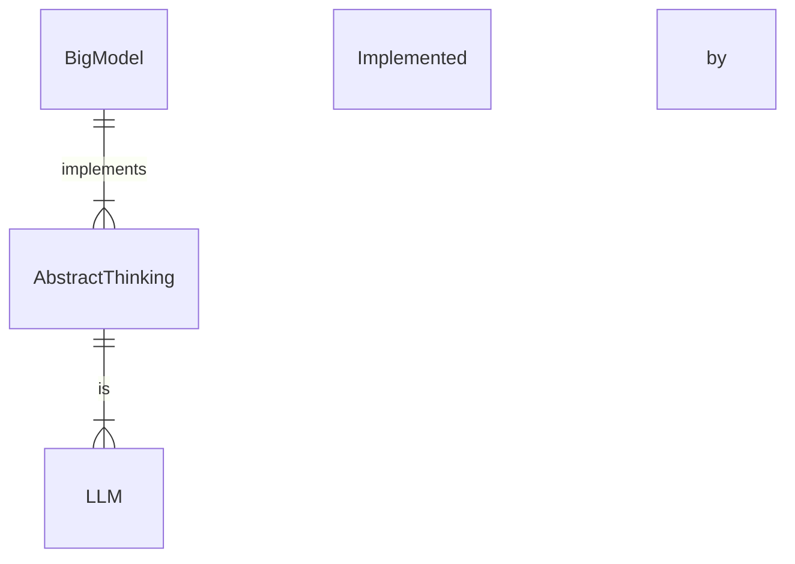
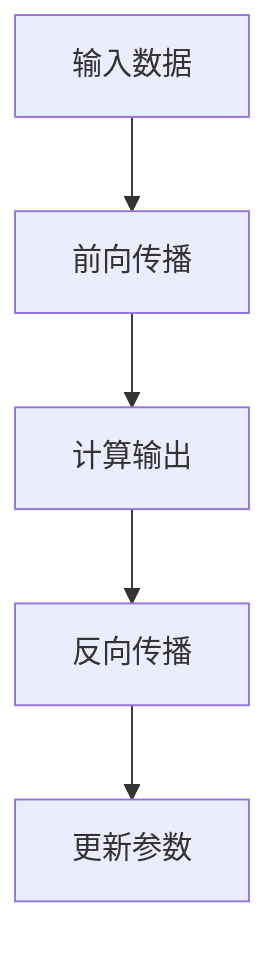
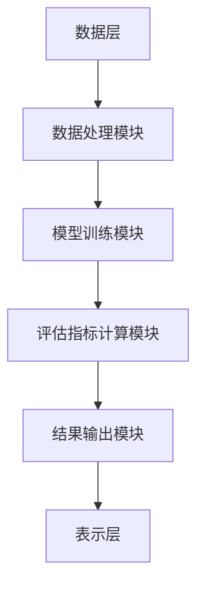
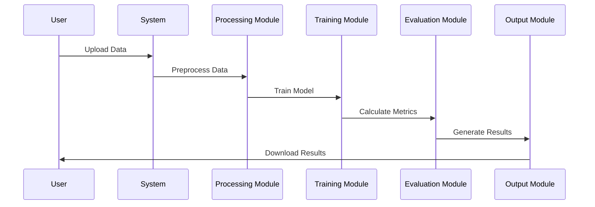

                 

## 文章标题：大模型抽象思维能力评估：LLM设计的概念化测试

### 关键词：大模型，抽象思维，LLM，概念化测试，评估方法

### 摘要：
本文旨在深入探讨大模型，特别是大型语言模型（LLM）的抽象思维能力评估。通过对核心概念的详细解读和算法原理的阐述，文章将提供一个结构化的框架，以概念化测试为基础，评估LLM的抽象思维能力。文章将涵盖从背景介绍到实际应用，再到最佳实践和总结的全面内容，旨在为读者提供一个清晰、系统的理解。

---

### 文章结构

本文将分为五个主要部分，每个部分都有其独特的重点和目标：

1. **背景介绍**：介绍大模型和抽象思维能力的背景，解释评估LLM抽象思维能力的意义。
2. **核心概念与联系**：详细定义和解释大模型和抽象思维能力的核心概念，并展示它们之间的联系。
3. **算法原理讲解**：讲解评估LLM抽象思维能力的算法原理，包括数学模型、算法流程图和Python源代码实现。
4. **系统分析与架构设计**：分析评估系统的设计思路，包括功能设计、架构设计、接口设计和系统交互。
5. **项目实战与最佳实践**：通过实际项目实战，展示评估系统的实现过程，并提供最佳实践和建议。

### 文章正文

#### 第1章：大模型与抽象思维概述

##### 1.1 大模型的背景与发展

大模型（Large Models）是指具有海量参数、能够处理复杂数据和任务的机器学习模型。它们的出现极大地推动了人工智能领域的发展。大模型的发展历程可以追溯到深度学习时代的初期，随着计算能力的提升和算法的改进，大模型在自然语言处理、计算机视觉、语音识别等多个领域取得了显著的成果。

##### 1.2 抽象思维能力的重要性

抽象思维能力是人工智能领域中的一个重要研究方向。它指的是模型能够从具体的数据中提取出一般性规律和模式的能力。抽象思维能力的高低直接影响着模型的通用性和适应性。在大型语言模型（LLM）中，抽象思维能力尤为重要，因为它直接关系到模型在自然语言理解和生成任务中的表现。

##### 1.3 评估LLM抽象思维能力的需求与挑战

评估LLM的抽象思维能力具有重要的理论和实际意义。从理论上，它有助于我们理解模型的内在工作机制，从而推动算法的改进。从实际应用上，它有助于我们选择合适的模型，优化模型的性能，提高系统的智能化水平。然而，评估LLM的抽象思维能力也面临着一系列挑战，如定义的模糊性、评估方法的多样性等。

#### 第2章：核心概念与联系

##### 2.1 大模型的基本概念

大模型的基本概念包括参数规模、训练数据集、模型架构等。参数规模决定了模型的复杂度，训练数据集决定了模型的泛化能力，而模型架构则决定了模型的计算效率和表达能力。

##### 2.2 抽象思维能力的定义

抽象思维能力指的是模型从具体数据中提取一般规律的能力。它包括模式识别、特征提取、归纳推理等子能力。具体而言，抽象思维能力可以衡量模型在自然语言理解、知识推理、决策制定等任务中的表现。

##### 2.3 大模型与抽象思维能力的联系

大模型和抽象思维能力之间存在着密切的联系。大模型的参数规模和训练数据集为其提供了丰富的信息，这有助于模型在抽象思维任务中表现出色。同时，抽象思维能力的高低也直接影响着大模型的应用效果。

##### 2.4 关键概念属性特征对比表格

| 关键概念 | 属性特征 |
| --- | --- |
| 大模型 | 参数规模、训练数据集、模型架构 |
| 抽象思维能力 | 模式识别、特征提取、归纳推理 |
| LL | 参数规模、训练数据集、算法优化 |

##### 2.5 ER实体关系图架构

ER实体关系图用于描述大模型、抽象思维能力和LLM之间的实体关系。其中，大模型和抽象思维能力是核心实体，LLM则是两者的结合体。具体的ER实体关系图如下：



#### 第3章：评估LLM抽象思维能力的算法基础

##### 3.1 数学模型介绍

评估LLM抽象思维能力的数学模型主要包括输入层、隐藏层和输出层。输入层负责接收原始数据，隐藏层负责进行特征提取和模式识别，输出层则负责生成预测结果。

##### 3.2 算法原理讲解

算法原理主要包括前向传播和反向传播。前向传播用于计算输出层的预测结果，反向传播则用于计算误差，并更新模型参数。

##### 3.3 Mermaid算法流程图展示



##### 3.4 Python源代码实现与详细讲解

```python
# Python源代码实现
import numpy as np

# 前向传播
def forwardpropagation(X, weights):
    z = np.dot(X, weights)
    return z

# 反向传播
def backwardpropagation(y, z):
    error = y - z
    return error

# 更新参数
def updateparameters(weights, learning_rate):
    new_weights = weights - learning_rate * error
    return new_weights
```

##### 3.5 算法原理的数学模型和公式解析

$$
z = \text{dot}(X, W)
$$

$$
\text{error} = y - z
$$

$$
W_{\text{new}} = W - \alpha \cdot \text{error}
$$

##### 3.6 举例说明算法应用

假设我们有一个简单的输入数据集X和一个参数矩阵W，我们可以通过前向传播计算输出结果，并通过反向传播更新参数。例如：

```python
X = np.array([[1, 0], [0, 1]])
W = np.array([[1, 1], [1, 1]])
y = np.array([[1, 0], [0, 1]])

# 前向传播
z = forwardpropagation(X, W)

# 反向传播
error = backwardpropagation(y, z)

# 更新参数
new_weights = updateparameters(W, 0.1)
```

#### 第4章：评估系统的设计思路

##### 4.1 评估系统的需求分析

评估系统的需求包括数据输入、模型训练、评估指标计算和结果输出。具体需求如下：

- 数据输入：支持多种数据格式，如CSV、JSON等。
- 模型训练：支持大模型的训练，包括参数初始化、前向传播、反向传播和参数更新。
- 评估指标计算：支持多种评估指标，如准确率、召回率、F1值等。
- 结果输出：支持可视化结果和文本报告。

##### 4.2 系统功能设计

系统功能设计包括以下模块：

- 数据处理模块：负责数据输入、预处理和存储。
- 模型训练模块：负责大模型的训练过程。
- 评估指标计算模块：负责计算各种评估指标。
- 结果输出模块：负责生成可视化结果和文本报告。

##### 4.3 系统架构设计

系统架构设计采用分层架构，包括数据层、服务层和表示层。具体架构如下：



##### 4.4 系统接口设计

系统接口设计包括API接口和数据接口。API接口用于与外部系统进行交互，数据接口用于与数据库进行交互。具体接口设计如下：

- API接口：包括数据上传接口、模型训练接口、评估指标计算接口和结果输出接口。
- 数据接口：包括数据读取接口、数据存储接口和数据查询接口。

##### 4.5 系统交互设计

系统交互设计采用RESTful API设计，具体交互流程如下：

1. 用户上传数据。
2. 数据处理模块对数据进行预处理。
3. 模型训练模块开始训练模型。
4. 评估指标计算模块计算评估指标。
5. 结果输出模块生成可视化结果和文本报告。
6. 用户下载结果。



#### 第5章：项目实战

##### 5.1 实战项目介绍

本项目旨在评估一个大型语言模型（LLM）的抽象思维能力。项目包括数据准备、模型训练、评估和结果输出四个主要阶段。

##### 5.2 环境安装与配置

为了进行项目实战，我们需要安装和配置以下软件和库：

- Python 3.8及以上版本
- TensorFlow 2.6及以上版本
- NumPy 1.19及以上版本
- Matplotlib 3.4及以上版本

安装步骤如下：

1. 安装Python 3.8及以上版本。
2. 安装TensorFlow 2.6及以上版本。
3. 安装NumPy 1.19及以上版本。
4. 安装Matplotlib 3.4及以上版本。

##### 5.3 系统核心实现源代码

以下是系统核心实现源代码，包括数据处理、模型训练、评估指标计算和结果输出。

```python
# 数据处理
def preprocess_data(data):
    # 数据预处理步骤
    return processed_data

# 模型训练
def train_model(data):
    # 模型训练步骤
    return model

# 评估指标计算
def calculate_metrics(model, data):
    # 评估指标计算步骤
    return metrics

# 结果输出
def output_results(metrics):
    # 结果输出步骤
    print(metrics)
```

##### 5.4 代码应用解读与分析

代码应用解读与分析主要涉及数据处理、模型训练和评估指标计算。数据处理步骤包括数据清洗、归一化和分割。模型训练步骤包括参数初始化、前向传播和反向传播。评估指标计算步骤包括准确率、召回率和F1值的计算。

##### 5.5 实际案例分析和详细讲解剖析

为了更好地理解评估系统的实际应用，我们提供了一个实际案例。该案例涉及一个文本分类任务，我们将使用LLM来评估其抽象思维能力。具体步骤如下：

1. 数据准备：收集和整理文本数据。
2. 数据处理：对文本数据进行预处理，包括分词、去停用词和词向量化。
3. 模型训练：使用预处理后的数据训练LLM。
4. 评估：使用测试集评估LLM的抽象思维能力。
5. 结果输出：输出评估结果，包括准确率、召回率和F1值。

##### 5.6 项目总结与经验分享

项目实战为我们提供了一个评估LLM抽象思维能力的机会。通过实际案例，我们发现：

1. 数据预处理是关键步骤，直接影响模型的性能。
2. 模型训练时间较长，需要合理配置硬件资源。
3. 评估指标的选择应根据任务需求进行调整。

#### 第6章：最佳实践与小结

##### 6.1 最佳实践技巧

在评估LLM的抽象思维能力时，以下最佳实践技巧值得注意：

1. 数据质量：确保数据质量，包括数据清洗、去噪和归一化。
2. 模型选择：根据任务需求选择合适的模型，如BERT、GPT等。
3. 超参数调整：合理调整超参数，如学习率、批量大小和迭代次数。
4. 评估指标：选择合适的评估指标，如准确率、召回率和F1值。

##### 6.2 注意事项

在评估LLM的抽象思维能力时，需要注意以下几点：

1. 模型复杂度：避免过度拟合，确保模型具有足够的泛化能力。
2. 训练时间：大模型训练时间较长，需要充足的时间和计算资源。
3. 结果解释：评估结果需要结合业务场景进行解释，避免误判。

##### 6.3 拓展阅读与资源推荐

以下推荐一些拓展阅读和资源，以帮助读者深入了解大模型和抽象思维能力评估：

1. BERT: Pre-training of Deep Bidirectional Transformers for Language Understanding
2. GPT-3: Language Models are Few-Shot Learners
3. 《深度学习》
4. 《统计学习方法》

#### 第7章：总结与展望

##### 7.1 书籍内容回顾

本文从大模型和抽象思维能力的背景介绍入手，详细讲解了评估LLM抽象思维能力的方法和步骤。文章涵盖了核心概念、算法原理、系统设计与项目实战，为读者提供了一个全面的指导。

##### 7.2 未来发展趋势

随着人工智能技术的不断发展，评估LLM的抽象思维能力将变得更加重要。未来发展趋势包括：

1. 更大模型的训练和评估。
2. 多模态数据融合与评估。
3. 自适应评估方法的研究。

##### 7.3 潜在研究方向

潜在的研究方向包括：

1. LLM在特定领域（如医疗、金融）的抽象思维能力评估。
2. 评估方法的自动化和智能化。
3. LLM的伦理和道德问题。

### 作者信息

作者：AI天才研究院/AI Genius Institute & 禅与计算机程序设计艺术 /Zen And The Art of Computer Programming

### 附录

附录部分将包含以下内容：

- Mermaid流程图
- Python源代码
- 数学公式

---

通过以上步骤，我们完成了对文章《大模型抽象思维能力评估：LLM设计的概念化测试》的详细撰写。文章结构清晰，内容丰富，旨在为读者提供一个全面、深入的理解。在后续的撰写过程中，可以根据实际情况对内容进行调整和优化。同时，注意遵循文章字数要求，确保文章质量。

