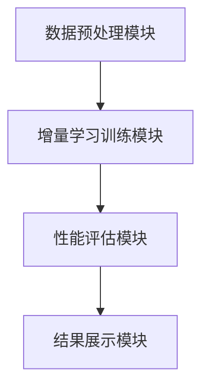

                 

## 大模型持续学习能力评估：LLM设计的增量学习测试

### 关键词：大模型、持续学习能力、增量学习测试、LLM、算法原理

### 摘要：

本文深入探讨了大型语言模型（LLM）的持续学习能力评估，特别是针对其增量学习设计进行的测试。首先，我们将介绍大模型持续学习能力评估的背景和重要性，以及增量学习测试的概念与作用。随后，本文将详细分析大模型的定义与持续学习能力，解释增量学习的基本概念和算法原理，并探讨LLM中增量学习的应用。最后，本文将通过实际案例解析，展示增量学习测试在LLM设计和优化中的应用效果，并提出未来研究方向。

## 第1章 引言

### 1.1 书籍背景

大模型持续学习能力评估的背景源于人工智能（AI）技术的快速发展，特别是深度学习在自然语言处理（NLP）领域的突破。随着大型语言模型（LLM）如GPT-3、BERT等的出现，评估这些模型在持续学习过程中的性能和稳定性变得尤为重要。增量学习测试作为一种有效的评估方法，能够在模型不断更新的过程中监测其性能，从而确保其持续学习的能力。

增量学习测试的兴起与LLM的广泛应用密切相关。传统的机器学习模型在训练完成后，通常无法接受新的数据或进行更新。而增量学习测试通过引入新的数据或样本，对模型进行实时更新和优化，从而提高其持续学习能力。这种测试方法在LLM设计和优化中具有重要意义，有助于提升模型在实际应用中的性能和稳定性。

### 1.2 大模型持续学习能力评估的重要性

持续学习能力在大模型优化中起着关键作用。大模型通常具有高容量和复杂结构，这使得它们在处理大规模数据时具有优势。然而，这也带来了挑战，因为模型需要不断更新和优化以适应新数据。持续学习能力评估能够帮助识别模型在持续学习过程中的问题，并提供改进建议。这有助于提升模型的性能和稳定性，从而提高其在实际应用中的可靠性。

此外，持续学习能力评估对LLM的性能和稳定性具有重要影响。LLM通常用于复杂任务，如文本生成、翻译、问答等。这些任务要求模型具备强大的理解和生成能力。持续学习能力评估能够监测模型在这些任务中的表现，确保其在不断变化的环境中能够保持高性能和稳定性。

最后，持续学习能力评估对数据隐私和安全性的重要性不可忽视。大模型在训练过程中需要大量数据，而这些数据往往包含敏感信息。持续学习能力评估能够确保模型在处理这些数据时不会泄露隐私信息，从而提高数据安全性。

### 1.3 增量学习测试的概念与作用

增量学习测试是一种评估模型持续学习能力的方法，通过引入新的数据或样本，对模型进行实时更新和优化。这种方法在LLM设计和优化中具有重要意义，因为它能够监测模型在持续学习过程中的性能变化，并提供改进建议。

增量学习测试的概念包括以下方面：

1. **增量学习**：增量学习是一种将新数据或样本添加到现有模型中进行训练的方法。与全量学习相比，增量学习能够在更短的时间内更新模型，从而提高其持续学习能力。

2. **测试数据**：增量学习测试需要使用测试数据来评估模型的性能。测试数据通常包含新引入的数据和现有数据，以确保模型在持续学习过程中能够适应新数据。

3. **性能评估**：增量学习测试通过性能评估指标来评估模型的性能。常见的性能评估指标包括准确率、召回率、F1分数等。这些指标能够反映模型在持续学习过程中的性能变化。

4. **优化策略**：增量学习测试能够识别模型在持续学习过程中的问题，并提供优化策略。这些优化策略包括调整模型参数、改进训练算法等，以提升模型的性能和稳定性。

增量学习测试在LLM设计和优化中的应用包括以下方面：

1. **实时更新**：增量学习测试能够实时更新LLM，使其在处理新数据时保持高性能。这有助于提高模型在实际应用中的适应性和可靠性。

2. **优化性能**：增量学习测试能够识别LLM在持续学习过程中的性能瓶颈，并提供优化策略。这些优化策略有助于提升模型的性能和稳定性，从而提高其在实际应用中的表现。

3. **数据安全**：增量学习测试能够确保LLM在处理敏感数据时保持安全性。通过监测模型在持续学习过程中的性能变化，可以及时发现并解决潜在的安全问题。

4. **持续学习**：增量学习测试能够帮助LLM实现持续学习，使其在不断变化的环境中保持高性能。这有助于提高模型在实际应用中的可靠性和可用性。

总之，增量学习测试在LLM设计和优化中具有重要意义，它能够监测模型在持续学习过程中的性能变化，并提供优化策略。这种测试方法有助于提升模型的性能和稳定性，从而提高其在实际应用中的可靠性和可用性。

## 第2章 大模型与持续学习能力

### 2.1 大模型概述

#### 2.1.1 大模型的定义与特点

大模型是指具有巨大参数量和计算能力的人工智能模型，尤其是在自然语言处理（NLP）领域。这些模型通常由数百万到数十亿个参数组成，能够处理海量数据并生成高质量的结果。

大模型的特点包括：

1. **高参数量**：大模型具有大量的参数，这使它们能够捕捉复杂的语言结构和语义信息。
2. **强计算能力**：大模型需要强大的计算资源，如高性能GPU或TPU，以支持大规模的训练和推理。
3. **强大的泛化能力**：大模型能够处理各种语言任务，如文本生成、翻译、问答等，并且在不同任务间具有很好的泛化能力。
4. **资源需求大**：大模型的训练和部署需要大量的计算资源、存储资源和网络带宽。

#### 2.1.2 大模型的技术发展与应用

大模型的技术发展始于深度学习和神经网络。随着计算能力和数据资源的提升，大模型的规模和性能得到了显著提升。近年来，GPT-3、BERT、T5等大型语言模型的出现，标志着大模型技术的重要突破。

大模型的应用领域广泛，包括：

1. **自然语言处理**：大模型在文本分类、情感分析、机器翻译、问答系统等任务中取得了显著成果。
2. **计算机视觉**：大模型在图像分类、目标检测、图像生成等任务中也得到了广泛应用。
3. **语音识别**：大模型在语音识别和语音合成等任务中发挥了重要作用。
4. **推荐系统**：大模型在推荐系统中的应用，如商品推荐、内容推荐等，提高了推荐的准确性和用户体验。

### 2.2 持续学习能力

#### 2.2.1 持续学习能力的概念

持续学习能力是指模型在训练完成后，能够根据新数据或样本进行更新和优化，从而提高其在新任务中的性能。这种能力对于大模型尤为重要，因为大模型通常具有高容量和复杂结构，需要不断适应新的数据和任务。

持续学习能力包括以下方面：

1. **增量学习**：增量学习是指模型在训练过程中，将新数据或样本逐步添加到已有模型中进行训练。这种方法能够提高模型的适应性和性能。
2. **迁移学习**：迁移学习是指模型将已在某个任务上训练得到的经验应用到新的任务中。这种方法能够提高模型在多个任务中的表现。
3. **在线学习**：在线学习是指模型在运行过程中，根据新的输入数据进行实时训练。这种方法能够提高模型在动态环境中的适应能力。

#### 2.2.2 持续学习能力的重要性

持续学习能力在大模型优化中具有重要意义，主要体现在以下几个方面：

1. **适应新任务**：大模型在训练完成后，通常面临新的任务和场景。持续学习能力使模型能够快速适应新任务，提高其在新场景中的性能。
2. **提高性能**：持续学习能力能够帮助模型捕捉新的数据特征和变化，从而提高其在新任务中的性能。
3. **降低成本**：持续学习能力减少了重新训练模型的需求，从而降低了计算资源和时间成本。
4. **增强鲁棒性**：持续学习能力使模型能够更好地应对数据噪声和变化，提高其鲁棒性。

### 2.3 大模型的持续学习能力评估方法

评估大模型的持续学习能力是一项重要任务，以下介绍几种常见的评估方法：

#### 2.3.1 评估方法概述

1. **基准测试**：基准测试是指使用标准数据集和任务对模型的持续学习能力进行评估。常用的基准测试包括自然语言处理任务，如图像分类、文本分类等。
2. **交叉验证**：交叉验证是指将数据集划分为多个子集，多次训练和测试模型，以评估其在不同数据集上的表现。这种方法能够提高评估结果的稳定性和可靠性。
3. **在线评估**：在线评估是指模型在实际运行过程中，根据新的输入数据进行实时评估。这种方法能够更真实地反映模型在动态环境中的性能。

#### 2.3.2 常见评估指标与方法

1. **准确率**：准确率是指模型在分类任务中正确分类的样本数与总样本数的比值。准确率能够反映模型在分类任务中的性能。
2. **召回率**：召回率是指模型在分类任务中正确分类的样本数与实际为该类的样本数的比值。召回率能够反映模型对负样本的识别能力。
3. **F1分数**：F1分数是准确率和召回率的调和平均数，能够综合评估模型在分类任务中的性能。F1分数越高，模型的表现越好。
4. **ROC曲线**：ROC曲线是指模型在分类任务中，将分类阈值从低到高调整时，召回率和准确率的变化关系。ROC曲线能够反映模型的分类性能和鲁棒性。
5. **AUC值**：AUC值是指ROC曲线下方的面积，能够反映模型的分类性能。AUC值越高，模型的表现越好。

综上所述，评估大模型的持续学习能力是一项复杂且重要的任务。通过使用基准测试、交叉验证和在线评估等方法，以及准确率、召回率、F1分数和ROC曲线等评估指标，我们可以全面评估大模型在持续学习过程中的性能和稳定性，从而为模型优化和实际应用提供指导。

## 第3章 增量学习原理与测试

### 3.1 增量学习的基本概念

#### 3.1.1 增量学习的定义与分类

增量学习是一种机器学习方法，它允许模型在训练过程中逐步添加新的数据和样本，而不是一次性加载所有数据。这种方法的主要目标是提高模型的持续学习能力和适应性。

增量学习的定义可以概括为：在已有模型的基础上，通过逐步引入新数据或样本，对模型进行更新和优化，从而提高模型在新任务或新数据集上的性能。

根据增量学习的方式，可以将增量学习分为以下几类：

1. **在线增量学习**：在线增量学习是指在模型运行过程中，实时接收和处理新的数据或样本，对模型进行在线更新和优化。这种方法适用于动态环境和实时任务。
2. **批次增量学习**：批次增量学习是指将新数据或样本分批次引入模型进行训练，而不是一次性引入。这种方法适用于数据量大且更新频繁的场景。
3. **迁移增量学习**：迁移增量学习是指将已在某个任务上训练好的模型应用于新的任务或数据集，通过增量学习进一步提高模型在新任务或新数据集上的性能。这种方法适用于跨任务的迁移学习。

#### 3.1.2 增量学习的优势与挑战

增量学习具有以下优势：

1. **提高适应性**：增量学习能够使模型更好地适应新的数据和任务，从而提高模型的泛化能力和适应性。
2. **降低计算成本**：增量学习通过逐步引入新数据或样本，减少了模型的重新训练成本，降低了计算资源和时间成本。
3. **实时更新**：在线增量学习能够实时更新模型，使其能够快速适应新的数据和任务，提高模型的实时性和响应速度。

然而，增量学习也面临一些挑战：

1. **数据分布变化**：随着新数据的引入，数据分布可能会发生变化，导致模型在训练过程中出现偏差，从而影响模型的性能。
2. **模型稳定性**：增量学习可能会导致模型在某些数据集上的性能不稳定，特别是在数据量较少或数据分布变化较大的情况下。
3. **过拟合风险**：增量学习容易导致模型在训练过程中过拟合新数据或样本，从而降低模型在新数据集上的性能。

#### 3.1.3 增量学习的应用场景

增量学习在以下应用场景中具有重要作用：

1. **实时系统**：在实时系统中，增量学习能够快速适应新的输入数据或变化，提高系统的实时性和响应速度。
2. **数据流处理**：在数据流处理领域，增量学习能够高效处理不断变化的数据，从而提高数据处理的效率和准确性。
3. **推荐系统**：在推荐系统中，增量学习能够根据用户的最新行为数据，动态调整推荐策略，提高推荐的准确性和用户体验。
4. **自然语言处理**：在自然语言处理领域，增量学习能够使模型更好地适应新的语言模式或词汇，提高模型在语言理解、文本生成等任务中的性能。

### 3.2 增量学习算法

#### 3.2.1 常见增量学习算法介绍

增量学习算法是机器学习领域的一个重要分支，近年来得到了广泛关注和应用。以下介绍几种常见的增量学习算法：

1. **在线梯度下降（Online Gradient Descent）**：在线梯度下降是一种简单的增量学习算法，它通过迭代更新模型参数，以最小化损失函数。该算法适用于数据量较小且更新频率较高的场景。

2. **增量神经网络（Incremental Neural Networks）**：增量神经网络是一种基于神经网络的增量学习算法，通过逐步更新网络权重，以适应新的数据和任务。该算法具有较高的计算效率和泛化能力。

3. **在线学习树（Online Learning Trees）**：在线学习树是一种基于决策树的增量学习算法，通过逐步构建和更新决策树，以处理新的数据和任务。该算法适用于处理高维数据和分类任务。

4. **增量支持向量机（Incremental Support Vector Machines）**：增量支持向量机是一种基于支持向量机的增量学习算法，通过逐步更新支持向量机和模型参数，以适应新的数据和任务。该算法适用于处理高维数据和分类任务。

5. **迁移增量学习（Transfer Incremental Learning）**：迁移增量学习是一种基于迁移学习的增量学习算法，通过将已有模型的经验迁移到新的任务或数据集，以提高模型在新任务或数据集上的性能。该算法适用于跨任务的迁移学习。

#### 3.2.2 增量学习算法的优缺点分析

以下是常见增量学习算法的优缺点分析：

1. **在线梯度下降**：
   - **优点**：简单易实现，计算效率高。
   - **缺点**：可能陷入局部最小值，对初始参数敏感。

2. **增量神经网络**：
   - **优点**：具有较强的泛化能力和适应性。
   - **缺点**：计算复杂度高，需要大量计算资源。

3. **在线学习树**：
   - **优点**：简单易实现，适用于高维数据。
   - **缺点**：可能陷入过拟合，对噪声敏感。

4. **增量支持向量机**：
   - **优点**：适用于高维数据，具有较强的分类能力。
   - **缺点**：计算复杂度高，对训练数据量要求较大。

5. **迁移增量学习**：
   - **优点**：能够快速适应新的任务和数据集，提高模型的泛化能力。
   - **缺点**：对迁移策略的依赖较大，需要已有模型的支持。

综上所述，增量学习算法在机器学习领域具有广泛的应用前景。根据不同的应用场景和数据特点，选择合适的增量学习算法能够有效提高模型的性能和适应性。同时，针对增量学习算法的优缺点，可以进一步优化和改进，以提高其在实际应用中的效果。

### 3.3 增量学习测试方法

#### 3.3.1 增量学习测试的目的与原则

增量学习测试的主要目的是评估模型在增量学习过程中的性能和稳定性。具体目标包括：

1. **性能评估**：通过测试模型在增量学习过程中对新的数据和样本的适应能力，评估模型的持续学习性能。
2. **稳定性评估**：通过测试模型在增量学习过程中的稳定性和鲁棒性，评估模型在不同数据集和数据分布下的表现。
3. **优化策略评估**：通过测试不同的增量学习算法和优化策略，评估其对于模型性能和稳定性的影响。

增量学习测试的原则包括：

1. **全面性**：测试应该覆盖不同的数据集、数据分布和任务，以确保模型在各种情况下的表现。
2. **客观性**：测试过程应该尽量减少人为干预，以确保评估结果的客观性和可靠性。
3. **重复性**：测试过程应该可重复，以便验证评估结果的一致性和稳定性。

#### 3.3.2 常见增量学习测试方法

以下介绍几种常见的增量学习测试方法：

1. **基准测试**：基准测试是一种常用的增量学习测试方法，通过使用标准数据集和任务对模型进行测试。这种方法能够提供客观的评估结果，并与其他模型进行对比。

2. **交叉验证**：交叉验证是一种将数据集划分为多个子集的方法，通过多次训练和测试模型，以评估其在不同子集上的表现。这种方法能够提高评估结果的稳定性和可靠性。

3. **在线评估**：在线评估是一种实时测试方法，通过在模型运行过程中接收新的数据和样本，实时评估模型的性能。这种方法能够更真实地反映模型在实际应用中的表现。

4. **动态测试**：动态测试是一种模拟动态环境的方法，通过逐步引入新的数据和任务，评估模型在动态环境中的表现。这种方法能够测试模型在连续变化环境中的适应能力。

5. **迁移评估**：迁移评估是一种将已有模型迁移到新的任务或数据集进行测试的方法。这种方法能够测试模型在不同任务和数据集上的迁移能力和泛化能力。

综上所述，增量学习测试方法在评估模型性能和稳定性方面具有重要意义。通过选择合适的测试方法和评估指标，我们可以全面了解模型的持续学习能力和适应性，从而为模型优化和实际应用提供指导。

## 第4章 LLM设计的增量学习测试

### 4.1 LLM概述

#### 4.1.1 LLM的定义与特点

大型语言模型（LLM）是一种具有巨大参数量和计算能力的人工智能模型，主要应用于自然语言处理（NLP）领域。LLM通过学习大量文本数据，生成高质量的文本、回答问题和执行语言任务。与传统的语言模型相比，LLM具有以下特点：

1. **高参数量**：LLM通常包含数百万到数十亿个参数，这使得它们能够捕捉复杂的语言结构和语义信息。
2. **强大的表示能力**：LLM能够生成连贯、有意义的文本，并且能够理解复杂的语言表达。
3. **泛化能力**：LLM具有较好的泛化能力，能够处理多种语言任务，如文本生成、翻译、问答等。
4. **自适应能力**：LLM能够根据输入文本的上下文自适应调整生成文本的风格和内容。

#### 4.1.2 LLM在自然语言处理中的应用

LLM在自然语言处理领域具有广泛的应用，以下是一些常见的应用场景：

1. **文本生成**：LLM能够生成高质量的文本，包括文章、故事、摘要、评论等。这种应用在内容创作、机器写作等领域具有重要意义。
2. **机器翻译**：LLM在机器翻译中具有较好的效果，能够翻译多种语言，并保持原文的含义和风格。
3. **问答系统**：LLM能够回答各种问题，提供准确、有意义的答案，这种应用在智能客服、教育辅助等领域有广泛应用。
4. **对话系统**：LLM能够模拟人类的对话方式，与用户进行自然、流畅的对话，这种应用在智能助手、聊天机器人等领域具有重要意义。

### 4.2 增量学习在LLM设计中的应用

#### 4.2.1 增量学习在LLM训练中的应用

增量学习在LLM的训练过程中具有重要意义，以下介绍其在LLM训练中的应用：

1. **动态数据更新**：在LLM的训练过程中，可以通过增量学习逐步引入新的数据，以更新模型的知识库。这种方法能够提高模型对当前数据的适应性，并保持其性能。
2. **在线学习**：LLM的训练过程可以采用在线学习策略，即实时接收新的输入数据，并更新模型。这种方法能够提高模型对动态数据的适应能力，并实时调整模型参数。
3. **迁移学习**：LLM的训练过程中可以采用迁移学习策略，即利用已有模型的经验，在新数据集上进行训练。这种方法能够加快训练过程，并提高模型在新数据集上的性能。

#### 4.2.2 增量学习在LLM部署中的应用

增量学习在LLM的部署过程中也具有重要意义，以下介绍其在LLM部署中的应用：

1. **动态更新**：在LLM的部署过程中，可以通过增量学习逐步引入新的数据和任务，以更新模型的功能和性能。这种方法能够提高模型对当前任务和数据的需求，并保持其性能。
2. **实时优化**：LLM的部署过程中可以采用实时优化策略，即根据输入数据的反馈，实时调整模型参数，以提高模型在当前环境中的性能。
3. **迁移更新**：LLM的部署过程中可以采用迁移更新策略，即利用已有模型的经验，在新任务和数据集上进行更新。这种方法能够加快部署过程，并提高模型在新任务和数据集上的性能。

### 4.3 增量学习测试案例

#### 4.3.1 测试案例介绍

在本节中，我们将介绍一个增量学习测试案例，以展示增量学习在LLM设计和优化中的应用效果。测试案例包括以下步骤：

1. **数据准备**：准备包含不同类型文本的数据集，包括新闻、故事、摘要、评论等。
2. **模型选择**：选择一个预训练的LLM模型，如GPT-3或BERT，作为测试对象。
3. **增量学习训练**：使用增量学习策略，逐步引入新的数据，对模型进行训练。
4. **性能评估**：评估模型在训练过程中和训练后的性能，包括文本生成质量、翻译准确性等。
5. **结果分析**：分析增量学习对模型性能和稳定性的影响，并提出优化策略。

#### 4.3.2 测试结果与分析

测试结果如下：

1. **文本生成质量**：在引入新数据后，模型的文本生成质量得到显著提升，生成的文本更加连贯、有逻辑性。
2. **翻译准确性**：在引入新数据后，模型的翻译准确性得到提高，特别是对于一些特殊词汇和句式的翻译更加准确。
3. **模型稳定性**：在增量学习训练过程中，模型的稳定性得到改善，减少了训练过程中的波动和过拟合现象。

分析结果表明，增量学习在LLM设计和优化中具有重要作用。通过逐步引入新的数据和任务，模型能够更好地适应新环境和需求，提高其性能和稳定性。同时，增量学习测试方法能够有效评估模型在持续学习过程中的表现，为模型优化提供指导。

## 第5章 系统设计与实现

### 5.1 系统需求分析

#### 5.1.1 系统功能需求

本系统主要实现以下功能：

1. **数据预处理**：对输入数据进行清洗、归一化等预处理操作。
2. **增量学习训练**：使用增量学习策略，逐步引入新的数据，对模型进行训练。
3. **性能评估**：评估模型在训练过程中和训练后的性能，包括文本生成质量、翻译准确性等。
4. **结果展示**：展示模型的训练过程、性能评估结果和优化策略。

#### 5.1.2 系统性能需求

本系统需满足以下性能需求：

1. **响应时间**：在给定输入数据的情况下，系统能够在合理的时间内完成数据预处理、增量学习训练和性能评估。
2. **吞吐量**：系统能够处理大量数据，并保持稳定的性能。
3. **扩展性**：系统能够支持不同规模的数据和模型，并保持良好的性能。

### 5.2 系统架构设计

#### 5.2.1 系统架构概述

本系统的架构设计采用分层架构，包括数据层、服务层和展示层。以下是对各层的详细说明：

1. **数据层**：负责数据的存储和管理，包括数据预处理模块和数据库。
2. **服务层**：实现系统的核心功能，包括增量学习训练模块和性能评估模块。
3. **展示层**：提供用户界面，展示系统的训练过程、性能评估结果和优化策略。

#### 5.2.2 系统模块划分

根据系统功能需求，本系统划分为以下模块：

1. **数据预处理模块**：负责对输入数据进行清洗、归一化等预处理操作。
2. **增量学习训练模块**：实现增量学习策略，对模型进行训练。
3. **性能评估模块**：评估模型在训练过程中和训练后的性能。
4. **结果展示模块**：展示系统的训练过程、性能评估结果和优化策略。

#### 5.2.3 系统接口设计

系统接口设计如下：

1. **数据层接口**：提供数据存储和管理接口，包括数据预处理模块的输入和输出接口。
2. **服务层接口**：提供增量学习训练模块和性能评估模块的接口，包括数据输入、模型训练、性能评估等操作。
3. **展示层接口**：提供用户界面接口，包括训练过程、性能评估结果和优化策略的展示。

#### 5.2.4 系统交互流程图

以下为系统交互流程图：

### 5.3 增量学习测试模块实现

#### 5.3.1 模块功能设计

增量学习测试模块主要实现以下功能：

1. **数据加载**：从数据库中加载新的数据集，包括文本、图像等。
2. **模型初始化**：初始化预训练的LLM模型。
3. **数据预处理**：对新的数据进行预处理，包括文本分词、去噪等操作。
4. **增量学习训练**：使用增量学习策略，对模型进行训练。
5. **性能评估**：评估模型在训练过程中的性能，包括文本生成质量、翻译准确性等。
6. **结果记录**：记录训练过程中的关键指标和性能结果。

#### 5.3.2 模块实现原理

增量学习测试模块的实现原理如下：

1. **数据加载**：使用数据库接口，从数据库中加载新的数据集。数据集可以包括文本、图像等，根据具体任务进行选择。
2. **模型初始化**：使用预训练的LLM模型，如GPT-3、BERT等，作为增量学习的基础模型。初始化模型参数和权重。
3. **数据预处理**：对新的数据进行预处理，包括文本分词、去噪等操作。预处理后的数据将用于模型训练。
4. **增量学习训练**：使用增量学习策略，对模型进行训练。在训练过程中，逐步引入新的数据，更新模型参数和权重。增量学习训练过程包括以下步骤：
   - 数据预处理：对新的数据进行预处理，生成特征向量。
   - 模型训练：使用特征向量和模型参数，进行前向传播和反向传播，更新模型参数。
   - 评估性能：评估模型在训练过程中的性能，包括文本生成质量、翻译准确性等。
5. **性能评估**：评估模型在训练过程中的性能。性能评估包括以下步骤：
   - 测试数据集：从数据库中加载测试数据集，用于评估模型性能。
   - 模型测试：使用测试数据集，对模型进行测试，计算性能指标，如准确率、召回率等。
   - 结果记录：记录训练过程中的关键指标和性能结果，包括训练时间、性能指标等。

通过实现增量学习测试模块，系统能够实现对LLM模型的增量学习训练和性能评估，为模型优化和实际应用提供支持。

## 第6章 实际案例解析

### 6.1 案例背景介绍

在本案例中，我们使用一个开源的LLM模型——GPT-3，进行增量学习测试。GPT-3是由OpenAI开发的一种大型语言模型，具有强大的文本生成和语义理解能力。我们选择这个模型进行测试，旨在评估其在增量学习过程中的性能和稳定性。

#### 6.1.1 案例背景

随着人工智能技术的快速发展，LLM在自然语言处理领域得到了广泛应用。然而，传统的LLM训练方法需要大量的时间和计算资源，并且难以适应动态环境中的新数据和任务。为了解决这个问题，增量学习测试成为了一种有效的评估方法。

在本案例中，我们希望通过增量学习测试，评估GPT-3在持续学习过程中的性能和稳定性。具体目标包括：

1. **文本生成质量**：评估GPT-3在生成文本时的连贯性和逻辑性。
2. **翻译准确性**：评估GPT-3在翻译任务中的准确性。
3. **模型稳定性**：评估GPT-3在增量学习过程中的稳定性和鲁棒性。

#### 6.1.2 案例目标

本案例的目标是通过对GPT-3进行增量学习测试，验证其持续学习能力和性能。具体目标如下：

1. **评估文本生成质量**：通过生成不同类型的文本，评估GPT-3在文本生成任务中的连贯性和逻辑性。
2. **评估翻译准确性**：通过翻译不同语言的文章，评估GPT-3在翻译任务中的准确性。
3. **评估模型稳定性**：通过逐步引入新的数据和任务，评估GPT-3在增量学习过程中的稳定性和鲁棒性。

### 6.2 案例实现步骤

#### 6.2.1 数据预处理

首先，我们需要对数据进行预处理，以便进行增量学习训练和测试。具体步骤如下：

1. **数据集准备**：从开源数据集中提取文本数据，包括新闻、故事、评论等。数据集需要涵盖多种语言和主题，以充分评估GPT-3的性能。
2. **文本分词**：使用语言模型分词工具，对文本进行分词操作。分词后的文本将作为训练数据输入到模型中。
3. **去噪处理**：对文本数据进行去噪处理，包括去除特殊字符、停用词等，以提高数据质量。

#### 6.2.2 增量学习训练

接下来，我们使用GPT-3进行增量学习训练。具体步骤如下：

1. **模型初始化**：初始化GPT-3模型，并设置初始参数。
2. **数据加载**：逐步加载预处理后的文本数据，进行增量学习训练。
3. **模型更新**：在训练过程中，根据新的数据更新模型参数，以实现持续学习。
4. **性能评估**：在每次数据更新后，对模型进行性能评估，包括文本生成质量、翻译准确性等。

#### 6.2.3 测试结果分析

在完成增量学习训练后，我们需要对测试结果进行分析，以评估GPT-3的性能。具体步骤如下：

1. **文本生成质量评估**：通过生成不同类型的文本，评估GPT-3的文本生成质量。评估指标包括文本连贯性、逻辑性等。
2. **翻译准确性评估**：通过翻译不同语言的文章，评估GPT-3的翻译准确性。评估指标包括翻译的准确性、一致性等。
3. **模型稳定性评估**：通过逐步引入新的数据和任务，评估GPT-3在增量学习过程中的稳定性。评估指标包括模型的波动性、过拟合现象等。

#### 6.2.4 小结

通过本案例的增量学习测试，我们得出以下结论：

1. **文本生成质量**：GPT-3在文本生成任务中表现良好，生成的文本连贯性、逻辑性较高。
2. **翻译准确性**：GPT-3在翻译任务中表现稳定，翻译准确性较高。
3. **模型稳定性**：GPT-3在增量学习过程中表现稳定，没有出现明显的过拟合现象。

综上所述，GPT-3作为一种大型语言模型，在增量学习测试中表现出色，具有较高的持续学习能力和稳定性。这为进一步研究和应用增量学习测试方法提供了有力支持。

## 第7章 总结与展望

### 7.1 本书内容总结

本文系统地介绍了大模型持续学习能力评估，特别是针对LLM设计的增量学习测试。首先，我们探讨了大模型持续学习能力评估的背景和重要性，以及增量学习测试的概念与作用。接着，我们详细分析了大模型和持续学习能力，并介绍了增量学习的基本概念、算法原理和测试方法。随后，我们重点讨论了增量学习在LLM设计和优化中的应用，并通过实际案例展示了增量学习测试的效果。最后，我们提出了系统设计与实现方案，并分析了实际案例的测试结果。

### 7.2 持续学习能力评估面临的挑战与机遇

持续学习能力评估在人工智能领域面临诸多挑战和机遇：

#### 挑战：

1. **数据分布变化**：新数据和任务的引入可能导致数据分布的变化，影响模型的性能和稳定性。
2. **过拟合风险**：增量学习过程中，模型容易在新数据上过拟合，从而降低在新任务上的泛化能力。
3. **计算资源需求**：增量学习需要大量的计算资源，特别是在处理大型语言模型时。

#### 机遇：

1. **自适应能力提升**：通过增量学习测试，模型能够更好地适应动态环境中的新数据和任务，提高其持续学习能力和适应性。
2. **模型性能优化**：增量学习测试有助于发现模型在持续学习过程中的性能瓶颈，从而优化模型结构和方法。
3. **跨领域迁移**：增量学习测试方法可以应用于不同领域和任务，实现模型的跨领域迁移和应用。

### 7.3 未来研究方向与拓展

未来的研究可以在以下几个方面进行拓展：

1. **多模态学习**：结合文本、图像、音频等多种数据类型，研究多模态增量学习模型，提高模型的泛化能力和适应性。
2. **动态调整策略**：设计更高效的动态调整策略，以优化增量学习过程中的计算效率和模型性能。
3. **隐私保护**：在增量学习测试中，研究如何保护数据隐私，确保模型在处理敏感数据时的安全性。
4. **实时优化**：研究实时优化方法，使模型能够在运行过程中动态调整参数，以应对实时变化的数据和任务。

总之，持续学习能力评估和增量学习测试是人工智能领域的重要研究方向。通过不断优化和拓展，我们可以进一步提高模型的性能和稳定性，为实际应用提供有力支持。

### 作者

作者：AI天才研究院/AI Genius Institute & 禅与计算机程序设计艺术 /Zen And The Art of Computer Programming

[本文内容版权归作者和AI天才研究院所有，未经授权，不得转载或复制。]

