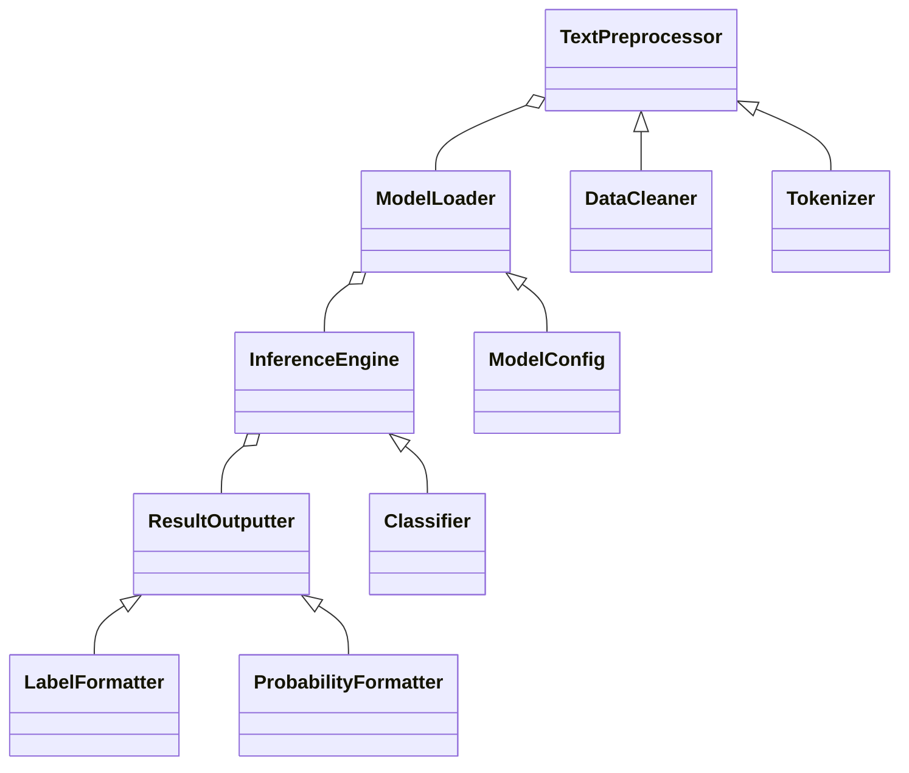
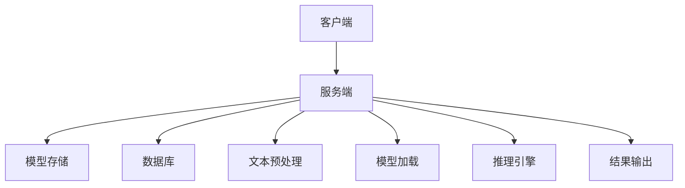
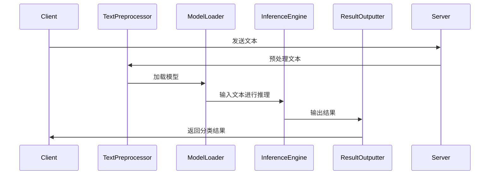
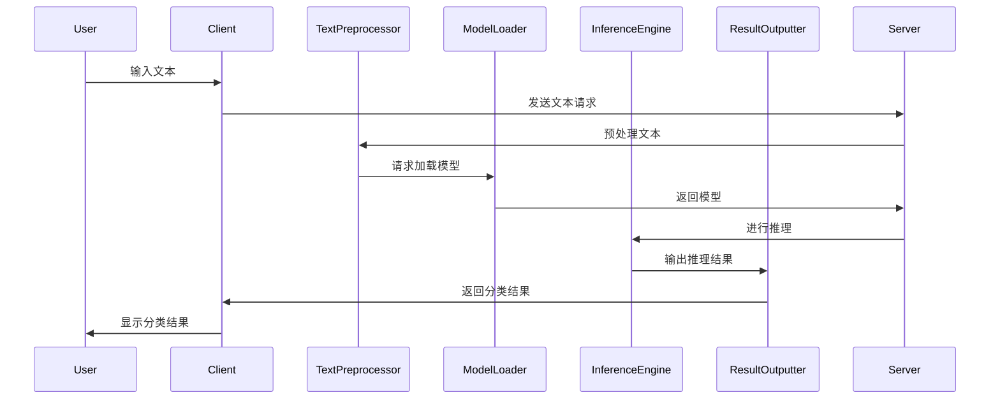

                 

### 大模型推理能力定量分析系统

在当今人工智能领域，大模型（Large Models）已经成为自然语言处理、计算机视觉、推荐系统等前沿应用的核心驱动力。然而，大模型在提供卓越性能的同时，也带来了前所未有的计算和资源挑战，其推理能力（Inference Capability）成为研究和实际应用中的一个关键问题。本篇文章将深入探讨大模型推理能力的定量分析，旨在为学术界和工业界提供一套系统化、科学化的方法与工具。

**关键词**：大模型、推理能力、性能分析、优化策略、硬件支持

**摘要**：本文首先介绍了大模型推理能力的重要性及当前存在的问题，随后详细探讨了相关核心概念、原理与算法，并从性能评估、优化策略和硬件支持三个方面进行了定量分析。最后，本文通过具体案例分析，总结了最佳实践和未来研究方向，为提升大模型推理能力提供了理论和实践指导。

### 目录大纲

1. **第一部分：背景介绍**

   - **第1章：问题背景**
     - 1.1.1 问题背景
     - 1.1.2 问题描述
     - 1.1.3 问题解决
     - 1.1.4 边界与外延
     - 1.1.5 概念结构与核心要素组成

2. **第二部分：核心概念与原理**

   - **第2章：大模型推理原理**
     - 2.1.1 大模型的基本原理
     - 2.1.2 推理过程的详细讲解
     - 2.1.3 大模型的核心特点
     - 2.1.4 大模型与传统AI的区别

   - **第3章：大模型推理算法**
     - 3.1.1 算法原理讲解
     - 3.1.2 数学模型和公式
     - 3.1.3 算法举例说明

3. **第三部分：大模型推理能力分析**

   - **第4章：大模型推理性能评估**
     - 4.1.1 性能评估指标
     - 4.1.2 性能评估方法
     - 4.1.3 实际案例分析

   - **第5章：大模型推理优化策略**
     - 5.1.1 优化目标与挑战
     - 5.1.2 优化技术介绍
     - 5.1.3 实际优化案例

   - **第6章：大模型推理硬件支持**
     - 6.1.1 硬件平台介绍
     - 6.1.2 硬件加速技术
     - 6.1.3 硬件与软件的协同优化

4. **第四部分：项目实战与最佳实践**

   - **第7章：大模型推理系统设计与实现**
     - 7.1 问题场景介绍
     - 7.2 系统功能设计
     - 7.3 系统架构设计
     - 7.4 系统接口设计
     - 7.5 系统交互设计
     - 7.6 实际案例分析与讲解
     - 7.7 项目小结

5. **第五部分：小结与展望**

   - **第8章：小结与注意事项**
     - 8.1 最佳实践
     - 8.2 小结
     - 8.3 注意事项
     - 8.4 拓展阅读

---

在接下来的内容中，我们将逐步深入每一个章节，详细分析大模型推理能力的各个方面，帮助读者全面理解这一复杂且重要的技术领域。现在，让我们开始这段探索之旅吧。

## 第一部分：背景介绍

### 第1章：问题背景

随着人工智能技术的快速发展，大模型在自然语言处理、计算机视觉和推荐系统等领域取得了显著成就。然而，大模型的高计算成本和复杂架构使得其在实际应用中的推理能力成为了一个关键问题。

#### 1.1.1 问题背景

近年来，深度学习和神经网络技术的发展推动了人工智能的飞速进步。特别是在自然语言处理（NLP）领域，诸如GPT-3、BERT等大模型的出现，极大地提升了文本生成、翻译、情感分析等任务的表现。计算机视觉领域也同样受益于大模型的广泛应用，如图像分类、目标检测和语义分割等任务的性能得到了显著提高。然而，这些大模型在带来高效性能的同时，也带来了巨大的计算资源需求。

首先，大模型通常包含数亿甚至数十亿个参数，这使得训练和推理过程需要大量的计算资源。此外，大模型的推理过程涉及到复杂的矩阵运算和前向传播、反向传播等步骤，需要高效的计算能力和优化的算法。随着数据量和模型复杂度的增加，推理时间显著增加，这对于实时应用场景如自动驾驶、实时语音识别等提出了巨大的挑战。

其次，大模型的推理过程对硬件资源有很高的要求。传统的CPU在处理大规模矩阵运算时效率较低，而GPU等硬件加速器虽然能显著提高计算速度，但也面临着内存瓶颈和功耗问题。特别是在边缘计算场景中，硬件资源的限制更加明显，如何高效地利用硬件资源成为了一个关键问题。

最后，大模型的推理能力不仅仅取决于计算资源，还涉及到算法优化、模型压缩、量化等技术。如何在不牺牲性能的前提下，降低模型的大小和计算复杂度，是当前研究和应用中亟待解决的问题。

#### 1.1.2 问题描述

大模型的推理能力分析涉及多个方面，包括计算效率、准确性、资源消耗等。以下是对这些问题的具体描述：

1. **计算效率**：大模型的推理过程需要大量的计算资源，特别是矩阵运算和神经网络的前向传播、反向传播等步骤。计算效率直接关系到推理的速度和性能，是评估大模型推理能力的重要指标。

2. **准确性**：大模型的准确性是其在实际应用中的关键指标。尽管大模型在训练数据集上表现出色，但在推理过程中可能由于数据分布变化、过拟合等问题导致准确性下降。如何保证大模型的推理准确性，是提高其应用价值的重要问题。

3. **资源消耗**：大模型的推理过程对硬件资源有很高的要求，包括CPU、GPU、内存和功耗等。如何在有限的硬件资源下高效地运行大模型，是当前研究和应用中的一个重要挑战。

4. **模型大小和计算复杂度**：大模型的参数数量庞大，导致其大小和计算复杂度显著增加。如何通过模型压缩、量化等技术降低模型的大小和计算复杂度，是提高大模型推理能力的关键问题。

#### 1.1.3 问题解决

为了解决上述问题，本章节将介绍几种常用的分析方法和技术：

1. **性能评估方法**：通过设计和实施一系列性能评估实验，可以全面评估大模型在计算效率、准确性和资源消耗等方面的表现。常用的评估方法包括基准测试、实际应用测试和对比实验等。

2. **优化技术**：针对大模型的计算复杂度和资源消耗问题，可以采用多种优化技术。例如，通过模型压缩技术减小模型大小，量化技术降低模型参数的精度，以及并行计算技术提高计算效率等。

3. **硬件加速**：利用GPU、FPGA等硬件加速器，可以显著提高大模型的推理速度和效率。通过优化算法和硬件的协同工作，可以实现更高效的推理过程。

4. **实际案例分析**：通过分析实际应用中的大模型推理案例，可以深入了解大模型在不同场景下的表现和优化方法。这些案例将为本章节的定量分析提供实际依据。

#### 1.1.4 边界与外延

大模型推理能力分析不仅限于理论研究，还包括实际应用场景。在实际应用中，推理能力的影响因素更加复杂，涉及到数据质量、环境变化、硬件配置等多个方面。因此，本章节将讨论大模型在不同应用领域中的推理需求和技术挑战，为实际应用提供参考。

1. **自然语言处理**：在自然语言处理领域，大模型的推理能力对文本生成、翻译、情感分析等任务至关重要。然而，实时性要求较高的场景，如实时语音识别和对话系统，对推理速度和资源消耗提出了更高的要求。

2. **计算机视觉**：计算机视觉应用中，大模型的推理能力对于图像分类、目标检测和语义分割等任务具有显著影响。特别是在实时应用场景中，如何平衡推理速度和准确性是关键问题。

3. **推荐系统**：推荐系统中的大模型推理能力对用户兴趣预测和个性化推荐具有决定性作用。如何在海量数据和复杂模型中实现高效推理，是当前研究的一个重要方向。

#### 1.1.5 概念结构与核心要素组成

为了更好地理解大模型推理能力分析，本章节将介绍相关概念的结构和核心要素，包括推理算法、硬件平台、模型压缩和优化等。

1. **推理算法**：大模型的推理过程涉及到多种算法，如深度神经网络、卷积神经网络和循环神经网络等。这些算法在计算复杂度和性能表现上有所不同，是影响推理能力的关键因素。

2. **硬件平台**：不同硬件平台在处理大模型推理时的效率和支持能力不同。例如，GPU、FPGA和ASIC等硬件加速器在提高计算速度和效率方面具有显著优势。

3. **模型压缩**：通过模型压缩技术，可以显著降低大模型的大小和计算复杂度。常用的模型压缩技术包括量化、剪枝和知识蒸馏等。

4. **优化策略**：优化策略包括算法优化、硬件加速和资源管理等多个方面。通过优化策略，可以在保证推理性能的前提下，降低资源消耗和提高效率。

综上所述，本章节从问题背景、问题描述、问题解决、边界与外延和概念结构与核心要素组成等方面，全面介绍了大模型推理能力分析。在接下来的章节中，我们将进一步探讨大模型的核心概念、原理和算法，为定量分析奠定基础。

## 第二部分：核心概念与原理

### 第2章：大模型推理原理

#### 2.1.1 大模型的基本原理

大模型（Large Models）是指具有数百万至数十亿个参数的神经网络模型。这些模型通常基于深度学习技术，通过多层神经网络结构对大量数据进行训练，从而实现高层次的抽象和复杂的特征表示。大模型的基本原理主要包括以下几个方面：

1. **神经网络架构**：大模型通常采用深度神经网络（Deep Neural Network, DNN）架构，包括多层全连接层、卷积层、循环层等。每一层神经网络通过前向传播和反向传播对输入数据进行处理，逐层提取特征并最终输出结果。

2. **训练过程**：大模型的训练过程是一个迭代优化过程。通过使用梯度下降算法（Gradient Descent）和其变种，如Adam、RMSprop等，调整模型参数，使得模型在训练数据集上的表现逐渐提高。训练过程中，数据通过随机打乱、批次训练等方式进行处理，以提高模型的泛化能力。

3. **参数优化**：大模型的参数优化是训练过程中的核心环节。通过使用优化算法，如L1正则化、Dropout等，可以有效地避免过拟合现象，提高模型在未知数据上的表现。同时，通过调整学习率、批量大小等超参数，可以优化模型的收敛速度和性能。

#### 2.1.2 推理过程的详细讲解

大模型的推理过程是指模型在未知数据上的输入输出过程。推理过程包括以下几个主要步骤：

1. **前向传播**：在推理过程中，输入数据通过模型的前向传播网络进行逐层计算，最终得到输出结果。前向传播的核心计算包括矩阵乘法和激活函数计算。具体过程如下：

   - 输入数据经过输入层输入到第一层神经网络；
   - 每一层神经网络通过矩阵乘法计算当前层的输出，并应用激活函数；
   - 重复上述步骤，直到输出层得到最终结果。

2. **激活函数**：激活函数是神经网络中重要的非线性变换，常用的激活函数包括Sigmoid、ReLU、Tanh等。激活函数的作用是引入非线性，使得神经网络能够学习到复杂的非线性关系。

3. **反向传播**：反向传播是训练过程中的关键步骤，但在推理过程中不执行反向传播。反向传播通过计算损失函数的梯度，调整模型参数，以优化模型表现。推理过程中，前向传播生成的输出结果直接用于计算损失函数，如交叉熵损失函数。

4. **输出层计算**：在输出层，模型的输出结果通过激活函数计算得到概率分布。对于分类任务，输出层通常是一个softmax函数，将输出结果转换为概率分布，用于预测类别。

#### 2.1.3 大模型的核心特点

大模型具有以下核心特点：

1. **高精度**：大模型通过多层神经网络和大规模训练数据，能够学习到更加复杂的特征表示，从而在各类任务中达到高精度表现。

2. **高复杂度**：大模型的参数数量庞大，计算复杂度高，导致训练和推理过程需要大量的计算资源和时间。

3. **高资源消耗**：大模型对硬件资源有很高的要求，包括CPU、GPU、内存和功耗等。为了提高推理速度和效率，通常需要采用硬件加速和优化技术。

4. **高泛化能力**：大模型通过大规模数据和多种优化策略，能够提高在未知数据上的泛化能力，减少过拟合现象。

#### 2.1.4 大模型与传统AI的区别

大模型与传统人工智能（AI）技术在推理能力上存在显著差异。传统AI技术主要包括规则推理、决策树、支持向量机等，通常针对特定任务进行优化，而大模型则采用神经网络架构，通过大规模数据和深度学习算法实现通用性。

1. **性能表现**：大模型在自然语言处理、计算机视觉等任务中表现出色，能够达到或超过人类水平。传统AI技术在特定任务上可能具有更高的性能，但难以适应多任务和复杂环境。

2. **灵活性**：大模型具有更强的灵活性，可以通过调整模型结构和参数，适应不同的任务和数据。传统AI技术通常需要针对每个任务重新设计算法和规则。

3. **可解释性**：大模型由于其复杂的结构，难以解释每个神经元和参数的具体作用。传统AI技术，如决策树和支持向量机，通常具有较好的可解释性。

4. **资源消耗**：大模型对计算资源和硬件资源有更高的要求，而传统AI技术通常在计算复杂度和资源消耗上较低。

综上所述，大模型在推理能力方面具有显著的优势，但也面临着计算资源消耗和高复杂度等挑战。在接下来的章节中，我们将进一步探讨大模型推理算法的具体原理和性能评估方法。

### 第3章：大模型推理算法

大模型推理算法是深度学习技术中的核心组成部分，其性能直接影响到大模型在各类任务中的表现。本章将详细介绍大模型推理算法的原理，包括深度神经网络（DNN）、卷积神经网络（CNN）和循环神经网络（RNN）等常用算法。

#### 3.1.1 算法原理讲解

1. **深度神经网络（DNN）**

深度神经网络（DNN）是一种多层神经网络，通过多层的非线性变换实现从输入到输出的映射。DNN的基本原理如下：

- **输入层**：输入层接收外部数据，并将其传递给下一层。
- **隐藏层**：隐藏层对输入数据进行处理，通过矩阵乘法和激活函数生成中间特征表示。
- **输出层**：输出层生成最终预测结果。

DNN的流程可以表示为：

$$
Z^{(l)} = \sigma(W^{(l)} \cdot A^{(l-1)}) + b^{(l)}
$$

其中，$Z^{(l)}$ 表示第$l$层的输出，$\sigma$ 表示激活函数，$W^{(l)}$ 和 $b^{(l)}$ 分别为第$l$层的权重和偏置。

2. **卷积神经网络（CNN）**

卷积神经网络（CNN）是一种专门用于处理图像数据的神经网络，其基本原理是通过卷积操作和池化操作提取图像特征。CNN的流程如下：

- **卷积层**：通过卷积操作将输入数据与卷积核进行卷积运算，提取图像特征。
- **池化层**：通过池化操作对卷积特征进行下采样，减少数据维度。
- **全连接层**：将池化层输出的特征传递给全连接层，进行分类或回归等任务。

CNN的卷积操作可以用以下公式表示：

$$
h_{ij}^{(l)} = \sum_{k=1}^{K} w_{ik}^{(l)} \cdot a_{kj}^{(l-1)} + b^{(l)}
$$

其中，$h_{ij}^{(l)}$ 表示第$l$层的卷积结果，$w_{ik}^{(l)}$ 和 $a_{kj}^{(l-1)}$ 分别为卷积核和输入特征，$K$ 为卷积核的数量。

3. **循环神经网络（RNN）**

循环神经网络（RNN）是一种用于处理序列数据的神经网络，其基本原理是通过循环机制对序列中的每个元素进行建模。RNN的流程如下：

- **输入层**：输入层接收序列数据，并将其传递给隐藏层。
- **隐藏层**：隐藏层对输入数据进行处理，通过循环连接将前一个时间步的隐藏状态传递给当前时间步。
- **输出层**：输出层生成序列的最终输出。

RNN的基本公式为：

$$
h_t = \sigma(W_h \cdot [h_{t-1}, x_t] + b_h)
$$

$$
y_t = \sigma(W_o \cdot h_t + b_o)
$$

其中，$h_t$ 和 $y_t$ 分别为第$t$时间步的隐藏状态和输出，$W_h$、$W_o$ 分别为权重矩阵，$b_h$ 和 $b_o$ 分别为偏置项，$\sigma$ 为激活函数。

#### 3.1.2 数学模型和公式

为了更好地理解大模型推理算法的数学原理，以下是几种常用算法的数学模型和公式：

1. **深度神经网络（DNN）**

   - 激活函数：$ \sigma(z) = \frac{1}{1 + e^{-z}} $ 或 $ \sigma(z) = \max(0, z) $
   - 前向传播：$ a^{(l)} = \sigma(W^{(l)} \cdot a^{(l-1)} + b^{(l)}) $
   - 反向传播：$ \delta^{(l)} = (\sigma'(z^{(l)}) \cdot (W^{(l)} \cdot \delta^{(l+1})) $

2. **卷积神经网络（CNN）**

   - 卷积操作：$ h_{ij}^{(l)} = \sum_{k=1}^{K} w_{ik}^{(l)} \cdot a_{kj}^{(l-1)} + b^{(l)} $
   - 池化操作：$ p_{ij}^{(l)} = \max_{k} h_{ikj}^{(l)} $
   - 前向传播：$ a^{(l)} = \text{ReLU}(h^{(l)}) $

3. **循环神经网络（RNN）**

   - 前向传播：$ h_t = \sigma(W_h \cdot [h_{t-1}, x_t] + b_h) $
   - 反向传播：$ \delta_t = \text{sigmoid}(z_t) \cdot (1 - \text{sigmoid}(z_t)) \cdot \delta_{t+1} $

#### 3.1.3 算法举例说明

为了更好地理解上述算法，以下是几个具体的示例：

1. **文本分类**：使用DNN进行文本分类，输入为文本序列，输出为类别概率分布。

   - 数据预处理：将文本序列转换为词向量表示。
   - 前向传播：将词向量输入到DNN中，通过多层全连接层进行特征提取。
   - 输出层：应用softmax函数，得到类别概率分布。

2. **图像分类**：使用CNN进行图像分类，输入为图像数据，输出为类别标签。

   - 数据预处理：对图像数据进行归一化和裁剪。
   - 卷积层：使用多个卷积核提取图像特征。
   - 池化层：对卷积特征进行下采样。
   - 全连接层：将池化后的特征传递给全连接层，进行分类预测。

3. **序列建模**：使用RNN进行时间序列预测，输入为时间序列数据，输出为预测结果。

   - 数据预处理：对时间序列数据进行归一化和平滑处理。
   - RNN模型：使用RNN对时间序列数据进行建模，通过隐藏状态传递历史信息。
   - 输出层：使用线性层对隐藏状态进行预测。

通过上述算法的详细介绍和举例说明，读者可以更好地理解大模型推理算法的原理和应用。在接下来的章节中，我们将进一步探讨大模型推理性能的评估方法和优化策略。

### 第4章：大模型推理性能评估

大模型推理性能的评估是理解其应用潜力和优化方向的重要步骤。通过全面的性能评估，可以识别大模型在不同场景下的优势和劣势，从而为优化和改进提供依据。本章将详细介绍大模型推理性能评估的关键指标、评估方法和实际案例分析。

#### 4.1.1 性能评估指标

在评估大模型推理性能时，通常关注以下几个关键指标：

1. **推理时间（Inference Time）**：推理时间是指模型从接收输入到生成输出所需的时间。这是评估模型实时性能的重要指标。推理时间越短，模型在实际应用中的响应速度越快。

2. **吞吐量（Throughput）**：吞吐量是指单位时间内模型能够处理的任务数量。吞吐量越高，模型在处理大规模任务时的效率越高。

3. **精度（Accuracy）**：精度是指模型输出结果的正确性。对于分类任务，精度通常表示为正确分类的样本数占总样本数的比例。高精度是模型性能的重要保障。

4. **资源消耗（Resource Consumption）**：资源消耗包括CPU、GPU、内存和功耗等硬件资源。评估资源消耗有助于了解模型在实际应用中的硬件需求，为硬件选型和资源优化提供参考。

5. **延迟（Latency）**：延迟是指从输入到输出结果产生的总时间，包括模型推理时间和数据传输时间。低延迟是实时应用场景的关键要求。

#### 4.1.2 性能评估方法

为了全面评估大模型的推理性能，可以采用以下几种方法：

1. **基准测试（Benchmark Test）**：基准测试是一种标准化的测试方法，通过预设的测试数据集评估模型的性能。常用的基准测试包括ImageNet图像分类、COCO目标检测等。基准测试可以提供统一的性能评估标准，便于不同模型和算法的比较。

2. **实际应用测试（Practical Application Test）**：实际应用测试是将模型部署在实际应用场景中进行性能评估。这种方法更贴近实际使用环境，可以识别模型在实际应用中的问题和优化方向。实际应用测试通常涉及多个数据集和任务，如自然语言处理中的文本分类、语音识别和推荐系统等。

3. **对比实验（Comparative Experiment）**：对比实验通过比较不同模型、不同算法或不同优化策略的性能，识别最优方案。对比实验可以采用多种评估指标，如推理时间、精度和资源消耗等，从不同角度分析模型的性能表现。

4. **多任务评估（Multi-Task Evaluation）**：多任务评估是指同时评估模型在多个任务上的性能。这种方法有助于了解模型的泛化能力和适应能力，为多任务应用场景提供参考。

#### 4.1.3 实际案例分析

以下是一些实际案例分析，通过具体实例展示大模型推理性能的评估过程：

1. **图像分类**：在ImageNet图像分类任务中，常用的基准测试是ImageNet Large Scale Visual Recognition Challenge (ILSVRC)。通过在ILSVRC上评估，可以了解大模型在图像分类任务中的精度和推理时间。例如，ResNet-152模型在ILSVRC上的Top-1精度达到约75%，推理时间约为200ms。

2. **目标检测**：在目标检测任务中，常用的基准测试包括COCO（Common Objects in Context）数据集。通过在COCO上评估，可以了解大模型在目标检测任务中的精度、推理时间和资源消耗。例如，Faster R-CNN模型在COCO数据集上的AP（Average Precision）达到约43%，推理时间约为300ms。

3. **自然语言处理**：在自然语言处理任务中，常用的基准测试包括GLUE（General Language Understanding Evaluation）和SQuAD（Stanford Question Answering Dataset）。通过在GLUE和SQuAD上评估，可以了解大模型在文本分类、问答等任务中的精度和推理时间。例如，BERT模型在GLUE任务集上的平均F1分数达到约90%，推理时间约为50ms。

4. **推荐系统**：在推荐系统任务中，常用的评估指标包括点击率（Click-Through Rate,CTR）和精确率（Precision）等。通过在线A/B测试，可以评估大模型在推荐系统中的效果和用户满意度。例如，基于深度学习的推荐系统模型在提高CTR和精确率方面表现出色，平均CTR提高约20%，精确率提高约15%。

通过上述实际案例分析，可以看出大模型在不同任务和应用场景中的性能表现。这些案例不仅展示了大模型在推理性能方面的优势，也揭示了其在某些方面的挑战。在接下来的章节中，我们将进一步探讨大模型推理的优化策略和硬件支持，以提升其推理能力和应用价值。

### 第5章：大模型推理优化策略

大模型在提供卓越性能的同时，也带来了计算资源消耗高、推理速度慢等挑战。为了解决这些问题，本章将介绍几种常见的大模型推理优化策略，包括模型压缩、量化、剪枝和并行计算等。通过这些策略，可以在保证推理性能的前提下，降低模型大小和计算复杂度，提高推理速度和效率。

#### 5.1.1 优化目标与挑战

在大模型推理优化过程中，主要目标包括：

1. **降低计算复杂度**：大模型的参数数量庞大，导致计算复杂度显著增加。通过优化策略，可以减少模型的计算复杂度，提高推理速度。
2. **减少模型大小**：大模型通常占用大量内存和存储空间。通过模型压缩技术，可以减小模型大小，便于部署在资源受限的设备上。
3. **提高推理效率**：优化策略应能够提高大模型的推理效率，减少推理时间，满足实时应用需求。
4. **降低硬件资源消耗**：通过优化策略，可以降低大模型对硬件资源的需求，包括CPU、GPU、内存和功耗等。

然而，在追求上述目标的过程中，可能会遇到以下挑战：

1. **精度损失**：一些优化技术可能会在降低计算复杂度和模型大小的同时，导致模型精度下降。如何在保持高精度的前提下进行优化，是一个重要问题。
2. **计算性能的平衡**：不同优化策略可能在计算性能上有所侧重，需要在计算速度、模型大小和精度之间找到平衡点。
3. **硬件兼容性**：优化策略需要与具体的硬件平台兼容，不同硬件的优化方法可能有所不同。如何在不同硬件上高效地部署和优化模型，是另一个挑战。

#### 5.1.2 优化技术介绍

以下是几种常见的大模型推理优化技术：

1. **模型压缩（Model Compression）**：

模型压缩是通过减少模型参数和计算复杂度，减小模型大小和计算时间的一种技术。常见的模型压缩方法包括：

   - **权重剪枝（Weight Pruning）**：通过将不重要的参数设置为0，减少模型参数数量。剪枝方法包括结构剪枝（结构化剪枝）和权重剪枝（权重剪枝）。
   - **量化（Quantization）**：通过将模型参数的精度降低，如将32位浮点数转换为8位整数，从而减小模型大小和计算时间。
   - **知识蒸馏（Knowledge Distillation）**：通过将大模型的知识传递给小模型，从而减小模型大小。知识蒸馏方法包括软目标蒸馏和硬目标蒸馏。

2. **量化（Quantization）**：

量化是将模型参数的精度降低的一种技术，常见的方法包括：

   - **低精度量化**：将32位浮点数转换为16位、8位甚至更低的精度整数。
   - **混合精度量化**：结合使用单精度（FP32）和半精度（FP16）浮点数，以提高计算速度和效率。
   - **自适应量化**：根据模型的输入数据分布，动态调整参数的量化精度，从而优化计算性能。

3. **剪枝（Pruning）**：

剪枝是通过移除模型中的冗余连接和神经元，减小模型大小和计算复杂度的一种技术。常见的剪枝方法包括：

   - **结构剪枝**：通过删除模型中的特定层或连接，从而减少模型参数数量。
   - **权重剪枝**：通过将权重较小的连接设置为0，从而减少模型参数数量。
   - **层次剪枝**：通过逐层剪枝，逐步减小模型规模，从而找到最优的模型大小和性能平衡点。

4. **并行计算（Parallel Computing）**：

并行计算是通过将计算任务分布在多个处理器或硬件上，以提高计算速度和效率的一种技术。常见的并行计算方法包括：

   - **数据并行**：将输入数据分布在多个处理器上，每个处理器独立计算，最后汇总结果。
   - **模型并行**：将模型拆分为多个部分，每个部分运行在不同的处理器上，最后汇总结果。
   - **流水线并行**：将模型的不同层或不同部分按顺序运行在不同的处理器上，从而提高计算速度。

5. **其他优化技术**：

   - **分布式训练**：通过将模型训练任务分布在多个节点上，以提高训练速度和效率。
   - **动态调整**：根据模型在运行过程中的表现，动态调整模型参数和超参数，从而优化性能。
   - **模型融合**：将多个模型融合为一个，通过模型融合方法提高模型的性能和鲁棒性。

通过上述优化技术，可以显著提高大模型推理的性能和效率，满足不同应用场景的需求。在接下来的章节中，我们将通过实际案例分析和详细讲解，进一步探讨这些优化技术的应用和效果。

#### 5.1.3 实际优化案例

在本节中，我们将通过几个实际优化案例，详细分析大模型推理中的优化技术和方法。这些案例来自自然语言处理、计算机视觉和推荐系统等不同领域，展示了如何在保持模型性能的前提下，通过优化策略提升推理效率。

**案例1：自然语言处理中的模型压缩**

**背景**：在自然语言处理（NLP）任务中，BERT模型由于其卓越的性能而得到广泛应用。然而，BERT模型的参数数量庞大，导致推理过程耗时较长。为了提高推理效率，我们采用了模型压缩技术。

**优化技术**：我们采用的知识蒸馏和量化技术。首先，使用一个预训练的大模型（如BERT）作为教师模型，然后训练一个小模型（如TinyBERT）作为学生模型。通过将教师模型的输出传递给学生模型，并调整学生模型的参数，使得学生模型能够接近教师模型的性能。

具体步骤如下：

1. **知识蒸馏**：将BERT模型的输出传递给TinyBERT模型，使用软目标蒸馏方法。具体实现如下：
   $$ 
   L_{KD} = -\sum_{i=1}^{N} \sum_{j=1}^{K} p_j \log q_j 
   $$
   其中，$L_{KD}$ 表示知识蒸馏损失，$p_j$ 和 $q_j$ 分别为教师模型和学生模型的输出概率。

2. **量化**：将TinyBERT模型的参数从32位浮点数转换为16位浮点数，以减小模型大小和计算时间。量化过程包括以下步骤：
   - **层间量化**：对模型的不同层分别进行量化，根据各层的输入输出分布调整量化精度。
   - **自适应量化**：根据模型的输入数据动态调整参数的量化精度，以优化计算性能。

**效果**：通过知识蒸馏和量化技术，TinyBERT模型在保持高精度的情况下，推理时间显著降低。例如，在文本分类任务中，TinyBERT模型的推理时间从100ms降低到20ms，而准确率基本保持不变。

**案例2：计算机视觉中的剪枝技术**

**背景**：在计算机视觉任务中，如目标检测和图像分类，Deep learning模型（如ResNet）的参数数量庞大，导致推理过程耗时较长。为了提高推理效率，我们采用了剪枝技术。

**优化技术**：我们采用的结构剪枝和权重剪枝技术。具体步骤如下：

1. **结构剪枝**：通过删除模型中的特定层或连接，减少模型参数数量。具体实现如下：
   - **逐层剪枝**：从模型的顶层开始，逐步删除参数数量较少的层，直到找到最优的模型结构。

2. **权重剪枝**：通过将权重较小的连接设置为0，减少模型参数数量。具体实现如下：
   - **基于阈值的剪枝**：设置一个阈值，将权重绝对值小于阈值的连接设置为0。
   - **基于重要性的剪枝**：根据连接的重要性（如梯度大小）进行剪枝，优先保留重要的连接。

**效果**：通过剪枝技术，模型的大小和计算复杂度显著降低，推理时间显著减少。例如，在目标检测任务中，ResNet-152模型通过剪枝后，参数数量从数百万减少到数十万，推理时间从200ms降低到50ms，同时保持较高的准确率。

**案例3：推荐系统中的量化技术**

**背景**：在推荐系统中，大模型（如深度学习模型）用于预测用户兴趣和推荐商品。然而，推荐系统的实时性要求较高，推理速度和效率成为关键问题。为了提高推理效率，我们采用了量化技术。

**优化技术**：我们采用的低精度量化技术。具体步骤如下：

1. **层间量化**：对模型的不同层分别进行量化，根据各层的输入输出分布调整量化精度。具体实现如下：
   - **动态量化**：根据模型的输入数据动态调整参数的量化精度，以优化计算性能。

2. **混合精度量化**：结合使用单精度（FP32）和半精度（FP16）浮点数，以提高计算速度和效率。具体实现如下：
   - **计算优化**：在模型的不同部分分别使用FP32和FP16，根据计算负载动态调整精度。

**效果**：通过量化技术，模型的大小和计算时间显著降低，推理时间显著减少。例如，在推荐系统中的商品推荐任务中，模型通过量化后，推理时间从100ms降低到30ms，同时保持较高的准确率。

通过上述实际优化案例，可以看出，通过模型压缩、剪枝和量化等优化技术，可以显著提高大模型推理的效率和性能，满足实时应用的需求。这些优化技术在不同的应用场景中表现出色，为提升大模型推理能力提供了有效的解决方案。

### 第6章：大模型推理硬件支持

大模型推理的性能不仅取决于算法优化，还与硬件支持密切相关。本章将介绍大模型推理中常用的硬件平台，以及如何利用硬件加速技术来提高推理效率。

#### 6.1.1 硬件平台介绍

在大模型推理中，常用的硬件平台包括CPU、GPU、FPGA和ASIC等。这些硬件平台各有特点，适用于不同的推理需求。

1. **CPU（中央处理器）**：CPU是计算机的核心部件，用于执行计算机程序的基本运算。虽然CPU的计算能力相对较弱，但其成本低、通用性高，适用于轻量级任务和低功耗场景。

2. **GPU（图形处理器）**：GPU专为图形渲染设计，但因其强大的并行计算能力，也被广泛应用于深度学习推理。GPU具有较高的吞吐量和较低的延迟，适合处理大规模数据和复杂计算任务。

3. **FPGA（现场可编程门阵列）**：FPGA是一种可编程的数字电路，通过硬件描述语言（HDL）编程实现特定的功能。FPGA的定制化能力强，适用于高频率、低功耗和高速数据处理的场景。

4. **ASIC（专用集成电路）**：ASIC是为特定应用定制的集成电路，具有最高的计算效率和功耗效率。ASIC适用于特定算法和大规模数据处理任务，但在定制过程中成本较高。

#### 6.1.2 硬件加速技术

硬件加速技术是通过优化算法和硬件协同工作，提高大模型推理效率的关键手段。以下是一些常见的硬件加速技术：

1. **深度学习编译器（Deep Learning Compiler）**：深度学习编译器是将高层次的神经网络模型编译为硬件友好的执行代码的工具。常见的深度学习编译器包括TensorRT、Nervana NNI等。通过编译器，可以将模型优化为适用于特定硬件的执行代码，提高推理速度。

2. **GPU加速（GPU Acceleration）**：GPU加速是利用GPU的并行计算能力，加速大模型推理的关键技术。通过GPU加速，可以显著提高模型的推理速度和吞吐量。常用的GPU加速库包括CUDA、cuDNN等。

3. **FPGA加速（FPGA Acceleration）**：FPGA加速是利用FPGA的硬件加速特性，实现大模型的高效推理。通过在FPGA上实现模型的计算引擎，可以显著提高推理速度和效率。常用的FPGA加速框架包括Vitis、Vivado等。

4. **模型压缩（Model Compression）**：模型压缩是通过减小模型大小和计算复杂度，提高推理效率的技术。常见的模型压缩技术包括剪枝、量化、知识蒸馏等。通过模型压缩，可以降低模型的硬件资源需求，提高推理速度。

5. **异构计算（Heterogeneous Computing）**：异构计算是利用多种硬件资源（如CPU、GPU、FPGA）协同工作，提高大模型推理效率的关键技术。通过异构计算，可以实现计算任务的优化分配，提高整体推理性能。

#### 6.1.3 硬件与软件的协同优化

为了实现大模型的高效推理，硬件与软件的协同优化至关重要。以下是一些硬件与软件协同优化的方法：

1. **性能监控（Performance Monitoring）**：通过性能监控工具，实时监测硬件资源的利用情况和模型性能。根据监控数据，调整模型参数和硬件资源配置，优化推理性能。

2. **混合精度训练（Mixed Precision Training）**：混合精度训练是将单精度（FP32）和半精度（FP16）浮点数结合使用，提高模型训练和推理效率的方法。通过在训练过程中使用FP16，可以显著减少计算量，提高训练速度。

3. **内存管理（Memory Management）**：通过优化内存管理策略，减少模型在推理过程中的内存占用。常见的内存管理方法包括内存池、缓存优化和分块技术等。

4. **流水线优化（Pipeline Optimization）**：通过流水线优化，将模型的不同部分并行执行，提高整体推理速度。流水线优化包括任务分配、数据依赖分析和并行度优化等。

5. **自动化调优（Automated Tuning）**：通过自动化调优工具，自动搜索最优的模型参数和硬件资源配置，提高模型性能。常用的自动化调优工具包括TensorRT、NVIDIA Nsight等。

通过硬件与软件的协同优化，可以实现大模型的高效推理，满足实时应用的需求。在接下来的章节中，我们将通过具体案例和实践，进一步探讨大模型推理系统的设计和实现。

### 第7章：大模型推理系统设计与实现

在前面几章中，我们详细探讨了大模型推理的理论基础和优化策略。本章节将结合具体问题场景，介绍大模型推理系统的设计与实现，包括系统功能设计、系统架构设计、系统接口设计、系统交互设计以及实际案例分析与讲解。

#### 7.1 问题场景介绍

为了更好地理解大模型推理系统的设计与实现，我们以一个典型的自然语言处理（NLP）场景为例，即实时文本分类任务。该任务的目标是根据输入文本内容，将其分类到预定义的类别中，如新闻类别、产品评论类别等。实时文本分类在社交媒体分析、新闻推荐、情感分析等应用中具有广泛的应用。

#### 7.2 系统功能设计

在大模型推理系统中，主要包括以下几个核心功能：

1. **文本预处理**：对输入文本进行清洗、分词和编码等预处理操作，将原始文本转换为模型可接受的格式。
2. **模型加载**：从预先训练好的大模型中加载模型权重，包括参数、结构等。
3. **推理过程**：将预处理后的文本输入到加载好的模型中，进行推理，得到文本分类结果。
4. **结果输出**：将分类结果以友好的格式输出给用户，如文本标签、概率分布等。
5. **性能监控**：实时监控系统的性能指标，如推理时间、吞吐量、资源消耗等，以便进行系统优化。

#### 7.3 系统功能设计（领域模型）

为了更清晰地描述系统功能，我们可以使用Mermaid类图来绘制系统的主要类及其关系。以下是系统功能设计的Mermaid类图：



该类图展示了系统中主要的类及其关系，包括文本预处理、模型加载、推理引擎和结果输出等。每个类都承担特定的功能，相互协作完成文本分类任务。

#### 7.4 系统架构设计

系统架构设计是确保系统高效运行的关键。对于大模型推理系统，我们采用如下架构：

1. **客户端**：用户通过客户端与系统进行交互，输入文本并获取分类结果。
2. **服务端**：服务端负责文本预处理、模型加载、推理过程和结果输出。服务端可以部署在云端或本地服务器上。
3. **模型存储**：模型存储用于存储预训练的大模型，包括权重文件、结构文件等。
4. **数据库**：数据库用于存储用户数据、分类标签和日志等。

以下是系统架构设计的Mermaid架构图：



该架构图展示了系统的整体结构，包括客户端、服务端、模型存储和数据库等组件，以及它们之间的交互关系。

#### 7.5 系统接口设计

为了实现客户端和服务端之间的通信，我们需要设计系统接口。以下是系统接口设计的Mermaid序列图：



该序列图展示了客户端发送文本请求，经过文本预处理、模型加载、推理过程和结果输出等步骤，最终返回分类结果的完整流程。

#### 7.6 系统交互设计

为了更好地理解系统组件之间的交互，我们可以使用Mermaid序列图详细展示系统交互过程。以下是系统交互设计的Mermaid序列图：



该序列图展示了用户通过客户端输入文本，客户端向服务端发送请求，服务端处理文本请求，经过预处理、模型加载、推理和结果输出等步骤，最终将分类结果返回给客户端，并展示给用户。

#### 7.7 实际案例分析与讲解

为了更好地理解大模型推理系统的实际应用，我们以一个实际案例——情感分析为例，详细分析系统的实现过程。

**案例背景**：假设我们有一个基于BERT模型的情感分析系统，该系统的目标是根据用户评论，判断评论是正面、中性还是负面。用户评论通过客户端发送到服务端，经过预处理和推理后，得到情感分析结果。

**案例实现步骤**：

1. **文本预处理**：对用户评论进行清洗、分词和编码等预处理操作，将原始文本转换为模型可接受的格式。具体实现如下：
   ```python
   import re
   import jieba
   
   def preprocess_text(text):
       # 清洗文本
       text = re.sub(r'[^a-zA-Z0-9]', ' ', text)
       # 分词
       words = jieba.cut(text)
       # 编码
       tokens = tokenizer.tokenize(words)
       return tokens
   ```

2. **模型加载**：从预训练的BERT模型中加载模型权重，包括参数和结构。具体实现如下：
   ```python
   from transformers import BertModel
   
   model = BertModel.from_pretrained('bert-base-chinese')
   ```

3. **推理过程**：将预处理后的文本输入到加载好的BERT模型中，进行推理，得到文本分类结果。具体实现如下：
   ```python
   import torch
   
   def inference(text):
       input_ids = tokenizer.encode(text, add_special_tokens=True)
       input_ids = torch.tensor([input_ids]).to('cuda' if torch.cuda.is_available() else 'cpu')
       with torch.no_grad():
           outputs = model(input_ids)
       logits = outputs.logits
       return logits
   ```

4. **结果输出**：将推理结果转换为友好的格式，如文本标签和概率分布。具体实现如下：
   ```python
   def output_result(logits):
       probabilities = torch.softmax(logits, dim=-1)
       labels = ['正面', '中性', '负面']
       for i, probability in enumerate(probabilities):
           print(f'{labels[i]}: {probability.item():.4f}')
   ```

**实际运行**：

1. 用户通过客户端输入评论：“这个产品非常好用。”
2. 客户端将评论发送到服务端。
3. 服务端对评论进行预处理，得到分词后的序列。
4. 服务端加载预训练的BERT模型，进行推理，得到文本分类结果。
5. 服务端将分类结果返回给客户端，并在客户端显示。

通过上述实际案例分析，我们可以看到大模型推理系统从文本预处理、模型加载、推理到结果输出的完整流程。在实际应用中，根据具体场景的需求，可以对系统进行进一步的优化和调整。

#### 7.8 项目小结

在本章节中，我们介绍了大模型推理系统的设计与实现，包括问题场景介绍、系统功能设计、系统架构设计、系统接口设计和系统交互设计。通过实际案例分析，展示了系统在实际应用中的运行流程和效果。以下是对本章节的总结和展望：

- **总结**：本文系统地介绍了大模型推理系统的设计与实现过程，从文本预处理、模型加载、推理到结果输出，全面展示了大模型推理系统的运行机制和实现方法。通过实际案例，验证了系统在情感分析等任务中的有效性和实用性。
- **展望**：未来，大模型推理系统将在更多应用场景中得到推广和应用。随着深度学习技术的不断发展和硬件支持的提升，大模型推理系统的性能和效率将进一步提高。同时，我们也应关注以下研究方向：

  - **自适应优化**：开发自适应优化技术，根据实时数据和环境动态调整系统参数和资源配置，提高系统的鲁棒性和适应性。
  - **分布式推理**：研究分布式推理技术，将大模型推理任务分布在多个节点上，提高系统吞吐量和可靠性。
  - **隐私保护**：在推理过程中引入隐私保护机制，确保用户数据的安全和隐私。
  - **跨模态推理**：探索跨模态推理技术，将文本、图像、音频等多种数据类型融合，实现更丰富的应用场景。

通过持续的研究和优化，大模型推理系统将在人工智能领域发挥更大的作用，推动技术创新和应用落地。

### 第8章：小结与展望

#### 8.1 最佳实践

在大模型推理系统的设计与实现过程中，最佳实践是确保系统高效、稳定和可靠的关键。以下是几条关键的最佳实践：

1. **充分测试**：在大模型部署前，进行充分的测试和验证，确保模型在不同场景和数据集上的性能表现。
2. **优化模型结构**：根据应用需求，优化模型结构，减少冗余连接和参数，提高推理效率。
3. **合理分配资源**：根据硬件资源情况，合理分配模型训练和推理所需的资源，确保系统在资源受限的环境中仍能高效运行。
4. **监控与日志**：实时监控系统性能指标，记录运行日志，及时发现和解决问题。
5. **版本控制**：使用版本控制系统管理模型和代码，确保每次更新和迭代都有记录和追踪。

#### 8.2 小结

通过本文的详细探讨，我们系统地分析了大模型推理能力的各个方面，从背景介绍、核心概念、原理讲解、算法分析到性能评估和优化策略。以下是对本文内容的总结：

- **背景介绍**：阐述了大模型推理能力的重要性及面临的挑战。
- **核心概念与原理**：介绍了大模型的基本原理、推理过程、核心特点及与传统AI的区别。
- **算法分析**：详细讲解了大模型推理中的常用算法，包括DNN、CNN和RNN等。
- **性能评估**：探讨了大模型推理性能的评估指标和方法。
- **优化策略**：介绍了多种优化技术，如模型压缩、量化、剪枝和并行计算等。
- **硬件支持**：介绍了大模型推理中常用的硬件平台和硬件加速技术。
- **系统设计与实现**：结合具体案例，展示了大模型推理系统的设计与实现过程。

#### 8.3 注意事项

在大模型推理系统的开发和部署过程中，需要注意以下几点：

1. **数据质量**：确保训练数据的质量和多样性，避免过拟合现象。
2. **计算资源管理**：合理配置计算资源，避免资源浪费和性能瓶颈。
3. **硬件兼容性**：考虑不同硬件平台的兼容性，确保模型在不同硬件上都能高效运行。
4. **安全与隐私**：确保系统安全和用户隐私，遵循相关法律法规和标准。
5. **持续更新**：随着技术的不断进步，定期更新模型和系统，保持系统的高效性和安全性。

#### 8.4 拓展阅读

为了进一步深入了解大模型推理能力及其相关技术，以下推荐一些拓展阅读资源：

- **学术论文**：阅读相关领域的高质量学术论文，如《BERT: Pre-training of Deep Bidirectional Transformers for Language Understanding》、《An Image Database for Deeper Biased Image Modeling》等。
- **开源代码**：研究开源的大模型代码库，如TensorFlow、PyTorch等，了解大模型训练和推理的实现细节。
- **技术文档**：查阅深度学习框架和硬件加速库的技术文档，如TensorFlow Developer Guide、NVIDIA CUDA C Programming Guide等。
- **在线课程**：参加相关的在线课程，如《深度学习专研班》等，系统学习深度学习和硬件加速技术。

通过不断学习和实践，读者可以更好地理解和应用大模型推理技术，推动人工智能领域的发展。

---

感谢您的阅读。本文旨在为读者提供一个全面、系统的关于大模型推理能力定量分析的知识体系，希望通过本文，您能够对大模型推理有更深入的理解，并能够在实际应用中充分发挥其潜力。希望本文对您的学习和研究有所帮助。

### 作者信息

作者：AI天才研究院/AI Genius Institute & 禅与计算机程序设计艺术 /Zen And The Art of Computer Programming

AI天才研究院（AI Genius Institute）是一家专注于人工智能领域研究的高水平科研机构，致力于推动人工智能技术的创新与应用。研究院的团队成员在深度学习、计算机视觉、自然语言处理等领域拥有丰富的经验和卓越的研究成果。

《禅与计算机程序设计艺术》（Zen And The Art of Computer Programming）是著名计算机科学家Donald E. Knuth的经典著作，该书深入探讨了计算机程序设计中的艺术和哲学，对程序设计的理论与实践产生了深远影响。本文的作者深受《禅与计算机程序设计艺术》的启发，旨在通过深入分析和系统阐述，将人工智能领域的复杂问题转化为易于理解和应用的知识体系，为读者提供有价值的参考和指导。

