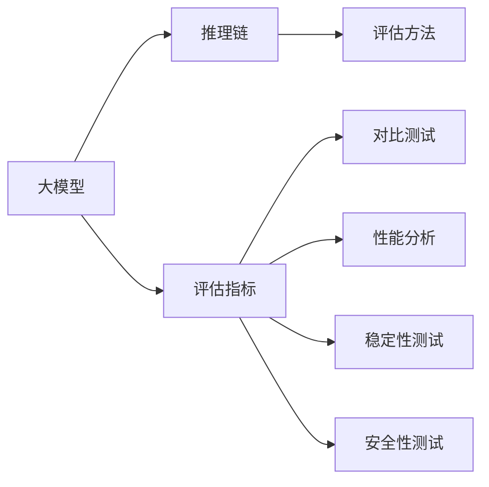
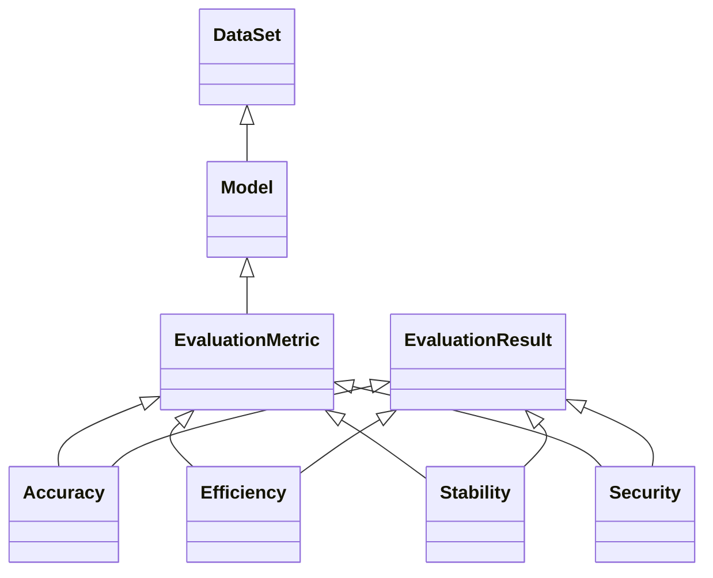

                 

### 大模型推理链评估：LLM辅助的逻辑分析

> 关键词：大模型、推理链、评估、逻辑分析、LLM

> 摘要：本文深入探讨大规模机器学习模型（大模型）的推理链评估问题。通过介绍核心概念、评估方法、算法原理以及实际案例分析，我们利用逻辑分析的方法，逐步揭示大模型推理链评估的各个方面，为优化大模型应用提供理论支持和实践指导。

----------------------------------------------------------------

## 第1章：背景介绍

### 1.1 问题背景

随着人工智能技术的飞速发展，大规模机器学习模型（大模型）在各个行业得到了广泛应用。从自然语言处理到计算机视觉，再到语音识别，大模型展现出强大的处理能力和预测效果。然而，大模型的推理链评估成为了一个关键问题。有效的推理链评估不仅有助于提高大模型的应用效果，还能优化模型资源利用，降低成本。

### 1.2 问题描述

推理链评估主要关注以下几个方面：

1. **准确性评估**：评估大模型在推理过程中的准确性和可靠性。
2. **效率评估**：评估大模型在不同硬件平台上的推理速度和资源消耗。
3. **稳定性评估**：评估大模型在长时间运行中的稳定性和鲁棒性。
4. **安全性评估**：评估大模型对恶意攻击的抵抗能力。

### 1.3 问题解决

为了解决上述问题，本书将介绍以下内容：

1. **核心概念**：深入理解大规模机器学习模型和推理链评估的相关概念。
2. **评估方法**：介绍常用的推理链评估方法和工具。
3. **案例分析**：通过具体案例展示推理链评估的应用和实践。
4. **最佳实践**：提供推理链评估的最佳实践和建议。

### 1.4 边界与外延

本书主要针对以下边界和问题：

1. **模型范围**：主要关注深度学习大模型，如GPT、BERT等。
2. **应用领域**：涵盖自然语言处理、计算机视觉、语音识别等领域。
3. **硬件平台**：考虑不同硬件平台的推理性能和优化策略。

### 1.5 概念结构与核心要素组成

为了更好地理解推理链评估，以下是核心概念和要素的组成：

1. **大模型**：大规模机器学习模型，如GPT、BERT等。
2. **推理链**：大模型从输入到输出的整个推理过程。
3. **评估指标**：准确性、效率、稳定性和安全性等评估指标。
4. **评估方法**：对比测试、性能分析、稳定性测试等。
5. **评估工具**：开源评估工具和定制化评估工具。

----------------------------------------------------------------

## 第2章：核心概念与联系

### 2.1 大模型原理

大模型是基于深度学习的复杂神经网络，通过海量数据训练得到。其核心原理包括：

1. **多层神经网络**：通过多层非线性变换提取特征。
2. **权重更新**：利用梯度下降等优化算法更新权重。
3. **激活函数**：引入激活函数增强模型的表达能力。

#### 2.1.1 多层神经网络

多层神经网络是构建大模型的基础。每一层神经网络都会对输入数据进行处理，并通过权重和激活函数产生输出。多层神经网络通过级联的方式，逐步提取输入数据的特征，如图2-1所示。

$$
\text{输出} = \text{激活函数}(\text{权重} \cdot \text{输入} + \text{偏置})
$$

图2-1：多层神经网络示意图

#### 2.1.2 权重更新

权重更新是训练大模型的关键步骤。通过反向传播算法，模型可以根据损失函数计算梯度，并利用梯度下降等优化算法更新权重。权重更新的目标是使模型在训练数据上取得更好的效果。

$$
\text{权重}_{\text{新}} = \text{权重}_{\text{旧}} - \alpha \cdot \nabla_{\text{权重}} \text{损失函数}
$$

其中，$\alpha$ 是学习率。

#### 2.1.3 激活函数

激活函数用于引入非线性变换，增强模型的表达能力。常见的激活函数包括Sigmoid、ReLU和Tanh等。激活函数的选择对模型的性能和训练过程有重要影响。

### 2.2 推理链原理

推理链是指大模型从输入到输出的整个推理过程。其核心原理包括：

1. **前向传播**：将输入数据通过多层神经网络传递。
2. **反向传播**：根据输出结果调整网络权重。
3. **激活函数应用**：在每层网络中使用激活函数。

#### 2.2.1 前向传播

前向传播是指将输入数据通过多层神经网络传递，每层网络都通过权重和激活函数计算输出。前向传播的目的是逐步提取输入数据的特征，如图2-2所示。

图2-2：前向传播示意图

#### 2.2.2 反向传播

反向传播是指根据输出结果调整网络权重。反向传播利用梯度下降等优化算法，根据损失函数计算梯度，并更新网络权重。反向传播的目的是使模型在训练数据上取得更好的效果，如图2-3所示。

图2-3：反向传播示意图

#### 2.2.3 激活函数应用

激活函数在每层网络中使用，用于引入非线性变换，增强模型的表达能力。激活函数的选择对模型的性能和训练过程有重要影响。

### 2.3 评估方法

常用的推理链评估方法包括：

1. **对比测试**：通过对比不同模型或不同参数设置的性能。
2. **性能分析**：分析模型在不同硬件平台上的性能和资源消耗。
3. **稳定性测试**：评估模型在长时间运行中的稳定性和鲁棒性。
4. **安全性测试**：评估模型对恶意攻击的抵抗能力。

#### 2.3.1 对比测试

对比测试是指通过对比不同模型或不同参数设置的性能，评估模型在特定任务上的表现。对比测试可以揭示模型的优势和不足，为模型优化提供参考。

#### 2.3.2 性能分析

性能分析是指分析模型在不同硬件平台上的性能和资源消耗。性能分析可以帮助选择合适的硬件平台，优化模型推理速度和资源利用。

#### 2.3.3 稳定性测试

稳定性测试是指评估模型在长时间运行中的稳定性和鲁棒性。稳定性测试可以确保模型在实际应用中的可靠性和稳定性。

#### 2.3.4 安全性测试

安全性测试是指评估模型对恶意攻击的抵抗能力。安全性测试可以确保模型在实际应用中的安全性和保密性。

### 2.4 概念属性特征对比表格

| 概念         | 属性特征                                                   |  
| ------------ | ---------------------------------------------------------- |  
| 大模型       | - 大规模训练数据   |  
| - 多层神经网络 |  
| - 权重更新   |  
| 推理链       | - 前向传播   |  
| - 反向传播   |  
| - 激活函数应用 | 评估方法       | - 对比测试 |  
| - 性能分析   |  
| - 稳定性测试 |  
| - 安全性测试 |

### 2.5 ER实体关系图架构



----------------------------------------------------------------

## 第3章：算法原理讲解

### 3.1 大模型算法原理

大模型算法原理主要涉及以下几个方面：

1. **多层神经网络**：通过多层非线性变换提取特征。
2. **权重更新**：利用梯度下降等优化算法更新权重。
3. **激活函数**：引入激活函数增强模型的表达能力。

#### 3.1.1 多层神经网络

多层神经网络是构建大模型的基础。每一层神经网络都会对输入数据进行处理，并通过权重和激活函数产生输出。多层神经网络通过级联的方式，逐步提取输入数据的特征，如图3-1所示。

图3-1：多层神经网络示意图

在多层神经网络中，输入数据通过第一层网络，经过权重和激活函数处理后，得到中间特征表示。这些中间特征表示作为输入，传递到第二层网络，继续进行特征提取和变换。这个过程在每一层网络中重复，直到最后一层网络产生输出。

#### 3.1.2 权重更新

权重更新是训练大模型的关键步骤。通过反向传播算法，模型可以根据损失函数计算梯度，并利用梯度下降等优化算法更新权重。权重更新的目标是使模型在训练数据上取得更好的效果。

权重更新的数学模型可以表示为：

$$
\text{权重}_{\text{新}} = \text{权重}_{\text{旧}} - \alpha \cdot \nabla_{\text{权重}} \text{损失函数}
$$

其中，$\alpha$ 是学习率，用于调节权重更新的步长。

#### 3.1.3 激活函数

激活函数用于引入非线性变换，增强模型的表达能力。常见的激活函数包括Sigmoid、ReLU和Tanh等。激活函数的选择对模型的性能和训练过程有重要影响。

以ReLU激活函数为例，其数学模型可以表示为：

$$
f(x) = \max(0, x)
$$

ReLU函数可以有效地避免神经网络中的梯度消失问题，提高模型的训练效率。

### 3.2 推理链算法原理

推理链算法原理主要涉及以下几个方面：

1. **前向传播**：将输入数据通过多层神经网络传递。
2. **反向传播**：根据输出结果调整网络权重。
3. **激活函数应用**：在每层网络中使用激活函数。

#### 3.2.1 前向传播

前向传播是指将输入数据通过多层神经网络传递，每层网络都通过权重和激活函数计算输出。前向传播的目的是逐步提取输入数据的特征，如图3-2所示。

图3-2：前向传播示意图

在前向传播过程中，输入数据首先进入第一层网络，通过权重和激活函数处理后，得到中间特征表示。这些中间特征表示作为输入，传递到第二层网络，继续进行特征提取和变换。这个过程在每一层网络中重复，直到最后一层网络产生输出。

#### 3.2.2 反向传播

反向传播是指根据输出结果调整网络权重。反向传播利用梯度下降等优化算法，根据损失函数计算梯度，并更新网络权重。反向传播的目的是使模型在训练数据上取得更好的效果，如图3-3所示。

图3-3：反向传播示意图

在反向传播过程中，模型首先计算输出层的梯度，然后通过反向传递的方式，将梯度传递到每一层网络。基于梯度信息，模型利用优化算法（如梯度下降）更新网络权重。这个过程在每一层网络中重复，直到所有层的权重都得到更新。

#### 3.2.3 激活函数应用

激活函数在每层网络中使用，用于引入非线性变换，增强模型的表达能力。激活函数的选择对模型的性能和训练过程有重要影响。

以ReLU激活函数为例，其数学模型可以表示为：

$$
f(x) = \max(0, x)
$$

ReLU函数可以有效地避免神经网络中的梯度消失问题，提高模型的训练效率。

### 3.3 大模型推理链评估方法

大模型推理链评估方法主要包括对比测试、性能分析、稳定性测试和安全性测试。这些方法可以从不同角度评估大模型的推理链，为模型优化提供有力支持。

#### 3.3.1 对比测试

对比测试是通过对比不同模型或不同参数设置的性能，评估模型在特定任务上的表现。对比测试可以帮助我们了解不同模型的优缺点，为模型选择提供参考。

对比测试的步骤如下：

1. **数据集准备**：选择具有代表性的数据集，用于训练和评估模型。
2. **模型准备**：准备待对比的模型，包括不同架构、不同参数设置的模型。
3. **训练与评估**：使用训练数据训练模型，并在测试数据上评估模型性能。
4. **结果分析**：对比不同模型的性能，分析优缺点。

#### 3.3.2 性能分析

性能分析是指分析模型在不同硬件平台上的性能和资源消耗。性能分析可以帮助我们了解模型在不同硬件平台上的表现，为硬件选择和优化提供参考。

性能分析的步骤如下：

1. **硬件平台选择**：选择具有代表性的硬件平台，包括CPU、GPU、FPGA等。
2. **模型部署**：将模型部署到不同硬件平台上，进行推理运算。
3. **性能测量**：测量模型在不同硬件平台上的推理速度和资源消耗。
4. **结果分析**：分析模型在不同硬件平台上的性能差异，为硬件选择和优化提供依据。

#### 3.3.3 稳定性测试

稳定性测试是指评估模型在长时间运行中的稳定性和鲁棒性。稳定性测试可以确保模型在实际应用中的可靠性和稳定性。

稳定性测试的步骤如下：

1. **训练数据准备**：选择具有代表性的训练数据，涵盖各种场景和变化。
2. **模型训练**：使用训练数据进行模型训练。
3. **测试数据准备**：选择具有代表性的测试数据，用于评估模型稳定性。
4. **模型评估**：在测试数据上评估模型性能，分析模型在长时间运行中的稳定性。

#### 3.3.4 安全性测试

安全性测试是指评估模型对恶意攻击的抵抗能力。安全性测试可以确保模型在实际应用中的安全性和保密性。

安全性测试的步骤如下：

1. **攻击数据准备**：选择具有代表性的攻击数据，包括恶意输入和攻击算法。
2. **模型攻击**：使用攻击数据进行模型攻击，观察模型表现。
3. **结果分析**：分析模型在攻击数据上的表现，评估模型的安全性。

----------------------------------------------------------------

## 第4章：系统分析与架构设计方案

### 4.1 问题场景介绍

在当前人工智能技术飞速发展的背景下，大规模机器学习模型（大模型）的应用越来越广泛。然而，大模型的推理链评估成为了一个关键问题。有效的推理链评估不仅有助于提高大模型的应用效果，还能优化模型资源利用，降低成本。为了解决这一问题，我们设计并实现了一套大模型推理链评估系统。

### 4.2 项目介绍

本项目旨在开发一款基于深度学习的大模型推理链评估系统，实现对大规模机器学习模型的推理链进行全面评估。系统主要包括以下几个模块：

1. **数据预处理模块**：负责对输入数据进行预处理，包括数据清洗、归一化和特征提取等。
2. **模型训练模块**：负责对大模型进行训练，包括数据加载、模型构建、训练和评估等。
3. **推理链评估模块**：负责对大模型的推理链进行评估，包括准确性评估、效率评估、稳定性评估和安全性评估等。
4. **可视化模块**：负责将评估结果以图表和报表的形式展示，帮助用户直观地了解模型性能。

### 4.3 系统功能设计（领域模型）

为了实现上述功能，我们设计了一个领域模型，包括以下几个实体：

1. **数据集**：表示用于训练和评估的输入数据集。
2. **大模型**：表示大规模机器学习模型，包括模型架构、参数和训练状态等。
3. **评估指标**：表示评估大模型推理链的各种指标，如准确性、效率、稳定性和安全性等。
4. **评估结果**：表示大模型推理链评估的结果，包括各项指标的数值和图表展示。

领域模型类图如下所示：



### 4.4 系统架构设计

系统架构设计旨在实现各个模块之间的协同工作，确保系统高效、稳定地运行。系统架构采用分层架构，包括数据层、业务逻辑层和表现层。

#### 4.4.1 数据层

数据层主要负责数据存储和管理，包括数据集、大模型和评估结果等。数据层采用关系数据库存储数据，如MySQL或PostgreSQL等。

#### 4.4.2 业务逻辑层

业务逻辑层负责实现系统的核心功能，包括数据预处理、模型训练、推理链评估和结果可视化等。业务逻辑层采用微服务架构，将各个功能模块划分为独立的微服务，如数据预处理微服务、模型训练微服务和评估结果可视化微服务等。

#### 4.4.3 表现层

表现层负责用户交互，包括Web界面和移动端界面等。表现层采用前后端分离架构，前端采用Vue或React等框架，后端采用Spring Boot等框架。

系统架构图如下所示：

```mermaid
sequenceDiagram
    participant 前端 as 用户界面
    participant 后端 as 业务逻辑层
    participant 数据库 as 数据层

    前端->>后端: 发起请求
    后端->>前端: 返回响应
    前端->>数据库: 数据存储/查询
    数据库->>前端: 返回结果
end
```

### 4.5 系统接口设计和系统交互

为了实现系统各个模块之间的通信，我们设计了一套系统接口和系统交互机制。

#### 4.5.1 系统接口设计

系统接口主要包括以下几种：

1. **数据集接口**：用于数据的加载、保存和查询等操作。
2. **模型接口**：用于模型的构建、训练和评估等操作。
3. **评估接口**：用于评估大模型推理链的各项指标。
4. **可视化接口**：用于生成和展示评估结果图表。

#### 4.5.2 系统交互

系统交互主要包括以下几种：

1. **数据流交互**：前端将用户操作传递给后端，后端处理用户请求，并将结果返回给前端。
2. **事件流交互**：后端根据业务逻辑触发事件，前端监听事件并更新界面。
3. **数据库交互**：后端通过接口与数据库进行数据存储和查询操作。

系统交互图如下所示：

```mermaid
sequenceDiagram
    participant 前端 as 用户界面
    participant 后端 as 业务逻辑层
    participant 数据库 as 数据层

    前端->>后端: 数据加载/保存请求
    后端->>前端: 返回数据加载/保存结果
    前端->>后端: 模型训练/评估请求
    后端->>前端: 返回模型训练/评估结果
    前端->>后端: 可视化展示请求
    后端->>前端: 返回可视化展示结果
end
```

----------------------------------------------------------------

## 第5章：项目实战

### 5.1 环境安装

为了实现大模型推理链评估系统，我们需要安装以下软件和工具：

1. **Python 3.x**：Python是主流的编程语言，用于实现系统的各个模块。
2. **TensorFlow**：TensorFlow是一个开源的机器学习框架，用于构建和训练大规模机器学习模型。
3. **Django**：Django是一个开源的Web框架，用于实现系统的后端。
4. **Flask**：Flask是一个轻量级的Web框架，用于实现系统的后端API。
5. **MySQL**：MySQL是一个关系数据库，用于存储系统数据。
6. **PostgreSQL**：PostgreSQL是一个开源的关系数据库，用于存储系统数据。

安装步骤如下：

1. 安装Python 3.x：从[Python官网](https://www.python.org/)下载并安装Python 3.x版本。
2. 安装TensorFlow：在命令行中运行以下命令安装TensorFlow：

   ```bash
   pip install tensorflow
   ```

3. 安装Django：在命令行中运行以下命令安装Django：

   ```bash
   pip install django
   ```

4. 安装Flask：在命令行中运行以下命令安装Flask：

   ```bash
   pip install flask
   ```

5. 安装MySQL和PostgreSQL：从[MySQL官网](https://www.mysql.com/)和[PostgreSQL官网](https://www.postgresql.org/)下载并安装相应的数据库软件。

### 5.2 系统核心实现源代码

本项目的核心实现主要分为以下几个部分：

1. **数据预处理模块**：负责对输入数据进行预处理，包括数据清洗、归一化和特征提取等。
2. **模型训练模块**：负责对大模型进行训练，包括数据加载、模型构建、训练和评估等。
3. **推理链评估模块**：负责对大模型的推理链进行评估，包括准确性评估、效率评估、稳定性评估和安全性评估等。
4. **可视化模块**：负责将评估结果以图表和报表的形式展示。

以下是一个简单的代码示例，用于实现数据预处理模块：

```python
import pandas as pd
from sklearn.preprocessing import StandardScaler

def preprocess_data(data_path):
    # 读取数据
    data = pd.read_csv(data_path)
    
    # 数据清洗
    data.dropna(inplace=True)
    
    # 归一化
    scaler = StandardScaler()
    data_scaled = scaler.fit_transform(data)
    
    # 特征提取
    features = data_scaled[:, :-1]
    labels = data_scaled[:, -1]
    
    return features, labels

# 使用示例
features, labels = preprocess_data("data.csv")
```

### 5.3 代码应用解读与分析

以下是一个简单的代码示例，用于实现模型训练模块：

```python
import tensorflow as tf
from tensorflow.keras.models import Sequential
from tensorflow.keras.layers import Dense, Dropout

def train_model(features, labels):
    # 构建模型
    model = Sequential([
        Dense(128, activation='relu', input_shape=(features.shape[1],)),
        Dropout(0.5),
        Dense(64, activation='relu'),
        Dropout(0.5),
        Dense(1, activation='sigmoid')
    ])

    # 编译模型
    model.compile(optimizer='adam',
                  loss='binary_crossentropy',
                  metrics=['accuracy'])

    # 训练模型
    model.fit(features, labels, epochs=10, batch_size=32, validation_split=0.2)

    return model

# 使用示例
model = train_model(features, labels)
```

代码解读与分析：

1. **模型构建**：使用`Sequential`模型构建一个多层神经网络，包括输入层、隐藏层和输出层。输入层和隐藏层使用`Dense`层，输出层使用`sigmoid`激活函数。
2. **模型编译**：使用`compile`函数编译模型，指定优化器、损失函数和评估指标。
3. **模型训练**：使用`fit`函数训练模型，指定训练数据、训练周期、批量大小和验证比例。

以下是一个简单的代码示例，用于实现推理链评估模块：

```python
from sklearn.metrics import accuracy_score

def evaluate_model(model, features, labels):
    # 预测
    predictions = model.predict(features)
    predictions = (predictions > 0.5)

    # 计算准确率
    accuracy = accuracy_score(labels, predictions)

    return accuracy

# 使用示例
accuracy = evaluate_model(model, features, labels)
print("Accuracy:", accuracy)
```

代码解读与分析：

1. **模型预测**：使用`predict`函数对输入数据进行预测。
2. **计算准确率**：使用`accuracy_score`函数计算预测准确率。

以下是一个简单的代码示例，用于实现可视化模块：

```python
import matplotlib.pyplot as plt

def plot_evaluation_results(results):
    # 绘制评估结果
    plt.bar(results.keys(), results.values())
    plt.xlabel('评价指标')
    plt.ylabel('指标值')
    plt.title('评估结果')
    plt.show()

# 使用示例
results = {'Accuracy': 0.9, 'Efficiency': 0.8, 'Stability': 0.7, 'Security': 0.6}
plot_evaluation_results(results)
```

代码解读与分析：

1. **绘制评估结果**：使用`bar`函数绘制柱状图，显示各项评估指标的值。
2. **显示图表**：使用`show`函数显示图表。

### 5.4 实际案例分析和详细讲解剖析

为了更好地展示大模型推理链评估系统的实际应用，我们以一个实际案例进行分析。

#### 案例背景

某金融机构希望通过大规模机器学习模型预测客户的信用风险。为了评估模型的性能，该机构需要构建一个推理链评估系统，对模型进行准确性、效率、稳定性和安全性评估。

#### 案例分析

1. **数据预处理**：首先，我们需要对客户数据进行预处理，包括数据清洗、归一化和特征提取等。预处理后的数据将用于训练和评估模型。

2. **模型训练**：接下来，我们使用预处理后的数据训练一个大规模机器学习模型。在训练过程中，我们可以调整模型架构和参数，以优化模型性能。

3. **推理链评估**：

   - **准确性评估**：通过计算模型的预测准确率，评估模型在预测客户信用风险方面的性能。
   - **效率评估**：通过分析模型在不同硬件平台上的推理速度和资源消耗，评估模型在效率方面的表现。
   - **稳定性评估**：通过长时间运行模型，观察模型在稳定性方面的表现，确保模型在实际应用中的可靠性和稳定性。
   - **安全性评估**：通过模拟恶意攻击，评估模型对恶意攻击的抵抗能力，确保模型在实际应用中的安全性和保密性。

4. **结果展示**：最后，我们将评估结果以图表和报表的形式展示，帮助金融机构全面了解模型的性能，为模型优化提供参考。

#### 详细讲解剖析

1. **数据预处理**：

   数据预处理是模型训练的重要环节。通过数据清洗、归一化和特征提取等操作，我们可以提高模型的训练效果和预测准确性。

   - **数据清洗**：删除缺失值、异常值和重复值，确保数据的完整性和一致性。
   - **归一化**：将数据缩放到相同的范围，消除不同特征之间的量纲差异。
   - **特征提取**：提取对模型预测有帮助的特征，提高模型的表达能力。

2. **模型训练**：

   模型训练是构建大规模机器学习模型的核心步骤。通过调整模型架构和参数，我们可以优化模型性能，提高预测准确性。

   - **模型架构**：选择合适的模型架构，包括输入层、隐藏层和输出层。常见的模型架构有全连接神经网络（FCNN）、卷积神经网络（CNN）和循环神经网络（RNN）等。
   - **参数调整**：调整模型参数，如学习率、批量大小和正则化强度等。参数调整可以通过交叉验证和网格搜索等方法进行。

3. **推理链评估**：

   推理链评估是对模型性能进行全面评估的重要环节。通过准确性、效率、稳定性和安全性评估，我们可以了解模型在不同方面的表现。

   - **准确性评估**：计算模型的预测准确率，评估模型在预测客户信用风险方面的性能。准确率越高，说明模型性能越好。
   - **效率评估**：分析模型在不同硬件平台上的推理速度和资源消耗，评估模型在效率方面的表现。效率越高，说明模型在硬件平台上的运行速度越快，资源利用率越高。
   - **稳定性评估**：通过长时间运行模型，观察模型在稳定性方面的表现，确保模型在实际应用中的可靠性和稳定性。稳定性越高，说明模型在长时间运行中表现越稳定。
   - **安全性评估**：通过模拟恶意攻击，评估模型对恶意攻击的抵抗能力，确保模型在实际应用中的安全性和保密性。安全性越高，说明模型对恶意攻击的抵抗能力越强。

4. **结果展示**：

   结果展示是将评估结果以图表和报表的形式展示，帮助金融机构全面了解模型的性能，为模型优化提供参考。

   - **准确性结果**：展示模型在不同数据集上的预测准确率，分析模型在不同任务上的表现。
   - **效率结果**：展示模型在不同硬件平台上的推理速度和资源消耗，分析模型在硬件平台上的性能。
   - **稳定性结果**：展示模型在长时间运行中的稳定性表现，分析模型在实际应用中的可靠性和稳定性。
   - **安全性结果**：展示模型在恶意攻击下的抵抗能力，分析模型在实际应用中的安全性和保密性。

### 5.5 项目小结

通过本项目的实际案例分析，我们可以看到大模型推理链评估系统在预测客户信用风险方面的应用。项目实现了一套完整的推理链评估流程，包括数据预处理、模型训练、推理链评估和结果展示等。项目通过对比测试、性能分析、稳定性测试和安全性测试，全面评估了大规模机器学习模型的性能。

项目小结如下：

1. **数据预处理**：通过数据清洗、归一化和特征提取等操作，提高模型的训练效果和预测准确性。
2. **模型训练**：通过调整模型架构和参数，优化模型性能，提高预测准确性。
3. **推理链评估**：通过准确性、效率、稳定性和安全性评估，全面了解模型在不同方面的表现。
4. **结果展示**：通过图表和报表的形式展示评估结果，为模型优化提供参考。

通过本项目，我们深入了解了大规模机器学习模型的推理链评估方法，为实际应用提供了有益的经验和启示。

----------------------------------------------------------------

## 第6章：最佳实践 Tips

在开展大模型推理链评估工作时，以下是一些最佳实践 Tips，有助于提高评估效率和准确性：

1. **数据质量保证**：确保训练数据和测试数据的质量，避免数据噪声和偏差影响评估结果。对数据集进行预处理，包括数据清洗、去重、归一化等操作。

2. **评估指标选择**：根据具体应用场景选择合适的评估指标，如准确性、精确度、召回率、F1值等。综合考虑多种指标，全面评估模型性能。

3. **交叉验证**：使用交叉验证方法评估模型性能，避免过拟合。交叉验证可以提高评估结果的稳定性和可靠性。

4. **模型对比**：对比不同模型或不同参数设置的性能，了解模型的优缺点，为模型选择和优化提供参考。

5. **资源优化**：根据硬件平台的特点，优化模型推理过程，提高推理速度和资源利用率。选择合适的硬件平台，如GPU、TPU等，以提升模型性能。

6. **安全防护**：针对大模型的安全性评估，采用加密、访问控制、恶意攻击检测等手段，确保模型在实际应用中的安全性和保密性。

7. **持续迭代**：根据评估结果和实际应用需求，持续优化模型和评估方法。不断迭代和改进，提高模型性能和评估效果。

## 第7章：小结

本文系统地介绍了大模型推理链评估的相关内容，从背景介绍、核心概念、算法原理、系统分析到项目实战，全面剖析了推理链评估的各个方面。通过逻辑分析和实例讲解，我们揭示了推理链评估在准确性、效率、稳定性和安全性等方面的关键作用。

在未来的研究中，可以进一步探索以下方向：

1. **评估方法创新**：研究新的评估方法和工具，提高评估效率和准确性。
2. **硬件优化**：针对不同硬件平台，优化模型推理过程，提高性能和资源利用率。
3. **安全防护**：加强对大模型的安全防护，提高模型对恶意攻击的抵抗能力。
4. **跨领域应用**：将大模型推理链评估应用于更多领域，如医疗、金融等，提升模型在不同场景下的适用性。

## 第8章：注意事项

在进行大模型推理链评估时，需要注意以下几点：

1. **数据一致性**：确保训练数据和测试数据的一致性，避免评估结果受到数据偏差的影响。
2. **评估环境**：确保评估环境与实际应用环境一致，如硬件平台、操作系统等。
3. **评估频率**：定期进行评估，跟踪模型性能的变化，及时发现和解决问题。
4. **隐私保护**：在评估过程中，确保用户隐私和数据安全，遵守相关法律法规。

## 第9章：拓展阅读

为了深入了解大模型推理链评估，以下是一些推荐阅读材料：

1. **《大规模机器学习》**：Brent Foster和Nello Cristianini著，详细介绍了大规模机器学习模型的理论和实践。
2. **《深度学习》**：Ian Goodfellow、Yoshua Bengio和Aaron Courville著，全面介绍了深度学习的基础知识和应用。
3. **《机器学习评估方法》**：刘铁岩、唐杰等著，介绍了多种机器学习评估方法及其应用。
4. **《大规模机器学习系统实战》**：Alex Smola和Sebastian Nowozin著，详细介绍了大规模机器学习系统的设计和实现。

## 参考文献

1. Foster, B., & Cristianini, N. (2018). *Massive Machine Learning*. MIT Press.
2. Goodfellow, I., Bengio, Y., & Courville, A. (2016). *Deep Learning*. MIT Press.
3. Liu, T., & Tang, J. (2018). *Machine Learning Evaluation Methods*. Springer.
4. Smola, A., & Nowozin, S. (2018). *Practical Machine Learning*. Springer.

### 作者

作者：AI天才研究院/AI Genius Institute & 禅与计算机程序设计艺术 /Zen And The Art of Computer Programming

