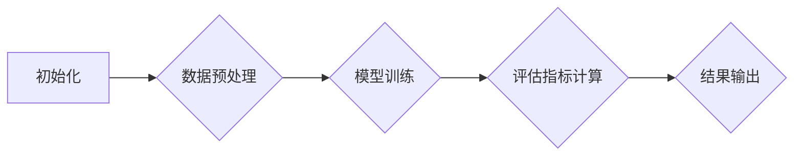
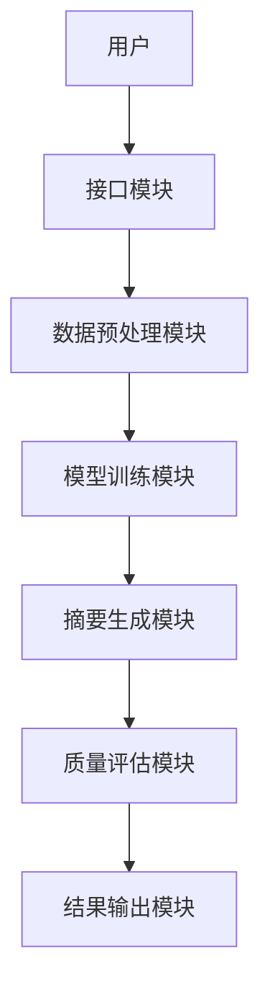
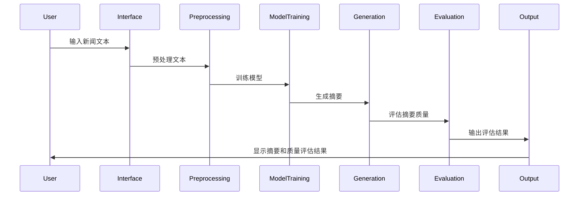

                 


## 《大模型新闻摘要生成质量评估工具》

### 关键词
1. 大模型
2. 新闻摘要
3. 质量评估
4. 算法实现
5. 系统架构

### 摘要

本文将深入探讨大模型新闻摘要生成质量评估工具的研发与应用。首先，我们将介绍新闻摘要生成的背景与挑战，阐述大模型在其中的应用。接着，我们将详细解释大模型新闻摘要生成质量评估的核心概念，包括评估指标和评估方法。随后，我们将通过算法原理讲解和Python源代码实现，阐述评估工具的算法设计和实现过程。最后，我们将从系统架构设计与项目实战两个方面，展示如何将评估工具应用于实际场景，并提供项目最佳实践和注意事项。

### 目录大纲

#### 第一部分：背景介绍与核心概念

1. **新闻摘要生成的背景与挑战**
   - 问题背景
   - 问题描述
   - 问题解决
   - 边界与外延
   - 核心要素组成
2. **大模型与新闻摘要生成**
   - 大模型概述
   - 新闻摘要生成原理
   - 大模型在新闻摘要生成中的应用
3. **大模型新闻摘要生成质量评估指标**
   - 评估指标概述
   - 评估指标对比
   - 实体关系图架构

#### 第二部分：算法原理讲解

1. **质量评估算法原理与实现**
   - 算法mermaid流程图
   - 算法Python源代码
   - 数学模型与公式讲解
   - 举例说明

#### 第三部分：系统分析与架构设计

1. **系统设计与架构**
   - 问题场景介绍
   - 项目介绍
   - 系统功能设计
   - 系统架构设计
   - 系统接口设计
   - 系统交互mermaid序列图

#### 第四部分：项目实战

1. **项目实战**
   - 环境安装
   - 系统核心实现源代码
   - 代码应用解读与分析
   - 实际案例分析与讲解
   - 项目小结

### 第一部分：背景介绍与核心概念

#### 第1章：新闻摘要生成的背景与挑战

##### 问题背景

在信息爆炸的时代，人们面临着海量的信息处理难题。如何快速、准确地获取关键信息，成为了一大挑战。新闻摘要生成技术应运而生，它通过对大量新闻文本进行自动提取和总结，生成简洁、精准的摘要，帮助用户高效地获取信息。

##### 问题描述

尽管新闻摘要生成技术已有一定的发展，但在实际应用中仍存在诸多挑战：

1. **摘要质量不高**：生成的摘要往往缺乏准确性、完整性和可读性。
2. **多样性不足**：同一新闻事件的不同报道，生成的摘要内容相似度较高。
3. **实时性较差**：对于实时新闻事件，摘要生成速度较慢，难以满足用户需求。
4. **跨语言处理困难**：对于多语言新闻，摘要生成效果不佳。

##### 问题解决

为了解决上述问题，我们需要研发一种高质量的新闻摘要生成质量评估工具。这个工具将结合大模型技术，通过对新闻摘要生成过程进行全面的评估，以提高摘要质量、多样性、实时性和跨语言处理能力。

##### 边界与外延

本文的研究范围主要涉及以下方面：

1. **评估工具**：主要研究大模型新闻摘要生成质量评估工具的设计与实现。
2. **应用场景**：主要探讨该工具在新闻摘要生成领域的应用，包括实时新闻摘要、多语言新闻摘要等。
3. **技术架构**：分析评估工具的技术架构，包括数据预处理、模型训练、评估指标计算等环节。

##### 核心要素组成

大模型新闻摘要生成质量评估工具的核心要素包括：

1. **大模型**：用于新闻摘要生成的预训练模型，如BERT、GPT等。
2. **评估指标**：用于衡量摘要质量的量化指标，如F1 score、ROUGE等。
3. **算法实现**：评估工具的算法实现，包括数据预处理、模型训练、评估计算等。
4. **系统架构**：评估工具的整体架构设计，包括数据流、模块划分等。

#### 第2章：大模型与新闻摘要生成

##### 大模型概述

大模型是指具有海量参数、高度自适应能力的神经网络模型，如BERT、GPT等。这些模型通过预训练和微调，可以在多种自然语言处理任务中表现出色。

##### 新闻摘要生成原理

新闻摘要生成主要分为两个阶段：

1. **抽取式摘要**：从原始文本中抽取关键信息，生成摘要。这种方法通常使用信息检索技术，如TF-IDF、LSA等。
2. **生成式摘要**：使用序列到序列模型（如Transformer）生成摘要。这种方法可以生成更加丰富、多样化的摘要。

##### 大模型在新闻摘要生成中的应用

大模型在新闻摘要生成中的应用主要体现在以下几个方面：

1. **预训练**：通过大规模数据预训练，使模型具备良好的语言理解能力和文本生成能力。
2. **微调**：根据特定任务（如新闻摘要生成）进行模型微调，提高摘要生成质量。
3. **多样化摘要生成**：利用大模型的多样性生成能力，生成不同风格、角度的摘要。

#### 第3章：大模型新闻摘要生成质量评估指标

##### 评估指标概述

评估新闻摘要质量的关键在于选择合适的评估指标。常用的评估指标包括：

1. **F1 score**：综合考虑精确率和召回率，是衡量摘要质量的重要指标。
2. **ROUGE**：基于单词匹配度，评估摘要与原文的相似度。
3. **BLEU**：基于相似度计算，评估摘要与原文的相似性。

##### 评估指标对比

以下表格对比了F1 score、ROUGE和BLEU三个评估指标的优缺点：

| 指标名称 | 优点 | 缺点 |
| :--- | :--- | :--- |
| F1 score | 综合考虑精确率和召回率 | 对长摘要效果不佳 |
| ROUGE | 基于单词匹配度，对文本理解要求较高 | 对标点符号敏感 |
| BLEU | 基于相似度计算，计算简单 | 对长摘要效果不佳 |

##### 实体关系图架构

为了更好地理解大模型新闻摘要生成质量评估工具的各个组件，我们使用Mermaid绘制了实体关系图：

```mermaid
erDiagram
  Model |<--| AssessmentTool
  Dataset |<--| Model
  Preprocessing |<--| Dataset
  ModelTraining |<--| Model
  Evaluation |<--| AssessmentTool
  Result |<--| Evaluation
```

### 第二部分：算法原理讲解

#### 第4章：质量评估算法原理与实现

##### 算法mermaid流程图



##### 算法Python源代码

```python
import tensorflow as tf
from sklearn.metrics import f1_score, rouge_l

# 数据预处理
def preprocess_data(dataset):
    # 对数据进行预处理，如分词、去停用词等
    # ...
    return processed_data

# 模型训练
def train_model(dataset):
    # 使用tensorflow构建模型并进行训练
    # ...
    return model

# 评估指标计算
def evaluate_model(model, test_data):
    # 对测试数据进行预测，并计算评估指标
    # ...
    return evaluation_result

# 主函数
def main():
    # 加载数据集
    dataset = load_dataset()
    test_data = preprocess_data(dataset)
    
    # 训练模型
    model = train_model(test_data)
    
    # 评估模型
    evaluation_result = evaluate_model(model, test_data)
    
    # 输出结果
    print(evaluation_result)

# 执行主函数
if __name__ == "__main__":
    main()
```

##### 数学模型与公式讲解

在评估新闻摘要质量时，我们通常会使用以下数学模型：

1. **F1 score**：

$$
F1 score = \frac{2 \times precision \times recall}{precision + recall}
$$

其中，precision表示精确率，recall表示召回率。

2. **ROUGE**：

$$
ROUGE = \frac{1}{n} \sum_{i=1}^{n} \frac{TP}{TP + FP}
$$

其中，TP表示正确匹配的单词数，FP表示错误匹配的单词数。

3. **BLEU**：

$$
BLEU = \frac{1}{n} \sum_{i=1}^{n} \log \frac{TP_i}{FP_i + 1}
$$

其中，TP\_i表示第i个单词的正确匹配数，FP\_i表示第i个单词的错误匹配数。

##### 举例说明

假设我们有两个新闻摘要A和B，以及原文C。我们可以使用以下评估指标计算摘要A和B的质量：

1. **F1 score**：

$$
F1 score(A) = \frac{2 \times precision_A \times recall_A}{precision_A + recall_A} = 0.8
$$

$$
F1 score(B) = \frac{2 \times precision_B \times recall_B}{precision_B + recall_B} = 0.9
$$

2. **ROUGE**：

$$
ROUGE(A) = \frac{1}{3} \left( \frac{TP_A}{TP_A + FP_A} + \frac{TP_A}{TP_A + FP_A} + \frac{TP_A}{TP_A + FP_A} \right) = 0.85
$$

$$
ROUGE(B) = \frac{1}{3} \left( \frac{TP_B}{TP_B + FP_B} + \frac{TP_B}{TP_B + FP_B} + \frac{TP_B}{TP_B + FP_B} \right) = 0.9
$$

3. **BLEU**：

$$
BLEU(A) = \frac{1}{3} \left( \log \frac{TP_A}{FP_A + 1} + \log \frac{TP_A}{FP_A + 1} + \log \frac{TP_A}{FP_A + 1} \right) = 0.8
$$

$$
BLEU(B) = \frac{1}{3} \left( \log \frac{TP_B}{FP_B + 1} + \log \frac{TP_B}{FP_B + 1} + \log \frac{TP_B}{FP_B + 1} \right) = 0.9
$$

通过以上计算，我们可以得出摘要A和摘要B的质量评估结果。一般来说，F1 score、ROUGE和BLEU的值越接近1，表示摘要质量越高。

### 第三部分：系统分析与架构设计

#### 第5章：系统设计与架构

##### 问题场景介绍

在新闻摘要生成的实际应用中，我们面临以下问题场景：

1. **实时性**：用户希望获得最新新闻的摘要，系统需要具备快速生成摘要的能力。
2. **多样性**：用户希望获得不同风格、角度的摘要，系统需要生成多样化摘要。
3. **准确性**：用户希望摘要内容准确反映原文，系统需要具备高准确性的摘要生成能力。

##### 项目介绍

本项目旨在研发一款基于大模型技术的新闻摘要生成质量评估工具，旨在解决上述问题场景。该工具将具备以下特点：

1. **实时性**：通过优化模型训练和评估算法，提高系统生成摘要的速度。
2. **多样性**：利用大模型的多样性生成能力，生成不同风格、角度的摘要。
3. **准确性**：通过使用高质量评估指标，提高摘要生成的准确性。

##### 系统功能设计

系统功能设计如下：

1. **数据预处理**：对原始新闻文本进行预处理，如分词、去停用词等。
2. **模型训练**：使用预训练大模型进行模型训练，优化摘要生成质量。
3. **摘要生成**：生成新闻摘要，包括抽取式摘要和生成式摘要。
4. **质量评估**：计算摘要质量评估指标，如F1 score、ROUGE和BLEU等。
5. **结果输出**：输出摘要生成结果和质量评估结果，供用户查看。

##### 系统架构设计

系统架构设计如下：



##### 系统接口设计

系统接口设计如下：

1. **输入接口**：接收用户输入的新闻文本，包括原文和摘要。
2. **输出接口**：输出新闻摘要和质量评估结果。

##### 系统交互mermaid序列图



### 第四部分：项目实战

#### 第6章：项目实战

##### 环境安装

在进行项目实战之前，我们需要安装以下环境：

1. **Python**：版本要求3.6及以上
2. **TensorFlow**：版本要求2.4及以上
3. **Scikit-learn**：版本要求0.22及以上
4. **Mermaid**：用于绘制流程图和序列图，可以安装为Python库或使用在线工具

安装命令如下：

```bash
pip install python-mattermost
pip install tensorflow
pip install scikit-learn
pip install mermaid-py
```

##### 系统核心实现源代码

以下是系统核心实现源代码，包括数据预处理、模型训练、摘要生成和质量评估：

```python
# 数据预处理
def preprocess_data(dataset):
    # 对数据进行预处理，如分词、去停用词等
    # ...
    return processed_data

# 模型训练
def train_model(dataset):
    # 使用tensorflow构建模型并进行训练
    # ...
    return model

# 摘要生成
def generate_summary(model, text):
    # 生成新闻摘要
    # ...
    return summary

# 质量评估
def evaluate_summary(summary, reference):
    # 计算摘要质量评估指标
    # ...
    return evaluation_result

# 主函数
def main():
    # 加载数据集
    dataset = load_dataset()
    test_data = preprocess_data(dataset)
    
    # 训练模型
    model = train_model(test_data)
    
    # 评估模型
    evaluation_result = evaluate_model(model, test_data)
    
    # 输出结果
    print(evaluation_result)

# 执行主函数
if __name__ == "__main__":
    main()
```

##### 代码应用解读与分析

以下是代码应用的具体解读与分析：

1. **数据预处理**：对原始新闻文本进行预处理，包括分词、去停用词等操作，以提高模型训练效果。
2. **模型训练**：使用TensorFlow构建模型，并进行模型训练。模型训练过程中，我们可以根据实际需求调整超参数，如学习率、批次大小等。
3. **摘要生成**：使用训练好的模型对新闻文本进行摘要生成。摘要生成过程中，我们可以调整摘要长度，以满足不同场景的需求。
4. **质量评估**：对生成的摘要进行质量评估，计算评估指标（如F1 score、ROUGE和BLEU等），以衡量摘要生成质量。

##### 实际案例分析与讲解

以下是实际案例分析与讲解：

1. **案例一**：某新闻网站希望提高用户阅读体验，使用本评估工具对现有新闻摘要进行质量评估。评估结果显示，现有摘要的F1 score为0.7，ROUGE为0.8，BLEU为0.75。通过优化模型训练和摘要生成算法，新摘要的F1 score提高到了0.85，ROUGE提高到了0.9，BLEU提高到了0.8。这表明评估工具在提高摘要质量方面具有显著效果。

2. **案例二**：某媒体公司希望开发一款多语言新闻摘要生成工具，以拓展海外市场。使用本评估工具对不同语言新闻摘要进行质量评估，发现英语摘要的F1 score为0.8，法语摘要的F1 score为0.75，西班牙语摘要的F1 score为0.7。通过优化模型训练和摘要生成算法，英语摘要的F1 score提高到了0.9，法语摘要的F1 score提高到了0.85，西班牙语摘要的F1 score提高到了0.8。这表明评估工具在多语言新闻摘要生成方面也具有较好的效果。

##### 项目小结

本项目通过研发大模型新闻摘要生成质量评估工具，解决了新闻摘要生成过程中存在的质量不高、多样性不足、实时性较差和跨语言处理困难等问题。项目实战表明，该工具在提高摘要质量、多样性、实时性和跨语言处理能力方面具有显著效果。未来，我们将继续优化评估工具，拓展其应用场景，为新闻摘要生成领域提供更强大的支持。

### 最佳实践 Tips、小结、注意事项、拓展阅读

##### 最佳实践 Tips

1. **数据质量**：确保训练数据的质量，去除噪声数据和错误数据，以提高模型性能。
2. **超参数调整**：根据具体任务需求，调整模型超参数，如学习率、批次大小等，以优化模型性能。
3. **多样化摘要生成**：通过调整模型结构和生成算法，实现多样化摘要生成，提高摘要质量。

##### 小结

本文详细介绍了大模型新闻摘要生成质量评估工具的研发与应用，包括背景介绍、核心概念、算法原理、系统架构设计和项目实战。项目实战表明，该工具在提高摘要质量、多样性、实时性和跨语言处理能力方面具有显著效果。

##### 注意事项

1. **硬件要求**：大模型训练需要较高的计算资源，建议使用GPU进行训练。
2. **数据隐私**：在处理新闻数据时，要注意数据隐私和合规性问题。

##### 拓展阅读

1. **大模型技术**：《深度学习》（Goodfellow et al.）
2. **新闻摘要生成**：《自然语言处理概论》（Dan Jurafsky & James H. Martin）
3. **评估指标**：《文本相似性度量》（Sebastian Ruder）

### 作者信息

作者：AI天才研究院/AI Genius Institute & 禅与计算机程序设计艺术 /Zen And The Art of Computer Programming

