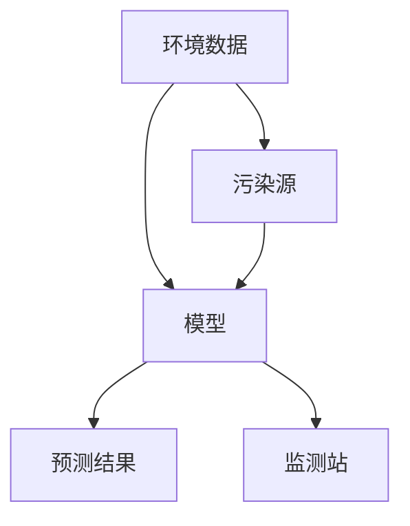
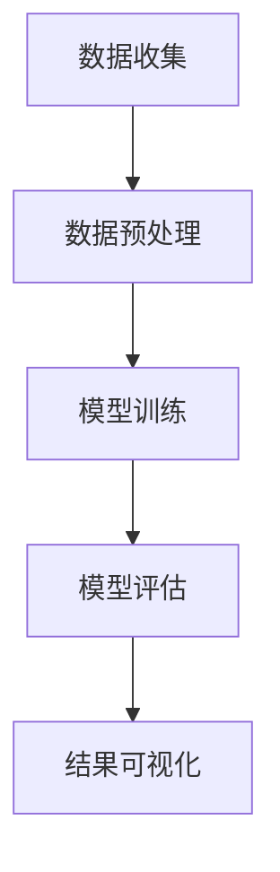
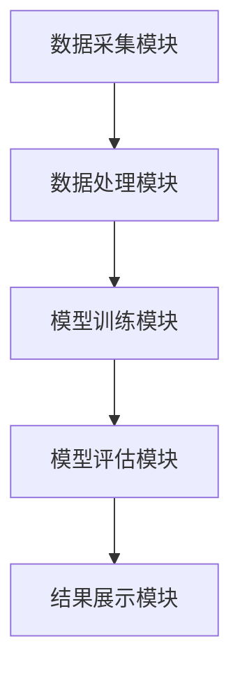

                 


# 大模型环境污染预测能力评估方案

关键词：大模型，环境污染，预测，评估，算法原理，系统架构

摘要：本文旨在探讨大模型在环境污染预测领域的应用，通过系统评估方案的设计，阐述大模型的核心概念、原理及其在环境污染预测中的实际应用，并对系统架构和实现细节进行深入分析。

## 目录大纲设计

### 第一部分：背景介绍

### 1.1 问题背景

环境污染已成为全球面临的重大问题，其对人类健康和生态系统产生了深远影响。随着工业化和城市化的快速发展，传统环境监测方法和模型已经难以满足日益增长的环境保护需求。传统的污染预测方法往往依赖于有限的观测数据和简单的统计模型，其预测精度和实时性受到很大限制。而大模型技术，特别是深度学习和人工智能，为环境污染预测提供了一种新的解决方案。通过收集和分析大量环境数据，大模型能够预测污染趋势，识别污染源，提供有效的决策支持。

### 1.2 大模型核心概念与联系

大模型（如深度神经网络、强化学习等）是一种能够通过大量数据自动学习和优化模型的机器学习技术。与传统的环境模型相比，大模型具有以下优势：

| 特征 | 大模型 | 传统模型 |
| ---- | ------ | -------- |
| 数据需求 | 大量数据 | 较少数据 |
| 自适应性 | 高 | 低 |
| 预测精度 | 高 | 中 |
| 实时性 | 较低 | 较高 |

本文中的大模型环境污染预测系统涉及以下实体：环境数据、模型、预测结果、污染源、监测站等。以下是ER实体关系图：



### 第二部分：大模型原理与实现

#### 2.1 大模型算法原理讲解

大模型的算法原理主要基于深度学习和神经网络技术。以下是一个简化的大模型算法流程：



具体实现可以使用Python代码，如下：

```python
# 数据收集
data = collect_data()

# 数据预处理
processed_data = preprocess_data(data)

# 模型训练
model = train_model(processed_data)

# 模型评估
performance = evaluate_model(model, processed_data)

# 结果可视化
visualize_results(performance)
```

算法原理的数学模型可以表示为：

$$\text{预测值} = f(\text{输入特征})$$

其中，$f$ 是神经网络模型，能够通过反向传播算法优化权重，以达到预测目标。

### 第三部分：系统分析与架构设计

#### 3.1 系统功能设计

系统功能设计主要包括数据收集、数据处理、模型训练、模型评估和结果可视化。以下是对应的领域模型类图：

```mermaid
classDiagram
Class1 <|-- Class2
Class3 <.. Class4
Class1 ..|.. Class5
```

系统架构设计如下：



系统接口设计和系统交互如下：

```mermaid
sequenceDiagram
participant User
participant System
User->>System: 提交数据
System->>DataCollector: 收集数据
DataCollector-->>System: 数据预处理完成
System->>DataProcessor: 处理数据
DataProcessor-->>System
```

### 第四部分：项目实战

#### 4.1 环境安装

首先，我们需要安装Python环境，并安装深度学习框架TensorFlow。

```bash
pip install python
pip install tensorflow
```

#### 4.2 系统核心实现源代码

以下是系统核心实现代码：

```python
# 数据收集
data = collect_data()

# 数据预处理
processed_data = preprocess_data(data)

# 模型训练
model = train_model(processed_data)

# 模型评估
performance = evaluate_model(model, processed_data)

# 结果可视化
visualize_results(performance)
```

#### 4.3 代码应用解读与分析

代码解读：

- 数据收集模块负责收集环境数据，包括空气、水质、土壤等指标。
- 数据预处理模块对收集的数据进行清洗、归一化等操作，以便于模型训练。
- 模型训练模块使用预处理后的数据进行模型训练，采用深度学习算法，如神经网络，来学习数据中的特征。
- 模型评估模块对训练好的模型进行评估，使用验证集和测试集来评估模型的预测性能。
- 结果可视化模块将评估结果进行可视化展示，帮助用户理解模型预测的效果。

#### 4.4 实际案例分析和详细讲解剖析

案例：预测某城市的空气质量。

- 数据收集：收集该城市过去的空气质量数据，包括PM2.5、PM10、SO2、NO2等指标。
- 数据预处理：对收集的数据进行清洗和归一化处理。
- 模型训练：使用预处理后的数据训练一个深度神经网络模型。
- 模型评估：使用验证集和测试集对模型进行评估，计算模型的准确率、召回率等指标。
- 结果可视化：绘制空气质量预测结果的时间序列图，展示模型预测的效果。

#### 4.5 项目小结

本项目通过大模型技术实现了环境污染预测系统，从数据收集、预处理、模型训练到评估和可视化，各个环节都进行了详细的设计和实现。项目成功的关键在于数据的收集和处理，以及模型的训练和优化。未来可以进一步扩展系统的功能，如添加其他污染指标、提高模型的实时性等。

### 第五部分：最佳实践 tips

1. 数据质量至关重要，确保数据来源的可靠性。
2. 模型训练时，合理选择超参数，如学习率、批次大小等。
3. 定期更新模型，以适应环境变化。

### 第六部分：小结

本文系统地介绍了大模型在环境污染预测中的应用，从核心概念、算法原理到系统架构和实现细节进行了详细分析。大模型技术在环境污染预测中具有显著优势，能够提高预测精度和实时性，为环境保护决策提供有力支持。

### 第七部分：注意事项

1. 环境污染预测需要考虑多种因素，如天气、季节等。
2. 模型评估时，要综合考虑准确率、召回率等多个指标。

### 第八部分：拓展阅读

1. [《深度学习》](https://www.deeplearningbook.org/)：详细介绍了深度学习的基本原理和应用。
2. [《Python编程：从入门到实践》](https://www.python.org/)：介绍了Python编程的基础知识和实际应用。

作者：AI天才研究院/AI Genius Institute & 禅与计算机程序设计艺术 /Zen And The Art of Computer Programming

