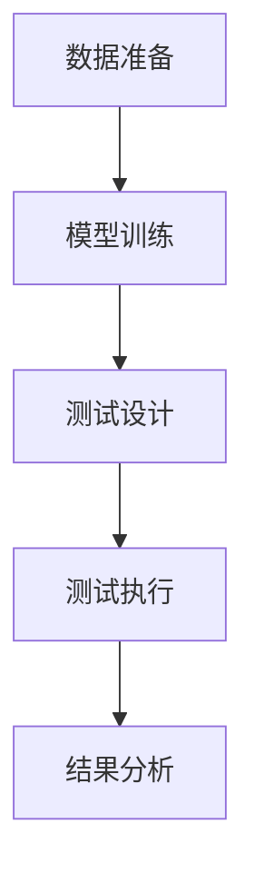
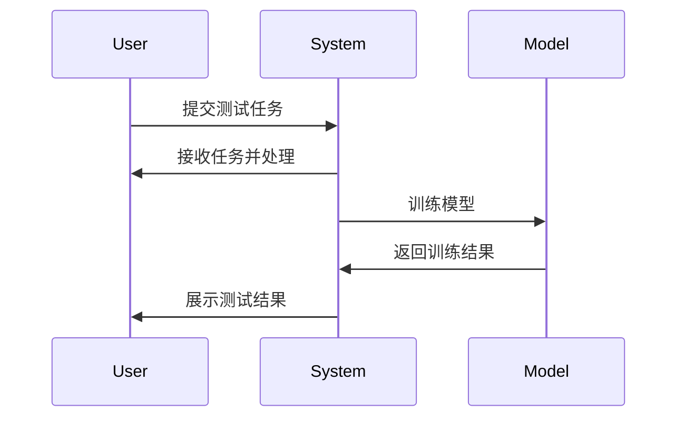

                 

### 文章标题：《大模型环境适应能力评估：LLM设计的动态场景测试》

### 关键词：大模型，环境适应能力，LLM，动态场景测试，算法原理

### 摘要：
本文将深入探讨大模型环境适应能力的评估方法，以及如何设计动态场景测试来对LLM（大型语言模型）进行评估。通过介绍核心概念、算法原理、系统架构设计、项目实战等多个方面，本文旨在为读者提供一个全面、系统、易于理解的技术指南。

---

## 引言

大模型环境适应能力的评估在人工智能领域具有重要意义。随着深度学习技术的发展，大型语言模型（LLM）在自然语言处理任务中展现出了强大的能力，但它们在多变的环境中的适应能力仍然是一个挑战。本文将围绕这一主题，详细探讨大模型环境适应能力评估的重要性，以及如何通过动态场景测试来评估LLM的设计。

### 1.1 大模型环境适应能力评估的意义

大模型环境适应能力评估的核心在于验证LLM在实际应用场景中的表现。随着数据集和环境的变化，大模型需要具备适应能力，以保证其输出结果的准确性和可靠性。评估大模型环境适应能力不仅有助于提高模型的性能，还可以为模型的优化和改进提供有力支持。

### 1.2 动态场景测试在LLM设计中的应用

动态场景测试是一种模拟现实世界多变环境的方法，通过引入变化因素，测试LLM在不同环境下的表现。这种方法能够有效地评估大模型的适应能力，为模型的优化和改进提供实证数据。

### 1.3 本书结构安排

本文分为八个章节，将依次介绍大模型环境适应能力评估的背景、核心概念、算法原理、系统分析与架构设计、项目实战以及最佳实践和拓展等内容。

---

## 第2章 大模型与环境适应能力

### 2.1 大模型的基本概念

大模型是指参数规模达到数百万甚至数十亿级别的深度学习模型。这类模型在处理复杂数据时具有优越的性能，但同时也带来了挑战，如训练成本高、计算资源需求大等。

### 2.2 环境适应能力的概念与评价指标

环境适应能力是指模型在不同环境下的适应和调整能力。评价指标包括鲁棒性、泛化能力、动态适应能力等。

### 2.3 大模型环境适应能力的挑战

大模型环境适应能力的挑战主要体现在数据多样性、模型复杂性和计算资源限制等方面。

---

## 第3章 动态场景测试方法

### 3.1 动态场景测试的基本原理

动态场景测试是一种通过引入变化因素，模拟真实世界环境的方法，以评估模型在不同环境下的表现。

### 3.2 动态场景测试的类型

动态场景测试可分为负载动态场景测试和环境变化动态场景测试两种类型。

### 3.3 动态场景测试的流程

动态场景测试的流程包括数据准备、测试设计、测试实施和结果分析等步骤。

---

## 第4章 LLM设计的动态场景测试流程

### 4.1 数据准备

数据准备是动态场景测试的关键步骤，包括数据收集、数据预处理和数据清洗等环节。

### 4.2 模型选择与训练

模型选择与训练是动态场景测试的核心环节，包括模型选择、超参数调优和模型训练等步骤。

### 4.3 动态场景测试设计与实施

动态场景测试设计与实施是评估LLM环境适应能力的关键步骤，包括测试场景设计、测试执行和结果分析等环节。

---

## 第5章 算法原理讲解

### 5.1 动态场景测试算法概述

动态场景测试算法主要包括测试数据生成、模型评估和结果分析等模块。

### 5.2 算法mermaid流程图

算法mermaid流程图如下所示：



### 5.3 Python代码实现

```python
# 数据准备
data = prepare_data()

# 模型训练
model = train_model(data)

# 测试设计
test_design = design_test()

# 测试执行
results = execute_test(model, test_design)

# 结果分析
analyze_results(results)
```

### 5.4 数学模型与公式

动态场景测试的数学模型可以表示为：

$$
适应能力 = \frac{模型输出一致性}{环境变化程度}
$$

其中，模型输出一致性反映了模型在不同环境下的输出稳定性，环境变化程度则表示环境的多样性。

---

## 第6章 系统分析与架构设计

### 6.1 问题场景介绍

问题场景包括数据收集、模型训练、测试执行和结果分析等环节。

### 6.2 系统功能设计

系统功能设计包括数据管理、模型管理、测试管理和结果分析等功能。

### 6.3 系统架构设计

系统架构设计采用分层架构，包括数据层、模型层、测试层和结果层等。

### 6.4 系统接口设计

系统接口设计包括数据接口、模型接口、测试接口和结果接口等。

### 6.5 系统交互mermaid序列图

系统交互mermaid序列图如下所示：



---

## 第7章 项目实战

### 7.1 环境安装与配置

环境安装与配置包括Python环境搭建、依赖库安装和系统配置等步骤。

### 7.2 系统核心实现源代码

系统核心实现源代码包括数据预处理、模型训练、测试设计和结果分析等模块。

### 7.3 代码应用解读与分析

代码应用解读与分析包括代码结构、模块功能、算法实现等方面。

### 7.4 实际案例分析与讲解

实际案例分析与讲解包括案例背景、案例步骤和案例结果分析等。

### 7.5 项目小结

项目小结包括项目总结、项目成果和项目不足等。

---

## 第8章 最佳实践与拓展

### 8.1 最佳实践

最佳实践包括数据准备、模型训练、测试设计和结果分析等方面的经验总结。

### 8.2 小结

小结对全文内容进行总结，强调核心观点和关键点。

### 8.3 注意事项

注意事项包括模型训练中的注意事项、测试设计中的注意事项等。

### 8.4 拓展阅读

拓展阅读推荐进一步学习和研究的相关文献和资源。

---

## 作者信息

作者：AI天才研究院/AI Genius Institute & 禅与计算机程序设计艺术 /Zen And The Art of Computer Programming

---

通过以上章节的内容，本文旨在为读者提供一个全面、系统、易于理解的大模型环境适应能力评估和动态场景测试指南。希望本文能对读者在相关领域的研究和应用提供有益的参考和启示。

