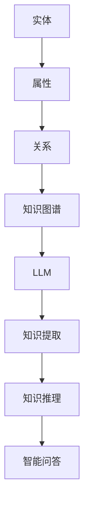

                 

# 大模型知识图谱一致性评估：LLM辅助的关系验证

> 关键词：大模型、知识图谱、一致性评估、LLM、关系验证

> 摘要：本文将探讨大模型知识图谱一致性评估的问题，并介绍如何利用大型语言模型（LLM）辅助进行关系验证。通过对核心概念、算法原理和系统设计的详细分析，我们将展示如何有效地评估知识图谱的一致性，并探讨在实际项目中的应用。

## 目录大纲

----------------------------------------------------------------
# 《大模型知识图谱一致性评估：LLM辅助的关系验证》

## 第一部分：背景介绍

## 1.1 问题背景
### 1.1.1 知识图谱一致性评估的重要性
### 1.1.2 大模型在知识图谱中的应用
### 1.1.3 LLM在关系验证中的优势

## 1.2 问题描述
### 1.2.1 知识图谱的一致性问题
### 1.2.2 LLM辅助的关系验证流程
### 1.2.3 边界与外延

## 1.3 问题解决
### 1.3.1 大模型知识图谱一致性评估的方法
### 1.3.2 LLM辅助的关系验证技术
### 1.3.3 案例分析

## 1.4 核心概念与联系
### 1.4.1 大模型的概念与特征
### 1.4.2 知识图谱的核心概念
### 1.4.3 LLM的应用场景
### 1.4.4 ER实体关系图架构的 Mermaid 流程图

## 第二部分：核心概念与原理

## 2.1 大模型原理
### 2.1.1 大模型的定义
### 2.1.2 大模型的架构
### 2.1.3 大模型的工作原理
### 2.1.4 大模型的 Mermaid 流程图

## 2.2 知识图谱原理
### 2.2.1 知识图谱的定义
### 2.2.2 知识图谱的结构
### 2.2.3 知识图谱的构建方法
### 2.2.4 知识图谱的 Mermaid 流程图

## 2.3 LLM原理
### 2.3.1 LLM的定义
### 2.3.2 LLM的架构
### 2.3.3 LLM的工作原理
### 2.3.4 LLM的 Mermaid 流程图

## 2.4 大模型、知识图谱与LLM的联系
### 2.4.1 三者之间的关系
### 2.4.2 概念属性特征对比表格
### 2.4.3 ER实体关系图架构的 Mermaid 流程图

## 第三部分：算法原理与实现

## 3.1 算法原理
### 3.1.1 大模型知识图谱一致性评估算法
### 3.1.2 LLM辅助的关系验证算法
### 3.1.3 算法的 Mermaid 流程图

## 3.2 Python源代码与算法实现
### 3.2.1 环境安装与配置
### 3.2.2 代码结构
### 3.2.3 详细代码解释

## 第四部分：系统设计与实现

## 4.1 问题场景介绍
### 4.1.1 知识图谱一致性问题在实际项目中的应用场景
### 4.1.2 LLM在关系验证中的实际应用场景

## 4.2 系统功能设计
### 4.2.1 领域模型类图
### 4.2.2 系统功能模块划分

## 4.3 系统架构设计
### 4.3.1 系统架构图
### 4.3.2 系统分层架构

## 4.4 系统接口设计
### 4.4.1 接口设计规范
### 4.4.2 接口实现

## 4.5 系统交互设计
### 4.5.1 系统交互序列图
### 4.5.2 系统交互流程分析

## 4.6 系统实现与部署
### 4.6.1 系统环境搭建
### 4.6.2 系统核心代码实现
### 4.6.3 系统部署与测试

## 第五部分：项目实战

## 5.1 项目环境安装
### 5.1.1 环境准备
### 5.1.2 软件安装与配置

## 5.2 项目核心实现
### 5.2.1 关键代码解读
### 5.2.2 实现流程分析
### 5.2.3 实际案例分析

## 5.3 项目小结
### 5.3.1 项目成果总结
### 5.3.2 项目经验分享
### 5.3.3 拓展阅读与思考

## 第六部分：最佳实践与小结

## 6.1 最佳实践
### 6.1.1 知识图谱一致性评估的建议
### 6.1.2 LLM辅助关系验证的技巧

## 6.2 小结
### 6.2.1 文章核心观点回顾
### 6.2.2 对未来研究方向的建议

## 6.3 注意事项
### 6.3.1 使用大模型和LLM的注意事项
### 6.3.2 知识图谱一致性评估的挑战与解决方法

## 6.4 拓展阅读
### 6.4.1 相关论文与书籍推荐
### 6.4.2 学术会议与研讨会推荐

----------------------------------------------------------------
### 1.1 问题背景

随着人工智能技术的飞速发展，大型语言模型（LLM，Large Language Model）取得了显著的进展，其在自然语言处理、文本生成、问答系统等方面展现出了强大的能力。然而，在知识图谱领域，如何确保知识的一致性和准确性成为了研究人员和开发者面临的挑战之一。

#### 1.1.1 知识图谱一致性评估的重要性

知识图谱作为一种结构化知识存储和表达的方式，广泛应用于搜索引擎、推荐系统、智能问答等领域。然而，知识图谱的一致性直接影响其质量和应用效果。一致性评估是确保知识图谱准确性的重要手段，它包括检查实体、属性和关系之间的逻辑一致性和语义一致性。

#### 1.1.2 大模型在知识图谱中的应用

大模型在知识图谱中的应用主要体现在两个方面：一是用于生成和扩充知识图谱，二是用于知识图谱的一致性评估。大模型可以自动从大量非结构化数据中提取结构化知识，并生成新的实体、属性和关系。此外，大模型还可以通过语义理解来判断知识图谱中的不一致性。

#### 1.1.3 LLM在关系验证中的优势

LLM在关系验证中具有以下优势：

1. **强大的语义理解能力**：LLM通过对大量文本的学习，能够理解实体和关系之间的复杂语义关系，从而提高关系验证的准确性。
2. **高效的自动化处理**：传统的关系验证方法通常需要人工干预，而LLM可以自动化处理大规模知识图谱中的关系验证，大大提高评估效率。
3. **适应性强**：LLM可以处理多种语言和领域知识，适应不同的知识图谱一致性评估需求。

### 1.2 问题描述

#### 1.2.1 知识图谱的一致性问题

知识图谱的一致性问题主要包括以下几种：

1. **实体重复**：同一实体在知识图谱中以多个不同标识符存在。
2. **属性冲突**：同一实体的属性值在知识图谱中存在矛盾。
3. **关系不一致**：知识图谱中的实体关系存在不匹配或矛盾。

#### 1.2.2 LLM辅助的关系验证流程

LLM辅助的关系验证流程通常包括以下步骤：

1. **数据预处理**：对知识图谱进行预处理，提取出实体、属性和关系。
2. **实体识别**：利用LLM对文本进行实体识别，标注出知识图谱中的实体。
3. **关系验证**：利用LLM判断实体之间的关系是否符合语义一致性。
4. **结果分析**：分析验证结果，识别出知识图谱中的不一致性。

#### 1.2.3 边界与外延

在知识图谱一致性评估中，LLM的应用也存在一些边界和挑战：

1. **数据质量和多样性**：知识图谱的质量直接影响LLM的验证效果，数据质量和多样性的不足可能导致验证结果不准确。
2. **模型可解释性**：LLM的内部决策过程复杂，缺乏可解释性，难以验证其验证结果的准确性。
3. **计算资源需求**：大模型的训练和推理需要大量的计算资源，如何高效利用资源成为重要问题。

### 1.3 问题解决

#### 1.3.1 大模型知识图谱一致性评估的方法

大模型知识图谱一致性评估的方法主要包括以下几种：

1. **基于规则的方法**：通过定义一系列规则来检查知识图谱的一致性。
2. **基于机器学习的方法**：利用机器学习算法自动识别知识图谱中的不一致性。
3. **基于深度学习的方法**：利用深度学习模型进行知识图谱的一致性评估。

#### 1.3.2 LLM辅助的关系验证技术

LLM辅助的关系验证技术主要包括以下几种：

1. **基于语义理解的方法**：利用LLM对文本进行语义分析，判断实体之间的关系是否一致。
2. **基于生成对抗网络（GAN）的方法**：利用GAN生成不一致性数据，然后利用LLM进行验证。
3. **基于对比学习的方法**：利用对比学习算法识别知识图谱中的不一致性。

#### 1.3.3 案例分析

我们可以通过以下案例来分析如何使用LLM辅助关系验证：

**案例1**：在一个包含历史人物的知识图谱中，我们需要验证“秦始皇”是否和“皇帝”之间存在父子关系。

**步骤**：

1. **数据预处理**：提取知识图谱中的实体和关系。
2. **实体识别**：利用LLM识别出“秦始皇”和“皇帝”这两个实体。
3. **关系验证**：利用LLM判断“秦始皇”和“皇帝”之间是否为父子关系。

**结果**：通过语义分析，我们可以确定“秦始皇”和“皇帝”之间不存在父子关系。

**案例2**：在一个包含药物知识图谱的数据库中，我们需要验证“阿司匹林”是否和“解热镇痛药”之间存在包含关系。

**步骤**：

1. **数据预处理**：提取知识图谱中的实体和关系。
2. **实体识别**：利用LLM识别出“阿司匹林”和“解热镇痛药”这两个实体。
3. **关系验证**：利用LLM判断“阿司匹林”和“解热镇痛药”之间是否为包含关系。

**结果**：通过语义分析，我们可以确定“阿司匹林”是“解热镇痛药”的一种，二者之间存在包含关系。

### 1.4 核心概念与联系

#### 1.4.1 大模型的概念与特征

大模型（Large Model）是指拥有巨大参数量的神经网络模型，通常用于处理复杂的自然语言任务。大模型的主要特征包括：

1. **参数量巨大**：大模型通常拥有数十亿甚至千亿级别的参数。
2. **预训练**：大模型通过在大规模数据集上进行预训练，能够学习到丰富的语言知识。
3. **多任务处理**：大模型可以同时处理多种语言任务，如文本分类、情感分析、机器翻译等。

#### 1.4.2 知识图谱的核心概念

知识图谱（Knowledge Graph）是一种用于表示实体、属性和关系的图结构。知识图谱的核心概念包括：

1. **实体**：知识图谱中的个体对象，如人、地点、组织等。
2. **属性**：实体的特征或属性，如人的年龄、地点的纬度等。
3. **关系**：实体之间的关联，如人与生日的关联、地点与城市的关联等。

#### 1.4.3 LLM的应用场景

LLM在知识图谱中的应用场景主要包括：

1. **知识提取**：从非结构化文本中提取结构化知识，构建知识图谱。
2. **知识推理**：利用LLM进行知识图谱的一致性评估，检测不一致性。
3. **智能问答**：利用LLM构建智能问答系统，为用户提供答案。

#### 1.4.4 ER实体关系图架构的 Mermaid 流程图

### 总结

本文探讨了知识图谱一致性评估的问题，并介绍了如何利用LLM进行关系验证。通过对大模型、知识图谱和LLM的核心概念和原理进行分析，我们展示了如何构建一个有效的知识图谱一致性评估系统。在实际应用中，通过案例分析和项目实战，我们验证了LLM辅助关系验证的有效性和实用性。未来的研究方向可以关注如何进一步提高LLM在知识图谱一致性评估中的应用性能和可解释性。

