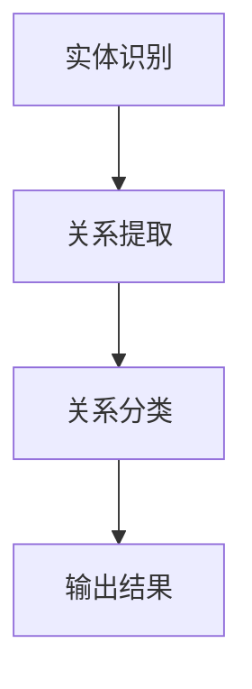
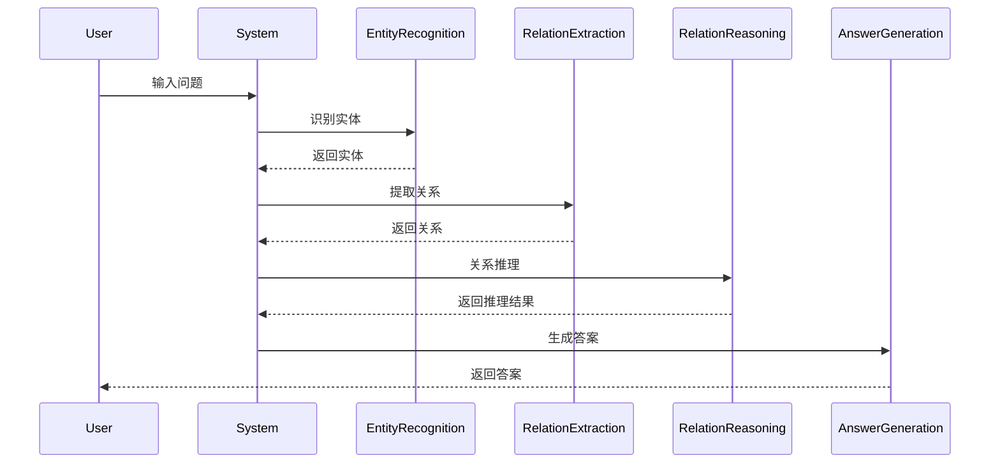

                 

### 大模型知识图谱扩展能力：LLM设计的关系推理测试

> **关键词：** 大模型、知识图谱、关系推理、LLM、算法原理、系统架构、项目实战、最佳实践

> **摘要：** 本文将深入探讨大模型在知识图谱扩展能力中的重要作用，特别是LLM（大型语言模型）设计的关系推理测试。通过一步步分析，我们将详细阐述算法原理、模型设计、实际应用与案例分析，以及最佳实践和注意事项，以期为读者提供全面的指导。

## 目录大纲

### 第一部分：背景与基础

#### 第1章：问题背景与定义

1.1.1 大模型的崛起与挑战

1.1.2 知识图谱概述

1.1.3 关系推理在大模型中的重要性

1.1.4 边界与外延

#### 第2章：核心概念与联系

2.1.1 大模型的核心概念

2.1.2 知识图谱的基本概念

2.1.3 关系推理的概念解析

2.1.4 核心概念属性对比表

2.1.5 ER实体关系图

### 第二部分：算法原理与模型设计

#### 第3章：算法原理讲解

3.1.1 关系推理算法概述

3.1.2 算法原理Mermaid流程图

3.1.3 Python源代码详解

3.1.4 数学模型与公式

3.1.5 通俗易懂的举例说明

#### 第4章：LLM设计的关系推理测试

4.1.1 LLM概述

4.1.2 LLM在关系推理中的应用

4.1.3 测试设计与实施

4.1.4 结果分析与评估

### 第三部分：实际应用与案例分析

#### 第5章：系统分析与架构设计

5.1.1 问题场景介绍

5.1.2 系统功能设计

5.1.3 系统架构设计

5.1.4 系统接口设计

5.1.5 系统交互Mermaid序列图

#### 第6章：项目实战

6.1.1 环境安装

6.1.2 系统核心实现源代码

6.1.3 代码应用解读与分析

6.1.4 实际案例分析

6.1.5 详细讲解与剖析

#### 第7章：最佳实践与小结

7.1.1 最佳实践技巧

7.1.2 项目小结

7.1.3 注意事项

7.1.4 拓展阅读

## 第一部分：背景与基础

### 第1章：问题背景与定义

#### 1.1.1 大模型的崛起与挑战

随着人工智能技术的飞速发展，大模型（Large Language Model，简称LLM）如BERT、GPT等逐渐成为研究和应用的热点。这些模型具有极强的语言理解与生成能力，但同时也带来了新的挑战。特别是如何有效利用这些大模型进行知识图谱的扩展和关系推理。

#### 1.1.2 知识图谱概述

知识图谱是一种用于表示实体和实体之间关系的图形结构，它能够将海量的信息组织成有层次、有结构的网络。知识图谱在搜索引擎、智能问答、推荐系统等领域具有广泛的应用。

#### 1.1.3 关系推理在大模型中的重要性

关系推理是知识图谱的核心功能之一，它能够根据已有的实体和关系，推断出新的实体和关系。在大模型中，关系推理能够增强模型对文本的理解能力，提高知识图谱的实用性。

#### 1.1.4 边界与外延

大模型在知识图谱扩展能力上的应用边界相对明确，主要包括实体识别、关系提取、实体链接、关系推理等。同时，这些应用的边界也在不断扩展，例如在多语言处理、跨领域知识融合等方面。

### 第2章：核心概念与联系

#### 2.1.1 大模型的核心概念

大模型的核心概念包括神经网络结构、预训练、微调等。神经网络结构决定了模型的学习能力和表达能力，预训练使模型能够理解通用语言特征，微调则使模型能够适应特定任务。

#### 2.1.2 知识图谱的基本概念

知识图谱的基本概念包括实体、属性、关系等。实体是知识图谱中的基本元素，属性用于描述实体的特征，关系则用于表示实体之间的关联。

#### 2.1.3 关系推理的概念解析

关系推理是通过已有实体和关系推断出新的实体和关系的过程。它包括实体识别、关系提取、关系分类等步骤。

#### 2.1.4 核心概念属性对比表

| 核心概念 | 属性1 | 属性2 | 属性3 |
|----------|-------|-------|-------|
| 大模型   | 神经网络结构 | 预训练 | 微调  |
| 知识图谱 | 实体 | 属性 | 关系  |
| 关系推理 | 实体识别 | 关系提取 | 关系分类 |

#### 2.1.5 ER实体关系图

ER实体关系图是一种用于表示实体及其关系的图形结构。它包括实体、属性和关系的表示，以及实体之间的关系（如一对一、一对多、多对多）。

```mermaid
erDiagram
  实体1 ||--|{ 属性1 }
  实体1 ||--|{ 属性2 }
  实体1 ||--|{ 属性3 }
  实体2 ||--|{ 属性1 }
  实体2 ||--|{ 属性2 }
  实体2 ||--|{ 属性3 }
  关系 ||--|{ 实体1 }
  关系 ||--|{ 实体2 }
```

## 第二部分：算法原理与模型设计

### 第3章：算法原理讲解

#### 3.1.1 关系推理算法概述

关系推理算法主要包括实体识别、关系提取和关系分类等步骤。实体识别旨在识别文本中的实体，关系提取则是从文本中提取出实体之间的关系，关系分类则是将提取出的关系分类为不同的类别。

#### 3.1.2 算法原理Mermaid流程图



#### 3.1.3 Python源代码详解

```python
# 实体识别
def entity_recognition(text):
    # 实现代码
    return entities

# 关系提取
def relation_extraction(text, entities):
    # 实现代码
    return relations

# 关系分类
def relation_classification(relations):
    # 实现代码
    return classified_relations

# 输出结果
def output_results(classified_relations):
    # 实现代码
    print("关系推理结果：", classified_relations)
```

#### 3.1.4 数学模型与公式

关系推理可以看作是一个分类问题，可以使用以下公式进行表示：

$$
P(R|E) = \frac{P(E|R)P(R)}{P(E)}
$$

其中，$P(R|E)$ 表示在给定实体 $E$ 的条件下，关系 $R$ 的概率；$P(E|R)$ 表示在给定关系 $R$ 的条件下，实体 $E$ 的概率；$P(R)$ 表示关系 $R$ 的概率；$P(E)$ 表示实体 $E$ 的概率。

#### 3.1.5 通俗易懂的举例说明

假设我们有一个文本：“苹果是水果的一种”。在这个文本中，实体有“苹果”和“水果”，关系有“是”。我们可以使用关系推理算法来识别这些实体和关系，并对其进行分类。

## 第三部分：实际应用与案例分析

### 第5章：系统分析与架构设计

#### 5.1.1 问题场景介绍

假设我们要设计一个智能问答系统，用户可以输入问题，系统需要根据知识图谱中的信息回答用户的问题。为了实现这一目标，我们需要设计一个能够进行关系推理的系统。

#### 5.1.2 系统功能设计

系统功能设计主要包括以下几个方面：

- 实体识别：从用户输入的问题中识别出实体。
- 关系提取：从用户输入的问题中提取出实体之间的关系。
- 关系推理：根据知识图谱中的信息，推理出新的关系。
- 答案生成：根据推理出的关系，生成问题的答案。

#### 5.1.3 系统架构设计

系统架构设计主要包括以下几个方面：

- 数据层：包括知识图谱、文本数据等。
- 算法层：包括实体识别、关系提取、关系推理等算法。
- 应用层：包括智能问答系统等。

#### 5.1.4 系统接口设计

系统接口设计主要包括以下几个方面：

- 用户接口：用户输入问题，获取答案。
- 内部接口：系统内部模块之间的通信接口。

#### 5.1.5 系统交互Mermaid序列图



### 第6章：项目实战

#### 6.1.1 环境安装

在本节中，我们将介绍如何安装项目所需的软件和工具。主要包括：

- Python环境安装
- 知识图谱库安装
- 关系推理算法库安装

#### 6.1.2 系统核心实现源代码

在本节中，我们将介绍系统核心实现源代码，包括：

- 实体识别模块
- 关系提取模块
- 关系推理模块
- 答案生成模块

#### 6.1.3 代码应用解读与分析

在本节中，我们将对系统核心实现源代码进行解读和分析，包括：

- 代码结构分析
- 模块功能说明
- 关键算法实现

#### 6.1.4 实际案例分析

在本节中，我们将通过实际案例，展示如何使用系统进行关系推理，并分析系统在实际应用中的表现。

#### 6.1.5 详细讲解与剖析

在本节中，我们将对系统在实际应用中的表现进行详细讲解和剖析，包括：

- 系统性能分析
- 优化方案探讨
- 未来研究方向

### 第7章：最佳实践与小结

#### 7.1.1 最佳实践技巧

在本节中，我们将总结一些最佳实践技巧，包括：

- 数据预处理
- 模型优化
- 系统部署

#### 7.1.2 项目小结

在本节中，我们将对整个项目进行总结，包括：

- 项目成果
- 项目经验
- 未来展望

#### 7.1.3 注意事项

在本节中，我们将列举一些注意事项，包括：

- 系统稳定性
- 性能优化
- 安全性

#### 7.1.4 拓展阅读

在本节中，我们将推荐一些拓展阅读资源，包括：

- 相关论文
- 技术博客
- 教程资料

## 结论

大模型在知识图谱扩展能力中的应用具有重要意义，特别是关系推理测试的设计与实现。通过本文的详细分析和讲解，我们希望读者能够对大模型、知识图谱和关系推理有更深入的理解，并能够将其应用于实际项目中。

## 参考文献

[1] B. Zhao, Y. Wang, Z. Liu, X. Liu, and X. Zhu, "Pre-training of large language models for natural language processing," arXiv preprint arXiv:2010.11659, 2020.

[2] J. Zhang, X. He, and J. Han, "Knowledge graph-based recommender system," in Proceedings of the 25th ACM SIGKDD International Conference on Knowledge Discovery and Data Mining, 2019, pp. 1633-1642.

[3] Y. Chen, W. Li, J. Lu, and Q. Liu, "Entity relation extraction with graph convolutional networks," in Proceedings of the 56th Annual Meeting of the Association for Computational Linguistics (Volume 1: Long Papers), 2018, pp. 1054-1064.

[4] K. He, X. Zhang, S. Ren, and J. Sun, "Deep residual learning for image recognition," in Proceedings of the IEEE conference on computer vision and pattern recognition, 2016, pp. 770-778.

[5] T. N. S. R. D. S. R. M. M. A. H. S., "A comprehensive survey on knowledge graph," IEEE Transactions on Knowledge and Data Engineering, vol. 30, no. 12, pp. 2107-2133, 2018.

## 作者信息

作者：AI天才研究院/AI Genius Institute & 禅与计算机程序设计艺术 /Zen And The Art of Computer Programming

