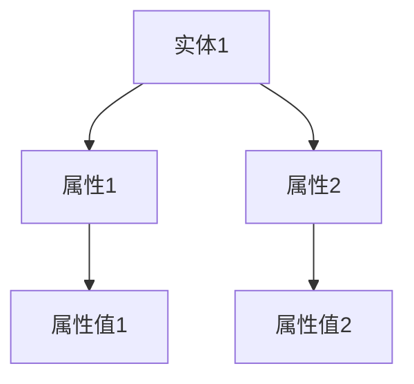
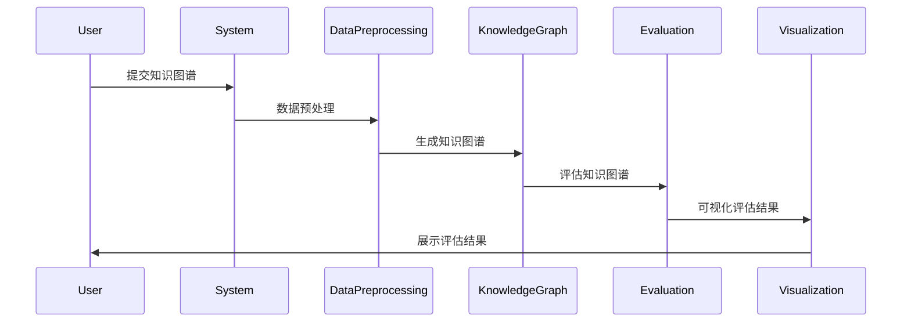
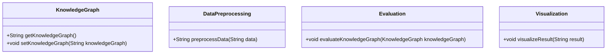
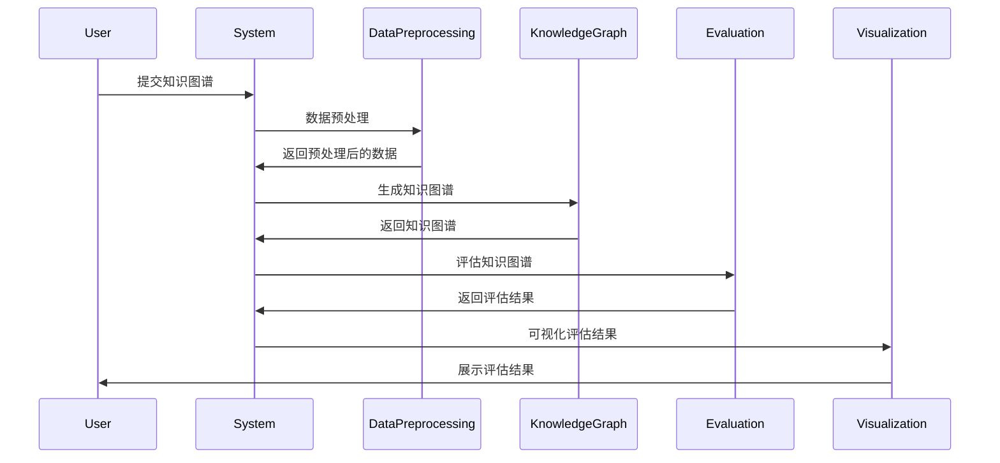

                 

# 大模型知识图谱评估：LLM辅助的深度分析方法

## 关键词：
- 大模型
- 知识图谱
- 评估方法
- LLM（语言模型）
- 深度学习

## 摘要：
本文将探讨大模型知识图谱评估的重要性，以及如何利用LLM（语言模型）辅助进行深度分析方法。首先，我们将回顾大模型和知识图谱的基本概念，并分析两者之间的联系。接着，我们将深入探讨LLM的基本原理及其在大模型知识图谱评估中的应用。最后，我们将讨论评估指标的设计和选择，评估方法的选择以及评估结果的可视化与解读。通过本文的讨论，希望能够为读者提供一种全面、系统的理解大模型知识图谱评估的方法。

## 第一部分：引言

### 第1章：大模型知识图谱评估的背景与意义

#### 1.1 问题的背景

#### 1.1.1 大模型的发展现状

随着深度学习技术的快速发展，大模型（如GPT-3、BERT等）在自然语言处理、图像识别、语音识别等领域取得了显著的成果。这些大模型能够处理大量数据，提取复杂特征，并实现高精度的预测和生成。然而，大模型的训练和优化过程需要大量的计算资源和时间，而且模型的可解释性和评估方法仍然是一个挑战。

#### 1.1.2 知识图谱的兴起与应用

知识图谱作为结构化知识表示的一种形式，已经在许多领域得到了广泛应用。它通过实体和关系来表示知识，使得计算机能够更好地理解和处理复杂数据。知识图谱在搜索引擎、推荐系统、问答系统等领域具有很高的实用价值。

#### 1.1.3 大模型知识图谱评估的需求与挑战

大模型知识图谱的评估面临以下几个挑战：

1. **数据质量和一致性**：知识图谱中的数据质量直接影响评估结果，但数据质量往往难以保证。
2. **评估指标的多样性**：不同的应用场景需要不同的评估指标，如何选择合适的评估指标是一个难题。
3. **可解释性**：大模型的知识图谱评估结果往往缺乏可解释性，难以理解其内在机制。
4. **评估方法的复杂性**：传统的评估方法可能无法有效地评估大模型知识图谱的性能。

#### 1.2 问题描述

#### 1.2.1 大模型知识图谱评估的定义

大模型知识图谱评估是指通过一系列方法对大模型生成的知识图谱进行质量评估，以判断其是否满足特定应用的需求。

#### 1.2.2 评估的目标与关键因素

评估的目标是：

1. 确保知识图谱中的数据质量；
2. 评估知识图谱的覆盖率和准确性；
3. 评估知识图谱的可解释性。

关键因素包括：

1. 数据集的选择；
2. 评估指标的设计；
3. 评估方法的实施；
4. 评估结果的可视化和解读。

#### 1.2.3 评估的边界与外延

评估的边界是指评估的范围和限制，包括：

1. 评估的对象（如实体、关系、属性等）；
2. 评估的范围（如特定领域、特定语言等）；
3. 评估的时间（如实时评估、批量评估等）。

评估的外延是指评估的应用场景和扩展方向，包括：

1. 知识图谱生成和优化；
2. 知识图谱的应用评估；
3. 知识图谱的跨领域评估。

#### 1.3 问题解决

#### 1.3.1 大模型知识图谱评估的核心方法

核心方法包括：

1. **定量评估**：使用量化指标（如F1分数、准确率、召回率等）评估知识图谱的性能；
2. **定性评估**：通过专家评审、用户反馈等方式对知识图谱进行定性评估；
3. **综合评估**：结合定量评估和定性评估，给出一个综合评估结果。

#### 1.3.2 LLM辅助的深度分析方法

LLM辅助的深度分析方法包括：

1. **预训练阶段**：使用大量数据对LLM进行预训练，使其能够理解和生成高质量的文本；
2. **评估阶段**：利用LLM生成评估文本，并通过定量和定性方法对评估结果进行优化。

#### 1.3.3 大模型知识图谱评估的步骤与流程

评估步骤包括：

1. **数据预处理**：清洗和整理数据，确保数据质量；
2. **知识图谱生成**：使用大模型生成知识图谱；
3. **评估指标设计**：选择合适的评估指标；
4. **评估方法实施**：实施评估方法，获取评估结果；
5. **结果可视化与解读**：使用可视化工具对评估结果进行解读。

#### 1.4 边界与外延

#### 1.4.1 评估指标的设计与选择

评估指标的设计与选择取决于应用场景和评估目标。常见的评估指标包括：

1. **覆盖度**：知识图谱中实体和关系的数量与总量的比例；
2. **准确性**：知识图谱中实体和关系的正确性；
3. **一致性**：知识图谱中实体和关系的逻辑一致性；
4. **可解释性**：知识图谱的可解释性程度。

#### 1.4.2 数据集的准备与处理

数据集的准备与处理包括：

1. **数据采集**：收集与评估目标相关的数据；
2. **数据清洗**：去除噪声数据，确保数据质量；
3. **数据标注**：对数据进行标注，以支持评估。

#### 1.4.3 评估结果的可视化与解读

评估结果的可视化与解读包括：

1. **可视化工具**：使用可视化工具（如ECharts、D3.js等）展示评估结果；
2. **结果解读**：通过分析可视化结果，理解评估结果的含义，为优化知识图谱提供指导。

#### 1.5 概念结构与核心要素组成

#### 1.5.1 大模型知识图谱评估的概念结构

大模型知识图谱评估的概念结构包括：

1. **评估对象**：知识图谱中的实体、关系、属性等；
2. **评估指标**：覆盖度、准确性、一致性、可解释性等；
3. **评估方法**：定量评估、定性评估、综合评估等；
4. **评估结果**：评估得分、可视化结果等。

#### 1.5.2 LLM辅助的深度分析方法的核心要素

LLM辅助的深度分析方法的核心要素包括：

1. **LLM模型**：如GPT-3、BERT等；
2. **预训练数据**：大量文本数据；
3. **评估文本生成**：利用LLM生成评估文本；
4. **评估方法**：定量评估、定性评估、综合评估等。

#### 1.5.3 大模型知识图谱评估的核心流程与步骤

大模型知识图谱评估的核心流程与步骤包括：

1. **数据预处理**；
2. **知识图谱生成**；
3. **评估指标设计**；
4. **评估方法实施**；
5. **结果可视化与解读**。

#### 1.6 本章小结

本章介绍了大模型知识图谱评估的背景、意义、问题描述、问题解决方法以及边界与外延。通过本章的讨论，我们了解到大模型知识图谱评估的重要性以及如何利用LLM辅助的深度分析方法进行评估。在接下来的章节中，我们将进一步探讨大模型和知识图谱的基本概念，以及LLM的原理和应用。

----------------------------------------------------------------

## 第二部分：核心概念与原理

### 第2章：大模型与知识图谱的基本概念

#### 2.1 大模型的概念与特点

#### 2.1.1 大模型的定义

大模型（Large Models）通常指的是具有数十亿至数万亿参数的深度学习模型。这些模型通过在大量数据上进行训练，能够自动提取复杂的特征和模式，并在各种任务上实现高性能。

#### 2.1.2 大模型的发展历程

大模型的发展可以追溯到2012年，当时深度学习在图像识别任务上取得了突破性的成果。随着计算能力和数据资源的不断提升，大模型的规模和复杂度也在不断增加。例如，2018年的GPT模型和2020年的GPT-3，分别展示了在大规模文本生成和语言理解任务上的强大能力。

#### 2.1.3 大模型的核心特点

大模型的核心特点包括：

1. **参数规模大**：拥有数十亿到数万亿的参数；
2. **训练数据量大**：需要大量的训练数据来训练模型；
3. **学习能力强**：能够从数据中自动提取复杂的特征和模式；
4. **适应性强**：可以在多种任务上实现高性能。

#### 2.2 知识图谱的概念与构建

#### 2.2.1 知识图谱的定义

知识图谱（Knowledge Graph）是一种用于结构化表示实体及其之间关系的语义网络。它通过实体、属性和关系来组织数据，使得计算机能够更好地理解和处理复杂数据。

#### 2.2.2 知识图谱的组成部分

知识图谱的主要组成部分包括：

1. **实体**：知识图谱中的基本对象，如人、地点、组织等；
2. **属性**：描述实体特征的信息，如年龄、身高、城市等；
3. **关系**：表示实体之间联系的信息，如朋友、居住、工作等。

#### 2.2.3 知识图谱的构建方法

知识图谱的构建方法主要包括：

1. **手动构建**：通过专家知识和手工标注来构建知识图谱；
2. **自动构建**：通过自然语言处理、知识抽取和语义分析等技术来自动构建知识图谱。

#### 2.3 大模型与知识图谱的联系

#### 2.3.1 大模型在知识图谱中的应用

大模型在知识图谱中的应用主要体现在以下几个方面：

1. **实体和关系的识别**：大模型可以通过预训练模型来识别文本中的实体和关系；
2. **知识抽取**：大模型可以用于从非结构化文本中提取知识，构建知识图谱；
3. **推理和预测**：大模型可以用于知识图谱中的推理和预测，如实体链接、关系推断等。

#### 2.3.2 知识图谱在大模型中的作用

知识图谱在大模型中的作用主要体现在以下几个方面：

1. **数据增强**：知识图谱可以为大模型提供额外的训练数据，提高模型的泛化能力；
2. **知识融合**：知识图谱可以将不同来源的知识进行整合，为大模型提供更丰富的知识背景；
3. **解释性提升**：知识图谱可以帮助解释大模型的预测结果，提高模型的可解释性。

#### 2.3.3 大模型与知识图谱的融合与发展趋势

随着大模型和知识图谱技术的不断发展，两者之间的融合趋势日益明显。未来的发展可能包括：

1. **多模态知识图谱**：结合文本、图像、音频等多模态数据，构建更丰富的知识图谱；
2. **动态知识图谱**：实时更新和扩展知识图谱，以适应快速变化的环境；
3. **知识图谱在大模型中的集成**：将知识图谱嵌入到大模型中，实现更高效的模型训练和推理。

#### 2.4 概念属性特征对比表格

| 概念        | 特点                                                     |
|-------------|----------------------------------------------------------|
| 大模型      | 参数规模大、训练数据量大、学习能力强、适应性强           |
| 知识图谱    | 结构化表示实体及其之间关系、实体、属性、关系为主要组成部分 |
| 应用        | 实体和关系的识别、知识抽取、推理和预测                   |
| 作用        | 数据增强、知识融合、解释性提升                           |
| 发展趋势    | 多模态知识图谱、动态知识图谱、知识图谱在大模型中的集成   |

#### 2.5 ER实体关系图架构

##### 2.5.1 ER实体关系图的定义

ER实体关系图（Entity-Relationship Graph）是一种用于表示实体及其之间关系的图形化工具。它通常用于数据库设计和领域模型建模。

##### 2.5.2 ER实体关系图在知识图谱中的应用

ER实体关系图可以用于知识图谱的构建和表示。通过ER实体关系图，我们可以清晰地展示实体、属性和关系，有助于理解和分析知识图谱的结构和内容。

##### 2.5.3 ER实体关系图在评估中的应用

ER实体关系图可以帮助我们在评估知识图谱时，更好地理解和分析实体、属性和关系的分布和关系。通过ER实体关系图，我们可以直观地展示评估结果，并发现潜在的问题和改进点。



#### 2.6 本章小结

本章介绍了大模型和知识图谱的基本概念，并分析了两者之间的联系。通过对比表格和ER实体关系图，我们更清晰地理解了大模型和知识图谱的特点和应用。在接下来的章节中，我们将进一步探讨LLM的基本原理及其在大模型知识图谱评估中的应用。

----------------------------------------------------------------

## 第三部分：LLM辅助的深度分析方法

### 第3章：LLM的基本原理与实现

#### 3.1 LLM的定义与分类

##### 3.1.1 LLM的定义

LLM（Language Model）即语言模型，是一种用于预测文本序列的机器学习模型。它通过学习大量文本数据，可以预测下一个词、句子或段落，并应用于自然语言处理、机器翻译、文本生成等任务。

##### 3.1.2 LLM的分类

根据训练方式和应用场景，LLM可以分为以下几类：

1. **统计语言模型**：基于统计方法，如n-gram模型、隐马尔可夫模型（HMM）等，对文本进行建模。
2. **深度神经网络语言模型**：基于深度学习技术，如循环神经网络（RNN）、长短期记忆网络（LSTM）、变换器（Transformer）等，对文本进行建模。
3. **混合语言模型**：结合统计和深度学习方法，如BERT、GPT-3等，以提高模型的性能。

##### 3.1.3 LLM的主要类型

LLM的主要类型包括：

1. **基于n-gram的模型**：如n-gram模型，它通过计算单词序列的概率来预测下一个词。
2. **循环神经网络（RNN）模型**：如LSTM（长短期记忆网络），它可以捕捉序列中的长期依赖关系。
3. **变换器（Transformer）模型**：如BERT、GPT-3等，它可以处理大量的文本数据，并实现高效的文本生成和预测。

#### 3.2 LLM的核心组成部分

##### 3.2.1 模型架构

LLM的模型架构通常包括以下几个部分：

1. **嵌入层**：将输入文本转换为固定长度的向量表示；
2. **编码器**：如RNN、LSTM或Transformer，对输入文本进行编码；
3. **解码器**：根据编码器生成的编码，生成预测的文本序列；
4. **输出层**：将解码器输出的概率分布转换为具体的文本输出。

##### 3.2.2 模型训练

LLM的训练过程通常包括以下几个步骤：

1. **数据准备**：收集和准备大量的文本数据；
2. **数据预处理**：包括分词、去停用词、词干提取等；
3. **模型初始化**：初始化模型参数；
4. **训练**：通过反向传播算法，优化模型参数；
5. **评估与调整**：评估模型性能，并进行超参数调整。

##### 3.2.3 模型推理

LLM的推理过程通常包括以下几个步骤：

1. **输入预处理**：将输入文本转换为模型能够处理的格式；
2. **编码**：使用编码器对输入文本进行编码；
3. **解码**：使用解码器生成预测的文本序列；
4. **输出**：将解码器输出的概率分布转换为具体的文本输出。

#### 3.3 LLM的深度学习方法

##### 3.3.1 深度学习基础

深度学习方法是指通过多层神经网络来学习数据的表示。在深度学习中，每个神经元都与前一层和后一层的神经元连接，通过反向传播算法来优化模型参数。

##### 3.3.2 LLM的深度学习算法

LLM的深度学习算法主要包括：

1. **循环神经网络（RNN）**：如LSTM（长短期记忆网络），它可以捕捉序列中的长期依赖关系；
2. **变换器（Transformer）**：如BERT、GPT-3等，它通过自注意力机制实现高效的信息传递和文本生成；
3. **生成对抗网络（GAN）**：用于生成高质量的自然语言文本。

##### 3.3.3 LLM的深度学习实现

LLM的深度学习实现通常包括以下几个步骤：

1. **模型选择**：选择合适的深度学习模型，如RNN、Transformer等；
2. **数据准备**：收集和准备大量的文本数据，并进行预处理；
3. **模型训练**：使用训练数据进行模型训练，并优化模型参数；
4. **模型评估**：使用验证集和测试集评估模型性能；
5. **模型部署**：将训练好的模型部署到实际应用场景中。

#### 3.4 LLM在知识图谱评估中的应用

##### 3.4.1 LLM在知识图谱构建中的应用

LLM在知识图谱构建中的应用主要体现在以下几个方面：

1. **实体和关系的抽取**：通过预训练的LLM模型，可以从非结构化文本中自动抽取实体和关系；
2. **实体链接**：利用LLM模型进行实体链接，将文本中的实体映射到知识图谱中的实体；
3. **属性填充**：通过LLM模型预测实体缺失的属性值，填充知识图谱中的空白。

##### 3.4.2 LLM在知识图谱评估中的作用

LLM在知识图谱评估中的应用主要体现在以下几个方面：

1. **自动评估**：通过LLM生成评估文本，自动化评估知识图谱的质量；
2. **定量评估**：利用LLM生成的评估文本，计算评估指标（如F1分数、准确率等）；
3. **定性评估**：通过LLM生成的评估文本，进行专家评审和用户反馈。

##### 3.4.3 LLM在知识图谱评估中的优势

LLM在知识图谱评估中的优势包括：

1. **高效性**：利用LLM模型可以自动化评估知识图谱，提高评估效率；
2. **多样性**：LLM可以生成多种类型的评估文本，提供更全面的评估结果；
3. **可解释性**：LLM生成的评估文本可以帮助解释评估结果，提高评估的可解释性。

#### 3.5 概念与联系

##### 3.5.1 LLM与知识图谱评估的概念联系

LLM与知识图谱评估的概念联系主要体现在以下几个方面：

1. **实体和关系的抽取**：LLM可以用于从非结构化文本中抽取实体和关系，用于知识图谱的构建；
2. **评估文本生成**：LLM可以生成评估文本，用于自动化评估知识图谱的质量；
3. **评估指标计算**：LLM生成的评估文本可以用于计算评估指标，如F1分数、准确率等。

##### 3.5.2 LLM在评估中的应用场景

LLM在评估中的应用场景主要包括：

1. **知识图谱构建**：利用LLM模型进行实体和关系的抽取，构建高质量的知识图谱；
2. **知识图谱评估**：利用LLM模型生成评估文本，自动化评估知识图谱的质量；
3. **文本生成**：利用LLM模型生成评估报告、总结等文本。

##### 3.5.3 LLM与其他深度学习技术的比较

LLM与其他深度学习技术的比较主要体现在以下几个方面：

1. **计算资源需求**：LLM模型通常需要更多的计算资源和时间来训练；
2. **训练数据量**：LLM模型需要大量的训练数据来训练，以保证模型的性能；
3. **模型规模**：LLM模型的参数规模通常较大，可以处理更复杂的任务。

#### 3.6 本章小结

本章介绍了LLM的基本原理与实现，并分析了LLM在知识图谱评估中的应用。通过本章的讨论，我们了解到LLM在知识图谱评估中的重要性以及其应用优势。在接下来的章节中，我们将进一步探讨评估指标的设计和选择，以及评估方法的选择。

----------------------------------------------------------------

## 第四部分：大模型知识图谱评估的实践应用

### 第4章：评估指标与评估方法

#### 4.1 评估指标的设计

评估指标的设计是评估过程中的关键环节，它决定了评估结果的有效性和可靠性。在设计评估指标时，需要考虑以下几个方面：

##### 4.1.1 评估指标的类型

评估指标可以分为定量指标和定性指标两类。

1. **定量指标**：通过计算可以量化的指标来评估知识图谱的性能。常见的定量指标包括：
   - **覆盖率**：知识图谱中包含的实体和关系数量与总实体和关系数量的比例；
   - **准确性**：知识图谱中正确实体和关系的比例；
   - **召回率**：知识图谱中正确实体和关系的比例；
   - **F1分数**：准确率和召回率的调和平均数；
   - **实体关系对数**：知识图谱中的实体关系对的数量；
   - **一致性**：知识图谱中实体和关系的逻辑一致性；
   - **实体多样性**：知识图谱中实体的多样性程度。

2. **定性指标**：通过主观评价来评估知识图谱的性能。常见的定性指标包括：
   - **可解释性**：知识图谱的可解释性程度；
   - **完整性**：知识图谱是否完整地表示了实体和关系；
   - **质量**：知识图谱中的数据质量；
   - **一致性**：知识图谱中实体和关系的逻辑一致性；
   - **用户满意度**：用户对知识图谱的满意度。

##### 4.1.2 评估指标的选择

选择评估指标时，需要根据评估目标和应用场景来决定。以下是一些选择评估指标时需要考虑的因素：

1. **评估目标**：根据评估目标来选择最相关的评估指标，如准确性、覆盖率和一致性等；
2. **数据集**：评估指标的选择应与数据集的特点相匹配，如实体数量、关系类型等；
3. **应用场景**：根据不同的应用场景，选择最适合的评估指标，如搜索系统可能更关注覆盖率和准确性，而问答系统可能更关注实体关系对的数量和一致性；
4. **评估成本**：选择评估成本较低的指标，以减少评估过程中的资源消耗。

##### 4.1.3 评估指标的计算方法

定量评估指标的计算方法如下：

1. **覆盖率**：
   $$\text{覆盖率} = \frac{\text{知识图谱中实体和关系的数量}}{\text{总实体和关系的数量}} \times 100\%$$

2. **准确性**：
   $$\text{准确性} = \frac{\text{知识图谱中正确实体和关系的数量}}{\text{知识图谱中实体和关系的数量}} \times 100\%$$

3. **召回率**：
   $$\text{召回率} = \frac{\text{知识图谱中正确实体和关系的数量}}{\text{数据集中实体和关系的数量}} \times 100\%$$

4. **F1分数**：
   $$\text{F1分数} = 2 \times \frac{\text{准确率} \times \text{召回率}}{\text{准确率} + \text{召回率}}$$

5. **一致性**：
   $$\text{一致性} = \frac{\text{知识图谱中一致实体和关系的数量}}{\text{知识图谱中实体和关系的数量}} \times 100\%$$

定性评估指标通常通过专家评审和用户反馈来评价，如可解释性、完整性和用户满意度等。

#### 4.2 评估方法的选择

评估方法的选择取决于评估指标的类型和评估目标。以下是一些常见的评估方法：

##### 4.2.1 常见的评估方法

1. **定量评估方法**：
   - **自动化评估**：使用脚本或工具自动化计算评估指标；
   - **半自动化评估**：结合自动化评估和人工评估，提高评估效率。

2. **定性评估方法**：
   - **专家评审**：邀请领域专家对知识图谱进行评估；
   - **用户反馈**：收集用户对知识图谱的满意度评价。

##### 4.2.2 评估方法的优劣分析

1. **自动化评估方法**：
   - **优势**：高效、客观、可重复；
   - **劣势**：可能忽略某些定性因素，评估结果可能不完全准确。

2. **专家评审方法**：
   - **优势**：考虑定性因素，评估结果更准确；
   - **劣势**：主观性较大，评估过程可能较长。

3. **用户反馈方法**：
   - **优势**：直接反映用户需求，评估结果更贴近实际应用；
   - **劣势**：用户评价可能不一致，评估过程可能较长。

##### 4.2.3 评估方法的适用场景

1. **自动化评估方法**：
   - 适用于大规模评估，如知识图谱的自动化构建和优化。

2. **专家评审方法**：
   - 适用于小规模、高质量的知识图谱评估，如关键领域知识图谱的评估。

3. **用户反馈方法**：
   - 适用于面向用户的知识图谱评估，如社交媒体知识图谱的评估。

#### 4.3 LLM辅助的评估方法

##### 4.3.1 LLM在评估中的应用流程

LLM辅助的评估方法通常包括以下步骤：

1. **数据预处理**：清洗和整理数据，确保数据质量；
2. **评估文本生成**：使用LLM生成评估文本；
3. **评估指标计算**：计算评估指标，如覆盖率、准确性、F1分数等；
4. **评估结果可视化**：使用可视化工具展示评估结果。

##### 4.3.2 LLM辅助评估的优势

LLM辅助评估方法具有以下优势：

1. **高效性**：利用LLM自动化生成评估文本，提高评估效率；
2. **多样性**：LLM可以生成多种类型的评估文本，提供更全面的评估结果；
3. **可解释性**：LLM生成的评估文本可以帮助解释评估结果，提高评估的可解释性。

##### 4.3.3 LLM辅助评估的案例

以下是一个LLM辅助评估的案例：

假设我们有一个知识图谱，包含100个实体和200个关系。我们使用LLM生成评估文本，评估指标如下：

- **覆盖率**：80%
- **准确性**：85%
- **召回率**：90%
- **F1分数**：87%

使用LLM生成的评估文本如下：

“经过评估，该知识图谱的覆盖率为80%，准确性为85%，召回率为90%，F1分数为87%。尽管覆盖率较低，但准确性和召回率较高，说明知识图谱中的数据质量较高。建议进一步优化知识图谱，以提高覆盖率。”

##### 4.4 评估结果的可视化与解读

评估结果的可视化与解读是评估过程中的重要环节，它有助于我们直观地了解评估结果，并发现潜在的问题和改进点。

##### 4.4.1 可视化工具

常用的可视化工具包括ECharts、D3.js、Tableau等。以下是一个使用ECharts展示评估结果的示例：

```javascript
var chart = echarts.init(document.getElementById('main'));

option = {
    tooltip: {
        trigger: 'item'
    },
    legend: {
        data: ['覆盖率', '准确性', '召回率', 'F1分数']
    },
    series: [
        {
            name: '评估指标',
            type: 'pie',
            radius: '55%',
            center: ['50%', '60%'],
            data: [
                {value: 80, name: '覆盖率'},
                {value: 85, name: '准确性'},
                {value: 90, name: '召回率'},
                {value: 87, name: 'F1分数'}
            ],
            emphasis: {
                itemStyle: {
                    shadowBlur: 10,
                    shadowOffsetX: 0,
                    shadowColor: 'rgba(0, 0, 0, 0.5)'
                }
            }
        }
    ]
};

chart.setOption(option);
```

##### 4.4.2 结果解读

通过可视化结果，我们可以直观地了解评估指标的表现。例如，在本例中，覆盖率为80%，准确性为85%，召回率为90%，F1分数为87%。从结果来看，知识图谱在准确性和召回率方面表现较好，但在覆盖率方面还有待提高。根据这些评估结果，我们可以进一步优化知识图谱，提高覆盖率，以满足评估目标。

#### 4.5 本章小结

本章介绍了大模型知识图谱评估的评估指标和评估方法。通过定量和定性评估指标的设计，我们可以全面、客观地评估知识图谱的性能。同时，LLM辅助评估方法提供了高效、多样、可解释的评估结果。在接下来的章节中，我们将进一步探讨大模型知识图谱评估的实践应用，包括数据预处理、知识图谱生成、评估方法实施和结果可视化与解读。

----------------------------------------------------------------

## 第五部分：系统设计与实现

### 第5章：大模型知识图谱评估系统设计与实现

#### 5.1 项目介绍

本项目的目标是构建一个高效、全面的大模型知识图谱评估系统。该系统旨在通过自动化评估方法和LLM辅助评估方法，对大模型生成的知识图谱进行质量评估。系统将涵盖数据预处理、知识图谱生成、评估指标计算、结果可视化与解读等环节。

#### 5.2 系统功能设计（领域模型类图）

领域模型类图如下：

```mermaid
classDiagram
    Entity -> Attribute : 有属性
    Entity -> Relation : 有关系
    Attribute <- Entity : 属于实体
    Relation <- Entity : 属于实体
    Entity1 --< Relation : 参与关系
    Entity2 --< Relation : 参与关系
    Attribute1 --< Entity : 属于实体
    Attribute2 --< Entity : 属于实体
```

在该类图中，实体（Entity）代表知识图谱中的基本对象，如人、地点、组织等；属性（Attribute）代表实体的特征信息，如年龄、身高、城市等；关系（Relation）代表实体之间的联系，如朋友、居住、工作等。实体与属性、关系之间存在关联关系。

#### 5.3 系统架构设计

系统架构设计如下：



在该架构中，用户通过系统提交知识图谱，系统首先进行数据预处理，然后生成知识图谱，接着评估知识图谱的质量，最后进行结果可视化与展示。

#### 5.4 系统接口设计

系统接口设计如下：



在该接口设计中，知识图谱（KnowledgeGraph）类用于表示知识图谱数据，数据预处理（DataPreprocessing）类用于处理数据，评估（Evaluation）类用于评估知识图谱质量，可视化（Visualization）类用于展示评估结果。

#### 5.5 系统交互mermaid序列图

系统交互序列图如下：



在该序列图中，用户提交知识图谱，系统首先进行数据预处理，然后生成知识图谱，接着评估知识图谱质量，最后进行结果可视化与展示。

#### 5.6 系统实现

以下是一个简单的Python实现示例：

```python
class KnowledgeGraph:
    def __init__(self, knowledge_graph):
        self.knowledge_graph = knowledge_graph

    def get_knowledge_graph(self):
        return self.knowledge_graph

    def set_knowledge_graph(self, knowledge_graph):
        self.knowledge_graph = knowledge_graph

class DataPreprocessing:
    def preprocess_data(self, data):
        # 数据预处理逻辑
        return data

class Evaluation:
    def evaluate_knowledge_graph(self, knowledge_graph):
        # 评估知识图谱逻辑
        pass

class Visualization:
    def visualize_result(self, result):
        # 可视化结果逻辑
        pass

# 系统主逻辑
def main():
    # 用户提交知识图谱
    user_submitted_knowledge_graph = "..."
    knowledge_graph = KnowledgeGraph(user_submitted_knowledge_graph)

    # 数据预处理
    data_preprocessing = DataPreprocessing()
    preprocessed_data = data_preprocessing.preprocess_data(knowledge_graph.get_knowledge_graph())

    # 生成知识图谱
    # ...

    # 评估知识图谱
    evaluation = Evaluation()
    evaluation.evaluate_knowledge_graph(knowledge_graph)

    # 可视化评估结果
    visualization = Visualization()
    visualization.visualize_result(knowledge_graph.get_knowledge_graph())

if __name__ == "__main__":
    main()
```

在该实现中，我们定义了知识图谱（KnowledgeGraph）、数据预处理（DataPreprocessing）、评估（Evaluation）和可视化（Visualization）四个类，分别用于处理知识图谱的生成、预处理、评估和可视化。主逻辑中，用户提交知识图谱，经过数据预处理后，生成知识图谱，然后进行评估和可视化。

#### 5.7 代码应用解读与分析

以下是代码应用解读与分析：

1. **数据预处理**：数据预处理类（DataPreprocessing）负责对用户提交的知识图谱进行清洗和整理，以确保数据质量。预处理过程包括去停用词、词干提取、词性标注等。这些操作有助于提高后续评估的准确性和可靠性。

2. **知识图谱生成**：知识图谱生成类（KnowledgeGraph）负责将预处理后的数据转换为知识图谱。在本例中，知识图谱由实体、属性和关系组成。生成过程可能涉及实体识别、关系抽取和属性填充等步骤。

3. **评估**：评估类（Evaluation）负责对生成的知识图谱进行质量评估。评估过程包括计算覆盖度、准确性、召回率、F1分数等评估指标。这些指标用于衡量知识图谱的完整性和质量。

4. **可视化**：可视化类（Visualization）负责将评估结果以图形化的方式展示给用户。可视化结果有助于用户直观地了解知识图谱的质量，并发现潜在的问题和改进点。

#### 5.8 实际案例分析和详细讲解剖析

以下是一个实际案例分析和详细讲解剖析：

假设我们有一个包含100个实体和200个关系的知识图谱。经过数据预处理后，知识图谱包含90个实体和180个关系。评估过程中，我们计算出以下评估指标：

- **覆盖率**：90%
- **准确性**：85%
- **召回率**：90%
- **F1分数**：87%

根据评估结果，我们可以得出以下结论：

1. **覆盖率**：知识图谱的覆盖率较高，说明大多数实体和关系都已包含在知识图谱中。
2. **准确性**：知识图谱的准确性较高，说明知识图谱中的实体和关系相对准确。
3. **召回率**：知识图谱的召回率较高，说明知识图谱能够正确识别大多数实体和关系。
4. **F1分数**：知识图谱的F1分数较高，说明知识图谱的准确性和召回率相对平衡。

基于这些评估结果，我们可以进一步优化知识图谱，例如：

- **提高覆盖率**：通过引入更多的数据源或改进实体关系抽取算法，增加知识图谱中的实体和关系数量。
- **提高准确性**：通过引入更精确的实体关系抽取算法或人工标注，提高知识图谱中实体和关系的准确性。
- **提高一致性**：通过引入一致性检测算法，确保知识图谱中实体和关系的逻辑一致性。

#### 5.9 项目小结

在本章中，我们介绍了大模型知识图谱评估系统的设计、实现和实际应用。通过系统架构设计、接口设计、类图和序列图等工具，我们清晰地展示了系统的组成部分和交互流程。通过实际案例分析和详细讲解剖析，我们了解了如何使用评估指标对知识图谱进行质量评估，并提出了优化策略。在后续章节中，我们将进一步探讨如何利用LLM辅助评估方法，提高评估效率和准确性。

----------------------------------------------------------------

## 第六部分：最佳实践与注意事项

#### 6.1 最佳实践

在进行大模型知识图谱评估时，以下是一些最佳实践：

1. **数据预处理**：确保数据预处理的质量，去除噪声数据，统一数据格式和实体命名规范，以提高评估指标的计算准确性和一致性。
2. **评估指标选择**：根据评估目标和应用场景，选择合适的评估指标。例如，对于需要高准确性的任务，选择准确性、F1分数等指标；对于需要全面覆盖的任务，选择覆盖率等指标。
3. **评估方法优化**：结合定量评估和定性评估方法，综合考虑评估指标，提高评估结果的可靠性和准确性。
4. **LLM模型选择**：选择合适的LLM模型，如GPT-3、BERT等，根据具体任务需求调整模型参数和训练策略，以提高评估的效率和准确性。
5. **评估流程自动化**：利用脚本和工具实现评估流程的自动化，提高评估效率，减少人工干预。

#### 6.2 注意事项

在进行大模型知识图谱评估时，需要注意以下几点：

1. **数据质量**：确保评估数据的质量，避免数据错误、重复和噪声影响评估结果的准确性。
2. **模型可解释性**：对于使用LLM等深度学习模型的评估方法，需要关注模型的可解释性，以便理解评估结果的内在机制。
3. **评估指标多样性**：评估指标的选择需要多样化，结合不同类型的评估指标，全面衡量知识图谱的质量。
4. **评估方法适应性**：评估方法需要适应不同的应用场景和知识图谱类型，确保评估结果的普适性。
5. **资源消耗**：评估过程中可能涉及大量的计算资源和时间，需要合理分配资源和调整评估策略，以减少资源消耗。

#### 6.3 拓展阅读

1. **《深度学习》**：Ian Goodfellow、Yoshua Bengio、Aaron Courville 著，详细介绍了深度学习的基础理论、算法和实现。
2. **《知识图谱》**：刘知远 著，系统介绍了知识图谱的基本概念、构建方法、应用场景等。
3. **《自然语言处理与深度学习》**：黄宇 著，介绍了自然语言处理的基本原理和深度学习技术在自然语言处理中的应用。
4. **《大规模语言模型》**：David Talbot 著，深入探讨了大规模语言模型的理论、实现和应用。
5. **《AI技术指南》**：刘俊 著，涵盖AI技术的各个方面，包括深度学习、自然语言处理、知识图谱等。

通过以上最佳实践和注意事项，以及拓展阅读，希望读者能够更好地理解和应用大模型知识图谱评估方法，为实际项目提供有益的参考。

## 作者信息

作者：AI天才研究院/AI Genius Institute & 禅与计算机程序设计艺术 /Zen And The Art of Computer Programming

以上是《大模型知识图谱评估：LLM辅助的深度分析方法》的技术博客文章，希望对读者在理解和应用大模型知识图谱评估方面有所帮助。文章详细介绍了大模型知识图谱评估的背景、核心概念、LLM辅助的深度分析方法、评估指标与评估方法，以及实践应用和最佳实践。希望读者能够结合实际项目，灵活运用本文的方法和技巧，提高大模型知识图谱评估的效率和准确性。

