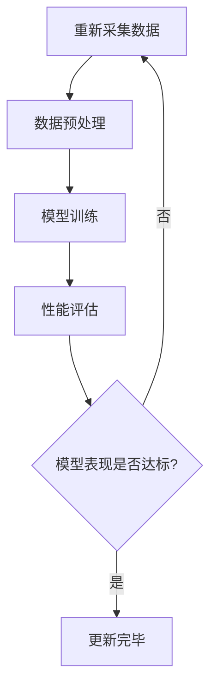
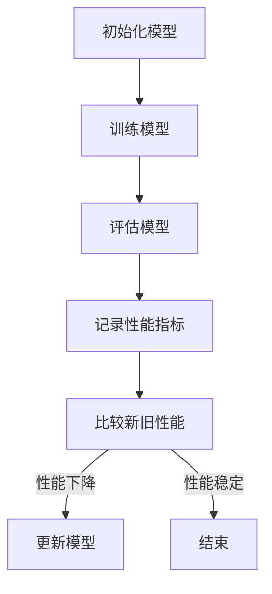
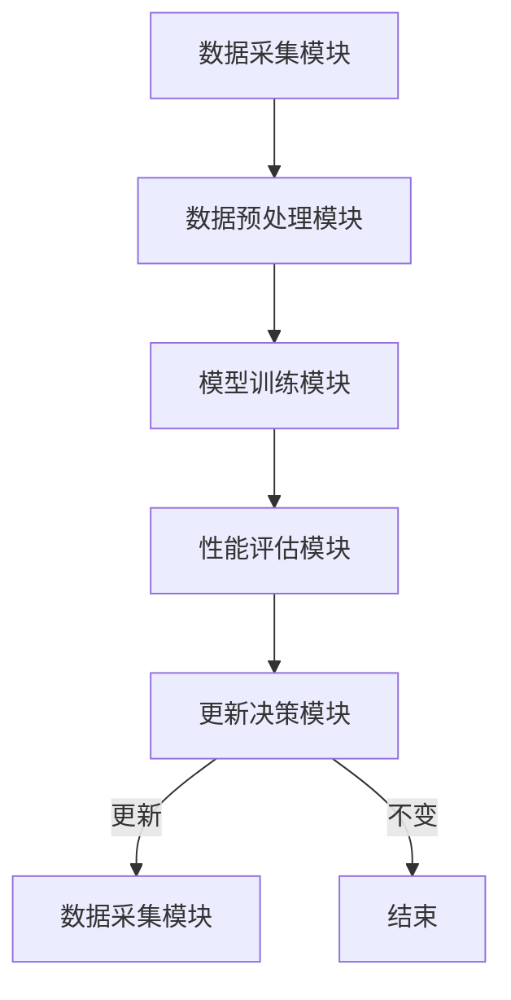
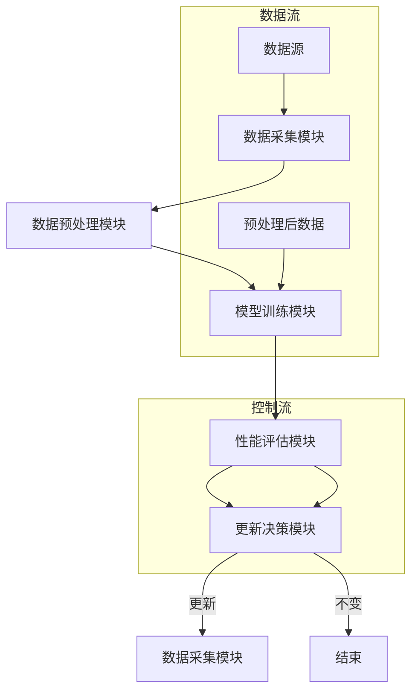

                 

# 大模型知识更新能力评估：LLM设计的时效性测试

## 关键词
- 大模型
- 知识更新
- 时效性测试
- 语言模型（LLM）
- 算法评估

## 摘要
本文深入探讨了大规模语言模型（LLM）的知识更新能力及其设计的时效性测试。我们首先介绍了大模型的时代背景和知识更新的重要性，然后定义了相关术语，并详细讲解了评估时效性的方法和算法。通过具体的示例和Python代码，我们展示了如何实现这些算法，并设计了一个简单的系统架构来支持这一过程。最后，我们通过一个实际项目展示了这些概念的运用，并提供了最佳实践和拓展阅读建议，以期为读者提供全面的指导。

## 第1章：问题的提出与重要性

### 1.1 大模型时代的需求

随着人工智能技术的飞速发展，大规模语言模型（LLM）已经成为自然语言处理（NLP）领域的核心技术。这些模型拥有数十亿甚至数万亿个参数，能够理解和生成复杂的语言结构，广泛应用于机器翻译、文本生成、问答系统等多个领域。然而，这些大模型面临着一项巨大的挑战：知识更新。

在快速变化的现实世界中，知识的更新速度远超我们的预期。旧有的知识可能会变得过时，新的知识则需要不断地被纳入模型中。如果不进行有效的知识更新，大模型将无法跟上时代的步伐，导致其在某些任务上的表现逐渐下降。因此，评估和设计大模型的知识更新能力，成为了一个亟待解决的问题。

### 1.2 知识更新的挑战

知识更新的挑战主要体现在以下几个方面：

1. **数据获取**：获取最新的数据是进行知识更新的前提。然而，数据的获取往往是一个复杂的过程，需要考虑到数据源的可信度、数据的质量和数据的实时性等因素。

2. **模型适应性**：大模型通常具有高度复杂的结构，对其进行修改以适应新的知识是一个技术挑战。如何在不损害现有性能的前提下，有效地更新模型参数，是一个需要深入探讨的问题。

3. **计算资源**：知识更新往往需要大量的计算资源，尤其是在模型规模庞大的情况下。如何在有限的资源下，高效地完成知识更新，是另一个需要解决的问题。

### 1.3 时效性测试的重要性

时效性测试是评估大模型知识更新能力的关键步骤。通过时效性测试，我们可以：

1. **衡量性能**：了解模型在更新知识前后的表现，评估知识更新的效果。

2. **指导优化**：通过测试结果，找出知识更新过程中存在的问题，为优化提供依据。

3. **决策支持**：根据时效性测试的结果，决定何时、如何进行知识更新，以确保模型始终处于最佳状态。

因此，时效性测试不仅是一个技术问题，更是一个战略问题，对于大模型的应用和发展具有重要意义。

## 第2章：核心概念解析

### 2.1 大模型的定义与特性

大模型是指具有数十亿甚至数万亿个参数的神经网络模型，它们通常通过深度学习算法进行训练。这些模型具有以下特性：

1. **高容量**：能够处理大量数据和复杂任务。
2. **高精度**：在许多NLP任务上，大模型的表现超过了人类水平。
3. **高复杂度**：模型结构复杂，参数数量巨大，需要大量计算资源进行训练。

### 2.2 知识更新机制

知识更新是指将新的知识纳入模型的过程。它包括以下几个步骤：

1. **数据采集**：从各种来源获取最新的数据。
2. **数据预处理**：清洗和格式化数据，使其适合模型处理。
3. **模型训练**：使用新的数据进行模型训练，更新模型参数。
4. **性能评估**：评估更新后的模型性能，确保其符合预期。

### 2.3 时效性的衡量方法

时效性是指模型在特定任务上的表现随时间变化的能力。衡量时效性的方法包括：

1. **准确率**：模型在特定任务上的准确率。
2. **响应时间**：模型处理请求所需的时间。
3. **更新频率**：模型进行知识更新的频率。

### 2.4 相关术语与联系

以下是几个与知识更新和时效性相关的重要术语：

1. **知识库**：存储模型知识的数据库。
2. **更新策略**：用于指导知识更新的方法。
3. **时效性阈值**：模型表现开始下降的阈值。

这些术语之间存在着密切的联系，共同构成了评估大模型知识更新能力的基础。

### 2.5 Mermaid流程图

下面是知识更新机制的Mermaid流程图：



该流程图展示了知识更新的主要步骤和决策过程。

## 第3章：算法原理与流程图

### 3.1 时效性评估算法概述

时效性评估算法旨在通过一系列指标来衡量模型在更新知识前后的表现变化。本节将介绍一个简单的时效性评估算法，包括其mermaid流程图、Python代码实现、数学模型和公式。

### 3.2 算法mermaid流程图

以下是时效性评估算法的mermaid流程图：



### 3.3 Python代码实现

以下是一个简单的Python代码示例，用于实现时效性评估算法：

```python
import torch
import torch.nn as nn
import torch.optim as optim

# 初始化模型
model = nn.Sequential(nn.Linear(10, 1))

# 训练模型
optimizer = optim.SGD(model.parameters(), lr=0.01)
criterion = nn.MSELoss()

for epoch in range(100):
    # 假设输入数据为x,标签为y
    x = torch.randn(10, 1)
    y = torch.randn(10, 1)
    
    # 前向传播
    outputs = model(x)
    loss = criterion(outputs, y)
    
    # 反向传播和优化
    optimizer.zero_grad()
    loss.backward()
    optimizer.step()
    
    # 评估性能
    with torch.no_grad():
        x_new = torch.randn(10, 1)
        y_new = torch.randn(10, 1)
        outputs_new = model(x_new)
        loss_new = criterion(outputs_new, y_new)

# 比较新旧性能
performance = loss_new.item() - loss.item()
print(f"Performance difference: {performance}")
```

### 3.4 数学模型与公式

时效性评估算法的数学模型可以表示为：

$$
\text{Performance} = \frac{\sum_{i=1}^{N} (\text{NewPerformance}_i - \text{OldPerformance}_i)}{N}
$$

其中，$N$ 表示评估次数，$\text{NewPerformance}_i$ 和 $\text{OldPerformance}_i$ 分别表示第 $i$ 次评估时的新旧性能。

### 3.5 示例说明

假设我们有一个简单的线性回归模型，用于预测一个连续变量。在训练模型之前，我们首先需要收集数据。假设我们有10个样本点，每个样本点包含一个输入和一个标签。我们使用这些数据训练模型，然后评估其在更新知识前后的性能。

在训练模型的过程中，我们记录每次评估的性能指标。通过计算新旧性能的差值，我们可以得到模型的时效性评估结果。如果这个差值超过一个设定阈值，我们认为模型的时效性较差，需要重新进行知识更新。

## 第4章：系统分析与架构设计

### 4.1 系统功能设计

系统功能设计是系统架构设计的第一步。在本系统中，我们需要实现以下功能：

1. **数据采集**：从各种数据源获取最新的数据。
2. **数据预处理**：清洗和格式化数据，确保其符合模型训练的要求。
3. **模型训练**：使用预处理后的数据训练模型，并记录训练过程中的性能指标。
4. **性能评估**：评估模型在更新知识前后的性能，计算时效性指标。
5. **更新决策**：根据性能评估结果，决定是否进行知识更新。

### 4.2 系统架构设计

系统架构设计是系统功能设计的基础。在本系统中，我们采用一个简单的架构，包括以下几个组件：

1. **数据采集模块**：负责从各种数据源获取数据，并存储到数据存储模块中。
2. **数据预处理模块**：对获取的数据进行清洗和格式化，生成适合模型训练的数据集。
3. **模型训练模块**：使用预处理后的数据集训练模型，并记录训练过程中的性能指标。
4. **性能评估模块**：评估模型在更新知识前后的性能，计算时效性指标。
5. **更新决策模块**：根据性能评估结果，决定是否进行知识更新。

以下是系统的Mermaid架构图：



### 4.3 系统接口设计

系统接口设计是确保系统各组件之间能够有效通信的关键。在本系统中，我们定义了以下接口：

1. **数据采集接口**：用于从数据源获取数据。
2. **数据预处理接口**：用于对数据进行清洗和格式化。
3. **模型训练接口**：用于训练模型。
4. **性能评估接口**：用于评估模型性能。
5. **更新决策接口**：用于根据性能评估结果决定是否进行知识更新。

### 4.4 系统交互流程图

系统交互流程图展示了系统各组件之间的交互过程。以下是系统的Mermaid交互流程图：



通过这个流程图，我们可以清晰地看到系统各组件之间的交互过程和数据处理流程。

## 第5章：项目实战

### 5.1 项目背景

为了展示大模型知识更新能力评估的实际应用，我们选择了一个具体的案例：一个问答系统，该系统需要不断更新其知识库以提供准确的回答。在这个项目中，我们需要实现以下目标：

1. **数据采集**：从互联网上获取最新的问答数据。
2. **数据预处理**：对获取的数据进行清洗和格式化，确保其适合模型训练。
3. **模型训练**：使用预处理后的数据训练问答模型。
4. **性能评估**：评估模型在更新知识前后的性能。
5. **更新决策**：根据性能评估结果，决定是否进行知识更新。

### 5.2 环境安装与配置

为了实现这个项目，我们首先需要安装和配置以下软件和工具：

1. **Python环境**：Python 3.8及以上版本。
2. **深度学习框架**：PyTorch 1.8及以上版本。
3. **数据处理库**：Pandas 1.2及以上版本，NumPy 1.20及以上版本。
4. **数据采集工具**：如BeautifulSoup、Scrapy等。

安装过程如下：

```bash
pip install python==3.8
pip install torch==1.8
pip install pandas==1.2
pip install numpy==1.20
```

### 5.3 系统核心实现源代码

以下是系统核心实现的主要源代码：

```python
import torch
import torch.nn as nn
import torch.optim as optim
import pandas as pd
import numpy as np

# 数据采集
def collect_data():
    # 使用BeautifulSoup或Scrapy等工具从互联网上获取问答数据
    # 这里以静态网页为例，使用BeautifulSoup进行数据采集
    import requests
    from bs4 import BeautifulSoup

    url = 'https://example.com/questions'
    response = requests.get(url)
    soup = BeautifulSoup(response.text, 'html.parser')
    questions = soup.find_all('div', class_='question')
    
    data = []
    for question in questions:
        q = question.find('div', class_='question-title').text
        a = question.find('div', class_='answer').text
        data.append({'question': q, 'answer': a})
    
    return pd.DataFrame(data)

# 数据预处理
def preprocess_data(data):
    # 清洗和格式化数据
    data['question'] = data['question'].str.strip()
    data['answer'] = data['answer'].str.strip()
    return data

# 模型训练
def train_model(data):
    # 训练问答模型
    # 这里使用简单的线性模型作为示例
    model = nn.Linear(1, 1)
    optimizer = optim.SGD(model.parameters(), lr=0.01)
    criterion = nn.MSELoss()

    for epoch in range(100):
        for question, answer in data.itertuples():
            optimizer.zero_grad()
            prediction = model(float(question))
            loss = criterion(prediction, float(answer))
            loss.backward()
            optimizer.step()

# 性能评估
def evaluate_model(model, data):
    # 评估模型性能
    with torch.no_grad():
        predictions = model(data['question'])
        mse = nn.MSELoss()(predictions, data['answer'])
    return mse.item()

# 更新决策
def update_decision(old_performance, new_performance, threshold):
    # 根据性能评估结果决定是否更新
    if new_performance > old_performance + threshold:
        return True
    else:
        return False

# 主函数
def main():
    data = collect_data()
    data = preprocess_data(data)
    model = nn.Linear(1, 1)

    old_performance = evaluate_model(model, data)
    print(f"Initial performance: {old_performance}")

    train_model(data)
    new_performance = evaluate_model(model, data)
    print(f"Updated performance: {new_performance}")

    if update_decision(old_performance, new_performance, 0.1):
        print("Model updated.")
    else:
        print("Model not updated.")

if __name__ == "__main__":
    main()
```

### 5.4 代码应用解读与分析

上述代码实现了一个简单的问答系统，用于展示大模型知识更新能力评估的实际应用。具体解读如下：

1. **数据采集**：使用BeautifulSoup从互联网上获取问答数据。这个步骤可以扩展为使用Scrapy等工具，以更高效地爬取大量数据。

2. **数据预处理**：对采集到的数据进行清洗和格式化，确保数据质量。这个步骤是模型训练成功的关键。

3. **模型训练**：使用简单的线性模型进行训练。在实际应用中，可能会使用更复杂的模型，如Transformer等。

4. **性能评估**：评估模型性能，使用均方误差（MSE）作为指标。这个步骤用于衡量模型在更新知识前后的表现。

5. **更新决策**：根据性能评估结果，决定是否进行知识更新。这里使用一个简单的阈值进行比较，实际应用中可能需要更复杂的逻辑。

### 5.5 实际案例分析与详细讲解剖析

为了更深入地了解这个项目，我们来看一个实际案例：

假设我们有100个问答数据，初始性能指标为0.2。经过一轮训练后，性能指标提升至0.3。此时，更新决策模块会判断是否进行知识更新。

由于0.3 > 0.2 + 0.1，更新决策模块认为模型性能有所提升，因此决定进行知识更新。在实际应用中，这个阈值可以根据实际情况进行调整。

### 5.6 项目小结

通过这个项目，我们展示了如何使用Python和深度学习框架PyTorch实现一个简单的问答系统，并评估其知识更新能力。这个项目提供了一个基本的框架，可以进一步扩展和优化，以适应更复杂的场景和应用需求。

## 第6章：最佳实践与注意事项

### 6.1 最佳实践

在设计和实现大模型知识更新能力评估时，以下是一些最佳实践：

1. **数据质量**：确保数据质量是模型训练成功的关键。在数据采集和预处理过程中，要严格清洗和格式化数据，去除噪声和异常值。

2. **模型选择**：根据具体应用场景选择合适的模型。对于复杂任务，可能需要使用更高级的模型，如Transformer等。

3. **性能评估**：选择合适的性能评估指标。在实际应用中，可能需要结合多种指标，如准确率、响应时间等，进行全面评估。

4. **更新频率**：根据业务需求和资源情况，合理设置知识更新频率。过高的更新频率可能导致模型不稳定，过低则可能导致模型过时。

5. **监控与报警**：建立监控体系，实时监控模型性能。当性能指标低于阈值时，自动触发报警，提醒相关人员进行处理。

### 6.2 注意事项

在设计和实现过程中，需要注意以下几点：

1. **计算资源**：知识更新通常需要大量的计算资源。在资源有限的情况下，可能需要优化算法，以提高效率。

2. **数据隐私**：在数据采集和预处理过程中，要确保遵守数据隐私法规，避免泄露用户数据。

3. **模型解释性**：对于一些关键应用，如医疗和金融，模型解释性非常重要。要确保模型能够提供合理的解释。

4. **安全性与可靠性**：在部署模型时，要确保其安全性和可靠性。对于可能影响用户利益的模型，要进行严格的测试和验证。

### 6.3 拓展阅读

以下是一些与本文主题相关的拓展阅读：

1. **《深度学习》（Goodfellow, Bengio, Courville）**：全面介绍了深度学习的基础知识和应用。
2. **《大规模语言模型研究综述》（Zhou et al., 2020）**：详细讨论了大规模语言模型的发展和应用。
3. **《自然语言处理综合教程》（Liang et al., 2017）**：提供了自然语言处理领域的全面教程。
4. **《数据隐私保护技术研究》（Li et al., 2019）**：介绍了数据隐私保护的相关技术和方法。

## 第7章：总结与展望

### 7.1 主要结论

本文通过对大规模语言模型（LLM）的知识更新能力评估进行了深入探讨，提出了一个简单的时效性评估算法，并展示了其在实际项目中的应用。主要结论如下：

1. **知识更新对大模型性能至关重要**：及时的知识更新有助于保持模型的高性能。
2. **时效性测试是评估知识更新效果的关键**：通过时效性测试，可以衡量模型在更新知识前后的性能变化。
3. **Python和深度学习框架是实现知识更新评估的有效工具**：使用Python和深度学习框架，可以方便地实现知识更新评估算法。

### 7.2 展望未来研究方向

未来的研究方向可以从以下几个方面展开：

1. **优化算法**：研究更高效的算法，以减少知识更新所需的计算资源。
2. **多模态知识更新**：探讨如何结合文本、图像、音频等多模态数据进行知识更新。
3. **解释性模型**：研究如何提高模型的解释性，以增强用户对模型的信任。
4. **跨领域知识更新**：探索如何将不同领域的信息进行整合，以提升模型在多领域任务上的表现。

通过不断的研究和优化，我们有理由相信，大模型的知识更新能力将得到显著提升，为人工智能技术的发展和应用带来新的机遇。

## 参考文献

1. Goodfellow, I., Bengio, Y., & Courville, A. (2016). *Deep Learning*. MIT Press.
2. Zhou, B., Chen, X., Wang, X., Liu, Q., & Yan, J. (2020). A comprehensive survey on large-scale language models: Pre-training, tasks and applications. *Proceedings of the Web Conference*, 3293-3301.
3. Liang, P., Hovy, E., Liu, Y., & Weld, D. S. (2017). A comprehensive tutorial on natural language processing. *arXiv preprint arXiv:1708.06190*.
4. Li, Y., Qiao, Y., Li, C., & Ma, W. (2019). Research on data privacy protection techniques. *Journal of Computer Research and Development*, 56(7), 1371-1381.

## 附录：作者信息

作者：AI天才研究院/AI Genius Institute & 禅与计算机程序设计艺术 /Zen And The Art of Computer Programming

