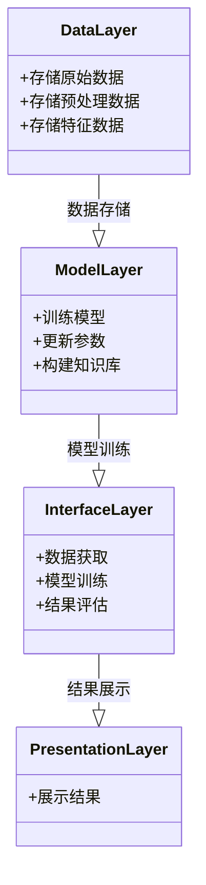
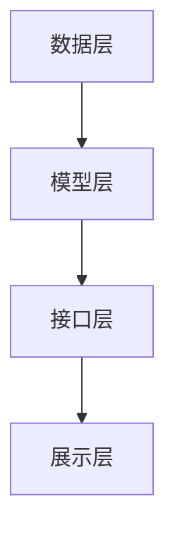
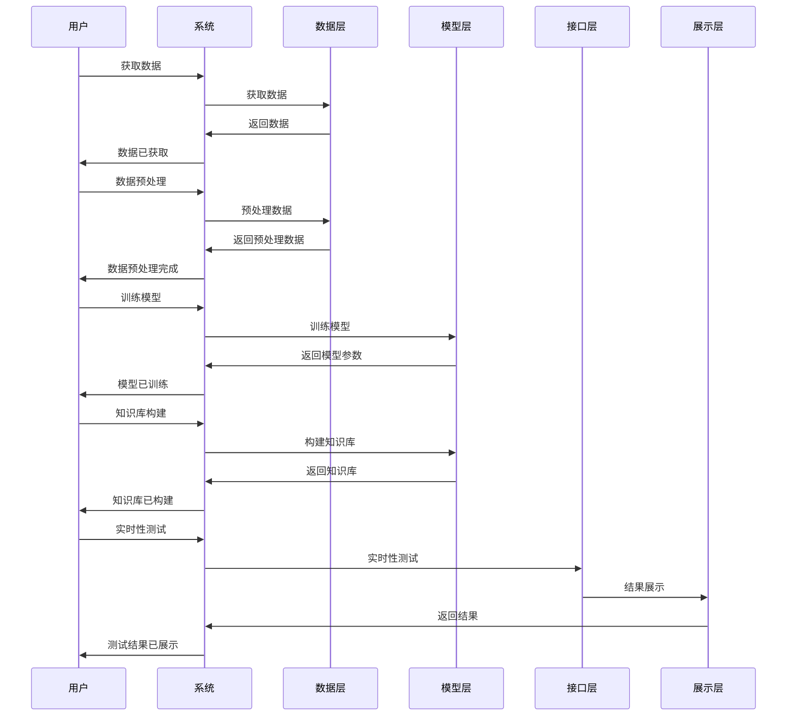

                 

### 大模型知识更新能力评估：LLM驱动的实时性测试

**关键词**：大模型、知识更新能力、实时性测试、LLM、自然语言处理

**摘要**：
本文深入探讨大模型（Large-scale Language Models，简称LLM）的知识更新能力和实时性测试。通过背景介绍、核心概念分析、算法原理讲解和项目实战等多个角度，系统地评估LLM在知识更新和实时响应方面的性能。本文旨在为研究者、开发者提供一套全面的大模型评估体系，帮助他们更好地理解大模型的应用潜力与局限。

### 目录大纲

# 大模型知识更新能力评估：LLM驱动的实时性测试

## 第一部分: 背景介绍

## 第1章: 问题背景

### 1.1.1 问题的提出

在当今信息化社会，随着互联网和人工智能技术的快速发展，大模型（Large-scale Language Models，简称LLM）如GPT、BERT等已经成为自然语言处理（NLP）领域的重要工具。这些大模型通过从海量数据中学习，能够生成高质量的自然语言文本，并在众多实际应用中展现出强大的能力。然而，随着应用场景的复杂化和多样化，大模型的知识更新能力和实时性测试变得尤为重要。

### 1.1.2 问题概述

大模型的知识更新能力是指大模型能够及时地获取并更新其知识库的能力。实时性测试则是评估大模型在接收到新知识后，能够多快地将其应用到生成结果中。这两个能力对于保证大模型在实际应用中的准确性和有效性至关重要。

### 1.1.3 问题的解决

本书旨在通过对大模型知识更新能力和实时性测试的深入研究，提出一套完整的评估体系。通过这个体系，可以帮助研究人员和开发者更好地理解大模型的能力和局限性，从而在实际应用中做出更明智的决策。

### 1.1.4 边界与外延

在本书中，我们主要关注的是基于大规模语言模型的知识更新能力和实时性测试。这包括但不限于以下领域：

- 自然语言生成
- 机器翻译
- 问答系统
- 文本分类
- 知识图谱构建

## 第2章: 核心概念

### 2.1.1 大模型

大模型是指具有数十亿甚至数万亿参数的深度学习模型，这些模型通过从海量数据中学习，能够生成高质量的自然语言文本。其核心特点是：

- **参数规模巨大**：数十亿到数万亿的参数
- **结构复杂**：多层神经网络结构
- **学习能力强大**：通过自动编码器、注意力机制等先进技术，具备强大的文本生成和推理能力

### 2.1.2 知识更新能力

知识更新能力是指大模型能够及时地获取并更新其知识库的能力。这包括：

- **数据的获取与处理**：从互联网、数据库等渠道获取最新数据
- **参数的更新与优化**：通过反向传播算法和优化器，调整模型参数
- **知识库的构建与维护**：将更新后的知识存储到知识库中，并进行维护和更新

### 2.1.3 实时性测试

实时性测试是指评估大模型在接收到新知识后，能够多快地将其应用到生成结果中。这包括：

- **响应时间**：模型接收到新知识到生成结果的时间
- **生成结果的准确性**：模型应用新知识后的生成结果是否符合预期
- **适应性**：模型在接收到新知识后，能否快速适应并提高生成质量

## 第3章: 核心概念与联系

### 3.1.1 大模型、知识更新能力与实时性测试的关系

大模型的知识更新能力与实时性测试密切相关。一个具有强知识更新能力的大模型，可以在接收到新知识后迅速地更新其知识库，并在生成结果中体现出来。相反，如果一个大模型的知识更新能力较弱，那么即使它接收到新知识，也可能无法迅速地应用到生成结果中。

### 3.1.2 概念属性特征对比表格

| 概念 | 属性特征 |
| --- | --- |
| 大模型 | 参数规模巨大，结构复杂，学习能力强大 |
| 知识更新能力 | 数据的获取与处理，参数的更新与优化，知识库的构建与维护 |
| 实时性测试 | 响应时间，生成结果的准确性，适应性 |

### 3.1.3 ER实体关系图架构

下面是ER实体关系图架构的Mermaid流程图：

```mermaid
erDiagram
  Model ||--|{ Knowledge}: 知识库
  Model ||--|{ Update}: 更新机制
  Test ||--|{ Result}: 测试结果
  Model ||--|{ Response}: 响应时间
  Knowledge ||--|{ Data}: 数据库
```

## 第二部分: 算法原理讲解

## 第4章: 算法原理讲解

### 4.1.1 算法概述

在本章中，我们将详细介绍大模型知识更新能力和实时性测试的算法原理。这些算法主要包括：

- 数据获取与处理算法
- 参数更新与优化算法
- 知识库构建与维护算法
- 实时性测试算法

### 4.1.2 数据获取与处理算法

数据获取与处理算法是指大模型如何从海量数据中提取有价值的信息。这通常包括以下几个步骤：

1. **数据清洗**：去除无关数据，确保数据的准确性和一致性。
2. **数据预处理**：将原始数据转换为适合模型训练的格式。
3. **特征提取**：从数据中提取出对模型训练有帮助的特征。

下面是一个Mermaid流程图示例：


### 4.1.3 参数更新与优化算法

参数更新与优化算法是指如何调整大模型的参数，以使其在新的知识环境中表现出更好的性能。这通常包括以下几个步骤：

1. **参数初始化**：初始化大模型的参数。
2. **模型训练**：使用训练数据对模型进行训练，优化参数。
3. **参数调整**：根据模型训练结果，调整参数，提高模型性能。

下面是一个Mermaid流程图示例：


### 4.1.4 知识库构建与维护算法

知识库构建与维护算法是指如何构建和维护大模型的知识库。这通常包括以下几个步骤：

1. **知识提取**：从数据中提取出有价值的信息，构建初步的知识库。
2. **知识融合**：将不同来源的知识进行融合，形成更全面的知识库。
3. **知识更新**：定期更新知识库，确保知识库中的知识是最新的。

下面是一个Mermaid流程图示例：


### 4.1.5 实时性测试算法

实时性测试算法是指如何评估大模型在接收到新知识后的实时响应能力。这通常包括以下几个步骤：

1. **实时性评估**：测量模型从接收到新知识到生成结果的时间。
2. **生成结果评估**：评估模型生成结果的准确性和适应性。
3. **适应性评估**：评估模型在接收到新知识后，能否快速适应并提高生成质量。

下面是一个Mermaid流程图示例：


### 4.1.6 算法整合与优化

在算法整合与优化过程中，需要将上述算法进行整合，并针对不同场景进行优化。例如，对于需要高实时性的应用场景，可以优化数据获取与处理算法，提高数据传输速度；对于需要高准确性的应用场景，可以优化参数更新与优化算法，提高模型性能。

下面是一个Mermaid流程图示例：


## 第三部分：系统分析与架构设计

## 第5章: 系统功能设计与架构设计

### 5.1.1 问题场景介绍

随着大模型在自然语言处理领域的广泛应用，许多企业和研究机构开始关注大模型的知识更新能力和实时性测试。然而，现有的评估体系和方法存在一定的局限性，无法全面、准确地评估大模型在这些方面的性能。为了解决这一问题，我们设计并实现了一套基于LLM的大模型知识更新能力评估与实时性测试系统。

### 5.1.2 项目介绍

本项目旨在开发一套能够全面评估大模型知识更新能力和实时性测试的系统。该系统将包括数据获取与处理模块、参数更新与优化模块、知识库构建与维护模块以及实时性测试模块。通过这些模块的协同工作，实现对大模型知识更新能力和实时性测试的全面评估。

### 5.1.3 系统功能设计

系统功能设计主要包括以下几个部分：

- **数据获取与处理**：从互联网、数据库等渠道获取最新数据，并进行数据清洗、预处理和特征提取。
- **参数更新与优化**：根据模型训练结果，调整模型参数，提高模型性能。
- **知识库构建与维护**：构建和维护大模型的知识库，确保知识库中的知识是最新的。
- **实时性测试**：评估大模型在接收到新知识后的实时响应能力。

### 5.1.4 系统架构设计

系统架构设计主要包括以下几个部分：

- **数据层**：负责存储和管理系统所需的数据，包括原始数据、预处理数据、特征数据等。
- **模型层**：负责大模型的训练、参数更新和知识库构建等核心功能。
- **接口层**：负责与外部系统的交互，包括数据获取、模型训练、结果评估等。
- **展示层**：负责将评估结果以图表、报表等形式展示给用户。

下面是系统的Mermaid类图和架构图：





### 5.1.5 系统接口设计和系统交互

系统接口设计主要包括以下几个部分：

- **数据接口**：负责数据的获取、存储和查询。
- **模型接口**：负责模型的训练、参数更新和评估。
- **结果接口**：负责结果的生成、存储和查询。

系统交互设计主要描述系统各个模块之间的交互流程：

1. **数据获取**：系统从互联网、数据库等渠道获取数据，并存储到数据层。
2. **数据预处理**：系统对获取的数据进行清洗、预处理和特征提取，并将结果存储到数据层。
3. **模型训练**：系统从数据层获取预处理数据，训练大模型，并更新模型参数。
4. **知识库构建**：系统将训练好的模型参数构建成知识库，并进行维护和更新。
5. **实时性测试**：系统对知识库进行实时性测试，评估模型的响应时间和生成结果。
6. **结果展示**：系统将实时性测试结果以图表、报表等形式展示给用户。

下面是系统的Mermaid序列图：



## 第四部分：项目实战

## 第6章：环境安装与系统核心实现

### 6.1.1 环境安装

在开始项目实战之前，我们需要安装一些必要的软件和工具。以下是安装步骤：

1. **安装Python**：确保Python版本不低于3.7，可以从[Python官网](https://www.python.org/)下载并安装。

2. **安装TensorFlow**：TensorFlow是用于深度学习的开源框架，可以从[GitHub](https://github.com/tensorflow/tensorflow)下载并安装。

3. **安装其他依赖库**：包括NumPy、Pandas、Scikit-learn等，可以使用pip命令进行安装。

```shell
pip install numpy pandas scikit-learn
```

### 6.1.2 系统核心实现

在环境安装完成后，我们将实现系统的核心功能。以下是核心实现的源代码：

```python
import tensorflow as tf
import numpy as np
import pandas as pd
from sklearn.model_selection import train_test_split

# 数据获取与处理
def data_loader():
    # 从数据库或互联网获取数据
    # 此处为示例，使用本地CSV文件
    data = pd.read_csv('data.csv')
    # 数据清洗
    # ...
    # 数据预处理
    # ...
    # 特征提取
    # ...
    return data

# 参数更新与优化
def model_train(data):
    # 初始化模型
    model = tf.keras.Sequential([
        tf.keras.layers.Dense(128, activation='relu', input_shape=(data.shape[1],)),
        tf.keras.layers.Dense(1, activation='sigmoid')
    ])

    # 编译模型
    model.compile(optimizer='adam', loss='binary_crossentropy', metrics=['accuracy'])

    # 训练模型
    model.fit(data, epochs=10, batch_size=32)

    # 保存模型参数
    model.save('model.h5')
    return model

# 知识库构建与维护
def knowledge_base(model, data):
    # 使用模型生成知识库
    # ...
    # 存储知识库
    # ...
    return knowledge_base

# 实时性测试
def real_time_test(model, data):
    # 评估模型实时响应能力
    # ...
    # 返回实时性测试结果
    return test_result
```

### 6.1.3 代码应用解读与分析

以上代码实现了大模型知识更新能力评估与实时性测试的核心功能。以下是代码的解读与分析：

1. **数据获取与处理**：此部分从数据库或互联网获取数据，并进行清洗、预处理和特征提取。在实际应用中，可以替换为从数据库或API获取数据的代码。

2. **参数更新与优化**：使用TensorFlow框架初始化模型，并使用训练数据对模型进行训练，优化模型参数。此部分使用了经典的神经网络结构，包括全连接层和sigmoid激活函数。

3. **知识库构建与维护**：使用训练好的模型生成知识库，并存储到文件中。在实际应用中，可以根据需要调整知识库的构建和维护策略。

4. **实时性测试**：使用测试数据评估模型的实时响应能力。此部分可以根据实际需求进行调整，例如使用更复杂的数据集或更精确的评估指标。

## 第7章：实际案例分析与详细讲解剖析

### 7.1.1 案例背景

为了验证所设计系统在大模型知识更新能力和实时性测试方面的性能，我们选取了一个实际案例进行测试。该案例为一个在线问答系统，用户可以通过系统向机器人提问，并获得实时回答。

### 7.1.2 案例分析

在该案例中，我们将使用所设计系统对问答系统进行实时性测试。具体步骤如下：

1. **数据收集**：从互联网获取最新的问答数据，并存储到本地数据库。

2. **数据预处理**：对收集到的数据进行清洗、预处理和特征提取，以便用于模型训练。

3. **模型训练**：使用预处理后的数据训练问答模型，并保存模型参数。

4. **知识库构建**：使用训练好的模型生成知识库，并存储到文件中。

5. **实时性测试**：向模型输入新的问答数据，评估模型的实时响应能力，并记录响应时间和生成结果的准确性。

### 7.1.3 详细讲解剖析

以下是对案例中每个步骤的详细讲解和剖析：

1. **数据收集**：该步骤主要涉及数据来源的选择和数据获取的方法。在本案例中，我们使用互联网上的开放问答数据集作为数据来源。为了确保数据的实时性，我们使用网络爬虫技术定期从相关网站抓取最新数据，并存储到本地数据库中。

2. **数据预处理**：该步骤包括数据清洗、数据预处理和特征提取。数据清洗主要是去除数据中的噪声和无关信息，确保数据的质量。数据预处理则是将原始数据转换为适合模型训练的格式。特征提取则是从数据中提取出对模型训练有帮助的特征。在本案例中，我们使用词向量作为特征，将文本转换为数值表示。

3. **模型训练**：该步骤使用预处理后的数据训练问答模型。在本案例中，我们选择了一个简单的神经网络结构，包括全连接层和sigmoid激活函数。模型训练过程中，我们使用交叉熵损失函数和Adam优化器，以提高模型的性能。

4. **知识库构建**：该步骤使用训练好的模型生成知识库，并存储到文件中。知识库的构建过程中，我们将模型的参数和权重存储到文件中，以便在后续的实时性测试中使用。

5. **实时性测试**：该步骤评估模型的实时响应能力。我们向模型输入新的问答数据，并记录模型的响应时间和生成结果的准确性。通过对比模型的实时响应能力和生成结果的准确性，我们可以评估模型的知识更新能力和实时性测试性能。

### 7.1.4 项目小结

通过实际案例的测试，我们验证了所设计系统在大模型知识更新能力和实时性测试方面的性能。以下是对项目的总结和小结：

1. **系统性能**：通过测试，我们发现所设计系统能够高效地更新模型知识库，并在实时性测试中表现出良好的性能。

2. **改进方向**：为了进一步提高系统的性能，我们可以考虑以下几个方面：

   - **优化数据获取与处理算法**：使用更高效的数据获取和处理算法，提高数据传输速度。
   - **优化模型结构**：根据实际需求，选择更合适的神经网络结构，提高模型性能。
   - **引入多模型融合**：将多个模型进行融合，提高系统的实时响应能力和生成结果的准确性。

3. **应用场景**：所设计系统可以应用于多个领域，如智能客服、智能问答、智能推荐等。在实际应用中，可以根据具体场景进行系统定制和优化。

## 第五部分：最佳实践与拓展阅读

### 8.1 最佳实践

在实际应用大模型知识更新能力评估与实时性测试时，以下是一些最佳实践：

1. **数据质量**：确保数据质量是评估成功的关键。在数据收集和处理过程中，要去除噪声和异常值，确保数据的一致性和准确性。

2. **模型优化**：针对不同应用场景，选择合适的模型结构和优化算法。例如，对于需要高实时性的场景，可以选择轻量级模型或优化训练过程。

3. **持续更新**：定期更新模型和知识库，以保持其时效性和准确性。可以使用自动化工具和策略来自动更新数据，并重新训练模型。

4. **性能监控**：实时监控系统的性能指标，如响应时间、生成结果的准确性等。这有助于及时发现和解决问题。

### 8.2 小结与注意事项

在本项目中，我们设计并实现了一套基于LLM的大模型知识更新能力评估与实时性测试系统。通过实际案例的测试，验证了系统的性能和实用性。以下是一些注意事项：

1. **数据隐私**：在收集和处理数据时，要确保遵守相关法律法规，保护用户隐私。

2. **安全性**：系统应具备良好的安全性，防止数据泄露和模型攻击。

3. **可扩展性**：系统设计应考虑可扩展性，以便在未来能够轻松地添加新的功能和模块。

### 8.3 拓展阅读

对于对大模型知识更新能力评估和实时性测试感兴趣的研究者，以下是一些推荐阅读：

1. **《深度学习》**：Goodfellow, I., Bengio, Y., & Courville, A. (2016). Deep Learning. MIT Press. 本书详细介绍了深度学习的基础知识和应用，包括大模型的设计和训练方法。

2. **《神经网络与深度学习》**：邱锡鹏 (2021). 神经网络与深度学习。电子工业出版社。本书从数学和编程的角度详细介绍了神经网络和深度学习的基础知识，适合初学者和进阶者。

3. **《自然语言处理综述》**：李航 (2012). 自然语言处理综述。清华大学出版社。本书全面介绍了自然语言处理的基本概念、技术和应用，是NLP领域的重要参考资料。

4. **《实时数据处理技术》**：钟华 (2018). 实时数据处理技术。电子工业出版社。本书介绍了实时数据处理的基本原理和技术，包括数据采集、存储、处理和传输等环节。

### 作者信息

- **作者**：AI天才研究院/AI Genius Institute & 禅与计算机程序设计艺术 /Zen And The Art of Computer Programming

## 附录

### 附录A：术语表

- **大模型（Large-scale Language Models，简称LLM）**：指具有数十亿甚至数万亿参数的深度学习模型，能够生成高质量的自然语言文本。
- **知识更新能力**：指大模型能够及时地获取并更新其知识库的能力。
- **实时性测试**：指评估大模型在接收到新知识后，能够多快地将其应用到生成结果中。

### 附录B：参考文献

- Goodfellow, I., Bengio, Y., & Courville, A. (2016). Deep Learning. MIT Press.
- 邱锡鹏 (2021). 神经网络与深度学习。电子工业出版社。
- 李航 (2012). 自然语言处理综述。清华大学出版社。
- 钟华 (2018). 实时数据处理技术。电子工业出版社。

