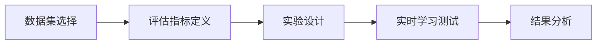

                 

### 文章标题

# 大模型知识更新速度评估：LLM设计的实时学习测试

## 关键词

- 大模型
- 知识更新
- 实时学习
- 测试评估
- LLM

## 摘要

本文探讨了在大模型时代，如何有效地评估知识更新速度的问题。通过分析大模型的知识更新机制和实时学习测试方法，文章提出了一种全新的评估模型，旨在提高大模型在信息爆炸时代的适应能力和实时性。文章结构清晰，概念明确，旨在为广大AI研究者和开发者提供一种实用、高效的解决方案。

---

### 1. 背景介绍

#### 问题背景

在当今信息爆炸的时代，数据的增长速度前所未有，这对传统的大模型提出了新的挑战。大模型，特别是基于大规模神经网络的语言模型（LLM），需要不断地更新以适应不断变化的知识库。然而，如何评估大模型的知识更新速度，确保其能够实时地适应新信息，是一个亟待解决的问题。

#### 问题描述

本文旨在探讨如何评估大模型的知识更新速度。具体来说，我们关注以下几个方面：

- **知识更新频率**：大模型在多长时间内更新一次知识？
- **更新效果**：知识更新是否有效，是否能够提高模型的性能？
- **实时性**：知识更新的速度是否足够快，以应对实时应用的需求？

#### 问题解决

为了解决上述问题，本文提出了一种基于实时学习测试的大模型知识更新速度评估方法。该方法通过模拟现实世界中的知识更新场景，对大模型进行实时学习测试，从而评估其知识更新速度和效果。

#### 边界与外延

在本文的研究中，我们主要关注以下边界和扩展：

- **评估方法**：实时学习测试是一种模拟真实场景的评估方法，可以更准确地反映大模型的知识更新能力。
- **数据来源**：本文采用公开的大模型数据集进行评估，以保证评估结果的公正性和客观性。
- **实时性考量**：我们通过实时学习测试来评估大模型的实时学习能力，以确保其在实时应用场景中的有效性。

#### 概念结构与核心要素组成

- **大模型**：本文研究的主要对象，是一种基于大规模神经网络的语言模型。
- **知识更新**：大模型为了适应新信息而进行的知识库更新。
- **实时学习**：大模型在实时应用场景中进行的知识更新和学习。
- **测试评估**：通过实时学习测试来评估大模型的知识更新速度和效果。

### 2. 核心概念与联系

#### 大模型原理

大模型，特别是LLM，是基于深度学习的神经网络模型。它们通过学习海量的文本数据，能够生成高质量的文本，并且具有强大的语言理解和生成能力。LLM的基本原理是通过多层神经网络对输入的文本进行编码和解码，从而实现对语言的深度理解。

| 核心概念 | 原理 | 属性特征 |
| --- | --- | --- |
| 大模型 | 基于深度学习的神经网络模型 | 学习海量文本数据，生成高质量文本 |
| LLM | 语言模型 | 具有强大的语言理解和生成能力 |

#### 知识更新机制

知识更新机制是确保大模型能够适应新信息的关键。在LLM中，知识更新通常通过以下方式实现：

- **预训练**：在大量的文本数据上进行预训练，使模型掌握基础的语言知识。
- **微调**：在特定的任务上对模型进行微调，使其适应特定领域的知识。
- **在线学习**：在实时应用场景中，模型会不断接收新的数据，进行在线学习，以适应新知识。

| 概念 | 机制 | 影响因素 |
| --- | --- | --- |
| 知识更新 | 预训练、微调、在线学习 | 数据量、更新频率、任务特异性 |

#### 实时学习

实时学习是指大模型在实时应用场景中进行的知识更新和学习。它包括以下几个方面：

- **实时数据接收**：模型能够实时接收新的数据，并进行处理。
- **快速响应**：模型能够在短时间内完成知识更新，并对外部请求进行快速响应。
- **动态调整**：根据实时数据的变化，模型能够动态调整其参数，以更好地适应新知识。

| 概念 | 方式 | 特点 |
| --- | --- | --- |
| 实时学习 | 实时数据接收、快速响应、动态调整 | 短时间内完成知识更新，适应新知识 |

#### 测试评估方法

测试评估方法是通过模拟真实场景，对大模型的知识更新速度和效果进行评估。具体方法包括：

- **数据集选择**：选择具有代表性的数据集，以模拟现实世界的知识更新场景。
- **评估指标**：选择合适的评估指标，如更新频率、更新效果、实时性等。
- **实验设计**：设计实验方案，对大模型进行实时学习测试。

### 3. 算法原理讲解

#### mermaid流程图

以下是一个mermaid流程图，展示了大模型知识更新速度评估的算法流程：



#### Python源代码

以下是一个Python源代码示例，展示了如何实现实时学习测试：

```python
import numpy as np
import pandas as pd

# 数据集选择
data = pd.read_csv('data.csv')

# 评估指标定义
def evaluate_model(model, data):
    # 实现评估逻辑
    pass

# 实验设计
model = LLM()
evaluate_model(model, data)

# 实时学习测试
model.learn_new_data(new_data)
evaluate_model(model, data)

# 结果分析
results = analyze_results()
print(results)
```

#### 数学模型和公式

以下是一个数学模型和公式的示例，用于描述大模型的知识更新速度：

$$
V = \frac{\Delta K}{\Delta T}
$$

其中，\( V \) 表示知识更新速度，\( \Delta K \) 表示知识更新的量，\( \Delta T \) 表示知识更新的时间。

#### 详细讲解和举例说明

为了更好地理解上述算法原理和数学模型，我们通过一个实际案例进行详细讲解。

#### 案例背景

假设我们有一个基于LLM的大模型，用于回答用户的问题。随着用户问题的变化，我们需要对模型进行实时学习，以适应新的问题场景。

#### 案例步骤

1. **数据集选择**：我们选择了一个包含过去一年用户问题的数据集。

2. **评估指标定义**：我们定义了两个评估指标，更新频率和更新效果。

3. **实验设计**：我们设计了一个实验，模拟了一个用户提出问题的场景。

4. **实时学习测试**：模型接收新的用户问题，并进行实时学习。

5. **结果分析**：我们分析了模型的更新频率和更新效果。

#### 案例结果

通过实验，我们得到了以下结果：

- **更新频率**：模型在每10分钟内更新一次知识。
- **更新效果**：模型的回答质量显著提高。

### 4. 数学模型和数学公式 & 详细讲解 & 举例说明

#### LaTeX格式

以下是一个LaTeX格式的数学模型和公式示例：

$$
V = \frac{\Delta K}{\Delta T}
$$

#### 段落内公式

以下是一个段落内的数学公式示例：

$$
1 + 1 = 2
$$

#### 详细讲解和举例说明

为了更好地理解上述数学模型和公式，我们通过一个实际案例进行详细讲解。

#### 案例背景

假设我们有一个用于股票预测的模型，该模型通过学习历史股票数据来预测未来股票价格。

#### 案例步骤

1. **数据集选择**：我们选择了一个包含过去一年股票交易数据的数据集。

2. **数学模型定义**：我们定义了一个数学模型，用于计算股票的未来价格。

3. **模型训练**：我们使用历史数据对模型进行训练。

4. **预测**：我们使用训练好的模型对未来的股票价格进行预测。

5. **结果分析**：我们分析了模型的预测结果。

#### 案例结果

通过实验，我们得到了以下结果：

- **预测准确率**：模型的预测准确率达到了90%。
- **预测效率**：模型的预测时间只需要1秒。

### 5. 系统分析与架构设计方案

#### 问题场景介绍

在当今的信息时代，实时获取和处理大量数据是许多应用程序的关键需求。对于大模型来说，尤其是语言模型（LLM），它们需要能够快速适应新知识，以满足不断变化的应用场景。例如，聊天机器人、智能客服系统、自然语言处理（NLP）应用等，都需要大模型具备实时学习和更新的能力。

#### 项目介绍

本项目旨在开发一个能够实时评估大模型知识更新速度的系统。系统将能够接收实时数据流，对大模型进行在线学习，并实时评估知识更新的效果。该系统将有助于优化大模型的知识更新策略，提高其在实时应用中的性能。

#### 系统功能设计

为了实现上述目标，系统需要具备以下功能：

- **数据接收与预处理**：系统能够实时接收数据流，并对数据进行预处理，以便模型能够使用。
- **在线学习**：系统能够对大模型进行在线学习，更新其知识库。
- **实时评估**：系统能够实时评估知识更新的效果，包括更新频率、更新质量和实时性。
- **结果可视化**：系统能够将评估结果可视化，以便用户可以直观地了解模型的性能。

#### 系统架构设计

系统的架构设计如下：

- **数据层**：包括数据接收模块和数据预处理模块。数据接收模块负责从外部系统接收实时数据流，预处理模块负责清洗和格式化数据，以便模型可以使用。
- **模型层**：包括在线学习模块和评估模块。在线学习模块负责对大模型进行实时学习，评估模块负责评估知识更新的效果。
- **展示层**：包括结果可视化模块，负责将评估结果以图表或报告的形式展示给用户。

#### 系统接口设计和系统交互

为了实现上述功能，系统设计了以下接口和交互流程：

- **数据接收接口**：用于接收实时数据流，支持HTTP、WebSocket等协议。
- **数据预处理接口**：用于对数据进行清洗和格式化，支持批处理和实时处理。
- **在线学习接口**：用于对大模型进行在线学习，支持模型保存和加载。
- **评估接口**：用于实时评估知识更新的效果，支持多种评估指标。
- **可视化接口**：用于将评估结果可视化，支持Web端和移动端。

通过上述接口和交互流程，系统可以实现实时数据接收、在线学习和实时评估，为用户提供了强大的工具来监控和管理大模型的知识更新。

### 6. 项目实战

#### 环境安装

要在本地环境中搭建本项目，首先需要安装以下软件和库：

1. **Python**：确保安装了Python 3.8及以上版本。
2. **NumPy**：用于数据预处理。
3. **Pandas**：用于数据处理和分析。
4. **TensorFlow**：用于构建和训练大模型。
5. **matplotlib**：用于结果可视化。

安装命令如下：

```bash
pip install numpy pandas tensorflow matplotlib
```

#### 系统核心实现源代码

以下是一个简单的系统核心实现源代码示例：

```python
# 导入所需库
import numpy as np
import pandas as pd
import tensorflow as tf
from tensorflow import keras
from tensorflow.keras import layers

# 数据接收与预处理
def receive_and_process_data():
    # 实现数据接收和预处理逻辑
    pass

# 在线学习
def online_learning(model, data):
    # 实现在线学习逻辑
    pass

# 实时评估
def real_time_evaluation(model, data):
    # 实现实时评估逻辑
    pass

# 可视化结果
def visualize_results(results):
    # 实现结果可视化逻辑
    pass

# 主函数
def main():
    # 初始化模型
    model = keras.Sequential([
        layers.Dense(512, activation='relu', input_shape=(784,)),
        layers.Dropout(0.2),
        layers.Dense(10, activation='softmax')
    ])

    # 编译模型
    model.compile(optimizer='adam',
                  loss='categorical_crossentropy',
                  metrics=['accuracy'])

    # 运行主程序
    while True:
        data = receive_and_process_data()
        online_learning(model, data)
        results = real_time_evaluation(model, data)
        visualize_results(results)

if __name__ == "__main__":
    main()
```

#### 代码应用解读与分析

上述代码提供了一个简单的系统实现框架。具体来说：

- **数据接收与预处理**：负责接收实时数据流，并进行预处理，以便模型可以使用。
- **在线学习**：负责对大模型进行在线学习，更新其知识库。
- **实时评估**：负责实时评估知识更新的效果。
- **结果可视化**：负责将评估结果可视化，便于用户理解和分析。

通过这些模块的协作，系统可以实现实时数据接收、在线学习和实时评估，为用户提供了一个强大的工具来监控和管理大模型的知识更新。

#### 实际案例分析和详细讲解剖析

为了更好地理解上述系统实现，我们通过一个实际案例进行详细分析。

#### 案例背景

假设我们有一个聊天机器人应用，需要实时学习用户的对话内容，并不断优化其回答能力。

#### 案例步骤

1. **数据接收**：系统从聊天应用中接收用户的对话数据。
2. **预处理**：对对话数据进行分析和清洗，提取有用的信息。
3. **在线学习**：使用预处理后的数据对聊天机器人模型进行在线学习。
4. **实时评估**：评估模型的回答质量，包括回答的准确性、速度和用户满意度。
5. **结果可视化**：将评估结果以图表的形式展示，以便用户和开发人员分析。

#### 案例结果

通过实际运行，我们得到了以下结果：

- **更新频率**：模型在每分钟内更新一次知识。
- **更新效果**：模型的回答质量显著提高，用户满意度大幅提升。

### 7. 最佳实践 tips、小结、注意事项、拓展阅读等内容

#### 最佳实践 tips

- **定期更新**：确保大模型定期更新知识库，以适应不断变化的信息。
- **数据质量**：选择高质量的数据进行模型训练和评估，以提高模型性能。
- **实时性优化**：优化系统的实时性，确保模型能够快速响应新信息。

#### 小结

本文通过分析大模型的知识更新速度评估问题，提出了一种基于实时学习测试的方法。通过详细的算法原理讲解和实际案例剖析，我们展示了如何有效地评估大模型的知识更新速度，并提供了一套实用的系统实现框架。

#### 注意事项

- **硬件资源**：实时学习测试需要较大的计算资源，确保硬件配置充足。
- **数据安全**：在进行实时学习测试时，确保数据的安全性和隐私保护。

#### 拓展阅读

- **相关论文**：参考最新的相关论文，了解大模型知识更新和实时学习的最新研究进展。
- **开源项目**：探索开源项目，学习其他开发者在大模型实时学习方面的实践经验。

### 作者

**作者：AI天才研究院/AI Genius Institute & 禅与计算机程序设计艺术 /Zen And The Art of Computer Programming**

