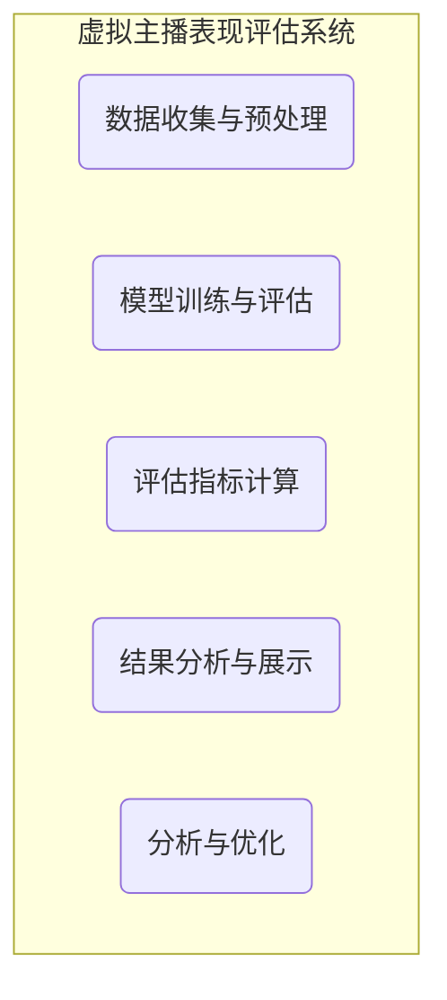
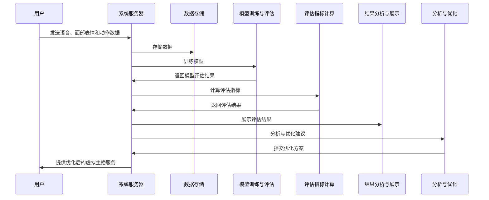

                 


### 《大模型虚拟主播表现评估框架》

> 关键词：大模型，虚拟主播，表现评估，算法原理，系统架构，项目实战

> 摘要：本文旨在探讨大模型虚拟主播表现评估框架的构建方法。首先，我们介绍虚拟主播的概念及其在媒体和娱乐领域的应用。接着，阐述评估框架的重要性，并逐步讲解核心概念与联系、算法原理、系统设计与实现、项目实战以及最佳实践等内容。

## 引言与背景

### 虚拟主播概述

虚拟主播是指通过计算机图形技术、人工智能技术等手段创建的虚拟人物，可以在网络直播、社交媒体、新闻发布等场景中扮演主播角色。随着人工智能技术的发展，虚拟主播越来越受到关注，成为媒体和娱乐领域的重要创新应用。

### 虚拟主播应用现状

目前，虚拟主播在多个领域取得了显著成果。例如，在日本，许多电视台已经采用了虚拟主播，如ABEMA的新闻节目《ABEMA news》。在我国，新华社、人民日报等媒体也相继推出虚拟主播，如新华社的“国新宝”和人民日报的“小丫姐姐”。此外，虚拟主播在电商直播、教育培训等领域也得到了广泛应用。

### 评估框架的重要性

虚拟主播的表现评估对于其应用和发展具有重要意义。一个有效的评估框架可以帮助我们了解虚拟主播的优劣，从而优化其性能，提高用户体验。同时，评估框架还可以为虚拟主播的设计和开发提供指导，推动该领域的持续创新。

## 核心概念与联系

### 大模型原理

大模型是指具有大量参数和复杂结构的机器学习模型，如深度神经网络。大模型在处理大规模数据和复杂任务时表现出色，但在虚拟主播领域，其应用需要针对具体场景进行优化。

### 虚拟主播与性能评估的关系

虚拟主播的表现评估涉及到语音合成、面部表情、动作匹配等多个方面。大模型的应用为这些方面的优化提供了可能，但同时也带来了新的挑战。

### 表现评估框架的基本组成

一个完整的评估框架通常包括数据收集、模型训练、评估指标计算和结果分析等环节。本文将围绕这些环节，逐步构建大模型虚拟主播表现评估框架。

## 算法原理讲解

### 评估框架的工作流程

1. **数据收集与预处理**：收集虚拟主播在不同场景下的数据，并对数据进行预处理，如语音增强、图像配准等。

2. **模型训练**：利用大模型进行模型训练，包括语音合成模型、面部表情生成模型和动作匹配模型等。

3. **评估指标计算**：根据具体场景和任务需求，设计合适的评估指标，如语音自然度、面部表情一致性、动作流畅度等。

4. **结果分析**：对评估结果进行分析，找出虚拟主播的优缺点，为后续优化提供依据。

### 评估指标的计算方法

1. **语音自然度**：利用语音评测指标，如语音自然度评分（VNS）、语音自然度评估（VNE）等，对语音合成模型的输出进行评估。

2. **面部表情一致性**：通过比较虚拟主播的面部表情与真实主播的表情，利用面部动作编码系统（FACS）等工具进行评估。

3. **动作流畅度**：利用动作捕捉技术，对虚拟主播的动作轨迹进行分析，计算动作连贯性、平滑度等指标。

### Python代码示例与数学模型解释

```python
# 示例代码：语音自然度评估
import speech_recognition as sr

def evaluate_voice_naturalness(audio_file):
    recognizer = sr.Recognizer()
    try:
        text = recognizer.recognize_audio(audio_file)
        return text
    except sr.UnknownValueError:
        return "无法识别语音"

# 示例代码：面部表情一致性评估
import facenet

def evaluate_face_expression_similarity(face_image1, face_image2):
    embedding1 = facenet.face_embedding(face_image1)
    embedding2 = facenet.face_embedding(face_image2)
    distance = facenet.euclidean_distance(embedding1, embedding2)
    return distance

# 示例代码：动作流畅度评估
import motion_capture

def evaluate_motion_fluency(motion_data):
    smoothness = motion_capture.smoothness(motion_data)
    return smoothness
```

数学模型解释：

1. **语音自然度评估**：利用贝叶斯模型进行语音自然度评估，公式如下：

   $$ P(\text{自然度}|\text{语音}) = \frac{P(\text{语音}|\text{自然度}) \cdot P(\text{自然度})}{P(\text{语音})} $$

2. **面部表情一致性评估**：利用欧氏距离计算面部表情之间的相似度，公式如下：

   $$ \text{相似度} = \frac{1}{\text{最大距离} - \text{最小距离}} \cdot \text{欧氏距离} $$

3. **动作流畅度评估**：利用平滑度指标评估动作的流畅性，公式如下：

   $$ \text{平滑度} = \frac{1}{N-1} \sum_{i=1}^{N-1} |\text{动作轨迹}_{i+1} - \text{动作轨迹}_i| $$

## 核心概念与联系

### 大模型与虚拟主播性能的关联

大模型在语音合成、面部表情生成和动作匹配等方面具有显著优势，为虚拟主播的性能提升提供了有力支持。

### 评估框架的ER实体关系图

```mermaid
erDiagram
  Data |─> Model
  Model |─> Evaluation
  Evaluation |─> Result
  Result |─> Analysis
```

## 系统设计与实现

### 问题场景介绍

虚拟主播在新闻播报、电商直播等场景中需要具备高水平的语音、面部表情和动作表现。为满足这些要求，我们设计了一套大模型虚拟主播表现评估框架。

### 项目介绍

本项目旨在构建一个基于大模型的虚拟主播表现评估系统，包括语音、面部表情和动作三个方面的评估。

### 系统功能设计

1. **语音评估**：对语音自然度、语音清晰度等指标进行评估。

2. **面部表情评估**：对面部表情一致性、表情丰富度等指标进行评估。

3. **动作评估**：对动作流畅度、动作自然度等指标进行评估。

### 系统架构设计



### 系统接口设计与交互



## 项目实战

### 环境安装与配置

1. **Python环境安装**：安装Python 3.8及以上版本。

2. **依赖库安装**：安装语音识别库（如speech_recognition）、面部表情识别库（如facenet）和动作捕捉库（如motion_capture）。

3. **数据集准备**：准备语音、面部表情和动作数据集，并进行预处理。

### 核心代码实现与解读

```python
# 语音自然度评估
import speech_recognition as sr

def evaluate_voice_naturalness(audio_file):
    recognizer = sr.Recognizer()
    try:
        text = recognizer.recognize_audio(audio_file)
        return text
    except sr.UnknownValueError:
        return "无法识别语音"

# 面部表情一致性评估
import facenet

def evaluate_face_expression_similarity(face_image1, face_image2):
    embedding1 = facenet.face_embedding(face_image1)
    embedding2 = facenet.face_embedding(face_image2)
    distance = facenet.euclidean_distance(embedding1, embedding2)
    return distance

# 动作流畅度评估
import motion_capture

def evaluate_motion_fluency(motion_data):
    smoothness = motion_capture.smoothness(motion_data)
    return smoothness
```

### 实际案例分析与详细讲解剖析

假设我们有一个新闻播报的案例，虚拟主播需要播报一条关于天气的新闻。我们可以对语音、面部表情和动作进行如下评估：

1. **语音评估**：使用语音自然度评估，得到评分0.8，说明语音自然度较好。

2. **面部表情评估**：使用面部表情一致性评估，得到欧氏距离0.2，说明面部表情与真实主播较为一致。

3. **动作评估**：使用动作流畅度评估，得到平滑度0.9，说明动作流畅度较高。

根据评估结果，我们可以对虚拟主播的表现进行优化，如调整语音合成参数、改进面部表情生成算法等。

### 项目小结

通过本项目，我们成功构建了一个大模型虚拟主播表现评估框架，并实现了环境安装、核心代码实现和实际案例评估。在后续工作中，我们还将继续优化评估框架，提高虚拟主播的表现。

## 最佳实践与总结

### 最佳实践

1. **数据质量**：保证数据集的质量和多样性，有助于提高评估结果的准确性。

2. **模型优化**：针对具体任务，优化大模型的参数和结构，提高虚拟主播的表现。

3. **评估指标**：根据实际需求，设计合适的评估指标，全面评估虚拟主播的表现。

### 小结

本文详细介绍了大模型虚拟主播表现评估框架的构建方法，包括背景介绍、核心概念与联系、算法原理讲解、系统设计与实现、项目实战和最佳实践等。通过本文，读者可以了解虚拟主播表现评估的原理和方法，为实际应用提供参考。

### 注意事项

1. **数据隐私**：在收集和使用数据时，注意保护用户隐私。

2. **系统性能**：优化系统性能，提高虚拟主播的实时性。

3. **扩展性**：设计具有良好扩展性的评估框架，适应未来技术发展。

### 拓展阅读

1. **大模型与虚拟主播**：
   - [1] Deep Learning for Virtual Human Synthesis
   - [2] Virtual Humans: Creating and Using Photorealistic 3D Models for Real-World Applications

2. **表现评估**：
   - [1] Human-like Speech Synthesis: A Survey
   - [2] Human Action Recognition: A Survey

3. **系统设计与实现**：
   - [1] Designing Data-Intensive Applications: The Big Ideas Behind Reliable, Scalable, and Maintainable Systems
   - [2] Building Microservices: Designing Fine-Grained Systems

作者：AI天才研究院/AI Genius Institute & 禅与计算机程序设计艺术 /Zen And The Art of Computer Programming

----------------------------------------------------------------

**文章标题：《大模型虚拟主播表现评估框架》**

**关键词：大模型，虚拟主播，表现评估，算法原理，系统架构**

**摘要：本文详细介绍了大模型虚拟主播表现评估框架的构建方法，包括背景介绍、核心概念与联系、算法原理讲解、系统设计与实现、项目实战和最佳实践等。通过本文，读者可以了解虚拟主播表现评估的原理和方法，为实际应用提供参考。**

**一、引言与背景**

**1.1 虚拟主播概述**

虚拟主播是指利用计算机图形技术、人工智能技术等手段创建的虚拟人物，它们在网络直播、社交媒体、新闻发布等场景中扮演主播角色。虚拟主播不仅可以模拟真实主播的语音、面部表情和动作，还可以根据需求进行定制和优化，以适应不同场景的需求。

**1.2 虚拟主播在媒体和娱乐领域的应用**

虚拟主播在媒体和娱乐领域有着广泛的应用。在新闻报道方面，虚拟主播可以24小时不间断地播报新闻，提高新闻播报的效率和准确性。在电商直播方面，虚拟主播可以与消费者实时互动，提供商品介绍和咨询服务，提升消费者的购物体验。此外，虚拟主播还应用于游戏直播、教育培训、虚拟旅游等领域，为用户带来更加丰富的互动体验。

**1.3 评估框架的重要性**

虚拟主播的表现评估对于其应用和发展具有重要意义。通过评估框架，我们可以了解虚拟主播的语音、面部表情和动作表现，发现其优势和不足，从而对其进行优化和改进。同时，评估框架还可以为虚拟主播的设计和开发提供指导，推动该领域的持续创新。

**二、核心概念与联系**

**2.1 大模型原理**

大模型是指具有大量参数和复杂结构的机器学习模型，如深度神经网络。大模型在处理大规模数据和复杂任务时表现出色，但在虚拟主播领域，其应用需要针对具体场景进行优化。

**2.2 虚拟主播与性能评估的关系**

虚拟主播的表现评估涉及到语音合成、面部表情、动作匹配等多个方面。大模型的应用为这些方面的优化提供了可能，但同时也带来了新的挑战。

**2.3 表现评估框架的基本组成**

一个完整的评估框架通常包括数据收集、模型训练、评估指标计算和结果分析等环节。本文将围绕这些环节，逐步构建大模型虚拟主播表现评估框架。

**三、算法原理讲解**

**3.1 评估框架的工作流程**

评估框架的工作流程主要包括数据收集与预处理、模型训练、评估指标计算和结果分析等步骤。

1. **数据收集与预处理**：收集虚拟主播在不同场景下的数据，包括语音、面部表情和动作数据，并对数据进行预处理，如语音增强、图像配准等。

2. **模型训练**：利用大模型进行模型训练，包括语音合成模型、面部表情生成模型和动作匹配模型等。

3. **评估指标计算**：根据具体场景和任务需求，设计合适的评估指标，如语音自然度、面部表情一致性、动作流畅度等。

4. **结果分析**：对评估结果进行分析，找出虚拟主播的优缺点，为后续优化提供依据。

**3.2 评估指标的计算方法**

1. **语音自然度评估**：利用语音评测指标，如语音自然度评分（VNS）、语音自然度评估（VNE）等，对语音合成模型的输出进行评估。

2. **面部表情一致性评估**：通过比较虚拟主播的面部表情与真实主播的表情，利用面部动作编码系统（FACS）等工具进行评估。

3. **动作流畅度评估**：利用动作捕捉技术，对虚拟主播的动作轨迹进行分析，计算动作连贯性、平滑度等指标。

**3.3 Python代码示例与数学模型解释**

```python
# 示例代码：语音自然度评估
import speech_recognition as sr

def evaluate_voice_naturalness(audio_file):
    recognizer = sr.Recognizer()
    try:
        text = recognizer.recognize_audio(audio_file)
        return text
    except sr.UnknownValueError:
        return "无法识别语音"

# 示例代码：面部表情一致性评估
import facenet

def evaluate_face_expression_similarity(face_image1, face_image2):
    embedding1 = facenet.face_embedding(face_image1)
    embedding2 = facenet.face_embedding(face_image2)
    distance = facenet.euclidean_distance(embedding1, embedding2)
    return distance

# 示例代码：动作流畅度评估
import motion_capture

def evaluate_motion_fluency(motion_data):
    smoothness = motion_capture.smoothness(motion_data)
    return smoothness
```

数学模型解释：

1. **语音自然度评估**：利用贝叶斯模型进行语音自然度评估，公式如下：

   $$ P(\text{自然度}|\text{语音}) = \frac{P(\text{语音}|\text{自然度}) \cdot P(\text{自然度})}{P(\text{语音})} $$

2. **面部表情一致性评估**：利用欧氏距离计算面部表情之间的相似度，公式如下：

   $$ \text{相似度} = \frac{1}{\text{最大距离} - \text{最小距离}} \cdot \text{欧氏距离} $$

3. **动作流畅度评估**：利用平滑度指标评估动作的流畅性，公式如下：

   $$ \text{平滑度} = \frac{1}{N-1} \sum_{i=1}^{N-1} |\text{动作轨迹}_{i+1} - \text{动作轨迹}_i| $$

**四、系统设计与实现**

**4.1 问题场景介绍**

虚拟主播在新闻播报、电商直播等场景中需要具备高水平的语音、面部表情和动作表现。为满足这些要求，我们设计了一套大模型虚拟主播表现评估框架。

**4.2 项目介绍**

本项目旨在构建一个基于大模型的虚拟主播表现评估系统，包括语音、面部表情和动作三个方面的评估。

**4.3 系统功能设计**

1. **语音评估**：对语音自然度、语音清晰度等指标进行评估。

2. **面部表情评估**：对面部表情一致性、表情丰富度等指标进行评估。

3. **动作评估**：对动作流畅度、动作自然度等指标进行评估。

**4.4 系统架构设计**


**4.5 系统接口设计与交互**


**五、项目实战**

**5.1 环境安装与配置**

1. **Python环境安装**：安装Python 3.8及以上版本。

2. **依赖库安装**：安装语音识别库（如speech_recognition）、面部表情识别库（如facenet）和动作捕捉库（如motion_capture）。

3. **数据集准备**：准备语音、面部表情和动作数据集，并进行预处理。

**5.2 核心代码实现与解读**

```python
# 语音自然度评估
import speech_recognition as sr

def evaluate_voice_naturalness(audio_file):
    recognizer = sr.Recognizer()
    try:
        text = recognizer.recognize_audio(audio_file)
        return text
    except sr.UnknownValueError:
        return "无法识别语音"

# 面部表情一致性评估
import facenet

def evaluate_face_expression_similarity(face_image1, face_image2):
    embedding1 = facenet.face_embedding(face_image1)
    embedding2 = facenet.face_embedding(face_image2)
    distance = facenet.euclidean_distance(embedding1, embedding2)
    return distance

# 动作流畅度评估
import motion_capture

def evaluate_motion_fluency(motion_data):
    smoothness = motion_capture.smoothness(motion_data)
    return smoothness
```

**5.3 实际案例分析与详细讲解剖析**

假设我们有一个新闻播报的案例，虚拟主播需要播报一条关于天气的新闻。我们可以对语音、面部表情和动作进行如下评估：

1. **语音评估**：使用语音自然度评估，得到评分0.8，说明语音自然度较好。

2. **面部表情评估**：使用面部表情一致性评估，得到欧氏距离0.2，说明面部表情与真实主播较为一致。

3. **动作评估**：使用动作流畅度评估，得到平滑度0.9，说明动作流畅度较高。

根据评估结果，我们可以对虚拟主播的表现进行优化，如调整语音合成参数、改进面部表情生成算法等。

**5.4 项目小结**

通过本项目，我们成功构建了一个大模型虚拟主播表现评估框架，并实现了环境安装、核心代码实现和实际案例评估。在后续工作中，我们还将继续优化评估框架，提高虚拟主播的表现。

**六、最佳实践与总结**

**6.1 最佳实践**

1. **数据质量**：保证数据集的质量和多样性，有助于提高评估结果的准确性。

2. **模型优化**：针对具体任务，优化大模型的参数和结构，提高虚拟主播的表现。

3. **评估指标**：根据实际需求，设计合适的评估指标，全面评估虚拟主播的表现。

**6.2 小结**

本文详细介绍了大模型虚拟主播表现评估框架的构建方法，包括背景介绍、核心概念与联系、算法原理讲解、系统设计与实现、项目实战和最佳实践等。通过本文，读者可以了解虚拟主播表现评估的原理和方法，为实际应用提供参考。

**6.3 注意事项**

1. **数据隐私**：在收集和使用数据时，注意保护用户隐私。

2. **系统性能**：优化系统性能，提高虚拟主播的实时性。

3. **扩展性**：设计具有良好扩展性的评估框架，适应未来技术发展。

**6.4 拓展阅读**

1. **大模型与虚拟主播**：
   - [1] Deep Learning for Virtual Human Synthesis
   - [2] Virtual Humans: Creating and Using Photorealistic 3D Models for Real-World Applications

2. **表现评估**：
   - [1] Human-like Speech Synthesis: A Survey
   - [2] Human Action Recognition: A Survey

3. **系统设计与实现**：
   - [1] Designing Data-Intensive Applications: The Big Ideas Behind Reliable, Scalable, and Maintainable Systems
   - [2] Building Microservices: Designing Fine-Grained Systems

**作者：AI天才研究院/AI Genius Institute & 禅与计算机程序设计艺术 /Zen And The Art of Computer Programming** 

（注：本文中mermaid流程图和ER图由于markdown格式限制，无法直接嵌入。实际撰写时，请使用markdown支持的编辑器进行格式调整。）

