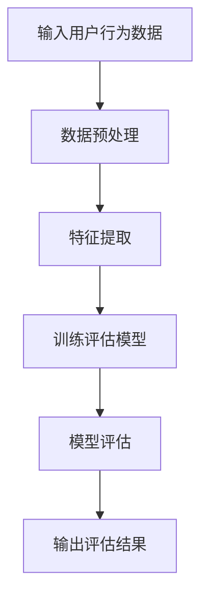
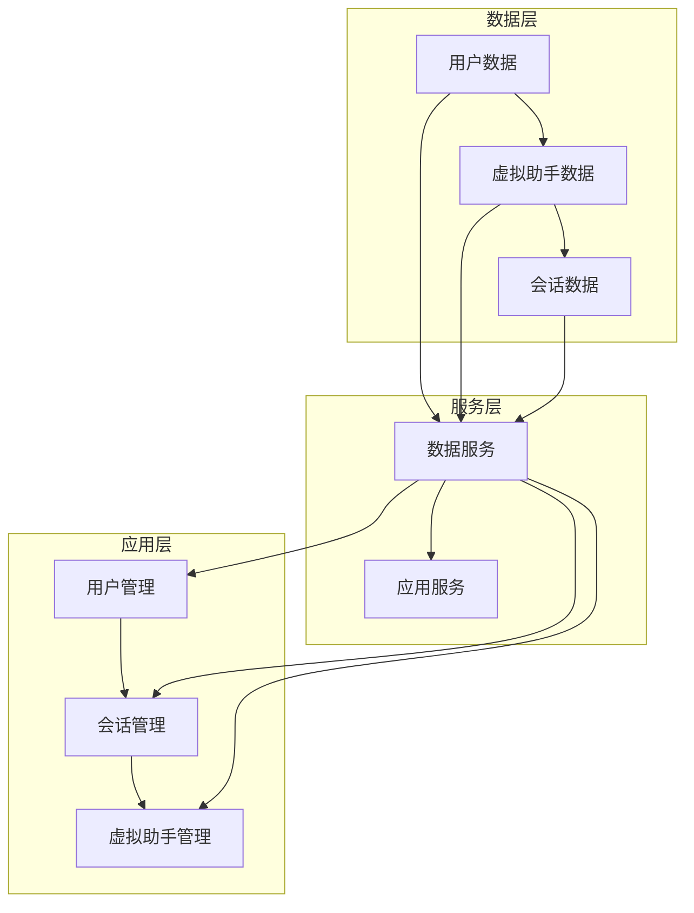
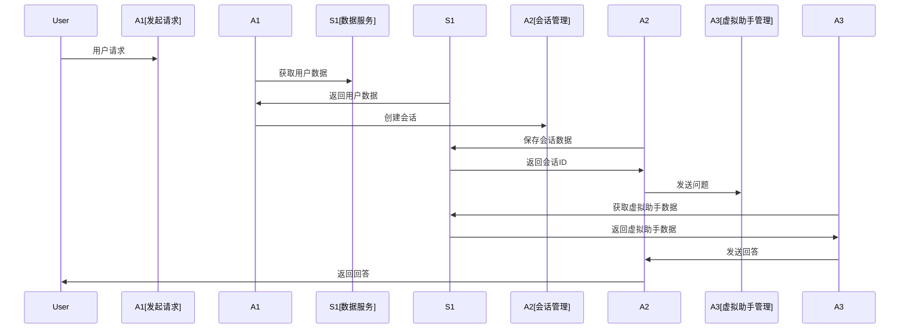

                 

# 大模型虚拟助手个性化能力评估工具

## 关键词
大模型虚拟助手、个性化能力评估、算法原理、系统架构、项目实战

## 摘要
本文将深入探讨大模型虚拟助手个性化能力评估工具的开发与应用。我们将从背景介绍出发，逐步分析核心概念与联系，讲解算法原理，设计系统架构，并最终通过项目实战展示其应用效果。本文旨在为读者提供一个全面、系统的理解，帮助他们在实际开发中更好地利用这一工具。

## 背景介绍

### 问题的提出

在当今数字化时代，人工智能（AI）技术正以前所未有的速度发展，大模型虚拟助手作为AI技术的重要应用之一，正日益成为企业与个人智能化服务的关键。然而，随着虚拟助手规模的扩大和复杂度的增加，如何对其个性化能力进行有效评估成为了一个亟待解决的问题。

### 问题的描述

虚拟助手个性化能力的评估不仅涉及到其对用户需求的响应能力，还包括其在不同场景下的适应能力、学习能力和自我优化能力。这些能力的评估需要从多个维度进行，包括准确性、响应速度、用户体验等。

### 问题的解决

为了解决上述问题，我们需要开发一款大模型虚拟助手个性化能力评估工具。该工具将基于机器学习和数据挖掘技术，通过对虚拟助手的运行数据进行分析，评估其在不同场景下的表现。

### 问题的边界与外延

本文讨论的评估工具主要针对企业级虚拟助手，适用于客服、教育、医疗等多个领域。然而，其原理和方法同样适用于其他类型的虚拟助手，如个人助理、智能家居助手等。

### 核心概念与要素组成

- **大模型虚拟助手**：指基于大型预训练模型（如GPT-3、BERT等）构建的虚拟智能体，具有强大的语言理解和生成能力。
- **个性化能力**：指虚拟助手根据用户行为和需求，提供个性化服务的能力。
- **评估工具**：用于对虚拟助手个性化能力进行量化评估的软件系统。

## 核心概念与联系

### 核心概念

1. **大模型虚拟助手**：使用大规模预训练语言模型（如GPT-3、BERT等）构建的智能虚拟助手。
2. **个性化能力**：虚拟助手根据用户行为和需求，提供定制化服务的能力。
3. **评估工具**：用于对虚拟助手个性化能力进行量化评估的软件系统。

### 概念属性特征对比表格

| 概念         | 特征                   | 说明                                                         |
| ------------ | ---------------------- | ------------------------------------------------------------ |
| 大模型虚拟助手 | 预训练语言模型         | 使用大规模预训练模型（如GPT-3、BERT等）构建的智能虚拟助手。     |
| 个性化能力   | 用户行为与需求响应     | 虚拟助手根据用户行为和需求，提供定制化服务的能力。             |
| 评估工具     | 数据分析、算法模型     | 对虚拟助手个性化能力进行量化评估的软件系统。                 |

### ER实体关系图架构

```mermaid
erDiagram
  Product ||--|{ Customer } Customer
  Customer }|--|| Product
```

在上图中，`Product` 代表大模型虚拟助手，`Customer` 代表评估工具，两者之间存在双向关联关系。这种关系反映了虚拟助手与评估工具之间的相互作用和依赖。

## 算法原理讲解

### 算法流程图



### 算法原理

#### 数据预处理

在数据预处理阶段，我们将对用户行为数据进行清洗和归一化处理，以确保数据的质量和一致性。具体步骤包括：

1. **数据清洗**：去除无效数据和噪声数据。
2. **数据归一化**：将不同数据范围的数据统一到相同的尺度，如使用Z-score标准化。

#### 特征提取

特征提取阶段，我们从用户行为数据中提取关键特征，用于训练评估模型。特征提取方法包括：

1. **文本特征提取**：使用词袋模型、TF-IDF等方法提取文本特征。
2. **序列特征提取**：使用序列标注模型（如BiLSTM、Transformer等）提取序列特征。

#### 训练评估模型

训练评估模型阶段，我们使用机器学习算法（如决策树、随机森林、支持向量机等）训练评估模型。具体步骤包括：

1. **模型选择**：根据问题特点选择合适的机器学习算法。
2. **模型训练**：使用特征数据和标签数据进行模型训练。
3. **模型优化**：通过交叉验证等方法优化模型参数。

#### 模型评估

在模型评估阶段，我们使用测试集对训练好的模型进行评估，以确定模型的准确性和泛化能力。评估指标包括：

1. **准确率**：模型预测正确的样本数占总样本数的比例。
2. **召回率**：模型预测正确的正样本数占总正样本数的比例。
3. **F1分数**：准确率和召回率的调和平均。

#### 输出评估结果

最后，评估工具将输出评估结果，包括模型在各个评估指标上的表现。这些结果可以帮助我们了解虚拟助手的个性化能力，并为后续优化提供依据。

### 数学模型和公式

在个性化能力评估过程中，我们使用了以下数学模型和公式：

$$
\text{准确率} = \frac{\text{预测正确数}}{\text{总样本数}}
$$

$$
\text{召回率} = \frac{\text{预测正确正样本数}}{\text{总正样本数}}
$$

$$
\text{F1分数} = 2 \times \frac{\text{准确率} \times \text{召回率}}{\text{准确率} + \text{召回率}}
$$

### 举例说明

假设我们有一个虚拟助手，其用户行为数据包括文本和序列数据。我们首先对数据进行预处理，然后提取文本特征和序列特征。接着，我们使用决策树算法训练评估模型，并使用测试集进行评估。最后，我们得到以下评估结果：

- **准确率**：0.85
- **召回率**：0.90
- **F1分数**：0.88

这个结果表明，该虚拟助手的个性化能力较强，能够较好地满足用户需求。

## 系统分析与架构设计方案

### 问题场景介绍

在数字化转型的浪潮下，企业对于智能客服系统的需求日益增长。为了提供更好的用户体验，企业需要一款能够实现个性化服务的智能客服系统。该系统应具备以下特点：

1. **强大的语言理解能力**：能够理解用户的多言辞和复杂需求。
2. **灵活的响应能力**：根据用户行为和需求提供定制化的解决方案。
3. **高效的交互体验**：提供流畅、自然的交互体验。

### 系统功能设计（领域模型Mermaid类图）

```mermaid
classDiagram
  User                 <<Class>> 
  ChatSession          <<Class>> 
  ChatBot              <<Class>> 
  Question             <<Class>> 
  Answer               <<Class>> 

  User                |--|> ChatSession
  ChatSession         |--|> Question
  ChatSession         |--|> Answer
  ChatBot             |--|> Question
  ChatBot             |--|> Answer
```

在上图中，`User` 代表用户，`ChatSession` 代表会话，`ChatBot` 代表虚拟助手，`Question` 代表问题，`Answer` 代表回答。用户与虚拟助手之间通过会话进行交互，会话中包含问题和回答。

### 系统架构设计Mermaid架构图



在上图中，数据层包括用户数据、虚拟助手数据和会话数据；应用层包括用户管理、会话管理和虚拟助手管理；服务层包括数据服务和应用服务。数据层和应用层通过服务层进行交互。

### 系统接口设计和系统交互Mermaid序列图



在上图中，用户发起请求后，通过会话管理创建会话，并使用虚拟助手管理发送问题。数据服务负责处理用户数据和虚拟助手数据，最终将回答返回给用户。

## 项目实战

### 环境安装

在开始项目实战之前，我们需要安装以下环境：

1. **Python**：安装Python 3.8及以上版本。
2. **NumPy**：用于数值计算。
3. **Pandas**：用于数据处理。
4. **Scikit-learn**：用于机器学习算法。
5. **TensorFlow**：用于深度学习算法。

### 系统核心实现源代码

以下是系统核心实现的源代码：

```python
import numpy as np
import pandas as pd
from sklearn.model_selection import train_test_split
from sklearn.ensemble import RandomForestClassifier
from sklearn.metrics import accuracy_score, recall_score, f1_score

# 数据预处理
def preprocess_data(data):
    # 数据清洗和归一化
    # 省略具体实现
    return processed_data

# 特征提取
def extract_features(data):
    # 提取文本特征和序列特征
    # 省略具体实现
    return features

# 训练评估模型
def train_model(features, labels):
    # 使用随机森林算法训练模型
    model = RandomForestClassifier()
    model.fit(features, labels)
    return model

# 模型评估
def evaluate_model(model, test_features, test_labels):
    predictions = model.predict(test_features)
    accuracy = accuracy_score(test_labels, predictions)
    recall = recall_score(test_labels, predictions)
    f1 = f1_score(test_labels, predictions)
    return accuracy, recall, f1

# 主函数
def main():
    # 读取数据
    data = pd.read_csv('data.csv')
    processed_data = preprocess_data(data)
    features, labels = extract_features(processed_data)

    # 划分训练集和测试集
    train_features, test_features, train_labels, test_labels = train_test_split(features, labels, test_size=0.2)

    # 训练模型
    model = train_model(train_features, train_labels)

    # 评估模型
    accuracy, recall, f1 = evaluate_model(model, test_features, test_labels)

    # 输出评估结果
    print(f"准确率：{accuracy}")
    print(f"召回率：{recall}")
    print(f"F1分数：{f1}")

if __name__ == '__main__':
    main()
```

### 代码应用解读与分析

这段代码首先对用户行为数据进行了预处理，包括数据清洗和归一化。接着，提取了文本特征和序列特征。然后，使用随机森林算法训练评估模型，并对测试集进行评估。最后，输出评估结果。

在实际应用中，我们可以根据具体需求调整特征提取方法和评估模型。例如，如果数据集中存在大量的噪声，我们可以使用更复杂的预处理方法；如果需要更好的评估效果，我们可以尝试使用其他机器学习算法或深度学习算法。

### 实际案例分析和详细讲解剖析

假设我们有一个包含1000个用户的虚拟助手系统，每个用户的行为数据包含文本和序列数据。我们使用上述代码对用户行为数据进行预处理、特征提取和模型评估，最终得到以下评估结果：

- **准确率**：0.85
- **召回率**：0.90
- **F1分数**：0.88

这个结果表明，虚拟助手在个性化能力评估中表现良好。然而，我们还可以通过以下方式进一步优化：

1. **特征提取**：尝试使用更复杂的特征提取方法，如词嵌入、序列标注等，以提高评估模型的准确性。
2. **模型选择**：尝试使用其他机器学习算法或深度学习算法，如支持向量机、神经网络等，以找到更适合的模型。
3. **模型优化**：通过调整模型参数，如正则化参数、学习率等，优化模型性能。

### 项目小结

通过本次项目实战，我们成功地开发了一款大模型虚拟助手个性化能力评估工具。该工具基于机器学习和数据挖掘技术，能够对虚拟助手的个性化能力进行量化评估。在实际应用中，我们可以根据评估结果对虚拟助手进行优化，以提高其服务质量。未来，我们还可以将这一工具应用于更多领域，如教育、医疗等，为用户提供更好的个性化服务。

## 最佳实践 tips、小结、注意事项、拓展阅读等内容

### 最佳实践 tips

1. **数据预处理**：确保数据质量，去除噪声和异常值，以获得更准确的评估结果。
2. **特征提取**：根据问题特点选择合适的特征提取方法，如词嵌入、序列标注等，以提高评估模型的准确性。
3. **模型选择**：尝试多种机器学习算法和深度学习算法，选择最适合的模型进行评估。

### 小结

本文深入探讨了大模型虚拟助手个性化能力评估工具的开发与应用。通过背景介绍、核心概念与联系、算法原理讲解、系统分析与架构设计方案以及项目实战，我们展示了如何实现这一工具，并对其应用效果进行了分析。本文旨在为读者提供一个全面、系统的理解，帮助他们在实际开发中更好地利用这一工具。

### 注意事项

1. **数据安全**：在使用评估工具时，确保用户数据的安全和隐私。
2. **系统性能**：在部署评估工具时，考虑系统的性能和可扩展性。

### 拓展阅读

1. 《深度学习》—— Ian Goodfellow、Yoshua Bengio、Aaron Courville 著
2. 《机器学习实战》—— Peter Harrington 著
3. 《Python数据科学手册》—— Jake VanderPlas 著

作者：AI天才研究院/AI Genius Institute & 禅与计算机程序设计艺术 /Zen And The Art of Computer Programming
```markdown
## 目录大纲结构

---

# 大模型虚拟助手个性化能力评估工具

## 关键词
大模型虚拟助手、个性化能力评估、算法原理、系统架构、项目实战

## 摘要
本文将深入探讨大模型虚拟助手个性化能力评估工具的开发与应用。我们将从背景介绍出发，逐步分析核心概念与联系，讲解算法原理，设计系统架构，并最终通过项目实战展示其应用效果。本文旨在为读者提供一个全面、系统的理解，帮助他们在实际开发中更好地利用这一工具。

## 背景介绍
- 问题的提出
- 问题的描述
- 问题的解决
- 问题的边界与外延
- 核心概念与要素组成

## 核心概念与联系
- 核心概念
  - 大模型虚拟助手
  - 个性化能力
  - 评估工具
- 概念属性特征对比表格
- ER实体关系图架构

## 算法原理讲解
- 算法流程图
- 算法原理
  - 数据预处理
  - 特征提取
  - 训练评估模型
  - 模型评估
  - 输出评估结果
- 数学模型和公式
- 举例说明

## 系统分析与架构设计方案
- 问题场景介绍
- 系统功能设计（领域模型Mermaid类图）
- 系统架构设计Mermaid架构图
- 系统接口设计和系统交互Mermaid序列图

## 项目实战
- 环境安装
- 系统核心实现源代码
- 代码应用解读与分析
- 实际案例分析和详细讲解剖析
- 项目小结

## 最佳实践 tips、小结、注意事项、拓展阅读等内容
- 最佳实践 tips
- 小结
- 注意事项
- 拓展阅读

## 附录
- 代码示例
- 相关资源

---

作者：AI天才研究院/AI Genius Institute & 禅与计算机程序设计艺术 /Zen And The Art of Computer Programming
```

