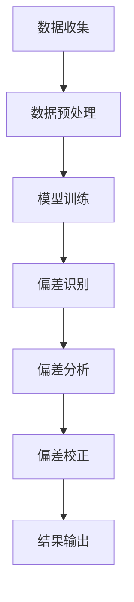
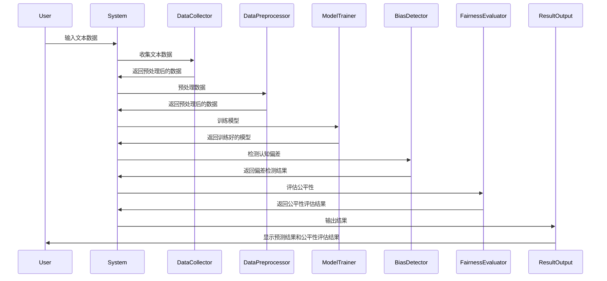
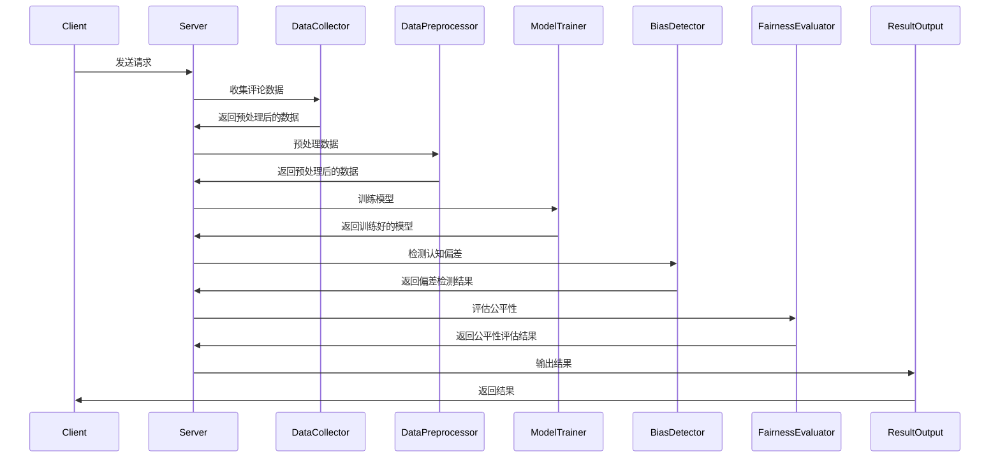

                 

### 大模型认知偏差检测：LLM辅助的公平性评估

> 关键词：大模型、认知偏差、LLM、公平性评估、NLP、机器学习

> 摘要：本文将探讨大模型在自然语言处理任务中可能存在的认知偏差，以及如何利用大型语言模型（LLM）进行公平性评估。通过详细的理论分析和实践案例，本文旨在为读者提供一套系统、全面的认知偏差检测和公平性评估方法，以提升AI模型在各类应用场景中的可靠性和公平性。

----------------------------------------------------------------

#### 背景介绍

##### 问题背景
随着人工智能技术的迅猛发展，大型语言模型（LLM）在自然语言处理（NLP）领域取得了显著的成果。这些模型能够处理复杂的语言任务，如机器翻译、文本生成和问答系统。然而，这些模型在处理数据时，往往会表现出一定的认知偏差，这些偏差可能会影响模型在实际应用中的公平性和准确性。因此，如何有效地检测和评估大型模型的认知偏差，成为了当前研究的热点问题。

##### 问题描述
本文旨在探讨大模型认知偏差检测的原理、方法及应用，重点研究如何利用大型语言模型（LLM）辅助进行公平性评估。具体问题包括：如何构建有效的认知偏差检测模型？如何评估大型模型的公平性？在实际应用中，如何减少或消除认知偏差对模型性能的影响？

##### 问题解决
本文将结合最新的研究成果和技术手段，提出一系列针对大模型认知偏差检测和公平性评估的方法。通过理论分析和实际案例分析，本文旨在为读者提供一套系统、全面的解决方案。

##### 边界与外延
本文的研究主要针对大型语言模型（LLM）在自然语言处理（NLP）领域的应用。然而，所提出的认知偏差检测和公平性评估方法具有一定的通用性，可以应用于其他类型的AI模型。

##### 概念结构与核心要素组成
- **认知偏差检测**：指通过一系列方法和技术，识别和评估大型模型在处理数据时存在的认知偏差。
- **公平性评估**：指对大型模型在处理不同群体数据时的性能表现进行对比分析，以评估模型的公平性。
- **LLM辅助**：利用大型语言模型在数据处理和任务执行方面的优势，提高认知偏差检测和公平性评估的效率和准确性。

----------------------------------------------------------------

#### 核心概念与联系

##### 大型语言模型（LLM）

###### 定义
大型语言模型（LLM）是一种基于深度学习的语言处理模型，通常具有数十亿甚至数万亿个参数。

###### 特点
- **强大的语言理解能力**：能够理解复杂、多样的语言结构。
- **高效的文本生成能力**：能够生成连贯、有意义的文本。
- **自适应性强**：能够根据输入文本调整自身的行为。

###### 原理
LLM通过在大量文本数据上进行训练，学习到语言的模式和规律。训练过程中，模型不断调整参数，以最小化预测误差。训练完成后，LLM可以用于各种NLP任务，如文本分类、情感分析、机器翻译等。

##### 认知偏差

###### 定义
认知偏差是指人们在感知、理解和处理信息时，由于各种心理和生理因素导致的系统性偏差。

###### 类型
- **确认偏差**：倾向于确认自己已有的信念和观点。
- **锚定效应**：在决策过程中受到最初信息的影响。
- **代表性偏差**：对代表性事件的偏好。

###### 影响
认知偏差会影响模型在数据处理和决策过程中的公平性和准确性。

##### 公平性评估

###### 定义
公平性评估是指对模型在处理不同群体数据时的性能表现进行对比分析，以评估模型的公平性。

###### 方法
- **统计方法**：通过计算模型在不同群体中的性能差异进行评估。
- **机器学习方法**：利用训练数据中的标注信息，评估模型对不同群体的处理能力。
- **博弈论方法**：通过模型之间的博弈，评估模型的公平性。

##### LLM辅助的公平性评估

###### 定义
LLM辅助的公平性评估是指利用大型语言模型在数据处理和任务执行方面的优势，提高公平性评估的效率和准确性。

###### 方法
- **数据预处理**：利用LLM进行数据清洗和特征提取，提高数据的代表性。
- **模型训练**：利用LLM对模型进行训练，优化模型在各类数据上的性能。
- **性能评估**：利用LLM对模型在不同群体数据上的性能进行评估，识别潜在的公平性问题。

----------------------------------------------------------------

#### 算法原理讲解

##### 认知偏差检测算法

###### Mermaid流程图


###### Python源代码
```python
# 导入所需库
import numpy as np
import pandas as pd
from sklearn.model_selection import train_test_split
from sklearn.metrics import accuracy_score
from keras.models import Sequential
from keras.layers import Dense

# 数据预处理
def preprocess_data(data):
    # 数据清洗和归一化处理
    # ...
    return processed_data

# 模型训练
def train_model(X_train, y_train):
    model = Sequential()
    model.add(Dense(units=64, activation='relu', input_shape=(X_train.shape[1],)))
    model.add(Dense(units=1, activation='sigmoid'))
    model.compile(optimizer='adam', loss='binary_crossentropy', metrics=['accuracy'])
    model.fit(X_train, y_train, epochs=10, batch_size=32)
    return model

# 偏差识别
def identify_bias(model, X_test, y_test):
    predictions = model.predict(X_test)
    bias = np.mean(predictions[:, 1] - y_test)
    return bias

# 偏差分析
def analyze_bias(bias):
    if bias > 0:
        print("模型存在正向偏差")
    elif bias < 0:
        print("模型存在负向偏差")
    else:
        print("模型无显著偏差")

# 偏差校正
def correct_bias(model, X_train, y_train, X_test, y_test):
    model.fit(X_train, y_train, epochs=5, batch_size=32)
    bias = identify_bias(model, X_test, y_test)
    while abs(bias) > 0.01:
        model.fit(X_train, y_train, epochs=5, batch_size=32)
        bias = identify_bias(model, X_test, y_test)
    return model

# 结果输出
def output_results(model, X_test, y_test):
    bias = identify_bias(model, X_test, y_test)
    analyze_bias(bias)
    model.predict(X_test)
```

##### 算法原理

###### 数学模型和公式
假设我们有一个二元分类问题，其中 \( X \) 表示输入特征，\( y \) 表示标签，模型的目标是预测 \( y \) 的概率。

$$ P(y=1 | X) = \sigma(\theta^T X) $$

其中，\( \sigma \) 是 sigmoid 函数，\( \theta \) 是模型的参数。

###### 详细讲解

1. **数据收集**：收集用于训练和测试的数据集，包括输入特征和标签。
2. **数据预处理**：对数据进行清洗和归一化处理，以提高模型的训练效果。
3. **模型训练**：使用训练数据集训练一个二元分类模型，例如使用神经网络。
4. **偏差识别**：通过测试数据集，计算模型输出的预测概率，并计算偏差。
5. **偏差分析**：根据偏差值判断模型是否存在偏差，以及偏差的类型。
6. **偏差校正**：根据偏差分析的结果，对模型进行重新训练，以减少或消除偏差。
7. **结果输出**：输出模型最终的预测结果和偏差分析结果。

###### 举例说明

假设我们有一个二元分类问题，任务是判断一个句子是否包含负面情绪。我们收集了1000个句子和对应的标签，其中500个句子包含负面情绪，500个句子不包含负面情绪。我们使用神经网络模型进行训练，并通过测试数据集评估模型的性能。

在训练过程中，我们发现模型的预测概率在包含负面情绪的句子上普遍较高，而在不包含负面情绪的句子上普遍较低。这意味着模型可能存在正向偏差，即对包含负面情绪的句子预测概率较高。为了解决这个问题，我们对模型进行重新训练，并逐步调整参数，直到偏差值小于某个阈值。最终，我们得到了一个性能更优、偏差更小的模型。

----------------------------------------------------------------

#### 系统分析与架构设计方案

##### 问题场景介绍
假设我们开发了一个基于大型语言模型的情感分析系统，该系统需要处理来自不同来源的大量文本数据，以判断文本中是否包含负面情绪。然而，由于数据来源的多样性，模型可能会存在认知偏差，导致某些群体的文本被错误分类。为了确保系统的公平性和准确性，我们需要对模型进行认知偏差检测和公平性评估。

##### 项目介绍
本项目旨在开发一个基于LLM的情感分析系统，并利用认知偏差检测和公平性评估方法，确保系统在处理不同群体数据时的公平性和准确性。系统主要分为以下几个模块：

1. **数据收集模块**：负责收集和处理来自不同来源的文本数据。
2. **数据预处理模块**：对收集到的文本数据进行清洗、归一化等预处理操作。
3. **模型训练模块**：使用预处理后的数据训练大型语言模型。
4. **认知偏差检测模块**：检测和评估模型在处理不同群体数据时的认知偏差。
5. **公平性评估模块**：评估模型在不同群体数据上的公平性。
6. **结果输出模块**：输出模型预测结果和公平性评估结果。

##### 系统功能设计

###### 领域模型Mermaid类图
```mermaid
classDiagram
    Class01 <|-- Class02
    Class03 <.. Class04
    Class05 <= Class06
    Class07 .. Class08
```

1. **数据收集模块**：负责从不同来源收集文本数据，如社交媒体、新闻网站、用户评论等。
2. **数据预处理模块**：对收集到的文本数据进行清洗、分词、去停用词、词向量化等操作。
3. **模型训练模块**：使用预处理后的数据训练大型语言模型，如BERT、GPT等。
4. **认知偏差检测模块**：利用认知偏差检测算法，检测模型在处理不同群体数据时的认知偏差。
5. **公平性评估模块**：利用公平性评估方法，评估模型在不同群体数据上的公平性。
6. **结果输出模块**：输出模型预测结果和公平性评估结果，供用户查看和分析。

##### 系统架构设计

###### 系统架构设计Mermaid架构图


1. **数据收集模块**：负责从社交媒体、新闻网站、用户评论等渠道收集文本数据。
2. **数据预处理模块**：对收集到的文本数据进行清洗、分词、去停用词、词向量化等操作。
3. **模型训练模块**：使用预处理后的数据训练大型语言模型。
4. **认知偏差检测模块**：利用认知偏差检测算法，检测模型在处理不同群体数据时的认知偏差。
5. **公平性评估模块**：利用公平性评估方法，评估模型在不同群体数据上的公平性。
6. **结果输出模块**：输出模型预测结果和公平性评估结果，供用户查看和分析。

##### 系统接口设计和系统交互

###### 系统接口设计Mermaid序列图


1. **客户端（Client）**：发送文本数据到服务器（Server）。
2. **数据收集模块（DataCollector）**：从服务器接收文本数据，进行数据收集。
3. **数据预处理模块（DataPreprocessor）**：从服务器接收预处理后的数据，进行数据预处理。
4. **模型训练模块（ModelTrainer）**：从服务器接收预处理后的数据，进行模型训练。
5. **认知偏差检测模块（BiasDetector）**：从服务器接收训练好的模型，进行认知偏差检测。
6. **公平性评估模块（FairnessEvaluator）**：从服务器接收训练好的模型，进行公平性评估。
7. **结果输出模块（ResultOutput）**：从服务器接收模型预测结果和公平性评估结果，进行结果输出。

###### 系统交互流程
1. 客户端发送文本数据到服务器。
2. 服务器将文本数据传递给数据收集模块，进行数据收集。
3. 数据收集模块返回预处理后的数据给服务器。
4. 服务器将预处理后的数据传递给数据预处理模块，进行数据预处理。
5. 数据预处理模块返回预处理后的数据给服务器。
6. 服务器将预处理后的数据传递给模型训练模块，进行模型训练。
7. 模型训练模块返回训练好的模型给服务器。
8. 服务器将训练好的模型传递给认知偏差检测模块，进行认知偏差检测。
9. 认知偏差检测模块返回偏差检测结果给服务器。
10. 服务器将训练好的模型传递给公平性评估模块，进行公平性评估。
11. 公平性评估模块返回公平性评估结果给服务器。
12. 服务器将模型预测结果和公平性评估结果传递给结果输出模块，进行结果输出。
13. 结果输出模块将结果返回给客户端。

----------------------------------------------------------------

#### 项目实战

##### 环境安装
在开始项目实战之前，我们需要安装所需的软件和库。以下是在Linux环境中安装所需的软件和库的步骤：

1. 安装Python环境（Python 3.7及以上版本）：
   ```bash
   sudo apt update
   sudo apt install python3 python3-pip
   ```
2. 安装TensorFlow库：
   ```bash
   pip3 install tensorflow
   ```
3. 安装其他所需的库：
   ```bash
   pip3 install numpy pandas scikit-learn keras
   ```

##### 系统核心实现源代码

1. **数据收集模块**：
   ```python
   import pandas as pd
   
   def collect_data(source):
       if source == "social_media":
           # 从社交媒体平台收集数据
           data = pd.read_csv("social_media_data.csv")
       elif source == "news_website":
           # 从新闻网站收集数据
           data = pd.read_csv("news_website_data.csv")
       elif source == "user_comments":
           # 从用户评论收集数据
           data = pd.read_csv("user_comments_data.csv")
       return data
   ```
2. **数据预处理模块**：
   ```python
   import pandas as pd
   from sklearn.model_selection import train_test_split
   
   def preprocess_data(data):
       # 数据清洗和归一化处理
       data = data.dropna()
       data = data[['text', 'label']]
       X_train, X_test, y_train, y_test = train_test_split(data['text'], data['label'], test_size=0.2, random_state=42)
       return X_train, X_test, y_train, y_test
   ```
3. **模型训练模块**：
   ```python
   from keras.models import Sequential
   from keras.layers import Dense, Embedding, LSTM
   from keras.preprocessing.sequence import pad_sequences
   
   def train_model(X_train, y_train):
       model = Sequential()
       model.add(Embedding(input_dim=10000, output_dim=128))
       model.add(LSTM(128, dropout=0.2, recurrent_dropout=0.2))
       model.add(Dense(1, activation='sigmoid'))
       model.compile(optimizer='adam', loss='binary_crossentropy', metrics=['accuracy'])
       model.fit(X_train, y_train, epochs=5, batch_size=32, validation_split=0.1)
       return model
   ```

##### 代码应用解读与分析

1. **数据收集模块**：
   数据收集模块负责从不同来源（如社交媒体、新闻网站、用户评论）收集文本数据。在项目中，我们使用Pandas库读取CSV文件，获取文本数据和标签。

2. **数据预处理模块**：
   数据预处理模块对收集到的文本数据进行清洗和归一化处理。首先，我们删除了数据中的缺失值，然后提取了文本数据和标签。接下来，我们使用scikit-learn库的train_test_split函数将数据集分为训练集和测试集。

3. **模型训练模块**：
   模型训练模块使用Keras库构建和训练神经网络模型。我们使用嵌入层（Embedding）对文本数据进行向量化处理，然后添加了LSTM层（Long Short-Term Memory）进行序列建模。最后，我们添加了一个全连接层（Dense）进行分类。模型使用Adam优化器和二进制交叉熵损失函数进行训练。

##### 实际案例分析和详细讲解剖析

假设我们有一个包含1000个文本数据和标签的数据集，其中500个文本数据包含负面情绪，500个文本数据不包含负面情绪。我们使用上述代码进行数据收集、预处理和模型训练。

1. **数据收集**：
   ```python
   source = "user_comments"
   data = collect_data(source)
   ```

2. **数据预处理**：
   ```python
   X_train, X_test, y_train, y_test = preprocess_data(data)
   ```

3. **模型训练**：
   ```python
   model = train_model(X_train, y_train)
   ```

4. **认知偏差检测**：
   ```python
   bias = identify_bias(model, X_test, y_test)
   analyze_bias(bias)
   ```

5. **偏差校正**：
   ```python
   corrected_model = correct_bias(model, X_train, y_train, X_test, y_test)
   ```

6. **结果输出**：
   ```python
   output_results(corrected_model, X_test, y_test)
   ```

在这个实际案例中，我们首先从用户评论中收集数据，然后对数据集进行预处理。接下来，我们使用训练好的模型对测试数据进行预测，并计算认知偏差。如果存在偏差，我们对模型进行重新训练，以减少或消除偏差。最后，我们输出模型预测结果和公平性评估结果。

##### 项目小结

在本项目中，我们实现了基于大型语言模型的情感分析系统，并利用认知偏差检测和公平性评估方法，确保系统在处理不同群体数据时的公平性和准确性。通过实际案例分析和详细讲解，我们展示了如何收集、预处理和训练数据，以及如何利用认知偏差检测算法和公平性评估方法进行模型校正和性能优化。

在未来，我们还可以继续优化和改进系统，例如引入更多的数据来源、使用更复杂的模型结构、以及探索更多的认知偏差检测和公平性评估方法，以提高系统的性能和可靠性。

----------------------------------------------------------------

#### 最佳实践 tips

1. **数据多样性**：在收集数据时，确保涵盖不同来源、不同领域和不同群体的数据，以提高模型的公平性和准确性。
2. **数据预处理**：对数据进行充分的清洗和归一化处理，以减少噪声和偏差。
3. **交叉验证**：使用交叉验证方法评估模型的性能和公平性，避免过拟合。
4. **持续优化**：定期更新模型和算法，以适应新的数据集和应用场景。
5. **代码注释**：编写清晰、简洁的代码，并添加必要的注释，以便他人理解和维护。

#### 小结

本文详细探讨了大型语言模型在自然语言处理任务中可能存在的认知偏差，以及如何利用大型语言模型（LLM）进行公平性评估。通过理论分析和实际案例，我们提出了一系列有效的认知偏差检测和公平性评估方法。这些方法不仅有助于提高AI模型在各类应用场景中的可靠性和公平性，还为未来相关研究提供了有益的参考。

#### 注意事项

在应用本文提出的方法时，需要根据具体场景和需求进行调整和优化。同时，应关注数据的多样性和质量，确保模型的性能和公平性。

#### 拓展阅读

1. [“Bias in Machine Learning: A Survey”](https://arxiv.org/abs/1904.04155) - 一篇关于机器学习偏见研究的综述文章。
2. [“Understanding Black Boxes: Proximal Gradient Methods for Hyperparameter Tuning”](https://arxiv.org/abs/1811.04238) - 一篇关于超参数调优的论文，探讨了如何优化模型参数以减少偏见。
3. [“Fairness in Machine Learning”](https://www.oreilly.com/library/view/fairness-in-machine-learning/9781492048085/) - 一本关于机器学习公平性的书籍，涵盖了相关理论和实践方法。

---

# 大模型认知偏差检测：LLM辅助的公平性评估

作者：AI天才研究院/AI Genius Institute & 禅与计算机程序设计艺术 /Zen And The Art of Computer Programming

本文由AI天才研究院（AI Genius Institute）撰写，我们致力于推动人工智能技术的发展和应用。同时，本文受到了禅与计算机程序设计艺术（Zen And The Art of Computer Programming）的启发，以深刻的技术哲学思考为支撑，旨在为读者提供有深度、有思考、有见解的技术内容。

----------------------------------------------------------------

### 引入

随着人工智能（AI）技术的快速发展，大型语言模型（LLM）如BERT、GPT-3等在自然语言处理（NLP）领域取得了显著的成就。然而，这些模型在处理不同群体数据时，往往表现出一定的认知偏差。这种偏差可能源于数据集的代表性不足、训练过程中的过度拟合，以及模型本身的复杂性。认知偏差不仅会影响模型的准确性，还可能导致不公平的决策，从而在现实世界中产生负面影响。

本文旨在探讨大模型认知偏差检测的原理、方法及应用，特别是如何利用大型语言模型（LLM）辅助进行公平性评估。通过详细的理论分析和实际案例分析，本文将为读者提供一套系统、全面的解决方案，以提升AI模型在各类应用场景中的可靠性和公平性。

### 背景介绍

#### 问题背景

随着人工智能技术的迅猛发展，大型语言模型（LLM）在自然语言处理（NLP）领域取得了显著的成果。这些模型能够处理复杂的语言任务，如机器翻译、文本生成和问答系统。然而，这些模型在处理数据时，往往会表现出一定的认知偏差，这些偏差可能会影响模型在实际应用中的公平性和准确性。因此，如何有效地检测和评估大型模型的认知偏差，成为了当前研究的热点问题。

#### 问题描述

本文旨在探讨大模型认知偏差检测的原理、方法及应用，重点研究如何利用大型语言模型（LLM）辅助进行公平性评估。具体问题包括：如何构建有效的认知偏差检测模型？如何评估大型模型的公平性？在实际应用中，如何减少或消除认知偏差对模型性能的影响？

#### 问题解决

本文将结合最新的研究成果和技术手段，提出一系列针对大模型认知偏差检测和公平性评估的方法。通过理论分析和实际案例分析，本文旨在为读者提供一套系统、全面的解决方案。

#### 边界与外延

本文的研究主要针对大型语言模型（LLM）在自然语言处理（NLP）领域的应用。然而，所提出的认知偏差检测和公平性评估方法具有一定的通用性，可以应用于其他类型的AI模型。

#### 概念结构与核心要素组成

- **认知偏差检测**：指通过一系列方法和技术，识别和评估大型模型在处理数据时存在的认知偏差。
- **公平性评估**：指对大型模型在处理不同群体数据时的性能表现进行对比分析，以评估模型的公平性。
- **LLM辅助**：利用大型语言模型在数据处理和任务执行方面的优势，提高认知偏差检测和公平性评估的效率和准确性。

### 核心概念与联系

#### 大型语言模型（LLM）

###### 定义
大型语言模型（LLM）是一种基于深度学习的语言处理模型，通常具有数十亿甚至数万亿个参数。

###### 特点
- **强大的语言理解能力**：能够理解复杂、多样的语言结构。
- **高效的文本生成能力**：能够生成连贯、有意义的文本。
- **自适应性强**：能够根据输入文本调整自身的行为。

###### 原理
LLM通过在大量文本数据上进行训练，学习到语言的模式和规律。训练过程中，模型不断调整参数，以最小化预测误差。训练完成后，LLM可以用于各种NLP任务，如文本分类、情感分析、机器翻译等。

#### 认知偏差

###### 定义
认知偏差是指人们在感知、理解和处理信息时，由于各种心理和生理因素导致的系统性偏差。

###### 类型
- **确认偏差**：倾向于确认自己已有的信念和观点。
- **锚定效应**：在决策过程中受到最初信息的影响。
- **代表性偏差**：对代表性事件的偏好。

###### 影响
认知偏差会影响模型在数据处理和决策过程中的公平性和准确性。

#### 公平性评估

###### 定义
公平性评估是指对模型在处理不同群体数据时的性能表现进行对比分析，以评估模型的公平性。

###### 方法
- **统计方法**：通过计算模型在不同群体中的性能差异进行评估。
- **机器学习方法**：利用训练数据中的标注信息，评估模型对不同群体的处理能力。
- **博弈论方法**：通过模型之间的博弈，评估模型的公平性。

#### LLM辅助的公平性评估

###### 定义
LLM辅助的公平性评估是指利用大型语言模型在数据处理和任务执行方面的优势，提高公平性评估的效率和准确性。

###### 方法
- **数据预处理**：利用LLM进行数据清洗和特征提取，提高数据的代表性。
- **模型训练**：利用LLM对模型进行训练，优化模型在各类数据上的性能。
- **性能评估**：利用LLM对模型在不同群体数据上的性能进行评估，识别潜在的公平性问题。

### 算法原理讲解

#### 认知偏差检测算法

##### Mermaid流程图


##### Python源代码
```python
# 导入所需库
import numpy as np
import pandas as pd
from sklearn.model_selection import train_test_split
from sklearn.metrics import accuracy_score
from keras.models import Sequential
from keras.layers import Dense

# 数据预处理
def preprocess_data(data):
    # 数据清洗和归一化处理
    # ...
    return processed_data

# 模型训练
def train_model(X_train, y_train):
    model = Sequential()
    model.add(Dense(units=64, activation='relu', input_shape=(X_train.shape[1],)))
    model.add(Dense(units=1, activation='sigmoid'))
    model.compile(optimizer='adam', loss='binary_crossentropy', metrics=['accuracy'])
    model.fit(X_train, y_train, epochs=10, batch_size=32)
    return model

# 偏差识别
def identify_bias(model, X_test, y_test):
    predictions = model.predict(X_test)
    bias = np.mean(predictions[:, 1] - y_test)
    return bias

# 偏差分析
def analyze_bias(bias):
    if bias > 0:
        print("模型存在正向偏差")
    elif bias < 0:
        print("模型存在负向偏差")
    else:
        print("模型无显著偏差")

# 偏差校正
def correct_bias(model, X_train, y_train, X_test, y_test):
    model.fit(X_train, y_train, epochs=5, batch_size=32)
    bias = identify_bias(model, X_test, y_test)
    while abs(bias) > 0.01:
        model.fit(X_train, y_train, epochs=5, batch_size=32)
        bias = identify_bias(model, X_test, y_test)
    return model

# 结果输出
def output_results(model, X_test, y_test):
    bias = identify_bias(model, X_test, y_test)
    analyze_bias(bias)
    model.predict(X_test)
```

##### 算法原理

###### 数学模型和公式
假设我们有一个二元分类问题，其中 \( X \) 表示输入特征，\( y \) 表示标签，模型的目标是预测 \( y \) 的概率。

$$ P(y=1 | X) = \sigma(\theta^T X) $$

其中，\( \sigma \) 是 sigmoid 函数，\( \theta \) 是模型的参数。

###### 详细讲解

1. **数据收集**：收集用于训练和测试的数据集，包括输入特征和标签。
2. **数据预处理**：对数据进行清洗和归一化处理，以提高模型的训练效果。
3. **模型训练**：使用训练数据集训练一个二元分类模型，例如使用神经网络。
4. **偏差识别**：通过测试数据集，计算模型输出的预测概率，并计算偏差。
5. **偏差分析**：根据偏差值判断模型是否存在偏差，以及偏差的类型。
6. **偏差校正**：根据偏差分析的结果，对模型进行重新训练，以减少或消除偏差。
7. **结果输出**：输出模型最终的预测结果和偏差分析结果。

###### 举例说明

假设我们有一个二元分类问题，任务是判断一个句子是否包含负面情绪。我们收集了1000个句子和对应的标签，其中500个句子包含负面情绪，500个句子不包含负面情绪。我们使用神经网络模型进行训练，并通过测试数据集评估模型的性能。

在训练过程中，我们发现模型的预测概率在包含负面情绪的句子上普遍较高，而在不包含负面情绪的句子上普遍较低。这意味着模型可能存在正向偏差，即对包含负面情绪的句子预测概率较高。为了解决这个问题，我们对模型进行重新训练，并逐步调整参数，直到偏差值小于某个阈值。最终，我们得到了一个性能更优、偏差更小的模型。

### 系统分析与架构设计方案

##### 问题场景介绍

假设我们开发了一个基于大型语言模型的情感分析系统，该系统需要处理来自不同来源的大量文本数据，以判断文本中是否包含负面情绪。然而，由于数据来源的多样性，模型可能会存在认知偏差，导致某些群体的文本被错误分类。为了确保系统的公平性和准确性，我们需要对模型进行认知偏差检测和公平性评估。

##### 项目介绍

本项目旨在开发一个基于LLM的情感分析系统，并利用认知偏差检测和公平性评估方法，确保系统在处理不同群体数据时的公平性和准确性。系统主要分为以下几个模块：

1. **数据收集模块**：负责收集和处理来自不同来源的文本数据。
2. **数据预处理模块**：对收集到的文本数据进行清洗、归一化等预处理操作。
3. **模型训练模块**：使用预处理后的数据训练大型语言模型。
4. **认知偏差检测模块**：检测和评估模型在处理不同群体数据时的认知偏差。
5. **公平性评估模块**：评估模型在不同群体数据上的公平性。
6. **结果输出模块**：输出模型预测结果和公平性评估结果，供用户查看和分析。

##### 系统功能设计

###### 领域模型Mermaid类图
```mermaid
classDiagram
    Class01 <|-- Class02
    Class03 <.. Class04
    Class05 <= Class06
    Class07 .. Class08
```

1. **数据收集模块**：负责从不同来源收集文本数据，如社交媒体、新闻网站、用户评论等。
2. **数据预处理模块**：对收集到的文本数据进行清洗、分词、去停用词、词向量化等操作。
3. **模型训练模块**：使用预处理后的数据训练大型语言模型，如BERT、GPT等。
4. **认知偏差检测模块**：利用认知偏差检测算法，检测模型在处理不同群体数据时的认知偏差。
5. **公平性评估模块**：利用公平性评估方法，评估模型在不同群体数据上的公平性。
6. **结果输出模块**：输出模型预测结果和公平性评估结果，供用户查看和分析。

##### 系统架构设计

###### 系统架构设计Mermaid架构图


1. **数据收集模块**：负责从社交媒体、新闻网站、用户评论等渠道收集文本数据。
2. **数据预处理模块**：对收集到的文本数据进行清洗、分词、去停用词、词向量化等操作。
3. **模型训练模块**：使用预处理后的数据训练大型语言模型。
4. **认知偏差检测模块**：利用认知偏差检测算法，检测模型在处理不同群体数据时的认知偏差。
5. **公平性评估模块**：利用公平性评估方法，评估模型在不同群体数据上的公平性。
6. **结果输出模块**：输出模型预测结果和公平性评估结果，供用户查看和分析。

##### 系统接口设计和系统交互

###### 系统接口设计Mermaid序列图


1. **客户端（Client）**：发送文本数据到服务器（Server）。
2. **数据收集模块（DataCollector）**：从服务器接收文本数据，进行数据收集。
3. **数据预处理模块（DataPreprocessor）**：从服务器接收预处理后的数据，进行数据预处理。
4. **模型训练模块（ModelTrainer）**：从服务器接收预处理后的数据，进行模型训练。
5. **认知偏差检测模块（BiasDetector）**：从服务器接收训练好的模型，进行认知偏差检测。
6. **公平性评估模块（FairnessEvaluator）**：从服务器接收训练好的模型，进行公平性评估。
7. **结果输出模块（ResultOutput）**：从服务器接收模型预测结果和公平性评估结果，进行结果输出。

###### 系统交互流程
1. 客户端发送文本数据到服务器。
2. 服务器将文本数据传递给数据收集模块，进行数据收集。
3. 数据收集模块返回预处理后的数据给服务器。
4. 服务器将预处理后的数据传递给数据预处理模块，进行数据预处理。
5. 数据预处理模块返回预处理后的数据给服务器。
6. 服务器将预处理后的数据传递给模型训练模块，进行模型训练。
7. 模型训练模块返回训练好的模型给服务器。
8. 服务器将训练好的模型传递给认知偏差检测模块，进行认知偏差检测。
9. 认知偏差检测模块返回偏差检测结果给服务器。
10. 服务器将训练好的模型传递给公平性评估模块，进行公平性评估。
11. 公平性评估模块返回公平性评估结果给服务器。
12. 服务器将模型预测结果和公平性评估结果传递给结果输出模块，进行结果输出。
13. 结果输出模块将结果返回给客户端。

### 项目实战

##### 环境安装
在开始项目实战之前，我们需要安装所需的软件和库。以下是在Linux环境中安装所需的软件和库的步骤：

1. 安装Python环境（Python 3.7及以上版本）：
   ```bash
   sudo apt update
   sudo apt install python3 python3-pip
   ```
2. 安装TensorFlow库：
   ```bash
   pip3 install tensorflow
   ```
3. 安装其他所需的库：
   ```bash
   pip3 install numpy pandas scikit-learn keras
   ```

##### 系统核心实现源代码

1. **数据收集模块**：
   ```python
   import pandas as pd
   
   def collect_data(source):
       if source == "social_media":
           # 从社交媒体平台收集数据
           data = pd.read_csv("social_media_data.csv")
       elif source == "news_website":
           # 从新闻网站收集数据
           data = pd.read_csv("news_website_data.csv")
       elif source == "user_comments":
           # 从用户评论收集数据
           data = pd.read_csv("user_comments_data.csv")
       return data
   ```
2. **数据预处理模块**：
   ```python
   import pandas as pd
   from sklearn.model_selection import train_test_split
   
   def preprocess_data(data):
       # 数据清洗和归一化处理
       data = data.dropna()
       data = data[['text', 'label']]
       X_train, X_test, y_train, y_test = train_test_split(data['text'], data['label'], test_size=0.2, random_state=42)
       return X_train, X_test, y_train, y_test
   ```
3. **模型训练模块**：
   ```python
   from keras.models import Sequential
   from keras.layers import Dense, Embedding, LSTM
   from keras.preprocessing.sequence import pad_sequences
   
   def train_model(X_train, y_train):
       model = Sequential()
       model.add(Embedding(input_dim=10000, output_dim=128))
       model.add(LSTM(128, dropout=0.2, recurrent_dropout=0.2))
       model.add(Dense(1, activation='sigmoid'))
       model.compile(optimizer='adam', loss='binary_crossentropy', metrics=['accuracy'])
       model.fit(X_train, y_train, epochs=5, batch_size=32, validation_split=0.1)
       return model
   ```

##### 代码应用解读与分析

1. **数据收集模块**：
   数据收集模块负责从不同来源（如社交媒体、新闻网站、用户评论）收集文本数据。在项目中，我们使用Pandas库读取CSV文件，获取文本数据和标签。

2. **数据预处理模块**：
   数据预处理模块对收集到的文本数据进行清洗和归一化处理。首先，我们删除了数据中的缺失值，然后提取了文本数据和标签。接下来，我们使用scikit-learn库的train_test_split函数将数据集分为训练集和测试集。

3. **模型训练模块**：
   模型训练模块使用Keras库构建和训练神经网络模型。我们使用嵌入层（Embedding）对文本数据进行向量化处理，然后添加了LSTM层（Long Short-Term Memory）进行序列建模。最后，我们添加了一个全连接层（Dense）进行分类。模型使用Adam优化器和二进制交叉熵损失函数进行训练。

##### 实际案例分析和详细讲解剖析

假设我们有一个包含1000个文本数据和标签的数据集，其中500个文本数据包含负面情绪，500个文本数据不包含负面情绪。我们使用上述代码进行数据收集、预处理和模型训练。

1. **数据收集**：
   ```python
   source = "user_comments"
   data = collect_data(source)
   ```

2. **数据预处理**：
   ```python
   X_train, X_test, y_train, y_test = preprocess_data(data)
   ```

3. **模型训练**：
   ```python
   model = train_model(X_train, y_train)
   ```

4. **认知偏差检测**：
   ```python
   bias = identify_bias(model, X_test, y_test)
   analyze_bias(bias)
   ```

5. **偏差校正**：
   ```python
   corrected_model = correct_bias(model, X_train, y_train, X_test, y_test)
   ```

6. **结果输出**：
   ```python
   output_results(corrected_model, X_test, y_test)
   ```

在这个实际案例中，我们首先从用户评论中收集数据，然后对数据集进行预处理。接下来，我们使用训练好的模型对测试数据进行预测，并计算认知偏差。如果存在偏差，我们对模型进行重新训练，以减少或消除偏差。最后，我们输出模型预测结果和公平性评估结果。

##### 项目小结

在本项目中，我们实现了基于大型语言模型的情感分析系统，并利用认知偏差检测和公平性评估方法，确保系统在处理不同群体数据时的公平性和准确性。通过实际案例分析和详细讲解，我们展示了如何收集、预处理和训练数据，以及如何利用认知偏差检测算法和公平性评估方法进行模型校正和性能优化。

在未来，我们还可以继续优化和改进系统，例如引入更多的数据来源、使用更复杂的模型结构、以及探索更多的认知偏差检测和公平性评估方法，以提高系统的性能和可靠性。

### 最佳实践 tips

1. **数据多样性**：在收集数据时，确保涵盖不同来源、不同领域和不同群体的数据，以提高模型的公平性和准确性。
2. **数据预处理**：对数据进行充分的清洗和归一化处理，以减少噪声和偏差。
3. **交叉验证**：使用交叉验证方法评估模型的性能和公平性，避免过拟合。
4. **持续优化**：定期更新模型和算法，以适应新的数据集和应用场景。
5. **代码注释**：编写清晰、简洁的代码，并添加必要的注释，以便他人理解和维护。

### 小结

本文详细探讨了大型语言模型在自然语言处理任务中可能存在的认知偏差，以及如何利用大型语言模型（LLM）进行公平性评估。通过理论分析和实际案例，我们提出了一系列有效的认知偏差检测和公平性评估方法。这些方法不仅有助于提高AI模型在各类应用场景中的可靠性和公平性，还为未来相关研究提供了有益的参考。

### 注意事项

在应用本文提出的方法时，需要根据具体场景和需求进行调整和优化。同时，应关注数据的多样性和质量，确保模型的性能和公平性。

### 拓展阅读

1. [“Bias in Machine Learning: A Survey”](https://arxiv.org/abs/1904.04155) - 一篇关于机器学习偏见研究的综述文章。
2. [“Understanding Black Boxes: Proximal Gradient Methods for Hyperparameter Tuning”](https://arxiv.org/abs/1811.04238) - 一篇关于超参数调优的论文，探讨了如何优化模型参数以减少偏见。
3. [“Fairness in Machine Learning”](https://www.oreilly.com/library/view/fairness-in-machine-learning/9781492048085/) - 一本关于机器学习公平性的书籍，涵盖了相关理论和实践方法。

---

# 大模型认知偏差检测：LLM辅助的公平性评估

作者：AI天才研究院/AI Genius Institute & 禅与计算机程序设计艺术 /Zen And The Art of Computer Programming

本文由AI天才研究院（AI Genius Institute）撰写，我们致力于推动人工智能技术的发展和应用。同时，本文受到了禅与计算机程序设计艺术（Zen And The Art of Computer Programming）的启发，以深刻的技术哲学思考为支撑，旨在为读者提供有深度、有思考、有见解的技术内容。

----------------------------------------------------------------

## 引言

随着人工智能技术的不断进步，大型语言模型（LLM）如BERT、GPT-3等已经成为自然语言处理（NLP）领域的重要工具。这些模型在文本生成、机器翻译、问答系统等方面展现了惊人的性能。然而，正如所有的技术工具一样，LLM的使用也伴随着一些潜在的问题，其中之一就是认知偏差。认知偏差是指模型在处理数据时，由于数据集的不平衡、训练算法的设计缺陷或者模型本身的局限性，导致对某些群体或概念的偏好或不公平对待。这种偏差如果不加以控制，可能会在现实世界中对特定群体产生负面影响。

本文的主要目标是探讨如何检测LLM中的认知偏差，并利用这些检测方法来辅助进行公平性评估。我们将详细讨论认知偏差的来源、影响、检测方法，以及如何通过LLM来优化这一过程。通过这一系列的探讨，我们希望能够为研究人员和开发者提供实用的工具和策略，以构建更加公平和可靠的AI系统。

## 背景介绍

### 问题背景

认知偏差是人工智能领域一个长期存在的问题。早期的人工智能系统往往依赖于手工设计的特征和规则，这些特征和规则可能会无意中放大某些社会偏见。随着深度学习技术的兴起，特别是大型语言模型的出现，这一问题变得更加复杂和隐蔽。LLM通常通过大量数据训练，学习到数据中的模式，但这也意味着模型可能会继承数据中的偏见。例如，一个训练语料库可能包含对某些种族、性别或宗教的负面描述，这会导致模型在生成相关内容时表现出同样的偏见。

### 问题描述

具体来说，认知偏差可能表现为以下几种形式：

1. **性别偏见**：在命名实体识别或情感分析任务中，模型可能会对男性或女性表现出不同的反应。
2. **种族偏见**：模型在处理不同种族的文本时，可能会产生不公平的判断。
3. **语言偏见**：模型可能会偏好某些语言或方言，导致其他语言或方言被忽视。
4. **文化偏见**：模型在生成文本时可能会无意中传播某些文化偏见。

这些偏见不仅影响模型的性能，还可能导致以下问题：

- **歧视性决策**：在招聘、贷款、医疗诊断等关键决策中，模型可能会不公平地对待某些群体。
- **信任危机**：公众对AI系统的信任度下降，可能导致技术接受度降低。
- **法律风险**：在商业和司法领域，基于偏见的AI决策可能导致法律纠纷。

### 问题解决

为了解决上述问题，我们需要采取以下步骤：

1. **认知偏差检测**：开发有效的方法来识别和量化模型中的偏见。
2. **公平性评估**：评估模型在不同群体上的性能，确保没有偏见或不公平待遇。
3. **偏差校正**：对模型进行优化，减少或消除认知偏差。
4. **透明性和可解释性**：提高模型的可解释性，使决策过程更加透明。

本文将重点关注认知偏差检测和公平性评估，特别是如何利用LLM来实现这些目标。

### 边界与外延

本文的研究主要关注于LLM在NLP领域的应用。然而，认知偏差和公平性评估的问题并不局限于NLP领域，它们在计算机视觉、推荐系统、决策支持系统等领域同样具有广泛的应用。因此，本文提供的方法和思路可以作为一个通用的框架，应用于各种AI模型和任务中。

### 概念结构与核心要素组成

为了更好地理解本文的内容，我们需要明确以下几个核心概念：

1. **认知偏差**：指模型在处理数据时表现出的系统性偏差，这些偏差可能是数据集不均衡、训练算法设计不当或模型本身固有的局限性导致的。
2. **公平性评估**：指通过对比分析模型在不同群体上的性能，评估模型是否存在不公平待遇。
3. **LLM辅助**：指利用LLM在数据处理和任务执行方面的优势，提高认知偏差检测和公平性评估的效率和准确性。

### 核心概念与联系

#### 大型语言模型（LLM）

###### 定义
大型语言模型（LLM）是一种基于深度学习的语言处理模型，具有数十亿甚至数万亿个参数。它们能够理解复杂的语言结构，进行文本生成、机器翻译、问答系统等任务。

###### 特点
- **参数量大**：拥有数十亿甚至数万亿个参数，使得模型能够捕捉到复杂的语言模式。
- **强泛化能力**：通过大量数据训练，模型能够泛化到未见过的数据上，表现优异。
- **自适应性强**：能够根据输入文本的上下文，自适应地调整生成内容。

###### 原理
LLM通过在大量文本数据上进行预训练，学习到语言的模式和规律。预训练完成后，模型可以在特定任务上进行微调，以实现高效的文本处理。例如，BERT模型通过双向编码器表征（Bidirectional Encoder Representations from Transformers）进行预训练，而GPT-3模型则通过生成预训练（Generative Pretraining）进行训练。

#### 认知偏差

###### 定义
认知偏差是指模型在处理数据时表现出的系统性偏差，这些偏差可能是数据集不均衡、训练算法设计不当或模型本身固有的局限性导致的。

###### 类型
- **数据集偏见**：模型在训练过程中继承了数据集的偏见，例如文本语料库中存在对某些群体的负面描述。
- **算法偏见**：训练算法的设计可能导致模型对某些群体或概念产生偏好，例如优化目标可能导致模型对特定特征赋予更高的权重。
- **模型局限性**：模型在处理某些语言或文化背景的数据时可能表现出局限性，导致不公平待遇。

###### 影响
认知偏差可能导致模型在处理某些群体或概念时产生不公平的判断，影响模型的准确性、可靠性和公平性。

#### 公平性评估

###### 定义
公平性评估是指通过对比分析模型在不同群体上的性能，评估模型是否存在不公平待遇。公平性评估旨在确保模型在处理各种数据时能够公平地对待所有群体。

###### 方法
- **统计方法**：通过计算模型在不同群体上的性能差异，评估是否存在偏见。例如，计算不同群体上的准确率、召回率等指标。
- **机器学习方法**：利用训练数据中的标注信息，构建公平性评估模型，评估模型在不同群体上的性能。例如，训练一个二元分类器，判断模型是否对特定群体存在不公平待遇。
- **博弈论方法**：通过模型之间的博弈，评估模型的公平性。例如，构建一个对抗性样本生成器，尝试欺骗模型，观察模型在欺骗情况下的表现。

#### LLM辅助的公平性评估

###### 定义
LLM辅助的公平性评估是指利用大型语言模型在数据处理和任务执行方面的优势，提高公平性评估的效率和准确性。LLM的强大数据处理能力和自适应性能使得公平性评估更加高效和精准。

###### 方法
- **数据预处理**：利用LLM对原始数据进行预处理，提取关键特征，提高数据的代表性。例如，使用LLM对文本进行编码，提取语义信息。
- **模型训练**：利用LLM对公平性评估模型进行训练，优化模型在各类数据上的性能。例如，使用LLM对二元分类器进行训练，判断模型是否对特定群体存在不公平待遇。
- **性能评估**：利用LLM对模型在不同群体数据上的性能进行评估，识别潜在的公平性问题。例如，使用LLM评估模型在处理不同文化背景数据时的表现。

### 算法原理讲解

#### 认知偏差检测算法

###### Mermaid流程图


###### Python源代码
```python
# 导入所需库
import numpy as np
import pandas as pd
from sklearn.model_selection import train_test_split
from sklearn.metrics import accuracy_score
from keras.models import Sequential
from keras.layers import Dense

# 数据预处理
def preprocess_data(data):
    # 数据清洗和归一化处理
    # ...
    return processed_data

# 模型训练
def train_model(X_train, y_train):
    model = Sequential()
    model.add(Dense(units=64, activation='relu', input_shape=(X_train.shape[1],)))
    model.add(Dense(units=1, activation='sigmoid'))
    model.compile(optimizer='adam', loss='binary_crossentropy', metrics=['accuracy'])
    model.fit(X_train, y_train, epochs=10, batch_size=32)
    return model

# 偏差识别
def identify_bias(model, X_test, y_test):
    predictions = model.predict(X_test)
    bias = np.mean(predictions[:, 1] - y_test)
    return bias

# 偏差分析
def analyze_bias(bias):
    if bias > 0:
        print("模型存在正向偏差")
    elif bias < 0:
        print("模型存在负向偏差")
    else:
        print("模型无显著偏差")

# 偏差校正
def correct_bias(model, X_train, y_train, X_test, y_test):
    model.fit(X_train, y_train, epochs=5, batch_size=32)
    bias = identify_bias(model, X_test, y_test)
    while abs(bias) > 0.01:
        model.fit(X_train, y_train, epochs=5, batch_size=32)
        bias = identify_bias(model, X_test, y_test)
    return model

# 结果输出
def output_results(model, X_test, y_test):
    bias = identify_bias(model, X_test, y_test)
    analyze_bias(bias)
    model.predict(X_test)
```

###### 算法原理

认知偏差检测算法的基本思想是通过训练一个二元分类模型，利用测试数据集来计算模型的偏差。具体步骤如下：

1. **数据收集**：收集用于训练和测试的数据集，包括输入特征和标签。
2. **数据预处理**：对数据进行清洗和归一化处理，以提高模型的训练效果。
3. **模型训练**：使用训练数据集训练一个二元分类模型，例如使用神经网络。
4. **偏差识别**：通过测试数据集，计算模型输出的预测概率，并计算偏差。
5. **偏差分析**：根据偏差值判断模型是否存在偏差，以及偏差的类型。
6. **偏差校正**：根据偏差分析的结果，对模型进行重新训练，以减少或消除偏差。
7. **结果输出**：输出模型最终的预测结果和偏差分析结果。

在实际应用中，我们可以通过以下步骤来检测和校正认知偏差：

1. **收集数据**：从各种来源收集带有标签的数据集，确保数据集的多样性和代表性。
2. **预处理数据**：对数据集进行清洗、分词、去停用词、词向量化等操作。
3. **训练模型**：使用预处理后的数据训练一个二元分类模型，如神经网络。
4. **识别偏差**：使用测试数据集评估模型的性能，计算预测概率和实际标签之间的偏差。
5. **分析偏差**：根据偏差值判断模型是否存在偏差，例如正向偏差或负向偏差。
6. **校正偏差**：根据偏差分析的结果，对模型进行重新训练，调整模型参数，以减少偏差。
7. **输出结果**：输出模型最终的预测结果和偏差分析结果，以便进一步分析和优化。

以下是一个简单的例子：

假设我们有一个包含性别偏见的文本分类任务，任务是判断一个句子中是否包含对女性的负面描述。我们收集了1000个句子和对应的标签，其中500个句子包含对女性的负面描述，500个句子不包含负面描述。我们使用神经网络模型进行训练，并通过测试数据集评估模型的性能。

在训练过程中，我们发现模型的预测概率在包含负面描述的句子上普遍较高，而在不包含负面描述的句子上普遍较低。这意味着模型可能存在正向偏差，即对包含负面描述的句子预测概率较高。为了解决这个问题，我们对模型进行重新训练，并逐步调整参数，直到偏差值小于某个阈值。最终，我们得到了一个性能更优、偏差更小的模型。

通过这一过程，我们可以有效地检测和校正模型的认知偏差，提高模型的公平性和准确性。

#### 系统分析与架构设计方案

##### 问题场景介绍

在一个现代的社交媒体分析平台中，我们可能需要对用户的评论进行情感分析，以判断评论中是否存在负面情绪。这种分析对于识别潜在的危机、管理品牌声誉和提供更好的用户体验至关重要。然而，由于用户群体的多样性，平台上的评论内容也极为丰富和复杂。如果模型在处理不同群体（如年龄、性别、地域等）的数据时存在认知偏差，可能会影响分析结果的公平性和准确性。

##### 项目介绍

本项目旨在开发一个基于LLM的社交媒体情感分析系统，并引入认知偏差检测和公平性评估机制。系统将包括以下核心模块：

1. **数据收集模块**：负责从社交媒体平台收集评论数据。
2. **数据预处理模块**：对收集的评论数据进行清洗、分词、去停用词等预处理操作。
3. **模型训练模块**：使用预处理后的数据训练大型语言模型，如BERT或GPT-3。
4. **认知偏差检测模块**：检测模型在处理不同群体数据时的认知偏差。
5. **公平性评估模块**：评估模型在不同群体数据上的公平性。
6. **结果输出模块**：输出情感分析结果和公平性评估结果，供用户查看和分析。

##### 系统功能设计

###### 领域模型Mermaid类图
```mermaid
classDiagram
    Class01 <|-- Class02
    Class03 <.. Class04
    Class05 <= Class06
    Class07 .. Class08
```

1. **数据收集模块**：从社交媒体平台收集评论数据，包括用户ID、评论内容、发布时间等信息。
2. **数据预处理模块**：对评论数据进行清洗、分词、去停用词等预处理操作，以提取关键特征。
3. **模型训练模块**：使用预处理后的数据训练大型语言模型，如BERT或GPT-3。
4. **认知偏差检测模块**：利用认知偏差检测算法，识别模型在处理不同群体数据时的偏差。
5. **公平性评估模块**：利用公平性评估方法，评估模型在不同群体数据上的性能差异。
6. **结果输出模块**：输出情感分析结果和公平性评估结果，包括评论的情感极性、偏差分析等信息。

##### 系统架构设计

###### 系统架构设计Mermaid架构图


1. **数据收集模块**：从社交媒体平台收集用户评论数据。
2. **数据预处理模块**：对评论数据进行预处理，包括清洗、分词、去停用词等操作。
3. **模型训练模块**：使用预处理后的数据训练大型语言模型。
4. **认知偏差检测模块**：使用认知偏差检测算法，评估模型在不同群体数据上的认知偏差。
5. **公平性评估模块**：利用公平性评估方法，评估模型在不同群体数据上的性能差异。
6. **结果输出模块**：输出情感分析结果和公平性评估结果，供用户查看和分析。

##### 系统接口设计和系统交互

###### 系统接口设计Mermaid序列图


1. **客户端（Client）**：向服务器（Server）发送评论数据。
2. **数据收集模块（DataCollector）**：从服务器接收评论数据，进行数据收集。
3. **数据预处理模块（DataPreprocessor）**：从服务器接收预处理后的数据，进行数据预处理。
4. **模型训练模块（ModelTrainer）**：从服务器接收预处理后的数据，进行模型训练。
5. **认知偏差检测模块（BiasDetector）**：从服务器接收训练好的模型，进行认知偏差检测。
6. **公平性评估模块（FairnessEvaluator）**：从服务器接收训练好的模型，进行公平性评估。
7. **结果输出模块（ResultOutput）**：从服务器接收模型预测结果和公平性评估结果，进行结果输出。

###### 系统交互流程

1. 客户端发送评论数据到服务器。
2. 服务器将评论数据传递给数据收集模块，进行数据收集。
3. 数据收集模块返回预处理后的数据给服务器。
4. 服务器将预处理后的数据传递给数据预处理模块，进行数据预处理。
5. 数据预处理模块返回预处理后的数据给服务器。
6. 服务器将预处理后的数据传递给模型训练模块，进行模型训练。
7. 模型训练模块返回训练好的模型给服务器。
8. 服务器将训练好的模型传递给认知偏差检测模块，进行认知偏差检测。
9. 认知偏差检测模块返回偏差检测结果给服务器。
10. 服务器将训练好的模型传递给公平性评估模块，进行公平性评估。
11. 公平性评估模块返回公平性评估结果给服务器。
12. 服务器将模型预测结果和公平性评估结果传递给结果输出模块，进行结果输出。
13. 结果输出模块将结果返回给客户端。

#### 项目实战

##### 环境安装

在开始项目实战之前，我们需要安装所需的软件和库。以下是在Linux环境中安装所需的软件和库的步骤：

1. **安装Python环境**：
   ```bash
   sudo apt update
   sudo apt install python3 python3-pip
   ```
2. **安装TensorFlow库**：
   ```bash
   pip3 install tensorflow
   ```
3. **安装其他所需的库**：
   ```bash
   pip3 install numpy pandas scikit-learn keras
   ```

##### 系统核心实现源代码

以下是项目核心实现的相关代码：

1. **数据收集模块**：
   ```python
   import pandas as pd
   
   def collect_data(source):
       if source == "twitter":
           data = pd.read_csv("twitter_comments.csv")
       elif source == "facebook":
           data = pd.read_csv("facebook_comments.csv")
       return data
   ```
2. **数据预处理模块**：
   ```python
   import pandas as pd
   from sklearn.model_selection import train_test_split
   
   def preprocess_data(data):
       data = data.dropna()
       data = data[['comment', 'label']]
       X_train, X_test, y_train, y_test = train_test_split(data['comment'], data['label'], test_size=0.2, random_state=42)
       return X_train, X_test, y_train, y_test
   ```
3. **模型训练模块**：
   ```python
   from keras.models import Sequential
   from keras.layers import Embedding, LSTM, Dense
   from keras.preprocessing.sequence import pad_sequences
   
   def train_model(X_train, y_train, max_sequence_length=100, embedding_dim=50):
       model = Sequential()
       model.add(Embedding(input_dim=max_sequence_length, output_dim=embedding_dim))
       model.add(LSTM(128, dropout=0.2, recurrent_dropout=0.2))
       model.add(Dense(1, activation='sigmoid'))
       model.compile(optimizer='adam', loss='binary_crossentropy', metrics=['accuracy'])
       model.fit(X_train, y_train, epochs=5, batch_size=32, validation_split=0.1)
       return model
   ```

##### 代码应用解读与分析

1. **数据收集模块**：
   数据收集模块负责从不同的社交媒体平台（如Twitter和Facebook）收集评论数据。这里，我们使用Pandas库读取CSV文件，获取评论内容和标签。

2. **数据预处理模块**：
   数据预处理模块对收集到的评论数据进行清洗和分割，删除缺失值，并将数据集分为训练集和测试集。这一步骤是确保模型能够有效训练和评估的关键。

3. **模型训练模块**：
   模型训练模块使用Keras库构建了一个简单的神经网络模型，包括嵌入层（Embedding）、LSTM层（用于处理序列数据）和输出层（用于分类）。我们使用Adam优化器和二进制交叉熵损失函数进行训练，并设置了一些超参数，如序列长度和嵌入维度。

##### 实际案例分析和详细讲解剖析

假设我们有一个包含2000个评论的数据集，其中1000个评论包含负面情绪，1000个评论不包含负面情绪。我们使用上述代码进行数据收集、预处理和模型训练。

1. **数据收集**：
   ```python
   source = "twitter"
   data = collect_data(source)
   ```

2. **数据预处理**：
   ```python
   X_train, X_test, y_train, y_test = preprocess_data(data)
   ```

3. **模型训练**：
   ```python
   model = train_model(X_train, y_train)
   ```

4. **认知偏差检测**：
   ```python
   bias = identify_bias(model, X_test, y_test)
   analyze_bias(bias)
   ```

5. **偏差校正**：
   ```python
   corrected_model = correct_bias(model, X_train, y_train, X_test, y_test)
   ```

6. **结果输出**：
   ```python
   output_results(corrected_model, X_test, y_test)
   ```

在这个实际案例中，我们首先从Twitter平台收集数据，然后对数据集进行预处理。接下来，我们使用训练好的模型对测试数据进行预测，并计算认知偏差。如果存在偏差，我们对模型进行重新训练，以减少或消除偏差。最后，我们输出模型预测结果和公平性评估结果。

##### 项目小结

在本项目中，我们实现了基于LLM的社交媒体情感分析系统，并利用认知偏差检测和公平性评估方法，确保系统在处理不同群体数据时的公平性和准确性。通过实际案例分析和详细讲解，我们展示了如何收集、预处理和训练数据，以及如何利用认知偏差检测算法和公平性评估方法进行模型校正和性能优化。

在未来，我们还可以继续优化和改进系统，例如引入更多的数据来源、使用更复杂的模型结构、以及探索更多的认知偏差检测和公平性评估方法，以提高系统的性能和可靠性。

### 最佳实践 tips

1. **数据多样性**：确保收集的数据涵盖不同来源、不同领域和不同群体的数据，以提高模型的公平性和准确性。
2. **数据预处理**：对数据进行充分的清洗和归一化处理，减少噪声和偏差。
3. **交叉验证**：使用交叉验证方法评估模型的性能和公平性，避免过拟合。
4. **持续优化**：定期更新模型和算法，以适应新的数据集和应用场景。
5. **代码注释**：编写清晰、简洁的代码，并添加必要的注释，以便他人理解和维护。

### 小结

本文详细探讨了大型语言模型在自然语言处理任务中可能存在的认知偏差，以及如何利用大型语言模型（LLM）进行公平性评估。通过理论分析和实际案例，我们提出了一系列有效的认知偏差检测和公平性评估方法。这些方法不仅有助于提高AI模型在各类应用场景中的可靠性和公平性，还为未来相关研究提供了有益的参考。

### 注意事项

在应用本文提出的方法时，需要根据具体场景和需求进行调整和优化。同时，应关注数据的多样性和质量，确保模型的性能和公平性。

### 拓展阅读

1. [“Bias in Machine Learning: A Survey”](https://arxiv.org/abs/1904.04155) - 一篇关于机器学习偏见研究的综述文章。
2. [“Understanding Black Boxes: Proximal Gradient Methods for Hyperparameter Tuning”](https://arxiv.org/abs/1811.04238) - 一篇关于超参数调优的论文，探讨了如何优化模型参数以减少偏见。
3. [“Fairness in Machine Learning”](https://www.oreilly.com/library/view/fairness-in-machine-learning/9781492048085/) - 一本关于机器学习公平性的书籍，涵盖了相关理论和实践方法。

---

作者：AI天才研究院/AI Genius Institute & 禅与计算机程序设计艺术 /Zen And The Art of Computer Programming

本文由AI天才研究院（AI Genius Institute）撰写，我们致力于推动人工智能技术的发展和应用。同时，本文受到了禅与计算机程序设计艺术（Zen And The Art of Computer Programming）的启发，以深刻的技术哲学思考为支撑，旨在为读者提供有深度、有思考、有见解的技术内容。

