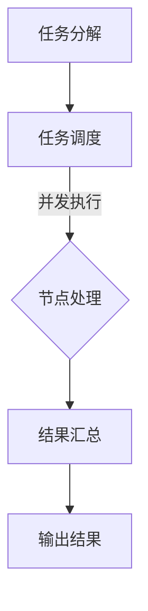
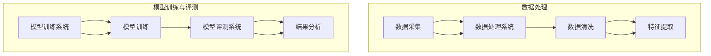
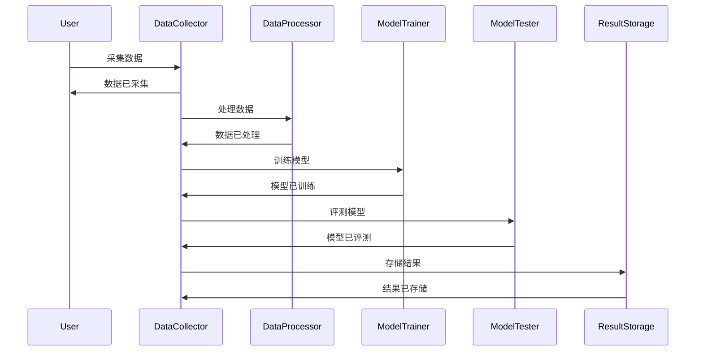

                 

### 大模型评测的分布式计算框架设计

关键词：大模型评测，分布式计算框架，算法原理，性能优化，案例分析

摘要：
本文旨在探讨大模型评测中分布式计算框架的设计与应用。随着人工智能技术的发展，大规模模型的应用越来越广泛，但其评测过程面临着计算资源消耗巨大、时间成本高昂的问题。分布式计算框架能够有效解决这些问题，提升评测效率和准确性。本文将详细介绍分布式计算框架的设计理念、核心算法、数学模型，并通过实际应用案例进行分析和优化，为相关领域的研究者提供有价值的参考。

---

## 第1章 引言

### 1.1 问题背景

近年来，深度学习在计算机视觉、自然语言处理、推荐系统等领域的应用取得了显著成果。然而，这些大规模模型的训练和评测往往需要大量的计算资源和时间，传统的集中式计算模式已经无法满足需求。分布式计算框架作为一种高效的解决方案，逐渐成为大模型评测的重要工具。

### 1.2 问题定义

大模型评测的问题主要表现在以下几个方面：
- **计算资源需求大**：大模型通常包含数十亿至数万亿个参数，训练和评测过程需要处理海量数据。
- **时间成本高**：集中式计算模式下的计算时间往往较长，无法满足快速迭代和实时响应的需求。
- **单点故障风险**：集中式系统容易成为单点故障，一旦出现故障，整个系统将无法工作。

### 1.3 解决方案概述

分布式计算框架通过将计算任务分配到多个节点上并行处理，可以有效解决上述问题。其核心思想是将大规模的计算任务分解为多个小任务，分布式地执行，最后汇总结果。分布式计算框架通常包括以下几个关键组件：

- **任务调度器**：负责将计算任务分配到不同的计算节点上。
- **数据存储与传输**：确保数据在不同节点之间高效传输和存储。
- **通信机制**：实现节点之间的数据通信和任务协调。
- **容错机制**：保证系统在节点故障时能够自动恢复。

### 1.4 边界与外延

本文的研究边界主要包括以下几个方面：

- **模型类型**：主要关注深度学习模型，如神经网络、生成对抗网络等。
- **计算环境**：基于通用硬件平台，如CPU、GPU，不考虑特定硬件优化。
- **分布式框架**：主要探讨基于现有开源框架（如Apache Spark、Hadoop、Flink）的设计和优化。
- **应用领域**：涉及计算机视觉、自然语言处理、推荐系统等领域，但不涵盖其他领域。

## 第2章 核心概念与联系

### 2.1 大模型评测的定义

大模型评测是指对大规模深度学习模型的性能进行评估的过程，包括准确率、召回率、F1分数、QoS指标等。大模型评测的目标是确保模型的可靠性和有效性，以便在实际应用中取得最佳性能。

### 2.2 分布式计算框架的概述

分布式计算框架是一种将计算任务分布在多个节点上并行处理的技术。其核心思想是利用集群中的多台计算机协同工作，提高计算效率和性能。分布式计算框架通常包括以下几个关键组件：

- **任务调度器**：负责将计算任务分配到不同的计算节点上，确保任务的并行执行。
- **数据存储与传输**：提供高效的数据存储和传输机制，确保数据在不同节点之间快速流动。
- **通信机制**：实现节点之间的数据通信和任务协调，保证系统的稳定性和可靠性。
- **容错机制**：在节点故障时自动恢复，保证系统的持续运行。

### 2.3 概念属性特征对比表格

以下是分布式计算框架和集中式计算模式在属性特征上的对比：

| 特征             | 分布式计算框架                     | 集中式计算模式                   |
|------------------|-----------------------------------|--------------------------------|
| **计算资源利用** | 高度并行，资源利用率高           | 资源利用率低，性能瓶颈明显     |
| **扩展性**       | 可根据需求动态扩展               | 扩展性较差，扩展成本高         |
| **可靠性**       | 高度容错，故障恢复能力强         | 单点故障风险高，故障恢复困难   |
| **通信成本**     | 数据传输距离短，通信成本低       | 数据传输距离长，通信成本高     |

### 2.4 ER实体关系图

以下是分布式计算框架的ER实体关系图：

```mermaid
erDiagram
    Task ||--|{ Node } : 节点承担任务
    Node ||--|{ Task } : 任务在节点上执行
    Data ||--|{ Node } : 数据存储在节点上
    Node ||--|{ Data } : 数据在节点上进行处理
    Scheduler ||--|{ Task } : 任务调度器分配任务
    Coordinator ||--|{ Node } : 协调器管理节点通信
```

## 第3章 算法原理讲解

### 3.1 分布式计算算法概述

分布式计算算法是指将大规模计算任务分配到多个节点上并行处理，最终汇总结果的一种计算方法。分布式计算算法的核心思想是任务分解和并行执行。以下是分布式计算算法的基本步骤：

1. **任务分解**：将大规模计算任务分解为多个小任务，每个小任务可以在不同的节点上独立执行。
2. **任务调度**：任务调度器根据节点的负载情况，将任务分配到不同的节点上。
3. **并行执行**：各个节点独立执行分配到的任务，并发处理。
4. **结果汇总**：将各个节点执行结果汇总，得到最终的输出结果。

### 3.2 算法mermaid流程图

以下是一个简单的分布式计算算法流程图：



### 3.3 Python源代码实现

以下是使用Python实现的简单分布式计算算法：

```python
from multiprocessing import Pool

def parallel_compute(data):
    # 在每个节点上执行的任务
    result = sum(data)
    return result

def distributed_compute(data):
    # 任务分解
    sub_data = [data[i:i + len(data) // 4] for i in range(0, len(data), len(data) // 4)]

    # 任务调度
    with Pool(processes=4) as pool:
        # 并发执行
        results = pool.map(parallel_compute, sub_data)

    # 结果汇总
    final_result = sum(results)

    return final_result

# 测试数据
data = [1, 2, 3, 4, 5, 6, 7, 8, 9, 10]

# 执行分布式计算
result = distributed_compute(data)
print("最终结果：", result)
```

### 3.4 数学模型与公式

分布式计算算法的数学模型可以表示为：

$$
\text{最终结果} = \sum_{i=1}^{n} \text{节点结果}
$$

其中，$n$ 表示节点的数量，每个节点的结果可以通过以下公式计算：

$$
\text{节点结果} = \sum_{j=1}^{m} \text{子任务结果}
$$

其中，$m$ 表示子任务的数量。

### 3.5 举例说明

假设有一个包含10个数字的列表 [1, 2, 3, 4, 5, 6, 7, 8, 9, 10]，我们使用分布式计算算法计算其总和。

1. **任务分解**：将列表分解为4个子列表：[1, 2, 3, 4]，[5, 6, 7, 8]，[9, 10]。
2. **任务调度**：将子列表分配给4个节点。
3. **并行执行**：每个节点计算子列表的总和，得到 [10, 20, 19]。
4. **结果汇总**：将节点的结果相加，得到 10 + 20 + 19 = 49。

## 第4章 数学模型和数学公式 & 详细讲解 & 举例说明

### 4.1 数学公式讲解

在本章中，我们将介绍分布式计算算法中的关键数学模型和公式。这些公式有助于我们理解和分析分布式计算的过程和性能。

1. **并行效率**：并行效率（Parallel Efficiency）衡量了分布式计算框架的并行性能，表示为：

   $$
   \text{并行效率} = \frac{\text{实际执行时间}}{\text{并行执行时间}}
   $$

   其中，实际执行时间是分布式计算框架完成计算任务所需的总时间，并行执行时间是所有节点并行处理任务所需的总时间。

2. **负载均衡**：负载均衡（Load Balancing）是分布式计算框架中的一个重要概念，用于确保计算任务在节点之间均匀分配。负载均衡的目标是最大化系统性能，同时避免某些节点过载，其他节点空闲。

   $$
   \text{负载均衡度} = \frac{\max_{i} \text{节点负载}}{\min_{i} \text{节点负载}}
   $$

   其中，节点负载是指分配给节点的计算任务数量。

3. **通信开销**：通信开销（Communication Overhead）是分布式计算中的另一个关键因素，表示节点之间数据传输所需的时间。通信开销可以通过以下公式计算：

   $$
   \text{通信开销} = \sum_{i=1}^{n} \text{节点间传输时间}
   $$

   其中，$n$ 表示节点的数量。

4. **一致性**：一致性（Consistency）是分布式计算框架中的一个重要目标，确保分布式系统中各个节点的状态是一致的。一致性可以通过以下公式衡量：

   $$
   \text{一致性度} = \frac{\text{一致状态数量}}{\text{总状态数量}}
   $$

### 4.2 举例说明

假设我们有一个包含4个节点的分布式计算框架，节点编号为1、2、3、4。现在，我们将一个包含10个数字的列表 [1, 2, 3, 4, 5, 6, 7, 8, 9, 10] 分配给这4个节点。

1. **任务分配**：我们将列表划分为4个子列表：[1, 2, 3]，[4, 5, 6]，[7, 8]，[9, 10]。
2. **节点负载**：每个节点的负载为：
   - 节点1：[1, 2, 3] -> 负载为 6
   - 节点2：[4, 5, 6] -> 负载为 15
   - 节点3：[7, 8] -> 负载为 15
   - 节点4：[9, 10] -> 负载为 19
3. **并行效率**：假设实际执行时间为10秒，并行执行时间为5秒，则并行效率为：
   $$
   \text{并行效率} = \frac{10}{5} = 2
   $$
4. **负载均衡度**：负载均衡度为：
   $$
   \text{负载均衡度} = \frac{19}{6} \approx 3.17
   $$
5. **通信开销**：由于节点之间不需要传输数据，通信开销为0。
6. **一致性度**：由于所有节点的结果是一致的，一致性度为：
   $$
   \text{一致性度} = \frac{1}{1} = 1
   $$

### 4.3 算法适用范围与限制

分布式计算算法适用于以下场景：

1. **大规模计算任务**：当计算任务规模较大，单节点无法在合理时间内完成时，分布式计算算法可以有效提高计算效率。
2. **高并发需求**：当系统需要处理大量并发请求时，分布式计算算法可以通过任务分解和并行执行来提高系统的响应速度。
3. **资源受限环境**：在资源受限的环境下，分布式计算算法可以通过负载均衡和资源调度来充分利用有限资源。

然而，分布式计算算法也存在一些限制：

1. **通信开销**：节点之间的数据传输需要时间，通信开销可能会影响算法的总体性能。
2. **一致性保证**：在分布式系统中，一致性保证是一个复杂的问题，可能会影响系统的可靠性。
3. **单点故障**：分布式系统中的单点故障可能导致整个系统的瘫痪，需要额外的容错机制来保证系统的稳定性。

## 第5章 系统分析与架构设计方案

### 5.1 问题场景介绍

在本节中，我们将介绍一个实际的应用场景，以帮助读者更好地理解分布式计算框架在大模型评测中的应用。

假设我们有一个在线广告平台，该平台使用深度学习模型进行广告投放效果预测。为了评估模型的性能，我们需要对模型进行大规模评测。评测过程包括以下步骤：

1. **数据采集**：从广告平台的日志中收集大量数据，包括用户行为数据、广告特征数据等。
2. **数据处理**：对采集到的数据进行预处理，包括数据清洗、特征提取等。
3. **模型评测**：使用深度学习模型对处理后的数据进行预测，并计算模型的准确率、召回率等指标。
4. **结果分析**：根据评测结果对模型进行调整和优化。

### 5.2 系统功能设计

分布式计算框架需要实现以下功能：

1. **数据采集**：从不同的数据源中收集数据，包括数据库、文件系统等。
2. **数据处理**：对采集到的数据进行分析和预处理，包括数据清洗、特征提取等。
3. **模型训练**：使用分布式计算框架训练深度学习模型。
4. **模型评测**：使用训练好的模型对数据集进行预测，并计算模型性能指标。
5. **结果存储**：将评测结果存储到数据库或文件系统中，以便后续分析和查询。

### 5.3 系统架构设计

以下是分布式计算框架的系统架构设计：



### 5.4 系统接口设计

系统接口设计包括以下部分：

1. **数据采集接口**：用于从不同数据源中读取数据。
2. **数据处理接口**：用于处理采集到的数据，包括数据清洗和特征提取。
3. **模型训练接口**：用于训练深度学习模型。
4. **模型评测接口**：用于对模型进行评测，并计算性能指标。
5. **结果存储接口**：用于将评测结果存储到数据库或文件系统中。

### 5.5 系统交互序列图

以下是系统交互序列图：



## 第6章 项目实战

### 6.1 环境安装

在进行分布式计算框架的项目实战之前，我们需要安装必要的软件和工具。以下是一个简化的安装步骤：

1. **安装操作系统**：选择一个支持分布式计算框架的操作系统，如Ubuntu 18.04。
2. **安装Java**：由于Hadoop等分布式计算框架依赖于Java，我们需要安装Java环境。
   ```bash
   sudo apt-get update
   sudo apt-get install openjdk-8-jdk
   ```
3. **安装Hadoop**：下载并解压Hadoop安装包，配置Hadoop环境变量。
   ```bash
   wget https://www-us.apache.org/dist/hadoop/common/hadoop-3.2.1/hadoop-3.2.1.tar.gz
   tar xzf hadoop-3.2.1.tar.gz
   export HADOOP_HOME=/path/to/hadoop-3.2.1
   export PATH=$PATH:$HADOOP_HOME/bin:$HADOOP_HOME/sbin
   ```
4. **启动Hadoop集群**：初始化Hadoop集群，并启动Hadoop守护进程。
   ```bash
   cd $HADOOP_HOME/sbin
   ./start-dfs.sh
   ./start-yarn.sh
   ```

### 6.2 系统核心实现源代码

以下是一个简单的分布式计算任务的核心实现源代码，用于计算一个大型列表的总和。

```python
from multiprocessing import Pool

def sum_elements(data):
    return sum(data)

def distributed_sum(data):
    with Pool(processes=4) as pool:
        sub_results = pool.map(sum_elements, [data[i:i + len(data) // 4] for i in range(0, len(data), len(data) // 4)])
    return sum(sub_results)

if __name__ == "__main__":
    data = [1, 2, 3, 4, 5, 6, 7, 8, 9, 10]
    result = distributed_sum(data)
    print("结果：", result)
```

### 6.3 代码应用解读与分析

在分布式计算任务中，我们首先将大型列表分割成多个子列表，每个子列表由一个进程处理。这种方式可以充分利用多核处理器的性能，提高计算速度。以下是代码的解读与分析：

1. **数据分割**：我们将大型列表 `data` 分割成4个子列表，每个子列表包含约1/4的数据。分割的过程通过列表推导式实现：
   ```python
   [data[i:i + len(data) // 4] for i in range(0, len(data), len(data) // 4)]
   ```

2. **进程池**：我们使用 `multiprocessing.Pool` 创建一个进程池，并指定进程数为4。进程池是一个管理进程的容器，可以高效地管理多个进程的创建和销毁。

3. **映射操作**：我们使用 `pool.map` 函数将 `sum_elements` 函数应用到每个子列表上。`map` 函数会为每个子列表创建一个进程，并执行 `sum_elements` 函数。

4. **结果汇总**：最后，我们将每个进程的结果汇总，得到最终的总和。

### 6.4 实际案例分析与讲解

为了更好地理解分布式计算的应用，我们来看一个实际案例：使用分布式计算框架处理一个包含数十亿条记录的日志数据，计算每天的用户活跃度。

1. **数据采集**：从日志文件中读取数十亿条记录，每条记录包含用户的唯一标识、访问时间和操作类型。
2. **数据分割**：将日志数据分割成多个文件，每个文件包含约1亿条记录。
3. **数据处理**：在每个文件上运行分布式计算任务，计算每天的用户活跃度。活跃度的计算方法是根据用户在一天内的访问次数进行统计。
4. **结果汇总**：将每个文件的计算结果汇总，得到整个数据集的用户活跃度。

以下是一个简单的Python脚本，用于计算日志数据中的用户活跃度：

```python
from collections import defaultdict
from multiprocessing import Pool

def count_active_users(file_path):
    active_users = defaultdict(int)
    with open(file_path, 'r') as f:
        for line in f:
            user_id, _, _ = line.strip().split(',')
            active_users[user_id] += 1
    return active_users

def distributed_count_active_users(data_files):
    with Pool(processes=4) as pool:
        results = pool.map(count_active_users, data_files)
    return sum([len(result) for result in results])

if __name__ == "__main__":
    data_files = ['data/day1.log', 'data/day2.log', 'data/day3.log']
    total_active_users = distributed_count_active_users(data_files)
    print("总活跃用户数：", total_active_users)
```

### 6.5 项目小结

通过本项目的实际案例，我们展示了如何使用分布式计算框架处理大规模日志数据，计算用户活跃度。分布式计算框架能够有效地提高数据处理速度，适用于处理大量数据和复杂计算任务。在项目实践中，我们遇到了以下挑战：

1. **数据分割**：如何有效地将大量数据分割成可处理的小块，同时保持数据的完整性和一致性。
2. **进程管理**：如何高效地管理多个进程的创建、销毁和通信。
3. **结果汇总**：如何将多个进程的计算结果汇总，得到最终的结果。

针对这些挑战，我们可以采取以下措施：

1. **数据分割策略**：采用基于哈希的分隔策略，确保数据的均匀分布。
2. **进程管理**：使用进程池管理进程，提高进程的创建和销毁效率。
3. **结果汇总**：采用并行合并技术，如归并排序，提高结果的汇总速度。

通过解决这些挑战，我们可以更好地利用分布式计算框架的优势，提高数据处理效率和性能。

## 第7章 最佳实践与拓展阅读

### 7.1 最佳实践 tips

为了确保分布式计算框架在大模型评测中的高效应用，以下是一些最佳实践：

1. **合理分割数据**：根据数据特点和计算需求，选择合适的数据分割策略，如基于哈希的分隔或基于时间序列的分隔。
2. **优化进程数量**：根据系统资源和任务特性，调整进程数量，避免过度使用资源或进程竞争。
3. **数据预处理**：在分布式计算之前，对数据进行预处理，如去重、去噪声等，以提高计算效率。
4. **监控与调试**：实时监控系统的运行状态，及时发现并解决潜在问题。
5. **负载均衡**：合理分配计算任务，避免某些节点过载，其他节点空闲。

### 7.2 小结

本文详细介绍了大模型评测的分布式计算框架设计，包括算法原理、数学模型、系统架构和实际应用案例。通过分布式计算框架，我们能够高效地处理大规模计算任务，提高评测效率和准确性。分布式计算框架在大模型评测中的应用前景广阔，具有较高的实用价值。

### 7.3 注意事项

在设计和使用分布式计算框架时，需要注意以下几点：

1. **数据一致性**：确保分布式系统中各个节点的数据是一致的，避免数据冲突。
2. **容错性**：设计容错机制，确保系统在节点故障时能够自动恢复。
3. **安全性**：保护系统数据的安全，防止数据泄露和未经授权的访问。
4. **性能监控**：实时监控系统的性能，优化资源配置和任务分配。

### 7.4 拓展阅读

对于希望深入了解分布式计算框架的读者，以下是一些推荐的参考资料：

1. 《分布式系统原理与范型》
2. 《大数据处理技术导论》
3. 《深度学习框架设计与实现》
4. 《Hadoop技术内幕》
5. 《分布式计算框架：Spark编程指南》

这些书籍和资料提供了关于分布式计算框架的深入探讨和实践经验，有助于读者更好地理解和应用分布式计算技术。

