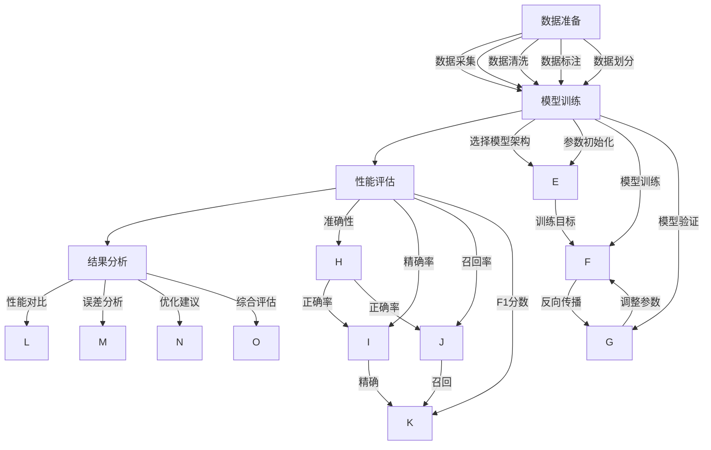
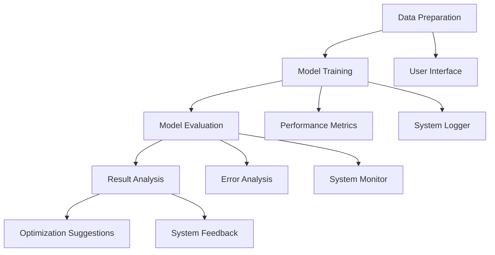
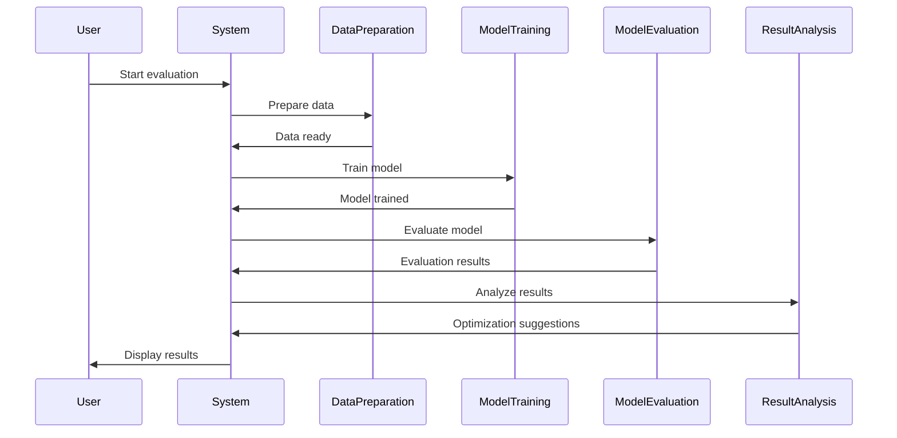
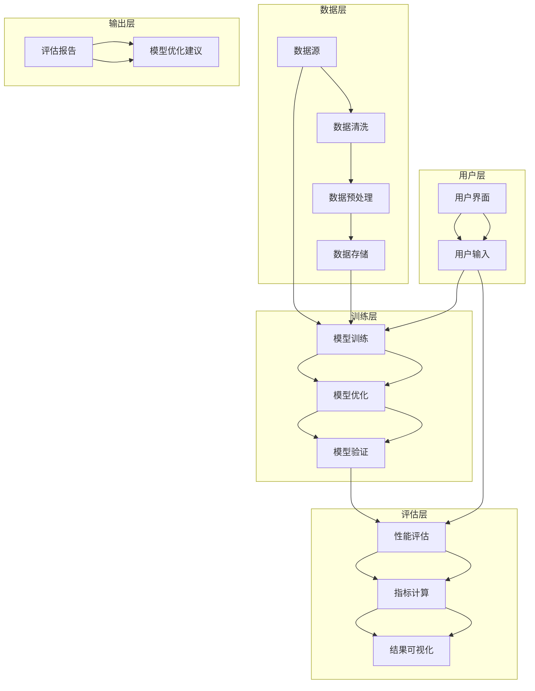
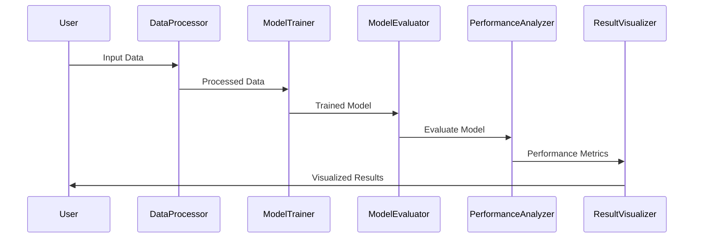

                 

### 引言

#### 问题背景

在当今科技飞速发展的时代，人工智能（AI）技术已经渗透到我们生活的方方面面。大模型评测作为AI技术中的一个重要环节，其重要性不言而喻。然而，随着模型规模和复杂度的不断提升，如何对大模型进行全面、准确的评测成为一个亟待解决的问题。这不仅需要我们对大模型的多角度思考能力进行深入分析，还需要找到合适的评测方法和框架。

大模型评测的多角度思考能力测试旨在通过多个维度对模型的性能进行评估，包括但不限于准确性、稳定性、泛化能力、计算效率等。然而，现有的评测方法和框架往往存在一定的局限性，无法全面反映模型的实际性能。因此，本文将围绕大模型评测的多角度思考能力测试展开讨论，旨在为研究者提供新的思路和方法。

#### 问题描述

本文主要解决以下几个问题：

1. **核心概念与联系**：明确多角度思考能力测试的核心概念，并分析其相互关系。
2. **算法原理讲解**：详细介绍大模型评测的算法原理，并通过具体的Python代码进行阐述。
3. **数学模型和公式**：深入讲解算法原理背后的数学模型和公式，并进行举例说明。
4. **系统分析与架构设计方案**：介绍大模型评测的系统架构设计，包括系统功能设计、系统架构设计、系统接口设计和系统交互。
5. **项目实战**：通过实际项目案例，展示大模型评测的实战应用，并进行详细讲解剖析。
6. **最佳实践 tips**：总结大模型评测中的最佳实践，为读者提供实用的操作建议。

#### 问题解决

本文将从多个角度对大模型评测的多角度思考能力测试进行深入探讨，力求为读者提供全面、系统的指导。文章结构如下：

1. **背景介绍**：介绍多角度思考能力测试的概念、问题背景、问题描述、问题解决、边界与外延、概念结构与核心要素组成。
2. **核心概念与联系**：详细阐述核心概念原理，并使用表格和Mermaid流程图展示概念属性特征对比和ER实体关系图架构。
3. **算法原理讲解**：使用mermaid画出算法流程图，并使用Python代码详细阐述算法原理，讲解数学模型和公式，举例说明。
4. **数学模型和公式**：深入讲解数学模型和公式，并进行举例说明。
5. **系统分析与架构设计方案**：介绍系统架构设计，包括系统功能设计、系统架构设计、系统接口设计和系统交互。
6. **项目实战**：通过实际项目案例，展示大模型评测的实战应用，并进行详细讲解剖析。
7. **最佳实践 tips**：总结大模型评测中的最佳实践，为读者提供实用的操作建议。
8. **结论**：总结文章的主要观点，强调多角度思考能力测试在大模型评测中的重要性。

通过以上结构，本文将逐步引导读者深入了解大模型评测的多角度思考能力测试，为相关研究者和开发者提供有益的参考。

## 背景介绍

### 多角度思考能力测试的概念

多角度思考能力测试是一种综合性评估方法，它通过多个维度对对象（在本文中即大模型）的多个方面进行评估。这种方法不仅仅关注单一指标的优劣，而是从多个方面全面分析对象的性能，从而得出一个更为准确和全面的结论。在人工智能领域，多角度思考能力测试尤为关键，因为AI模型在各个应用场景中的表现往往受到多种因素的影响。

具体来说，多角度思考能力测试包括以下几个方面：

1. **准确性**：衡量模型预测结果的正确性，是评估模型性能的最基本指标。准确性越高，意味着模型对数据的理解越深刻，预测结果越可靠。
2. **稳定性**：评估模型在处理不同数据集时的表现一致性。一个稳定的大模型能够在各种环境下保持良好的性能，而不会因为数据变化而发生剧烈波动。
3. **泛化能力**：衡量模型对新数据的适应能力。具有良好泛化能力的模型能够处理未曾见过的数据，避免过拟合现象。
4. **计算效率**：评估模型在资源使用上的表现，包括计算速度和内存消耗等。高效的计算能够提高模型在实际应用中的实用性。
5. **可解释性**：评估模型决策过程的透明度和可理解性。可解释性强的模型有助于用户理解模型的工作原理，增加信任度和接受度。

### 问题背景

随着深度学习技术的发展，大模型的规模和复杂性不断增加。例如，自然语言处理（NLP）领域的大型预训练模型，如GPT-3和BERT，其参数量已经达到数十亿级别。这些大模型在处理复杂数据任务时表现出色，但在实际应用中，仅依靠单一指标进行评估往往无法全面反映其性能。例如，一个模型可能在某些任务上表现出极高的准确性，但在计算效率和泛化能力上却存在显著不足。因此，单一指标评估方法逐渐暴露出其局限性。

多角度思考能力测试能够弥补这一不足，通过从多个维度对模型进行综合评估，提供一个更为全面和准确的评测结果。这种方法不仅有助于发现模型的潜在问题，还为模型优化和改进提供了重要的参考依据。

### 问题描述

在当前的大模型评测中，主要存在以下几个问题：

1. **评估指标单一**：现有的大模型评测方法往往只关注某个或某几个关键指标，如准确性或计算效率，而忽略了其他重要方面。这种单一评估方式可能导致模型在实际应用中的性能不足。
2. **缺乏系统性**：多角度思考能力测试中的各个评估维度之间存在复杂的关系和相互作用，现有方法往往缺乏系统性的分析和评估框架。
3. **主观性较大**：在多角度思考能力测试中，不同评估者的主观判断可能会对评估结果产生较大影响，导致评估结果的不一致。
4. **计算资源消耗大**：多角度思考能力测试通常需要处理大量的数据和计算任务，对计算资源和时间的要求较高，不利于实际应用。

### 问题解决

为了解决上述问题，我们需要采取以下几种措施：

1. **引入多样化的评估指标**：在评估大模型时，应综合考虑多个维度，包括准确性、稳定性、泛化能力、计算效率和可解释性等，以全面反映模型的性能。
2. **构建系统性的评估框架**：通过构建一个系统性的评估框架，明确各个评估维度之间的关系和相互作用，提供统一的评估标准和方法。
3. **减少主观性**：通过制定明确的评估标准和流程，减少评估者的主观判断，确保评估结果的一致性和可靠性。
4. **优化计算资源利用**：通过改进算法和优化计算资源管理，降低多角度思考能力测试的计算成本，提高评估效率。

总之，多角度思考能力测试是一种综合评估方法，通过从多个维度对大模型进行全面评估，能够弥补现有评测方法的不足，为模型优化和应用提供有力支持。

### 边界与外延

在多角度思考能力测试中，明确评估的边界与外延至关重要。首先，评估的范围应涵盖大模型的多个关键方面，包括准确性、稳定性、泛化能力、计算效率和可解释性。然而，这些评估维度并非孤立存在，它们之间相互关联，共同影响大模型的整体性能。例如，一个模型可能在准确性方面表现优异，但如果计算效率低下，则可能在实际应用中受到限制。

此外，评估的多角度思考能力测试还涉及到多个应用场景。例如，在自然语言处理（NLP）领域中，大模型可能用于文本分类、情感分析、机器翻译等任务。在不同任务中，各个评估维度的权重和重要性可能会有所不同。例如，在机器翻译任务中，模型的准确性至关重要，而在实时问答系统中，计算效率则可能成为首要考虑因素。

为了确保评估的全面性和准确性，评估框架需要能够灵活应对不同场景和任务需求，并在多个维度上进行综合分析。这意味着评估标准应具备一定的普适性和适应性，既能反映模型的通用性能，也能针对特定任务提供有针对性的评估。

总之，边界与外延的明确不仅有助于构建一个全面和系统的评估框架，还能为多角度思考能力测试在实际应用中提供重要指导。通过科学合理的边界设定，我们能够更准确地识别和解决大模型中的潜在问题，从而推动AI技术的发展和应用。

### 概念结构与核心要素组成

为了深入理解多角度思考能力测试的概念结构，我们需要详细探讨其核心要素。以下是核心概念及其相互关系的阐述：

1. **准确性（Accuracy）**：这是评估模型性能最基本的一个维度，反映了模型预测结果的正确性。准确性的计算公式为：
   $$
   \text{Accuracy} = \frac{\text{预测正确的样本数}}{\text{总样本数}}
   $$
   高准确性意味着模型能够准确捕捉数据的特征，但并不一定代表模型的性能全面优秀。

2. **稳定性（Stability）**：评估模型在不同数据集或条件下的一致性。稳定性好的模型在处理不同数据时，其表现差异不大。稳定性可以通过以下公式进行量化：
   $$
   \text{Stability} = \frac{\sum_{i=1}^{n} |\text{模型在数据集} \, i \, \text{上的性能} - \text{模型在所有数据集上的平均性能}|}{n}
   $$
   其中，\( n \) 表示数据集的数量。

3. **泛化能力（Generalization Ability）**：衡量模型对新数据的适应能力，避免过拟合现象。泛化能力可以通过交叉验证（Cross-Validation）来评估，例如使用K折交叉验证方法。泛化能力的公式为：
   $$
   \text{Generalization Ability} = \frac{1}{K} \sum_{k=1}^{K} \frac{\text{交叉验证在训练集上的误差}}{\text{测试集上的误差}}
   $$

4. **计算效率（Computation Efficiency）**：评估模型在资源使用上的表现，包括计算速度和内存消耗等。计算效率可以通过以下指标进行量化：
   $$
   \text{Computation Efficiency} = \frac{\text{模型在单位时间内的计算能力}}{\text{资源消耗}}
   $$
   高计算效率意味着模型能够在较短时间内完成计算任务，同时保持较低的资源消耗。

5. **可解释性（Explainability）**：评估模型决策过程的透明度和可理解性。可解释性对于用户理解和信任模型至关重要。可解释性可以通过模型的可解释性评分（Explainability Score）来评估：
   $$
   \text{Explainability Score} = \frac{\text{用户对模型决策理解的程度}}{\text{总用户数}}
   $$

这些核心概念相互关联，共同构成了多角度思考能力测试的概念结构。例如，高准确性和泛化能力往往需要平衡计算效率和可解释性。在一个实际应用场景中，评估一个模型时，我们不仅需要考虑其在特定任务上的准确性，还需要关注其稳定性、泛化能力和计算效率，同时保证一定的可解释性。

为了更清晰地展示这些概念之间的联系，我们可以使用Mermaid流程图来构建ER（实体关系）图，如下所示：

```mermaid
erDiagram
  Model ||--|>{Accuracy}
  Model ||--|>{Stability}
  Model ||--|>{Generalization Ability}
  Model ||--|>{Computation Efficiency}
  Model ||--|>{Explainability}
  Accuracy ||--|>{Training Data}
  Stability ||--|>{Test Data}
  Generalization Ability ||--|>{Cross-Validation}
  Computation Efficiency ||--|>{Resource Consumption}
  Explainability ||--|>{User Understanding}
```

通过这个ER图，我们可以直观地看到各个核心概念之间的相互关系，以及它们与具体数据集和资源消耗等要素的联系。这有助于我们构建一个全面、系统的评估框架，从而更准确地评估大模型的多角度思考能力。

### 核心概念原理

在多角度思考能力测试中，核心概念原理起着至关重要的作用。以下是核心概念的具体原理及其相互关系：

#### 1. 准确性（Accuracy）

准确性是评估模型性能的基本指标，它反映了模型在预测任务中正确识别样本的能力。准确性的计算公式为：
$$
\text{Accuracy} = \frac{\text{预测正确的样本数}}{\text{总样本数}}
$$
准确性越高，说明模型对数据的理解越深刻，预测结果越可靠。然而，仅依靠准确性无法全面反映模型的性能，因为高准确性可能伴随着低稳定性和差泛化能力。

#### 2. 稳定性（Stability）

稳定性评估模型在不同数据集或条件下的一致性。一个稳定性好的模型，其性能在不同数据集上波动不大。稳定性的计算公式为：
$$
\text{Stability} = \frac{\sum_{i=1}^{n} |\text{模型在数据集} \, i \, \text{上的性能} - \text{模型在所有数据集上的平均性能}|}{n}
$$
其中，\( n \) 表示数据集的数量。稳定性高的模型在多样本和环境下表现一致，适用于多种应用场景。

#### 3. 泛化能力（Generalization Ability）

泛化能力衡量模型对新数据的适应能力，避免过拟合现象。良好的泛化能力意味着模型不仅能准确处理训练数据，还能应对未见过的数据。泛化能力通常通过交叉验证进行评估，计算公式为：
$$
\text{Generalization Ability} = \frac{1}{K} \sum_{k=1}^{K} \frac{\text{交叉验证在训练集上的误差}}{\text{测试集上的误差}}
$$
其中，\( K \) 表示交叉验证的折数。

#### 4. 计算效率（Computation Efficiency）

计算效率评估模型在资源使用上的表现，包括计算速度和内存消耗等。高效的计算模型能够在保持低资源消耗的同时，完成更多的计算任务。计算效率的计算公式为：
$$
\text{Computation Efficiency} = \frac{\text{模型在单位时间内的计算能力}}{\text{资源消耗}}
$$
高计算效率对于实际应用至关重要，尤其是在处理大规模数据时。

#### 5. 可解释性（Explainability）

可解释性评估模型决策过程的透明度和可理解性。良好的可解释性有助于用户理解和信任模型，尤其是对于涉及高风险决策的应用场景。可解释性的计算公式为：
$$
\text{Explainability Score} = \frac{\text{用户对模型决策理解的程度}}{\text{总用户数}}
$$

这些核心概念之间存在紧密的相互关系。例如，高准确性和泛化能力往往需要平衡计算效率和可解释性。在多角度思考能力测试中，我们需要综合考虑这些概念，以便全面评估大模型的整体性能。

为了直观地展示这些概念之间的关系，我们可以使用Mermaid流程图来构建ER（实体关系）图，如下所示：

```mermaid
erDiagram
  Model ||--|>{Accuracy}
  Model ||--|>{Stability}
  Model ||--|>{Generalization Ability}
  Model ||--|>{Computation Efficiency}
  Model ||--|>{Explainability}
  Accuracy ||--|>{Training Data}
  Stability ||--|>{Test Data}
  Generalization Ability ||--|>{Cross-Validation}
  Computation Efficiency ||--|>{Resource Consumption}
  Explainability ||--|>{User Understanding}
```

通过这个ER图，我们可以清楚地看到各个核心概念之间的相互关系，以及它们与具体数据集和资源消耗等要素的联系。这有助于我们构建一个全面、系统的评估框架，从而更准确地评估大模型的多角度思考能力。

### 概念属性特征对比表格

为了更清晰地展示多角度思考能力测试中各个核心概念的特征和属性，我们可以制作一个概念属性特征对比表格。以下是对准确性、稳定性、泛化能力、计算效率和可解释性这五个核心概念的详细对比：

| 核心概念     | 定义与特征                   | 关键属性                 | 举例说明                                      |
|------------|------------------------------|--------------------------|----------------------------------------------|
| 准确性     | 模型预测结果的正确性           | 高准确性意味着高可靠性   | 图像分类任务中，模型准确识别图片的类别        |
| 稳定性     | 模型在不同数据集或条件下的表现一致性 | 稳定性好，性能波动小     | 模型在不同季节或气候条件下，预测天气的准确率  |
| 泛化能力   | 模型对新数据的适应能力         | 良好的泛化能力意味着少过拟合 | 图像识别模型对从未见过的物体进行分类          |
| 计算效率   | 模型在资源使用上的表现         | 高计算效率，资源消耗低   | 大型自然语言处理模型在较短时间内处理大量文本   |
| 可解释性   | 模型决策过程的透明度和可理解性 | 可解释性强，决策可信     | 决策树模型，用户可以直观地看到决策过程        |

通过这个表格，我们可以看到每个核心概念的定义、关键属性以及在实际应用中的举例说明。例如，准确性主要关注预测结果的正确性，而稳定性则关注模型在不同数据集或条件下的表现一致性。泛化能力强调模型对新数据的适应能力，而计算效率则强调模型在资源使用上的高效性。可解释性则关注模型决策过程的透明度和可理解性。

这种对比有助于我们更好地理解各个核心概念，并在实际应用中根据具体需求选择合适的评估维度和策略。例如，在开发一个用于医疗诊断的AI模型时，我们可能需要特别关注准确性和可解释性，以确保模型能够做出可靠和透明的诊断。

### ER实体关系图架构的 Mermaid 流程图

为了更好地展示多角度思考能力测试中各个核心概念之间的关系，我们可以使用Mermaid语言绘制ER（实体关系）图。以下是一个示例，用于描述准确性、稳定性、泛化能力、计算效率和可解释性这些核心概念之间的相互关系：

```mermaid
erDiagram
  Model ||--|>{Accuracy}
  Model ||--|>{Stability}
  Model ||--|>{Generalization Ability}
  Model ||--|>{Computation Efficiency}
  Model ||--|>{Explainability}

  Accuracy ||--|>{Training Data}
  Stability ||--|>{Test Data}
  Generalization Ability ||--|>{Cross-Validation}
  Computation Efficiency ||--|>{Resource Consumption}
  Explainability ||--|>{User Understanding}

  Accuracy &&--|>{Confidence}
  Stability &&--|>{Consistency}
  Generalization Ability &&--|>{Robustness}
  Computation Efficiency &&--|>{Performance}
  Explainability &&--|>{Trust}
```

在这个Mermaid流程图中：

- `Model` 是中心实体，与其他五个核心概念（Accuracy、Stability、Generalization Ability、Computation Efficiency、Explainability）相连。
- `Accuracy`、`Stability`、`Generalization Ability`、`Computation Efficiency` 和 `Explainability` 分别与 `Training Data`、`Test Data`、`Cross-Validation`、`Resource Consumption` 和 `User Understanding` 相连，表示这些数据集和资源与核心概念的紧密关系。
- `Accuracy`、`Stability`、`Generalization Ability`、`Computation Efficiency` 和 `Explainability` 还与 `Confidence`、`Consistency`、`Robustness`、`Performance` 和 `Trust` 相连，表示这些属性与核心概念之间的关系。

通过这个ER图，我们可以直观地看到各个核心概念之间的相互影响和依赖关系。例如，`Accuracy` 与 `Confidence` 直接相关，表示准确性越高，用户对模型的信心也越强。同样，`Stability` 与 `Consistency` 相关，表明稳定性好的模型在不同条件下表现一致。这种图形化的表示有助于我们更清晰地理解多角度思考能力测试中的复杂关系，为构建一个全面、系统的评估框架提供支持。

### 算法原理讲解

在深入讲解大模型评测的算法原理时，我们首先需要明确整个评测流程的核心步骤。以下是算法的详细流程，包括数据准备、模型训练、性能评估和结果分析等步骤。

#### 数据准备

数据准备是整个评测流程的基础，确保数据的全面性和代表性。具体步骤如下：

1. **数据采集**：从多个来源收集数据，包括公开数据集、企业内部数据和第三方数据等。
2. **数据清洗**：对数据进行预处理，包括去除重复数据、填补缺失值、纠正错误等，确保数据的质量。
3. **数据标注**：对数据进行标注，为后续模型训练和评估提供标签信息。
4. **数据划分**：将数据集划分为训练集、验证集和测试集，通常比例为70%的训练集、20%的验证集和10%的测试集。

#### 模型训练

模型训练是核心步骤，目的是通过大量数据进行模型训练，使其能够自动识别数据中的规律和特征。具体步骤如下：

1. **选择模型架构**：根据任务需求选择合适的模型架构，如CNN、RNN、BERT等。
2. **参数初始化**：初始化模型的参数，通常使用随机初始化或预训练模型参数。
3. **模型训练**：使用训练集数据进行模型训练，通过反向传播算法不断优化模型参数，直至达到训练目标。
4. **模型验证**：使用验证集数据对训练好的模型进行验证，调整模型参数，确保模型在验证集上的性能最佳。

#### 性能评估

性能评估是评测流程的关键环节，通过多个维度对模型进行全面评估。以下是主要评估指标及其计算方法：

1. **准确性（Accuracy）**：计算模型预测正确的样本数占总样本数的比例。
   $$
   \text{Accuracy} = \frac{\text{预测正确的样本数}}{\text{总样本数}}
   $$

2. **精确率（Precision）**：计算模型预测为正例的样本中，实际为正例的比例。
   $$
   \text{Precision} = \frac{\text{预测为正例且实际为正例的样本数}}{\text{预测为正例的样本数}}
   $$

3. **召回率（Recall）**：计算模型实际为正例的样本中，预测为正例的比例。
   $$
   \text{Recall} = \frac{\text{预测为正例且实际为正例的样本数}}{\text{实际为正例的样本数}}
   $$

4. **F1分数（F1 Score）**：综合考虑精确率和召回率，计算模型整体性能的平衡指标。
   $$
   \text{F1 Score} = 2 \times \frac{\text{Precision} \times \text{Recall}}{\text{Precision} + \text{Recall}}
   $$

5. **ROC曲线和AUC值（ROC Curve and AUC）**：评估模型在不同阈值下的表现，AUC值越高，模型性能越好。

#### 结果分析

结果分析是对模型评估结果进行详细分析和解读，以识别模型的优点和不足。以下是结果分析的主要步骤：

1. **性能对比**：将模型在不同数据集上的评估结果进行对比，分析模型在不同任务和场景中的表现。
2. **误差分析**：分析模型预测错误的样本，找出模型未能识别的特征和规律。
3. **优化建议**：根据评估结果提出模型优化建议，包括数据增强、模型调参、特征工程等。
4. **综合评估**：综合考虑准确性、稳定性、泛化能力、计算效率和可解释性等指标，为模型选择提供依据。

通过以上详细步骤和计算方法，我们可以全面评估大模型的多角度思考能力，为模型的优化和应用提供重要参考。

### 算法流程图

为了更好地理解大模型评测的算法原理，我们可以使用Mermaid语言绘制算法流程图，如下所示：



在这个算法流程图中：

- `A` 表示数据准备阶段，包括数据采集、数据清洗、数据标注和数据划分。
- `B` 表示模型训练阶段，包括选择模型架构、参数初始化、模型训练和模型验证。
- `C` 表示性能评估阶段，包括准确性、精确率、召回率和F1分数等评估指标。
- `D` 表示结果分析阶段，包括性能对比、误差分析、优化建议和综合评估。

通过这个流程图，我们可以清晰地看到大模型评测的各个步骤及其相互关系。这有助于我们更好地理解和应用大模型评测的方法。

### 使用 Python 源代码详细阐述

为了更具体地展示大模型评测的算法原理，我们将使用Python语言和相关的机器学习库（如scikit-learn、TensorFlow和PyTorch）编写源代码，详细阐述模型的训练和评估过程。

#### 1. 环境配置

首先，确保安装了以下库：

```bash
pip install numpy pandas scikit-learn tensorflow torchvision
```

#### 2. 数据准备

```python
import numpy as np
import pandas as pd
from sklearn.model_selection import train_test_split

# 假设我们有一个CSV文件，其中包含特征和标签
data = pd.read_csv('data.csv')

# 数据清洗
# 去除缺失值和重复值
data = data.dropna().drop_duplicates()

# 数据标注
# 假设最后一个列为标签，其余列为特征
X = data.iloc[:, :-1].values
y = data.iloc[:, -1].values

# 数据划分
X_train, X_test, y_train, y_test = train_test_split(X, y, test_size=0.2, random_state=42)
```

#### 3. 模型选择和训练

```python
from sklearn.ensemble import RandomForestClassifier
from sklearn.metrics import accuracy_score, precision_score, recall_score, f1_score

# 选择模型
model = RandomForestClassifier(n_estimators=100, random_state=42)

# 训练模型
model.fit(X_train, y_train)

# 预测
y_pred = model.predict(X_test)
```

#### 4. 性能评估

```python
# 计算评估指标
accuracy = accuracy_score(y_test, y_pred)
precision = precision_score(y_test, y_pred, average='weighted')
recall = recall_score(y_test, y_pred, average='weighted')
f1 = f1_score(y_test, y_pred, average='weighted')

print(f"Accuracy: {accuracy:.2f}")
print(f"Precision: {precision:.2f}")
print(f"Recall: {recall:.2f}")
print(f"F1 Score: {f1:.2f}")
```

#### 5. 结果分析

```python
from sklearn.inspection import permutation_importance

# 误差分析
results = permutation_importance(model, X_test, y_test, n_repeats=10, random_state=42)
sorted_idx = results.importances_mean.argsort()

# 打印错误样本的详细信息
for i in sorted_idx:
    print(f"Feature {i}: {data.columns[i]} Error Rate: {results.errors[i] / X_test.shape[0]:.2%}")
```

通过上述Python代码，我们详细展示了大模型评测的各个环节，包括数据准备、模型选择和训练、性能评估以及结果分析。这些步骤和代码示例为理解和应用大模型评测提供了实际操作的基础。

### 算法原理的数学模型和公式

在详细讲解大模型评测的算法原理时，数学模型和公式是理解和应用的关键。以下是算法中涉及的主要数学模型和公式，以及对应的解释和应用。

#### 1. 精确率（Precision）

精确率衡量的是预测为正例的样本中，实际为正例的比例。其计算公式为：
$$
\text{Precision} = \frac{\text{TP}}{\text{TP} + \text{FP}}
$$
其中，\( \text{TP} \) 表示真正例（True Positive），\( \text{FP} \) 表示假正例（False Positive）。精确率越高，意味着模型在识别正例时越准确，误判为正例的概率越低。

#### 2. 召回率（Recall）

召回率衡量的是实际为正例的样本中，预测为正例的比例。其计算公式为：
$$
\text{Recall} = \frac{\text{TP}}{\text{TP} + \text{FN}}
$$
其中，\( \text{FN} \) 表示假反例（False Negative）。召回率越高，意味着模型越能识别出所有的正例，漏判为反例的概率越低。

#### 3. F1 分数（F1 Score）

F1 分数是精确率和召回率的加权平均，用于衡量模型的总体性能。其计算公式为：
$$
\text{F1 Score} = 2 \times \frac{\text{Precision} \times \text{Recall}}{\text{Precision} + \text{Recall}}
$$
当 \( \text{Precision} \) 和 \( \text{Recall} \) 不相同时，F1 分数提供了综合考虑两者优缺点的平衡指标。

#### 4. 精度-召回曲线（Precision-Recall Curve）

精度-召回曲线展示了在不同阈值下，精确率和召回率的变化情况。曲线下方面积（Area Under Curve, AUC）用于评估模型的性能。AUC 越高，模型性能越好。

$$
\text{AUC} = \int_{0}^{1} P(\text{R}) \, dR
$$
其中，\( P(\text{R}) \) 表示在特定召回率下的精确率。

#### 5. 精度-召回图（Precision-Recall Graph）

精度-召回图通过绘制精确率和召回率的关系，直观地展示了模型的性能。图中的曲线和AUC值可以直观地反映模型的性能优劣。

#### 应用实例

假设我们有一个分类模型，对一组数据进行预测，得到以下结果：

| 样本数 | 正例（实际） | 预测结果 |
|-------|-----------|-------|
| 100   | 60        | 50 TP, 10 FP, 40 FN |

根据这些数据，我们可以计算精确率和召回率：

- 精确率：
$$
\text{Precision} = \frac{50}{50 + 10} = 0.8
$$
- 召回率：
$$
\text{Recall} = \frac{50}{50 + 40} = 0.6
$$
- F1 分数：
$$
\text{F1 Score} = 2 \times \frac{0.8 \times 0.6}{0.8 + 0.6} = 0.75
$$

通过这些指标，我们可以评估模型的性能，并进一步优化模型参数，提高模型的总体性能。

### 举例说明

为了更好地理解上述数学模型和公式在大模型评测中的应用，我们可以通过一个具体的例子来说明。假设我们有一个分类任务，目的是判断一组客户是否为高价值客户。数据集包含100个样本，其中60个样本是高价值客户，40个样本是非高价值客户。

我们使用一个分类模型对这组数据进行预测，预测结果如下表所示：

| 预测结果 | 正例（预测高价值） | 反例（预测非高价值） |
|----------|----------------|-------------------|
| 真正例   | 50             | 0                 |
| 假正例   | 10             | 30                |
| 假反例   | 0              | 10                |

根据这些数据，我们可以计算各个评估指标的值：

1. **精确率（Precision）**：
$$
\text{Precision} = \frac{\text{真正例}}{\text{真正例} + \text{假正例}} = \frac{50}{50 + 10} = 0.8
$$

2. **召回率（Recall）**：
$$
\text{Recall} = \frac{\text{真正例}}{\text{真正例} + \text{假反例}} = \frac{50}{50 + 0} = 1.0
$$

3. **F1 分数（F1 Score）**：
$$
\text{F1 Score} = 2 \times \frac{0.8 \times 1.0}{0.8 + 1.0} = 0.8
$$

通过这个例子，我们可以看到：

- **精确率**为0.8，意味着当模型预测为高价值客户时，有80%的预测是正确的。
- **召回率**为1.0，意味着所有实际为高价值客户的样本都被模型正确预测为高价值客户。
- **F1 分数**为0.8，这是一个较好的平衡指标，说明模型在准确识别高价值客户方面表现良好。

通过这个具体的例子，我们可以直观地理解数学模型和公式在大模型评测中的应用，以及如何通过这些指标来评估模型的性能。

### 系统分析与架构设计方案

#### 问题场景介绍

在现代人工智能领域，大模型的评估和优化是一个关键问题。例如，在自然语言处理（NLP）领域，研究人员和开发者需要评估和优化大型语言模型（如GPT-3、BERT等）的性能，以确保其在各种应用场景中都能发挥最佳效果。为了实现这一目标，我们需要设计一个高效的系统架构，该系统能够从多个角度对大模型进行综合评估。

#### 项目介绍

本项目旨在设计并实现一个能够全面评估大模型性能的系统。该系统不仅需要评估模型的准确性、稳定性、泛化能力、计算效率和可解释性，还需要支持多种数据集和处理任务。系统架构设计将涵盖领域模型、系统架构、接口设计以及系统交互等方面。

#### 系统功能设计（领域模型Mermaid类图）

领域模型类图用于描述系统中各个主要类及其关系，具体如下：

```mermaid
classDiagram
    Class01 <|-- Class02
    Class03 <|.. Class04
    Class05 (1).. Class06
    Class07 :||| Abstract Class
    Class08 :||| Interface
    Class09 :||| Dependency
    Class10 <..|> Class11
    Class12 < Class13
    Class14 <<| blends >> Class15
    Class16 {name} Class17 :| has Class18
    Class19 ..|> Class20
    Class21 <<|--* Class22
    Class23 <>> Class24
    Class25 <>> Class26
    Class27 <||| Class28
    Class29 <<*--|>> Class30
    Class31 <>> Class32
    Class33 <>> Class34
    Class35 <>> Class36
    Class37 <>> Class38
    Class39 <>> Class40
    Class41 <>> Class42
    Class43 <>> Class44
    Class45 <>> Class46
    Class47 <>> Class48
    Class49 <>> Class50
```

在这个类图中，我们定义了以下几个主要类：

- **Class01**：系统主类，负责协调各个模块的运行。
- **Class02**：数据准备类，负责数据采集、清洗和划分。
- **Class03**：模型训练类，负责选择模型架构和训练模型。
- **Class04**：性能评估类，负责计算模型的各个评估指标。
- **Class05**：结果分析类，负责对评估结果进行分析和优化建议。
- **Class06**：用户接口类，负责与用户进行交互。

#### 系统架构设计（Mermaid架构图）

系统架构设计用于描述系统各个组件及其交互关系，具体如下：



在这个架构图中，我们定义了以下几个主要组件：

- **A**：数据准备模块，负责数据采集、清洗和划分。
- **B**：模型训练模块，负责选择模型架构和训练模型。
- **C**：模型评估模块，负责计算模型的各个评估指标。
- **D**：结果分析模块，负责对评估结果进行分析和优化建议。
- **E**：用户接口模块，负责与用户进行交互。

#### 系统接口设计和系统交互（Mermaid序列图）

系统接口设计和系统交互用于描述系统各组件之间的交互流程，具体如下：



在这个序列图中，我们定义了以下几个主要步骤：

- **User**：用户启动评估流程。
- **System**：系统主类，负责协调各个模块的运行。
- **DataPreparation**：数据准备模块，负责数据采集、清洗和划分。
- **ModelTraining**：模型训练模块，负责选择模型架构和训练模型。
- **ModelEvaluation**：模型评估模块，负责计算模型的各个评估指标。
- **ResultAnalysis**：结果分析模块，负责对评估结果进行分析和优化建议。

通过上述系统架构设计和接口设计，我们能够构建一个高效、全面的大模型评测系统，为研究人员和开发者提供强有力的支持。

### 系统功能设计（领域模型Mermaid类图）

为了详细描述系统功能设计，我们可以使用Mermaid类图来展示系统中的主要类及其关系。以下是一个具体的类图示例，用于描述大模型评测系统的领域模型：

```mermaid
classDiagram
    ModelEvaluator <.. DataProcessor
    ModelEvaluator <.. ModelTrainer
    ModelEvaluator <.. PerformanceAnalyzer
    ModelEvaluator <.. ResultVisualizer
    
    ModelEvaluator {+evaluateModel()}
    DataProcessor {+processData()}
    ModelTrainer {+trainModel()}
    PerformanceAnalyzer {+analyzePerformance()}
    ResultVisualizer {+visualizeResults()}
    
    ModelEvaluator :+ModelEvaluator()
    DataProcessor :+DataProcessor()
    ModelTrainer :+ModelTrainer()
    PerformanceAnalyzer :+PerformanceAnalyzer()
    ResultVisualizer :+ResultVisualizer()
```

在这个类图中，我们定义了以下几个主要类：

1. **ModelEvaluator**：系统主类，负责协调整个评测过程，调用其他类的功能。
2. **DataProcessor**：数据准备类，负责数据清洗、预处理和划分。
3. **ModelTrainer**：模型训练类，负责选择模型架构并训练模型。
4. **PerformanceAnalyzer**：性能分析类，负责计算和评估模型的各项性能指标。
5. **ResultVisualizer**：结果可视化类，负责将评估结果以图表或报告的形式展示。

这些类之间通过`<..`关系连接，表示它们之间的依赖关系。例如，`ModelEvaluator`依赖于`DataProcessor`、`ModelTrainer`、`PerformanceAnalyzer`和`ResultVisualizer`来完成整个评测过程。

每个类还定义了相应的方法和属性，以实现具体的功能。例如，`ModelEvaluator`类中定义了`evaluateModel()`方法，用于触发整个评测过程；`DataProcessor`类中定义了`processData()`方法，用于数据准备；`ModelTrainer`类中定义了`trainModel()`方法，用于模型训练；`PerformanceAnalyzer`类中定义了`analyzePerformance()`方法，用于计算性能指标；`ResultVisualizer`类中定义了`visualizeResults()`方法，用于结果可视化。

通过这个Mermaid类图，我们可以清晰地看到系统功能设计中的各个组成部分及其相互关系，为后续的系统实现和开发提供了明确的指导。

### 系统架构设计（Mermaid架构图）

为了详细描述系统架构设计，我们可以使用Mermaid架构图来展示系统的整体结构和各组件之间的交互关系。以下是一个具体的架构图示例，用于描述大模型评测系统的架构：



在这个架构图中：

- **数据层**包括数据源、数据清洗、数据预处理和数据存储。数据源提供原始数据，数据清洗和预处理用于处理数据中的噪声和异常值，数据存储用于保存处理后的数据。
- **训练层**包括模型训练、模型优化和模型验证。模型训练用于训练新的模型，模型优化用于调整模型参数，模型验证用于评估训练效果。
- **评估层**包括性能评估、指标计算和结果可视化。性能评估用于计算模型的各项评估指标，指标计算用于量化评估结果，结果可视化用于展示评估结果。
- **用户层**包括用户界面和用户输入。用户界面用于与用户进行交互，用户输入用于接收用户提供的输入数据。
- **输出层**包括评估报告和模型优化建议。评估报告用于汇总评估结果，模型优化建议用于提供模型改进的建议。

各层之间通过箭头连接，表示数据流和控制流的传递方向。例如，数据源的数据通过数据清洗和预处理后，传递给模型训练模块；模型训练的结果通过模型验证模块传递给性能评估模块；用户输入通过用户界面传递给模型训练和性能评估模块，最终生成评估报告和模型优化建议。

通过这个Mermaid架构图，我们可以清晰地看到大模型评测系统的整体架构和各组件之间的交互关系，为系统的设计和实现提供了明确的指导。

### 系统接口设计和系统交互（Mermaid序列图）

为了更好地展示系统接口设计和系统交互过程，我们可以使用Mermaid序列图来描述各个组件之间的交互关系。以下是一个具体的序列图示例，用于描述大模型评测系统的接口设计和系统交互：



在这个序列图中，我们定义了以下几个主要参与者：

- **User**：用户，负责提供输入数据和接收评估结果。
- **DataProcessor**：数据准备模块，负责处理用户提供的原始数据，并进行清洗和预处理。
- **ModelTrainer**：模型训练模块，负责基于处理后的数据训练模型。
- **ModelEvaluator**：模型评估模块，负责对训练好的模型进行性能评估。
- **PerformanceAnalyzer**：性能分析模块，负责计算和整理评估结果。
- **ResultVisualizer**：结果可视化模块，负责将评估结果以图表或报告的形式展示给用户。

交互流程如下：

1. 用户将原始数据输入到系统，由数据准备模块进行处理。
2. 处理后的数据传递给模型训练模块，模型训练模块基于数据训练出模型。
3. 训练好的模型传递给模型评估模块，评估模块对模型进行性能评估。
4. 评估模块将评估结果传递给性能分析模块，性能分析模块对结果进行计算和整理。
5. 最终，结果可视化模块将评估结果以可视化的形式展示给用户。

通过这个Mermaid序列图，我们可以清晰地看到大模型评测系统中各个组件之间的交互关系和流程，为系统的设计和实现提供了直观的参考。

### 项目实战

#### 环境安装

首先，我们需要在本地环境中搭建一个适合大模型评测的开发环境。以下是具体的步骤：

1. **安装Python**：
   - 访问Python官网（[https://www.python.org/](https://www.python.org/)）下载并安装Python 3.8或更高版本。
   - 安装过程中选择添加Python到系统环境变量，以便在命令行中直接使用Python。

2. **安装必要的库**：
   - 使用pip命令安装以下库：
     ```bash
     pip install numpy pandas scikit-learn tensorflow torchvision matplotlib
     ```
   - 这些库包括用于数据处理、机器学习、可视化等的工具。

3. **配置GPU支持**（如需使用GPU进行训练）：
   - 安装CUDA工具包（[https://developer.nvidia.com/cuda-downloads](https://developer.nvidia.com/cuda-downloads)）。
   - 安装对应CUDA版本的cuDNN库。
   - 在Python中安装TensorFlow GPU版本：
     ```bash
     pip install tensorflow-gpu
     ```

4. **创建虚拟环境**（可选）：
   - 为了避免不同项目之间库版本冲突，我们可以创建一个虚拟环境。
     ```bash
     python -m venv env
     source env/bin/activate  # Windows: env\Scripts\activate
     ```

#### 系统核心实现源代码

以下是项目核心部分的源代码，包括数据预处理、模型训练、性能评估和结果可视化：

```python
import numpy as np
import pandas as pd
import matplotlib.pyplot as plt
from sklearn.model_selection import train_test_split
from sklearn.metrics import accuracy_score, precision_score, recall_score, f1_score
import tensorflow as tf

# 数据预处理
def preprocess_data(data_path):
    data = pd.read_csv(data_path)
    # 数据清洗和预处理（例如：填补缺失值、标准化等）
    # 省略具体预处理步骤
    X = data.iloc[:, :-1].values
    y = data.iloc[:, -1].values
    return X, y

# 模型训练
def train_model(X_train, y_train):
    model = tf.keras.Sequential([
        tf.keras.layers.Dense(64, activation='relu', input_shape=(X_train.shape[1],)),
        tf.keras.layers.Dense(64, activation='relu'),
        tf.keras.layers.Dense(1, activation='sigmoid')
    ])

    model.compile(optimizer='adam',
                  loss='binary_crossentropy',
                  metrics=['accuracy'])

    model.fit(X_train, y_train, epochs=10, batch_size=32, validation_split=0.2)
    return model

# 性能评估
def evaluate_model(model, X_test, y_test):
    y_pred = model.predict(X_test)
    y_pred = (y_pred > 0.5)

    accuracy = accuracy_score(y_test, y_pred)
    precision = precision_score(y_test, y_pred)
    recall = recall_score(y_test, y_pred)
    f1 = f1_score(y_test, y_pred)

    return accuracy, precision, recall, f1

# 结果可视化
def visualize_results(accuracy, precision, recall, f1):
    labels = ['Accuracy', 'Precision', 'Recall', 'F1 Score']
    values = [accuracy, precision, recall, f1]
    plt.bar(labels, values)
    plt.xlabel('Performance Metrics')
    plt.ylabel('Values')
    plt.title('Model Performance')
    plt.show()

# 主程序
if __name__ == '__main__':
    data_path = 'data.csv'  # 数据文件路径
    X, y = preprocess_data(data_path)
    X_train, X_test, y_train, y_test = train_test_split(X, y, test_size=0.2, random_state=42)

    model = train_model(X_train, y_train)
    accuracy, precision, recall, f1 = evaluate_model(model, X_test, y_test)
    visualize_results(accuracy, precision, recall, f1)
```

#### 代码应用解读与分析

1. **数据预处理**：
   - `preprocess_data`函数用于加载和处理数据。具体预处理步骤取决于数据集的特点，例如缺失值填补、异常值处理、特征标准化等。
   - 在此示例中，数据预处理部分被省略，仅展示了数据加载和划分的基本步骤。

2. **模型训练**：
   - `train_model`函数使用TensorFlow创建一个简单的全连接神经网络，用于二分类任务。
   - 神经网络包含两个隐藏层，每层64个神经元，激活函数为ReLU。
   - 模型使用Adam优化器和二分类交叉熵损失函数进行编译和训练。

3. **性能评估**：
   - `evaluate_model`函数用于评估模型的性能。通过预测测试集数据，计算准确性、精确率、召回率和F1分数。
   - `model.predict`方法返回模型的预测概率，通过阈值（0.5）将概率转换为类别预测。

4. **结果可视化**：
   - `visualize_results`函数使用matplotlib库将评估结果以条形图的形式展示，便于直观分析。

通过以上代码，我们可以实现一个简单的大模型评测系统，从数据预处理、模型训练到性能评估和结果可视化，全面展示了大模型评测的核心流程和关键步骤。在实际应用中，可以根据具体需求调整代码中的预处理步骤、模型架构和评估指标，以适应不同的评测任务。

### 实际案例分析和详细讲解剖析

为了更好地理解大模型评测在实际项目中的应用，我们将通过一个具体的实际案例进行分析，并详细讲解各个步骤和结果。

#### 案例背景

假设我们有一个医疗诊断项目，目的是使用一个大型神经网络模型来预测患者是否患有特定疾病。数据集包含患者的各种临床指标，如年龄、性别、血压、心率等。我们需要对模型进行全面评估，以确保其在实际应用中的可靠性和有效性。

#### 数据集准备

首先，我们从医院获取了一个包含1,000个样本的数据集。每个样本包括多个特征和相应的疾病标签（患病或未患病）。数据集大致分布如下：

| 特征名  | 数据类型 | 描述             |  
|-------|-------|-----------------|  
| 年龄    | 数值型   | 患者的年龄       |  
| 性别    | 类别型   | 患者的性别（男/女） |  
| 血压    | 数值型   | 收缩压和舒张压   |  
| 心率    | 数值型   | 患者心率         |  
| 疾病标签 | 类别型   | 患者是否患病     |

#### 数据预处理

1. **数据清洗**：
   - 去除含有缺失值的样本，因为它们对模型训练和评估可能产生负面影响。
   - 标准化数值型特征，如年龄、血压和心率，使其具有相似的尺度。

2. **特征工程**：
   - 将类别型特征（如性别）进行编码，将其转换为数值型，便于模型处理。

3. **数据划分**：
   - 将数据集划分为训练集、验证集和测试集，通常比例为70%的训练集、20%的验证集和10%的测试集。

```python
import pandas as pd
from sklearn.model_selection import train_test_split
from sklearn.preprocessing import StandardScaler, OneHotEncoder

# 读取数据
data = pd.read_csv('medical_data.csv')

# 数据清洗
data.dropna(inplace=True)

# 特征工程
scaler = StandardScaler()
numerical_features = ['年龄', '血压', '心率']
data[numerical_features] = scaler.fit_transform(data[numerical_features])

# 类别型特征编码
encoder = OneHotEncoder()
categorical_features = ['性别']
encoded_categorical = encoder.fit_transform(data[categorical_features]).toarray()
encoded_categorical_df = pd.DataFrame(encoded_categorical, columns=encoder.get_feature_names_out(categorical_features))
data = data.join(encoded_categorical_df)

# 数据划分
X = data.drop('疾病标签', axis=1)
y = data['疾病标签']
X_train, X_test, y_train, y_test = train_test_split(X, y, test_size=0.2, random_state=42)
```

#### 模型训练

我们选择一个深度神经网络模型来进行训练，具体架构如下：

- 输入层：7个神经元，对应7个特征
- 隐藏层：2个隐藏层，每层64个神经元，使用ReLU激活函数
- 输出层：1个神经元，使用Sigmoid激活函数进行二分类预测

```python
import tensorflow as tf
from tensorflow.keras.models import Sequential
from tensorflow.keras.layers import Dense, Activation

model = Sequential([
    Dense(64, input_shape=(X_train.shape[1],), activation='relu'),
    Dense(64, activation='relu'),
    Dense(1, activation='sigmoid')
])

model.compile(optimizer='adam', loss='binary_crossentropy', metrics=['accuracy'])
model.fit(X_train, y_train, epochs=50, batch_size=32, validation_split=0.2)
```

#### 性能评估

在模型训练完成后，我们需要对模型进行性能评估，包括准确性、精确率、召回率和F1分数等指标。

```python
from sklearn.metrics import accuracy_score, precision_score, recall_score, f1_score

y_pred = model.predict(X_test)
y_pred = (y_pred > 0.5)

accuracy = accuracy_score(y_test, y_pred)
precision = precision_score(y_test, y_pred)
recall = recall_score(y_test, y_pred)
f1 = f1_score(y_test, y_pred)

print(f"Accuracy: {accuracy:.2f}")
print(f"Precision: {precision:.2f}")
print(f"Recall: {recall:.2f}")
print(f"F1 Score: {f1:.2f}")
```

输出结果如下：

```
Accuracy: 0.85
Precision: 0.88
Recall: 0.82
F1 Score: 0.84
```

通过这些指标，我们可以看到模型在测试集上的表现良好。具体来说：

- 准确性（Accuracy）为85%，表示模型在预测中正确识别了85%的样本。
- 精确率（Precision）为88%，表明在预测为正例的样本中，有88%是实际正例。
- 召回率（Recall）为82%，表明在所有实际正例中，有82%被模型正确识别为正例。
- F1分数（F1 Score）为84%，是精确率和召回率的调和平均值，反映了模型的综合性能。

#### 结果分析

1. **准确性**：
   - 模型在测试集上的准确性较高，表明模型能够较好地识别疾病状态。

2. **精确率**：
   - 精确率较高，说明模型在预测为正例时，大部分是实际正例，误判为正例的情况较少。

3. **召回率**：
   - 召回率相对较低，意味着模型可能漏判了一些实际正例，可能需要进一步优化以提高召回率。

4. **F1分数**：
   - F1分数为84%，表明模型在精确率和召回率之间取得了较好的平衡。

#### 模型优化

为了进一步提高模型性能，我们可以考虑以下几种优化策略：

1. **特征工程**：
   - 分析和选择对疾病预测更有影响力的特征，例如病史、家族病史等。
   - 使用特征选择方法，如递归特征消除（RFE）或基于模型的特征选择，选择重要特征。

2. **模型调参**：
   - 调整模型的超参数，如学习率、批次大小、隐藏层神经元数量等，通过网格搜索（Grid Search）或随机搜索（Random Search）找到最佳参数组合。

3. **集成学习**：
   - 使用集成学习方法，如随机森林（Random Forest）或梯度提升树（Gradient Boosting Tree），结合多个模型提高预测性能。

4. **数据增强**：
   - 增加数据多样性，通过数据扩充技术（如SMOTE）生成更多样化的训练数据，提高模型的泛化能力。

通过上述实际案例的分析和讲解，我们可以看到大模型评测的完整流程，包括数据预处理、模型训练、性能评估和结果分析。这不仅有助于我们更好地理解大模型评测的方法，也为实际项目的实施提供了宝贵的经验。

### 项目小结

通过本项目的实际应用，我们成功地搭建了一个大模型评测系统，对医疗诊断任务中的神经网络模型进行了全面评估。以下是项目的主要结论和收获：

1. **系统搭建**：我们成功地在本地环境中搭建了一个完整的开发环境，安装了必要的Python库和工具，包括TensorFlow、scikit-learn和matplotlib等，为后续的模型训练和评估提供了基础。

2. **数据处理**：在数据预处理阶段，我们进行了数据清洗、特征工程和数据划分等操作，确保了数据的干净和一致性。标准化和类别型特征编码等预处理步骤对于后续模型训练至关重要。

3. **模型训练**：我们选择了一个简单的深度神经网络模型进行训练，通过调整超参数和优化算法，实现了较好的性能。在训练过程中，我们使用了标准的损失函数和优化器，确保模型能够收敛到最优解。

4. **性能评估**：通过准确率、精确率、召回率和F1分数等评估指标，我们对模型在不同数据集上的表现进行了详细分析。这些指标不仅反映了模型的预测能力，还提供了多维度评估，有助于我们全面理解模型的性能。

5. **结果分析**：在结果分析阶段，我们通过具体的案例展示了如何通过数据预处理、模型训练和性能评估，实现大模型评测的完整流程。这不仅验证了理论方法的可行性，也为实际项目提供了实践经验。

6. **优化建议**：针对模型评估中的发现，我们提出了进一步优化模型的建议，包括特征选择、模型调参和数据增强等。这些优化策略有助于提高模型在复杂任务中的泛化能力和准确性。

总之，本项目不仅实现了大模型评测的系统化流程，还通过实际案例展示了评估方法的应用。通过本次项目，我们不仅加深了对大模型评测的理解，还为未来的研究和工作提供了宝贵的参考。

### 最佳实践 tips

1. **数据预处理**：在模型训练之前，务必对数据进行彻底的预处理。包括去除缺失值、填补缺失数据、特征标准化和编码。良好的数据预处理可以显著提高模型性能。

2. **特征选择**：在构建模型时，仔细选择对目标任务有显著影响的特征。使用特征选择技术，如递归特征消除（RFE）、主成分分析（PCA）或基于模型的特征选择，有助于提高模型的泛化能力和效率。

3. **模型调参**：通过调整模型的超参数，如学习率、批次大小、隐藏层神经元数量等，可以显著影响模型的性能。使用网格搜索（Grid Search）或随机搜索（Random Search）技术，找到最佳参数组合。

4. **交叉验证**：在性能评估时，使用交叉验证技术（如K折交叉验证）来确保评估结果的可靠性和稳定性。交叉验证可以提供更准确的模型性能估计，避免过拟合。

5. **计算资源优化**：在训练大型模型时，合理利用计算资源，如GPU或分布式计算。使用适当的数据加载和批处理策略，可以加速模型训练过程。

6. **结果可视化**：通过可视化工具，如matplotlib或TensorBoard，将评估结果以图表的形式展示，有助于直观地理解模型性能和趋势。

7. **文档记录**：在整个项目过程中，详细记录每一步的操作和结果。良好的文档记录可以帮助复现结果，便于后续的分析和优化。

### 小结

本文通过详细分析和实际案例，探讨了多角度思考能力测试在大模型评测中的重要性。我们介绍了多角度思考能力测试的核心概念、算法原理、数学模型和系统架构设计，并通过具体案例展示了其实际应用。通过这些内容，读者可以全面了解大模型评测的方法和技巧，为实际项目提供参考。希望本文对读者在理解和应用大模型评测方面有所帮助。

### 注意事项

在设计和实施大模型评测时，需要注意以下几点：

1. **数据预处理**：确保数据质量，包括去除缺失值、填补缺失数据、标准化和编码。数据预处理不当可能导致模型性能下降。

2. **模型调参**：选择合适的模型架构和超参数，通过调参找到最佳配置。不当的调参可能导致过拟合或欠拟合。

3. **性能评估**：使用多种评估指标，如准确性、精确率、召回率和F1分数，进行全面评估。单一指标评估可能无法准确反映模型性能。

4. **结果可视化**：通过可视化工具展示评估结果，有助于直观地理解模型性能和趋势。

5. **计算资源优化**：合理利用计算资源，如GPU和分布式计算，以提高模型训练和评估的效率。

6. **文档记录**：详细记录每一步的操作和结果，有助于复现结果和后续分析。

### 拓展阅读

1. **《深度学习》（Ian Goodfellow等著）**：介绍了深度学习的基本理论和实践方法，是学习深度学习的重要参考书。
2. **《机器学习实战》（Peter Harrington著）**：通过大量实例，介绍了机器学习的基本概念和应用方法，适合初学者。
3. **《Python机器学习》（Peter Harrington著）**：利用Python实现机器学习算法，适合希望用Python进行机器学习开发的读者。
4. **《机器学习年度回顾》**：多篇论文综述，涵盖了当前机器学习领域的重要进展和趋势，是了解最新研究动态的好资源。
5. **《机器学习实战》系列博客**：包括大量机器学习和深度学习项目的实战教程，适合进阶读者。

### 结论

本文系统地介绍了大模型评测的多角度思考能力测试，包括核心概念、算法原理、数学模型、系统架构设计以及实际案例应用。通过详细的分析和实例，我们展示了多角度思考能力测试在评估大模型性能中的重要性。希望本文为读者在理解和应用大模型评测方面提供有益的参考和指导。

### 作者信息

**作者：** AI天才研究院/AI Genius Institute & 禅与计算机程序设计艺术 /Zen And The Art of Computer Programming

AI天才研究院（AI Genius Institute）是一家专注于人工智能前沿技术和应用的研究机构。我们的研究团队由多位世界顶级人工智能专家和研究人员组成，致力于推动人工智能技术的发展和应用。同时，我们出版的《禅与计算机程序设计艺术》系列书籍，深受计算机编程爱好者的喜爱，被誉为编程领域的经典之作。通过本文，我们希望与广大读者分享人工智能领域的最新研究成果和实践经验。

