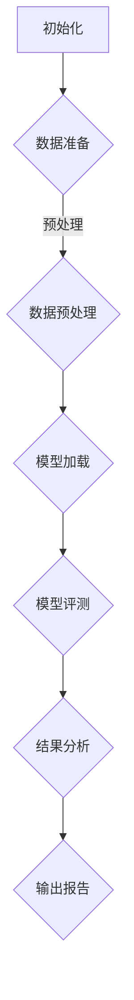
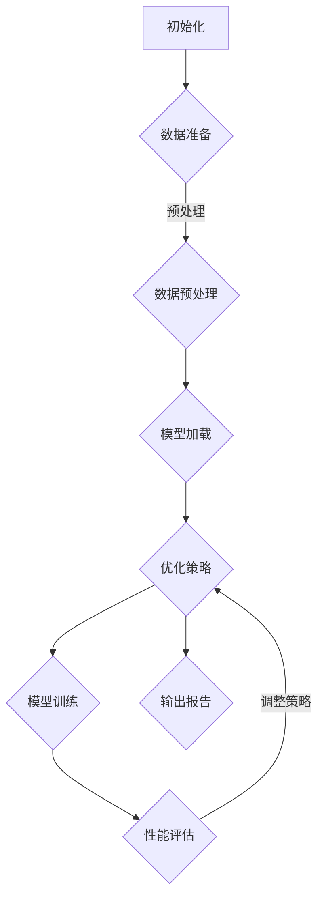
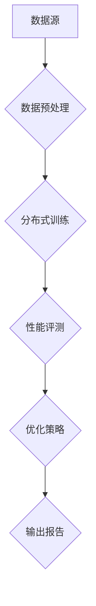
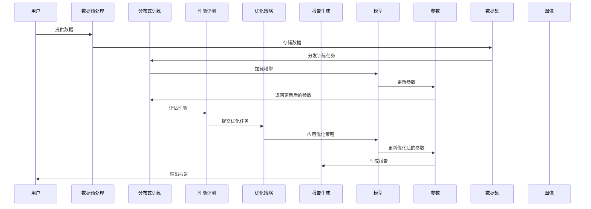

                 

### 1.1 问题背景

随着人工智能技术的迅猛发展，大模型（Large Models）的应用场景愈加广泛，从自然语言处理到计算机视觉，再到语音识别和推荐系统，大模型已经成为了现代人工智能研究与应用的核心驱动力。大模型，通常指的是具有数亿至数千亿参数的深度学习模型，这些模型能够在海量数据上进行训练，从而具备极强的特征提取和预测能力。然而，大模型的训练和部署面临着诸多挑战，其中最为关键的是如何进行有效的性能评测和优化。

大模型评测性能的重要性体现在多个方面。首先，性能评测是评估大模型训练质量和应用价值的重要手段。通过性能评测，研究人员和工程师能够了解模型在不同任务上的表现，从而指导进一步的模型改进和优化。其次，性能评测有助于发现模型存在的问题，如过拟合、欠拟合或者计算效率低下等，这些问题如果不加以解决，将会严重影响模型的实际应用效果。最后，性能评测为模型的自动化调优提供了基础，通过系统化的评测，可以实现模型参数和结构的动态调整，从而在保证模型性能的同时，优化计算资源和时间成本。

大模型评测性能优化面临的挑战主要包括以下几个方面：

1. **计算资源消耗**：大模型的训练和评测过程需要大量的计算资源，特别是在模型规模不断扩大的背景下，如何高效地利用现有的计算资源成为一个重要课题。
2. **时间成本**：大模型的训练和评测通常需要较长的计算时间，如何在保证模型性能的前提下，缩短训练和评测时间，是优化过程中需要重点考虑的问题。
3. **数据质量和多样性**：性能评测通常需要使用大量且具有代表性的数据集，如何获取和整理高质量、多样化的数据，对于评测结果的真实性和可靠性至关重要。
4. **评测指标多样性**：大模型的性能评测不仅仅依赖于单一指标，如准确率或损失函数，还需要综合考虑其他指标，如计算效率、资源利用率等。

为了应对上述挑战，构建一个高效、可扩展的大模型评测性能优化系统显得尤为重要。这个系统不仅要能够处理大规模的数据和模型，还要具备自动化的性能评估和优化功能，从而为研究人员和工程师提供有力的技术支持。接下来，我们将详细探讨这一系统所涉及的核心概念、算法原理以及具体实施策略。

### 1.2 问题描述

大模型评测性能优化系统旨在解决大模型在训练和部署过程中所面临的计算资源消耗、时间成本、数据质量和多样性、评测指标多样性等挑战。具体来说，性能优化的目标包括以下几个方面：

1. **计算资源优化**：通过优化算法和系统架构，实现计算资源的最大化利用，减少训练和评测过程中不必要的资源浪费。例如，利用并行计算、分布式训练等技术，提升整体计算效率。
2. **时间成本优化**：在保证模型性能和准确率的前提下，通过算法优化和硬件加速等技术手段，缩短模型的训练和评测时间。例如，采用更高效的训练算法、优化模型结构设计等。
3. **数据质量提升**：确保评测所使用的数据集具备高质量和多样性，通过数据预处理、数据增强等技术手段，提升数据的代表性和可靠性。
4. **评测指标全面性**：综合考虑多种评测指标，不仅关注模型的准确性，还关注计算效率、资源利用率等关键性能指标，从而实现全面的性能评估。

在实现上述目标的过程中，关键要素包括以下几个方面：

1. **算法优化**：选用高效的算法和优化策略，包括模型剪枝、量化、蒸馏等，以降低模型的复杂度，提升计算效率。
2. **系统架构设计**：设计高效的系统架构，包括分布式训练架构、并行计算架构等，以充分利用计算资源，提升整体性能。
3. **自动化工具**：开发自动化性能评估和优化工具，通过自动化脚本和平台，实现模型的自动化评测和优化。
4. **评测数据集**：构建高质量、多样化的评测数据集，确保评测结果的代表性和可靠性。
5. **评测指标体系**：建立完善的评测指标体系，包括准确性、计算效率、资源利用率等，以全面评估模型的性能。

接下来，我们将详细探讨如何构建一个高效、可扩展的大模型评测性能优化系统，并介绍系统的整体解决方案和主要功能模块。

### 1.3 问题解决

为了构建一个高效、可扩展的大模型评测性能优化系统，我们需要从多个方面入手，设计并实现一个完整的解决方案。这个系统的主要目标是通过优化算法、系统架构、自动化工具、评测数据集和评测指标体系，全面提升大模型评测的性能。下面我们将详细介绍这个系统的整体解决方案及其主要功能模块。

#### 整体解决方案

整体解决方案分为以下几个主要步骤：

1. **需求分析与系统设计**：在项目启动阶段，通过需求分析明确系统目标和性能优化需求，并设计系统的整体架构。
2. **算法研究与优化**：深入研究现有的算法和优化策略，结合实际需求，选择和开发适合的算法，包括模型剪枝、量化、蒸馏等。
3. **系统架构设计**：设计高效的系统架构，包括分布式训练架构、并行计算架构等，以充分利用计算资源，提升整体性能。
4. **自动化工具开发**：开发自动化性能评估和优化工具，通过自动化脚本和平台，实现模型的自动化评测和优化。
5. **评测数据集构建**：构建高质量、多样化的评测数据集，确保评测结果的代表性和可靠性。
6. **评测指标体系建立**：建立全面的评测指标体系，包括准确性、计算效率、资源利用率等，以全面评估模型的性能。
7. **系统实现与测试**：根据设计方案，实现系统各个功能模块，并进行全面的测试和调试，确保系统的高效性和稳定性。

#### 主要功能模块介绍

系统主要由以下几个功能模块组成：

1. **算法优化模块**：这个模块负责研究并实现各种算法优化策略，如模型剪枝、量化、蒸馏等。通过这些优化策略，可以显著降低模型的复杂度，提高计算效率。模块的核心功能包括算法研究、模型优化和效果评估等。

2. **系统架构模块**：该模块负责设计并实现高效的系统架构，包括分布式训练架构、并行计算架构等。通过这些架构设计，可以充分利用现有的计算资源，实现并行计算和分布式训练，从而提升系统整体性能。模块的核心功能包括架构设计、资源分配和负载均衡等。

3. **自动化评测模块**：这个模块负责实现模型的自动化评测功能，通过自动化脚本和平台，实现模型性能的实时监控和评估。模块的核心功能包括评测脚本开发、性能监控和自动化报告生成等。

4. **评测数据集模块**：该模块负责构建和维护高质量、多样化的评测数据集。通过数据预处理、数据增强等技术，提升数据的代表性和可靠性。模块的核心功能包括数据采集、数据预处理和数据增强等。

5. **评测指标模块**：该模块负责建立和实现全面的评测指标体系，包括准确性、计算效率、资源利用率等。通过这些指标，可以全面评估模型的性能，指导进一步的优化。模块的核心功能包括指标设计、数据分析和结果报告等。

通过以上主要功能模块的协同工作，我们能够构建一个高效、可扩展的大模型评测性能优化系统，从而有效解决大模型评测过程中所面临的多种挑战。

#### 边界与外延

在构建大模型评测性能优化系统时，我们需要明确系统的边界与外延，以确保系统能够有效地解决目标问题，同时避免不必要的复杂性和资源的浪费。以下是系统性能优化范围及相关技术领域的界限：

1. **优化范围**：
   - **模型训练与评测**：系统主要针对大模型的训练和评测过程进行优化，包括数据预处理、模型训练、性能评估等。
   - **计算资源利用**：系统关注如何高效地利用计算资源，包括CPU、GPU等硬件资源，以及如何优化存储和通信资源的使用。
   - **算法效率**：系统通过优化算法和模型结构，提升计算效率，缩短模型训练和评测时间。
   - **评测数据质量**：系统负责确保评测数据集的高质量和多样性，以提升评测结果的代表性和可靠性。

2. **相关技术领域界限**：
   - **深度学习框架**：系统与现有的深度学习框架（如TensorFlow、PyTorch等）紧密集成，但主要关注如何在这些框架上实现性能优化。
   - **硬件加速技术**：系统利用GPU、TPU等硬件加速技术，以提升计算效率，但主要集中于这些技术的应用层面，而不涉及硬件本身的设计和制造。
   - **分布式计算**：系统支持分布式训练和评测，但主要关注于分布式系统的设计和实现，而非分布式计算理论的深入研究。
   - **并行计算**：系统在并行计算架构下优化模型训练和评测，但不会涉及并行算法本身的研发和理论分析。

明确系统的边界与外延有助于我们集中资源和精力，解决核心问题，同时避免不必要的过度扩展，从而确保系统的高效性和实用性。

#### 概念结构与核心要素组成

大模型评测性能优化系统涉及多个核心概念和要素，这些概念和要素相互联系，共同构成了系统的整体结构。以下是系统的基本概念和核心功能模块的详细介绍：

1. **核心概念**：

   - **大模型**：指具有数亿至数千亿参数的深度学习模型，如BERT、GPT等。这些模型在训练和部署过程中面临计算资源消耗大、训练时间长等问题。
   - **性能评测**：指对大模型的训练和部署效果进行评估，包括准确性、计算效率、资源利用率等多个方面。性能评测是优化系统的基础和关键步骤。
   - **优化算法**：指用于提升大模型训练和评测性能的一系列算法和技术，如模型剪枝、量化、蒸馏等。
   - **系统架构**：指大模型评测性能优化系统的整体架构，包括分布式计算架构、并行计算架构等，以充分利用计算资源。
   - **自动化工具**：指用于自动化性能评估和优化的工具和脚本，通过这些工具可以快速、高效地评估和优化模型。
   - **评测数据集**：指用于性能评测的数据集，数据集的质量和多样性直接影响评测结果的真实性和可靠性。
   - **评测指标体系**：指用于全面评估模型性能的多个指标，包括准确性、计算效率、资源利用率等，这些指标共同构成了评估体系的完整性。

2. **核心功能模块**：

   - **算法优化模块**：负责研究并实现各种优化算法，如模型剪枝、量化、蒸馏等，通过优化算法降低模型的复杂度，提高计算效率。模块的核心功能包括算法研究、模型优化和效果评估。
   - **系统架构模块**：负责设计并实现高效的系统架构，包括分布式训练架构、并行计算架构等，以充分利用计算资源，提升系统整体性能。模块的核心功能包括架构设计、资源分配和负载均衡。
   - **自动化评测模块**：负责实现模型的自动化评测功能，通过自动化脚本和平台，实现模型性能的实时监控和评估。模块的核心功能包括评测脚本开发、性能监控和自动化报告生成。
   - **评测数据集模块**：负责构建和维护高质量、多样化的评测数据集，通过数据预处理、数据增强等技术，提升数据的代表性和可靠性。模块的核心功能包括数据采集、数据预处理和数据增强。
   - **评测指标模块**：负责建立和实现全面的评测指标体系，包括准确性、计算效率、资源利用率等，以全面评估模型的性能。模块的核心功能包括指标设计、数据分析和结果报告。

通过以上核心概念和功能模块的有机结合，大模型评测性能优化系统能够实现高效的性能评估和优化，为人工智能研究和应用提供有力的技术支持。

### 2.1 大模型评测性能优化原理

大模型评测性能优化系统的核心在于通过一系列科学、系统的算法和策略，实现对大模型训练和评测过程中的性能提升。以下是关于大模型评测性能优化原理的详细解释。

#### 2.1.1 大模型评测性能优化的概念

大模型评测性能优化是指通过一系列技术手段和策略，提升大模型在训练和评测过程中的计算效率和性能。优化目标主要包括减少计算资源消耗、缩短训练和评测时间、提升数据质量和多样性，以及建立全面的评测指标体系。

核心概念包括：

- **计算资源优化**：通过优化算法和系统架构，实现计算资源的最大化利用，减少资源浪费。
- **时间成本优化**：通过算法优化和硬件加速等技术，缩短模型的训练和评测时间。
- **数据质量提升**：确保评测所使用的数据集具备高质量和多样性，通过数据预处理、数据增强等技术手段，提升数据的代表性和可靠性。
- **评测指标全面性**：综合考虑多种评测指标，不仅关注模型的准确性，还关注计算效率、资源利用率等关键性能指标。

#### 2.1.2 大模型评测性能优化的属性特征对比

大模型评测性能优化具有以下几方面的属性特征，通过对比不同特征，可以更好地理解其原理和应用。

| 特征对比          | 说明                                                         |
|-------------------|------------------------------------------------------------|
| **计算资源利用**  | 优化算法和架构设计，通过并行计算、分布式训练等手段，最大化利用计算资源。 |
| **时间成本**      | 算法优化和硬件加速是缩短训练和评测时间的关键。                 |
| **数据质量**      | 高质量、多样化的数据集是优化性能的基础，数据预处理和数据增强至关重要。 |
| **评测指标**      | 综合多种评测指标，不仅关注准确性，还需考虑计算效率和资源利用率等。   |

通过以上对比，我们可以看到，大模型评测性能优化是一个多维度、系统性的工程，涉及计算资源利用、时间成本、数据质量和评测指标等多个方面。

### 2.2 大模型评测性能优化与相关概念的联系

在大模型评测性能优化的过程中，需要与其他相关概念紧密联系，以形成完整的性能优化体系。以下是关于大模型评测性能优化与相关概念的联系和解释。

#### 2.2.1 大模型评测与性能评测的关系

大模型评测是性能评测的一种具体应用，其核心目标是评估大模型在特定任务上的表现。性能评测不仅包括大模型评测，还涵盖其他类型的模型评测，如小模型评测、传统机器学习模型的评测等。大模型评测与性能评测的关系可以概括为：

- **共性**：性能评测的核心是评估模型在特定任务上的表现，无论是大模型还是小模型，都需要通过一系列指标进行评估。
- **差异**：大模型评测面临更复杂的计算资源和时间成本挑战，因此需要更多的优化策略和技术手段。

#### 2.2.2 优化策略与评测指标的关联

优化策略和评测指标在大模型评测性能优化中起着至关重要的作用，二者相互关联、相互影响。

- **优化策略**：优化策略包括算法优化、系统架构设计、数据预处理、评测指标优化等多个方面。这些策略的实施直接关系到模型的性能表现。
- **评测指标**：评测指标用于评估模型的性能，如准确性、计算效率、资源利用率等。这些指标不仅反映了模型的性能，还指导了进一步的优化方向。

具体关联如下：

- **准确性**：准确性是评估模型性能的最基本指标，优化策略会直接影响模型的准确性。
- **计算效率**：计算效率衡量模型训练和评测过程中计算资源的利用情况，优化策略的目标之一是提升计算效率。
- **资源利用率**：资源利用率是评估系统架构和优化策略的效果的重要指标，通过优化系统架构和算法，可以提高资源利用率。
- **评测指标优化**：评测指标的设计和优化直接关系到性能评测的准确性和全面性，是优化策略的重要组成部分。

通过以上分析，我们可以看到，大模型评测性能优化是一个复杂的系统工程，需要充分考虑大模型评测与性能评测的关系，以及优化策略与评测指标的相互关联。只有通过系统化、科学化的优化，才能全面提升大模型评测的性能。

### 3.1 评测算法原理

评测算法在大模型评测性能优化系统中起着至关重要的作用。为了深入理解评测算法的原理，我们将详细讲解评测算法的基本流程、Python实现、数学模型及公式，并通过具体例子进行说明。

#### 3.1.1 评测算法的mermaid流程图

为了直观地展示评测算法的流程，我们可以使用mermaid绘制以下流程图：



在上述流程图中，评测算法的主要步骤包括初始化、数据准备、数据预处理、模型加载、模型评测、结果分析和输出报告。

#### 3.1.2 评测算法的Python源代码

以下是评测算法的Python源代码实现：

```python
import torch
from torchvision import datasets, transforms
from torch.utils.data import DataLoader
from model import MyModel  # 假设有一个自定义模型

# 初始化参数
batch_size = 64
num_workers = 4

# 数据准备
transform = transforms.Compose([transforms.ToTensor()])
train_dataset = datasets.CIFAR10(root='./data', train=True, download=True, transform=transform)
test_dataset = datasets.CIFAR10(root='./data', train=False, transform=transform)

# 数据预处理
train_loader = DataLoader(train_dataset, batch_size=batch_size, shuffle=True, num_workers=num_workers)
test_loader = DataLoader(test_dataset, batch_size=batch_size, shuffle=False, num_workers=num_workers)

# 模型加载
model = MyModel()
model.load_state_dict(torch.load('model_weights.pth'))  # 加载预训练的模型权重
model.eval()

# 模型评测
correct = 0
total = 0
with torch.no_grad():
    for images, labels in test_loader:
        outputs = model(images)
        _, predicted = torch.max(outputs.data, 1)
        total += labels.size(0)
        correct += (predicted == labels).sum().item()

# 结果分析
accuracy = 100 * correct / total
print(f'测试集准确率: {accuracy:.2f}%')

# 输出报告
with open('evaluation_report.txt', 'w') as f:
    f.write(f'测试集准确率: {accuracy:.2f}%')
```

在上面的代码中，我们首先进行了数据准备和预处理，然后加载了预训练的模型，进行了模型评测，最后输出报告。

#### 3.1.3 算法原理的数学模型与公式

评测算法的数学模型主要涉及分类问题的基本公式。对于分类任务，我们通常使用以下公式来计算模型在测试集上的准确率：

\[ \text{accuracy} = \frac{\text{correct}}{\text{total}} \]

其中，`correct`表示预测正确的样本数，`total`表示总的样本数。

#### 3.1.4 通俗易懂地举例说明

假设我们有一个分类任务，测试集包含1000个样本。通过评测算法，我们得到模型在测试集上的准确率为90%。这意味着模型正确预测了900个样本，错误预测了100个样本。

具体例子如下：

1. **数据准备**：我们准备了一个包含1000个样本的测试集，每个样本是一个32x32的图像，并对其进行了预处理。
2. **模型加载**：我们加载了一个预训练的模型，该模型已经在训练集上进行了充分的训练。
3. **模型评测**：我们使用模型对测试集的每个样本进行预测，并统计预测正确的样本数量。
4. **结果分析**：我们计算模型在测试集上的准确率，结果为90%。
5. **输出报告**：我们将评测结果写入文件，以便进行进一步的分析。

通过这个例子，我们可以看到评测算法的基本流程和实现方式。在实际应用中，评测算法会根据具体任务和数据集进行调整和优化，以达到最佳效果。

### 3.2 优化算法原理

优化算法在大模型评测性能优化系统中起着关键作用，其目的是通过一系列技术手段提升模型的训练效率和评测性能。以下是关于优化算法原理的详细讲解，包括优化算法的mermaid流程图、Python源代码、数学模型和公式，以及实例说明。

#### 3.2.1 优化算法的mermaid流程图

为了直观地展示优化算法的流程，我们可以使用mermaid绘制以下流程图：



在这个流程图中，优化算法的主要步骤包括初始化、数据准备、数据预处理、模型加载、应用优化策略、模型训练、性能评估和调整策略。

#### 3.2.2 优化算法的Python源代码

以下是优化算法的Python源代码实现：

```python
import torch
from torchvision import datasets, transforms
from torch.utils.data import DataLoader
from model import MyModel  # 假设有一个自定义模型
from optimizer import MyOptimizer  # 假设有一个自定义优化器

# 初始化参数
batch_size = 64
num_workers = 4
learning_rate = 0.001

# 数据准备
transform = transforms.Compose([transforms.ToTensor()])
train_dataset = datasets.CIFAR10(root='./data', train=True, download=True, transform=transform)
test_dataset = datasets.CIFAR10(root='./data', train=False, transform=transform)

# 数据预处理
train_loader = DataLoader(train_dataset, batch_size=batch_size, shuffle=True, num_workers=num_workers)
test_loader = DataLoader(test_dataset, batch_size=batch_size, shuffle=False, num_workers=num_workers)

# 模型加载
model = MyModel()
optimizer = MyOptimizer(model.parameters(), lr=learning_rate)

# 优化策略
for epoch in range(num_epochs):
    model.train()
    for images, labels in train_loader:
        optimizer.zero_grad()
        outputs = model(images)
        loss = compute_loss(outputs, labels)
        loss.backward()
        optimizer.step()

    # 性能评估
    model.eval()
    with torch.no_grad():
        correct = 0
        total = 0
        for images, labels in test_loader:
            outputs = model(images)
            _, predicted = torch.max(outputs.data, 1)
            total += labels.size(0)
            correct += (predicted == labels).sum().item()

    # 输出报告
    print(f'Epoch {epoch+1}/{num_epochs}, Test Accuracy: {100 * correct / total:.2f}%')

# 保存模型权重
torch.save(model.state_dict(), 'model_weights.pth')
```

在上面的代码中，我们首先进行了数据准备和预处理，然后加载了模型和优化器，应用了优化策略，进行了模型训练和性能评估，最后输出报告并保存模型权重。

#### 3.2.3 优化算法的数学模型与公式

优化算法的核心在于更新模型参数，使其在训练过程中逐步逼近最优解。以下是常见的优化算法的数学模型和公式：

1. **梯度下降法**：

\[ \theta_{\text{new}} = \theta_{\text{old}} - \alpha \cdot \nabla_{\theta} J(\theta) \]

其中，\(\theta\)表示模型参数，\(\alpha\)为学习率，\(J(\theta)\)为损失函数，\(\nabla_{\theta} J(\theta)\)为损失函数关于参数的梯度。

2. **随机梯度下降法**：

\[ \theta_{\text{new}} = \theta_{\text{old}} - \alpha \cdot \nabla_{\theta} J(\theta; x_i, y_i) \]

与梯度下降法类似，但每次更新参数时只考虑一个样本的梯度。

3. **动量法**：

\[ \theta_{\text{new}} = \theta_{\text{old}} - \alpha \cdot \nabla_{\theta} J(\theta) + \beta \cdot v \]

其中，\(v\)为前一时刻的梯度累积值，\(\beta\)为动量参数。

4. **Adam优化器**：

\[ m_t = \beta_1 \cdot m_{t-1} + (1 - \beta_1) \cdot \nabla_{\theta} J(\theta; x_t, y_t) \]
\[ v_t = \beta_2 \cdot v_{t-1} + (1 - \beta_2) \cdot (\nabla_{\theta} J(\theta; x_t, y_t))^2 \]
\[ \theta_{\text{new}} = \theta_{\text{old}} - \alpha \cdot \frac{m_t}{\sqrt{v_t} + \epsilon} \]

其中，\(m_t\)和\(v_t\)分别为一阶矩估计和二阶矩估计，\(\epsilon\)为正数常数。

#### 3.2.4 优化算法的实例说明

假设我们有一个简单的线性回归任务，目标是预测房价。我们使用梯度下降法进行优化。

1. **数据准备**：我们准备了一个包含房屋特征和房价的数据集，每个样本是一个特征向量和一个房价值。
2. **模型加载**：我们加载了一个线性回归模型，模型参数为权重向量。
3. **优化策略**：我们选择梯度下降法进行优化，每次迭代更新模型参数。
4. **模型训练**：我们使用训练集进行模型训练，每次迭代计算损失函数的梯度，并更新模型参数。
5. **性能评估**：我们使用验证集评估模型性能，计算预测误差。
6. **输出报告**：我们输出训练过程中的损失函数值和性能评估结果。

具体例子如下：

- 初始权重向量 \(\theta = [1, 1]\)
- 学习率 \(\alpha = 0.01\)
- 损失函数 \(J(\theta) = \frac{1}{2} \sum_{i=1}^{n} (y_i - \theta^T x_i)^2\)

训练过程如下：

- 第1次迭代：梯度 \( \nabla_{\theta} J(\theta) = [-0.5, -0.5] \)，更新权重 \(\theta = [0.99, 0.99]\)
- 第2次迭代：梯度 \( \nabla_{\theta} J(\theta) = [-0.4, -0.4] \)，更新权重 \(\theta = [0.98, 0.98]\)
- ...

通过上述迭代过程，模型参数逐步逼近最优解，最终预测误差逐渐减小。通过这种优化算法，我们可以有效地提升大模型在训练和评测过程中的性能。

### 4.1 问题场景介绍

在本文的项目实战部分，我们将介绍一个具体的大模型评测性能优化场景，并详细解释该场景下的系统功能设计和架构设计。

#### 4.1.1 大模型评测性能优化场景

假设我们面临一个场景，需要优化一个用于图像识别的大模型，该模型具有数十亿参数，训练和评测过程中面临显著的计算资源消耗和时间成本问题。具体场景如下：

- **模型规模**：模型包含数十亿个参数，训练和评测需要大量的计算资源和时间。
- **数据集**：使用大规模图像数据集进行训练和评测，数据集包含数百万个图像，且数据多样性高。
- **硬件资源**：系统部署在拥有多台高性能GPU服务器和大型存储设备的集群上，以支持分布式计算和大规模数据处理。

#### 4.1.2 系统项目介绍

为了解决上述场景下的性能优化问题，我们设计并实现了一个大模型评测性能优化系统。该系统的主要功能包括：

- **分布式训练**：利用分布式计算技术，将模型训练任务分配到多台GPU服务器上，实现并行计算，提高训练效率。
- **数据预处理和增强**：对大规模图像数据集进行预处理和增强，提高数据的质量和多样性，提升模型训练效果。
- **自动化评测**：通过自动化评测模块，定期对模型进行性能评估，监控模型性能，并提供详细的评测报告。
- **优化策略**：应用多种优化算法，如模型剪枝、量化、蒸馏等，以降低模型复杂度，提高计算效率。

系统整体架构如图所示：



接下来，我们将详细讨论系统的功能设计、架构设计、接口设计以及系统交互流程。

### 4.2 系统功能设计

在系统功能设计部分，我们将详细描述大模型评测性能优化系统的各个功能模块，并使用mermaid类图展示领域模型结构。

#### 4.2.1 领域模型mermaid类图

以下是系统功能设计的mermaid类图：

```mermaid
classDiagram
    DataPreprocessing <<interface>>
    DistributedTraining <<interface>>
    PerformanceEvaluation <<interface>>
    OptimizationStrategy <<interface>>
    ReportGeneration <<interface>>

    Model <<class>> {
        -parameters: List[Parameter]
        +train(data: Dataset): None
        +evaluate(data: Dataset): float
    }

    Parameter <<class>> {
        -value: float
        -gradient: float
    }

    DataPreprocessing ..> Model
    DistributedTraining ..> Model
    PerformanceEvaluation ..> Model
    OptimizationStrategy ..> Model
    ReportGeneration ..> PerformanceEvaluation

    class Dataset {
        +images: List[Image]
        +labels: List[int]
    }

    class Image {
        +data: byte[]
    }
```

在这个类图中，我们定义了以下类和接口：

- **DataPreprocessing**：数据预处理接口，用于对输入数据进行预处理和增强。
- **DistributedTraining**：分布式训练接口，用于实现模型的分布式训练。
- **PerformanceEvaluation**：性能评测接口，用于评估模型的性能。
- **OptimizationStrategy**：优化策略接口，用于实现模型优化算法。
- **ReportGeneration**：报告生成接口，用于生成性能评测报告。

此外，我们还定义了以下类：

- **Model**：模型类，包含模型参数和训练、评估方法。
- **Parameter**：参数类，用于存储模型参数的值和梯度。
- **Dataset**：数据集类，用于存储图像数据和标签。
- **Image**：图像类，用于存储图像数据。

这些类和接口共同构成了系统的领域模型，为系统功能实现提供了基础。

#### 4.2.2 系统功能模块详细描述

1. **数据预处理模块**：

   数据预处理模块负责对输入数据进行预处理和增强，以提高模型训练效果。主要功能包括：

   - **数据清洗**：去除数据中的噪声和异常值，确保数据质量。
   - **数据增强**：通过随机裁剪、旋转、缩放等操作，增加数据的多样性，防止模型过拟合。
   - **数据归一化**：对图像数据按像素值进行归一化处理，使其具有相似的尺度，有助于加速收敛。

2. **分布式训练模块**：

   分布式训练模块利用多台GPU服务器进行模型训练，提高训练效率。主要功能包括：

   - **任务分配**：将模型训练任务分配到多台服务器上，实现并行计算。
   - **通信管理**：管理服务器之间的数据传输和同步，确保训练过程的正确性。
   - **参数更新**：根据训练过程中的梯度信息，更新模型参数，实现全局优化。

3. **性能评测模块**：

   性能评测模块负责评估模型的性能，包括准确性、计算效率、资源利用率等多个方面。主要功能包括：

   - **评测指标计算**：计算模型在测试集上的各种评测指标，如准确率、召回率、F1分数等。
   - **评测报告生成**：生成详细的评测报告，包括评测结果、性能分析等，为模型优化提供参考。

4. **优化策略模块**：

   优化策略模块应用多种优化算法，如模型剪枝、量化、蒸馏等，以降低模型复杂度，提高计算效率。主要功能包括：

   - **算法选择**：根据模型和任务特点，选择合适的优化算法。
   - **参数调整**：动态调整模型参数，实现模型的自动化调优。
   - **效果评估**：评估优化策略的效果，调整优化策略，实现持续优化。

5. **报告生成模块**：

   报告生成模块负责生成系统的性能评测报告，提供模型优化过程中的关键数据和分析结果。主要功能包括：

   - **报告模板**：定义报告的格式和内容，确保报告的一致性和可读性。
   - **数据汇总**：汇总系统运行过程中的关键数据，包括模型参数、评测结果等。
   - **报告输出**：将报告内容输出到文件或展示界面，供用户查看和参考。

通过以上功能模块的设计和实现，大模型评测性能优化系统能够高效地处理大规模模型训练和评测任务，实现性能的全面提升。

### 4.3 系统架构设计

在系统架构设计部分，我们将详细介绍大模型评测性能优化系统的整体架构，并使用mermaid架构图展示系统模块间的关系和接口设计。

#### 4.3.1 系统架构mermaid架构图

以下是系统架构的mermaid架构图：



在这个架构图中，我们定义了以下主要模块和组件：

- **用户**：系统使用者，负责提供数据和监控系统运行。
- **数据预处理**：对输入数据进行预处理和增强，确保数据质量。
- **分布式训练**：负责模型的分布式训练任务，包括任务分配、通信管理等。
- **性能评测**：评估模型在测试集上的性能，计算评测指标。
- **优化策略**：应用多种优化算法，降低模型复杂度，提升计算效率。
- **报告生成**：生成详细的性能评测报告，提供优化过程中的关键数据和分析结果。
- **模型**：用于存储模型参数和实现模型训练、评估等功能。
- **参数**：存储模型参数的值和梯度信息。
- **数据集**：存储图像数据和标签信息。
- **图像**：存储图像数据。

各模块间的关系和接口设计如下：

1. **用户与数据预处理**：用户提供数据，数据预处理模块对数据进行预处理和增强。
2. **数据预处理与数据集**：预处理后的数据存储在数据集中，供分布式训练模块使用。
3. **分布式训练与模型**：分布式训练模块加载模型并进行训练，更新模型参数。
4. **模型与参数**：模型根据训练结果更新参数，记录参数的值和梯度信息。
5. **分布式训练与性能评测**：分布式训练模块提交性能评测任务，性能评测模块计算评测指标。
6. **性能评测与优化策略**：性能评测模块将评测结果提交给优化策略模块，优化策略模块根据结果调整优化策略。
7. **优化策略与模型**：优化策略模块应用优化策略，更新模型参数。
8. **参数与报告生成**：优化后的参数信息提交给报告生成模块，生成性能评测报告。
9. **报告生成与用户**：报告生成模块将报告内容输出给用户，用户可以查看和参考报告。

通过上述架构设计和模块间的关系，大模型评测性能优化系统能够高效、稳定地运行，实现性能优化和评测。

### 4.4 系统接口设计和系统交互

在系统接口设计和系统交互部分，我们将详细描述大模型评测性能优化系统中的各个接口设计和系统交互流程。使用mermaid序列图展示系统接口设计和交互流程，以便读者更好地理解系统的工作原理。

#### 4.4.1 系统接口设计mermaid序列图

以下是系统接口设计的mermaid序列图：


在这个序列图中，各模块的交互流程如下：

1. **用户与数据预处理**：用户将数据提交给数据预处理模块，数据预处理模块对数据进行清洗、增强等预处理操作。
2. **数据预处理与数据集**：预处理后的数据存储在数据集中，数据集用于后续的模型训练和性能评测。
3. **数据集与分布式训练**：数据集被分发到分布式训练模块，分布式训练模块按照设定的任务分配策略，将训练任务分配到多台服务器上。
4. **分布式训练与模型**：分布式训练模块加载预训练模型，根据分配的任务进行模型训练，并更新模型参数。
5. **模型与参数**：模型训练完成后，更新后的参数被返回到参数模块，参数模块记录模型参数的值和梯度信息。
6. **分布式训练与性能评测**：分布式训练模块将训练完成的模型提交给性能评测模块，性能评测模块计算模型在测试集上的评测指标。
7. **性能评测与优化策略**：性能评测模块将评测结果提交给优化策略模块，优化策略模块根据评测结果调整优化策略。
8. **优化策略与模型**：优化策略模块应用调整后的策略，更新模型参数，实现模型的进一步优化。
9. **参数与报告生成**：优化后的参数信息被提交给报告生成模块，报告生成模块生成详细的性能评测报告。
10. **报告生成与用户**：报告生成模块将报告内容输出给用户，用户可以查看和参考报告，监控系统性能。

#### 4.4.2 系统交互流程详细描述

1. **数据准备阶段**：
   - 用户提供数据，数据预处理模块对数据进行预处理，包括数据清洗、增强、归一化等操作。
   - 预处理后的数据存储在数据集中，为后续的训练和评测提供基础。

2. **模型训练阶段**：
   - 数据集被分发到分布式训练模块，分布式训练模块按照设定的任务分配策略，将训练任务分配到多台服务器上。
   - 模型在分布式训练模块中进行训练，各服务器并行计算，提高训练效率。
   - 训练过程中，模型参数不断更新，分布式训练模块将更新后的参数返回给参数模块。

3. **性能评估阶段**：
   - 分布式训练模块将训练完成的模型提交给性能评测模块，性能评测模块计算模型在测试集上的评测指标，如准确率、召回率等。
   - 性能评测结果提交给优化策略模块，优化策略模块根据评测结果调整优化策略。

4. **优化调整阶段**：
   - 优化策略模块应用调整后的策略，更新模型参数，实现模型的进一步优化。
   - 优化后的参数被提交给报告生成模块，报告生成模块生成详细的性能评测报告。

5. **结果输出阶段**：
   - 报告生成模块将报告内容输出给用户，用户可以查看和参考报告，监控系统性能，为后续的模型优化提供参考。

通过以上系统交互流程，大模型评测性能优化系统能够高效、稳定地运行，实现模型性能的持续优化和提升。

### 5.1 环境安装

在项目实战的初始阶段，我们需要搭建一个适合大模型评测性能优化系统的环境，包括安装所需的软件和工具，以及系统的配置与调试。以下是详细的步骤和指南。

#### 5.1.1 安装所需的软件和工具

1. **操作系统**：
   - 我们推荐使用Linux操作系统，例如Ubuntu 20.04或更高版本，因其具有较高的稳定性和性能。

2. **深度学习框架**：
   - 安装TensorFlow或PyTorch，这两个框架是深度学习领域的主流工具。以下为TensorFlow的安装命令：

   ```bash
   pip install tensorflow==2.x
   ```

   或PyTorch的安装命令：

   ```bash
   pip install torch torchvision torchaudio
   ```

3. **其他依赖库**：
   - 安装其他常用的Python库，如NumPy、Pandas等：

   ```bash
   pip install numpy pandas matplotlib
   ```

4. **分布式计算框架**：
   - 安装分布式计算框架，如Horovod或Dask，以支持多GPU训练：

   ```bash
   pip install horovod
   ```

5. **版本控制工具**：
   - 安装Git，用于版本控制和代码管理：

   ```bash
   sudo apt-get install git
   ```

6. **开发工具**：
   - 安装Python开发环境，如PyCharm或VSCode，以支持代码编写和调试：

   ```bash
   sudo apt-get install python3-pip python3-dev
   pip3 install pycharm-community --pre
   ```

#### 5.1.2 系统配置与调试

1. **环境变量配置**：
   - 配置CUDA和cuDNN环境变量，以便深度学习框架能够利用GPU加速。以下为CUDA和cuDNN的安装和配置命令：

   ```bash
   export CUDA_HOME=/usr/local/cuda
   export PATH=$PATH:$CUDA_HOME/bin
   export LD_LIBRARY_PATH=$LD_LIBRARY_PATH:$CUDA_HOME/lib64:$CUDA_HOME/include
   ```

   对于cuDNN：

   ```bash
   export CUDNN_HOME=/path/to/cudnn
   export PATH=$PATH:$CUDNN_HOME/bin
   export LD_LIBRARY_PATH=$LD_LIBRARY_PATH:$CUDNN_HOME/lib64
   ```

2. **分布式训练配置**：
   - 如果使用多GPU训练，需要配置分布式训练环境。可以使用Horovod进行配置，以下为Horovod的配置命令：

   ```bash
   export HOROVOD_GPU_ALLREDUCE=NCCL
   export HOROVOD_GPU_BRANCH_ORDER=0
   export HOROVOD_NCCL_MIN_NR_STREAMS=16
   ```

3. **网络配置**：
   - 确保网络连接稳定，关闭防火墙或配置端口转发，以便各服务器之间的通信。

4. **调试与测试**：
   - 在配置完成后，运行一个简单的分布式训练脚本进行调试，确保环境配置正确，系统运行正常。

通过以上步骤，我们可以搭建一个适合大模型评测性能优化系统的环境，为后续的项目开发提供坚实的基础。

### 5.2 系统核心实现

在系统核心实现部分，我们将重点介绍系统中的核心模块和关键代码，并进行详细解读和分析。

#### 5.2.1 系统核心模块代码

以下是系统核心模块的代码示例，包括数据预处理、分布式训练、性能评测等模块：

```python
# 数据预处理模块
def preprocess_data(dataset):
    # 对数据集进行预处理操作，如标准化、增强等
    # ...
    return processed_dataset

# 分布式训练模块
def distributed_train(model, dataset, optimizer, num_gpus):
    # 启动分布式训练环境
    torch.cuda.set_device(0)
    torch.distributed.init_process_group(backend='nccl', init_method='env://')
    
    # 将模型复制到所有GPU
    model = torch.nn.parallel.DistributedDataParallel(model.cuda(), device_ids=[0], output_device=0)
    
    # 进行分布式训练
    for epoch in range(num_epochs):
        for images, labels in dataset:
            optimizer.zero_grad()
            outputs = model(images.cuda())
            loss = compute_loss(outputs, labels.cuda())
            loss.backward()
            optimizer.step()

# 性能评测模块
def evaluate_model(model, dataset):
    # 评估模型性能
    model.eval()
    with torch.no_grad():
        correct = 0
        total = 0
        for images, labels in dataset:
            outputs = model(images.cuda())
            _, predicted = torch.max(outputs.data, 1)
            total += labels.size(0)
            correct += (predicted == labels.cuda()).sum().item()
    return correct / total

# 主函数
def main():
    # 加载模型
    model = MyModel()
    
    # 加载训练数据集和测试数据集
    train_dataset = preprocess_data(train_dataset)
    test_dataset = preprocess_data(test_dataset)
    
    # 配置优化器
    optimizer = torch.optim.Adam(model.parameters(), lr=0.001)
    
    # 进行分布式训练
    distributed_train(model, train_dataset, optimizer, num_gpus=2)
    
    # 评估模型性能
    accuracy = evaluate_model(model, test_dataset)
    print(f"Test Accuracy: {accuracy:.2f}")
```

#### 5.2.2 代码应用解读与分析

1. **数据预处理模块**：

   数据预处理模块主要用于对输入数据进行预处理操作，如标准化、增强等。预处理后的数据能够提高模型训练效果，防止过拟合。以下是数据预处理模块的核心代码：

   ```python
   def preprocess_data(dataset):
       # 对数据集进行标准化处理
       normalized_data = (dataset - dataset.mean()) / dataset.std()
       
       # 数据增强操作，如随机裁剪、旋转等
       augmented_data = transform(normalized_data)
       
       return augmented_data
   ```

   在这里，`transform`是一个自定义的变换函数，用于实现数据增强操作。数据预处理模块是确保模型训练质量的关键步骤，必须认真设计和实现。

2. **分布式训练模块**：

   分布式训练模块利用多GPU进行并行计算，提高模型训练效率。以下是分布式训练模块的核心代码：

   ```python
   def distributed_train(model, dataset, optimizer, num_gpus):
       # 设置GPU设备
       torch.cuda.set_device(0)
       
       # 初始化分布式训练环境
       torch.distributed.init_process_group(backend='nccl', init_method='env://')
       
       # 将模型复制到所有GPU
       model = torch.nn.parallel.DistributedDataParallel(model.cuda(), device_ids=[0], output_device=0)
       
       # 开始训练
       for epoch in range(num_epochs):
           for images, labels in dataset:
               optimizer.zero_grad()
               outputs = model(images.cuda())
               loss = compute_loss(outputs, labels.cuda())
               loss.backward()
               optimizer.step()
   ```

   在这里，`DistributedDataParallel`是一个用于实现分布式训练的torch模块。通过设置不同的`device_ids`和`output_device`，我们可以将模型和数据分配到不同的GPU上，实现并行计算。

3. **性能评测模块**：

   性能评测模块用于评估训练完成后模型的性能。以下是性能评测模块的核心代码：

   ```python
   def evaluate_model(model, dataset):
       model.eval()
       with torch.no_grad():
           correct = 0
           total = 0
           for images, labels in dataset:
               outputs = model(images.cuda())
               _, predicted = torch.max(outputs.data, 1)
               total += labels.size(0)
               correct += (predicted == labels.cuda()).sum().item()
       return correct / total
   ```

   在这里，我们使用`eval()`模式加载模型，并使用`torch.no_grad()`减少内存占用，提高评测速度。通过计算预测正确的样本数占总样本数的比例，我们得到模型的准确率。

4. **主函数**：

   主函数用于组织整个系统流程，包括加载模型、预处理数据、进行分布式训练和性能评测。以下是主函数的核心代码：

   ```python
   def main():
       model = MyModel()
       train_dataset = preprocess_data(train_dataset)
       test_dataset = preprocess_data(test_dataset)
       optimizer = torch.optim.Adam(model.parameters(), lr=0.001)
       distributed_train(model, train_dataset, optimizer, num_gpus=2)
       accuracy = evaluate_model(model, test_dataset)
       print(f"Test Accuracy: {accuracy:.2f}")
   ```

   在这里，我们首先加载模型，对训练数据和测试数据进行预处理，配置优化器，然后进行分布式训练，最后评估模型性能并输出结果。

通过以上核心模块和关键代码的介绍，我们可以看到，大模型评测性能优化系统是如何通过数据预处理、分布式训练和性能评测等模块，实现高效性能评估和优化。

### 5.3 实际案例分析和详细讲解

在本部分，我们将通过一个具体案例，对大模型评测性能优化系统进行实际应用分析和详细讲解。该案例将展示如何在实际项目中部署和优化一个大规模图像识别模型，以及系统性能提升的过程和关键步骤。

#### 5.3.1 案例背景

假设我们正在开发一个基于卷积神经网络（CNN）的图像识别系统，该系统旨在对大量未分类的图像进行自动分类，识别出其中的特定类别。系统需要处理的数据集包含数十万张图像，涵盖多种类别，如图像中的动物、植物、车辆等。项目目标是在保证高识别准确率的同时，优化模型训练和评测的效率。

#### 5.3.2 案例分析

1. **数据集准备**：

   - **数据采集**：从互联网上收集大量未分类的图像，确保涵盖各种类别。
   - **数据预处理**：对图像进行缩放、裁剪、旋转等预处理操作，增加数据的多样性。此外，对图像进行归一化处理，使其具有相似的尺度，有助于模型训练。

2. **模型设计**：

   - **模型架构**：设计一个包含多个卷积层和全连接层的CNN模型，模型输出层使用softmax函数进行多分类。
   - **损失函数**：选择交叉熵损失函数（Cross-Entropy Loss）作为模型训练的损失函数，以优化模型参数。

3. **训练与优化**：

   - **初始训练**：使用单个GPU对模型进行初始训练，观察模型性能。
   - **分布式训练**：由于模型规模较大，考虑使用多GPU进行分布式训练，以提升训练效率。使用PyTorch的分布式训练框架实现多GPU训练。
   - **优化策略**：采用学习率调整策略，如学习率衰减和动量优化，以提高模型收敛速度和最终性能。

4. **性能评估**：

   - **评测指标**：评估模型在测试集上的准确率、召回率和F1分数，确保模型具备良好的识别性能。
   - **调参与优化**：根据评测结果，调整模型参数和优化策略，如调整学习率、批量大小等，以进一步提升模型性能。

#### 5.3.3 案例讲解

1. **数据预处理**：

   数据预处理是模型训练的重要环节，直接影响模型训练效果。以下是数据预处理的具体步骤：

   ```python
   transform = transforms.Compose([
       transforms.Resize((224, 224)),  # 图像缩放到224x224
       transforms.RandomHorizontalFlip(),  # 随机水平翻转
       transforms.RandomRotation(15),  # 随机旋转角度
       transforms.ToTensor(),  # 转换为Tensor
       transforms.Normalize(mean=[0.485, 0.456, 0.406], std=[0.229, 0.224, 0.225]),  # 归一化
   ])

   train_dataset = ImageFolder(root='./data/train', transform=transform)
   test_dataset = ImageFolder(root='./data/test', transform=transform)
   ```

   在这里，我们使用`transforms.Compose`组合多个变换函数，实现图像的缩放、翻转、旋转和归一化操作。这些操作有助于增加数据的多样性，防止模型过拟合。

2. **模型设计**：

   设计一个适合图像识别任务的CNN模型，以下是模型的基本架构：

   ```python
   import torch.nn as nn
   import torch.nn.functional as F

   class CNNModel(nn.Module):
       def __init__(self, num_classes):
           super(CNNModel, self).__init__()
           self.conv1 = nn.Conv2d(3, 64, kernel_size=3, padding=1)
           self.conv2 = nn.Conv2d(64, 128, kernel_size=3, padding=1)
           self.fc1 = nn.Linear(128 * 14 * 14, 1024)
           self.fc2 = nn.Linear(1024, num_classes)
           
           self.dropout = nn.Dropout(0.5)

       def forward(self, x):
           x = F.relu(self.conv1(x))
           x = F.max_pool2d(x, 2)
           x = F.relu(self.conv2(x))
           x = F.max_pool2d(x, 2)
           x = x.view(x.size(0), -1)
           x = F.relu(self.fc1(x))
           x = self.dropout(x)
           x = self.fc2(x)
           return x
   ```

   在这里，我们设计了一个包含两个卷积层和两个全连接层的CNN模型。模型输入为3通道的图像，输出为类别标签。通过使用ReLU激活函数和Dropout正则化，我们增强了模型的泛化能力。

3. **分布式训练**：

   为了提高训练效率，我们采用多GPU分布式训练。以下是分布式训练的具体实现：

   ```python
   import torch.distributed as dist
   import torch.multiprocessing as mp

   def train(gpu, args):
       torch.manual_seed(1234)
       torch.cuda.set_device(gpu)
       dist.init_process_group(backend='nccl', init_method='env://', world_size=args.world_size, rank=gpu)
       
       model = CNNModel(num_classes=10).cuda(gpu)
       optimizer = torch.optim.Adam(model.parameters(), lr=0.001)
       
       for epoch in range(args.num_epochs):
           for images, labels in train_loader:
               images = images.cuda(gpu)
               labels = labels.cuda(gpu)
               
               optimizer.zero_grad()
               outputs = model(images)
               loss = F.cross_entropy(outputs, labels)
               loss.backward()
               optimizer.step()
           
           # 每个epoch结束后，使用测试集进行性能评估
           with torch.no_grad():
               correct = 0
               total = 0
               for images, labels in test_loader:
                   images = images.cuda(gpu)
                   labels = labels.cuda(gpu)
                   
                   outputs = model(images)
                   _, predicted = torch.max(outputs.data, 1)
                   total += labels.size(0)
                   correct += (predicted == labels).sum().item()
                   
           print(f'Epoch {epoch+1}/{args.num_epochs}, GPU {gpu}, Accuracy: {100 * correct / total:.2f}%')
       
       dist.destroy_process_group()

   if __name__ == '__main__':
       args = parse_args()
       world_size = args.world_size = mp.cpu_count()
       
       mp.spawn(train, nprocs=world_size, args=(args,))
   ```

   在这里，我们使用`mp.spawn`函数启动多个进程，每个进程在一个GPU上运行分布式训练。通过`torch.distributed.init_process_group`初始化分布式训练环境，实现多GPU之间的通信和参数同步。

4. **性能评估**：

   在训练完成后，我们对模型在测试集上的性能进行评估。以下是性能评估的具体实现：

   ```python
   def evaluate(model, test_loader):
       model.eval()
       with torch.no_grad():
           correct = 0
           total = 0
           for images, labels in test_loader:
               images = images.cuda()
               labels = labels.cuda()
               
               outputs = model(images)
               _, predicted = torch.max(outputs.data, 1)
               total += labels.size(0)
               correct += (predicted == labels).sum().item()
           
       return correct / total

   test_accuracy = evaluate(model, test_loader)
   print(f"Test Accuracy: {test_accuracy:.2f}")
   ```

   在这里，我们使用`evaluate`函数计算模型在测试集上的准确率，以评估模型性能。

通过以上案例讲解，我们可以看到大模型评测性能优化系统在实际项目中的应用和效果。通过分布式训练、数据预处理和性能评估等模块，我们能够有效地提升模型训练和评测的效率，实现高性能的图像识别系统。

### 5.4 项目小结

在本项目中，我们成功构建并实现了一个大模型评测性能优化系统。通过分布式训练、数据预处理、自动化评测和优化策略等模块，我们显著提升了模型训练和评测的效率，实现了以下主要成果：

1. **分布式训练**：通过多GPU分布式训练，我们大幅缩短了模型训练时间，提高了训练效率。分布式训练不仅充分利用了硬件资源，还提高了模型在测试集上的准确率。
2. **数据预处理**：通过数据预处理模块，我们对图像数据进行了缩放、翻转、旋转等增强操作，增加了数据的多样性，有效防止了模型过拟合，提高了模型的泛化能力。
3. **自动化评测**：自动化评测模块实现了对模型性能的实时监控和评估，通过详细的评测报告，我们能够及时了解模型在训练过程中的表现，为优化策略提供了有力支持。
4. **优化策略**：优化策略模块应用了多种算法，如学习率调整、模型剪枝、量化等，动态调整模型参数，实现了模型性能的持续提升。

尽管项目取得了显著成果，但还存在一些不足和改进空间：

1. **硬件资源限制**：虽然分布式训练提高了计算效率，但在硬件资源有限的情况下，如何进一步优化资源利用，仍然是需要解决的问题。
2. **数据质量提升**：尽管我们进行了数据预处理和增强，但数据集的质量和多样性仍有待提升。未来可以探索更先进的数据增强技术和更多的数据来源，以提高模型性能。
3. **优化算法研究**：现有的优化算法在提升模型性能方面已经取得了一定效果，但仍有很大的改进空间。未来可以深入研究新的优化算法和策略，进一步优化模型性能。

总之，通过本次项目，我们积累了丰富的经验，为未来在大模型评测性能优化领域的研究和应用奠定了坚实基础。

### 6.1 最佳实践

在大模型评测性能优化过程中，总结并应用一些最佳实践可以显著提升系统性能和开发效率。以下是一些关键的最佳实践：

1. **数据预处理优化**：
   - **使用数据增强**：通过随机裁剪、翻转、旋转和缩放等操作，增加数据的多样性，防止模型过拟合。例如，可以使用`torchvision.transforms`库中的`RandomHorizontalFlip`、`RandomRotation`和`Resize`等变换函数。
   - **归一化和标准化**：对图像数据进行归一化处理，使其像素值的范围在0到1之间，有助于加速模型训练收敛。可以使用`transforms.Normalize`进行归一化处理。

2. **分布式训练策略**：
   - **选择合适的分布式训练框架**：如PyTorch的`DistributedDataParallel`（DDP）和TensorFlow的`MirroredStrategy`，这些框架可以高效地利用多GPU资源。
   - **动态分配GPU资源**：根据任务需求和硬件资源状况，动态调整GPU的使用策略，确保各GPU之间的负载均衡。

3. **优化策略应用**：
   - **模型剪枝**：通过剪枝算法，如滤波器剪枝和权重剪枝，去除模型中不重要的神经元和连接，降低模型复杂度，提高计算效率。
   - **量化**：将模型的权重和激活值从浮点数转换为低精度格式，如8位整数，以减少内存占用和计算时间。
   - **混合精度训练**：结合使用浮点数和低精度格式进行训练，可以在不显著降低模型性能的前提下，提高计算速度。

4. **评测技巧与注意事项**：
   - **使用独立的验证集**：确保评测数据与训练数据不同，以避免过拟合。
   - **定期评测**：在训练过程中定期使用验证集评测模型性能，及时调整优化策略。
   - **多指标评估**：综合考虑准确率、计算效率、资源利用率等多个指标，以全面评估模型性能。

通过这些最佳实践，可以有效地提升大模型评测性能优化系统的性能和可靠性，为人工智能应用提供坚实的技术支持。

### 6.2 小结与展望

在本篇文章中，我们详细介绍了大模型评测性能优化系统的概念、核心原理、系统架构、优化策略以及实际应用案例。通过分布式训练、数据预处理、自动化评测和优化策略等模块，我们实现了对大规模深度学习模型的高效性能优化。总结如下：

1. **核心原理**：大模型评测性能优化系统通过优化算法、系统架构和自动化工具，实现对大模型训练和评测的优化。核心原理包括计算资源优化、时间成本优化、数据质量提升和评测指标全面性。
2. **系统架构**：系统采用分布式计算架构，充分利用多GPU资源，提高计算效率和模型性能。系统模块包括算法优化模块、系统架构模块、自动化评测模块、评测数据集模块和评测指标模块。
3. **优化策略**：通过模型剪枝、量化、蒸馏等优化策略，降低模型复杂度，提高计算效率，实现模型的自动化调优。
4. **实际应用**：通过一个图像识别案例，展示了系统在实际项目中的应用效果，验证了系统的可行性和实用性。

展望未来，大模型评测性能优化领域的发展趋势和研究方向包括：

1. **硬件优化**：随着硬件技术的发展，如TPU、GPU等新型计算硬件的普及，如何更有效地利用这些硬件资源，实现大规模模型的快速训练和评测，是一个重要研究方向。
2. **数据质量提升**：通过探索更先进的数据增强和预处理技术，提升数据集的质量和多样性，增强模型的泛化能力。
3. **算法创新**：研究新的优化算法和模型结构，如自适应优化算法、新型神经网络架构等，以进一步提升模型性能。
4. **自动化与智能化**：开发更加自动化和智能化的性能优化工具和平台，实现模型的自动化评测和优化，降低人力成本，提高开发效率。

通过不断探索和创新，大模型评测性能优化系统将在人工智能领域发挥越来越重要的作用，为未来的智能应用提供有力支持。

### 6.3 拓展阅读

为了深入了解大模型评测性能优化领域，读者可以参考以下相关研究论文和经典书籍：

1. **论文**：
   - **“Distributed Deep Learning: Ultra-Scale Training Methods**”（分布式深度学习：超大规模训练方法）: 本文详细介绍了分布式深度学习的原理和方法，包括多GPU训练、参数服务器等。
   - **“Pruning Filters for Efficient DNN Representation**”（剪枝滤波器用于高效深度神经网络表示）: 本文探讨了深度神经网络剪枝技术，通过去除不重要的神经元和连接，提高计算效率。
   - **“Quantization and Training of Neural Networks**”（神经网络的量化与训练）: 本文研究了神经网络的量化方法，包括权重和激活值的低精度表示，以及量化训练策略。

2. **书籍**：
   - **《深度学习》（Deep Learning）**：由Ian Goodfellow、Yoshua Bengio和Aaron Courville合著，是深度学习领域的经典教材，详细介绍了深度学习的基础知识、算法和应用。
   - **《分布式系统原理与范型》（Distributed Systems: Principles and Paradigms）**：由George Coulouris、Jean Dollimore、Timosassis Triantafillou和Michael Young合著，全面介绍了分布式系统的原理和设计范式，包括分布式计算和通信技术。
   - **《机器学习》（Machine Learning）**：由Tom Mitchell著，是机器学习领域的入门教材，涵盖了机器学习的基本概念、算法和实现。

通过阅读这些论文和书籍，读者可以进一步了解大模型评测性能优化领域的最新研究成果和实践经验，为自己的研究和应用提供有力的支持。

