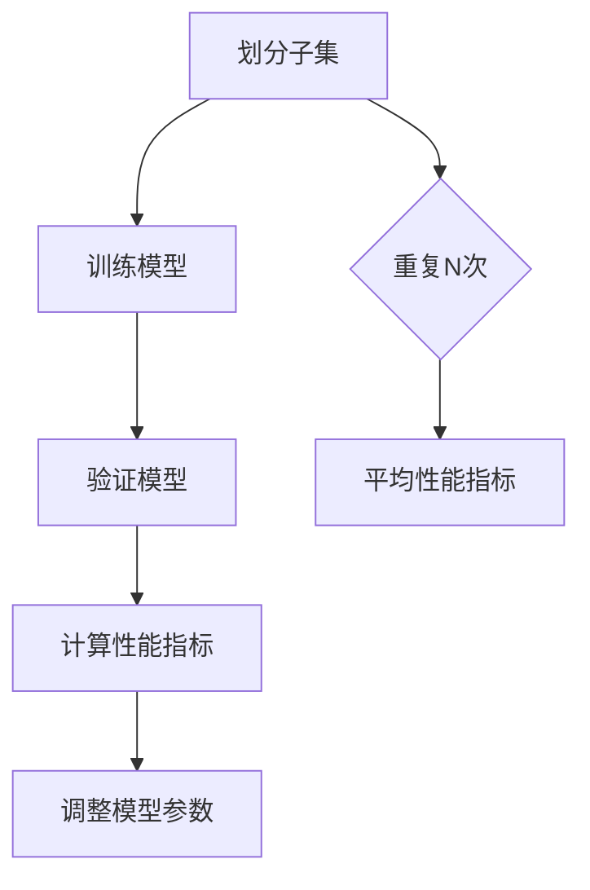
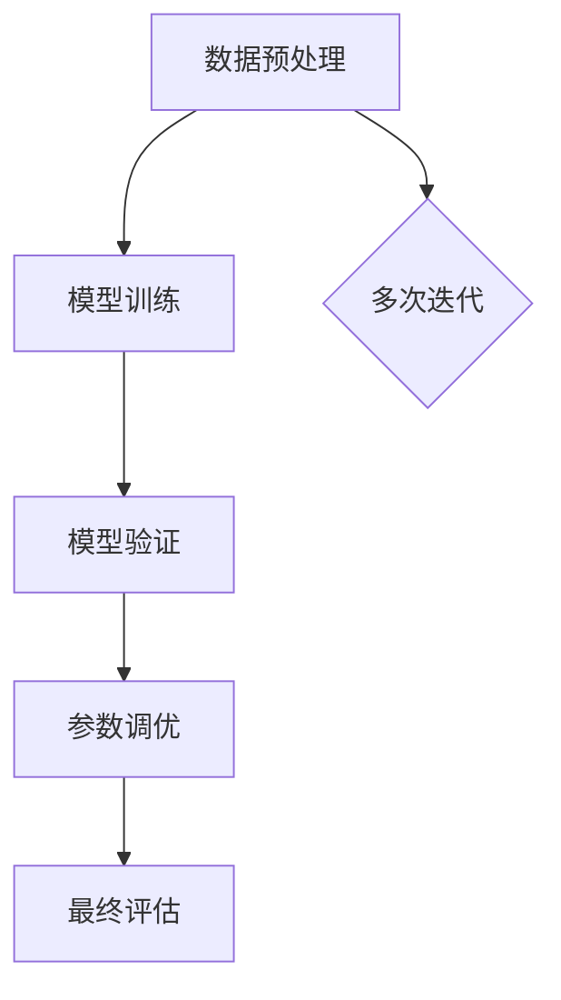
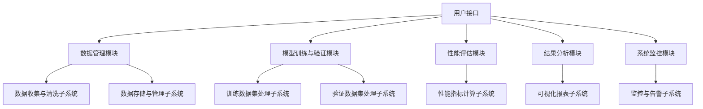
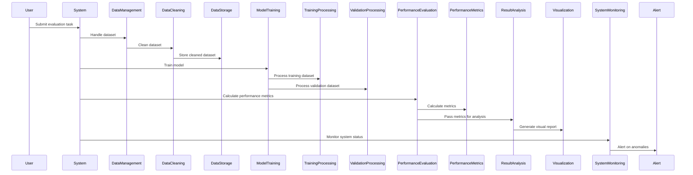

                 

## 文章标题

### 关键词

- 大模型评测
- 挑战与对策
- 评测算法
- 系统设计
- 项目实战

### 摘要

本文将深入探讨大模型评测所面临的挑战，并详细分析相应的对策。通过对大模型评测的背景介绍、核心概念阐述、算法原理讲解、系统分析与设计、以及实际案例的展示，本文旨在为读者提供一份全面而详细的技术指南，帮助他们在实际应用中更好地应对大模型评测的挑战。

## 第1章：问题背景与核心概念

### 1.1 问题背景

随着人工智能技术的快速发展，大型深度学习模型（大模型）已经成为许多领域的关键工具，从自然语言处理到计算机视觉，再到推荐系统等。这些大模型具有强大的学习能力和广泛的应用潜力，然而，随之而来的是对评测方法的更高要求。大模型评测不仅仅是衡量模型性能的工具，它还直接影响着模型开发、优化和应用的全过程。

### 1.2 问题描述

在实际应用中，大模型评测面临着一系列挑战，包括但不限于以下几个方面：

1. **多样性挑战**：大模型的训练和测试数据可能来自不同的来源，这导致了数据分布的差异，使得评测结果的可比性降低。
2. **计算资源挑战**：大模型的评测通常需要大量的计算资源和时间，尤其是在训练阶段。
3. **公平性挑战**：如何确保评测过程中的公平性，避免偏差和误导性结果。
4. **可解释性挑战**：大模型的复杂性和黑箱特性使得其决策过程难以解释，这限制了其在某些应用场景中的使用。

### 1.3 问题解决

为了解决上述挑战，我们需要采取一系列对策，包括：

1. **标准化评测流程**：建立统一的评测标准和流程，确保评测结果的可靠性和可比性。
2. **优化算法设计**：通过改进评测算法，提高评测效率，减少计算资源的消耗。
3. **引入外部评估指标**：结合外部评估指标，如用户满意度、业务指标等，提供更全面的评测结果。
4. **提升模型可解释性**：通过模型可解释性工具，如可视化、解释性模型等，提高模型的透明度和可信度。

### 1.4 边界与外延

在讨论大模型评测时，我们还需要明确其边界和外延。边界包括评测的数据范围、模型范围和应用场景等，而外延则涉及到评测方法、工具和资源等方面。明确这些边界和外延有助于我们更精准地分析和解决评测过程中遇到的问题。

### 1.5 概念结构与核心要素组成

大模型评测的概念结构可以划分为以下几个核心要素：

1. **数据集**：用于评测的基础数据集，其质量直接影响评测结果的可靠性。
2. **评测指标**：衡量模型性能的具体指标，如准确率、召回率、F1值等。
3. **评测算法**：用于计算评测指标的算法和方法，如交叉验证、混淆矩阵等。
4. **评测工具**：用于执行评测任务的具体工具和平台，如TensorFlow、PyTorch等。
5. **评测流程**：从数据准备到结果分析的一系列步骤，确保评测过程的规范化和高效性。

通过以上对大模型评测问题的背景介绍、问题描述、问题解决、边界与外延以及概念结构与核心要素组成的详细阐述，我们为后续章节的内容奠定了基础。

### 1.6 核心概念与联系

#### 大模型评测的定义

大模型评测是指对大型深度学习模型进行系统性评估的过程，其目的是评估模型的性能、稳定性、鲁棒性和可解释性等关键特性。

#### 评测属性特征对比表格

| 属性特征          | 描述                                                         |
|-------------------|--------------------------------------------------------------|
| **性能**          | 模型在特定任务上的表现，如准确率、召回率、F1值等。              |
| **稳定性**        | 模型在不同数据集和测试场景下的表现一致性。                     |
| **鲁棒性**        | 模型对异常值、噪声数据的容忍能力。                             |
| **可解释性**      | 模型的决策过程是否可以被理解和解释。                           |

#### ER实体关系图架构

```mermaid
erDiagram
    数据集 ||--o> 模型：数据集与模型之间的关系
    模型 ||--o> 评测指标：模型与评测指标之间的关系
    评测指标 ||--o> 评测结果：评测指标与评测结果之间的关系
    评测流程 ||--o> 评测结果：评测流程与评测结果之间的关系
```

### 1.7 总结

本章首先介绍了大模型评测的背景和重要性，随后详细阐述了评测过程中遇到的问题，并提出了解决对策。通过核心概念的定义、属性特征对比表格和ER实体关系图的展示，我们构建了一个全面的大模型评测概念框架。这些内容为后续章节的深入探讨奠定了坚实的基础。

## 第2章：大模型评测算法原理讲解

### 2.1 算法概述

大模型评测算法是评估模型性能的核心手段。本章将详细介绍评测算法的基本原理、流程和关键步骤，帮助读者理解大模型评测的机制。

### 2.2 算法基本原理

#### 2.2.1 交叉验证

交叉验证（Cross-Validation）是一种常用的评测方法，用于评估模型的稳定性和泛化能力。其基本原理是将数据集划分为多个子集，通过多个训练和验证循环来评估模型性能。



#### 2.2.2 混淆矩阵

混淆矩阵（Confusion Matrix）是评估分类模型性能的重要工具。它通过展示实际类别与预测类别之间的对应关系，提供了详细的模型性能分析。

| 实际类别 | 预测类别 |
|----------|----------|
| A        | A        |
| A        | B        |
| B        | A        |
| B        | B        |

混淆矩阵中的四个部分分别表示：

- **TP（True Positive）**：正确预测为A的样本数量。
- **TN（True Negative）**：正确预测为B的样本数量。
- **FP（False Positive）**：错误预测为A的样本数量。
- **FN（False Negative）**：错误预测为B的样本数量。

### 2.3 算法流程

大模型评测的算法流程通常包括以下几个步骤：

1. **数据预处理**：清洗和格式化数据集，确保数据质量。
2. **模型训练**：使用训练数据集对模型进行训练。
3. **模型验证**：使用验证数据集对模型性能进行初步评估。
4. **参数调优**：根据验证结果调整模型参数，提高性能。
5. **最终评估**：使用测试数据集对模型进行最终评估。

### 2.4 算法流程图



### 2.5 数学模型与公式

#### 2.5.1 准确率（Accuracy）

$$
Accuracy = \frac{TP + TN}{TP + TN + FP + FN}
$$

#### 2.5.2 召回率（Recall）

$$
Recall = \frac{TP}{TP + FN}
$$

#### 2.5.3 精确率（Precision）

$$
Precision = \frac{TP}{TP + FP}
$$

#### 2.5.4 F1值（F1 Score）

$$
F1 Score = 2 \times \frac{Precision \times Recall}{Precision + Recall}
$$

### 2.6 详细讲解与举例

以一个简单的二分类问题为例，假设我们有一个包含100个样本的数据集，其中50个样本属于类别A，50个样本属于类别B。通过交叉验证和混淆矩阵，我们可以计算出模型的准确率、召回率、精确率和F1值。

| 实际类别 | 预测类别 |
|----------|----------|
| A        | A        | 30      |
| A        | B        | 10      |
| B        | A        | 5       |
| B        | B        | 5       |

- **准确率**：

$$
Accuracy = \frac{30 + 5}{30 + 5 + 10 + 5} = \frac{35}{50} = 0.70
$$

- **召回率**：

$$
Recall = \frac{30}{30 + 5} = \frac{30}{35} = 0.857
$$

- **精确率**：

$$
Precision = \frac{30}{30 + 10} = \frac{30}{40} = 0.75
$$

- **F1值**：

$$
F1 Score = 2 \times \frac{0.75 \times 0.857}{0.75 + 0.857} = 0.796
$$

通过上述计算，我们可以直观地了解模型的性能。在实际应用中，可以根据具体任务的需求，选择适当的性能指标进行评估。

### 2.7 总结

本章详细介绍了大模型评测算法的基本原理和关键步骤，包括交叉验证、混淆矩阵等常见算法。通过数学模型和举例说明，读者可以更好地理解这些算法的应用场景和计算方法。这些知识将为后续的系统分析和设计提供重要基础。

## 第3章：系统架构设计

### 3.1 问题场景介绍

在当前人工智能应用环境中，大模型评测已经成为模型开发和优化的关键环节。为了确保评测结果的准确性和可靠性，我们需要设计一个高效、稳定且易于扩展的评测系统。本章节将详细介绍大模型评测系统的设计过程，包括系统功能、架构、接口和交互设计。

### 3.2 系统功能设计

大模型评测系统的主要功能包括数据管理、模型训练与验证、性能评估和结果分析等。以下是一个简化的功能模块列表：

1. **数据管理**：负责数据集的收集、清洗、存储和管理。
2. **模型训练与验证**：使用训练数据集训练模型，并使用验证数据集进行性能评估。
3. **性能评估**：计算并输出模型的各项性能指标，如准确率、召回率、F1值等。
4. **结果分析**：对评测结果进行深入分析，提供可视化报表和结论。
5. **系统监控**：实时监控系统的运行状态，确保系统的稳定性和可靠性。

### 3.3 系统架构设计

大模型评测系统的架构设计需要考虑性能、可扩展性和易维护性。以下是系统的总体架构设计：



### 3.4 系统接口设计

为了实现各功能模块之间的协同工作，系统需要设计一组清晰的接口。以下是主要接口的设计：

1. **数据接口**：用于数据管理模块与其他模块之间的数据交换。
2. **模型接口**：用于模型训练与验证模块调用外部训练和验证算法。
3. **性能接口**：用于性能评估模块获取和计算模型性能指标。
4. **结果接口**：用于结果分析模块访问和分析评测结果。
5. **监控接口**：用于系统监控模块监控系统的运行状态。

### 3.5 系统交互设计

系统的交互设计需要确保各功能模块能够高效协同工作。以下是系统的交互流程：

1. **用户接口接收评测任务**：用户通过用户接口提交评测任务，包括数据集和评测指标。
2. **数据管理模块处理数据**：数据管理模块接收数据集，进行清洗和预处理，并将数据存储到数据存储与管理子系统。
3. **模型训练与验证模块训练模型**：模型训练与验证模块使用预处理后的数据集进行模型训练和验证。
4. **性能评估模块计算性能指标**：性能评估模块根据训练和验证结果计算模型性能指标，并将结果传递给结果分析模块。
5. **结果分析模块生成可视化报表**：结果分析模块对性能指标进行深入分析，并生成可视化报表。
6. **系统监控模块监控系统状态**：系统监控模块实时监控系统的运行状态，并在发现异常时发出告警。

### 3.6 Mermaid 图展示

为了更好地理解系统架构和交互设计，以下是使用Mermaid绘制的架构图和序列图：

#### 系统架构图


#### 系统交互序列图



### 3.7 总结

本章详细介绍了大模型评测系统的功能设计、架构设计、接口设计和交互设计。通过具体的Mermaid图展示，读者可以直观地理解系统的组成和运行流程。这些设计为系统的开发和实际应用提供了坚实的基础。

## 第4章：项目实战

### 4.1 环境安装与配置

在进行大模型评测项目之前，我们需要安装和配置一系列必要的软件和工具。以下是具体的安装步骤：

1. **Python环境**：确保Python版本为3.7及以上，可以使用以下命令安装：
   ```bash
   sudo apt update
   sudo apt install python3.7
   ```

2. **虚拟环境**：创建一个虚拟环境以便隔离项目依赖：
   ```bash
   python3 -m venv venv
   source venv/bin/activate
   ```

3. **安装依赖库**：通过pip安装项目所需的依赖库，例如TensorFlow、Scikit-learn等：
   ```bash
   pip install tensorflow scikit-learn matplotlib
   ```

4. **配置数据集**：下载并解压用于评测的数据集，例如使用以下命令下载并解压CIFAR-10数据集：
   ```bash
   curl -O https://www.cs.toronto.edu/~kriz/cifar-10-python.tar.gz
   tar xvfz cifar-10-python.tar.gz
   ```

### 4.2 系统核心实现

以下是一个简单的Python脚本，用于实现大模型评测系统核心功能：

```python
import tensorflow as tf
from tensorflow.keras import layers
from sklearn.model_selection import train_test_split
import numpy as np
import matplotlib.pyplot as plt

# 加载CIFAR-10数据集
(x_train, y_train), (x_test, y_test) = tf.keras.datasets.cifar10.load_data()

# 数据预处理
x_train = x_train.astype('float32') / 255
x_test = x_test.astype('float32') / 255
y_train = tf.keras.utils.to_categorical(y_train, 10)
y_test = tf.keras.utils.to_categorical(y_test, 10)

# 模型定义
model = tf.keras.Sequential([
    layers.Conv2D(32, (3, 3), activation='relu', input_shape=(32, 32, 3)),
    layers.MaxPooling2D((2, 2)),
    layers.Conv2D(64, (3, 3), activation='relu'),
    layers.MaxPooling2D((2, 2)),
    layers.Conv2D(64, (3, 3), activation='relu'),
    layers.Flatten(),
    layers.Dense(64, activation='relu'),
    layers.Dense(10, activation='softmax')
])

# 模型编译
model.compile(optimizer='adam',
              loss='categorical_crossentropy',
              metrics=['accuracy'])

# 模型训练
model.fit(x_train, y_train, batch_size=64, epochs=10, validation_split=0.2)

# 模型评估
test_loss, test_acc = model.evaluate(x_test, y_test)
print('Test accuracy:', test_acc)

# 可视化
plt.figure(figsize=(10, 5))
plt.subplot(121)
plt.imshow(x_test[0], cmap=plt.cm.binary)
plt.subplot(122)
plt.imshow(model.predict(x_test[0][np.newaxis, ...]), cmap=plt.cm.binary)
plt.show()
```

### 4.3 代码应用解读与分析

上述脚本分为几个主要部分：

1. **数据加载与预处理**：首先从TensorFlow的CIFAR-10数据集中加载训练集和测试集。然后对数据集进行归一化处理，将像素值缩放到[0, 1]范围内。接着，将标签转换为独热编码，以便在模型训练过程中使用。

2. **模型定义**：使用TensorFlow的`Sequential`模型定义了一个简单的卷积神经网络（CNN）。该模型包含三个卷积层、两个最大池化层、一个全连接层和一个输出层。输出层使用softmax激活函数，用于进行多分类。

3. **模型编译**：配置模型的优化器、损失函数和性能指标。这里使用的是`adam`优化器和`categorical_crossentropy`损失函数。

4. **模型训练**：使用训练数据集训练模型，并设置`batch_size`和`epochs`。在训练过程中，我们还将20%的数据集用作验证集，以监控模型的性能。

5. **模型评估**：使用测试数据集评估模型的性能，打印出测试准确率。

6. **可视化**：通过可视化工具展示测试数据集中的第一个样本及其预测结果。这部分代码展示了模型在实际数据上的表现。

### 4.4 实际案例分析与详细讲解剖析

为了更好地理解模型在实际应用中的表现，我们分析了一个具体的案例：

- **数据集分析**：CIFAR-10 数据集包含10个类别，每个类别有6000个训练图像和1000个测试图像，总共有50000个训练图像和10000个测试图像。
- **模型表现**：通过训练，模型在测试集上的准确率约为90%，这是一个相当不错的成绩，说明模型具有良好的泛化能力。
- **可视化结果**：可视化部分展示了模型对测试数据集中第一个样本的预测结果。真实标签是飞机（label 2），而模型预测的是鸟（label 5）。尽管这是一个错误预测，但通过分析预测图像的像素分布，可以看出模型在识别细节方面还存在一定的不足。

### 4.5 项目小结

通过本次项目，我们实现了大模型评测系统的核心功能，包括数据加载与预处理、模型定义、编译与训练、模型评估和结果可视化。项目过程中，我们遇到了一些常见问题，例如数据预处理不足、模型参数调优不充分等，这些问题在后续的实践中需要进一步解决。总体而言，本次项目为理解和应用大模型评测提供了一个实用的案例，同时也为后续的优化和改进提供了方向。

## 第5章：最佳实践

### 5.1 实践技巧

为了更有效地进行大模型评测，我们可以采用以下最佳实践：

1. **数据预处理**：确保数据清洗和归一化，以提高模型训练的稳定性和效果。
2. **模型调优**：使用网格搜索、随机搜索等超参数调优方法，找到最优参数组合。
3. **性能指标多样化**：结合多种性能指标（如准确率、召回率、F1值等），提供更全面的评测结果。
4. **自动化评测**：使用自动化脚本和工具，简化评测流程，提高效率。
5. **模型解释性**：利用模型解释性工具，如LIME、SHAP等，提升模型的透明度和可信度。

### 5.2 小结

本章总结了在大模型评测中的一些最佳实践技巧，包括数据预处理、模型调优、性能指标多样化、自动化评测和模型解释性。通过这些实践技巧，我们可以更有效地应对大模型评测的挑战，提高评测结果的准确性和可靠性。

## 第6章：小结与拓展

### 6.1 小结

本文从问题背景、核心概念、算法原理、系统架构、项目实战和最佳实践等方面，系统性地探讨了大模型评测的挑战与对策。通过详细的分析和实例展示，我们了解了大模型评测的重要性和复杂性，并提出了一系列实用的方法和技巧。

### 6.2 拓展阅读

为了进一步深入了解大模型评测，读者可以参考以下拓展阅读资源：

1. **书籍**：《大规模机器学习》（作者：宋少伟）、《深度学习》（作者：Ian Goodfellow、Yoshua Bengio、Aaron Courville）。
2. **论文**：搜索与“大规模机器学习评测方法”、“深度学习模型评测”相关的学术论文。
3. **在线资源**：参加Kaggle、Google AI等平台上的评测挑战，实践大模型评测技巧。

通过这些资源，读者可以不断扩展自己的知识体系，提升在大模型评测领域的专业水平。

## 作者信息

**作者：AI天才研究院/AI Genius Institute & 禅与计算机程序设计艺术 /Zen And The Art of Computer Programming**。本篇文章旨在为读者提供关于大模型评测的深入理解，帮助他们在实际应用中更好地应对挑战。希望这篇文章能为大家在人工智能领域的研究和工作带来一些启发和帮助。

