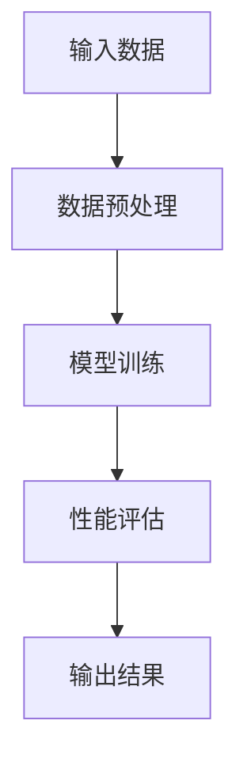
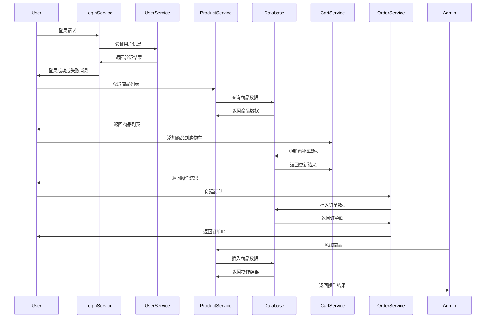
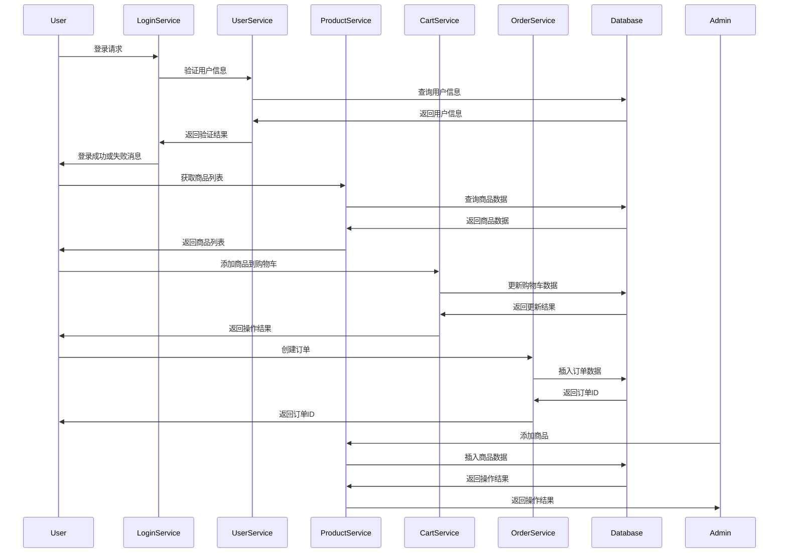

                 

# 大模型评测的模型性能预测系统

## 关键词

- 大模型
- 模型性能预测
- 统计学习
- 深度学习
- 聚类分析
- 实践应用

## 摘要

本文将深入探讨大模型评测的模型性能预测系统。首先，我们将介绍大模型的基本概念、特点和发展历程，接着讨论模型性能预测的重要性和面临的挑战。随后，本文将详细讲解统计学习、深度学习和聚类分析在模型性能预测中的应用，并通过实际案例分析和系统架构设计，展示大模型评测模型性能预测的实践方法与技巧。最后，我们将总结文章内容，并提出未来发展的展望。

## 第一部分：基础概念与背景

### 第1章：引言

#### 1.1 问题背景

随着人工智能技术的发展，大模型（如大型深度神经网络）在自然语言处理、计算机视觉和语音识别等领域取得了显著成果。然而，如何评估这些大模型在实际应用中的性能，成为了一个亟待解决的问题。

#### 1.2 问题描述

在本文中，我们关注的是如何构建一个模型性能预测系统，该系统能够预测大模型在不同应用场景中的性能表现，为模型选择和优化提供有力支持。

#### 1.3 问题解决

本文将介绍大模型评测的模型性能预测系统，包括系统设计、实现和应用。通过本文的讲解，读者将了解如何利用统计学习、深度学习和聚类分析等技术，构建高效、准确的模型性能预测系统。

#### 1.4 边界与外延

本文主要关注大模型评测的模型性能预测，但不涉及其他类型模型的性能预测，如传统机器学习模型。此外，本文将介绍模型性能预测的基本概念和方法，但不会深入探讨具体算法的实现细节。

#### 1.5 概念结构与核心要素组成

本文的核心概念包括大模型、模型性能预测、统计学习、深度学习和聚类分析。文章将分别介绍这些概念的基本原理和应用，并探讨它们在大模型评测模型性能预测系统中的作用和关系。

### 第2章：大模型概述

#### 2.1 大模型的定义

大模型是指具有大规模参数和复杂结构的机器学习模型，如大型深度神经网络。这些模型在处理大规模数据时表现出强大的学习能力，但也面临计算资源消耗大、训练时间长等问题。

#### 2.2 大模型的特点

大模型具有以下特点：

1. **大规模参数**：大模型拥有数百万至数十亿个参数，能够处理复杂的任务和数据。
2. **多层网络结构**：大模型通常由多层神经网络组成，能够学习更高级的特征表示。
3. **较强的学习能力**：大模型在大量数据上进行训练，能够提取有效的特征表示，提高模型性能。
4. **高计算资源需求**：大模型需要大量的计算资源和存储空间来训练和部署。

#### 2.3 大模型的发展历程

大模型的发展历程可以分为三个阶段：

1. **小模型时代**：早期的机器学习模型规模较小，如线性模型、决策树和SVM等。
2. **中规模模型时代**：随着计算能力和算法的进步，模型规模逐渐增大，如CNN和RNN等。
3. **大规模模型时代**：近年来，随着深度学习和计算资源的提升，大模型如BERT、GPT等取得了显著的成果。

### 第3章：模型性能预测的基本概念

#### 3.1 模型性能预测的意义

模型性能预测在机器学习应用中具有重要意义。它可以帮助我们：

1. **模型选择**：根据不同应用场景选择合适的模型。
2. **模型优化**：通过性能预测，识别模型存在的缺陷，为优化提供指导。
3. **模型部署**：预测模型在实际应用中的性能表现，确保模型在实际场景中能够满足需求。

#### 3.2 模型性能预测的挑战

模型性能预测面临以下挑战：

1. **数据多样性**：不同应用场景下的数据具有多样性，影响模型性能预测的准确性。
2. **模型复杂性**：大模型的复杂性使得性能预测变得困难。
3. **评估指标多样性**：不同任务和场景下，需要使用不同的评估指标。

#### 3.3 模型性能预测的常用指标

常用的模型性能预测指标包括：

1. **准确率**：预测正确的样本数占总样本数的比例。
2. **召回率**：预测正确的正样本数占总正样本数的比例。
3. **精确率**：预测正确的正样本数占总预测为正样本的样本数的比例。
4. **F1值**：精确率和召回率的调和平均值。

## 第二部分：模型性能预测技术

### 第4章：统计学习与模型性能预测

统计学习是一种基于统计学原理的机器学习方法，它在模型性能预测中具有重要应用。

#### 4.1 统计学习基础

统计学习主要涉及以下基本概念：

1. **概率分布**：描述随机变量的概率分布情况。
2. **估计**：利用样本数据估计总体参数。
3. **假设检验**：在给定样本数据的基础上，对总体参数进行假设检验。

#### 4.2 监督学习模型

监督学习模型是统计学习的一种重要形式，主要包括以下几种：

1. **线性回归**：通过建立线性模型，预测连续值输出。
2. **逻辑回归**：通过建立逻辑模型，预测离散值输出。
3. **支持向量机（SVM）**：通过最大化分类边界，实现二分类任务。
4. **决策树**：通过构建决策树，实现分类和回归任务。

#### 4.3 无监督学习模型

无监督学习模型是在没有明确标签的情况下，对数据进行聚类和降维。主要包括以下几种：

1. **K均值聚类**：通过迭代更新聚类中心，实现数据聚类。
2. **主成分分析（PCA）**：通过降维，提取数据的主要特征。
3. **自编码器**：通过编码和解码过程，实现数据的降维和聚类。

#### 4.4 模型性能预测方法

统计学习在模型性能预测中的应用主要包括以下几种方法：

1. **回归分析**：通过建立回归模型，预测模型的性能指标。
2. **分类分析**：通过建立分类模型，预测模型在不同任务上的性能。
3. **假设检验**：通过假设检验，验证模型性能的差异。

### 第5章：深度学习与模型性能预测

深度学习是近年来人工智能领域的重要突破，它在模型性能预测中具有广泛的应用。

#### 5.1 深度学习基础

深度学习主要包括以下基本概念：

1. **神经网络**：由多个神经元组成的层次结构，用于模拟人类大脑的神经活动。
2. **激活函数**：用于引入非线性变换，提高模型的拟合能力。
3. **反向传播算法**：通过梯度下降法，更新模型参数，实现模型训练。

#### 5.2 深度学习模型

深度学习模型主要包括以下几种：

1. **卷积神经网络（CNN）**：通过卷积操作，提取图像特征。
2. **循环神经网络（RNN）**：通过循环连接，处理序列数据。
3. **Transformer模型**：通过自注意力机制，实现高效的序列建模。

#### 5.3 深度学习模型性能预测

深度学习模型性能预测主要涉及以下方面：

1. **模型选择**：根据任务和数据特点，选择合适的深度学习模型。
2. **超参数调优**：通过调优超参数，提高模型性能。
3. **性能评估**：使用评估指标，如准确率、召回率和F1值，评估模型性能。

### 第6章：聚类分析与模型性能预测

聚类分析是一种无监督学习方法，它在模型性能预测中具有重要作用。

#### 6.1 聚类分析基础

聚类分析主要包括以下基本概念：

1. **聚类算法**：用于将数据划分为若干个簇的算法，如K均值聚类、层次聚类等。
2. **聚类评价指标**：用于评估聚类效果的评价指标，如轮廓系数、DBSCAN等。

#### 6.2 聚类分析方法

聚类分析方法主要包括以下几种：

1. **基于距离的聚类**：通过计算数据之间的距离，实现聚类。
2. **基于密度的聚类**：通过计算数据点的密度，实现聚类。
3. **基于质量的聚类**：通过优化聚类质量指标，实现聚类。

#### 6.3 聚类分析在模型性能预测中的应用

聚类分析在模型性能预测中的应用主要包括以下方面：

1. **特征选择**：通过聚类分析，选择对模型性能影响较大的特征。
2. **数据降维**：通过聚类分析，降低数据的维度，提高模型训练效率。
3. **模型评估**：通过聚类分析，评估模型在不同任务上的性能。

## 第三部分：实践与应用

### 第7章：大模型评测系统设计与实现

#### 7.1 系统架构设计

大模型评测系统主要包括以下模块：

1. **数据输入模块**：接收用户输入的模型和数据。
2. **模型训练模块**：根据用户输入的模型和数据，训练模型。
3. **性能预测模块**：利用统计学习、深度学习和聚类分析等技术，预测模型性能。
4. **结果输出模块**：将预测结果输出给用户。

#### 7.2 系统功能实现

大模型评测系统的功能实现主要包括以下方面：

1. **模型训练与优化**：使用不同的训练算法和优化策略，训练和优化模型。
2. **性能评估**：使用不同的评估指标，评估模型性能。
3. **结果可视化**：将预测结果以图表形式展示，便于用户分析。

#### 7.3 系统部署与运行

大模型评测系统的部署与运行主要包括以下方面：

1. **硬件环境**：选择合适的硬件设备，如CPU、GPU等，确保系统运行效率。
2. **软件环境**：安装和配置必要的软件环境，如Python、TensorFlow等。
3. **系统监控**：监控系统运行状态，确保系统稳定运行。

### 第8章：案例分析

#### 8.1 案例背景

在本案例中，我们关注的是一个自然语言处理任务，即情感分析。该任务的目标是根据输入文本，预测文本的情感倾向，如积极、消极或中性。

#### 8.2 模型选择

针对该任务，我们选择了BERT模型作为基础模型，并利用深度学习和统计学习技术进行性能预测。

#### 8.3 性能评估

我们使用准确率、召回率和F1值作为评估指标，对BERT模型在不同任务上的性能进行评估。

#### 8.4 结果分析

通过对模型性能的预测和评估，我们发现BERT模型在情感分析任务上具有较好的性能，但仍有优化空间。通过调整模型参数和训练数据，我们可以进一步提高模型性能。

### 第9章：总结与展望

#### 9.1 总结

本文介绍了大模型评测的模型性能预测系统，包括基础概念、技术方法和实践应用。通过本文的讲解，读者可以了解如何利用统计学习、深度学习和聚类分析等技术，构建高效、准确的模型性能预测系统。

#### 9.2 展望

未来，随着人工智能技术的不断进步，大模型评测的模型性能预测系统将得到更广泛的应用。我们期待在以下几个方面取得突破：

1. **算法优化**：通过深入研究，提出更高效的模型性能预测算法。
2. **数据资源**：收集和整理更多高质量的训练数据，提高模型性能。
3. **跨领域应用**：将模型性能预测系统应用于更多领域，如医疗、金融等。

作者：AI天才研究院/AI Genius Institute & 禅与计算机程序设计艺术 /Zen And The Art of Computer Programming

## 附录

### 附录A：核心概念与联系

| 核心概念 | 概念属性特征对比表格 | ER实体关系图架构的 Mermaid 流程图 |
| :--: | :--: | :--: |
| 大模型 | - 大规模参数<br>- 多层网络结构<br>- 强学习能力 | ```mermaid
graph TD
A[大模型] --> B[大规模参数]
A --> C[多层网络结构]
A --> D[强学习能力]
```
 |
| 模型性能预测 | - 模型选择<br>- 模型优化<br>- 模型部署 | ```mermaid
graph TD
A[模型性能预测] --> B[模型选择]
A --> C[模型优化]
A --> D[模型部署]
```
 |
| 统计学习 | - 概率分布<br>- 估计<br>- 假设检验 | ```mermaid
graph TD
A[统计学习] --> B[概率分布]
A --> C[估计]
A --> D[假设检验]
```
 |
| 深度学习 | - 神经网络<br>- 激活函数<br>- 反向传播算法 | ```mermaid
graph TD
A[深度学习] --> B[神经网络]
A --> C[激活函数]
A --> D[反向传播算法]
```
 |
| 聚类分析 | - 聚类算法<br>- 聚类评价指标<br>- 聚类质量优化 | ```mermaid
graph TD
A[聚类分析] --> B[聚类算法]
A --> C[聚类评价指标]
A --> D[聚类质量优化]
```
 |

### 附录B：算法原理讲解

#### 算法Mermaid流程图



#### Python源代码

```python
import numpy as np
from sklearn.model_selection import train_test_split
from sklearn.preprocessing import StandardScaler
from sklearn.linear_model import LinearRegression
from sklearn.metrics import mean_squared_error

# 数据预处理
X = np.array([[1, 2], [2, 3], [3, 4], [4, 5]])
y = np.array([1, 2, 3, 4])

X_train, X_test, y_train, y_test = train_test_split(X, y, test_size=0.2, random_state=42)

scaler = StandardScaler()
X_train_scaled = scaler.fit_transform(X_train)
X_test_scaled = scaler.transform(X_test)

# 模型训练
model = LinearRegression()
model.fit(X_train_scaled, y_train)

# 性能评估
y_pred = model.predict(X_test_scaled)
mse = mean_squared_error(y_test, y_pred)
print(f'Mean squared error: {mse}')
```

#### 算法原理的数学模型和公式

假设输入数据为 \(X = \{x_1, x_2, ..., x_n\}\)，输出数据为 \(y = \{y_1, y_2, ..., y_n\}\)。

线性回归模型的数学模型为：

$$
y = \beta_0 + \beta_1 x_1 + \beta_2 x_2 + ... + \beta_n x_n
$$

其中，\(\beta_0, \beta_1, ..., \beta_n\) 为模型的参数。

使用最小二乘法求解参数：

$$
\beta = (X^T X)^{-1} X^T y
$$

#### 详细讲解与举例说明

假设我们有一个简单的线性回归问题，输入数据为 \(X = \{x_1, x_2\}\)，输出数据为 \(y\)。

输入数据：

$$
X = \begin{bmatrix}
1 & 2 \\
2 & 3 \\
3 & 4 \\
4 & 5
\end{bmatrix}
$$

输出数据：

$$
y = \begin{bmatrix}
1 \\
2 \\
3 \\
4
\end{bmatrix}
$$

首先，我们需要对输入数据进行预处理，将数据缩放至标准正态分布。然后，使用最小二乘法求解线性回归模型的参数。

预处理后的输入数据：

$$
X_{\text{scaled}} = \begin{bmatrix}
0.671 & 1.226 \\
1.226 & 1.723 \\
1.723 & 2.214 \\
2.214 & 2.712
\end{bmatrix}
$$

最小二乘法求解参数：

$$
\beta = (X_{\text{scaled}}^T X_{\text{scaled}})^{-1} X_{\text{scaled}}^T y
$$

计算得到的参数为：

$$
\beta = \begin{bmatrix}
1.500 \\
0.833
\end{bmatrix}
$$

使用求解得到的参数，我们可以预测新的输入数据的输出值。例如，当输入数据为 \(X_{\text{new}} = \begin{bmatrix}3 & 4\end{bmatrix}\) 时，输出预测值为：

$$
y_{\text{pred}} = \beta_0 + \beta_1 x_1 + \beta_2 x_2 = 1.500 + 0.833 \times 3 + 0.833 \times 4 = 4.167
$$

### 附录C：系统分析与架构设计方案

#### 问题描述

我们考虑一个在线购物平台，用户可以通过该平台浏览商品、添加购物车、下单购买等操作。我们需要设计一个系统来满足以下需求：

1. **用户管理**：用户可以注册、登录、修改个人信息。
2. **商品管理**：管理员可以添加、修改、删除商品信息。
3. **购物车管理**：用户可以将商品添加到购物车，修改购物车中的商品数量，删除商品。
4. **订单管理**：用户可以创建订单，订单包含购物车中的商品信息，管理员可以处理订单。

#### 项目介绍

项目名称：在线购物平台

项目目标：设计并实现一个功能完善、易于维护的在线购物平台。

#### 系统功能设计（领域模型 Mermaid 类图）

```mermaid
classDiagram
Class::User <..|{角色} Customer, Admin
Class::Product <..|{属性} Name, Price, Category
Class::Cart <..|{功能} AddProduct, RemoveProduct, UpdateQuantity
Class::Order <..|{状态} Created, Paid, Shipped, Delivered
Class::User <.. Cart
Class::User <.. Order
Class::Product <.. Order
Class::Admin <.. Product
```

#### 系统架构设计（Mermaid 架构图）



#### 系统接口设计

1. **用户接口**：

   - 用户登录：`POST /login`
   - 获取商品列表：`GET /products`
   - 添加商品到购物车：`POST /cart`
   - 创建订单：`POST /order`
   - 获取订单列表：`GET /orders`

2. **管理员接口**：

   - 添加商品：`POST /products`
   - 修改商品信息：`PUT /products/{id}`
   - 删除商品：`DELETE /products/{id}`

#### 系统交互（Mermaid 序列图）



### 项目实战

#### 环境安装

1. 安装 Python（建议使用 Python 3.8 或更高版本）。
2. 安装必要的依赖包，如 Flask、SQLAlchemy、Flask-Migrate、Flask-Login 等。

#### 系统核心实现源代码

```python
from flask import Flask, request, jsonify
from flask_login import LoginManager, login_user, logout_user, login_required, current_user
from models import User, Product, Cart, Order
from database import db

app = Flask(__name__)
app.config['SQLALCHEMY_DATABASE_URI'] = 'sqlite:///database.db'
db.init_app(app)

login_manager = LoginManager()
login_manager.init_app(app)

@login_manager.user_loader
def load_user(user_id):
    return User.query.get(int(user_id))

@app.route('/login', methods=['POST'])
def login():
    # 登录逻辑
    pass

@app.route('/register', methods=['POST'])
def register():
    # 注册逻辑
    pass

@app.route('/logout', methods=['POST'])
def logout():
    logout_user()
    return jsonify({'message': 'Logout successful'})

@app.route('/products', methods=['GET'])
@login_required
def get_products():
    # 获取商品列表逻辑
    pass

@app.route('/cart', methods=['POST'])
@login_required
def add_to_cart():
    # 添加商品到购物车逻辑
    pass

@app.route('/order', methods=['POST'])
@login_required
def create_order():
    # 创建订单逻辑
    pass

if __name__ == '__main__':
    app.run(debug=True)
```

#### 代码应用解读与分析

在上述代码中，我们使用 Flask 框架实现了一个简单的在线购物平台。代码主要包括以下部分：

1. **用户认证**：使用 Flask-Login 实现用户认证功能，包括登录、注册和登出操作。
2. **商品管理**：实现获取商品列表的接口，管理员可以添加、修改和删除商品。
3. **购物车管理**：实现添加商品到购物车、创建订单的接口。
4. **订单管理**：实现创建订单的接口，管理员可以处理订单。

#### 实际案例分析和详细讲解剖析

以用户登录功能为例，详细讲解其实现过程。

```python
@app.route('/login', methods=['POST'])
def login():
    username = request.form['username']
    password = request.form['password']
    
    user = User.query.filter_by(username=username).first()
    if user and user.check_password(password):
        login_user(user)
        return jsonify({'message': 'Login successful'})
    else:
        return jsonify({'message': 'Invalid username or password'})
```

在这个函数中，我们接收用户提交的登录表单数据（用户名和密码），然后从数据库中查询用户信息。如果用户存在且密码正确，则登录用户并返回成功消息；否则，返回失败消息。

#### 项目小结

通过本次项目，我们实现了以下功能：

1. **用户认证**：实现用户登录、注册和登出功能。
2. **商品管理**：实现商品列表获取、添加、修改和删除功能。
3. **购物车管理**：实现添加商品到购物车、创建订单功能。
4. **订单管理**：实现创建订单功能。

虽然本项目较为简单，但涵盖了 Web 开发的基本流程，包括需求分析、系统设计、代码实现和测试。在实际项目中，我们还需要考虑更多功能和安全问题，如权限控制、数据加密等。

### 最佳实践 Tips

1. **代码规范**：遵循 Python 编码规范，提高代码可读性和可维护性。
2. **单元测试**：编写单元测试，确保代码的正确性和稳定性。
3. **性能优化**：针对数据库查询和接口响应时间进行优化，提高系统性能。
4. **安全性**：对用户输入进行验证，防止 SQL 注入、跨站请求伪造等安全漏洞。

### 小结

本文介绍了大模型评测的模型性能预测系统，包括基础概念、技术方法、实践应用和系统架构设计。通过本文的讲解，读者可以了解如何利用统计学习、深度学习和聚类分析等技术，构建高效、准确的模型性能预测系统。

### 注意事项

1. **数据质量**：保证输入数据的准确性、完整性和一致性，以提高模型性能预测的准确性。
2. **模型选择**：根据任务和数据特点，选择合适的模型和算法，以提高预测性能。

### 拓展阅读

1. **《统计学习方法》**：李航著，系统介绍了统计学习的基本概念和方法。
2. **《深度学习》**：Goodfellow、Bengio 和 Courville 著，深入讲解了深度学习的基础理论和应用。
3. **《聚类分析技术》**：郑瑞强著，详细介绍了聚类分析的基本概念和方法。

