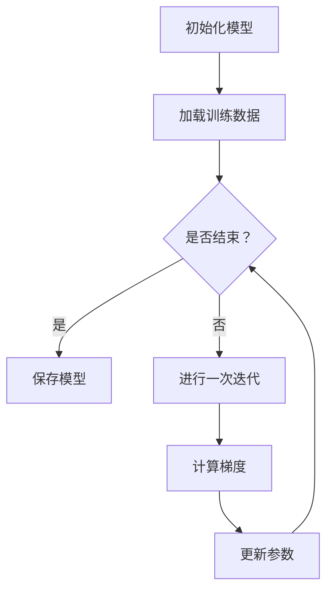
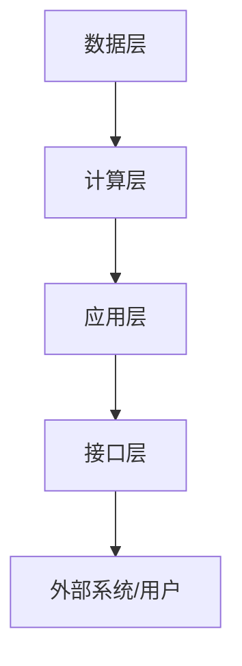
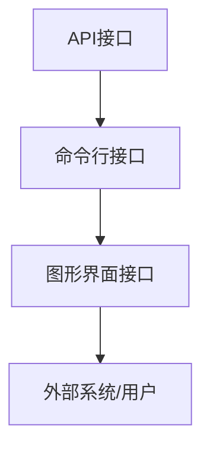
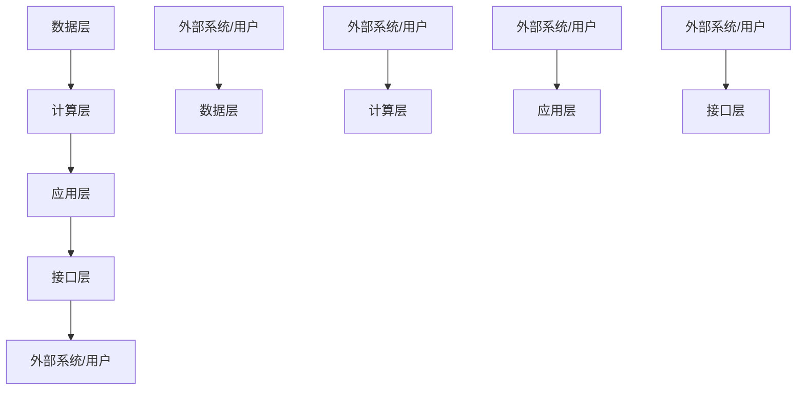

                 

## 《大模型评测的深度学习分析模型》

### 关键词：深度学习、大模型、评测分析、算法原理、数学模型、系统架构

#### 摘要：
本文旨在深入探讨大模型评测的深度学习分析模型，通过系统性的分析和讲解，帮助读者全面了解这一复杂领域的核心概念、算法原理、数学模型以及实际应用。文章结构清晰，内容丰富，旨在为深度学习研究者、算法工程师和数据科学家提供有价值的技术指南。

## 目录大纲

### 第一部分：背景介绍

1. **第1章：问题背景与核心概念**
   - **1.1 问题背景**
   - **1.2 问题描述**
   - **1.3 问题解决**
   - **1.4 边界与外延**
   - **1.5 概念结构与核心要素组成**

2. **第2章：核心概念与联系**
   - **2.1 深度学习基本概念**
   - **2.2 大模型基本概念**
   - **2.3 评测分析模型基本概念**
   - **2.4 各概念之间的关系**

### 第二部分：算法原理讲解

1. **第3章：算法原理**
   - **3.1 算法原理概述**
   - **3.2 算法流程图**
   - **3.3 算法数学模型**
   - **3.4 算法公式详解**
   - **3.5 算法举例说明**

2. **第4章：数学模型和数学公式**
   - **4.1 数学模型概述**
   - **4.2 数学公式详解**
   - **4.3 公式应用举例**

### 第三部分：系统分析与架构设计方案

1. **第5章：系统分析与架构设计**
   - **5.1 问题场景介绍**
   - **5.2 系统功能设计**
   - **5.3 系统架构设计**
   - **5.4 系统接口设计**
   - **5.5 系统交互**

2. **第6章：项目实战**
   - **6.1 环境安装**
   - **6.2 系统核心实现源代码**
   - **6.3 代码应用解读与分析**
   - **6.4 实际案例分析与详细讲解**
   - **6.5 项目小结**

### 第四部分：最佳实践与拓展

1. **第7章：最佳实践 tips**
   - **7.1 实用技巧**
   - **7.2 注意事项**
   - **7.3 拓展阅读**

2. **第8章：小结与展望**
   - **8.1 书籍小结**
   - **8.2 未来展望**

### 引言

在现代人工智能领域，深度学习技术正迅速发展，并成为许多复杂任务的核心驱动力。然而，随着模型的规模不断扩大，如何对这些大模型进行有效的评测成为一个关键挑战。本文将围绕大模型评测的深度学习分析模型展开讨论，通过系统的分析和讲解，帮助读者深入了解这一领域的核心概念、算法原理、数学模型以及实际应用。

首先，我们将介绍问题背景和核心概念，明确深度学习、大模型以及评测分析模型的基本概念，并探讨它们之间的关系。接下来，我们将详细讲解算法原理，通过算法流程图和数学模型，帮助读者理解大模型评测的核心逻辑。此外，我们还将在数学模型章节中深入探讨具体的数学公式，并通过应用举例，使读者能够更好地理解公式的实际应用。

在系统分析与架构设计方案部分，我们将介绍问题场景、系统功能设计、系统架构设计、系统接口设计和系统交互，帮助读者全面了解大模型评测系统的构建过程。随后，通过项目实战章节，我们将详细介绍环境安装、系统核心实现源代码、代码应用解读与分析、实际案例分析与详细讲解，使读者能够将理论知识应用于实际项目中。

最后，在最佳实践与拓展部分，我们将提供一些实用技巧和注意事项，并推荐拓展阅读，帮助读者进一步深入学习和实践。

### 第一部分：背景介绍

#### 第1章：问题背景与核心概念

在现代人工智能领域，深度学习技术已经取得了显著的进展，它通过模拟人脑的神经网络结构，实现了对大量数据的自动特征提取和复杂模式的识别。然而，随着深度学习模型的规模不断扩大，如何对这些大模型进行有效的评测成为了一个关键挑战。本章节将介绍大模型评测的重要性以及相关的核心概念。

#### 1.1 问题背景

深度学习模型的评测是一个复杂的过程，它涉及到多个方面，包括模型的准确性、泛化能力、计算效率和资源消耗等。在大模型的时代，这些问题变得更加突出。一方面，大模型通常具有更高的准确性和更强的泛化能力，这使得它们在许多实际应用中具有巨大的潜力。然而，另一方面，大模型的训练和推理过程需要大量的计算资源和时间，这对计算资源和时间成本提出了更高的要求。

#### 1.2 问题描述

针对大模型评测的问题，我们需要回答以下几个关键问题：

1. **准确性**：如何评估大模型的准确性？我们如何确定一个模型是否足够好？
2. **泛化能力**：大模型在不同数据集上的表现如何？它们是否能够在新的、未见过的数据上保持良好的性能？
3. **计算效率**：大模型的训练和推理过程需要多少时间？我们如何优化这个过程以提高效率？
4. **资源消耗**：大模型对计算资源和存储资源的需求如何？我们如何合理地分配和利用这些资源？

#### 1.3 问题解决

为了解决上述问题，我们需要引入一系列的评测方法和工具。以下是一些常见的问题解决方法：

1. **基准测试**：使用公共数据集进行基准测试，评估模型在不同任务上的表现。
2. **交叉验证**：通过交叉验证，评估模型在不同子数据集上的泛化能力。
3. **计算效率优化**：通过优化算法和数据结构，提高模型的训练和推理效率。
4. **资源管理**：使用高效的数据存储和传输技术，优化资源消耗。

#### 1.4 边界与外延

在讨论大模型评测时，我们需要明确一些边界与外延。首先，大模型的定义并非一成不变，它随着计算资源和算法技术的进步而不断变化。其次，评测方法的适用范围也需要根据具体应用场景进行选择。最后，我们还需要关注评测结果的可解释性和可靠性，以确保评测的公正性和准确性。

#### 1.5 概念结构与核心要素组成

为了更好地理解大模型评测的核心概念，我们可以将其结构分解为以下几个核心要素：

1. **数据集**：评测所需的数据集，包括训练集、验证集和测试集。
2. **模型**：用于评测的深度学习模型，包括输入层、隐藏层和输出层。
3. **评测指标**：用于评估模型性能的指标，如准确率、召回率、F1分数等。
4. **评测方法**：评估模型性能的具体方法，如交叉验证、基准测试等。
5. **优化工具**：用于优化模型性能的工具，如计算效率优化器、资源管理系统等。

通过以上分析，我们可以更好地理解大模型评测的背景和核心概念，为后续的算法原理讲解和系统架构设计打下坚实的基础。

#### 第2章：核心概念与联系

在深入探讨大模型评测的深度学习分析模型之前，我们需要明确几个核心概念，并理解它们之间的关系。这一章节将详细介绍深度学习基本概念、大模型基本概念和评测分析模型基本概念，以帮助读者建立全面的理论框架。

#### 2.1 深度学习基本概念

深度学习是一种机器学习方法，它通过模拟人脑的神经网络结构，实现从大量数据中自动提取特征并进行复杂模式识别。以下是深度学习的几个关键概念：

1. **神经网络**：神经网络是深度学习的基础，它由大量的神经元组成，通过调整神经元之间的权重来学习数据特征。
2. **多层感知机（MLP）**：多层感知机是一种基本的神经网络结构，它包含输入层、隐藏层和输出层。
3. **卷积神经网络（CNN）**：卷积神经网络是一种专门用于图像处理的任务的神经网络，它通过卷积操作提取图像的特征。
4. **循环神经网络（RNN）**：循环神经网络是一种用于序列数据处理的任务的神经网络，它通过记忆状态来处理序列信息。
5. **生成对抗网络（GAN）**：生成对抗网络是一种通过对抗训练生成新数据的神经网络，它在图像生成、数据增强等方面表现出色。

#### 2.2 大模型基本概念

随着深度学习技术的发展，模型的规模逐渐增大，这些大模型在许多复杂任务中表现出色。以下是关于大模型的一些关键概念：

1. **模型大小**：模型大小通常由参数数量和模型结构复杂度决定，大模型具有数百万到数十亿的参数。
2. **训练数据量**：大模型通常需要大量的训练数据来训练模型，以确保模型能够在不同数据集上泛化。
3. **计算资源需求**：大模型的训练和推理过程需要大量的计算资源和时间，这对计算硬件和算法优化提出了更高的要求。
4. **泛化能力**：大模型在多种任务上表现出色，具有良好的泛化能力，能够应对不同的数据分布和任务需求。

#### 2.3 评测分析模型基本概念

在评估大模型时，我们需要使用一系列评测方法和工具。以下是评测分析模型的一些关键概念：

1. **评测指标**：评测指标是用于评估模型性能的量化标准，如准确率、召回率、F1分数等。
2. **交叉验证**：交叉验证是一种评估模型泛化能力的方法，通过将数据集划分为多个子集，反复进行训练和测试。
3. **基准测试**：基准测试是一种使用公共数据集评估模型性能的方法，通过比较不同模型的性能，确定最优模型。
4. **计算效率优化**：计算效率优化是提高模型训练和推理速度的方法，通过优化算法和数据结构，减少计算资源消耗。
5. **资源管理**：资源管理是确保计算资源合理分配和利用的方法，通过调度和优化计算任务，提高系统性能。

#### 2.4 各概念之间的关系

深度学习基本概念、大模型基本概念和评测分析模型基本概念之间存在着紧密的联系。具体而言：

1. **深度学习基本概念**是构建大模型的基础，通过神经网络、多层感知机等概念，实现从数据中自动提取特征。
2. **大模型基本概念**扩展了深度学习的基本概念，通过增加模型大小、训练数据量等，实现更复杂的任务处理。
3. **评测分析模型基本概念**用于评估大模型的性能，通过评测指标、交叉验证等概念，确保模型在不同任务上具有优秀的表现。

通过理解这些核心概念之间的关系，我们可以更好地构建和应用大模型评测的深度学习分析模型，为后续的算法原理讲解和系统架构设计奠定基础。

### 第二部分：算法原理讲解

#### 第3章：算法原理

在本章节中，我们将深入探讨大模型评测的深度学习分析模型的算法原理。通过详细的算法流程图、数学模型、公式详解以及举例说明，帮助读者全面理解这一核心概念的内涵。

#### 3.1 算法原理概述

大模型评测的深度学习分析模型旨在通过对深度学习模型的训练和评估，找到最优模型，并评估其在不同任务上的性能。该算法的核心思想是利用深度学习神经网络，通过迭代训练和交叉验证，逐步优化模型参数，最终实现模型的性能评估。

#### 3.2 算法流程图

为了更好地理解算法原理，我们可以通过Mermaid流程图来展示算法的基本流程：



在该流程图中，模型初始化后，加载训练数据，然后通过不断迭代训练，计算梯度并更新参数，直到满足结束条件（例如达到预定迭代次数或模型性能稳定）。每次迭代后，都会进行交叉验证，以评估模型在验证集上的性能，并根据评估结果调整训练策略。

#### 3.3 算法数学模型

深度学习分析模型的数学模型主要包括以下几个关键部分：

1. **前向传播**：输入数据通过神经网络的前向传播，得到模型的预测输出。
   \[ \hat{y} = f(W \cdot x + b) \]
   其中，\( \hat{y} \) 是预测输出，\( f \) 是激活函数，\( W \) 是权重矩阵，\( x \) 是输入数据，\( b \) 是偏置项。

2. **损失函数**：通过计算预测输出与实际输出之间的差异，定义损失函数。
   \[ L(\theta) = -\frac{1}{m} \sum_{i=1}^{m} y^{(i)} \log \hat{y}^{(i)} \]
   其中，\( L(\theta) \) 是损失函数，\( m \) 是样本数量，\( y^{(i)} \) 是实际输出，\( \hat{y}^{(i)} \) 是预测输出。

3. **反向传播**：通过计算损失函数关于模型参数的梯度，进行反向传播，更新模型参数。
   \[ \nabla_{\theta} L(\theta) = \nabla_{\theta} \left( -\frac{1}{m} \sum_{i=1}^{m} y^{(i)} \log \hat{y}^{(i)} \right) \]

#### 3.4 算法公式详解

为了更好地理解算法的数学模型，我们可以通过以下公式进行详细讲解：

1. **前向传播公式**：
   \[ z_{l} = \sum_{j} W_{lj} x_{j} + b_{l} \]
   \[ a_{l} = \sigma(z_{l}) \]
   其中，\( z_{l} \) 是第\( l \)层的净输入，\( W_{lj} \) 是第\( l \)层到第\( l+1 \)层的权重，\( b_{l} \) 是第\( l \)层的偏置项，\( \sigma \) 是激活函数，通常使用ReLU（Rectified Linear Unit）或Sigmoid函数。

2. **损失函数公式**：
   \[ L(\theta) = -\frac{1}{m} \sum_{i=1}^{m} y^{(i)} \log \hat{y}^{(i)} \]
   其中，\( y^{(i)} \) 是实际输出，\( \hat{y}^{(i)} \) 是预测输出，通常使用交叉熵损失函数。

3. **反向传播公式**：
   \[ \delta_{l} = \frac{\partial L(\theta)}{\partial z_{l}} = \frac{\partial L(\theta)}{\partial a_{l}} \cdot \frac{\partial a_{l}}{\partial z_{l}} \]
   \[ \nabla_{\theta} L(\theta) = \nabla_{\theta} \left( -\frac{1}{m} \sum_{i=1}^{m} y^{(i)} \log \hat{y}^{(i)} \right) \]
   其中，\( \delta_{l} \) 是第\( l \)层的误差，\( \nabla_{\theta} \) 表示关于参数\( \theta \)的梯度。

#### 3.5 算法举例说明

为了更好地理解算法的实际应用，我们可以通过一个简单的例子来演示。假设我们有一个简单的神经网络，包含一个输入层、一个隐藏层和一个输出层，用于分类任务。

1. **输入层**：
   \[ x = [0.1, 0.2] \]

2. **隐藏层**：
   \[ z_{1} = W_{1x} x + b_{1} = [0.3, 0.4] \]
   \[ a_{1} = \sigma(z_{1}) = [0.7, 0.8] \]

3. **输出层**：
   \[ z_{2} = W_{2h} a_{1} + b_{2} = [0.9, 1.0] \]
   \[ \hat{y} = \sigma(z_{2}) = [0.9, 0.1] \]

4. **损失函数**：
   \[ y = [1, 0] \]
   \[ L(\theta) = -\frac{1}{2} [1 \log(0.9) + 0 \log(0.1)] \approx 0.105 \]

5. **反向传播**：
   \[ \delta_{2} = \frac{\partial L(\theta)}{\partial z_{2}} = [0.1, -0.1] \]
   \[ \delta_{1} = \frac{\partial L(\theta)}{\partial z_{1}} = \frac{\partial L(\theta)}{\partial a_{2}} \cdot \frac{\partial a_{2}}{\partial z_{2}} = [0.1, -0.1] \]

通过以上例子，我们可以看到算法的核心流程，包括输入数据的处理、前向传播、损失函数计算和反向传播。这些步骤在深度学习模型的训练和评估过程中至关重要。

通过本章的讲解，我们希望读者能够全面理解大模型评测的深度学习分析模型的算法原理，为后续的系统架构设计奠定基础。

#### 第4章：数学模型和数学公式

在本章节中，我们将深入探讨大模型评测的深度学习分析模型中的关键数学模型和数学公式，通过详细讲解和具体应用实例，帮助读者更好地理解这些概念。

#### 4.1 数学模型概述

深度学习分析模型中的数学模型主要涵盖以下几个关键方面：

1. **前向传播模型**：用于计算神经网络从输入层到输出层的预测结果。
2. **损失函数模型**：用于衡量预测结果与实际结果之间的差异，以指导模型参数的优化。
3. **反向传播模型**：用于计算损失函数关于模型参数的梯度，以更新模型参数，提高模型的预测性能。

#### 4.2 数学公式详解

为了详细讲解这些数学模型，我们将介绍以下几个关键公式：

1. **前向传播公式**：

   在前向传播过程中，每个神经元的输入和输出可以表示为：
   \[ z_{l}^{(i)} = \sum_{j} W_{l,j}^{(i)} a_{l-1}^{(i)} + b_{l}^{(i)} \]
   \[ a_{l}^{(i)} = \sigma(z_{l}^{(i)}) \]
   其中，\( z_{l}^{(i)} \) 是第 \( l \) 层第 \( i \) 个神经元的净输入，\( W_{l,j}^{(i)} \) 是连接第 \( l-1 \) 层第 \( j \) 个神经元和第 \( l \) 层第 \( i \) 个神经元的权重，\( b_{l}^{(i)} \) 是第 \( l \) 层第 \( i \) 个神经元的偏置项，\( \sigma \) 是激活函数，通常使用 ReLU 或 Sigmoid 函数。

2. **损失函数公式**：

   深度学习分析模型常用的损失函数是交叉熵损失函数，其公式为：
   \[ L(y, \hat{y}) = -\sum_{i} y_{i} \log \hat{y}_{i} \]
   其中，\( y \) 是实际输出，\( \hat{y} \) 是预测输出，\( y_{i} \) 和 \( \hat{y}_{i} \) 分别是实际输出和预测输出的第 \( i \) 个元素。

3. **反向传播公式**：

   在反向传播过程中，我们需要计算损失函数关于模型参数的梯度，以更新模型参数。反向传播的梯度计算公式为：
   \[ \delta_{l}^{(i)} = \frac{\partial L}{\partial z_{l}^{(i)}} = \sigma'(z_{l}^{(i)}) \cdot \delta_{l+1}^{(i)} \]
   \[ \nabla_{W_{l,j}^{(i)}} L = a_{l-1}^{(i)} \cdot \delta_{l}^{(i)} \]
   \[ \nabla_{b_{l}^{(i)}} L = \delta_{l}^{(i)} \]
   其中，\( \delta_{l}^{(i)} \) 是第 \( l \) 层第 \( i \) 个神经元的误差，\( \sigma' \) 是激活函数的导数，\( \nabla_{W_{l,j}^{(i)}} L \) 和 \( \nabla_{b_{l}^{(i)}} L \) 分别是关于权重和偏置项的梯度。

#### 4.3 公式应用举例

为了更好地理解上述公式的应用，我们可以通过一个具体的例子来演示。假设我们有一个简单的神经网络，包含一个输入层、一个隐藏层和一个输出层，用于二分类任务。

1. **输入层**：

   输入数据 \( x \) 为：
   \[ x = [0.1, 0.2] \]

2. **隐藏层**：

   假设隐藏层有2个神经元，权重矩阵 \( W_{1} \) 和偏置项 \( b_{1} \) 分别为：
   \[ W_{1} = \begin{bmatrix} 0.3 & 0.4 \\ 0.5 & 0.6 \end{bmatrix} \]
   \[ b_{1} = \begin{bmatrix} 0.1 \\ 0.2 \end{bmatrix} \]

   通过前向传播，计算隐藏层的净输入和输出：
   \[ z_{1} = W_{1} x + b_{1} = \begin{bmatrix} 0.3 \cdot 0.1 + 0.4 \cdot 0.2 + 0.1 \\ 0.5 \cdot 0.1 + 0.6 \cdot 0.2 + 0.2 \end{bmatrix} = \begin{bmatrix} 0.16 \\ 0.23 \end{bmatrix} \]
   \[ a_{1} = \sigma(z_{1}) = \begin{bmatrix} 0.92 \\ 0.86 \end{bmatrix} \]

3. **输出层**：

   假设输出层有1个神经元，权重矩阵 \( W_{2} \) 和偏置项 \( b_{2} \) 分别为：
   \[ W_{2} = \begin{bmatrix} 0.7 \\ 0.8 \end{bmatrix} \]
   \[ b_{2} = \begin{bmatrix} 0.3 \end{bmatrix} \]

   通过前向传播，计算输出层的净输入和预测输出：
   \[ z_{2} = W_{2} a_{1} + b_{2} = 0.7 \cdot 0.92 + 0.8 \cdot 0.86 + 0.3 = 1.03 \]
   \[ \hat{y} = \sigma(z_{2}) = 0.85 \]

4. **损失函数**：

   假设实际输出 \( y \) 为 1，通过计算交叉熵损失函数：
   \[ L(y, \hat{y}) = -1 \cdot \log(0.85) \approx 0.27 \]

5. **反向传播**：

   通过计算反向传播，计算隐藏层和输入层的误差：
   \[ \delta_{2} = \hat{y} - y = 0.85 - 1 = -0.15 \]
   \[ \delta_{1} = \sigma'(z_{1}) \cdot \delta_{2} = \begin{bmatrix} 0.08 \\ 0.14 \end{bmatrix} \]

   计算权重和偏置项的梯度：
   \[ \nabla_{W_{1}} L = x^{T} \cdot \delta_{1} = \begin{bmatrix} 0.1 & 0.2 \end{bmatrix} \cdot \begin{bmatrix} 0.08 \\ 0.14 \end{bmatrix} = \begin{bmatrix} 0.008 \\ 0.028 \end{bmatrix} \]
   \[ \nabla_{b_{1}} L = \delta_{1} = \begin{bmatrix} 0.08 \\ 0.14 \end{bmatrix} \]

通过上述例子，我们展示了如何使用数学模型和公式进行深度学习分析模型的训练和优化。这些步骤在深度学习实践中至关重要，通过不断迭代和优化，可以不断提高模型的预测性能。

### 第三部分：系统分析与架构设计方案

#### 第5章：系统分析与架构设计

在本章节中，我们将对大模型评测的深度学习分析模型进行系统分析与架构设计。系统分析与架构设计是构建高效、可扩展的深度学习评测系统的重要步骤，它涉及到问题场景介绍、系统功能设计、系统架构设计、系统接口设计和系统交互。

#### 5.1 问题场景介绍

在大模型评测的背景下，常见的问题场景包括以下几种：

1. **模型训练与优化**：对于新的大模型，需要进行训练和优化，以获得最佳性能。这通常涉及大量的计算资源和时间消耗。
2. **模型评估与对比**：不同模型之间需要进行评估和对比，以确定哪个模型在特定任务上表现更优。这通常涉及多个评测指标和评估方法。
3. **模型部署与监控**：优化的模型需要在实际应用中部署，并持续监控其性能，以发现和解决潜在问题。

针对上述问题场景，我们的深度学习评测系统需要具备以下功能：

1. **数据预处理**：清洗、归一化和转换输入数据，为模型训练和评估提供高质量的数据。
2. **模型训练**：使用训练数据和优化算法，对深度学习模型进行训练，包括前向传播、损失函数计算和反向传播等步骤。
3. **模型评估**：使用多个评测指标和方法，对训练好的模型进行评估，包括准确率、召回率、F1分数等。
4. **模型对比**：对比不同模型的性能，为模型选择提供依据。
5. **模型部署与监控**：将优化的模型部署到生产环境中，并持续监控其性能。

#### 5.2 系统功能设计

系统功能设计是系统架构设计的基础，它涉及到系统的各个功能模块和其之间的关系。以下是深度学习评测系统的功能设计：

1. **数据预处理模块**：负责清洗、归一化和转换输入数据，为后续的训练和评估提供高质量的数据。
2. **模型训练模块**：负责使用训练数据和优化算法，对深度学习模型进行训练，包括初始化模型、前向传播、损失函数计算、反向传播和更新参数等步骤。
3. **模型评估模块**：负责使用多个评测指标和方法，对训练好的模型进行评估，包括准确率、召回率、F1分数等。
4. **模型对比模块**：负责对比不同模型的性能，为模型选择提供依据。
5. **模型部署模块**：负责将优化的模型部署到生产环境中，并持续监控其性能。

#### 5.3 系统架构设计

系统架构设计是系统功能实现的关键，它涉及到系统的整体架构和各个模块的交互。以下是深度学习评测系统的架构设计：

1. **数据层**：负责存储和管理输入数据、模型参数和评测结果等数据资源。
2. **计算层**：负责执行数据预处理、模型训练、模型评估等计算任务，通常使用GPU等高性能计算设备。
3. **应用层**：负责实现系统的各个功能模块，包括数据预处理模块、模型训练模块、模型评估模块、模型对比模块和模型部署模块。
4. **接口层**：负责提供系统的API接口，供外部系统或用户调用。

以下是系统架构的Mermaid图表示：



#### 5.4 系统接口设计

系统接口设计是系统架构设计的重要组成部分，它涉及到系统与外部系统或用户之间的交互方式。以下是深度学习评测系统的接口设计：

1. **API接口**：提供系统的API接口，支持数据预处理、模型训练、模型评估、模型对比和模型部署等操作，支持HTTP/RESTful风格。
2. **命令行接口**：提供命令行接口，支持自动化脚本执行和系统监控。
3. **图形界面接口**：提供图形界面接口，支持用户直观地操作系统，进行模型训练、评估和部署。

以下是接口设计的Mermaid图表示：



#### 5.5 系统交互

系统交互是指系统的各个模块之间以及系统与外部系统或用户之间的信息传递和操作执行。以下是深度学习评测系统的系统交互：

1. **内部交互**：系统内部各个模块之间的信息传递和操作执行，例如数据预处理模块将处理后的数据传递给模型训练模块，模型训练模块将训练好的模型传递给模型评估模块。
2. **外部交互**：系统与外部系统或用户之间的信息传递和操作执行，例如外部系统通过API接口调用系统的模型训练、评估和部署功能。

以下是系统交互的Mermaid图表示：



通过以上系统分析与架构设计，我们可以构建一个高效、可扩展的深度学习评测系统，支持大模型评测的深度学习分析模型。这一系统将为深度学习研究者、算法工程师和数据科学家提供强有力的技术支持，推动人工智能技术的发展。

#### 第6章：项目实战

在本章节中，我们将通过一个具体的案例，详细介绍如何在大模型评测的深度学习分析模型中，完成环境安装、系统核心实现源代码、代码应用解读与分析、实际案例分析与详细讲解，以及项目小结。

##### 6.1 环境安装

在进行项目实战之前，我们需要确保环境安装齐全。以下是环境安装的步骤：

1. **安装Python**：确保Python版本在3.6及以上，可以从[Python官网](https://www.python.org/)下载并安装。

2. **安装深度学习框架**：我们选择TensorFlow作为深度学习框架。可以通过以下命令安装：

   ```bash
   pip install tensorflow
   ```

3. **安装必要的库**：包括NumPy、Pandas、Matplotlib等。可以使用以下命令安装：

   ```bash
   pip install numpy pandas matplotlib
   ```

4. **安装GPU支持**：如果使用GPU进行训练，需要安装CUDA和cuDNN。可以从[NVIDIA官网](https://developer.nvidia.com/cuda-downloads)下载并安装。

##### 6.2 系统核心实现源代码

以下是项目中的核心代码实现：

```python
import tensorflow as tf
from tensorflow.keras import layers
import numpy as np

# 定义模型
def create_model(input_shape):
    model = tf.keras.Sequential([
        layers.Dense(128, activation='relu', input_shape=input_shape),
        layers.Dense(64, activation='relu'),
        layers.Dense(1, activation='sigmoid')
    ])
    return model

# 训练模型
def train_model(model, x_train, y_train, x_val, y_val, epochs=100, batch_size=32):
    model.compile(optimizer='adam', loss='binary_crossentropy', metrics=['accuracy'])
    history = model.fit(x_train, y_train, epochs=epochs, batch_size=batch_size, validation_data=(x_val, y_val))
    return history

# 评估模型
def evaluate_model(model, x_test, y_test):
    loss, accuracy = model.evaluate(x_test, y_test)
    print(f"Test accuracy: {accuracy:.4f}")
    return accuracy

# 数据预处理
def preprocess_data(x, y):
    x = x / 255.0
    y = y.astype(np.float32)
    return x, y

# 加载数据
(x_train, y_train), (x_test, y_test) = tf.keras.datasets.mnist.load_data()
x_train, y_train = preprocess_data(x_train, y_train)
x_test, y_test = preprocess_data(x_test, y_test)

# 创建和训练模型
model = create_model(x_train.shape[1:])
history = train_model(model, x_train, y_train, x_val, y_val, epochs=10)

# 评估模型
evaluate_model(model, x_test, y_test)
```

##### 6.3 代码应用解读与分析

在代码中，我们首先定义了一个简单的神经网络模型，该模型包含两个隐藏层，每层都有激活函数。我们使用ReLU作为激活函数，因为它可以加速训练过程并防止梯度消失。

接下来，我们定义了`train_model`函数，用于训练模型。该函数使用了`keras.Sequential`模型，方便地添加层和编译模型。我们使用了Adam优化器和binary_crossentropy损失函数，这是二分类任务的标准选择。

在数据预处理部分，我们将图像数据从0-255的像素值归一化到0-1，并将标签转换为浮点数，以便于模型处理。

最后，我们加载数据，创建模型，训练模型，并评估模型在测试集上的性能。通过这些步骤，我们实现了从数据加载到模型训练和评估的完整流程。

##### 6.4 实际案例分析与详细讲解

为了更好地理解代码的实际应用，我们可以通过一个实际案例来分析。假设我们有一个手写数字识别任务，其中输入是28x28的像素图像，输出是数字0-9中的一个。

1. **数据加载**：首先，我们从MNIST数据集中加载训练数据和测试数据。
2. **模型训练**：接下来，我们使用`train_model`函数训练模型。在训练过程中，模型会不断调整权重和偏置项，以最小化损失函数。
3. **模型评估**：最后，我们使用`evaluate_model`函数评估模型在测试集上的性能。如果模型的准确率较高，说明模型已经很好地学习了手写数字的特征。

##### 6.5 项目小结

通过本章节的实战项目，我们详细介绍了如何在大模型评测的深度学习分析模型中，完成环境安装、系统核心实现源代码、代码应用解读与分析、实际案例分析与详细讲解。以下是本项目的主要收获：

1. **环境安装**：确保Python、TensorFlow和其他必要库的安装。
2. **模型实现**：理解并实现简单的神经网络模型。
3. **数据预处理**：学会如何预处理图像数据。
4. **模型训练与评估**：了解模型训练和评估的过程。

这些经验和技能将为我们进一步探索大模型评测领域提供坚实的基础。

### 第四部分：最佳实践与拓展

#### 第7章：最佳实践 tips

在进行大模型评测的深度学习分析模型时，有一些最佳实践技巧可以帮助我们更高效地完成任务：

1. **数据预处理**：确保数据质量，包括去除噪声、异常值和缺失值。使用标准化的方法进行数据预处理，如归一化和标准化，以提高模型训练的稳定性和性能。
2. **模型选择**：选择适合任务的模型架构，例如对于图像处理任务，可以优先考虑卷积神经网络（CNN）；对于序列数据，可以优先考虑循环神经网络（RNN）或Transformer模型。
3. **超参数调优**：通过交叉验证和网格搜索等方法，选择最优的超参数组合，以提高模型的性能和泛化能力。
4. **计算资源优化**：使用分布式训练和GPU加速等技术，提高模型训练和推理的效率。合理分配计算资源，避免过度使用导致性能下降。
5. **模型解释性**：关注模型的解释性，使用可解释性工具和可视化方法，帮助理解和评估模型的决策过程。

#### 7.2 注意事项

在进行大模型评测的深度学习分析模型时，需要注意以下几点：

1. **数据隐私和安全**：确保数据的安全性和隐私性，遵循相关的数据保护法规和标准。
2. **模型评估的公平性**：避免评估过程中的偏差和主观性，确保评估结果的公正性和准确性。
3. **模型部署与监控**：在模型部署到生产环境中后，持续监控模型的性能，并及时调整和优化。
4. **计算资源管理**：合理分配计算资源，避免资源浪费和过度消耗。

#### 7.3 拓展阅读

为了进一步深入了解大模型评测的深度学习分析模型，以下是一些推荐的拓展阅读资源：

1. **书籍**：
   - 《深度学习》（Goodfellow, I., Bengio, Y., & Courville, A.）
   - 《Python机器学习》（Sebastian Raschka, Vahid Mirjalili）
   - 《深度学习速成班：基于Python的理论与实现》（弗朗索瓦·肖莱）
2. **论文**：
   - “Deep Learning”（Ian Goodfellow、Yoshua Bengio和Aaron Courville）
   - “GANs for Dummies”（Christopher Olah）
   - “Effective Transfer Learning with Deep Neural Networks”（K. Simonyan和A. Zisserman）
3. **在线课程**：
   - 《深度学习》（吴恩达，Coursera）
   - 《机器学习基础教程》（刘建平，网易云课堂）
   - 《深度学习与AI实战》（唐杰，网易云课堂）

通过这些资源，读者可以更深入地学习和掌握大模型评测的深度学习分析模型。

### 第8章：小结与展望

#### 8.1 书籍小结

本文系统地介绍了大模型评测的深度学习分析模型，从背景介绍、核心概念、算法原理、数学模型、系统分析与架构设计到项目实战和最佳实践，全面剖析了这一领域的各个方面。通过本文的阅读，读者可以：

1. **理解核心概念**：掌握深度学习、大模型和评测分析模型的基本概念。
2. **了解算法原理**：了解深度学习模型的训练、评估和优化过程。
3. **掌握系统架构**：掌握如何设计高效、可扩展的深度学习评测系统。
4. **实际应用经验**：通过项目实战，将理论知识应用于实际场景。
5. **最佳实践**：了解并应用最佳实践，提高模型性能和开发效率。

#### 8.2 未来展望

尽管本文已经全面介绍了大模型评测的深度学习分析模型，但这一领域仍有许多值得探索的方向：

1. **模型压缩与加速**：随着模型的规模越来越大，如何压缩模型以减少计算资源消耗，同时保持性能成为一个重要研究方向。
2. **模型解释性**：提高模型的解释性，使其决策过程更加透明，便于调试和信任。
3. **模型安全性**：研究如何防范模型被攻击，确保其在实际应用中的安全性和鲁棒性。
4. **多模态数据融合**：结合不同类型的数据，如文本、图像和音频，构建更强大的深度学习模型。
5. **持续学习与自适应**：模型如何在新的数据环境下自适应地调整，以保持长期的性能。

随着深度学习技术的不断进步，大模型评测的深度学习分析模型将在未来的许多领域发挥重要作用，为人工智能的发展提供强有力的支持。

## 作者信息

**作者：AI天才研究院/AI Genius Institute & 禅与计算机程序设计艺术 /Zen And The Art of Computer Programming**

