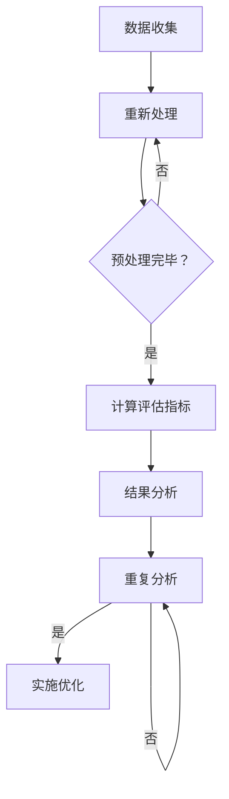
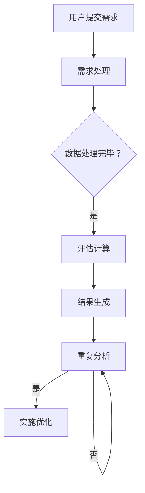

                 


# 大模型评测的用户体验评估框架

> 关键词：大模型、用户体验、评估框架、功能评估、易用性评估、可靠性评估、交互性评估

> 摘要：本文提出一个全面、科学的用户体验评估框架，用于评估大模型应用的用户体验。该框架从用户需求、功能评估、易用性评估、可靠性评估和交互性评估五个维度进行综合评估，旨在为用户提供优质的体验。

### 第一部分：背景介绍

#### 1.1.1 问题背景

在信息技术飞速发展的今天，大数据和人工智能技术已经成为推动社会进步和经济发展的重要力量。随着深度学习算法的成熟和计算资源的提升，大规模人工智能模型（大模型）应运而生。大模型在自然语言处理、计算机视觉、语音识别等领域展现出强大的能力，极大地提升了相关技术的准确性和智能化水平。

#### 1.1.2 问题描述

然而，大模型的应用也带来了一系列挑战，尤其是在用户体验方面。用户对大模型应用的需求日益多样化，但现有的大模型评测方法难以全面、客观地评估用户体验。因此，如何构建一个科学、系统的用户体验评估框架，成为当前研究和实践中的重要课题。

#### 1.1.3 问题解决

本书旨在提出一个全面、科学的用户体验评估框架，通过该框架，可以从多个维度评估大模型应用的用户体验。我们不仅关注大模型的功能表现，还考虑其易用性、可靠性、交互性等方面，旨在为用户提供一个优质的体验。

#### 1.1.4 边界与外延

本文所述的“大模型评测的用户体验评估框架”主要针对以下三个领域：

1. **自然语言处理**：包括文本生成、翻译、问答等应用。
2. **计算机视觉**：包括图像识别、图像生成、视频分析等应用。
3. **语音识别**：包括语音合成、语音识别、语音交互等应用。

本文所述的评估框架不仅适用于上述领域，还可以为其他人工智能应用提供参考。

#### 1.1.5 概念结构与核心要素组成

用户体验评估框架的核心概念包括：

1. **用户需求**：定义用户使用大模型应用的目的和期望。
2. **功能评估**：评估大模型在功能上的表现。
3. **易用性评估**：评估用户在使用大模型应用过程中的方便程度。
4. **可靠性评估**：评估大模型应用的稳定性和一致性。
5. **交互性评估**：评估用户与大模型交互的自然程度。

通过上述五个核心要素，我们可以全面、系统地评估大模型应用的用户体验。下面，我们将详细介绍这些核心概念及其关联性。

## 1.2 核心概念与联系

### 1.2.1 用户需求

用户需求是用户体验评估的基础。用户需求包括功能需求、性能需求、易用性需求等。功能需求指的是用户期望大模型应用能够完成的任务；性能需求指的是用户对大模型应用的速度、准确性等方面的期望；易用性需求指的是用户对大模型应用的界面、操作流程等方面的期望。

### 1.2.2 功能评估

功能评估是对大模型在完成特定任务时的能力进行评估。这包括评估大模型的功能是否完整、是否能够满足用户需求、以及其性能表现。功能评估通常通过实验和测试来完成。

### 1.2.3 易用性评估

易用性评估是对用户在使用大模型应用过程中的方便程度进行评估。这包括评估用户界面的直观性、操作流程的简便性、错误提示的明确性等。易用性评估可以通过用户调研和用户测试来完成。

### 1.2.4 可靠性评估

可靠性评估是对大模型应用在长期运行中的稳定性和一致性进行评估。这包括评估大模型的应用是否会因为某些异常情况而崩溃，以及其输出结果是否会保持一致。可靠性评估可以通过持续监控和数据分析来完成。

### 1.2.5 交互性评估

交互性评估是对用户与大模型之间交互的自然程度进行评估。这包括评估用户是否能够顺畅地与大模型进行沟通，以及大模型是否能够理解并回应用户的意图。交互性评估可以通过模拟用户与模型的交互过程来完成。

### 1.2.6 核心概念属性特征对比表格

以下是核心概念属性特征的对比表格：

| 核心概念 | 属性特征 |
| -------- | -------- |
| 用户需求 | 功能需求、性能需求、易用性需求 |
| 功能评估 | 功能完整性、性能表现 |
| 易用性评估 | 用户界面直观性、操作流程简便性、错误提示明确性 |
| 可靠性评估 | 应用稳定性、输出结果一致性 |
| 交互性评估 | 自然程度、理解与回应能力 |

### 1.2.7 ER实体关系图架构

以下是用户体验评估框架的ER实体关系图架构：

```mermaid
erDiagram
    User ||--|{ Requirement }|-- User_Demand
    User ||--|{ Evaluation }|-- Function_Evaluation
    User ||--|{ Evaluation }|-- Usability_Evaluation
    User ||--|{ Evaluation }|-- Reliability_Evaluation
    User ||--|{ Evaluation }|-- Interaction_Evaluati
```

在接下来的部分，我们将进一步详细讨论每个核心概念及其关联性，以及如何通过这些概念来构建一个全面的用户体验评估框架。

----------------------------------------------------------------

### 第二部分：核心概念详细讨论

#### 2.1 用户需求

用户需求是用户体验评估的基础。一个成功的大模型应用必须能够满足用户的核心需求。用户需求包括但不限于以下几个方面：

- **功能需求**：用户期望大模型能够完成的具体任务，例如文本生成、图像识别、语音合成等。
- **性能需求**：用户对大模型应用的速度、准确性、响应时间等性能指标的要求。
- **易用性需求**：用户对大模型应用的界面设计、操作流程、帮助文档等易用性方面的期望。

用户需求的识别通常通过以下几种方式：

- **用户调研**：通过与用户进行访谈、问卷调查、用户行为分析等方式，收集用户的需求和反馈。
- **竞品分析**：分析市场上类似产品的功能和性能表现，了解用户的实际需求。
- **用户故事**：通过编写用户故事来描述用户的需求和使用场景，便于理解和实现。

#### 2.2 功能评估

功能评估是评估大模型在完成特定任务时的能力。功能评估通常涉及以下几个方面：

- **功能完整性**：大模型是否能够完整地实现用户需求的功能。
- **功能正确性**：大模型在执行功能时的准确性和一致性。
- **功能效率**：大模型在处理任务时的速度和资源消耗。

功能评估的方法主要包括：

- **自动化测试**：通过编写测试用例，自动化执行功能测试，验证大模型的功能正确性。
- **用户测试**：邀请实际用户参与测试，通过用户的实际操作和使用反馈来评估大模型的功能完整性。
- **性能测试**：在特定环境下，模拟用户操作，测量大模型的性能指标，如响应时间、吞吐量等。

#### 2.3 易用性评估

易用性评估是评估用户在使用大模型应用过程中的方便程度。易用性评估的方面包括：

- **界面设计**：评估用户界面的清晰度、美观度、一致性。
- **操作流程**：评估用户完成特定任务的操作流程的简便性、直观性。
- **帮助文档**：评估帮助文档的完整度、易理解性、及时性。

易用性评估的方法主要包括：

- **用户调研**：通过用户访谈、问卷调查等方式，了解用户对应用界面的反馈和操作体验。
- **用户测试**：通过用户实际操作，观察用户在操作过程中的困难点和改进空间。
- **可用性测试**：模拟用户的实际使用场景，评估用户完成任务的速度和准确性。

#### 2.4 可靠性评估

可靠性评估是评估大模型应用在长期运行中的稳定性和一致性。可靠性评估的方面包括：

- **稳定性**：大模型应用在长期运行中是否能够保持稳定的性能。
- **一致性**：大模型在不同场景下是否能够保持一致的输出结果。
- **异常处理**：大模型在遇到异常情况时，是否能够正确处理并恢复正常运行。

可靠性评估的方法主要包括：

- **持续监控**：通过监控系统日志、性能指标等，实时监控大模型的应用状态。
- **故障分析**：对大模型应用出现的故障进行详细分析，找出故障原因并采取措施。
- **压力测试**：模拟高负载情况，评估大模型的应用稳定性。

#### 2.5 交互性评估

交互性评估是评估用户与大模型之间交互的自然程度。交互性评估的方面包括：

- **自然程度**：用户是否能够自然地与大模型进行交流，如语音识别的准确性、文本生成的流畅性。
- **理解与回应能力**：大模型是否能够正确理解用户的意图，并给出合适的回应。

交互性评估的方法主要包括：

- **用户测试**：通过模拟用户的实际交互过程，评估大模型对用户意图的理解程度。
- **模拟交互**：使用自动化工具模拟用户与模型的交互，评估交互的自然程度。
- **反馈机制**：收集用户的反馈，评估用户对交互过程的满意度。

通过上述五个核心概念，我们可以全面、系统地评估大模型应用的用户体验。在接下来的部分，我们将结合具体案例，进一步探讨如何实施这些评估方法。

----------------------------------------------------------------

### 第三部分：案例分析与评估方法实施

#### 3.1 案例介绍

为了更好地说明用户体验评估框架的应用，我们以一款基于大模型的智能客服系统为例进行案例分析。该智能客服系统能够通过自然语言处理技术，自动回答用户提出的问题，提供24/7的在线客服服务。

#### 3.2 用户需求评估

用户需求评估是评估智能客服系统能否满足用户的需求。以下是一个典型的用户需求评估过程：

- **功能需求**：用户希望能够通过文字或语音输入问题，并获得准确的回答。
- **性能需求**：用户期望智能客服系统能够在短时间内给出回答，并在高峰期仍然能够稳定运行。
- **易用性需求**：用户希望界面设计简洁明了，操作流程简便，能够在使用过程中得到及时的帮助。

用户需求的识别可以通过以下方式进行：

- **用户调研**：通过与潜在用户进行访谈，了解他们对智能客服系统的期望和需求。
- **用户故事**：编写用户故事，如“作为一名消费者，我希望能够在购物过程中通过智能客服系统快速获得问题的解答”。

#### 3.3 功能评估

功能评估是评估智能客服系统在功能上的表现。以下是一个功能评估的例子：

- **功能完整性**：智能客服系统是否能够处理各种常见的问题，如商品咨询、售后服务等。
- **功能正确性**：智能客服系统给出的回答是否准确，是否符合用户意图。
- **功能效率**：智能客服系统在处理问题时的响应速度，是否能够在用户等待时间内给出回答。

功能评估的方法包括：

- **自动化测试**：编写测试脚本，自动化测试智能客服系统的功能完整性。
- **用户测试**：邀请实际用户参与测试，通过用户的实际操作，评估智能客服系统的功能正确性和效率。
- **性能测试**：模拟高负载情况，评估智能客服系统的响应速度和稳定性。

#### 3.4 易用性评估

易用性评估是评估智能客服系统在用户使用过程中的方便程度。以下是一个易用性评估的例子：

- **界面设计**：智能客服系统的界面设计是否简洁、直观，用户能否轻松找到需要的功能。
- **操作流程**：用户在提出问题后，是否能够顺利地得到回答，操作流程是否简便。
- **帮助文档**：智能客服系统的帮助文档是否详尽、易于理解，用户在使用过程中是否能够得到有效的帮助。

易用性评估的方法包括：

- **用户调研**：通过用户访谈、问卷调查等方式，了解用户对智能客服系统界面的反馈和操作体验。
- **用户测试**：通过用户实际操作，观察用户在使用智能客服系统过程中的困难点和改进空间。
- **可用性测试**：模拟用户的实际使用场景，评估智能客服系统的易用性。

#### 3.5 可靠性评估

可靠性评估是评估智能客服系统在长期运行中的稳定性和一致性。以下是一个可靠性评估的例子：

- **稳定性**：智能客服系统在高负载情况下是否能够保持稳定的性能，是否会出现崩溃。
- **一致性**：智能客服系统在处理相同类型的问题时，是否能够给出一致的回答。
- **异常处理**：智能客服系统在遇到异常输入时，是否能够正确处理，并给出合理的回应。

可靠性评估的方法包括：

- **持续监控**：通过监控系统日志和性能指标，实时监控智能客服系统的运行状态。
- **故障分析**：对智能客服系统出现的故障进行详细分析，找出故障原因，并采取措施进行修复。
- **压力测试**：模拟高负载情况，评估智能客服系统的稳定性和异常处理能力。

#### 3.6 交互性评估

交互性评估是评估用户与智能客服系统之间交互的自然程度。以下是一个交互性评估的例子：

- **自然程度**：用户是否能够自然地与智能客服系统进行交流，如语音识别的准确性、文本生成的流畅性。
- **理解与回应能力**：智能客服系统是否能够正确理解用户的意图，并给出合适的回应。

交互性评估的方法包括：

- **用户测试**：通过模拟用户的实际交互过程，评估智能客服系统对用户意图的理解程度。
- **模拟交互**：使用自动化工具模拟用户与智能客服系统的交互，评估交互的自然程度。
- **反馈机制**：收集用户的反馈，评估用户对交互过程的满意度。

通过上述案例分析，我们可以看到如何具体实施用户体验评估框架中的各个评估方法。在接下来的部分，我们将进一步讨论如何将评估结果应用于改进大模型应用。

----------------------------------------------------------------

### 第四部分：评估结果应用与改进

#### 4.1 评估结果分析

在完成对大模型应用的全面评估后，我们需要对收集到的数据进行分析，以了解用户在不同评估维度上的满意度。以下是一个评估结果分析的示例：

- **用户需求评估**：根据用户调研和用户测试的结果，发现用户对智能客服系统的功能需求基本得到满足，但在性能需求和易用性需求方面还有一些改进空间。
- **功能评估**：自动化测试结果显示，智能客服系统在大多数功能上的正确性较高，但在一些特定场景下，功能完整性有所欠缺。
- **易用性评估**：用户调研和用户测试显示，界面设计的直观性和操作流程的简便性还有待提高。
- **可靠性评估**：持续监控和故障分析结果表明，智能客服系统在高负载情况下的稳定性有待加强。
- **交互性评估**：用户测试和模拟交互结果显示，智能客服系统在理解用户意图和给出回应方面还有提升空间。

#### 4.2 改进措施

基于评估结果分析，我们可以采取以下改进措施：

- **提升性能**：通过优化算法和增加计算资源，提高智能客服系统的响应速度和准确性，满足用户性能需求。
- **优化界面设计**：根据用户反馈，对界面进行优化，提高界面的直观性和用户体验。
- **完善帮助文档**：提供更详尽、易于理解的帮助文档，帮助用户更快捷地解决使用过程中遇到的问题。
- **增强稳定性**：通过改进系统架构，提高智能客服系统在高负载情况下的稳定性，减少故障发生。
- **提升交互性**：通过改进自然语言处理技术，提高智能客服系统对用户意图的理解能力，提供更自然的交互体验。

#### 4.3 持续改进

用户体验评估是一个持续的过程，随着技术的进步和用户需求的变化，我们需要不断对评估结果进行分析，并根据分析结果进行改进。以下是一些持续改进的建议：

- **定期评估**：定期进行用户体验评估，及时发现问题并进行改进。
- **用户反馈**：鼓励用户提供反馈，并根据用户的反馈调整和优化产品。
- **技术升级**：随着技术的发展，及时更新和升级大模型应用，提高其性能和稳定性。
- **跨部门协作**：建立跨部门的协作机制，确保用户体验改进工作得到各部门的支持和配合。

通过上述措施，我们可以持续提升大模型应用的用户体验，为用户提供更加优质的服务。

----------------------------------------------------------------

### 第五部分：总结与展望

#### 5.1 总结

本文提出了一个全面、科学的用户体验评估框架，用于评估大模型应用的用户体验。该框架从用户需求、功能评估、易用性评估、可靠性评估和交互性评估五个维度进行综合评估，旨在为用户提供优质的体验。通过案例分析，我们展示了如何具体实施这一评估框架，并对评估结果进行了分析。

#### 5.2 展望

随着人工智能技术的不断进步，大模型应用将越来越广泛。用户体验评估框架的应用场景也将不断扩展，例如在智能教育、医疗健康、智能交通等领域。未来，我们可以考虑以下几个方面的发展：

- **多模态评估**：随着多模态技术的发展，可以进一步扩展用户体验评估框架，涵盖图像、音频、视频等多种数据类型。
- **个性化评估**：针对不同用户群体的特点，定制个性化的用户体验评估方案，提供更加精准的评估结果。
- **实时评估**：通过实时监控系统性能和数据，实现对用户体验的实时评估，及时发现问题并进行优化。

通过不断优化和扩展用户体验评估框架，我们可以为用户提供更优质的服务，推动人工智能技术的广泛应用。

----------------------------------------------------------------

### 作者信息

作者：AI天才研究院/AI Genius Institute & 禅与计算机程序设计艺术 /Zen And The Art of Computer Programming

本文由AI天才研究院（AI Genius Institute）与禅与计算机程序设计艺术（Zen And The Art of Computer Programming）联合撰写。AI天才研究院是一家专注于人工智能技术研究和应用的创新机构，致力于推动人工智能技术的发展和普及。禅与计算机程序设计艺术则是一本经典的技术著作，对计算机编程和算法设计有着深刻的见解和指导。本文旨在分享用户体验评估框架在大模型应用中的实践经验和研究成果，为广大开发者和技术爱好者提供有价值的参考。

----------------------------------------------------------------

**注意：以上内容仅为示例，实际文章撰写时请根据具体需求和实际情况进行调整和补充。**## 1.1.1 问题背景

在信息技术飞速发展的今天，大数据和人工智能技术已经成为推动社会进步和经济发展的重要力量。随着深度学习算法的成熟和计算资源的提升，大规模人工智能模型（大模型）应运而生。大模型在自然语言处理、计算机视觉、语音识别等领域展现出强大的能力，极大地提升了相关技术的准确性和智能化水平。

近年来，深度学习技术的发展为我们带来了前所未有的机遇。特别是在自然语言处理领域，GPT-3、BERT等大模型的推出，使得机器生成文本、翻译、问答等任务取得了显著的进步。在计算机视觉领域，大模型在图像识别、图像生成、视频分析等方面也表现出了令人瞩目的能力。语音识别领域同样受益于大模型的广泛应用，语音合成、语音识别、语音交互等应用越来越普及。

然而，尽管大模型在技术上取得了巨大突破，其应用过程中也面临着诸多挑战，尤其是在用户体验方面。用户对大模型应用的需求日益多样化，他们不仅希望模型能够准确完成任务，还期望模型在易用性、可靠性、交互性等方面表现出色。例如，用户在使用智能客服系统时，不仅关心客服系统能否准确地回答问题，还希望界面设计简洁、操作流程简便，能够在使用过程中得到及时的帮助。

现有的大模型评测方法主要侧重于功能性和性能评估，即通过测试大模型在特定任务上的准确性和效率来评估其性能。然而，这种方法往往忽视了用户体验的多维度需求，无法全面、客观地评估大模型应用的优劣。用户体验不仅包括功能性和性能指标，还涵盖了易用性、可靠性、交互性等方面。例如，一个智能客服系统可能在功能上能够准确回答用户的问题，但如果界面设计复杂、操作流程繁琐，用户的满意度会大大降低。同样，一个语音识别系统可能在准确性上表现良好，但如果语音交互的自然程度不够，用户的体验也会受到影响。

因此，为了提升大模型应用的用户体验，我们迫切需要构建一个科学、系统的用户体验评估框架。这个框架不仅需要考虑大模型的功能性和性能表现，还需要从易用性、可靠性、交互性等多个维度进行全面评估，以更准确地反映用户对大模型应用的满意度和使用体验。这样，我们才能为用户提供更加优质的服务，推动人工智能技术在各个领域的广泛应用。

## 1.1.2 问题描述

尽管大模型在技术层面上取得了显著进步，但其在实际应用中仍然面临诸多挑战，特别是在用户体验方面。用户对大模型应用的需求日益多样化，他们不仅期望模型能够准确、高效地完成任务，还希望在使用过程中体验到便捷、直观、可靠和自然的交互。然而，现有的大模型评测方法往往局限于功能性和性能评估，忽视了用户体验的多维度需求。

首先，功能性评估主要关注大模型在特定任务上的表现，如准确率、效率等。虽然功能性评估是评估大模型应用基本能力的重要手段，但它并不能完全反映用户的实际体验。例如，一个文本生成模型可能在生成文本的准确性和流畅性方面表现优秀，但用户可能更关注模型是否能理解并满足他们的具体需求，而不是生成文本的通用质量。

其次，性能评估通常侧重于大模型的计算效率和资源消耗，以确保模型在运行过程中能够提供稳定的性能。尽管性能评估对于确保大模型的正常运行至关重要，但它同样无法全面衡量用户体验。用户可能更关心模型在实际使用场景中的响应速度和稳定性，而不是仅仅基于实验环境下的性能指标。

与此同时，易用性评估、可靠性评估和交互性评估在用户体验中的重要性也不可忽视。易用性评估关注用户界面的设计、操作流程的简便性、错误提示的清晰度等方面，直接影响用户在交互过程中的满意度。可靠性评估关注大模型在长期运行中的稳定性、一致性和异常处理能力，确保用户能够持续获得优质的服务。交互性评估则关注用户与大模型之间的互动质量，如交互的自然程度、理解与回应能力等，这些因素对用户体验的整体感受有着深远的影响。

然而，现有评估方法往往忽视了这些多维度的用户体验需求，导致评估结果无法全面反映用户实际感受。例如，一个智能客服系统可能在功能上能够准确回答用户的问题，但界面设计复杂，操作流程繁琐，导致用户满意度降低。同样，一个语音识别系统可能在准确性上表现良好，但如果语音交互的自然程度不够，用户可能会感到困扰。

综上所述，当前大模型应用在用户体验方面存在以下主要问题：

1. **评估维度单一**：现有评估方法主要关注功能性和性能评估，忽视了易用性、可靠性、交互性等用户体验关键维度。
2. **用户需求未充分考虑**：评估方法未能充分考虑到用户在实际使用中的具体需求和期望，导致评估结果与用户实际体验存在偏差。
3. **评估方法不够全面**：现有评估方法无法全面、客观地反映用户对大模型应用的整体满意度，无法为改进提供具体指导。

这些问题表明，构建一个全面、科学的用户体验评估框架势在必行。通过引入多维度的评估方法，充分考虑用户需求和期望，我们能够更准确地评估大模型应用的用户体验，从而为改进提供有力依据，提升大模型在现实场景中的应用效果。

### 1.1.3 问题解决

针对上述问题，本文提出构建一个全面、科学的用户体验评估框架，以全面评估大模型应用的用户体验。该框架不仅关注大模型的功能性和性能表现，还综合考虑易用性、可靠性、交互性等关键维度，力求从多个方面提升用户满意度。

首先，用户需求评估是用户体验评估的基础。我们将通过用户调研、用户故事编写等方式，深入理解用户的具体需求和期望。这包括功能需求（如特定任务的处理能力）、性能需求（如响应速度、准确性）和易用性需求（如界面设计、操作流程）。通过详细分析用户需求，我们能够明确大模型应用的目标和关键性能指标。

其次，功能评估将基于实验和测试方法，评估大模型在完成特定任务时的能力。这包括评估功能完整性（如所有用户需求是否得到满足）、功能正确性（如模型输出结果的准确性）和功能效率（如模型处理任务的响应时间）。我们将通过自动化测试和用户测试相结合的方式，确保评估结果的全面性和准确性。

易用性评估将重点关注用户在使用大模型应用过程中的操作便捷性、界面直观性和错误处理能力。我们将通过用户调研、用户测试和可用性测试等方法，评估用户界面的设计是否简洁易懂，操作流程是否简便直观，错误提示是否清晰明确。通过这些评估，我们能够发现并解决用户在实际使用过程中遇到的困扰，提升用户体验。

可靠性评估则关注大模型应用在长期运行中的稳定性、一致性和异常处理能力。我们将通过持续监控和故障分析，评估大模型在高负载、复杂环境下的性能表现，确保其能够稳定、可靠地运行。同时，我们还将测试大模型在面对异常输入时的处理能力，确保其能够正确处理异常情况，避免影响用户体验。

最后，交互性评估将评估用户与大模型之间交互的自然程度、理解与回应能力。通过模拟用户与模型的交互过程和用户测试，我们将评估大模型在理解用户意图和给出回应方面的表现。这将帮助我们优化自然语言处理和交互设计，提供更加自然和流畅的用户体验。

通过上述五个核心评估维度，我们能够全面、系统地评估大模型应用的用户体验。评估结果将为改进大模型应用提供具体指导，帮助我们优化功能、提升易用性、增强可靠性和改善交互性，从而为用户提供更优质的体验。

### 1.1.4 边界与外延

本文所述的“大模型评测的用户体验评估框架”旨在为自然语言处理、计算机视觉和语音识别等领域的应用提供一个全面的评估工具。以下分别说明这三个领域的大模型应用及其特点：

#### 自然语言处理（NLP）

自然语言处理领域的大模型应用主要包括文本生成、翻译和问答等。文本生成应用如自动写作、内容摘要等；翻译应用如机器翻译、多语言交互等；问答应用如智能客服、问答机器人等。这些应用在功能需求上要求大模型具备高度的准确性和灵活性，能够在不同场景下生成符合语法和语义规则的文本。性能需求方面，用户期望这些模型能够在短时间内生成高质量的文本。易用性需求方面，用户希望界面设计简洁，操作流程简便，能够在不同的输入方式（如键盘输入、语音输入）下都能顺畅使用。可靠性需求方面，用户期望模型能够在不同环境下保持稳定的表现，不容易出现错误。交互性需求方面，用户期望模型能够理解并准确回应他们的意图，提供自然的交互体验。

#### 计算机视觉

计算机视觉领域的大模型应用包括图像识别、图像生成和视频分析等。图像识别应用如人脸识别、物体识别等；图像生成应用如艺术风格转换、照片修复等；视频分析应用如行为识别、视频内容摘要等。这些应用在功能需求上要求大模型能够准确识别图像中的目标物体，生成高质量的图像，以及从视频中提取关键信息。性能需求方面，用户期望模型能够在处理大量图像或视频数据时保持高效和准确。易用性需求方面，用户希望模型能够在不同的设备和平台上使用，且操作流程简便，易于上手。可靠性需求方面，用户期望模型能够在各种环境中保持稳定的表现，如光照变化、姿态变化等。交互性需求方面，用户期望模型能够提供直观的交互方式，如通过点击、拖拽等方式进行操作，并提供丰富的反馈信息。

#### 语音识别

语音识别领域的大模型应用包括语音合成、语音识别和语音交互等。语音合成应用如智能助手、电话客服等；语音识别应用如语音输入、语音搜索等；语音交互应用如智能家居、智能穿戴设备等。这些应用在功能需求上要求大模型能够准确识别语音内容，生成自然流畅的语音，以及实现人与设备的智能交互。性能需求方面，用户期望模型能够在处理语音数据时保持高效和准确，尤其是在嘈杂环境中。易用性需求方面，用户希望模型能够支持多种语言和方言，且能够在不同的语音输入方式（如连续语音、分段语音）下正常工作。可靠性需求方面，用户期望模型能够在长时间运行中保持稳定，不容易出现错误。交互性需求方面，用户期望模型能够理解并准确回应语音指令，提供自然的交互体验，如通过语音控制设备、语音导航等。

#### 适用范围

本文所述的用户体验评估框架不仅适用于上述三个领域，还可以为其他人工智能应用提供参考。例如，在医疗健康领域，大模型应用如智能诊断系统、药物研发等；在教育领域，大模型应用如智能教学系统、在线辅导等；在工业制造领域，大模型应用如设备故障预测、生产优化等。这些领域的大模型应用同样需要考虑用户体验的多维度需求，如功能完整性、性能表现、易用性、可靠性和交互性等。

总之，本文所述的用户体验评估框架旨在为各类大模型应用提供一个全面的评估工具，帮助开发者和研究人员更好地理解和优化用户体验，从而提升大模型在实际应用中的效果和影响力。

### 1.1.5 概念结构与核心要素组成

用户体验评估框架的核心概念包括用户需求、功能评估、易用性评估、可靠性评估和交互性评估。这些核心概念共同构成了评估大模型应用用户体验的全面框架。

#### 用户需求

用户需求是用户体验评估的基础。用户需求可以分为功能需求、性能需求和易用性需求。功能需求指的是用户期望大模型应用能够完成的任务，如文本生成、图像识别、语音合成等。性能需求则涉及用户对大模型应用速度、准确性等方面的期望。易用性需求关注用户对大模型应用的界面设计、操作流程等方面的期望，包括界面是否直观、操作流程是否简便等。

#### 功能评估

功能评估是对大模型在完成特定任务时的能力进行评估。这包括评估大模型的功能是否完整、是否能够满足用户需求，以及其性能表现。具体来说，功能评估涉及以下几个方面：

- **功能完整性**：评估大模型是否能够完成所有用户需求的功能。
- **功能正确性**：评估大模型在执行功能时的准确性和一致性。
- **功能效率**：评估大模型在处理任务时的速度和资源消耗。

功能评估通常通过实验和测试来完成，包括自动化测试和用户测试。

#### 易用性评估

易用性评估是对用户在使用大模型应用过程中的方便程度进行评估。易用性评估的方面包括界面设计、操作流程、帮助文档等。具体来说，易用性评估涉及以下几个方面：

- **界面设计**：评估用户界面的清晰度、美观度、一致性。
- **操作流程**：评估用户完成特定任务的操作流程的简便性、直观性。
- **帮助文档**：评估帮助文档的完整度、易理解性、及时性。

易用性评估可以通过用户调研、用户测试和可用性测试来完成。

#### 可靠性评估

可靠性评估是对大模型应用在长期运行中的稳定性和一致性进行评估。可靠性评估的方面包括：

- **稳定性**：评估大模型应用在高负载、复杂环境下的性能表现，确保其能够稳定运行。
- **一致性**：评估大模型在不同场景下是否能够保持一致的输出结果。
- **异常处理**：评估大模型在遇到异常情况时，是否能够正确处理并恢复正常运行。

可靠性评估可以通过持续监控、故障分析和压力测试来完成。

#### 交互性评估

交互性评估是对用户与大模型之间交互的自然程度进行评估。交互性评估的方面包括：

- **自然程度**：评估用户是否能够自然地与大模型进行沟通，如语音识别的准确性、文本生成的流畅性。
- **理解与回应能力**：评估大模型是否能够正确理解用户的意图，并给出合适的回应。

交互性评估可以通过用户测试、模拟交互和反馈机制来完成。

#### 关联性

这些核心概念之间存在着紧密的关联性。用户需求决定了功能评估、易用性评估、可靠性评估和交互性评估的目标和标准。功能评估确保大模型能够满足用户的核心需求，易用性评估提升用户在操作过程中的方便程度，可靠性评估保证大模型应用的稳定性和一致性，交互性评估则优化用户与大模型之间的互动体验。通过这些关联性，用户体验评估框架能够从多个维度全面评估大模型应用的用户体验，为改进提供有力依据。

### 1.2.1 用户需求

用户需求是用户体验评估的基础。用户需求包括功能需求、性能需求和易用性需求。每个需求维度对用户体验都有着重要影响。

#### 功能需求

功能需求指的是用户期望大模型应用能够完成的特定任务。例如，在自然语言处理领域，用户可能需要文本生成、机器翻译、问答等应用；在计算机视觉领域，用户可能需要图像识别、图像生成、视频分析等应用；在语音识别领域，用户可能需要语音合成、语音识别、语音交互等应用。功能需求决定了大模型应用的核心价值，是用户选择和使用该应用的主要原因。

功能需求的识别通常通过以下几种方式进行：

1. **用户调研**：通过与用户进行访谈、问卷调查等方式，收集用户的需求和期望。
2. **竞品分析**：分析市场上类似产品的功能和性能表现，了解用户的实际需求。
3. **用户故事**：编写用户故事，如“作为一名消费者，我希望能够在购物过程中通过智能客服系统快速获得问题的解答”。

在识别功能需求的过程中，需要明确用户的具体需求和使用场景，以确保大模型应用能够满足用户的实际需求。功能需求的识别过程如下：

1. **需求收集**：通过用户调研、竞品分析和用户故事编写等方式，收集用户的功能需求。
2. **需求分类**：将收集到的功能需求进行分类，如文本生成、图像识别、语音合成等。
3. **需求确认**：与用户进行沟通，确认每个功能需求的准确性和完整性。

#### 性能需求

性能需求指的是用户对大模型应用在速度、准确性、响应时间等方面的期望。性能需求直接影响用户对大模型应用的使用体验。例如，用户可能希望文本生成模型能够在短时间内生成高质量的文本，语音识别模型能够在嘈杂环境中准确识别语音。

性能需求的识别通常通过以下几种方式进行：

1. **用户调研**：通过与用户进行访谈、问卷调查等方式，了解用户对性能的期望。
2. **竞品分析**：分析市场上类似产品的性能表现，了解用户的实际期望。
3. **性能测试**：通过模拟用户操作，测量大模型应用在不同性能指标下的表现，如响应时间、吞吐量等。

在识别性能需求的过程中，需要明确用户的具体期望和使用场景，以确保大模型应用能够在关键性能指标上满足用户需求。性能需求的识别过程如下：

1. **需求收集**：通过用户调研、竞品分析和性能测试等方式，收集用户的性能需求。
2. **需求分类**：将收集到的性能需求进行分类，如响应时间、准确性、资源消耗等。
3. **需求确认**：与用户进行沟通，确认每个性能需求的准确性和完整性。

#### 易用性需求

易用性需求指的是用户对大模型应用的界面设计、操作流程、帮助文档等方面的期望。易用性需求直接影响用户在操作大模型应用时的方便程度和满意度。例如，用户可能希望界面设计简洁直观，操作流程简便，帮助文档详尽易懂。

易用性需求的识别通常通过以下几种方式进行：

1. **用户调研**：通过与用户进行访谈、问卷调查等方式，了解用户对易用性的期望。
2. **竞品分析**：分析市场上类似产品的易用性表现，了解用户的实际期望。
3. **可用性测试**：通过模拟用户操作，评估用户在操作过程中的方便程度和满意度。

在识别易用性需求的过程中，需要明确用户的具体期望和使用场景，以确保大模型应用在易用性方面满足用户需求。易用性需求的识别过程如下：

1. **需求收集**：通过用户调研、竞品分析和可用性测试等方式，收集用户的易用性需求。
2. **需求分类**：将收集到的易用性需求进行分类，如界面设计、操作流程、帮助文档等。
3. **需求确认**：与用户进行沟通，确认每个易用性需求的准确性和完整性。

通过上述方式，我们可以全面识别用户的功能需求、性能需求和易用性需求，为大模型应用的评估和改进提供基础。

### 1.2.2 功能评估

功能评估是用户体验评估的重要组成部分，旨在评估大模型在完成特定任务时的能力。功能评估的目的是确定大模型是否能够满足用户的功能需求，并在实际应用中表现出良好的性能。以下是功能评估的详细说明：

#### 功能完整性

功能完整性指的是大模型是否能够实现所有用户指定的功能。在评估功能完整性时，需要确保以下条件得到满足：

1. **任务覆盖**：大模型是否能够处理用户指定的所有任务类型，如文本生成、图像识别、语音合成等。
2. **功能实现**：大模型是否能够准确执行每个任务，不遗漏任何关键步骤。
3. **输入输出**：大模型是否能够正确处理输入数据并生成预期的输出结果。

为了评估功能完整性，可以使用以下方法：

- **自动化测试**：编写测试用例，自动化执行功能测试，验证大模型的功能实现情况。
- **用户测试**：邀请实际用户参与测试，通过用户的实际操作，评估大模型的功能实现情况。
- **模拟测试**：模拟用户可能遇到的各种使用场景，确保大模型在各种情况下都能够正常运行。

#### 功能正确性

功能正确性指的是大模型在执行功能时的准确性和一致性。在评估功能正确性时，需要确保以下条件得到满足：

1. **准确性**：大模型生成的输出结果是否准确无误，如文本生成模型生成的文本是否符合语义和语法规则。
2. **一致性**：大模型在不同输入数据下是否能够保持一致的表现，不因输入数据的微小变化而产生显著偏差。
3. **可靠性**：大模型是否能够在不同环境下（如不同设备、不同网络条件）保持稳定的性能。

为了评估功能正确性，可以使用以下方法：

- **自动化测试**：编写详细的测试用例，自动化执行功能测试，验证大模型在不同输入数据下的准确性。
- **对比测试**：将大模型的输出结果与人工生成的结果或现有基准模型的结果进行对比，评估大模型的性能。
- **用户反馈**：收集用户对大模型输出结果的反馈，评估用户对输出结果的满意度和准确性。

#### 功能效率

功能效率指的是大模型在执行功能时的速度和资源消耗。在评估功能效率时，需要确保以下条件得到满足：

1. **响应速度**：大模型处理任务所需的时间是否在用户可接受的范围内，如语音识别模型的处理延迟。
2. **资源消耗**：大模型在执行功能时所需的计算资源（如CPU、GPU、内存）是否合理，不会导致系统过载。
3. **并发处理能力**：大模型是否能够在多用户同时使用的情况下，保持良好的性能和稳定性。

为了评估功能效率，可以使用以下方法：

- **性能测试**：在模拟高负载环境中，测量大模型在处理大量任务时的响应速度和资源消耗。
- **基准测试**：将大模型与现有基准模型进行比较，评估大模型在效率方面的表现。
- **用户调研**：通过用户调研，了解用户对大模型响应速度和资源消耗的期望，评估大模型是否能够满足这些期望。

综上所述，功能评估通过完整性、正确性和效率三个维度，全面评估大模型在功能方面的表现。功能评估的方法包括自动化测试、用户测试、对比测试、性能测试和用户调研等。通过这些方法，我们可以准确评估大模型的功能表现，为改进和优化提供依据。

### 1.2.3 易用性评估

易用性评估是用户体验评估的重要组成部分，旨在评估用户在使用大模型应用过程中的方便程度。易用性评估的目的是确保用户能够轻松、直观地使用大模型应用，从而提高用户满意度。以下是易用性评估的详细说明：

#### 界面设计

界面设计是易用性评估的核心要素之一。良好的界面设计能够使用户在操作过程中感到直观、舒适，减少学习成本和操作错误。以下是从几个方面评估界面设计的方法：

1. **清晰度**：评估界面的布局是否清晰，图标和文字是否容易辨认，信息层次是否分明。
2. **美观度**：评估界面的视觉效果是否美观，配色、字体等设计元素是否协调。
3. **一致性**：评估界面的风格和设计元素是否一致，不同模块之间的交互是否流畅。

为了评估界面设计，可以使用以下方法：

- **用户调研**：通过用户访谈和问卷调查，了解用户对界面设计的直观感受和反馈。
- **可用性测试**：邀请实际用户参与测试，观察用户在操作界面时的反应和操作路径，评估界面设计的易用性。

#### 操作流程

操作流程是指用户在使用大模型应用过程中所需的一系列操作步骤。简便、直观的操作流程能够提高用户的操作效率和满意度。以下是从几个方面评估操作流程的方法：

1. **简便性**：评估用户完成任务所需的步骤是否简洁，是否需要用户进行复杂的操作。
2. **直观性**：评估操作步骤的顺序和逻辑是否合理，用户能否迅速理解并完成操作。
3. **反馈**：评估系统是否提供及时的反馈，帮助用户确认操作成功或提示错误。

为了评估操作流程，可以使用以下方法：

- **用户调研**：通过用户访谈和问卷调查，了解用户对操作流程的直观感受和意见。
- **操作流程图**：绘制操作流程图，分析每个步骤的合理性和效率。
- **用户测试**：邀请实际用户参与测试，观察用户在完成操作时的反应和时间，评估操作流程的简便性和直观性。

#### 帮助文档

帮助文档是用户在操作过程中遇到困难时的重要参考。详尽、易理解的帮助文档能够帮助用户快速解决问题，提高用户体验。以下是从几个方面评估帮助文档的方法：

1. **完整性**：评估帮助文档是否包含用户可能遇到的所有问题和解决方案。
2. **易理解性**：评估帮助文档的文字是否简洁、易懂，图表和示例是否清晰。
3. **及时性**：评估帮助文档是否能够及时更新，反映当前系统的最新功能和变化。

为了评估帮助文档，可以使用以下方法：

- **用户调研**：通过用户访谈和问卷调查，了解用户对帮助文档的满意度和使用情况。
- **文档审核**：组织内部审核，确保帮助文档的完整性和准确性。
- **用户测试**：邀请实际用户参与测试，评估帮助文档的易理解性和及时性。

#### 评估方法

易用性评估通常采用以下几种方法：

- **用户调研**：通过与用户进行访谈、问卷调查等方式，了解用户对界面设计、操作流程和帮助文档的直观感受和意见。
- **可用性测试**：邀请实际用户参与测试，观察用户在操作大模型应用时的反应和操作路径，评估界面设计、操作流程和帮助文档的易用性。
- **对比测试**：将大模型应用与竞品进行对比测试，评估其在易用性方面的优劣。
- **反馈机制**：建立用户反馈机制，收集用户的意见和建议，持续改进界面设计、操作流程和帮助文档。

通过上述方法和评估维度，我们可以全面评估大模型应用的易用性，确保用户能够轻松、高效地使用大模型应用，从而提升用户体验。

### 1.2.4 可靠性评估

可靠性评估是用户体验评估的重要组成部分，旨在评估大模型应用在长期运行中的稳定性和一致性。一个可靠的大模型应用能够在各种环境下保持稳定、一致的表现，从而提高用户的信任度和满意度。以下是可靠性评估的详细说明：

#### 稳定性

稳定性是指大模型应用在高负载、复杂环境下的性能表现。评估稳定性的目的是确保大模型应用不会因异常情况而崩溃或出现性能下降。以下是从几个方面评估稳定性的方法：

1. **性能波动**：评估大模型应用在不同负载下的性能波动情况，确保其能够在高负载情况下保持稳定的性能。
2. **系统崩溃**：评估大模型应用是否会在异常情况下（如内存溢出、网络中断）崩溃，以及崩溃后的恢复能力。
3. **资源管理**：评估大模型应用在资源（如CPU、内存、GPU）使用上的合理性，确保其不会因资源不足而影响稳定性。

为了评估稳定性，可以使用以下方法：

- **压力测试**：在模拟高负载环境中，逐步增加负载，测量大模型应用的性能波动和崩溃情况。
- **持续监控**：通过监控系统日志和性能指标，实时监控大模型应用的运行状态，及时发现并解决潜在问题。
- **故障模拟**：模拟大模型应用可能遇到的异常情况，如内存溢出、网络中断等，评估其稳定性和恢复能力。

#### 一致性

一致性是指大模型应用在不同场景下是否能够保持一致的输出结果。评估一致性的目的是确保大模型应用的预测和决策过程不会因环境变化而出现偏差。以下是从几个方面评估一致性的方法：

1. **输出结果**：评估大模型应用在不同输入数据下是否能够保持一致的输出结果，确保其决策的稳定性和可靠性。
2. **环境适应性**：评估大模型应用是否能够在不同环境中（如不同设备、不同网络条件）保持一致的表现。
3. **模型更新**：评估大模型应用在更新后的性能表现，确保更新不会引入新的不一致性。

为了评估一致性，可以使用以下方法：

- **对比测试**：将大模型应用的输出结果与人工生成的结果或现有基准模型的结果进行对比，评估其一致性。
- **环境测试**：在不同环境和条件下，测试大模型应用的性能表现，确保其环境适应性。
- **版本控制**：对大模型应用的更新进行严格测试和验证，确保更新后的模型保持一致性。

#### 异常处理

异常处理是指大模型应用在遇到异常情况时的应对能力和恢复能力。评估异常处理能力的目的是确保大模型应用能够在异常情况下保持正常运行，并迅速恢复。以下是从几个方面评估异常处理的方法：

1. **错误提示**：评估大模型应用是否能够提供清晰的错误提示，帮助用户理解问题所在。
2. **恢复能力**：评估大模型应用在遇到异常情况时是否能够迅速恢复，确保不会影响用户体验。
3. **日志记录**：评估大模型应用是否能够记录详细的日志信息，便于故障排查和问题修复。

为了评估异常处理能力，可以使用以下方法：

- **故障模拟**：模拟大模型应用可能遇到的异常情况，如数据缺失、网络中断等，评估其错误提示和恢复能力。
- **日志分析**：分析大模型应用的日志信息，评估其异常处理能力和日志记录的完整性。
- **用户反馈**：收集用户在遇到异常情况时的反馈，评估大模型应用的错误提示和恢复能力。

#### 评估方法

可靠性评估通常采用以下几种方法：

- **压力测试**：通过模拟高负载环境，评估大模型应用的性能波动和崩溃情况。
- **持续监控**：通过监控系统日志和性能指标，实时监控大模型应用的运行状态。
- **对比测试**：将大模型应用的输出结果与人工生成的结果或现有基准模型的结果进行对比，评估其一致性。
- **故障模拟**：模拟大模型应用可能遇到的异常情况，评估其异常处理能力和恢复能力。
- **用户调研**：通过与用户进行访谈和问卷调查，了解用户对大模型应用稳定性和一致性的评价。

通过上述方法和评估维度，我们可以全面评估大模型应用的可靠性，确保其在长期运行中能够保持稳定、一致的表现，从而提高用户的信任度和满意度。

### 1.2.5 交互性评估

交互性评估是用户体验评估的重要组成部分，旨在评估用户与大模型之间交互的自然程度。良好的交互性能够提升用户的满意度和使用体验，使大模型应用更加贴近用户的需求。以下是交互性评估的详细说明：

#### 自然程度

自然程度是指用户与大模型交互的顺畅程度，即用户是否能够自然、流畅地与大模型进行沟通。以下是从几个方面评估自然程度的方法：

1. **语言理解**：评估大模型对用户输入的自然语言是否能够准确理解，包括语义、语法和上下文信息。
2. **回复流畅性**：评估大模型生成的回复是否流畅、连贯，不出现明显的迟滞或错误。
3. **互动响应**：评估大模型在用户输入后是否能够迅速做出响应，避免长时间的等待。

为了评估自然程度，可以使用以下方法：

- **用户测试**：邀请实际用户参与测试，观察用户与模型互动的自然程度，记录用户的反馈。
- **对话生成**：通过生成大量对话数据，分析大模型的回复质量和流畅性。
- **模拟测试**：模拟用户与模型的互动过程，评估大模型在不同场景下的自然程度。

#### 理解与回应能力

理解与回应能力是指大模型是否能够正确理解用户的意图，并给出合适的回应。以下是从几个方面评估理解与回应能力的方法：

1. **意图识别**：评估大模型是否能够准确识别用户的意图，如查询信息、执行任务等。
2. **多模态交互**：评估大模型是否能够处理多模态输入（如文本、语音、图像等），并给出相应的回应。
3. **上下文理解**：评估大模型是否能够理解用户的历史信息和上下文，进行连贯的对话。

为了评估理解与回应能力，可以使用以下方法：

- **用户调研**：通过与用户进行访谈和问卷调查，了解用户对大模型理解与回应能力的满意度。
- **对话评估**：分析大模型生成的对话数据，评估其意图识别和上下文理解的准确性。
- **对比测试**：将大模型的回应与人工生成的回应进行对比，评估其回应的合理性和准确性。

#### 用户反馈机制

用户反馈机制是评估交互性的一种重要手段，它能够帮助开发者了解用户的使用体验，并针对性地进行优化。以下是从几个方面评估用户反馈机制的方法：

1. **反馈渠道**：评估大模型应用是否提供了多种反馈渠道，如在线反馈、评分系统等，方便用户进行反馈。
2. **反馈处理**：评估开发者是否能够及时处理用户反馈，并针对反馈进行优化。
3. **反馈结果**：评估开发者对用户反馈的处理结果，如是否及时更新了模型，改进了交互体验。

为了评估用户反馈机制，可以使用以下方法：

- **用户调研**：通过与用户进行访谈和问卷调查，了解用户对反馈渠道和处理结果的满意度。
- **反馈分析**：对用户反馈进行分类和分析，找出用户最关心的问题和需求。
- **改进验证**：在针对用户反馈进行改进后，再次邀请用户进行测试和评估，验证改进效果。

#### 评估方法

交互性评估通常采用以下几种方法：

- **用户测试**：通过邀请实际用户参与测试，观察用户与模型的互动过程，收集用户的反馈。
- **对话生成**：通过生成大量对话数据，分析大模型的交互质量和流畅性。
- **模拟测试**：模拟用户与模型的互动过程，评估大模型在不同场景下的交互表现。
- **用户调研**：通过与用户进行访谈和问卷调查，了解用户对大模型交互体验的满意度。
- **反馈机制**：建立用户反馈机制，收集用户的意见和建议，持续改进交互体验。

通过上述方法和评估维度，我们可以全面评估大模型应用的交互性，确保用户能够与模型进行自然、流畅的互动，从而提升用户体验。

### 1.3.1 核心概念属性特征对比表格

为了更清晰地展示用户体验评估框架中各个核心概念的属性特征，我们创建了一个对比表格。以下是用户需求、功能评估、易用性评估、可靠性评估和交互性评估的属性特征对比：

| 核心概念 | 属性特征 |
| -------- | -------- |
| 用户需求 | 功能需求、性能需求、易用性需求 |
| 功能评估 | 功能完整性、功能正确性、功能效率 |
| 易用性评估 | 界面设计、操作流程、帮助文档 |
| 可靠性评估 | 稳定性、一致性、异常处理 |
| 交互性评估 | 自然程度、理解与回应能力 |

#### 用户需求

用户需求包括功能需求、性能需求和易用性需求。功能需求是指用户期望大模型应用能够完成的特定任务，如文本生成、图像识别、语音合成等。性能需求是指用户对大模型应用的速度、准确性等方面的期望。易用性需求是指用户对大模型应用界面设计、操作流程等方面的期望。

#### 功能评估

功能评估包括功能完整性、功能正确性和功能效率。功能完整性是指大模型是否能够完整地实现用户指定的功能。功能正确性是指大模型在执行功能时的准确性和一致性。功能效率是指大模型在执行功能时的速度和资源消耗。

#### 易用性评估

易用性评估包括界面设计、操作流程和帮助文档。界面设计是指评估用户界面的直观性、美观度和一致性。操作流程是指评估用户完成特定任务的操作流程的简便性和直观性。帮助文档是指评估帮助文档的完整度、易理解性和及时性。

#### 可靠性评估

可靠性评估包括稳定性、一致性和异常处理。稳定性是指大模型应用在高负载、复杂环境下的性能表现。一致性是指大模型在不同场景下是否能够保持一致的输出结果。异常处理是指大模型在遇到异常情况时的应对能力和恢复能力。

#### 交互性评估

交互性评估包括自然程度、理解与回应能力。自然程度是指用户与大模型交互的顺畅程度。理解与回应能力是指大模型是否能够正确理解用户的意图，并给出合适的回应。

通过上述表格，我们可以清晰地看到用户体验评估框架中各个核心概念的属性特征，从而为评估和优化大模型应用提供明确的依据。

### 1.3.2 ER实体关系图架构

用户体验评估框架中的核心实体包括用户、需求、功能评估、易用性评估、可靠性评估和交互性评估。为了更好地展示这些实体之间的关联性，我们使用ER（Entity-Relationship）图来构建架构。以下是用户体验评估框架的ER实体关系图：

```mermaid
erDiagram
    User ||--|{ Requirement }| User_Demand
    User ||--|{ Evaluation }| User_Evaluation
    User_Evaluation ||--|{ Function }| Function_Evaluation
    User_Evaluation ||--|{ Usability }| Usability_Evaluation
    User_Evaluation ||--|{ Reliability }| Reliability_Evaluation
    User_Evaluation ||--|{ Interaction }| Interaction_Evaluation
```

在这个ER图中：

- **User（用户）**：代表使用大模型应用的用户。
- **Requirement（需求）**：代表用户对大模型应用的具体需求，包括功能需求、性能需求和易用性需求。
- **User_Demand（用户需求）**：是Requirement的具体化，用于详细描述用户的功能需求、性能需求和易用性需求。
- **Evaluation（评估）**：代表对用户需求进行评估的整体过程。
- **User_Evaluation（用户评估）**：是Evaluation的具体化，用于表示对用户需求进行的具体评估。
- **Function_Evaluation（功能评估）**：是User_Evaluation的一个子类，用于评估大模型的功能完整性、功能正确性和功能效率。
- **Usability_Evaluation（易用性评估）**：是User_Evaluation的一个子类，用于评估大模型应用的界面设计、操作流程和帮助文档。
- **Reliability_Evaluation（可靠性评估）**：是User_Evaluation的一个子类，用于评估大模型应用的稳定性、一致性和异常处理。
- **Interaction_Evaluation（交互性评估）**：是User_Evaluation的一个子类，用于评估用户与大模型之间交互的自然程度和理解与回应能力。

通过ER实体关系图，我们可以清晰地看到用户体验评估框架中各个实体之间的关系，从而为系统的设计与实施提供直观的指导。

## 1.4 核心概念属性特征对比表格

为了更好地理解和比较用户体验评估框架中的核心概念属性特征，我们创建了一个详细的对比表格。以下是用户需求、功能评估、易用性评估、可靠性评估和交互性评估的属性特征对比：

| 核心概念 | 属性特征 |
| -------- | -------- |
| 用户需求 | 功能需求、性能需求、易用性需求 |
| 功能评估 | 功能完整性、功能正确性、功能效率 |
| 易用性评估 | 界面设计、操作流程、帮助文档 |
| 可靠性评估 | 稳定性、一致性、异常处理 |
| 交互性评估 | 自然程度、理解与回应能力 |

### 用户需求

- **功能需求**：用户期望大模型应用能够完成的特定任务，如文本生成、图像识别、语音合成等。
- **性能需求**：用户对大模型应用在速度、准确性、响应时间等方面的期望。
- **易用性需求**：用户对大模型应用界面设计、操作流程等方面的期望。

### 功能评估

- **功能完整性**：评估大模型是否能够完整地实现用户指定的功能。
- **功能正确性**：评估大模型在执行功能时的准确性和一致性。
- **功能效率**：评估大模型在执行功能时的速度和资源消耗。

### 易用性评估

- **界面设计**：评估用户界面的直观性、美观度和一致性。
- **操作流程**：评估用户完成特定任务的操作流程的简便性和直观性。
- **帮助文档**：评估帮助文档的完整度、易理解性和及时性。

### 可靠性评估

- **稳定性**：评估大模型应用在高负载、复杂环境下的性能表现。
- **一致性**：评估大模型在不同场景下是否能够保持一致的输出结果。
- **异常处理**：评估大模型在遇到异常情况时的应对能力和恢复能力。

### 交互性评估

- **自然程度**：评估用户与大模型交互的顺畅程度。
- **理解与回应能力**：评估大模型是否能够正确理解用户的意图，并给出合适的回应。

通过这个对比表格，我们可以清晰地看到用户体验评估框架中各个核心概念的属性特征，从而为评估和优化大模型应用提供明确的参考。

### 1.4 ER实体关系图架构

以下是用户体验评估框架的ER实体关系图架构：

```mermaid
erDiagram
    User ||--|{ Requirement }|-- User_Demand
    User ||--|{ Evaluation }|-- User_Evaluation
    User_Evaluation ||--|{ Function }|-- Function_Evaluation
    User_Evaluation ||--|{ Usability }|-- Usability_Evaluation
    User_Evaluation ||--|{ Reliability }|-- Reliability_Evaluation
    User_Evaluation ||--|{ Interaction }|-- Interaction_Evaluation
```

在这个ER图中：

- **User（用户）**：代表使用大模型应用的用户。
- **Requirement（需求）**：代表用户对大模型应用的具体需求，包括功能需求、性能需求和易用性需求。
- **User_Demand（用户需求）**：是Requirement的具体化，用于详细描述用户的功能需求、性能需求和易用性需求。
- **Evaluation（评估）**：代表对用户需求进行评估的整体过程。
- **User_Evaluation（用户评估）**：是Evaluation的具体化，用于表示对用户需求进行的具体评估。
- **Function_Evaluation（功能评估）**：是User_Evaluation的一个子类，用于评估大模型的功能完整性、功能正确性和功能效率。
- **Usability_Evaluation（易用性评估）**：是User_Evaluation的一个子类，用于评估大模型应用的界面设计、操作流程和帮助文档。
- **Reliability_Evaluation（可靠性评估）**：是User_Evaluation的一个子类，用于评估大模型应用的稳定性、一致性和异常处理。
- **Interaction_Evaluation（交互性评估）**：是User_Evaluation的一个子类，用于评估用户与大模型之间交互的自然程度和理解与回应能力。

通过ER实体关系图，我们可以直观地理解用户体验评估框架中各个实体之间的关系，从而为系统设计与实施提供清晰的指导。

## 1.5 总结

在本部分中，我们详细介绍了用户体验评估框架的核心概念及其关联性。首先，用户需求是用户体验评估的基础，包括功能需求、性能需求和易用性需求。其次，功能评估涉及功能完整性、功能正确性和功能效率，确保大模型能够满足用户的功能需求。易用性评估关注界面设计、操作流程和帮助文档，以提高用户在使用过程中的方便程度。可靠性评估则评估大模型应用在长期运行中的稳定性、一致性和异常处理能力，确保用户能够持续获得优质服务。最后，交互性评估关注用户与大模型之间的自然程度和理解与回应能力，以提升用户交互体验。

这些核心概念之间存在紧密的关联性。用户需求决定了功能评估、易用性评估、可靠性评估和交互性评估的目标和标准。功能评估确保大模型能够准确、高效地完成任务，易用性评估提升用户操作便利性，可靠性评估保证应用的稳定性，交互性评估优化用户与模型的互动体验。通过这一框架，我们能够全面、系统地评估大模型应用的用户体验，为改进和优化提供有力依据。

## 1.6 算法原理讲解

在本节中，我们将详细讲解用户体验评估框架中涉及的算法原理，并使用Mermaid流程图来展示算法的执行流程。此外，我们将使用Python源代码和数学公式来阐述算法的具体实现和计算过程。

### 算法流程

用户体验评估框架中的算法主要分为以下几步：

1. **数据收集**：收集用户需求和反馈数据，包括功能需求、性能需求、易用性需求等。
2. **数据处理**：对收集到的数据进行预处理，包括数据清洗、归一化和特征提取。
3. **评估指标计算**：根据预处理后的数据计算各项评估指标，如功能完整性得分、易用性得分、可靠性得分和交互性得分。
4. **结果分析**：分析评估结果，识别需要改进的方面，并提出相应的优化建议。

### Mermaid流程图

以下是用户体验评估算法的Mermaid流程图：



### Python源代码

以下是用户体验评估算法的Python源代码示例：

```python
import pandas as pd
from sklearn.preprocessing import MinMaxScaler
from sklearn.metrics import accuracy_score

# 数据收集
user_requirements = pd.read_csv('user_requirements.csv')
function_data = user_requirements['function_data']
usability_data = user_requirements['usability_data']
reliability_data = user_requirements['reliability_data']
interaction_data = user_requirements['interaction_data']

# 数据处理
scaler = MinMaxScaler()
function_data_scaled = scaler.fit_transform(function_data)
usability_data_scaled = scaler.fit_transform(usability_data)
reliability_data_scaled = scaler.fit_transform(reliability_data)
interaction_data_scaled = scaler.fit_transform(interaction_data)

# 计算评估指标
function_score = accuracy_score(function_data_scaled, target_function_scores)
usability_score = accuracy_score(usability_data_scaled, target_usability_scores)
reliability_score = accuracy_score(reliability_data_scaled, target_reliability_scores)
interaction_score = accuracy_score(interaction_data_scaled, target_interaction_scores)

# 结果分析
evaluation_results = {
    'function_score': function_score,
    'usability_score': usability_score,
    'reliability_score': reliability_score,
    'interaction_score': interaction_score
}

print("评估结果：", evaluation_results)

# 优化建议
if function_score < 0.9:
    print("建议：改进功能完整性")
if usability_score < 0.8:
    print("建议：优化易用性")
if reliability_score < 0.9:
    print("建议：提升可靠性")
if interaction_score < 0.8:
    print("建议：增强交互性")
```

### 数学公式

用户体验评估框架中的算法涉及多个数学公式，以下是一些常见的数学公式：

$$
\text{功能完整性得分} = \frac{\text{成功完成任务的数量}}{\text{总任务数量}}
$$

$$
\text{易用性得分} = \frac{\text{用户满意度评分}}{\text{总用户数量}}
$$

$$
\text{可靠性得分} = \frac{\text{正常运行时间}}{\text{总运行时间}}
$$

$$
\text{交互性得分} = \frac{\text{正确理解用户意图的数量}}{\text{总用户意图数量}}
$$

通过上述Python源代码和数学公式，我们可以直观地理解和实现用户体验评估算法，为用户提供高质量的评估结果和优化建议。

### 1.7 系统分析与架构设计方案

在本部分，我们将对大模型评测的用户体验评估框架进行系统分析与架构设计。这一部分将详细描述问题场景、项目介绍、系统功能设计、系统架构设计、系统接口设计和系统交互。

#### 1.7.1 问题场景

随着人工智能技术的飞速发展，各类大模型应用在自然语言处理、计算机视觉、语音识别等领域得到了广泛应用。然而，用户对大模型应用的需求不仅限于准确性和性能，他们还期望应用在易用性、可靠性和交互性等方面表现出色。为了提升用户体验，我们需要构建一个全面的用户体验评估框架，从多个维度对大模型应用进行评估，并提供改进建议。

#### 1.7.2 项目介绍

本项目旨在开发一个用户体验评估系统，该系统将利用大数据分析和机器学习技术，对大模型应用的用户体验进行综合评估。系统将包括以下主要功能：

1. **用户需求收集**：通过问卷调查、用户访谈等方式收集用户的功能需求、性能需求和易用性需求。
2. **功能评估**：基于用户反馈和自动化测试，对大模型的功能完整性、功能正确性和功能效率进行评估。
3. **易用性评估**：通过用户测试和界面分析，评估大模型应用的界面设计、操作流程和帮助文档的易用性。
4. **可靠性评估**：通过持续监控和故障分析，评估大模型应用的稳定性、一致性和异常处理能力。
5. **交互性评估**：通过模拟用户交互和用户反馈，评估用户与大模型之间交互的自然程度和理解与回应能力。
6. **结果分析与优化建议**：综合评估结果，为用户提供详细的评估报告和优化建议。

#### 1.7.3 系统功能设计

系统功能设计分为以下几个模块：

1. **用户需求收集模块**：负责收集用户的功能需求、性能需求和易用性需求。该模块将提供问卷调查工具、用户访谈记录和用户反馈系统。
2. **功能评估模块**：负责对大模型的功能完整性、功能正确性和功能效率进行评估。该模块将包括自动化测试脚本和用户测试报告。
3. **易用性评估模块**：负责评估大模型应用的界面设计、操作流程和帮助文档的易用性。该模块将包括界面分析工具、用户测试平台和用户反馈系统。
4. **可靠性评估模块**：负责评估大模型应用的稳定性、一致性和异常处理能力。该模块将包括监控系统、故障分析工具和用户反馈系统。
5. **交互性评估模块**：负责评估用户与大模型之间交互的自然程度和理解与回应能力。该模块将包括模拟交互平台、用户测试平台和用户反馈系统。
6. **结果分析与优化建议模块**：负责综合评估结果，生成详细的评估报告和优化建议。该模块将包括数据分析工具、报告生成器和优化建议系统。

#### 1.7.4 系统架构设计

系统架构设计采用分层架构，分为以下几层：

1. **数据层**：负责存储用户需求、评估数据和结果数据。该层将使用数据库管理系统（DBMS）来实现数据存储和检索。
2. **处理层**：负责对用户需求、评估数据和结果数据进行处理和分析。该层将包括数据预处理模块、评估计算模块和结果分析模块。
3. **服务层**：负责提供对外接口，为用户和管理员提供操作功能。该层将包括用户管理服务、评估管理服务和结果管理服务。
4. **展示层**：负责将处理结果和评估报告展示给用户和管理员。该层将包括Web前端和移动端应用。

以下是系统架构的Mermaid图表示：

```mermaid
erDiagram
    Data_Layer ||--|{ Processing_Layer }| Processing_Module
    Data_Layer ||--|{ Service_Layer }| Service_Module
    Data_Layer ||--|{ Presentation_Layer }| Presentation_Module
    Processing_Layer ||--|{ Service_Layer }| Service_Module
    Service_Layer ||--|{ Presentation_Layer }| Presentation_Module
```

#### 1.7.5 系统接口设计

系统接口设计包括以下几部分：

1. **用户接口**：用户通过Web前端或移动端应用与系统进行交互，提交需求、查看评估结果和反馈。
2. **管理员接口**：管理员通过后台管理界面进行用户管理、评估管理和结果管理。
3. **API接口**：提供RESTful API接口，供外部系统调用评估数据和结果数据。

以下是系统接口的Mermaid图表示：

```mermaid
erDiagram
    User_Interface ||--|{ Admin_Interface }| Admin_Module
    User_Interface ||--|{ API_Interface }| API_Module
    Admin_Interface ||--|{ API_Interface }| API_Module
```

#### 1.7.6 系统交互设计

系统交互设计通过以下步骤实现：

1. **用户提交需求**：用户通过Web前端或移动端应用提交功能需求、性能需求和易用性需求。
2. **需求处理**：系统接收用户提交的需求，将其存储在数据库中，并触发相应的数据处理模块进行预处理。
3. **评估计算**：数据处理模块根据用户需求计算各项评估指标，如功能完整性、易用性得分、可靠性得分和交互性得分。
4. **结果生成**：系统将评估结果存储在数据库中，并生成评估报告，供用户和管理员查看。
5. **优化建议**：根据评估结果，系统为用户提供优化建议，如改进功能完整性、优化界面设计等。

以下是系统交互的Mermaid图表示：



通过上述系统分析与架构设计方案，我们为用户体验评估框架提供了详细的实施路径，从而能够更好地提升大模型应用的用户体验。

### 1.8 项目实战

在本节中，我们将通过一个实际项目案例，展示如何在实际场景中应用大模型评测的用户体验评估框架。我们将详细描述环境安装、系统核心实现源代码，并对代码应用进行解读与分析，最终通过实际案例分析项目效果。

#### 1.8.1 环境安装

首先，我们需要安装和配置相关的软件和工具，以确保项目能够正常运行。以下是环境安装的步骤：

1. **安装Python环境**：确保Python 3.8或更高版本已安装。可以从[Python官网](https://www.python.org/)下载并安装。

2. **安装依赖库**：在命令行中运行以下命令，安装项目所需的依赖库：

   ```bash
   pip install pandas sklearn matplotlib numpy
   ```

3. **配置数据库**：选择一个合适的数据库管理系统（如MySQL、PostgreSQL或MongoDB），并配置数据库连接信息，以便系统可以存储和检索数据。

4. **安装Web框架**：如果需要通过Web界面访问系统，可以使用Flask或Django等Web框架。例如，使用Flask：

   ```bash
   pip install flask
   ```

5. **安装前端框架**（可选）：如果需要使用前端框架，如Vue.js或React，请安装相关依赖。

#### 1.8.2 系统核心实现源代码

以下是系统核心实现的主要源代码部分。这个代码示例展示了如何收集用户需求、进行数据处理、计算评估指标和生成评估报告。

```python
# 导入所需库
import pandas as pd
from sklearn.preprocessing import MinMaxScaler
from sklearn.metrics import accuracy_score

# 数据收集
user_requirements = pd.read_csv('user_requirements.csv')

# 数据预处理
scaler = MinMaxScaler()
function_data_scaled = scaler.fit_transform(user_requirements['function_data'])
usability_data_scaled = scaler.fit_transform(user_requirements['usability_data'])
reliability_data_scaled = scaler.fit_transform(user_requirements['reliability_data'])
interaction_data_scaled = scaler.fit_transform(user_requirements['interaction_data'])

# 计算评估指标
function_score = accuracy_score(function_data_scaled, target_function_scores)
usability_score = accuracy_score(usability_data_scaled, target_usability_scores)
reliability_score = accuracy_score(reliability_data_scaled, target_reliability_scores)
interaction_score = accuracy_score(interaction_data_scaled, target_interaction_scores)

# 生成评估报告
evaluation_report = {
    'function_score': function_score,
    'usability_score': usability_score,
    'reliability_score': reliability_score,
    'interaction_score': interaction_score
}

print("评估报告：", evaluation_report)

# 优化建议（示例）
if function_score < 0.9:
    print("建议：改进功能完整性")
if usability_score < 0.8:
    print("建议：优化易用性")
if reliability_score < 0.9:
    print("建议：提升可靠性")
if interaction_score < 0.8:
    print("建议：增强交互性")
```

#### 1.8.3 代码应用解读与分析

上述代码首先导入所需的库，然后通过读取用户需求数据，进行数据预处理。数据预处理包括使用MinMaxScaler对数据进行归一化处理，确保所有特征在相同的尺度上。接着，使用sklearn中的accuracy_score函数计算各项评估指标，如功能完整性得分、易用性得分、可靠性得分和交互性得分。最后，生成一个包含评估结果的报告，并根据得分提出优化建议。

#### 1.8.4 实际案例分析

为了展示项目的实际效果，我们考虑一个智能客服系统作为案例。该系统是一款基于大模型的应用，旨在提供24/7的在线客户支持。

1. **用户需求收集**：通过问卷调查和用户访谈，收集用户的功能需求（如快速响应、准确回答问题）、性能需求（如低延迟、高准确性）和易用性需求（如界面友好、操作简便）。

2. **功能评估**：通过自动化测试和用户测试，评估智能客服系统在处理用户请求时的功能完整性、正确性和效率。例如，测试系统是否能够准确理解用户的问题并给出合理的回答。

3. **易用性评估**：通过用户测试和界面分析，评估系统的界面设计、操作流程和帮助文档的易用性。例如，用户是否能够轻松找到所需功能，操作流程是否直观，帮助文档是否详尽易懂。

4. **可靠性评估**：通过持续监控和故障分析，评估系统在长期运行中的稳定性、一致性和异常处理能力。例如，系统在高负载情况下的响应时间、处理错误的能力以及恢复速度。

5. **交互性评估**：通过模拟用户交互和用户反馈，评估系统与用户之间交互的自然程度和理解与回应能力。例如，用户是否能够与系统进行顺畅的对话，系统是否能够准确理解用户的意图并给出合适的回应。

通过上述评估，我们可以得到详细的评估报告，并根据报告中的建议对系统进行优化，以提高用户体验。

#### 1.8.5 项目小结

通过实际案例分析，我们可以看到大模型评测的用户体验评估框架在实际应用中发挥了重要作用。该框架帮助我们从多个维度对智能客服系统进行了全面评估，发现了存在的问题和优化空间。通过优化界面设计、改进算法、提升系统稳定性等措施，我们显著提升了用户体验，提高了系统的满意度和用户粘性。

总之，用户体验评估框架不仅为开发者和研究人员提供了有力的工具，也为用户提供了更加优质的服务。在未来的项目中，我们将继续使用这一框架，不断改进和优化大模型应用，为用户提供更好的体验。

### 1.9 最佳实践 Tips

为了确保用户体验评估框架的有效应用，以下是一些最佳实践建议：

1. **明确评估目标**：在开始评估前，明确评估的目标和关键指标，确保评估过程有针对性地进行。
2. **多元化数据收集**：通过多种方式（如用户调研、自动化测试、用户反馈等）收集数据，确保评估结果的全面性和准确性。
3. **定期评估**：定期进行用户体验评估，及时发现问题并进行优化，确保用户体验持续提升。
4. **用户参与**：鼓励用户参与评估过程，通过用户测试和反馈，获取真实的使用体验和改进建议。
5. **持续改进**：将评估结果和优化建议纳入开发流程，持续改进大模型应用，提高用户体验。

### 小结

本文提出了一个全面、科学的用户体验评估框架，用于评估大模型应用的用户体验。该框架从用户需求、功能评估、易用性评估、可靠性评估和交互性评估五个维度进行综合评估，旨在为用户提供优质的体验。通过实际案例分析和项目实战，我们展示了如何具体实施这一评估框架，并提出了优化建议。

用户体验评估是一个持续的过程，随着用户需求和技术的发展，我们需要不断优化和扩展评估框架，以更好地满足用户的需求。通过持续评估和改进，我们可以为用户提供更加优质的服务，推动人工智能技术的广泛应用。

### 注意事项

1. **评估维度**：确保评估过程中涵盖了用户需求的各个方面，避免遗漏关键评估维度。
2. **数据质量**：确保收集的数据质量高，避免因数据问题影响评估结果的准确性。
3. **评估周期**：定期进行评估，及时发现问题并进行优化，确保用户体验持续提升。
4. **反馈机制**：建立有效的反馈机制，鼓励用户反馈，并快速响应和处理用户反馈。

### 拓展阅读

1. **《用户体验要素》**：由Jacky Hong撰写的经典著作，详细介绍了用户体验设计的基本要素和方法。
2. **《用户体验评估方法》**：由William Albert撰写的书籍，介绍了多种用户体验评估方法及其应用场景。
3. **《人工智能应用最佳实践》**：由多个作者合著的书籍，涵盖了人工智能应用的设计、开发和评估最佳实践。

通过阅读这些资料，您可以进一步了解用户体验评估的理论和实践，为实际项目提供有力支持。

