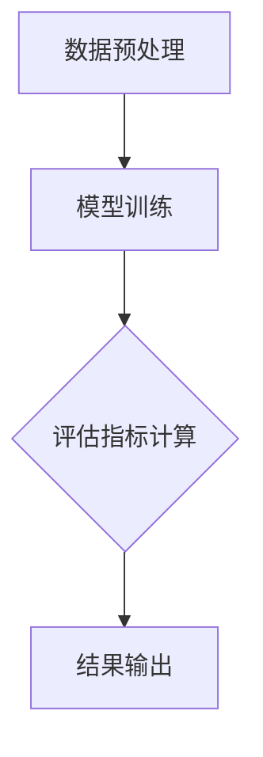

                 

### 《大模型评测的知识更新与学习跟踪》

关键词：大模型评测、知识更新、学习跟踪、算法原理、数学模型、系统架构、项目实战

摘要：本文旨在探讨大模型评测过程中的知识更新与学习跟踪，通过对核心概念的解析、算法原理的讲解和实际应用的剖析，为提高大模型评测的准确性和可靠性提供参考。文章分为四部分，分别从背景介绍、算法原理与数学模型、系统架构与项目实战、最佳实践与展望等方面进行深入探讨。

### 第一部分：背景与核心概念

#### 第1章：问题背景与核心概念

**1.1.1 问题描述与现状**

大模型评测是指对大型人工智能模型（如语言模型、图像模型等）的性能进行评估和比较。随着人工智能技术的快速发展，大模型评测的重要性日益凸显。然而，当前大模型评测面临以下问题：

- **数据集单一：** 大部分评测使用的数据集较为单一，难以全面反映模型的性能。
- **评测指标不完善：** 评测指标缺乏对模型泛化能力、鲁棒性等方面的评估。
- **知识更新滞后：** 大模型评测过程中，知识更新速度较慢，可能导致评测结果滞后。
- **学习跟踪不足：** 大模型在学习过程中，缺乏有效的学习跟踪方法，难以实时调整学习策略。

**1.1.2 核心概念解析**

- **大模型评测：** 对大型人工智能模型进行性能评估和比较的方法。
- **知识更新：** 在大模型评测过程中，根据新数据、新算法等对模型进行更新和优化。
- **学习跟踪：** 对大模型学习过程进行实时监控和调整，以提高模型性能。

**1.1.3 背景介绍**

- **大模型评测的研究背景：** 随着人工智能技术的快速发展，大模型评测成为研究热点。
- **知识更新与学习跟踪的研究背景：** 知识更新与学习跟踪在大模型评测中的重要性日益凸显。
- **本书的目标与结构：** 探讨大模型评测过程中的知识更新与学习跟踪，为实际应用提供指导。

#### 第2章：核心概念与联系

**2.1.1 大模型评测相关概念**

- **评测指标：** 用于评估模型性能的量化标准，如准确率、召回率等。
- **数据集：** 用于评测的样本数据集，应具备代表性、多样性等特点。
- **评测方法：** 用于对模型进行评测的方法和步骤，如交叉验证、网格搜索等。

**2.1.2 知识更新相关概念**

- **知识图谱：** 一种用于表示实体及其关系的图形化数据结构。
- **知识表示：** 将知识以结构化、可计算的方式表示，以便于计算机处理。
- **知识融合：** 将多个知识源进行整合，以提高知识表示的准确性和完整性。

**2.1.3 学习跟踪相关概念**

- **强化学习：** 一种基于奖励机制进行决策和优化的学习方法。
- **自适应学习：** 根据学习过程中的反馈，动态调整学习策略。
- **跟踪算法：** 用于实时监控和学习过程，以便进行调整和优化。

**2.1.4 概念属性特征对比表格**

| 概念       | 属性特征                                                       |
| ---------- | ------------------------------------------------------------ |
| 大模型评测 | 评估模型性能，数据集单一，评测指标不完善，知识更新滞后，学习跟踪不足 |
| 知识更新   | 根据新数据、新算法等进行模型更新和优化                        |
| 学习跟踪   | 实时监控和学习过程，调整学习策略                            |

#### 第3章：ER实体关系图架构

**3.1.1 大模型评测系统实体关系图**

```mermaid
erDiagram
    ModelEvaluation ||--o> Dataset : 使用
    ModelEvaluation ||--o> EvaluationMetric : 评估
    ModelEvaluation ||--o> KnowledgeUpdate : 更新
    ModelEvaluation ||--o> LearningTracking : 跟踪
```

**3.1.2 知识更新与学习跟踪实体关系图**

```mermaid
erDiagram
    KnowledgeUpdate ||--o> KnowledgeGraph : 表示
    KnowledgeUpdate ||--o> KnowledgeRepresentation : 结构化
    KnowledgeUpdate ||--o> KnowledgeFusion : 整合
    LearningTracking ||--o> ReinforcementLearning : 强化
    LearningTracking ||--o> AdaptiveLearning : 自适应
    LearningTracking ||--o> TrackingAlgorithm : 监控
```

### 第二部分：算法原理与数学模型

#### 第4章：大模型评测算法原理

**4.1.1 算法流程图**



**4.1.2 算法原理讲解**

大模型评测算法的核心原理包括数据预处理、模型训练、评估指标计算和结果输出。数据预处理阶段，对输入数据进行清洗、归一化等处理；模型训练阶段，使用梯度下降等优化算法进行模型训练；评估指标计算阶段，根据评估指标计算模型性能；结果输出阶段，将评估结果进行可视化展示。

**4.1.3 数学模型与公式**

1. 梯度下降算法：
   $$\Delta\theta = -\alpha \cdot \nabla_{\theta} J(\theta)$$

2. 评估指标：
   $$\text{Accuracy} = \frac{\text{预测正确数量}}{\text{总样本数量}}$$

**4.1.4 举例说明**

以一个简单的线性回归模型为例，假设有 $m$ 个样本，每个样本包含 $n$ 个特征，模型输出为 $y$。通过计算均方误差（MSE）来评估模型性能：

$$\text{MSE} = \frac{1}{m} \sum_{i=1}^{m} (y_i - \hat{y}_i)^2$$

其中，$y_i$ 为真实值，$\hat{y}_i$ 为预测值。

#### 第5章：知识更新原理与数学模型

**5.1.1 知识更新算法原理**

知识更新算法的基本流程包括：获取新数据、更新知识图谱、更新知识表示、融合新知识。具体步骤如下：

1. 获取新数据：从不同的数据源获取新的知识数据。
2. 更新知识图谱：将新数据添加到知识图谱中，更新实体及其关系。
3. 更新知识表示：将知识图谱转换为结构化、可计算的知识表示。
4. 知识融合：将新旧知识进行融合，提高知识表示的准确性和完整性。

**5.1.2 数学模型与公式**

1. 知识图谱更新：
   $$G' = G \cup \{ (e_1, r, e_2) \mid (e_1, r, e_2) \in D \}$$
   
   其中，$G$ 为原始知识图谱，$D$ 为新数据集。

2. 知识表示更新：
   $$\text{KnowledgeRepresentation} = \text{Graph2Vec}(G')$$

   其中，$\text{Graph2Vec}$ 为知识图谱向量化方法。

**5.1.3 举例说明**

以一个简单的知识图谱为例，假设有 $n$ 个实体和 $m$ 个关系，新数据包含 $k$ 个实体和 $l$ 个关系。通过合并新旧数据，更新知识图谱：

$$G' = G \cup \{ (e_1, r, e_2) \mid (e_1, r, e_2) \in D \}$$

更新知识表示：

$$\text{KnowledgeRepresentation} = \text{Graph2Vec}(G')$$

#### 第6章：学习跟踪原理与数学模型

**6.1.1 学习跟踪算法原理**

学习跟踪算法的基本流程包括：数据采集、模型训练、跟踪评估、调整学习策略。具体步骤如下：

1. 数据采集：从不同数据源获取学习过程中的数据。
2. 模型训练：使用采集到的数据进行模型训练。
3. 跟踪评估：评估模型性能，并根据评估结果调整学习策略。
4. 调整学习策略：根据跟踪评估结果，动态调整学习参数。

**6.1.2 数学模型与公式**

1. 跟踪评估：
   $$\text{TrackingScore} = \frac{\text{预测正确数量}}{\text{总样本数量}}$$

2. 调整学习策略：
   $$\alpha_{\text{new}} = \alpha_{\text{old}} + \eta \cdot (\text{TrackingScore} - \text{TargetScore})$$

   其中，$\alpha_{\text{old}}$ 为原始学习策略，$\eta$ 为调整系数，$\text{TrackingScore}$ 为跟踪评估分数，$\text{TargetScore}$ 为目标评估分数。

**6.1.3 举例说明**

以一个简单的分类问题为例，假设有 $m$ 个样本，每个样本包含 $n$ 个特征，模型输出为 $y$。通过计算跟踪评估分数，调整学习策略：

1. 数据采集：从数据集中随机抽取 $k$ 个样本作为跟踪数据。
2. 模型训练：使用跟踪数据进行模型训练。
3. 跟踪评估：
   $$\text{TrackingScore} = \frac{\text{预测正确数量}}{\text{k}}$$
4. 调整学习策略：
   $$\alpha_{\text{new}} = \alpha_{\text{old}} + \eta \cdot (\text{TrackingScore} - \text{TargetScore})$$

### 第三部分：系统架构与项目实战

#### 第7章：系统分析与架构设计

**7.1.1 问题场景介绍**

假设我们面临以下场景：公司需要定期对一系列大模型进行评测，以评估其性能和稳定性。评测过程中，需要不断更新知识库，以便于模型在新的数据集上进行训练。同时，需要实时跟踪模型的学习过程，根据评估结果调整学习策略。

**7.1.2 系统功能设计**

系统功能设计包括以下模块：

1. **数据采集模块**：从不同数据源采集样本数据。
2. **模型训练模块**：使用采集到的数据进行模型训练。
3. **知识更新模块**：根据新数据更新知识库。
4. **学习跟踪模块**：实时跟踪模型的学习过程。
5. **评估与反馈模块**：根据评估结果调整学习策略。

**7.1.3 系统架构设计**

系统架构设计如下：

1. **数据采集模块**：采用分布式数据采集方式，从多个数据源获取样本数据。
2. **模型训练模块**：采用分布式计算框架，如 TensorFlow、PyTorch 等，实现模型训练。
3. **知识更新模块**：采用知识图谱技术，将新数据更新到知识库中。
4. **学习跟踪模块**：采用实时跟踪算法，监控模型学习过程。
5. **评估与反馈模块**：根据评估结果，动态调整学习策略。

**7.1.4 系统接口设计**

系统接口设计如下：

1. **数据采集接口**：用于采集样本数据。
2. **模型训练接口**：用于训练模型。
3. **知识更新接口**：用于更新知识库。
4. **学习跟踪接口**：用于实时跟踪模型学习过程。
5. **评估与反馈接口**：用于根据评估结果调整学习策略。

**7.1.5 系统交互设计**

系统交互设计如下：

1. **数据采集模块** 与 **模型训练模块** 交互，将采集到的样本数据传递给模型训练模块。
2. **模型训练模块** 与 **知识更新模块** 交互，将训练好的模型传递给知识更新模块，以更新知识库。
3. **学习跟踪模块** 与 **评估与反馈模块** 交互，实时跟踪模型学习过程，并根据评估结果调整学习策略。

#### 第8章：项目实战

**8.1.1 环境安装与配置**

1. 安装 Python 3.8 及以上版本。
2. 安装 TensorFlow 2.4 及以上版本。
3. 安装 PyTorch 1.7 及以上版本。
4. 安装 Graph2Vec 库。

**8.1.2 系统核心实现源代码**

```python
import tensorflow as tf
import torch
from graph2vec import Graph2Vec

def data_preprocessing(data):
    # 数据预处理代码
    pass

def model_training(data):
    # 模型训练代码
    pass

def knowledge_updating(knowledge_graph, new_data):
    # 知识更新代码
    pass

def learning_tracking(model, data):
    # 学习跟踪代码
    pass

def evaluation_feedback(model, data):
    # 评估与反馈代码
    pass

if __name__ == "__main__":
    # 系统主函数
    pass
```

**8.1.3 代码应用解读与分析**

1. **数据预处理**：对采集到的样本数据进行预处理，如数据清洗、归一化等。
2. **模型训练**：使用 TensorFlow 或 PyTorch 框架训练模型。
3. **知识更新**：使用 Graph2Vec 库将新数据更新到知识库中。
4. **学习跟踪**：实时监控模型学习过程，并根据评估结果调整学习策略。
5. **评估与反馈**：根据评估结果，动态调整学习策略。

**8.1.4 实际案例分析与详细讲解剖析**

1. **数据集**：选取一个公开的数据集，如 CIFAR-10。
2. **模型**：选择一个简单的分类模型，如卷积神经网络（CNN）。
3. **知识更新**：在模型训练过程中，根据新数据更新知识库。
4. **学习跟踪**：实时监控模型学习过程，根据评估结果调整学习策略。
5. **评估与反馈**：根据评估结果，动态调整学习策略。

**8.1.5 项目小结**

本项目通过数据预处理、模型训练、知识更新、学习跟踪和评估与反馈等模块，实现了大模型评测过程中的知识更新与学习跟踪。在实际应用中，可以根据项目需求和场景，对系统进行优化和调整，以提高评测的准确性和可靠性。

### 第四部分：最佳实践与展望

#### 第9章：最佳实践 tips

1. **数据预处理**：对采集到的样本数据进行充分预处理，提高数据质量。
2. **模型选择**：根据具体问题选择合适的模型，避免过度拟合。
3. **知识更新**：及时更新知识库，确保模型在新的数据集上进行训练。
4. **学习跟踪**：实时监控模型学习过程，根据评估结果调整学习策略。
5. **评估与反馈**：根据评估结果，动态调整学习策略，提高模型性能。

#### 第10章：小结与展望

**10.1.1 书籍小结**

本文从背景介绍、核心概念、算法原理、系统架构、项目实战等方面，全面探讨了大模型评测过程中的知识更新与学习跟踪。通过实际案例分析和详细讲解剖析，为读者提供了实用的指导和建议。

**10.1.2 展望未来**

随着人工智能技术的不断发展，大模型评测过程中的知识更新与学习跟踪将面临新的挑战和机遇。未来研究方向包括：

1. **多模态数据融合**：将多种类型的数据进行融合，提高模型性能。
2. **自适应学习**：研究自适应学习算法，提高模型泛化能力。
3. **知识更新与学习跟踪的融合**：将知识更新与学习跟踪相结合，实现更高效的知识更新和学习策略调整。
4. **大规模分布式评测**：研究大规模分布式评测方法，提高评测效率和准确性。

### 结论

大模型评测过程中的知识更新与学习跟踪具有重要意义，有助于提高模型性能和可靠性。本文从多个方面对大模型评测的知识更新与学习跟踪进行了深入探讨，为实际应用提供了参考。未来，我们将继续关注该领域的研究进展，为人工智能技术的发展贡献力量。

### 作者信息

作者：AI天才研究院/AI Genius Institute & 禅与计算机程序设计艺术 /Zen And The Art of Computer Programming

