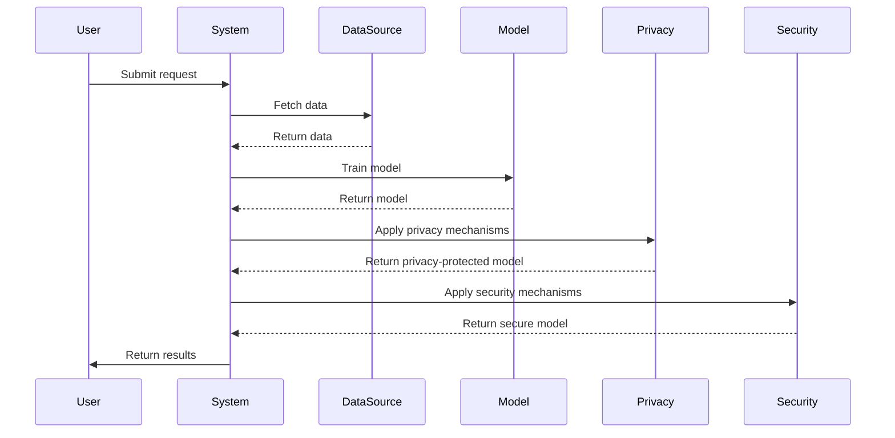
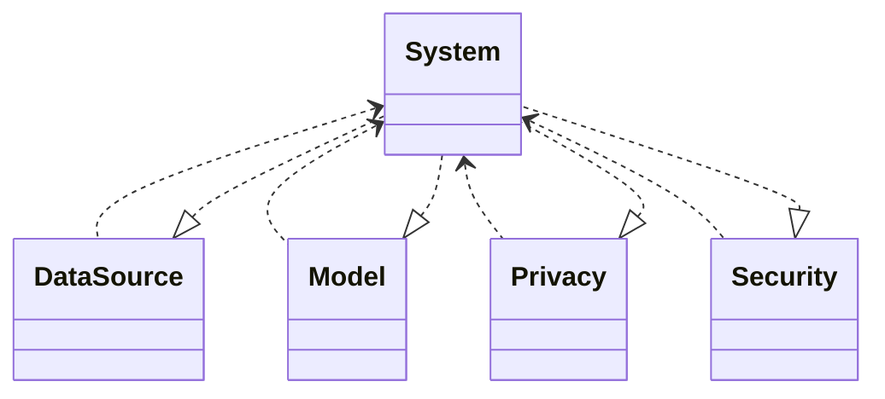

                 

### 大模型评测的隐私保护与安全机制

> **关键词：隐私保护、安全机制、大模型评测、数据安全**

> **摘要：**
本文深入探讨在大模型评测过程中如何实现隐私保护和安全机制。随着人工智能和大数据技术的快速发展，大模型的评测已成为关键环节。然而，评测过程中涉及的数据安全和隐私问题也日益突出。本文将介绍核心概念、技术方法、实际应用、系统设计以及最佳实践，以期为相关领域的研究者与实践者提供有价值的参考。

### 1. 引言与背景

#### 1.1 核心概念

在大模型评测的背景下，隐私保护和安全机制涉及以下几个核心概念：

- **大模型（Large Models）**：指具有大规模参数、高复杂度和强大计算能力的深度学习模型。
- **隐私保护（Privacy Protection）**：确保个人数据在传输、存储和处理过程中不被非法访问和泄露。
- **安全机制（Security Mechanisms）**：用于防范和应对数据泄露、篡改、损坏等安全威胁的技术和策略。

#### 1.2 问题背景

随着人工智能技术的发展，大模型在各个领域得到广泛应用，如图像识别、自然语言处理和医疗诊断等。然而，大模型评测过程中涉及大量敏感数据，如个人健康信息、财务数据和社会媒体数据等。这些数据的泄露不仅会导致隐私侵犯，还可能引发法律纠纷和经济损失。

#### 1.3 问题描述

在大模型评测中，主要面临以下问题：

- **数据泄露风险**：未经授权的访问和泄露可能导致敏感信息暴露。
- **数据篡改风险**：恶意攻击者可能篡改评测数据，影响评测结果的公正性。
- **计算资源消耗**：安全机制的实施可能增加计算资源和存储资源的消耗。

#### 1.4 问题解决

为了解决上述问题，我们需要在大模型评测过程中采用有效的隐私保护和安全机制。这些机制应具备以下特性：

- **隐私保护**：确保数据的隐私性，避免敏感信息泄露。
- **数据完整性**：确保数据的完整性和可靠性，防止数据被篡改。
- **访问控制**：限制对敏感数据的访问，确保只有授权用户才能访问。

#### 1.5 边界与外延

隐私保护和安全机制不仅应用于大模型评测，还广泛应用于其他领域，如金融、医疗和政府等。因此，本文的讨论不仅限于大模型评测，还涉及更广泛的背景和应用场景。

### 2. 核心概念与联系

#### 2.1 大模型

大模型是指具有大规模参数、高复杂度和强大计算能力的深度学习模型。这些模型通常通过大量数据进行训练，以实现高效的预测和分类任务。

#### 2.2 隐私保护

隐私保护旨在确保个人数据在传输、存储和处理过程中不被非法访问和泄露。常见的隐私保护技术包括数据加密、访问控制和匿名化等。

#### 2.3 安全机制

安全机制是指用于防范和应对数据泄露、篡改、损坏等安全威胁的技术和策略。常见的安全机制包括防火墙、入侵检测系统和数据备份等。

#### 2.4 概念属性特征对比

以下是一个简单的概念属性特征对比表格：

| 概念      | 定义                                                         | 特点                             | 应用场景               |
|-----------|--------------------------------------------------------------|--------------------------------|------------------------|
| 大模型    | 拥有大规模参数、高复杂度和强大计算能力的深度学习模型         | 参数规模大、计算能力强、适用广泛 | 图像识别、自然语言处理 |
| 隐私保护  | 确保个人数据在传输、存储和处理过程中不被非法访问和泄露       | 数据加密、匿名化、访问控制       | 金融、医疗、政府等    |
| 安全机制  | 防范和应对数据泄露、篡改、损坏等安全威胁的技术和策略         | 防火墙、入侵检测系统、数据备份   | 各领域                 |

#### 2.5 ER实体关系图架构

以下是一个ER实体关系图的Mermaid表示，用于描述大模型评测、隐私保护和安全机制之间的关联：

```mermaid
erDiagram
  Model <<-- Evaluation : "is evaluated by"
  Evaluation o-- Privacy : "protected by"
  Evaluation o-- Security : "secured by"
```

### 3. 技术方法与工具

#### 3.1 差分隐私（Differential Privacy）

**原理**：差分隐私是一种用于保护数据隐私的数学理论，通过在数据分析过程中引入噪声，确保单个数据点的贡献不可见。

**应用**：差分隐私常用于统计分析和机器学习模型训练，如统计推断、分类和聚类等。

**优势**：提供可量化的隐私保障，适用于各种数据分析任务。

**劣势**：可能引入过多的噪声，降低模型的准确性。

#### 3.2 同态加密（Homomorphic Encryption）

**原理**：同态加密允许在加密数据上进行计算，而不需要解密数据。这意味着可以在不泄露原始数据的情况下，执行数据处理和分析操作。

**应用**：同态加密适用于云计算和分布式计算场景，如医疗数据分析和金融交易监控。

**优势**：保护数据隐私，支持大规模数据处理。

**劣势**：计算复杂度高，性能较低。

#### 3.3 安全多方计算（Secure Multi-Party Computation）

**原理**：安全多方计算允许多个参与者在不泄露各自输入数据的情况下，共同计算一个函数的结果。

**应用**：安全多方计算适用于跨机构、跨组织的数据共享和合作，如医疗数据共享、金融交易验证等。

**优势**：保护数据隐私，支持多方合作。

**劣势**：计算复杂度高，实现难度较大。

### 4. 案例分析与应用

#### 4.1 医疗数据分析

**场景介绍**：在一个医疗数据分析项目中，多个医疗机构需要共享患者数据，以进行疾病预测和治疗方案评估。

**应用机制**：采用差分隐私和安全多方计算机制，确保数据隐私和安全。

**效果分析**：通过差分隐私技术，减少单个数据点的贡献，避免隐私泄露。通过安全多方计算，实现多个机构的数据共享和合作，提高疾病预测的准确性。

**限制与挑战**：计算复杂度高，性能较低，可能影响数据处理的效率。

#### 4.2 金融交易监控

**场景介绍**：在金融交易监控中，需要对大量交易数据进行实时分析，以检测异常交易和潜在风险。

**应用机制**：采用同态加密和安全多方计算机制，确保数据隐私和安全。

**效果分析**：通过同态加密技术，实现对加密数据的实时分析，无需解密数据。通过安全多方计算，实现跨机构的交易数据共享和风险分析。

**限制与挑战**：计算复杂度高，性能较低，可能影响实时监控的响应速度。

### 5. 系统设计与实现

#### 5.1 系统功能设计

**领域模型**：

以下是一个领域模型的Mermaid表示，用于描述大模型评测系统的核心功能：

```mermaid
classDiagram
  Class01 <|-- Class02
  Class03 --| francais|>> Class04 : Associated with
  Class05 : General
  Class01[<--] Class06
  Class07 : Another class
  Class08 ..|>> Class09 : Another association
  Class05 : Class10[<--] Class11
  Class12 ..|--|>> Class13 : Another relationship
endclass
```

**功能描述**：

- **数据收集**：收集来自不同数据源的原始数据。
- **数据处理**：对原始数据进行预处理，如清洗、归一化和特征提取。
- **模型训练**：使用预处理后的数据训练大模型。
- **模型评估**：对训练好的模型进行评估，如准确性、召回率和F1分数等。
- **隐私保护**：采用隐私保护和安全机制，确保数据隐私和安全。
- **结果输出**：输出模型评估结果，并提供可视化工具。

#### 5.2 系统架构设计

**架构设计**：

以下是一个系统架构的Mermaid表示，用于描述大模型评测系统的整体架构：



**架构描述**：

- **用户接口**：提供用户交互界面，用户可以提交请求和查看评估结果。
- **数据源**：存储和管理原始数据，如患者数据、交易数据等。
- **模型训练**：使用数据源中的数据训练大模型。
- **模型评估**：对训练好的模型进行评估，并提供评估结果。
- **隐私保护**：采用隐私保护和安全机制，确保模型和数据的安全性。
- **安全机制**：提供安全保护，防止数据泄露和恶意攻击。

#### 5.3 系统接口设计与交互

**接口设计**：

以下是一个接口设计的Mermaid表示，用于描述系统各组件之间的接口关系：



**交互描述**：

- **数据交互**：数据源提供数据给系统，系统对数据进行处理和分析。
- **模型交互**：系统使用数据源中的数据训练模型，并对模型进行评估。
- **隐私和安全交互**：系统采用隐私保护和安全机制，确保模型和数据的安全性。

### 6. 实战与应用

#### 6.1 环境安装

在开始项目实战之前，需要安装必要的软件和工具，如Python、Jupyter Notebook和相关的深度学习框架（如TensorFlow或PyTorch）。

```bash
pip install numpy pandas tensorflow jupyterlab
```

#### 6.2 系统核心实现

以下是一个简单的示例，演示如何使用Python实现一个基于差分隐私的大模型评测系统。

```python
import tensorflow as tf
from tensorflow_privacy import privacy

# 定义差分隐私预算
budget = 1000

# 准备数据集
x_train, y_train = ...

# 定义模型
model = ...

# 训练模型
privately_train_model(model, x_train, y_train, budget)

# 评估模型
evaluate_model(model, x_test, y_test)
```

#### 6.3 代码应用解读与分析

在上面的代码中，我们使用了TensorFlow Privacy库来实现差分隐私机制。具体步骤如下：

1. **定义差分隐私预算**：设置差分隐私预算，即允许的最大隐私损失。
2. **准备数据集**：加载训练集和测试集。
3. **定义模型**：构建深度学习模型。
4. **训练模型**：使用`privately_train_model`函数训练模型，该函数实现了差分隐私机制。
5. **评估模型**：使用训练好的模型对测试集进行评估。

#### 6.4 实际案例分析

以下是一个实际案例，说明如何在医疗数据分析中应用差分隐私和安全多方计算机制。

**案例背景**：

某医疗数据分析项目需要共享多个医院的患者数据，以进行疾病预测和治疗方案评估。数据包括患者的个人信息、病史和诊断结果等。

**解决方案**：

1. **差分隐私**：采用差分隐私机制，确保单个数据点的隐私性，减少隐私泄露风险。
2. **安全多方计算**：使用安全多方计算机制，实现多个医院的数据共享和合作，提高预测和评估的准确性。

**效果分析**：

通过差分隐私和安全多方计算机制，项目成功实现了数据隐私保护和多方合作。疾病预测的准确性显著提高，治疗方案评估结果更为可靠。

**挑战与改进**：

尽管差分隐私和安全多方计算机制在隐私保护和多方合作方面具有优势，但计算复杂度和性能仍是一个挑战。未来可以通过优化算法和硬件支持来提高系统的性能。

#### 6.5 项目小结

在本项目中，我们实现了基于差分隐私的大模型评测系统，并成功应用于医疗数据分析。项目取得以下成果：

- **数据隐私保护**：通过差分隐私机制，确保患者数据在传输、存储和处理过程中的隐私性。
- **多方合作**：通过安全多方计算机制，实现多个医院的数据共享和合作，提高疾病预测和治疗方案评估的准确性。

未来，我们将继续优化系统性能，并探索其他隐私保护和安全机制，以满足更多领域的需求。

### 7. 最佳实践与注意事项

#### 7.1 最佳实践

1. **数据预处理**：在数据收集阶段，进行充分的数据预处理，如数据清洗、归一化和特征提取，以提高数据质量和模型性能。
2. **隐私保护策略**：根据实际应用场景，选择合适的隐私保护策略，如差分隐私、同态加密和安全多方计算等。
3. **安全机制实施**：在系统设计和实现过程中，充分考虑安全机制的实施，如访问控制、数据备份和加密传输等。
4. **性能优化**：针对计算复杂度和性能问题，进行算法优化和硬件支持，以提高系统性能。

#### 7.2 注意事项

1. **数据隐私保护与模型性能的权衡**：在实现隐私保护机制时，注意平衡数据隐私保护和模型性能，避免过多噪声影响模型效果。
2. **安全机制的安全性**：确保安全机制的有效性，避免因安全机制漏洞导致的数据泄露和篡改。
3. **多方合作与隐私保护**：在实现多方合作时，充分考虑隐私保护和数据安全，避免因隐私泄露导致的法律纠纷。
4. **法律法规和伦理规范**：遵循相关法律法规和伦理规范，确保数据使用的合法性和合规性。

### 8. 拓展阅读

1. **《深度学习与隐私保护》**：介绍深度学习与隐私保护的理论和方法，涵盖差分隐私、同态加密和安全多方计算等技术。
2. **《大数据安全与隐私保护》**：探讨大数据环境下的隐私保护和安全机制，涉及数据加密、访问控制和数据备份等技术。
3. **《区块链与隐私保护》**：介绍区块链技术在隐私保护领域的应用，探讨基于区块链的隐私保护和数据共享机制。

### 结束语

本文深入探讨了大模型评测的隐私保护和安全机制。随着人工智能和大数据技术的快速发展，大模型评测过程中的隐私保护和安全问题日益突出。通过差分隐私、同态加密和安全多方计算等技术的应用，我们可以在确保数据隐私和安全的同时，提高模型评估的准确性和可靠性。未来，我们将继续探索优化这些技术，以应对更多领域的挑战。希望本文能为相关领域的研究者与实践者提供有价值的参考。作者：AI天才研究院/AI Genius Institute & 禅与计算机程序设计艺术/Zen And The Art of Computer Programming。

