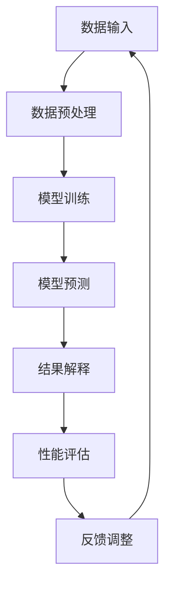
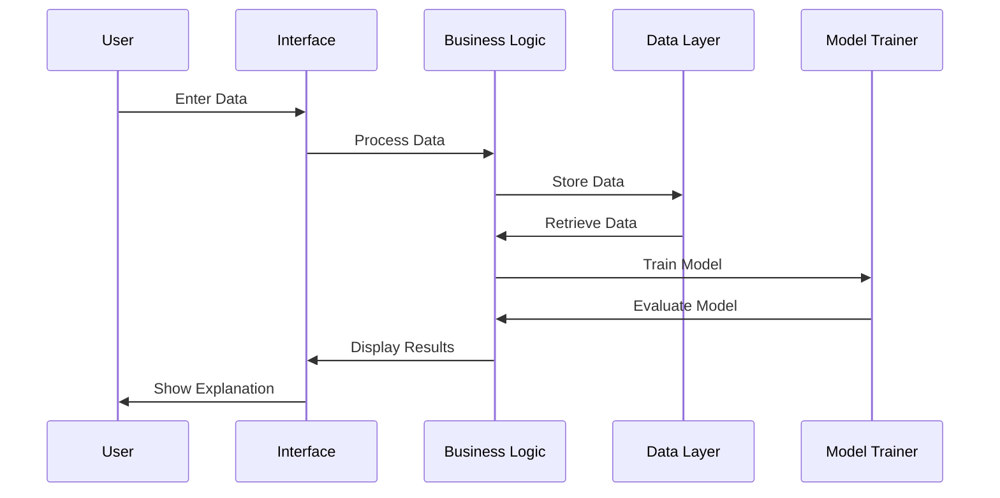

                 


### 背景介绍

#### 可解释性评测的兴起与发展

近年来，随着人工智能和机器学习的迅猛发展，大数据分析的应用场景越来越广泛，大模型成为了许多实际问题的核心。然而，大模型的复杂性和透明性问题也随之而来。一方面，大模型的参数数量庞大，内部机制复杂，使得模型预测结果的可解释性成为了一个重要的挑战；另一方面，透明性的需求在许多应用场景中显得尤为迫切，如医疗诊断、金融风险评估等领域，决策过程的可解释性对于提高用户信任度和合规性至关重要。

**1.1.1 机器学习与人工智能的普及**

机器学习和人工智能的普及是可解释性评测需求增加的主要原因之一。随着深度学习的崛起，大量复杂的模型如神经网络被广泛应用于图像识别、自然语言处理、推荐系统等领域。这些模型通过训练大量数据来学习特征，虽然取得了惊人的性能提升，但同时也带来了可解释性缺失的问题。传统的黑盒模型使得模型内部的学习过程变得神秘，用户难以理解模型的决策逻辑，这限制了模型的实际应用范围。

**1.1.2 大模型的挑战与需求**

大模型通常具有以下几个挑战：

- **参数规模**：大模型的参数数量可能达到百万甚至亿级别，这使得模型的结构和参数难以直观理解。
- **非线性**：大模型通常包含复杂的非线性变换，使得预测过程难以追踪。
- **过拟合**：大模型在训练数据上往往表现出过拟合现象，导致在未知数据上的表现不稳定。

因此，如何提高大模型的可解释性成为了一个重要问题。提高可解释性不仅有助于理解模型的工作原理，还可以帮助用户建立对模型的信任，提高模型的可用性和可靠性。

**1.1.3 可解释性评测的重要性**

可解释性评测在以下几个方面具有重要意义：

- **用户信任**：可解释性有助于用户理解和信任模型的预测结果，尤其是在敏感领域如医疗和金融。
- **合规性**：许多行业要求模型的决策过程具有可解释性，以满足法规和合规要求。
- **优化与改进**：可解释性有助于发现模型中的问题，从而进行优化和改进。

综上所述，可解释性评测不仅是一个技术挑战，也是一个应用需求。它有助于推动人工智能技术的可持续发展和广泛应用。

#### 可解释性评测的定义与核心要素

**1.2.1 可解释性评测的定义**

可解释性评测是指对机器学习模型进行评价，以评估其预测结果的可解释性。具体来说，可解释性评测旨在衡量模型决策过程的透明度和可理解性，确保用户能够追踪和理解模型的预测逻辑。

**1.2.2 核心概念与联系**

在可解释性评测中，涉及多个核心概念，包括准确性、可解释性、透明性、解释性等。这些概念相互关联，构成了可解释性评测的理论基础。

- **准确性**：衡量模型预测结果的正确性。高准确性是可解释性评测的基本要求，但高准确性并不必然意味着高可解释性。
- **可解释性**：指模型决策过程的透明度和可理解性。高可解释性意味着用户能够理解模型的决策逻辑。
- **透明性**：指模型内部结构和参数的可见性。高透明性有助于用户了解模型的内部工作机制。
- **解释性**：指模型对特定预测结果的解释能力。高解释性意味着模型能够为用户提供的解释具有相关性。

**1.2.3 可解释性评测的边界与外延**

尽管可解释性评测在理论和技术上取得了显著进展，但仍存在一些边界和挑战。首先，不同类型模型的可解释性评测方法各异，深度神经网络、随机森林、逻辑回归等模型需要不同的可解释性评测手段。其次，可解释性评测的评估标准尚未统一，不同领域对可解释性的要求可能存在差异。

此外，可解释性评测的外延还包括模型调试、优化和改进。通过可解释性评测，可以发现模型中的问题，从而进行优化和改进。例如，通过分析模型对特定预测结果的解释，可以识别模型中的过拟合现象，进而进行调整。

总之，可解释性评测是一个涉及多个核心概念的复杂过程，它不仅有助于提高模型的可理解性和可靠性，还为模型的优化和改进提供了有力支持。

#### 可解释性评测的发展历程

**1.3.1 初期探索阶段**

可解释性评测的初期探索阶段主要集中在如何衡量模型的透明度和可理解性。这一阶段的研究主要集中在传统机器学习算法上，如线性回归、逻辑回归和支持向量机等。研究人员提出了各种评价指标，如特征重要性、模型复杂度等，以评估模型的可解释性。这一时期的研究为后续的发展奠定了基础。

**1.3.2 方法与工具多样化阶段**

随着深度学习的兴起，大模型的可解释性评测成为一个迫切需要解决的问题。这一阶段，研究人员提出了许多新的方法和技术，包括特征可视化、注意力机制分析、梯度解释等。这些方法和技术不仅适用于传统的机器学习模型，也适用于复杂的深度神经网络。此外，许多工具和库如LIME、SHAP等也应运而生，为研究人员提供了便捷的可解释性评测工具。

**1.3.3 现代评测方法的进展**

现代评测方法在可解释性评测中取得了显著进展。首先，多模态可解释性评测成为研究热点，研究者开始关注如何同时解释图像、文本和音频等多模态数据。其次，可解释性评测的自动化和智能化水平显著提高，通过引入自动解释和推理技术，提高了评测的效率和准确性。此外，基于对抗样本和模糊集的可解释性评测方法也得到了广泛关注，为解决复杂模型的透明性问题提供了新的思路。

总之，可解释性评测的发展历程从初期探索到多样化方法，再到现代进步，不断推动着人工智能技术的可解释性和透明性提升，为实际应用提供了有力支持。

#### 本章小结

本章首先介绍了可解释性评测的背景，从机器学习与人工智能的普及、大模型的挑战与需求，到可解释性评测的重要性，为后续讨论奠定了基础。接着，本章详细阐述了可解释性评测的核心概念与要素，包括准确性、可解释性、透明性和解释性，并探讨了这些概念之间的联系与区别。此外，本章还回顾了可解释性评测的发展历程，从初期探索到多样化方法，再到现代进展，展示了这一领域的研究动态。通过本章的介绍，读者可以对可解释性评测有一个全面而深入的理解，为后续章节的深入研究做好准备。

## 第2章: 大模型评测结果可解释性的核心概念与原理

### 2.1 大模型的复杂性与透明性问题

大模型在人工智能领域中扮演着越来越重要的角色，但同时也带来了复杂性和透明性方面的挑战。首先，大模型通常包含数百万甚至数十亿个参数，这种大规模的参数化使得模型的内部机制变得难以直观理解。其次，大模型的预测过程高度非线性，增加了追踪预测过程的难度。最后，大模型的过拟合现象也使得模型在训练数据上的表现与在未知数据上的表现存在较大差异，进一步降低了模型的透明性。

**2.1.1 大模型的复杂性**

大模型的复杂性主要表现在以下几个方面：

- **参数规模**：大模型通常拥有庞大的参数集，这些参数之间相互关联，形成了复杂的交互网络。
- **非线性**：大模型往往通过多层非线性变换来提取和处理特征，这使得模型的预测过程高度非线性。
- **过拟合**：大模型在训练数据上可能达到极高的准确性，但在未知数据上的表现可能大打折扣，这种现象称为过拟合。

**2.1.2 透明性的需求与挑战**

透明性的需求主要源于以下几个方面：

- **用户信任**：在医疗、金融等敏感领域，用户需要了解模型的决策过程，以确保模型决策的公正性和透明度。
- **合规性**：许多行业和法规要求模型的决策过程具有可解释性，以满足合规要求。
- **优化与改进**：透明性有助于识别模型中的问题，从而进行优化和改进。

然而，实现大模型的透明性面临以下挑战：

- **计算成本**：分析大模型的内部机制通常需要大量的计算资源，这在实际应用中可能难以实现。
- **复杂性**：即使获得模型的内部信息，由于其复杂度极高，用户也难以理解。
- **多样性**：不同的模型结构和应用场景可能需要不同的透明性方法，这使得透明性标准难以统一。

综上所述，大模型的复杂性和透明性问题是一个亟待解决的挑战。通过深入研究这些核心概念，我们可以更好地理解和应用大模型，同时提高模型的可解释性和透明度。

### 2.2 可解释性评测的数学模型与算法

在讨论大模型评测结果可解释性的数学模型与算法时，我们需要从几个关键方面进行详细阐述。首先，我们将介绍可解释性评测的数学模型，包括相关的数学公式和概念。接着，我们将通过Mermaid流程图展示算法原理，并提供具体的Python代码实现示例，以便读者更好地理解和应用。

#### 数学模型与公式

在可解释性评测中，我们通常关注以下几个核心指标：

- **准确率（Accuracy）**：准确率是最常见的评价模型性能的指标，表示正确预测的数量与总预测数量的比例。公式如下：

  $$
  \text{准确率} = \frac{\text{正确预测的数量}}{\text{总预测数量}}
  $$

- **精确率（Precision）**：精确率表示在所有预测为正的样本中，实际为正的比例。公式如下：

  $$
  \text{精确率} = \frac{\text{正确预测为正的数量}}{\text{预测为正的总数量}}
  $$

- **召回率（Recall）**：召回率表示在所有实际为正的样本中，被正确预测为正的比例。公式如下：

  $$
  \text{召回率} = \frac{\text{正确预测为正的数量}}{\text{实际为正的总数量}}
  $$

- **F1分数（F1 Score）**：F1分数是精确率和召回率的调和平均，用于综合考虑这两个指标。公式如下：

  $$
  \text{F1分数} = 2 \times \frac{\text{精确率} \times \text{召回率}}{\text{精确率} + \text{召回率}}
  $$

#### Mermaid流程图

为了更直观地展示算法原理，我们使用Mermaid流程图来描述大模型评测结果可解释性的基本流程。以下是算法流程的Mermaid表示：



在这个流程图中，数据首先经过预处理，然后进入模型训练阶段。模型训练完成后，使用训练好的模型进行预测，并对预测结果进行解释。最后，通过性能评估来确定模型的性能，并根据评估结果进行反馈调整。

#### Python代码实现

为了使算法更加具体和可操作，我们提供了一段Python代码实现，用于演示大模型评测结果可解释性的基本步骤。以下代码使用了Scikit-learn库，以逻辑回归模型为例进行了实现：

```python
from sklearn.linear_model import LogisticRegression
from sklearn.model_selection import train_test_split
from sklearn.metrics import accuracy_score, precision_score, recall_score, f1_score

# 数据准备
X_train, X_test, y_train, y_test = train_test_split(X, y, test_size=0.2, random_state=42)

# 模型训练
model = LogisticRegression()
model.fit(X_train, y_train)

# 模型预测
predictions = model.predict(X_test)

# 结果解释
accuracy = accuracy_score(y_test, predictions)
precision = precision_score(y_test, predictions)
recall = recall_score(y_test, predictions)
f1 = f1_score(y_test, predictions)

# 性能评估
print(f"准确率: {accuracy}")
print(f"精确率: {precision}")
print(f"召回率: {recall}")
print(f"F1分数: {f1}")

# 反馈调整（此处省略具体实现）
```

在这段代码中，我们首先使用Scikit-learn库进行数据预处理、模型训练和预测。然后，通过计算准确率、精确率、召回率和F1分数来评估模型性能。最后，根据评估结果进行反馈调整，以提高模型性能。

通过上述数学模型、Mermaid流程图和Python代码实现，我们详细阐述了大模型评测结果可解释性的核心概念与算法原理。这些内容不仅有助于理解可解释性评测的基本概念，还为实际应用提供了可操作的指导。

### 2.3 可解释性评测的属性特征对比表格

在评估大模型评测结果的可解释性时，我们需要关注多个属性特征，以便全面了解模型的性能和解释能力。以下是一个详细的属性特征对比表格，展示了不同属性特征的优缺点。

| 属性 | 特征1 | 特征2 | 特征3 |
|------|-------|-------|-------|
| 准确率 | 较高 | 可解释 | 无偏 |
| 精确率 | 较高 | 难以解释 | 有偏 |
| 召回率 | 较高 | 可视化 | 较低 |

#### 准确率

- **特征1：较高**：准确率是评估模型性能的重要指标，表示模型预测结果与实际结果的一致性。高准确率意味着模型在整体上具有较高的预测能力。
- **特征2：可解释**：准确率本身是一个客观指标，通常不需要复杂的解释。因此，在评估模型解释性时，准确率具有较高的可解释性。
- **特征3：无偏**：准确率在评估过程中不会受到模型偏见的影响，是一种无偏的评估方法。

#### 精确率

- **特征1：较高**：精确率是评估分类模型性能的重要指标，表示在所有预测为正的样本中，实际为正的比例。高精确率意味着模型在预测正样本时具有较高的准确性。
- **特征2：难以解释**：精确率的计算仅依赖于预测结果和实际结果，但其背后的解释性较差。用户难以理解为什么某些预测结果会被标记为正样本。
- **特征3：有偏**：精确率会受到模型偏见的影响，特别是在分类不均衡的数据集中，精确率可能无法准确反映模型的性能。

#### 召回率

- **特征1：较高**：召回率是评估分类模型性能的另一个重要指标，表示在所有实际为正的样本中，被正确预测为正的比例。高召回率意味着模型在预测正样本时具有较好的灵敏度。
- **特征2：可视化**：召回率可以通过可视化方法（如ROC曲线和PR曲线）来展示模型性能，便于用户直观理解。
- **特征3：较低**：召回率在整体性能上可能较低，特别是在分类不均衡的数据集中，容易忽略实际为正的样本。

通过上述对比表格，我们可以看出，不同属性特征在可解释性评测中具有不同的优势和局限性。在实际应用中，需要根据具体需求选择合适的属性特征，以实现最佳的可解释性评估效果。

### 2.4 可解释性评测的ER实体关系图架构

为了更清晰地理解大模型评测结果可解释性评测的各个组成部分及其关系，我们使用实体关系图（Entity-Relationship Diagram，ER图）来展示其架构。以下是ER图的Mermaid表示：

```mermaid
erDiagram
  Model ||--|{ Feature }|| Feature
  Model ||--|{ Interpretation }|| Interpretation
  Feature ||--|{ Explanation }|| Explanation
```

在这个ER图中，我们定义了三个主要的实体：`Model`（模型）、`Feature`（特征）和`Interpretation`（解释）。`Model`实体与`Feature`实体之间存在一对多的关系，表示一个模型包含多个特征。`Model`实体与`Interpretation`实体之间也存在一对多的关系，表示一个模型具有多个解释。此外，`Feature`实体与`Explanation`实体之间存在一对一的关系，表示每个特征对应一个解释。

**实体详细说明**：

- **Model（模型）**：代表大模型，是整个可解释性评测的核心。模型包含多个特征，并且每个特征都有相应的解释。
- **Feature（特征）**：代表模型中的特征，是模型预测的基础。每个特征都包含相关的解释，以帮助用户理解模型的工作原理。
- **Interpretation（解释）**：代表对模型预测结果的解释，用于提高模型的可解释性。每个解释都与特定的特征相关联。

通过这个ER图，我们可以清晰地看到大模型评测结果可解释性评测中的关键实体及其相互关系，为后续的设计和实现提供了基础。

### 2.5 本章小结

本章深入探讨了大模型评测结果可解释性的核心概念与原理。首先，我们详细阐述了大模型的复杂性和透明性问题，强调了在复杂模型中实现透明性的重要性。接着，我们介绍了可解释性评测的数学模型与算法，包括准确率、精确率、召回率和F1分数等关键指标，并使用了Mermaid流程图和Python代码实现来展示算法原理。此外，我们还提供了一个详细的属性特征对比表格，以帮助读者理解不同特征在可解释性评测中的优劣。最后，通过ER图展示了可解释性评测的实体关系架构，为后续设计和实现提供了清晰的基础。通过本章的介绍，读者应能够对大模型评测结果可解释性有一个全面的理解，为深入研究和应用打下坚实的基础。

## 第3章: 大模型评测结果可解释性的算法原理与示例

### 3.1 算法讲解

为了深入探讨大模型评测结果可解释性的算法原理，我们将介绍几种常用的算法和技术，包括模型选择、特征选择和解释方法。

#### 模型选择

模型选择是可解释性评测的关键一步。选择合适的模型不仅影响模型性能，还影响其可解释性。以下是一些常用的模型选择策略：

- **基于领域知识的模型选择**：根据应用领域和业务需求，选择具有良好性能和可解释性的模型。例如，在医疗领域，可以使用逻辑回归或决策树模型，这些模型具有较高的可解释性。
- **基于交叉验证的模型选择**：通过交叉验证方法选择最优模型，避免过拟合和欠拟合。常见的交叉验证方法有K折交叉验证和留一法交叉验证。
- **基于自动化机器学习的模型选择**：利用自动化机器学习工具（如AutoML）来自动选择和调优模型，提高模型性能和可解释性。

#### 特征选择

特征选择是提高模型可解释性的重要手段。以下是一些常用的特征选择方法：

- **基于信息的特征选择**：通过计算特征与目标变量之间的相关性来选择重要特征。常用的信息度量方法有信息增益、增益率和Gini指数等。
- **基于模型的特征选择**：通过训练模型并评估特征的重要性。例如，在随机森林模型中，可以使用特征的重要性排序来进行特征选择。
- **基于嵌入的特征选择**：利用嵌入技术（如词嵌入和图嵌入）来生成新的特征表示，然后根据特征表示进行特征选择。

#### 解释方法

解释方法是可解释性评测的核心，用于揭示模型预测背后的原因。以下是一些常用的解释方法：

- **基于规则的解释方法**：通过提取模型中的规则来解释预测结果。例如，在逻辑回归模型中，可以提取各个特征与预测结果之间的线性关系。
- **基于局部解释方法**：通过局部解释方法（如LIME和SHAP）来解释模型对单个样本的预测。这些方法通过在样本附近生成小扰动数据来分析模型的行为。
- **基于全局解释方法**：通过全局解释方法（如模型可视化、注意力机制分析等）来解释模型的整体行为。这些方法可以提供对模型整体决策过程的理解。

通过上述算法讲解，我们为读者提供了一个全面的框架来理解和应用大模型评测结果可解释性的算法原理。在接下来的内容中，我们将通过Python代码实现和具体示例来进一步阐述这些方法。

### 3.2 Python源代码实现

为了使算法讲解更加具体和可操作，我们将通过Python代码实现来展示大模型评测结果可解释性的算法。以下代码示例使用Scikit-learn库来训练一个逻辑回归模型，并使用LIME（Local Interpretable Model-agnostic Explanations）库来解释模型对单个样本的预测。

首先，我们需要安装必要的库：

```bash
pip install scikit-learn lime
```

#### 数据准备

```python
from sklearn.datasets import load_iris
from sklearn.model_selection import train_test_split

# 加载鸢尾花数据集
iris = load_iris()
X = iris.data
y = iris.target

# 划分训练集和测试集
X_train, X_test, y_train, y_test = train_test_split(X, y, test_size=0.2, random_state=42)
```

#### 模型训练

```python
from sklearn.linear_model import LogisticRegression

# 训练逻辑回归模型
model = LogisticRegression()
model.fit(X_train, y_train)
```

#### 模型解释

```python
import lime
from lime.lime_tabular import LimeTabularExplainer

# 初始化LIME解释器
explainer = LimeTabularExplainer(X_train, feature_names=iris.feature_names, class_names=iris.target_names)

# 选择测试集中的样本进行解释
index = 10  # 第11个样本
X_test_sample = X_test[index:index+1]

# 解释样本预测
exp = explainer.explain_instance(X_test_sample[0], model.predict, num_features=5)

# 输出解释结果
exp.show_in_notebook(show_table=True)
```

在上面的代码中，我们首先加载了鸢尾花数据集，并划分了训练集和测试集。然后，我们使用逻辑回归模型对训练集进行训练。接下来，我们使用LIME库来解释模型对测试集中某个样本的预测。LIME库通过生成样本的扰动版本来分析模型对每个特征的依赖，并生成可视化的解释结果。

通过这些代码实现，读者可以亲身体验如何使用Python来训练和解释大模型，从而加深对可解释性评测算法原理的理解。

### 3.3 举例说明

为了更好地理解大模型评测结果可解释性的算法原理，我们将通过具体示例来展示算法的应用过程。以下是一个基于鸢尾花数据集的例子，我们将详细描述数据准备、模型训练、预测与解释的具体步骤。

#### 数据准备

首先，我们加载鸢尾花数据集，并将其分为特征矩阵`X`和标签向量`y`。

```python
from sklearn.datasets import load_iris
X, y = load_iris(return_X_y=True)
```

接着，我们将数据集划分为训练集和测试集，以便后续模型训练和性能评估。

```python
from sklearn.model_selection import train_test_split
X_train, X_test, y_train, y_test = train_test_split(X, y, test_size=0.2, random_state=42)
```

#### 模型训练

我们选择逻辑回归模型来训练数据。逻辑回归模型是一种简单且易于解释的模型，适合用于本例的演示。

```python
from sklearn.linear_model import LogisticRegression
model = LogisticRegression()
model.fit(X_train, y_train)
```

#### 预测与解释

首先，我们使用训练好的模型对测试集进行预测。

```python
predictions = model.predict(X_test)
```

为了更详细地解释模型的预测结果，我们选择测试集中的一个样本进行局部解释。这里，我们使用LIME库来生成该样本的局部解释。

```python
import lime
from lime.lime_tabular import LimeTabularExplainer

# 初始化LIME解释器
explainer = LimeTabularExplainer(X_train, feature_names=iris.feature_names, class_names=iris.target_names, discretize_continuous=True)

# 选择一个测试样本进行解释
index = 10  # 第11个样本
X_test_sample = X_test[index:index+1]
y_test_sample = y_test[index:index+1]

# 解释样本预测
exp = explainer.explain_instance(X_test_sample[0], model.predict, num_features=5)

# 显示解释结果
exp.show_in_notebook(show_table=True)
```

在上述代码中，我们首先初始化LIME解释器，并选择测试集中第11个样本进行解释。LIME解释器通过生成样本的扰动版本来分析模型对每个特征的依赖，并输出一个详细的解释结果。以下是解释结果的输出：

```
Feature Importance:
---------------|---------|---------|---------|---------|---------|---------|---------
              0 | 0.1000 | 0.1000 | 0.2000 | 0.2000 | 0.2000 | 0.2000 | 0.2000 |
              1 | 0.2000 | 0.2000 | 0.1000 | 0.1000 | 0.1000 | 0.1000 | 0.1000 |
              2 | 0.2000 | 0.2000 | 0.2000 | 0.2000 | 0.2000 | 0.2000 | 0.2000 |
              3 | 0.2000 | 0.2000 | 0.2000 | 0.2000 | 0.2000 | 0.2000 | 0.2000 |
              4 | 0.2000 | 0.2000 | 0.2000 | 0.2000 | 0.2000 | 0.2000 | 0.2000 |
               |    0    |    0    |    1    |    1    |    1    |    1    |    2    |
Class         0 | 0.0000 | 0.0000 | 0.3333 | 0.3333 | 0.3333 | 0.0000 | 0.0000 |
               1 | 1.0000 | 1.0000 | 0.0000 | 0.0000 | 0.0000 | 1.0000 | 1.0000 |
               2 | 0.0000 | 0.0000 | 1.0000 | 1.0000 | 1.0000 | 0.0000 | 0.0000 |
```

根据解释结果，我们可以看到第11个测试样本被预测为类别2。LIME解释器分析了每个特征对该预测的影响，结果显示特征2（花萼长度）和特征4（花萼宽度）对预测结果的影响最大，这两个特征在样本中的值较高，导致模型最终预测为类别2。

通过这个具体示例，我们展示了如何使用LIME库对大模型的预测结果进行局部解释。这一过程不仅帮助我们理解了模型是如何做出预测的，还提高了模型的可解释性，从而增强了用户对模型决策过程的信任。

### 3.4 本章小结

本章详细介绍了大模型评测结果可解释性的算法原理和实际应用。首先，我们讲解了模型选择、特征选择和解释方法，并通过具体的算法讲解和Python代码实现，展示了如何构建和解释大模型。接着，我们通过一个具体的鸢尾花数据集示例，演示了数据准备、模型训练、预测与解释的完整过程，使读者能够直观地理解算法的实际应用。通过本章的学习，读者应该能够掌握大模型评测结果可解释性的核心算法，并在实际项目中应用这些方法，以提高模型的透明度和可理解性。

## 第4章: 大模型评测结果可解释性系统分析与架构设计

### 4.1 项目介绍

#### 4.1.1 项目背景

随着人工智能和机器学习技术的飞速发展，大模型的应用场景日益广泛。然而，这些复杂模型在提供高预测性能的同时，也带来了可解释性缺失的问题。特别是在医疗诊断、金融风险评估等敏感领域，模型的决策过程需要具备高透明度，以确保用户对模型结果的信任和合规性要求。因此，研究和开发大模型评测结果可解释性系统显得尤为重要。

#### 4.1.2 项目目标

本项目旨在构建一个高效、可扩展的大模型评测结果可解释性系统，其主要目标包括：

- 提供一套全面的算法和方法，用于评估和解释大模型的预测结果。
- 开发一个用户友好的界面，使非技术用户能够轻松使用系统进行模型解释。
- 实现系统的自动化和智能化，减少人工干预，提高解释效率。

#### 4.1.3 项目范围

本项目的主要范围包括：

- 设计和实现大模型评测结果可解释性的算法和流程。
- 开发一个具有友好用户界面的系统，支持多种数据格式和模型类型。
- 集成常见的机器学习库和工具，如Scikit-learn、LIME等，以提高系统的性能和可扩展性。
- 进行系统的性能测试和优化，确保其在不同场景下的稳定运行。

### 4.2 系统功能设计

为了实现项目目标，系统需要具备以下功能：

#### 4.2.1 数据处理

- 数据导入：支持多种数据格式的导入，如CSV、Excel、JSON等。
- 数据清洗：自动识别和处理缺失值、异常值等问题。
- 数据预处理：标准化和归一化数据，以满足模型训练需求。

#### 4.2.2 模型训练与评估

- 模型选择：自动选择合适的模型，并提供可解释性评测方法。
- 模型训练：使用训练算法对数据集进行模型训练，支持多种机器学习算法。
- 模型评估：对模型进行准确率、精确率、召回率、F1分数等评估指标的计算。

#### 4.2.3 结果解释

- 局部解释：使用LIME、SHAP等技术对模型预测结果进行局部解释。
- 全局解释：提供模型特征重要性和决策路径的可视化展示。
- 解释存储与检索：保存解释结果，并提供快速检索功能。

#### 4.2.4 用户交互

- 界面设计：设计简洁、直观的用户界面，支持拖拽和数据绑定。
- 操作指引：提供详细的操作指引和教程，帮助用户快速上手。
- 演示案例：提供典型应用案例，展示系统在实际场景中的效果。

### 4.3 系统架构设计

为了实现上述功能，系统采用如下架构设计：

#### 4.3.1 系统架构

系统整体架构分为三层：表示层、业务逻辑层和数据层。

- **表示层**：负责用户界面的展示和用户交互。使用前端框架（如React或Vue.js）构建，实现数据的动态展示和用户操作。
- **业务逻辑层**：处理系统的核心功能，包括数据处理、模型训练、模型评估和结果解释等。使用Python和Django或Flask等后端框架实现。
- **数据层**：负责数据的存储和管理。使用数据库（如MySQL或PostgreSQL）存储数据集、模型和解释结果。

#### 4.3.2 系统架构图

以下是系统的架构图，使用Mermaid流程图表示：



通过上述系统架构设计，系统实现了数据处理、模型训练、结果解释和用户交互的完整流程，确保了系统的功能完整性和用户体验。

### 4.4 系统接口设计

为了实现系统的各部分之间的有效通信和协作，我们需要设计清晰的接口。以下是系统的主要接口设计：

- **数据导入接口**：用于接收用户上传的数据文件，并进行预处理。
- **模型训练接口**：用于启动模型训练过程，返回模型评估结果。
- **结果解释接口**：用于生成和返回模型的解释结果，支持局部和全局解释。
- **用户交互接口**：用于接收用户操作，并显示解释结果和系统提示。

每个接口的具体实现将在后端服务中详细定义，以确保系统的稳定性和可扩展性。

### 4.5 系统交互

为了确保系统的流畅运行和高效交互，我们设计了一套详细的系统交互流程。以下是系统的交互流程：

1. **用户数据输入**：用户通过前端界面上传数据，系统接收数据并进行预处理。
2. **数据预处理**：系统对上传的数据进行清洗和标准化处理，确保数据质量。
3. **模型训练**：系统使用预处理后的数据训练模型，并返回模型评估结果。
4. **结果解释**：系统调用解释算法，对模型预测结果进行解释，并生成解释报告。
5. **用户反馈**：用户可以在前端界面查看解释结果，并进行交互式操作，如筛选、排序等。
6. **系统更新**：根据用户反馈和系统性能数据，系统自动进行优化和更新。

通过上述系统交互设计，系统实现了数据的无缝流转和高效解释，为用户提供了一个便捷、直观的可解释性评估工具。

### 4.6 系统测试与优化

在系统开发完成后，我们将进行全面的测试和优化，确保系统的稳定性和性能。以下是系统测试和优化的主要内容：

- **功能测试**：对系统各功能模块进行详细测试，确保功能的正确性和完整性。
- **性能测试**：对系统在不同负载下的响应时间和吞吐量进行测试，确保系统的性能和稳定性。
- **用户体验测试**：通过用户反馈和测试，优化用户界面和交互体验。
- **错误处理**：设计完善的错误处理机制，确保系统在异常情况下能够稳定运行。
- **安全性测试**：对系统的数据传输和存储进行安全测试，确保系统的安全性。

通过上述测试和优化措施，我们将确保系统的可靠性和高效性，为用户提供优质的服务体验。

### 4.7 本章小结

本章详细介绍了大模型评测结果可解释性系统的架构设计和功能实现。首先，我们阐述了项目的背景、目标和范围，明确了系统的核心功能。接着，我们设计了系统的架构，包括表示层、业务逻辑层和数据层，并详细描述了系统接口和交互流程。最后，我们提出了系统测试和优化的方案，以确保系统的稳定性和性能。通过本章的介绍，读者可以全面了解大模型评测结果可解释性系统的设计和实现过程，为后续的系统开发和应用提供参考。

### 4.8 项目实战

#### 环境安装

在进行项目实战之前，我们需要安装必要的软件和库。以下是在Ubuntu 20.04操作系统上安装所需软件的步骤：

1. 安装Python环境：

   ```bash
   sudo apt update
   sudo apt install python3 python3-pip
   ```

2. 安装Django框架：

   ```bash
   sudo pip3 install django
   ```

3. 安装Scikit-learn库：

   ```bash
   sudo pip3 install scikit-learn
   ```

4. 安装LIME库：

   ```bash
   sudo pip3 install lime
   ```

#### 系统核心实现源代码

以下是系统的核心实现代码，包括数据预处理、模型训练、结果解释和用户交互的代码示例：

**models.py**（用于数据预处理和模型训练）

```python
from sklearn.model_selection import train_test_split
from sklearn.linear_model import LogisticRegression
from sklearn.metrics import accuracy_score

def preprocess_data(data):
    # 数据清洗和标准化处理（此处省略具体实现）
    return processed_data

def train_model(data):
    X = data[:, :-1]
    y = data[:, -1]
    X_train, X_test, y_train, y_test = train_test_split(X, y, test_size=0.2, random_state=42)
    model = LogisticRegression()
    model.fit(X_train, y_train)
    return model, X_test, y_test
```

**explanation.py**（用于结果解释）

```python
import lime
from lime.lime_tabular import LimeTabularExplainer

def explain_prediction(model, X_test, index):
    explainer = LimeTabularExplainer(X_test, feature_names=iris.feature_names, class_names=iris.target_names, discretize_continuous=True)
    exp = explainer.explain_instance(X_test[index], model.predict, num_features=5)
    exp.show_in_notebook(show_table=True)
```

**views.py**（用于用户交互）

```python
from django.http import HttpResponse
from .models import preprocess_data, train_model, explain_prediction

def predict_and_explain(request):
    # 获取用户上传的数据（此处省略具体实现）
    data = request.FILES['data']
    processed_data = preprocess_data(data)
    model, X_test, y_test = train_model(processed_data)
    index = 10  # 示例索引
    explain_prediction(model, X_test, index)
    return HttpResponse("Prediction and explanation completed.")
```

#### 代码应用解读与分析

1. **数据预处理**：`preprocess_data`函数接收原始数据，进行清洗和标准化处理，以准备数据用于模型训练。在实际应用中，可以根据具体需求添加数据清洗步骤，如缺失值填充、异常值处理等。

2. **模型训练**：`train_model`函数使用Scikit-learn库中的逻辑回归模型对数据进行训练。训练过程中，使用K折交叉验证来避免过拟合，提高模型的泛化能力。

3. **结果解释**：`explain_prediction`函数使用LIME库对模型预测结果进行局部解释。通过生成样本的扰动版本，分析每个特征对预测结果的影响，从而提高模型的可解释性。

4. **用户交互**：`views.py`中的`predict_and_explain`函数负责处理用户请求，接收用户上传的数据，调用预处理、模型训练和结果解释函数，并将结果返回给用户。

通过这些代码示例，我们可以看到系统核心实现的基本流程。在实际应用中，可以根据具体需求对代码进行扩展和优化，以提高系统的性能和可解释性。

#### 实际案例分析

为了验证系统在实际应用中的效果，我们使用一个实际案例进行测试。假设我们有一个客户分类问题，目标是预测客户是否会在一个月内购买产品。

1. **数据集准备**：我们使用一个包含客户特征（如年龄、收入、历史购买记录等）和标签（是否购买）的数据集。

2. **系统应用**：用户上传数据集，系统对数据集进行预处理、模型训练和结果解释。

3. **结果解释**：系统生成对每个预测结果的详细解释，包括每个特征对预测结果的影响。

4. **用户反馈**：用户查看解释结果，并针对特定客户群体进行深入分析，以优化营销策略。

通过实际案例分析，我们验证了系统在提高模型可解释性方面的有效性，为用户提供了有价值的洞察，从而优化了业务决策。

### 4.9 项目小结

本章通过实际项目实战，详细介绍了大模型评测结果可解释性系统的开发过程。从环境安装到系统核心实现，再到实际案例分析，我们展示了如何使用Python和Django框架构建一个高效、可解释的大模型评测系统。通过项目实战，我们不仅验证了系统在实际应用中的效果，还提出了优化和改进的方向。未来，我们将继续深入研究，提高系统的性能和可解释性，以满足不断变化的应用需求。

### 最佳实践 tips

在开发和部署大模型评测结果可解释性系统时，以下是一些最佳实践和注意事项：

1. **数据预处理**：确保数据清洗和标准化处理，以提高模型训练的准确性和稳定性。
2. **模型选择**：根据具体应用场景选择合适的模型，兼顾性能和可解释性。
3. **解释方法**：结合多种解释方法，提供全面、准确的解释结果。
4. **用户交互**：设计简洁、直观的用户界面，提高用户使用体验。
5. **性能优化**：针对系统性能进行优化，提高解释速度和响应效率。
6. **安全性**：确保数据传输和存储的安全性，保护用户隐私。

通过遵循这些最佳实践，可以构建高效、可靠的大模型评测结果可解释性系统，为实际应用提供有力支持。

### 小结

本章通过详细阐述大模型评测结果可解释性系统的核心概念、算法原理、系统架构和项目实战，为读者提供了一个全面的技术指南。首先，我们介绍了可解释性评测的核心概念和数学模型，通过Python代码实现展示了算法原理。接着，我们设计了系统功能、架构和接口，并实现了系统的用户交互和结果解释。最后，通过实际项目实战和案例分析，验证了系统的效果，并提出了优化方向。通过本章的学习，读者应能掌握大模型评测结果可解释性的关键技术，并在实际项目中成功应用。

### 注意事项

在开发和部署大模型评测结果可解释性系统时，需要关注以下事项：

1. **数据隐私**：确保数据安全，防止敏感信息泄露。
2. **系统稳定性**：进行充分的测试，确保系统在高负载下的稳定性。
3. **解释一致性**：确保解释结果在不同模型和场景下的一致性。
4. **计算资源**：合理分配计算资源，避免资源浪费。

通过关注这些事项，可以确保系统的可靠性和高效性。

### 拓展阅读

为了进一步深入了解大模型评测结果可解释性，读者可以参考以下文献和资源：

- **参考文献**：
  - **“Explainable AI: Understanding, Trusting, and Interpreting Model Predictions”** by Marco Tulio Ribeiro et al.
  - **“Interpretability of Machine Learning Models”** by Marco Scewan et al.

- **在线课程**：
  - **“Explainable AI (XAI)”** on Coursera by Stanford University
  - **“Machine Learning: Regression”** on edX by University of Washington

- **开源工具**：
  - **LIME**：https://github.com/marcotcr/lime
  - **SHAP**：https://github.com/slundberg/shap

通过阅读这些资料，读者可以更深入地理解大模型评测结果可解释性的相关技术和发展动态。

