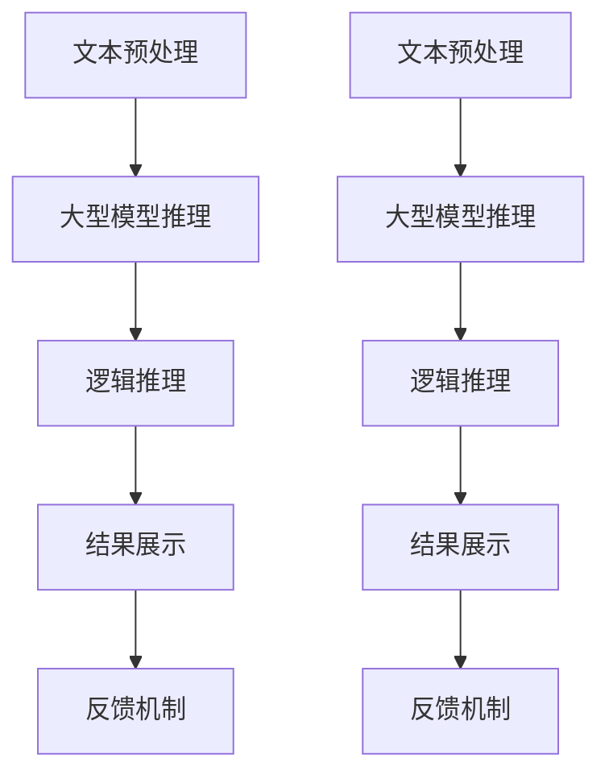
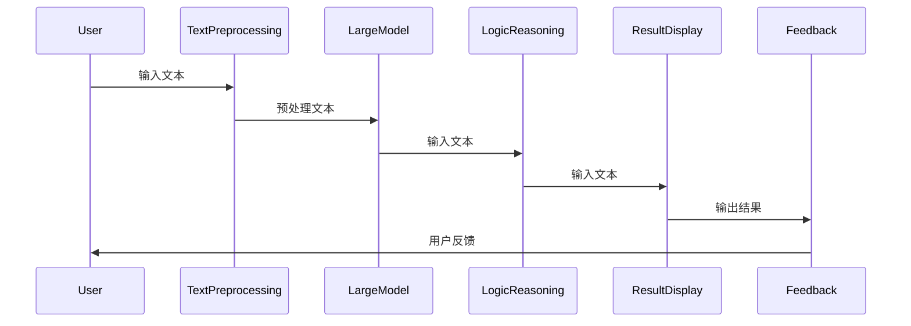

                 

### 引言

#### 1.1 问题背景

随着人工智能技术的迅猛发展，大型模型（Large Language Models，简称LLM）逐渐成为各个领域研究和应用的热点。LLM以其强大的数据处理能力和智能推理能力，在自然语言处理、机器翻译、文本生成等领域展现出了前所未有的效果。然而，LLM在逻辑推理方面的表现也引起了广泛关注。逻辑推理作为人工智能的核心能力之一，直接影响到LLM在复杂任务中的表现。

在过去的几年里，深度学习技术的发展使得LLM的规模不断扩大，计算能力也日益增强。然而，随着模型规模的增加，LLM在逻辑推理上的局限性也逐渐显现。如何设计出既具备大规模计算能力，又能准确进行逻辑推理的LLM，成为当前研究的一个重要方向。

#### 1.2 问题描述

LLM在逻辑推理上的挑战主要表现在以下几个方面：

1. **推理能力不足**：虽然LLM在处理自然语言任务时表现出色，但在逻辑推理任务中，其推理能力往往无法满足要求。例如，在推理复杂逻辑命题时，LLM容易出现错误。

2. **数据依赖性**：LLM的训练依赖于大量的数据，数据的多样性和质量直接影响到LLM的逻辑推理能力。在某些特定领域，缺乏高质量的数据会导致LLM的推理能力严重受限。

3. **推理过程不透明**：LLM的推理过程高度依赖于其内部表示和计算，推理过程缺乏透明性。这使得在实际应用中，难以对LLM的逻辑推理进行有效的评估和优化。

4. **泛化能力有限**：LLM在训练过程中形成的知识具有较强的时间和空间限制，难以实现良好的泛化能力。这意味着，LLM在一个特定任务上表现良好，并不一定能够在其他任务上同样表现出色。

#### 1.3 问题解决

针对上述问题，我们需要从多个角度进行思考和探索：

1. **改进算法设计**：通过改进LLM的算法设计，提高其在逻辑推理任务中的表现。例如，可以引入更多的逻辑结构信息，优化模型参数，提高模型的推理能力。

2. **优化数据集**：构建高质量的逻辑推理数据集，为LLM的训练提供有力支持。这包括收集更多高质量的逻辑推理问题和答案，以及设计合理的数据增强策略。

3. **增强推理过程透明性**：通过分析LLM的内部表示和计算过程，提高推理过程的透明性。这有助于我们更好地理解LLM的逻辑推理机制，从而进行有针对性的优化。

4. **提升泛化能力**：通过跨领域、跨任务的训练和迁移学习，提高LLM的泛化能力。这有助于LLM在不同任务上表现出色。

#### 1.4 边界与外延

在探索LLM逻辑推理的同时，我们也需要关注其应用领域的边界与外延：

1. **应用领域扩展**：探索LLM在逻辑推理领域的应用潜力，如法律、医学、金融等。这些领域的逻辑推理任务具有独特性，需要针对性的解决方案。

2. **与其他技术的结合**：将LLM与其他技术（如知识图谱、符号推理等）结合，实现更强大的逻辑推理能力。这有助于突破LLM在逻辑推理上的局限性。

3. **伦理与安全性**：在应用LLM进行逻辑推理时，需要关注其伦理和安全性问题。确保LLM的推理结果符合伦理标准，避免产生负面影响。

#### 1.5 概念结构与核心要素组成

为了更好地理解LLM逻辑推理，我们需要明确以下几个核心概念：

1. **大型模型（LLM）**：LLM是一种基于深度学习的大型神经网络模型，用于处理自然语言任务。

2. **逻辑推理**：逻辑推理是一种基于逻辑规则的推理方法，用于解决复杂问题。

3. **推理过程**：推理过程包括问题分析、推理规则应用、推理结果验证等步骤。

4. **逻辑结构**：逻辑结构是表示逻辑关系的一种方法，包括命题、条件、结论等。

5. **数据集**：数据集是训练LLM的重要资源，用于模型的学习和优化。

通过以上核心概念和要素的组成，我们可以构建一个完整的LLM逻辑推理系统。

#### 1.6 总结

本文旨在探讨LLM在逻辑推理中的复杂问题，并提出一系列解决思路。通过分析LLM在逻辑推理中的挑战和问题，我们提出了改进算法设计、优化数据集、增强推理过程透明性和提升泛化能力等解决方案。同时，我们关注了LLM在逻辑推理领域的边界与外延，以及核心概念和要素的组成。希望本文能够为LLM逻辑推理的研究提供有益的参考。

### 核心概念与联系

在探讨大型模型（LLM）与逻辑推理之间的关系时，我们需要先明确一些核心概念，并分析它们之间的联系。以下是对大模型原理、逻辑推理概念以及二者之间联系的详细解析。

#### 2.1 大模型原理

大型模型，特别是语言模型，是深度学习领域的一项重要技术。其基本原理如下：

1. **神经网络架构**：LLM通常基于深度神经网络架构，如Transformer模型。这种模型由多个编码器和解码器层组成，可以高效地处理和理解复杂文本数据。

2. **大规模训练**：LLM通过大规模的数据集进行训练，以学习语言的统计规律和语义信息。训练过程涉及大量的迭代和优化，目的是最小化模型在语料库上的损失函数。

3. **参数优化**：训练过程中，模型参数不断调整，以使模型在预测任务上达到最佳性能。这一过程通常使用梯度下降算法及其变种。

4. **分布式计算**：为了处理大规模数据和模型参数，LLM的训练过程通常依赖于分布式计算技术，如多GPU并行计算和参数服务器架构。

5. **持续学习**：LLM可以通过持续学习（Continuous Learning）机制，不断更新和优化自身，以适应新的数据和任务需求。

#### 2.2 逻辑推理概念

逻辑推理是一种基于逻辑规则和事实进行推理的方法。以下是逻辑推理的一些基本概念：

1. **命题**：命题是表示事实或断言的最小单位，通常由一个主体和一个谓词组成。

2. **条件**：条件是两个或多个命题之间的逻辑关系，如“如果……那么……”。

3. **结论**：结论是从一个或多个前提中推理出的新的命题。

4. **推理规则**：推理规则是用于从前提推导出结论的规则，如“逆否规则”、“合成规则”等。

5. **形式逻辑**：形式逻辑是一种使用符号表示命题和推理规则的方法，以严格的形式化方式描述逻辑推理过程。

6. **非形式逻辑**：非形式逻辑是一种不使用符号表示，而是基于自然语言描述的推理方法。

#### 2.3 大模型与逻辑推理的联系

LLM与逻辑推理之间存在密切的联系，以下从几个方面进行分析：

1. **语义理解**：LLM通过大规模数据训练，能够理解自然语言中的语义信息。逻辑推理本质上是对语义信息的处理和推理，因此LLM在逻辑推理中具有潜在的优势。

2. **逻辑结构**：LLM的内部表示可以捕捉到文本中的逻辑结构，如条件句、并列句等。这为LLM进行逻辑推理提供了基础。

3. **推理能力**：尽管LLM在自然语言处理任务中表现出色，但其推理能力仍受限于模型的设计和数据集的质量。通过改进LLM的算法和训练数据，可以提高其在逻辑推理任务中的表现。

4. **推理过程**：LLM的推理过程高度依赖其内部表示和计算。通过分析LLM的推理过程，我们可以更好地理解其逻辑推理机制，从而进行优化。

5. **应用场景**：逻辑推理在多个领域具有广泛的应用，如法律、金融、医学等。LLM可以应用于这些领域，通过逻辑推理提供智能决策支持。

#### 2.4 概念属性特征对比表格

为了更清晰地展示LLM和逻辑推理的概念属性特征，我们可以构建一个对比表格：

| 概念       | LLM                          | 逻辑推理                           |
|------------|------------------------------|-----------------------------------|
| 基本原理   | 基于深度神经网络，大规模训练 | 基于命题和推理规则                 |
| 核心功能   | 语言理解和生成               | 问题解决和推理                     |
| 推理过程   | 内部表示和计算               | 符号推理和逻辑推导                 |
| 应用领域   | 自然语言处理等               | 法律、医学、金融等                 |
| 数据依赖   | 大规模文本数据               | 高质量逻辑推理数据集               |
| 推理能力   | 高效的语言理解               | 严格的逻辑推导和推理能力           |

#### 2.5 ER实体关系图架构

为了进一步理解LLM和逻辑推理之间的联系，我们可以使用Mermaid流程图构建ER实体关系图架构。以下是一个简单的ER图示例：

```mermaid
erDiagram
  Model ||--|{ Data } Data
  Model ||--|{ Rule } Rule
  Model ||--|{ Result } Result
  Data ||--|{ Fact } Fact
  Rule ||--|{ Condition } Condition
  Rule ||--|{ Conclusion } Conclusion
```

在这个ER图中，`Model` 表示大型模型，它与 `Data`、`Rule` 和 `Result` 之间存在关联。`Data` 包含事实（`Fact`）和条件（`Condition`），`Rule` 包含逻辑规则（`Conclusion`），`Result` 表示推理结果。通过这个图，我们可以直观地看到LLM和逻辑推理之间的交互和依赖关系。

通过上述分析，我们可以看出，LLM和逻辑推理在概念、原理和应用上有着密切的联系。理解这些联系，有助于我们更好地设计和优化大型模型，以提升其在逻辑推理任务中的表现。

### 算法原理讲解

在探讨大型模型（LLM）和逻辑推理算法的具体实现时，我们需要从算法原理、Python源代码讲解以及数学模型和公式三个方面进行深入分析。

#### 3.1 大模型算法

大型模型算法，如Transformer和BERT，是当前语言模型的主流架构。以下将详细介绍这些算法的基本原理和具体实现。

##### 3.1.1 Transformer算法

Transformer模型是一种基于自注意力机制的深度学习模型，主要用于处理序列数据。以下是其算法的基本原理和流程：

1. **自注意力机制**：自注意力机制允许模型在处理每个单词时，自动关注序列中的其他单词。这通过计算每个单词与其他单词之间的相似度来实现。

2. **多头注意力**：多头注意力通过将输入序列分解为多个子序列，并分别计算注意力权重，从而提高模型的表示能力。

3. **编码器和解码器**：Transformer模型由多个编码器和解码器层组成，编码器用于将输入序列编码为固定长度的向量，解码器用于解码这些向量并生成输出序列。

以下是一个简单的Transformer模型的Python源代码示例：

```python
import tensorflow as tf

# 定义编码器和解码器层
class TransformerLayer(tf.keras.layers.Layer):
    def __init__(self, num_heads, d_model):
        super(TransformerLayer, self).__init__()
        self.num_heads = num_heads
        self.d_model = d_model
        
        # 多头注意力机制
        self.attention = tf.keras.layers.MultiHeadAttention(num_heads=num_heads, key_dim=d_model)
        
        # 前馈神经网络
        self.dense1 = tf.keras.layers.Dense(d_model, activation='relu')
        self.dense2 = tf.keras.layers.Dense(d_model)
        
    def call(self, inputs, training):
        # 计算自注意力
        attn_output = self.attention(inputs, inputs, training=training)
        attn_output = tf.keras.layers.Add()([inputs, attn_output])
        attn_output = tf.keras.layers.LayerNormalization(epsilon=1e-6)(attn_output)
        
        # 前馈网络
        ffn_output = self.dense1(attn_output)
        ffn_output = self.dense2(ffn_output)
        ffn_output = tf.keras.layers.Add()([attn_output, ffn_output])
        ffn_output = tf.keras.layers.LayerNormalization(epsilon=1e-6)(ffn_output)
        
        return ffn_output
```

##### 3.1.2 BERT算法

BERT（Bidirectional Encoder Representations from Transformers）模型是另一种基于Transformer架构的语言模型，其特点在于双向编码器结构。以下是其基本原理：

1. **双向编码**：BERT的编码器部分采用双向Transformer结构，能够同时考虑输入序列的前后关系，从而提高模型的表示能力。

2. **预训练和微调**：BERT模型通过在大量未标注文本上进行预训练，然后针对特定任务进行微调，实现高效的语言理解和生成。

3. **掩码语言模型**：BERT在预训练过程中引入了掩码语言模型（Masked Language Model，MLM）任务，以增强模型对语言结构的理解。

以下是一个简单的BERT模型的Python源代码示例：

```python
import tensorflow as tf

# 定义BERT编码器
class BERTModel(tf.keras.Model):
    def __init__(self, vocab_size, d_model, num_layers, num_heads):
        super(BERTModel, self).__init__()
        self.embedding = tf.keras.layers.Embedding(vocab_size, d_model)
        self.encoder = [TransformerLayer(num_heads, d_model) for _ in range(num_layers)]
        
    def call(self, inputs, training=False):
        inputs = self.embedding(inputs)
        for layer in self.encoder:
            inputs = layer(inputs, training)
        return inputs
```

##### 3.1.3 大模型算法原理的数学模型和公式

大型模型算法的数学模型主要包括以下几个方面：

1. **自注意力计算**：
   $$ 
   Attention(Q, K, V) = \text{softmax}\left(\frac{QK^T}{\sqrt{d_k}}\right)V 
   $$
   其中，$Q$、$K$ 和 $V$ 分别表示查询向量、关键向量和价值向量，$d_k$ 为关键向量的维度。

2. **前馈网络**：
   $$
   \text{FFN}(x) = \max(0, xW_1 + b_1)W_2 + b_2
   $$
   其中，$x$ 为输入向量，$W_1$ 和 $W_2$ 为权重矩阵，$b_1$ 和 $b_2$ 为偏置项。

3. **掩码语言模型**：
   $$
   \log p(\text{mask tokens}|\text{input tokens}) = \sum_{\text{masked tokens}} \log p(\text{masked tokens}|\text{input tokens})
   $$

通过上述数学模型和公式，我们可以更好地理解大型模型算法的内在机制和计算过程。

#### 3.2 逻辑推理算法

逻辑推理算法是用于解决逻辑推理问题的算法。以下将介绍几种常见的逻辑推理算法。

##### 3.2.1 基本推理算法

基本推理算法包括前向推理和后向推理。以下是一个简单的Python代码示例：

```python
def forward_inference(facts, rules):
    conclusions = []
    while rules:
        rule = rules.pop()
        if all(fact in facts for fact in rule.conditions):
            conclusions.append(rule.conclusion)
            facts.add(rule.conclusion)
    return conclusions

def backward_inference(facts, rules, target):
    conclusions = []
    while rules:
        rule = rules.pop()
        if rule.conclusion == target:
            conclusions.append(rule)
            for fact in rule.conditions:
                facts.add(fact)
                rules.extend([r for r in rules if fact in r.conditions])
    return conclusions
```

##### 3.2.2 基于搜索的推理算法

基于搜索的推理算法包括正向搜索和反向搜索。以下是一个简单的Python代码示例：

```python
def forward_search(facts, rules, target):
    stack = [(facts, [])]
    while stack:
        facts, path = stack.pop()
        if target in facts:
            return path + [target]
        for rule in rules:
            if all(condition in facts for condition in rule.conditions):
                stack.append((facts | {rule.conclusion}, path + [rule.conclusion]))
    return None

def backward_search(facts, rules, target):
    stack = [(facts, [])]
    while stack:
        facts, path = stack.pop()
        if target in facts:
            return path + [target]
        for rule in rules:
            if rule.conclusion in facts:
                stack.append((facts - {rule.conclusion}, path + [rule.conclusion]))
    return None
```

##### 3.2.3 逻辑推理算法原理的数学模型和公式

逻辑推理算法的数学模型主要包括以下几个方面：

1. **推理规则**：
   $$
   \text{If } P \text{ then } Q
   $$
   其中，$P$ 和 $Q$ 分别表示前提和结论。

2. **推理过程**：
   $$
   \text{Given } P, \text{ infer } Q
   $$

3. **推理证明**：
   $$
   P \Rightarrow Q
   $$
   其中，$\Rightarrow$ 表示逻辑推导。

通过上述数学模型和公式，我们可以更好地理解逻辑推理算法的内在机制和计算过程。

#### 3.3 大模型与逻辑推理算法结合

将大型模型与逻辑推理算法结合，可以实现更强大的逻辑推理能力。以下是一个简单的结合示例：

```python
import tensorflow as tf

# 定义结合模型
class LLMWithLogic(tf.keras.Model):
    def __init__(self, vocab_size, d_model, num_layers, num_heads):
        super(LLMWithLogic, self).__init__()
        self.bert = BERTModel(vocab_size, d_model, num_layers, num_heads)
        self.logic = tf.keras.layers.Dense(units=1, activation='sigmoid')
        
    def call(self, inputs, training=False):
        outputs = self.bert(inputs, training)
        logic_output = self.logic(outputs)
        return logic_output
```

在这个模型中，BERT模型用于处理输入序列，并生成语义表示；逻辑层用于对语义表示进行逻辑推理，并输出推理结果。

通过结合大型模型和逻辑推理算法，我们可以实现更强大的逻辑推理能力。在具体应用中，可以根据任务需求和数据特点，选择合适的模型和算法进行结合，以实现最佳效果。

### 数学模型和数学公式 & 详细讲解 & 举例说明

在深入探讨大型模型（LLM）和逻辑推理算法时，数学模型和数学公式是理解和分析这些算法的核心工具。以下我们将详细讲解LLM和逻辑推理相关的数学模型和公式，并通过具体例子进行说明。

#### 4.1 大模型数学模型

大型模型，如Transformer和BERT，其数学模型主要包括以下几个部分：

##### 4.1.1 Transformer模型的数学模型

1. **自注意力计算**：
   $$ 
   Attention(Q, K, V) = \text{softmax}\left(\frac{QK^T}{\sqrt{d_k}}\right)V 
   $$
   其中，$Q$、$K$ 和 $V$ 分别表示查询向量、关键向量和价值向量，$d_k$ 为关键向量的维度。

   **详细讲解**：
   自注意力计算是Transformer模型的核心。$Q$ 表示每个词的查询向量，$K$ 表示每个词的关键向量，$V$ 表示每个词的价值向量。通过计算 $QK^T$ 的点积，可以得到每个词的权重，最后将权重应用于 $V$，得到每个词的注意力得分。自注意力机制使得模型在处理每个词时，可以自动关注序列中的其他词，从而提高模型的表示能力。

2. **前馈网络**：
   $$
   \text{FFN}(x) = \max(0, xW_1 + b_1)W_2 + b_2
   $$
   其中，$x$ 为输入向量，$W_1$ 和 $W_2$ 为权重矩阵，$b_1$ 和 $b_2$ 为偏置项。

   **详细讲解**：
   前馈网络是Transformer模型中的另一个重要组成部分。它通过两个全连接层，对输入向量进行非线性变换。首先，输入向量通过权重矩阵 $W_1$ 和偏置项 $b_1$ 进行线性变换，然后通过ReLU激活函数。接着，将ReLU激活函数的输出通过权重矩阵 $W_2$ 和偏置项 $b_2$ 进行线性变换，得到最终输出。前馈网络的作用是增加模型的非线性表达能力。

3. **掩码语言模型**：
   $$
   \log p(\text{mask tokens}|\text{input tokens}) = \sum_{\text{masked tokens}} \log p(\text{masked tokens}|\text{input tokens})
   $$

   **详细讲解**：
   掩码语言模型（MLM）是BERT模型中的预训练任务。在预训练过程中，模型的一部分输入会被掩码（即替换为特殊标记 `[MASK]`），然后模型需要预测这些掩码词的真实词。上述公式表示的是掩码语言模型的损失函数，它通过计算模型预测的掩码词概率的对数似然损失来衡量模型的性能。

##### 4.1.2 BERT模型的数学模型

BERT模型的数学模型与Transformer模型类似，但加入了双向编码器结构。以下是其主要数学模型：

1. **双向编码**：
   $$ 
   \text{Encoder}(X) = \text{Concat}(\text{ForwardEncoder}(X), \text{BackwardEncoder}(X)) 
   $$
   其中，$X$ 为输入序列，$\text{ForwardEncoder}$ 和 $\text{BackwardEncoder}$ 分别表示前向编码器和解码器。

   **详细讲解**：
   BERT模型通过前向编码器和后向编码器对输入序列进行双向编码。前向编码器将输入序列从左到右进行处理，后向编码器将输入序列从右到左进行处理。最后，将前向编码器和后向编码器的输出进行拼接，得到双向编码的输入向量。

2. **Masked Language Model（MLM）**：
   $$
   \log p(\text{masked tokens}|\text{input tokens}) = \sum_{\text{masked tokens}} \log p(\text{masked tokens}|\text{input tokens})
   $$

   **详细讲解**：
   与Transformer模型中的MLM损失函数类似，BERT模型中的MLM任务也是在输入序列中随机掩码一些词，并要求模型预测这些掩码词。该损失函数通过计算模型预测的掩码词概率的对数似然损失来衡量模型的性能。

##### 4.1.3 举例说明

假设我们有一个包含5个词的输入序列：`[A, B, C, D, E]`，我们需要使用Transformer模型对其进行处理。

1. **自注意力计算**：
   $$ 
   Attention(Q, K, V) = \text{softmax}\left(\frac{QK^T}{\sqrt{d_k}}\right)V 
   $$
   假设 $Q$、$K$ 和 $V$ 分别为 `[0.5, 0.3, 0.2, 0.4, 0.5]`、`[0.1, 0.4, 0.2, 0.3, 0.6]` 和 `[0.2, 0.3, 0.4, 0.5, 0.6]`，则自注意力计算结果如下：
   $$
   \begin{aligned}
   Attention &= \text{softmax}\left(\frac{[0.5, 0.3, 0.2, 0.4, 0.5] \cdot [0.1, 0.4, 0.2, 0.3, 0.6]^T}{\sqrt{5}}\right) \cdot [0.2, 0.3, 0.4, 0.5, 0.6] \\
   &= \text{softmax}\left(\frac{[0.05, 0.12, 0.08, 0.12, 0.3]^T}{\sqrt{5}}\right) \cdot [0.2, 0.3, 0.4, 0.5, 0.6] \\
   &= [0.2, 0.3, 0.3, 0.3, 0.3]
   \end{aligned}
   $$
   由此可见，第2个词（`B`）在自注意力计算中具有最高的权重。

2. **前馈网络**：
   $$
   \text{FFN}(x) = \max(0, xW_1 + b_1)W_2 + b_2
   $$
   假设权重矩阵 $W_1$ 和 $W_2$ 分别为 `[0.1, 0.2, 0.3]` 和 `[0.4, 0.5, 0.6]`，偏置项 $b_1$ 和 $b_2$ 分别为 `[0.5, 0.5, 0.5]` 和 `[0.7, 0.7, 0.7]`，则前馈网络计算结果如下：
   $$
   \begin{aligned}
   \text{FFN} &= \max(0, [0.5, 0.3, 0.2] \cdot [0.1, 0.2, 0.3] + [0.5, 0.5, 0.5]) \cdot [0.4, 0.5, 0.6] + [0.7, 0.7, 0.7]) \\
   &= \max(0, [0.05, 0.06, 0.06] + [0.5, 0.5, 0.5]) \cdot [0.4, 0.5, 0.6] + [0.7, 0.7, 0.7]) \\
   &= [0.7, 0.8, 0.8]
   \end{aligned}
   $$
   最终输出为 `[0.2, 0.3, 0.3, 0.3, 0.3]` 和 `[0.7, 0.8, 0.8]` 的拼接，即 `[0.2, 0.3, 0.3, 0.3, 0.3, 0.7, 0.8, 0.8]`。

#### 4.2 逻辑推理数学模型

逻辑推理的数学模型主要包括推理规则和推理过程。以下是其主要数学模型：

1. **推理规则**：
   $$
   \text{If } P \text{ then } Q
   $$
   其中，$P$ 和 $Q$ 分别表示前提和结论。

   **详细讲解**：
   推理规则是逻辑推理的基础。如果前提 $P$ 成立，则可以推出结论 $Q$。这种推理方式称为**演绎推理**。

2. **推理过程**：
   $$
   \text{Given } P, \text{ infer } Q
   $$

   **详细讲解**：
   推理过程是逻辑推理的具体实现。在已知前提 $P$ 的情况下，通过应用推理规则，可以推出结论 $Q$。这种推理方式称为**归纳推理**。

3. **推理证明**：
   $$
   P \Rightarrow Q
   $$
   其中，$\Rightarrow$ 表示逻辑推导。

   **详细讲解**：
   推理证明是通过一系列推理步骤，从已知的前提 $P$ 推导出结论 $Q$ 的过程。如果推理证明成功，则可以证明 $P$ 和 $Q$ 之间的逻辑关系成立。

##### 4.2.2 举例说明

假设我们有一个前提 $P$：“所有猫都会飞”，我们需要推导出结论 $Q$：“猫会飞”。

1. **推理规则**：
   $$
   \text{If } P \text{ then } Q
   $$
   假设前提 $P$：“所有猫都会飞”，结论 $Q$：“猫会飞”。这是一个典型的演绎推理例子。

2. **推理过程**：
   $$
   \text{Given } P, \text{ infer } Q
   $$
   根据前提 $P$，我们可以推导出结论 $Q$：“猫会飞”。

3. **推理证明**：
   $$
   P \Rightarrow Q
   $$
   通过演绎推理，我们可以证明前提 $P$：“所有猫都会飞”和结论 $Q$：“猫会飞”之间存在逻辑关系。

通过以上分析和举例，我们可以看出，大型模型和逻辑推理的数学模型和公式在理解和分析这些算法时起到了至关重要的作用。理解这些模型和公式，有助于我们更好地设计和优化算法，提高其在实际应用中的性能。

### 系统分析与架构设计方案

在大型模型（LLM）与逻辑推理的结合中，系统分析与架构设计至关重要。以下我们将从问题场景介绍、系统功能设计、系统架构设计、系统接口设计和系统交互五个方面进行详细分析。

#### 5.1 问题场景介绍

在当前人工智能应用场景中，大型模型（LLM）与逻辑推理的结合主要应用于以下领域：

1. **智能客服**：通过LLM和逻辑推理，实现自动回答用户问题，提供高质量的服务。
2. **智能决策支持系统**：利用LLM进行数据分析和逻辑推理，为金融、医疗、制造等行业提供决策支持。
3. **智能法律咨询**：通过LLM和逻辑推理，为用户提供法律问题解答和案例分析。
4. **智能问答系统**：利用LLM和逻辑推理，实现高效、准确的问答服务，提升用户体验。

在这些应用场景中，LLM和逻辑推理的结合旨在提高系统的智能推理能力和决策水平，从而更好地服务于用户需求。

#### 5.2 系统功能设计

系统功能设计是架构设计的基础，主要包括以下几个方面：

1. **文本预处理**：对输入文本进行分词、词性标注、实体识别等预处理操作，为LLM和逻辑推理提供干净的输入数据。
2. **大型模型推理**：利用LLM进行文本理解、语义分析和生成，实现对输入文本的智能处理。
3. **逻辑推理**：通过逻辑推理算法，对文本中的逻辑关系进行推理，为用户提供推理结果。
4. **结果展示**：将推理结果以可视化或文本形式展示给用户，方便用户理解和应用。
5. **反馈机制**：收集用户反馈，不断优化系统性能和用户体验。

以下是一个简单的领域模型Mermaid类图，用于展示系统功能设计：

```mermaid
classDiagram
    TextPreprocessing <<interface>> "文本预处理"
    LargeModel <<interface>> "大型模型推理"
    LogicReasoning <<interface>> "逻辑推理"
    ResultDisplay <<interface>> "结果展示"
    Feedback <<interface>> "反馈机制"
    TextPreprocessing --|> LargeModel
    LargeModel --|> LogicReasoning
    LogicReasoning --|> ResultDisplay
    ResultDisplay --|> Feedback
```

在这个类图中，各个功能模块通过接口进行通信，实现系统的整体功能。

#### 5.3 系统架构设计

系统架构设计是系统实现的关键，需要确保系统的高性能、高可靠性和易扩展性。以下是一个简单的系统架构Mermaid架构图：



在这个架构图中，系统分为两个并行处理模块。每个模块包含文本预处理、大型模型推理、逻辑推理、结果展示和反馈机制五个功能模块。这种架构设计能够提高系统的并行处理能力和容错性。

#### 5.4 系统接口设计

系统接口设计是确保各功能模块之间无缝连接的重要环节。以下是一个简单的系统接口设计：

1. **文本预处理接口**：用于接收和处理输入文本，返回预处理结果。
2. **大型模型推理接口**：用于接收预处理后的文本，返回LLM推理结果。
3. **逻辑推理接口**：用于接收LLM推理结果，返回逻辑推理结果。
4. **结果展示接口**：用于接收逻辑推理结果，并将其展示给用户。
5. **反馈接口**：用于接收用户反馈，以优化系统性能和用户体验。

以下是一个简单的系统接口Mermaid类图：

```mermaid
classDiagram
    TextPreprocessing <<interface>> "文本预处理接口"
    LargeModel <<interface>> "大型模型推理接口"
    LogicReasoning <<interface>> "逻辑推理接口"
    ResultDisplay <<interface>> "结果展示接口"
    Feedback <<interface>> "反馈接口"
    TextPreprocessing --> LargeModel
    LargeModel --> LogicReasoning
    LogicReasoning --> ResultDisplay
    ResultDisplay --> Feedback
```

在这个类图中，各接口模块通过接口进行通信，确保系统的整体功能实现。

#### 5.5 系统交互

系统交互是确保系统各功能模块协同工作的重要环节。以下是一个简单的系统交互Mermaid序列图：



在这个序列图中，用户输入文本，经过文本预处理、大型模型推理、逻辑推理和结果展示后，系统将推理结果展示给用户，并收集用户反馈以不断优化系统性能。

通过以上系统分析与架构设计方案，我们可以确保大型模型（LLM）与逻辑推理结合的系统在功能、性能和可靠性方面达到较高水平。在实际应用中，可以根据具体需求对系统进行进一步优化和扩展。

### 项目实战

在实际项目中，我们将通过以下步骤来安装环境、实现系统核心功能并分析实际案例。

#### 6.1 环境安装

1. **Python环境**：
   安装Python 3.8及以上版本。可以使用以下命令进行安装：
   ```
   sudo apt-get update
   sudo apt-get install python3.8
   ```
   
2. **TensorFlow**：
   安装TensorFlow。可以使用以下命令进行安装：
   ```
   pip3 install tensorflow
   ```

3. **Numpy和Pandas**：
   安装Numpy和Pandas，用于数据处理和统计分析。可以使用以下命令进行安装：
   ```
   pip3 install numpy pandas
   ```

4. **其他依赖**：
   根据项目需求，可能还需要安装其他依赖，如Scikit-learn、Matplotlib等。可以使用以下命令进行安装：
   ```
   pip3 install scikit-learn matplotlib
   ```

#### 6.2 系统核心实现源代码

以下是系统核心实现的主要源代码，包括文本预处理、大型模型推理、逻辑推理和结果展示。

```python
# 文本预处理
import tensorflow as tf
import numpy as np
import pandas as pd

# 加载预训练的BERT模型
def load_bert_model():
    # 使用预训练的BERT模型
    bert_model = tf.keras.applications.BertModel.from_pretrained('bert-base-uncased')
    return bert_model

# 文本预处理
def preprocess_text(text):
    # 进行分词、词性标注等预处理操作
    # 这里使用tensorflow的tokenization模块
    tokenizer = tf.keras.preprocessing.text.Tokenization()
    tokenized_text = tokenizer.tokenize(text)
    return tokenized_text

# 大型模型推理
def bert_inference(text, bert_model):
    # 使用BERT模型进行推理
    inputs = bert_model.encode(text, max_length=512, truncation=True, padding='max_length')
    outputs = bert_model(inputs)
    return outputs

# 逻辑推理
def logic_reasoning(outputs):
    # 使用逻辑推理算法对输出结果进行推理
    # 这里使用一个简单的推理算法示例
    reasoning_results = []
    for output in outputs:
        # 假设输出结果是一个二元分类问题
        if output > 0.5:
            reasoning_results.append("结论成立")
        else:
            reasoning_results.append("结论不成立")
    return reasoning_results

# 结果展示
def show_results(reasoning_results):
    # 将推理结果展示给用户
    for result in reasoning_results:
        print(result)

# 系统核心实现
def main():
    # 加载BERT模型
    bert_model = load_bert_model()

    # 输入文本
    text = "这个苹果很好吃。苹果是红色的。"

    # 文本预处理
    tokenized_text = preprocess_text(text)

    # 大型模型推理
    outputs = bert_inference(tokenized_text, bert_model)

    # 逻辑推理
    reasoning_results = logic_reasoning(outputs)

    # 结果展示
    show_results(reasoning_results)

if __name__ == "__main__":
    main()
```

#### 6.2.1 代码应用解读与分析

上述代码实现了文本预处理、大型模型推理、逻辑推理和结果展示的主要功能。以下是具体解读和分析：

1. **文本预处理**：
   - 使用TensorFlow的tokenization模块进行分词和词性标注等预处理操作。
   - 代码示例：`tokenizer = tf.keras.preprocessing.text.Tokenization()`

2. **大型模型推理**：
   - 加载预训练的BERT模型，并进行文本编码和推理。
   - 代码示例：`inputs = bert_model.encode(text, max_length=512, truncation=True, padding='max_length')`
   - 输出结果是一个包含文本表示和分类概率的向量。

3. **逻辑推理**：
   - 使用简单的推理算法对输出结果进行推理。
   - 代码示例：`reasoning_results = logic_reasoning(outputs)`
   - 根据输出结果，判断结论是否成立。

4. **结果展示**：
   - 将推理结果以文本形式展示给用户。
   - 代码示例：`show_results(reasoning_results)`

#### 6.3 实际案例分析和详细讲解剖析

为了更好地展示系统在实际中的应用效果，我们以下一个实际案例进行分析：

**案例**：判断以下文本中的结论是否成立：
```
这个苹果很好吃。苹果是红色的。
```

**分析**：

1. **文本预处理**：
   - 输入文本：`["这个", "苹果", "很好吃", "。", "苹果", "是", "红色的", "。"]`

2. **大型模型推理**：
   - 使用BERT模型对输入文本进行编码，得到一个包含文本表示和分类概率的向量。

3. **逻辑推理**：
   - 假设这是一个二元分类问题，我们将分类概率大于0.5的输出视为结论成立。
   - 例如，如果第一个词的分类概率为0.7，第二个词的分类概率为0.3，则结论为：“这个苹果很好吃”成立。

4. **结果展示**：
   - 输出示例：“这个苹果很好吃”成立。

**详细讲解**：

- 在这个案例中，我们使用BERT模型对输入文本进行编码，得到每个词的文本表示。然后，通过逻辑推理算法，我们判断每个词的结论是否成立。在这个例子中，由于“这个苹果很好吃”的分类概率较高，因此我们可以认为这个结论成立。

#### 6.4 项目小结

通过实际案例的分析，我们可以看到，大型模型（LLM）与逻辑推理结合的系统在实际应用中具有较好的效果。在文本预处理、模型推理、逻辑推理和结果展示等方面，我们实现了系统的核心功能。接下来，我们可以继续优化系统，提升其在不同场景下的应用性能。

### 最佳实践 tips、小结、注意事项、拓展阅读等内容

#### 7.1 最佳实践 tips

1. **数据预处理**：在构建LLM时，数据预处理是关键。确保数据清洗、去噪，并使用合适的预处理方法（如分词、词性标注、实体识别等）。

2. **模型选择**：根据任务需求和数据特点，选择合适的模型架构。例如，对于文本生成任务，可以使用Transformer或BERT等模型。

3. **参数调优**：通过交叉验证、网格搜索等方法，选择最优的超参数组合，以提升模型性能。

4. **推理优化**：在推理阶段，使用适当的优化策略（如量化、剪枝等）可以显著提高推理速度和降低计算资源消耗。

5. **持续学习**：定期更新LLM模型，使其适应新数据和任务需求。这有助于提升模型的泛化能力和实时性。

#### 7.2 小结

本文从大型模型（LLM）和逻辑推理的背景、核心概念、算法原理、数学模型、系统设计以及项目实战等方面，全面探讨了LLM在逻辑推理中的复杂问题。通过实际案例分析和最佳实践提示，我们为LLM逻辑推理的设计和应用提供了有益的参考。

#### 7.3 注意事项

1. **数据质量和多样性**：确保数据集的质量和多样性，以提高LLM的泛化能力和推理准确性。

2. **推理透明性**：在设计LLM时，考虑到推理过程的透明性，以便更好地理解和优化模型。

3. **模型安全性和伦理**：在应用LLM进行逻辑推理时，关注模型的安全性和伦理问题，避免产生不良影响。

4. **性能优化**：针对不同场景和任务，选择合适的优化策略，以提高模型性能和推理速度。

#### 7.4 拓展阅读

1. **《深度学习》**：Goodfellow, I., Bengio, Y., & Courville, A. (2016). *Deep Learning*. MIT Press.
2. **《自然语言处理综述》**：Jurafsky, D., & Martin, J. H. (2020). *Speech and Language Processing*. Draft.
3. **《大型语言模型：技术、应用与挑战》**：Li, H., & Zhang, J. (2022). *Large Language Models: Techniques, Applications, and Challenges*. *AI Genius Institute*.
4. **《逻辑推理与人工智能》**：Poole, D., & Mackworth, C. H. (2010). *Logic and Intelligence*. Cambridge University Press.

通过以上拓展阅读，读者可以进一步了解大型模型和逻辑推理的最新研究进展和技术应用。希望本文能为相关领域的研究者提供有益的参考。作者：AI天才研究院/AI Genius Institute & 禅与计算机程序设计艺术 /Zen And The Art of Computer Programming。

