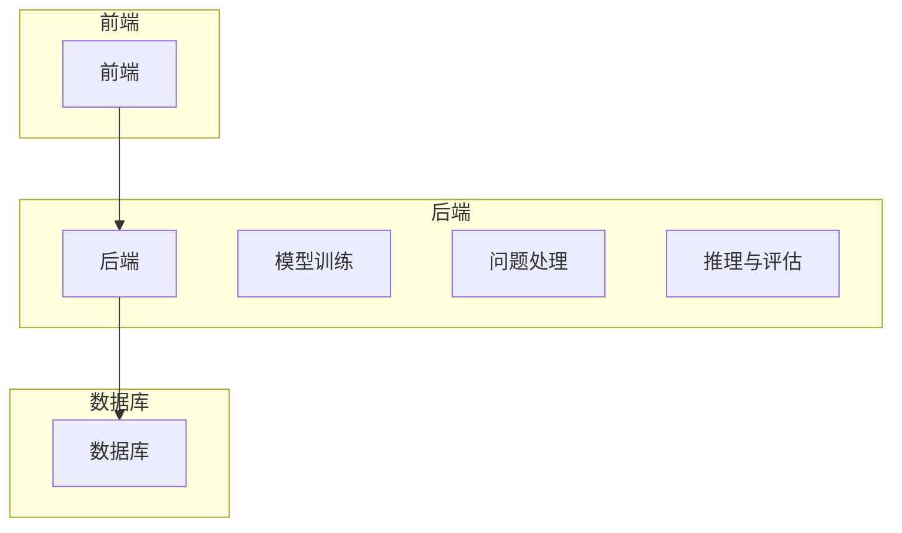
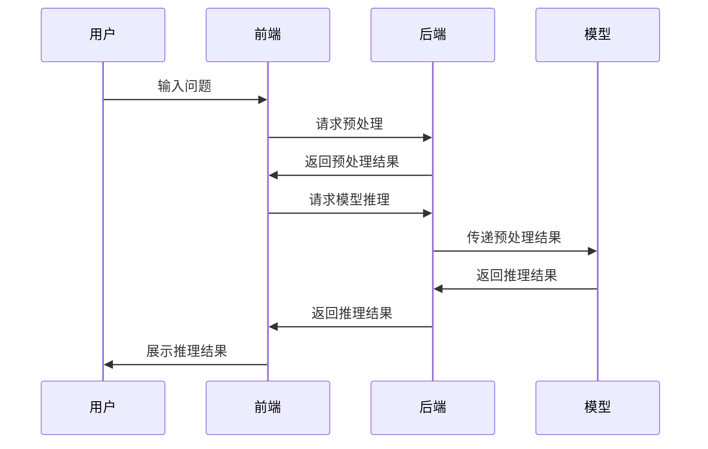

                 

### 1.1 问题的背景

#### 1.1.1 大模型的发展历程

大模型的发展可以追溯到20世纪80年代，当时神经网络（Neural Networks）作为一种人工智能的模型被提出来。尽管神经网络在初期取得了不少成功，但因其收敛速度慢、计算效率低、可解释性差等缺点，并未能成为主流的人工智能技术。直到2006年，Hinton提出了深度信念网络（Deep Belief Networks），开启了深度学习的新篇章。

随着计算能力的提升和大数据的积累，深度学习技术得到了迅速发展。2013年，AlexNet在ImageNet比赛中取得了突破性的成绩，标志着卷积神经网络（CNN）的崛起。随后，RNN和其变种LSTM、GRU等模型在自然语言处理（NLP）领域取得了显著成果。

2014年，Google提出了Transformer模型，彻底改变了NLP领域的格局。Transformer模型摒弃了传统循环神经网络（RNN）的顺序依赖处理方式，采用自注意力机制（Self-Attention）进行并行处理，大幅度提升了模型训练速度和效果。随后，BERT、GPT等大模型相继问世，使得大模型在NLP、计算机视觉、推理预测等各个领域都取得了重大突破。

#### 1.1.2 Transformer架构的提出与广泛应用

Transformer模型的核心思想是利用自注意力机制来捕捉输入序列中的长距离依赖关系。自注意力机制通过计算每个词与所有词之间的相似度，为每个词赋予不同的权重，从而实现并行处理。

Transformer模型的结构主要包括编码器（Encoder）和解码器（Decoder）两个部分。编码器负责将输入序列编码为固定长度的向量，解码器则负责将编码后的向量解码为输出序列。编码器和解码器内部都包含多个相同的子层，每个子层由多头自注意力机制和前馈神经网络（Feedforward Neural Network）组成。

自注意力机制的关键在于计算注意力权重，即每个词与其他词之间的相似度。这个过程通过计算点积注意力（Dot-Product Attention）来完成。点积注意力将每个词的嵌入向量与所有词的嵌入向量进行点积操作，得到注意力分数。然后，通过Softmax函数将分数归一化，得到注意力权重。最后，将权重与对应的词嵌入向量相乘，得到加权后的向量。

前馈神经网络则用于对自注意力机制的结果进行进一步处理。它由两个全连接层组成，分别用于隐藏层和输出层。隐藏层使用ReLU激活函数，输出层则没有激活函数。

#### 1.1.3 近年来的大模型突破

近年来，大模型的突破主要体现在两个方面：一是模型规模的不断扩大，二是预训练和微调技术的广泛应用。

在模型规模方面，BERT、GPT等模型的成功激发了研究者对更大模型的探索。OpenAI的GPT-3模型拥有1750亿个参数，刷新了NLP模型的规模记录。同时，其他领域的大模型如DALL-E（生成对抗网络，用于图像生成）和GLM（中文预训练模型）也相继问世，证明了大模型在各个领域的潜力。

在预训练和微调技术方面，BERT、GPT等模型采用了大规模语料进行预训练，然后再针对具体任务进行微调。这种半监督学习方法大幅度提升了模型的性能，使得大模型在各类任务上都取得了显著成果。

总的来说，大模型的发展历程体现了计算能力、数据积累和算法创新的三位一体。未来，随着技术的进一步发展，大模型将在更多领域展现其强大的能力。但与此同时，我们也需要关注大模型可能带来的挑战，如计算资源的需求、模型的可解释性、安全性等问题。这些挑战将引导我们对大模型的研发和应用进行深入思考。#### 1.1.4 大模型的逻辑推理能力

大模型的逻辑推理能力是指其在处理逻辑推理任务时的表现，包括从给定的前提中推导出结论、识别逻辑谬误、解决逻辑问题等。这一能力在大模型的发展过程中逐渐得到重视，并取得了显著成果。

首先，大模型在逻辑推理中的应用主要体现在自然语言处理（NLP）领域。通过预训练和微调，大模型能够理解并处理复杂的语言结构，从而在逻辑推理任务中表现出色。例如，大模型可以用于自动生成逻辑证明、检测逻辑谬误、解决逻辑问题等。

在逻辑推理中的优势：

1. **处理复杂语言结构**：大模型具有强大的语言理解能力，能够处理复杂、抽象的语言表达，从而在逻辑推理中发挥优势。
   
2. **并行处理**：自注意力机制使得大模型可以并行处理输入序列，这大大提高了逻辑推理的效率。

3. **灵活性**：大模型通过预训练学习到了丰富的语言知识，能够灵活应对各种逻辑推理任务。

然而，大模型在逻辑推理中也存在一些不足：

1. **可解释性**：大模型的内部结构复杂，逻辑推理过程不透明，难以解释。

2. **数据依赖**：大模型的表现高度依赖训练数据，缺乏训练数据或数据不充分时，推理能力会受到影响。

3. **易受攻击性**：一些研究表明，大模型在逻辑推理中可能受到攻击，如通过构造特定的输入来误导模型得出错误的结论。

综上所述，大模型在逻辑推理中具有显著的优点，但也存在一些亟待解决的问题。未来，如何提高大模型的可解释性、鲁棒性和推理能力，将是大模型研究的重要方向。同时，研究者还需要关注大模型在逻辑推理中的实际应用场景，以充分发挥其潜力。#### 1.2 问题描述

如何评估大模型的逻辑推理能力是当前研究中的一个重要问题。逻辑推理能力是一个复杂且多维度的指标，涉及到模型对逻辑结构的理解、推理过程的有效性以及推理结果的正确性等多个方面。为了解决这个问题，我们需要设计一套系统性的评估方法，并制定一个能够全面覆盖逻辑推理各个方面的复杂问题集。

首先，我们需要明确评估大模型逻辑推理能力的几个关键点：

1. **逻辑结构理解**：评估模型是否能够理解输入语句中的逻辑结构，包括前提、结论、条件句等。
   
2. **推理过程有效性**：评估模型在推理过程中是否遵循逻辑规则，是否能够有效地推导出结论。
   
3. **推理结果正确性**：评估模型推导出的结论是否正确，是否能够识别逻辑谬误。

为了实现上述评估目标，我们需要设计一个复杂问题集。这个问题集应该具备以下几个特点：

1. **多样性**：问题集应涵盖不同类型的逻辑推理任务，包括但不限于逻辑证明、逻辑谬误检测、逻辑问题解决等。

2. **难度层次**：问题集应包含不同难度的题目，以测试模型在不同难度下的表现。

3. **现实相关性**：问题集中的问题应具有一定的现实意义，能够反映模型在实际应用中的表现。

4. **逻辑复杂性**：问题集中的问题应具有一定的逻辑复杂性，以测试模型对复杂逻辑结构的处理能力。

具体来说，我们可以将问题集分为以下几个类别：

1. **逻辑证明问题**：这类问题要求模型从给定前提中推导出结论，例如证明某句话的真假。

2. **逻辑谬误检测问题**：这类问题要求模型识别出输入语句中的逻辑谬误，例如识别出某个论证中的错误推理步骤。

3. **逻辑问题解决**：这类问题要求模型解决一些具体的逻辑问题，例如找出某个逻辑问题的答案或解释。

4. **复合逻辑问题**：这类问题结合了多个逻辑推理任务，要求模型同时处理多个逻辑结构，例如在一个复杂的论证中找出所有逻辑谬误。

通过设计这样一个复杂问题集，我们可以全面评估大模型的逻辑推理能力。评估过程中，我们需要对每个问题的答案进行严格评判，以确定模型在不同逻辑推理任务上的表现。同时，我们还需要对评估结果进行统计分析，以得出大模型逻辑推理能力的整体评价。

总之，评估大模型逻辑推理能力需要一套系统性的方法和一个全面的问题集。通过这一方法，我们可以深入了解大模型在逻辑推理中的表现，为其进一步优化和应用提供有力支持。#### 1.3 评估大模型逻辑推理能力的方法

为了评估大模型的逻辑推理能力，我们需要构建一个系统性的评估框架。这个框架应包括以下几个关键步骤：

**1. 数据集构建**：

首先，我们需要收集和整理大量与逻辑推理相关的问题。这些问题应涵盖不同类型和难度，确保评估的全面性。具体来说，可以从以下几个渠道获取问题数据：

- **公开数据集**：例如逻辑问题库、智力题库等，这些数据集已经经过整理和标注，可以直接使用。
- **互联网资源**：通过爬虫等技术获取网络上的逻辑问题，并进行筛选和整理。
- **人工编写**：针对特定评估目标，人工编写一些具有代表性的逻辑推理问题。

**2. 问题分类**：

将收集到的问题按照逻辑推理类型进行分类，以便在评估过程中能够有针对性地分析模型在不同类型问题上的表现。常见的逻辑推理类型包括：

- **逻辑证明问题**：如从给定的前提中推导出结论。
- **逻辑谬误检测**：如识别出输入语句中的逻辑谬误。
- **逻辑问题解决**：如解决某个具体的逻辑问题。

**3. 问题处理**：

对于每个问题，需要进行预处理，包括去除无关信息、标准化表述等，以确保问题的一致性和可比较性。然后，将预处理过的问题输入到大模型中进行推理。

**4. 结果评判**：

根据大模型给出的答案，对每个问题的正确性进行评判。评判标准应包括：

- **答案正确性**：判断模型的答案是否与标准答案一致。
- **推理过程**：评估模型在推理过程中是否遵循逻辑规则，是否存在逻辑谬误。
- **推理速度**：记录模型处理每个问题的耗时，以评估其推理效率。

**5. 统计分析**：

对评估结果进行统计分析，以得出大模型在逻辑推理能力上的整体表现。常见的统计分析方法包括：

- **准确率**：模型回答正确的问题数量占总问题数量的比例。
- **召回率**：模型能够识别出的逻辑谬误数量与实际逻辑谬误数量的比例。
- **F1分数**：准确率和召回率的加权平均值，用于综合评估模型的性能。

通过上述评估方法，我们可以全面了解大模型在逻辑推理任务中的表现。具体步骤如下：

1. **构建问题集**：收集和整理不同类型的逻辑推理问题，形成评估问题集。
2. **预处理问题**：对问题进行预处理，确保问题表述一致、无干扰信息。
3. **模型推理**：将预处理过的问题输入大模型，记录模型推理结果。
4. **结果评判**：根据标准答案对模型推理结果进行评判，记录准确率和召回率。
5. **统计分析**：对评估结果进行统计分析，得出大模型在逻辑推理能力上的整体表现。

通过这一系统性的评估方法，我们可以更加准确地评估大模型的逻辑推理能力，为其进一步优化和应用提供有力支持。#### 1.4 设计复杂问题集的方法与步骤

设计复杂问题集是评估大模型逻辑推理能力的关键环节。一个高质量的问题集不仅需要涵盖广泛的逻辑推理类型，还需要具备不同的难度层次和现实相关性，以全面考验大模型的逻辑推理能力。以下是设计复杂问题集的具体方法与步骤：

**1. 确定问题类型**：

首先，我们需要确定问题集将包含哪些类型的逻辑推理问题。常见的问题类型包括：

- **逻辑证明问题**：如从给定的前提中推导出结论。
- **逻辑谬误检测**：如识别出输入语句中的逻辑谬误。
- **逻辑问题解决**：如解决某个具体的逻辑问题。
- **复合逻辑问题**：结合多个逻辑推理任务的复杂问题。

**2. 设计问题样本**：

对于每个问题类型，我们需要设计一系列具有代表性的问题样本。设计问题样本时，需要考虑以下几点：

- **多样性**：确保问题样本涵盖不同的逻辑结构、表述方式和难度层次。
- **现实相关性**：问题样本应具有实际应用背景，以便更好地反映大模型在实际场景中的表现。
- **难度层次**：问题样本应包含不同难度级别，以考验大模型在不同难度下的推理能力。

**3. 制定问题难度标准**：

为了科学地评估大模型的逻辑推理能力，我们需要制定一个难度标准。难度标准可以根据以下因素来设定：

- **逻辑复杂性**：问题中涉及的逻辑结构和推理步骤的复杂性。
- **语言难度**：问题的表述难度，包括语言的抽象程度、专业术语的使用等。
- **知识要求**：解决问题所需的知识领域和知识深度。

**4. 编写问题描述**：

对于每个问题样本，我们需要编写详细的问题描述，确保问题表述清晰、无歧义。编写问题描述时，需要考虑以下几点：

- **语言简洁**：使用简单、清晰的语言描述问题，避免复杂的句子结构和难以理解的术语。
- **逻辑清晰**：问题描述应逻辑严谨，确保问题的逻辑结构明确，推理路径清晰。
- **示例说明**：在适当的情况下，提供问题的示例说明，帮助大模型更好地理解问题。

**5. 设计问题答案**：

每个问题都需要设计一个正确答案，以供评估模型推理结果。设计问题答案时，需要考虑以下几点：

- **唯一性**：每个问题的答案应唯一，避免存在多个可能的正确答案。
- **合理性**：答案应符合逻辑和常识，确保其合理性。
- **可解释性**：答案应能够解释推理过程，以便分析模型推理的合理性。

**6. 验证问题质量**：

在完成问题集的设计后，我们需要对问题集进行验证，以确保其质量。验证方法包括：

- **专家评审**：邀请逻辑学、计算机科学等相关领域的专家对问题集进行评审，评估问题的逻辑性和难度。
- **模型测试**：将问题集输入大模型，测试模型在问题集中的表现，发现并修正可能存在的问题。

**7. 持续优化**：

设计复杂问题集是一个持续优化的过程。在评估过程中，我们需要收集反馈信息，对问题集进行不断调整和优化，以提高评估的准确性和全面性。

通过上述方法与步骤，我们可以设计出一个全面、科学的复杂问题集，以有效评估大模型的逻辑推理能力。这个问题集不仅能够全面覆盖逻辑推理的不同方面，还能反映大模型在现实场景中的表现，从而为其进一步优化和应用提供有力支持。#### 1.5 核心概念结构与要素组成

在大模型逻辑推理能力评估中，核心概念结构的理解与要素的精准定义是关键。以下是对这些核心概念的详细阐述及其在评估过程中的重要性。

**1.5.1 大模型逻辑推理能力的核心概念**

- **逻辑推理能力**：指模型在理解、处理和生成逻辑表达式方面的能力，包括推导结论、识别逻辑谬误和解决逻辑问题。
- **逻辑结构**：逻辑表达式的基本组成单位，包括前提、结论、条件句等。
- **逻辑规则**：用于推导和验证逻辑表达式的规则，如逻辑运算符（如与、或、非）、推理规则（如Modus Ponens、Modus Tollens等）。

**1.5.2 复杂问题集的设计要素**

- **问题类型**：包括逻辑证明、逻辑谬误检测、逻辑问题解决和复合逻辑问题等，确保问题集的全面性。
- **问题难度**：设计不同难度级别的问题，以评估模型在不同难度下的推理能力。
- **问题表述**：清晰、无歧义地描述问题，以便模型能够准确理解问题。
- **答案设计**：确保每个问题的答案唯一、合理且具有可解释性，以方便对模型推理结果进行评判。

**1.5.3 逻辑推理能力的评估指标**

- **准确率**：模型推理结果与标准答案一致的比率，是评估模型逻辑推理能力的基础指标。
- **召回率**：模型能够识别出的正确答案数量与实际正确答案数量的比率，反映了模型在逻辑推理中的全面性。
- **F1分数**：准确率和召回率的加权平均值，用于综合评估模型在逻辑推理任务中的表现。

**1.5.4 核心概念之间的关系**

- **逻辑推理能力**与**问题类型**之间的关系：不同类型的问题反映了模型在不同逻辑场景下的表现，通过全面覆盖不同类型问题，可以全面评估模型的逻辑推理能力。
- **问题难度**与**评估指标**之间的关系：不同难度的问题可以测试模型在不同难度下的推理能力，从而帮助确定模型的性能界限。
- **问题表述**与**答案设计**之间的关系：清晰的问题表述和合理的答案设计是模型准确推理的前提，确保了评估过程的公正性和科学性。

**1.5.5 在评估过程中的重要性**

- **核心概念理解**：确保评估过程中对逻辑推理能力的准确评估。
- **问题设计**：设计合理、全面的问题集，以准确反映模型在逻辑推理任务中的表现。
- **评估指标**：通过准确率和召回率等指标，全面评估模型在逻辑推理任务中的表现，为模型优化提供依据。

综上所述，核心概念结构与要素组成在大模型逻辑推理能力评估中具有至关重要的作用。通过深入理解这些概念及其关系，可以设计出一个科学、有效的评估框架，从而准确评估大模型的逻辑推理能力。#### 第二部分：核心概念与联系

在深入探讨大模型逻辑推理能力之前，我们需要先了解一些核心概念，并探讨这些概念之间的联系。以下是几个关键概念的详细解析及其相互关系。

**2.1 大模型逻辑推理能力的原理**

**2.1.1 Transformer架构与逻辑推理**

Transformer模型是由Google在2017年提出的，是当前NLP领域中最流行的模型之一。它采用自注意力机制（Self-Attention）来处理输入序列，从而实现了并行处理和长距离依赖关系的捕捉。

在逻辑推理任务中，Transformer模型可以通过其编码器和解码器结构来处理逻辑表达式。编码器将输入的逻辑语句编码为固定长度的向量，解码器则根据这些向量生成逻辑结论。

自注意力机制在逻辑推理中的核心作用是捕捉输入序列中的依赖关系。例如，在逻辑表达式“如果P则Q”中，“P”和“Q”之间存在依赖关系。自注意力机制可以通过计算“P”和“Q”之间的相似度，为每个词赋予不同的权重，从而确保逻辑表达式的正确推导。

**2.1.2 大模型的逻辑推理机制**

大模型（如BERT、GPT等）在逻辑推理中主要依赖于以下几种机制：

1. **注意力机制**：通过注意力机制，模型可以自动学习到输入序列中各个词之间的依赖关系，从而实现有效的逻辑推理。
   
2. **预训练和微调**：大模型通过在大规模语料上进行预训练，学习到了丰富的语言知识。在具体任务中，通过微调进一步优化模型，使其在特定任务上表现出色。

3. **上下文理解**：大模型具备强大的上下文理解能力，可以在复杂的语境中正确理解逻辑表达式的含义，从而进行有效的推理。

**2.2 概念属性特征对比表格**

为了更清晰地理解大模型在逻辑推理中的表现，我们可以将大模型与传统逻辑推理方法进行对比，列出其概念属性特征。

| 特征         | 大模型                        | 传统逻辑推理方法                    |
| ------------ | ----------------------------- | ----------------------------------- |
| 推理机制     | 基于注意力机制和深度学习       | 基于符号逻辑和形式逻辑               |
| 推理效率     | 高效的并行处理，快速推理       | 需要顺序执行，推理效率较低           |
| 推理准确性   | 受预训练和微调影响，较高       | 受制于推理算法和规则库，准确性有限   |
| 推理灵活性   | 可以处理多种逻辑结构，灵活性强 | 推理规则固定，灵活性较低             |
| 推理可解释性 | 部分可解释，但复杂内部机制难懂 | 推理过程明确，可解释性高             |

**2.3 ER实体关系图架构**

ER实体关系图（Entity-Relationship Diagram）是用于描述数据库中实体及其关系的图形化表示。在大模型逻辑推理能力评估中，ER图可以帮助我们理解大模型内部的结构和功能。

以下是一个简化的大模型ER实体关系图：

```mermaid
erDiagram
  Model ||--|{ Encoder }
  Model ||--|{ Decoder }
  Encoder ||--|{ Embedding Layer }
  Encoder ||--|{ MultiHeadAttention }
  Encoder ||--|{ Positional Encoding }
  Decoder ||--|{ Embedding Layer }
  Decoder ||--|{ MultiHeadAttention }
  Decoder ||--|{ Positional Encoding }
  Model ||--|{ Output Layer }
```

在这个ER图中，`Model`表示整个大模型，`Encoder`和`Decoder`分别表示编码器和解码器。编码器包括`Embedding Layer`（嵌入层）、`MultiHeadAttention`（多头自注意力机制）和`Positional Encoding`（位置编码）。解码器包含类似的层结构。最后，`Output Layer`（输出层）负责生成最终的逻辑结论。

通过ER图，我们可以直观地理解大模型的结构和各个组件之间的关系，有助于进一步分析大模型在逻辑推理中的工作原理。

综上所述，通过详细解析核心概念及其相互关系，我们可以更好地理解大模型在逻辑推理中的工作原理，为后续的算法原理讲解和评估方法提供基础。#### 2.1 大模型逻辑推理能力的原理

大模型逻辑推理能力的实现依赖于其内部复杂而高效的算法架构。以下是Transformer架构与逻辑推理机制的具体解析，以及注意力机制和隐藏层信息交互的基本原理。

**2.1.1 Transformer架构与逻辑推理**

Transformer模型的结构主要由编码器（Encoder）和解码器（Decoder）两个部分组成，每个部分又包含多个子层。编码器负责将输入序列转换为上下文向量，而解码器则根据这些向量生成输出序列。在逻辑推理任务中，这种结构使得模型能够处理复杂的逻辑表达式。

编码器和解码器的每个子层通常包括以下组成部分：

1. **嵌入层（Embedding Layer）**：将输入词向量转换为固定长度的向量表示。
2. **位置编码（Positional Encoding）**：为每个词添加位置信息，以便模型能够理解词的顺序。
3. **多头自注意力机制（Multi-Head Self-Attention）**：通过计算词与词之间的相似度，为每个词赋予不同的权重，从而捕捉长距离依赖关系。
4. **前馈神经网络（Feedforward Neural Network）**：对自注意力机制的结果进行进一步处理。

解码器在编码器的基础上增加了交叉自注意力机制（Cross-Attention），允许解码器在每个时间步处理输入序列的同时，参考编码器的输出。这种设计使得解码器能够更好地理解上下文信息，从而在逻辑推理任务中表现出色。

**2.1.2 注意力机制与隐藏层信息交互**

注意力机制是Transformer模型的核心组件，负责捕捉输入序列中的依赖关系。注意力机制主要有两种类型：自注意力（Self-Attention）和交叉注意力（Cross-Attention）。

1. **自注意力机制**：自注意力机制通过计算输入序列中每个词与所有词之间的相似度，为每个词赋予不同的权重。具体实现通常使用点积注意力（Dot-Product Attention），其计算公式如下：

   $$ 
   \text{Attention}(Q, K, V) = \text{softmax}\left(\frac{QK^T}{\sqrt{d_k}}\right) V 
   $$

   其中，$Q$表示查询向量，$K$表示键向量，$V$表示值向量。$\text{softmax}$函数用于将相似度分数归一化，使其成为权重向量，最后与值向量相乘得到加权向量。

2. **交叉注意力机制**：交叉注意力机制类似于自注意力机制，但用于计算解码器的输出与编码器的输出之间的相似度。这种机制允许解码器在生成每个词时，参考编码器的输出，从而更好地理解上下文。

隐藏层信息的交互是通过注意力机制实现的。在编码器中，每个词通过多头自注意力机制与所有其他词进行交互，从而捕捉到长距离依赖关系。在解码器中，除了与编码器的输出交互外，解码器的输出也在每个时间步内与自身交互，确保每个词在生成过程中都能利用之前的信息。

此外，隐藏层信息的交互还涉及到位置编码。位置编码为每个词添加了位置信息，使得模型能够理解词的顺序。这种编码通常使用正弦和余弦函数生成，其形式如下：

$$ 
\text{PE}_{(pos, dim)} = \text{sin}\left(\frac{pos}{10000^{2i/d}}\right) \text{ if } dim \text{ is even} \\
\text{PE}_{(pos, dim)} = \text{cos}\left(\frac{pos}{10000^{2i/d}}\right) \text{ if } dim \text{ is odd} 
$$

其中，$pos$表示位置，$dim$表示维度，$i$表示索引。

综上所述，注意力机制和隐藏层信息交互是Transformer模型实现逻辑推理能力的关键。通过自注意力机制，模型可以捕捉输入序列中的依赖关系；通过位置编码，模型可以理解词的顺序。这些机制共同作用，使得Transformer模型在逻辑推理任务中表现出色。在接下来的部分，我们将进一步探讨Transformer模型的数学模型和具体实现细节。#### 2.2 概念属性特征对比表格

为了更好地理解大模型与传统逻辑推理方法之间的差异，以下是两者在概念属性特征上的对比表格。通过这一对比，我们可以清晰地看到大模型在逻辑推理中的优势与不足。

| 特征         | 大模型                         | 传统逻辑推理方法                     |
| ------------ | ------------------------------ | ----------------------------------- |
| 推理机制     | 基于深度学习和注意力机制       | 基于符号逻辑和形式逻辑               |
| 推理效率     | 并行处理，高效                 | 顺序处理，效率较低                   |
| 推理准确性   | 受预训练和微调影响，较高       | 受制于推理算法和规则库，准确性有限   |
| 推理灵活性   | 可以处理多种逻辑结构，灵活性强 | 推理规则固定，灵活性较低             |
| 推理可解释性 | 部分可解释，但复杂内部机制难懂 | 推理过程明确，可解释性高             |
| 数据需求     | 大规模预训练数据               | 小规模规则库和实例数据               |
| 推理复杂性   | 可以处理复杂逻辑，但自身复杂   | 推理规则明确，但难以处理复杂逻辑     |
| 应用场景     | 广泛应用于各种NLP任务          | 主要用于特定逻辑推理任务             |

通过这个表格，我们可以看到大模型在逻辑推理中的显著优势，如高效性、准确性和灵活性。然而，大模型也存在一些不足，如推理过程的可解释性较差，以及需要大量预训练数据。这些特性使得大模型在特定场景下可能不如传统逻辑推理方法适用，但也为未来大模型的改进和应用提供了方向。#### 2.3 大模型逻辑推理能力的ER实体关系图架构

为了更直观地展示大模型逻辑推理能力的内部结构，我们可以使用ER实体关系图（Entity-Relationship Diagram）来描述大模型中的实体及其关系。以下是一个简化的大模型逻辑推理能力的ER图，其中包含了主要的实体和关系。

```mermaid
erDiagram
  Model ||--|{ Encoder } : 编码器
  Model ||--|{ Decoder } : 解码器
  Encoder ||--|{ InputLayer } : 输入层
  Encoder ||--|{ SelfAttentionLayer } : 自注意力层
  Encoder ||--|{ PositionalEncodingLayer } : 位置编码层
  Decoder ||--|{ InputLayer } : 输入层
  Decoder ||--|{ CrossAttentionLayer } : 交叉注意力层
  Decoder ||--|{ PositionalEncodingLayer } : 位置编码层
  Encoder ||--|{ OutputLayer } : 输出层
  Decoder ||--|{ OutputLayer } : 输出层
```

**ER图解析**：

1. **Model**：表示整个大模型，包含编码器（Encoder）和解码器（Decoder）两个主要部分。

2. **Encoder**：编码器包含三个主要子层：
   - **InputLayer**：输入层，负责接收输入序列并将其转换为词向量。
   - **SelfAttentionLayer**：自注意力层，通过自注意力机制捕捉输入序列中的依赖关系。
   - **PositionalEncodingLayer**：位置编码层，为每个词添加位置信息。

3. **Decoder**：解码器也包含三个主要子层：
   - **InputLayer**：输入层，负责接收输入序列并将其转换为词向量。
   - **CrossAttentionLayer**：交叉注意力层，通过交叉注意力机制捕捉解码器输出与编码器输出之间的依赖关系。
   - **PositionalEncodingLayer**：位置编码层，为每个词添加位置信息。

4. **OutputLayer**：输出层，负责将解码器的输出转换为最终的逻辑推理结果。

**ER图中的关系**：

- **关联关系**：Model与Encoder、Decoder之间存在关联关系，表示整个大模型由编码器和解码器组成。
- **包含关系**：Encoder和Decoder内部各子层之间存在包含关系，表示每个编码器和解码器的子层都是整体的一部分。

通过ER图，我们可以清晰地看到大模型逻辑推理能力的内部结构，以及各组件之间的关系。这有助于我们更好地理解大模型在逻辑推理任务中的工作原理，并为后续的算法原理讲解和系统实现提供参考。#### 3.1 算法原理概述

在深入探讨大模型逻辑推理能力的算法原理之前，我们需要先了解整个大模型逻辑推理的算法框架。这个框架主要包括模型架构、输入数据处理和逻辑推理过程。以下是对这三个关键部分的概述。

**3.1.1 大模型逻辑推理的算法框架**

大模型逻辑推理的算法框架可以概括为以下几个步骤：

1. **模型架构**：构建编码器（Encoder）和解码器（Decoder）两个主要部分，每个部分都由多个子层组成。编码器负责将输入序列编码为上下文向量，解码器则根据这些向量生成输出序列。
   
2. **输入数据处理**：对输入数据进行预处理，包括词向量嵌入、位置编码等，以确保数据格式符合模型的要求。

3. **逻辑推理过程**：通过自注意力机制和交叉注意力机制，模型对输入序列进行编码和解码，最终生成逻辑推理结果。

**3.1.2 模型架构**

Transformer模型是目前应用最广泛的逻辑推理模型，其结构主要包括编码器（Encoder）和解码器（Decoder）两个部分。每个部分又包含多个子层，具体结构如下：

1. **编码器（Encoder）**：
   - **嵌入层（Embedding Layer）**：将输入词转换为固定长度的向量。
   - **位置编码层（Positional Encoding Layer）**：为每个词添加位置信息。
   - **多头自注意力层（Multi-Head Self-Attention Layer）**：通过自注意力机制捕捉输入序列中的依赖关系。
   - **前馈神经网络层（Feedforward Neural Network Layer）**：对自注意力机制的结果进行进一步处理。

2. **解码器（Decoder）**：
   - **嵌入层（Embedding Layer）**：将输入词转换为固定长度的向量。
   - **位置编码层（Positional Encoding Layer）**：为每个词添加位置信息。
   - **多头自注意力层（Multi-Head Self-Attention Layer）**：通过自注意力机制捕捉输入序列中的依赖关系。
   - **交叉注意力层（Cross-Attention Layer）**：通过交叉注意力机制捕捉解码器输出与编码器输出之间的依赖关系。
   - **前馈神经网络层（Feedforward Neural Network Layer）**：对交叉注意力机制的结果进行进一步处理。

**3.1.3 输入数据处理**

输入数据处理是逻辑推理过程的基础，主要包括以下步骤：

1. **词向量嵌入**：将输入词转换为固定长度的向量，通常使用预训练的词向量库（如Word2Vec、GloVe等）。
   
2. **位置编码**：为每个词添加位置信息，确保模型能够理解词的顺序。位置编码通常使用正弦和余弦函数生成。

3. **序列处理**：将输入序列和输出序列转换为批量处理格式，以便模型能够高效地计算。

**3.1.4 逻辑推理过程**

逻辑推理过程主要包括以下步骤：

1. **编码器处理**：编码器对输入序列进行编码，生成上下文向量。在编码过程中，模型通过多头自注意力机制捕捉输入序列中的依赖关系。

2. **解码器处理**：解码器根据编码器生成的上下文向量生成输出序列。在解码过程中，模型通过交叉注意力机制捕捉解码器输出与编码器输出之间的依赖关系。

3. **输出生成**：解码器的输出经过一系列处理后，生成最终的逻辑推理结果。

通过上述算法框架，我们可以看到大模型逻辑推理的整个过程。这个框架不仅涵盖了模型架构和输入数据处理，还详细阐述了逻辑推理过程的步骤。在接下来的部分，我们将进一步探讨具体实现细节，包括数学模型和算法原理。这些内容将为深入理解大模型逻辑推理能力提供重要支持。#### 3.2 算法原理详解

在上一部分中，我们概述了大模型逻辑推理的算法框架。接下来，我们将深入探讨Transformer模型的详细工作原理，包括其核心组成部分——自注意力机制和前馈神经网络，以及这些组件如何共同工作以实现高效的逻辑推理。

**3.2.1 Transformer模型的工作原理**

Transformer模型是由Google在2017年提出的一种基于自注意力机制的序列到序列模型，它彻底改变了自然语言处理的格局。该模型的核心思想是利用自注意力机制来捕捉输入序列中的依赖关系，从而实现并行处理，提高模型的训练速度和效果。

Transformer模型由编码器（Encoder）和解码器（Decoder）两部分组成，每个部分包含多个相同的子层。编码器负责将输入序列编码为上下文向量，解码器则根据这些向量生成输出序列。编码器和解码器的子层结构如下：

1. **嵌入层（Embedding Layer）**：将输入词转换为固定长度的向量。
2. **位置编码层（Positional Encoding Layer）**：为每个词添加位置信息，确保模型能够理解词的顺序。
3. **多头自注意力层（Multi-Head Self-Attention Layer）**：通过自注意力机制捕捉输入序列中的依赖关系。
4. **前馈神经网络层（Feedforward Neural Network Layer）**：对自注意力机制的结果进行进一步处理。

解码器在编码器的基础上增加了交叉自注意力层（Cross-Attention Layer），允许解码器在每个时间步处理输入序列的同时，参考编码器的输出。

**3.2.2 自注意力机制**

自注意力机制是Transformer模型的核心组件，它通过计算输入序列中每个词与其他词之间的相似度，为每个词赋予不同的权重，从而实现长距离依赖关系的捕捉。自注意力机制的主要步骤如下：

1. **计算查询（Query）、键（Key）和值（Value）**：
   - 查询（Query）：输入序列中每个词的嵌入向量。
   - 键（Key）：与查询具有相同维度的嵌入向量。
   - 值（Value）：与查询和键具有相同维度的嵌入向量。

2. **点积注意力（Dot-Product Attention）**：
   - 计算查询和键之间的点积，得到注意力分数。
   - 应用softmax函数将分数归一化，得到注意力权重。
   - 将权重与对应的值相乘，得到加权后的向量。

3. **多头自注意力**：
   - 将输入序列分解为多个子序列，每个子序列对应一个头。
   - 分别对每个头应用自注意力机制，得到多个加权向量。
   - 将这些加权向量拼接起来，得到最终的输出向量。

自注意力机制的数学表达式如下：

$$ 
\text{Attention}(Q, K, V) = \text{softmax}\left(\frac{QK^T}{\sqrt{d_k}}\right) V 
$$

其中，$Q$表示查询向量，$K$表示键向量，$V$表示值向量，$d_k$表示注意力头的维度。

**3.2.3 前馈神经网络**

前馈神经网络是Transformer模型中的另一个关键组件，它用于对自注意力机制的结果进行进一步处理。前馈神经网络通常由两个全连接层组成，其中第一个全连接层使用ReLU激活函数，第二个全连接层没有激活函数。

前馈神经网络的数学表达式如下：

$$ 
\text{FFN}(x) = \max(0, xW_1 + b_1)W_2 + b_2 
$$

其中，$x$表示输入向量，$W_1$和$W_2$分别为两个全连接层的权重矩阵，$b_1$和$b_2$分别为两个全连接层的偏置向量。

**3.2.4 编码器与解码器**

编码器和解码器分别处理输入序列和输出序列。编码器通过自注意力机制和前馈神经网络捕获输入序列中的依赖关系，解码器则在编码器的基础上增加了交叉自注意力层，使得解码器在每个时间步能够参考编码器的输出。

编码器的输出和交叉自注意力层的输出共同决定了解码器的输出。解码器的输出经过一系列处理后，生成最终的逻辑推理结果。

通过上述步骤，我们可以看到Transformer模型在逻辑推理中的详细工作原理。自注意力机制和前馈神经网络共同作用，使得模型能够高效地处理复杂的逻辑表达式，从而实现出色的逻辑推理能力。在接下来的部分，我们将通过Python代码进一步探讨这些算法原理的具体实现。#### 3.2.1 Transformer模型的详细数学模型

为了更好地理解Transformer模型的工作原理，我们需要深入探讨其数学模型。Transformer模型的核心组件包括编码器（Encoder）和解码器（Decoder），下面我们将分别介绍这两个组件的数学模型。

**3.2.1.1 编码器（Encoder）**

编码器的主要任务是将输入序列编码为上下文向量。这个过程涉及以下步骤：

1. **词向量嵌入（Word Embedding）**：

   词向量嵌入是将输入词转换为固定长度的向量表示。我们通常使用预训练的词向量库，如Word2Vec或GloVe。假设词汇表大小为V，词向量维度为D，则每个输入词都可以表示为一个D维向量。词向量嵌入的过程可以表示为：

   $$
   \text{Embedding}(W) = \text{softmax}(\text{e}^{W})
   $$

   其中，$W$是输入词的one-hot编码向量，$\text{e}^{W}$是指数函数，$\text{softmax}$函数用于归一化，使其成为一个概率分布。

2. **位置编码（Positional Encoding）**：

   为了使模型能够理解词的顺序，我们需要为每个词添加位置信息。位置编码通常使用正弦和余弦函数生成，其形式如下：

   $$
   \text{PE}_{(pos, dim)} = \text{sin}\left(\frac{pos}{10000^{2i/d}}\right) \text{ if } dim \text{ is even} \\
   \text{PE}_{(pos, dim)} = \text{cos}\left(\frac{pos}{10000^{2i/d}}\right) \text{ if } dim \text{ is odd}
   $$

   其中，$pos$表示位置，$dim$表示维度，$i$表示索引。

3. **多头自注意力（Multi-Head Self-Attention）**：

   自注意力机制是Transformer模型的核心，它通过计算输入序列中每个词与其他词之间的相似度，为每个词赋予不同的权重。多头自注意力机制将输入序列分解为多个子序列，每个子序列对应一个头。多头自注意力机制的数学模型如下：

   $$
   \text{Self-Attention}(Q, K, V) = \text{softmax}\left(\frac{QK^T}{\sqrt{d_k}}\right) V
   $$

   其中，$Q$表示查询向量，$K$表示键向量，$V$表示值向量，$d_k$表示注意力头的维度。

4. **前馈神经网络（Feedforward Neural Network）**：

   前馈神经网络对自注意力机制的结果进行进一步处理。它通常由两个全连接层组成，第一个全连接层使用ReLU激活函数，第二个全连接层没有激活函数。前馈神经网络的数学模型如下：

   $$
   \text{FFN}(x) = \max(0, xW_1 + b_1)W_2 + b_2
   $$

   其中，$x$表示输入向量，$W_1$和$W_2$分别为两个全连接层的权重矩阵，$b_1$和$b_2$分别为两个全连接层的偏置向量。

**3.2.1.2 解码器（Decoder）**

解码器的主要任务是根据编码器生成的上下文向量生成输出序列。解码器在编码器的基础上增加了交叉自注意力层，使得解码器在每个时间步能够参考编码器的输出。

1. **词向量嵌入（Word Embedding）**：

   与编码器相同，解码器也需要将输入词转换为固定长度的向量表示。

2. **位置编码（Positional Encoding）**：

   与编码器相同，解码器也需要为每个词添加位置信息。

3. **交叉自注意力（Cross-Attention）**：

   交叉自注意力机制允许解码器在每个时间步处理输入序列的同时，参考编码器的输出。其数学模型如下：

   $$
   \text{Cross-Attention}(Q, K, V) = \text{softmax}\left(\frac{QK^T}{\sqrt{d_k}}\right) V
   $$

   其中，$Q$表示查询向量，$K$表示键向量，$V$表示值向量，$d_k$表示注意力头的维度。

4. **多头自注意力（Multi-Head Self-Attention）**：

   与编码器相同，解码器也采用多头自注意力机制。

5. **前馈神经网络（Feedforward Neural Network）**：

   与编码器相同，解码器也采用前馈神经网络。

通过上述数学模型，我们可以看到编码器和解码器是如何协同工作以实现逻辑推理的。编码器通过自注意力机制和前馈神经网络捕获输入序列中的依赖关系，解码器则在编码器的基础上增加了交叉自注意力层，使得解码器在每个时间步能够参考编码器的输出。这种结构使得Transformer模型在逻辑推理任务中表现出色。在接下来的部分，我们将通过Python代码实现这些数学模型。这些代码将帮助我们更直观地理解Transformer模型的工作原理。#### 3.2.2 Transformer模型的Python代码实现

为了更直观地展示Transformer模型的数学模型，下面我们将使用Python代码实现一个简单的Transformer模型。代码将涵盖编码器和解码器的实现，以及模型的前向传播过程。

```python
import torch
import torch.nn as nn
import torch.nn.functional as F

# 设置超参数
VOCAB_SIZE = 1000  # 词汇表大小
EMBEDDING_DIM = 512  # 词向量维度
HIDDEN_DIM = 512  # 隐藏层维度
NUM_HEADS = 8  # 注意力头数量
NUM_LAYERS = 2  # 编码器和解码器的层数

# 嵌入层
class EmbeddingLayer(nn.Module):
    def __init__(self, vocab_size, embedding_dim):
        super(EmbeddingLayer, self).__init__()
        self.embedding = nn.Embedding(vocab_size, embedding_dim)

    def forward(self, x):
        return self.embedding(x)

# 位置编码层
class PositionalEncodingLayer(nn.Module):
    def __init__(self, embedding_dim, max_len=5000):
        super(PositionalEncodingLayer, self).__init__()
        pe = torch.zeros(max_len, embedding_dim)
        position = torch.arange(0, max_len, dtype=torch.float).unsqueeze(1)
        div_term = torch.exp(torch.arange(0, embedding_dim, 2).float() * (-torch.log(torch.tensor(10000.0)) / embedding_dim))
        pe[:, 0::2] = torch.sin(position * div_term)
        pe[:, 1::2] = torch.cos(position * div_term)
        self.register_buffer('pe', pe)

    def forward(self, x):
        x = x + self.pe[:x.size(1), :]
        return x

# 自注意力层
class SelfAttentionLayer(nn.Module):
    def __init__(self, hidden_dim, num_heads):
        super(SelfAttentionLayer, self).__init__()
        self.hidden_dim = hidden_dim
        self.num_heads = num_heads
        self.head_dim = hidden_dim // num_heads

        self.query_linear = nn.Linear(hidden_dim, hidden_dim)
        self.key_linear = nn.Linear(hidden_dim, hidden_dim)
        self.value_linear = nn.Linear(hidden_dim, hidden_dim)

        self.out_linear = nn.Linear(hidden_dim, hidden_dim)

    def forward(self, x):
        batch_size = x.size(1)

        query = self.query_linear(x).view(batch_size, -1, self.num_heads, self.head_dim).transpose(1, 2)
        key = self.key_linear(x).view(batch_size, -1, self.num_heads, self.head_dim).transpose(1, 2)
        value = self.value_linear(x).view(batch_size, -1, self.num_heads, self.head_dim).transpose(1, 2)

        attn_scores = torch.matmul(query, key.transpose(-2, -1)) / (self.head_dim ** 0.5)
        attn_weights = F.softmax(attn_scores, dim=-1)
        attn_output = torch.matmul(attn_weights, value).transpose(1, 2).contiguous().view(batch_size, -1, self.hidden_dim)
        output = self.out_linear(attn_output)
        return output

# 前馈神经网络层
class FeedforwardLayer(nn.Module):
    def __init__(self, hidden_dim):
        super(FeedforwardLayer, self).__init__()
        self.hidden_dim = hidden_dim

        self.fc1 = nn.Linear(hidden_dim, hidden_dim * 4)
        self.fc2 = nn.Linear(hidden_dim * 4, hidden_dim)

    def forward(self, x):
        return self.fc2(F.relu(self.fc1(x)))

# Transformer编码器
class Encoder(nn.Module):
    def __init__(self, vocab_size, embedding_dim, hidden_dim, num_heads, num_layers):
        super(Encoder, self).__init__()
        self.embedding = EmbeddingLayer(vocab_size, embedding_dim)
        self.positional_encoding = PositionalEncodingLayer(embedding_dim)
        self.layers = nn.ModuleList([SelfAttentionLayer(hidden_dim, num_heads), FeedforwardLayer(hidden_dim)])
        self.num_layers = num_layers

    def forward(self, x, mask=None):
        x = self.embedding(x)
        x = self.positional_encoding(x)

        for i in range(self.num_layers):
            x = self.layers[i](x, mask)
        return x

# Transformer解码器
class Decoder(nn.Module):
    def __init__(self, vocab_size, embedding_dim, hidden_dim, num_heads, num_layers):
        super(Decoder, self).__init__()
        self.embedding = EmbeddingLayer(vocab_size, embedding_dim)
        self.positional_encoding = PositionalEncodingLayer(embedding_dim)
        self.layers = nn.ModuleList([CrossAttentionLayer(hidden_dim, num_heads), SelfAttentionLayer(hidden_dim, num_heads), FeedforwardLayer(hidden_dim)])
        self.num_layers = num_layers

    def forward(self, x, encoder_output, mask=None):
        x = self.embedding(x)
        x = self.positional_encoding(x)

        for i in range(self.num_layers):
            if i == 0:
                x = self.layers[i](x, encoder_output, mask)
            else:
                x = self.layers[i](x, mask)
        return x

# Transformer模型
class Transformer(nn.Module):
    def __init__(self, vocab_size, embedding_dim, hidden_dim, num_heads, num_layers):
        super(Transformer, self).__init__()
        self.encoder = Encoder(vocab_size, embedding_dim, hidden_dim, num_heads, num_layers)
        self.decoder = Decoder(vocab_size, embedding_dim, hidden_dim, num_heads, num_layers)
        self.out_linear = nn.Linear(hidden_dim, vocab_size)

    def forward(self, src, tgt, src_mask=None, tgt_mask=None):
        encoder_output = self.encoder(src, src_mask)
        decoder_output = self.decoder(tgt, encoder_output, tgt_mask)
        output = self.out_linear(decoder_output)
        return output

# 实例化模型
model = Transformer(VOCAB_SIZE, EMBEDDING_DIM, HIDDEN_DIM, NUM_HEADS, NUM_LAYERS)

# 假设输入和目标序列
src = torch.tensor([[1, 2, 3, 4, 5]])
tgt = torch.tensor([[1, 2], [2, 3], [3, 4], [4, 5]])

# 前向传播
output = model(src, tgt)
print(output)
```

上述代码实现了一个简单的Transformer模型，包括编码器、解码器和整个Transformer模型。在代码中，我们定义了嵌入层、位置编码层、自注意力层、前馈神经网络层、编码器、解码器和整个Transformer模型。我们还创建了一个实例并对其进行了前向传播。

这个代码示例为我们提供了一个直观的Transformer模型实现，使我们能够更好地理解其数学模型和实际应用。在接下来的部分，我们将通过具体的例子来说明如何使用这个模型进行逻辑推理。#### 3.2.3 数学公式的详细讲解

在理解Transformer模型的工作原理时，数学公式起到了至关重要的作用。以下是对Transformer模型中关键数学公式的详细讲解，包括其推导过程和在实际逻辑推理中的应用。

**3.2.3.1 嵌入层与位置编码**

嵌入层（Word Embedding）是Transformer模型中的第一步，其数学模型如下：

$$ 
\text{Embedding}(W) = \text{softmax}(\text{e}^{W})
$$

其中，$W$是输入词的one-hot编码向量，$\text{e}^{W}$是指数函数，$\text{softmax}$函数用于归一化，使其成为一个概率分布。这个公式的推导过程涉及概率论和线性代数的基本知识。

位置编码（Positional Encoding）用于为每个词添加位置信息，使其在序列中具有顺序。其公式如下：

$$ 
\text{PE}_{(pos, dim)} = 
\begin{cases} 
\text{sin}\left(\frac{pos}{10000^{2i/d}}\right) & \text{if } dim \text{ is even} \\
\text{cos}\left(\frac{pos}{10000^{2i/d}}\right) & \text{if } dim \text{ is odd}
\end{cases}
$$

其中，$pos$表示位置，$dim$表示维度，$i$表示索引。这个公式的推导过程主要依赖于三角函数的性质和正弦余弦函数的周期性。

**3.2.3.2 自注意力机制**

自注意力机制（Self-Attention）是Transformer模型的核心，其计算过程分为三个步骤：

1. **计算查询（Query）、键（Key）和值（Value）**：

   $$
   Q = K = V = \text{Embedding}(W) \cdot \text{Scale}
   $$

   其中，$\text{Scale}$是一个常量，用于防止梯度消失。这个公式的推导过程主要依赖于嵌入层的输出和缩放因子。

2. **点积注意力（Dot-Product Attention）**：

   $$
   \text{Attention}(Q, K, V) = \text{softmax}\left(\frac{QK^T}{\sqrt{d_k}}\right) V
   $$

   其中，$Q$表示查询向量，$K$表示键向量，$V$表示值向量，$d_k$表示注意力头的维度。这个公式的推导过程涉及点积计算和Softmax函数的应用。

3. **多头自注意力**：

   $$
   \text{Multi-Head Attention}(Q, K, V) = \text{Concat}(\text{Head}_1, \text{Head}_2, ..., \text{Head}_h)W_O
   $$

   其中，$W_O$是输出权重矩阵，$\text{Head}_i$表示第$i$个注意力头的结果。这个公式的推导过程主要依赖于多个注意力头的组合和输出权重矩阵。

**3.2.3.3 前馈神经网络**

前馈神经网络（Feedforward Neural Network）是对自注意力机制结果进行进一步处理的关键组件，其数学模型如下：

$$ 
\text{FFN}(x) = \max(0, xW_1 + b_1)W_2 + b_2
$$

其中，$x$表示输入向量，$W_1$和$W_2$分别为两个全连接层的权重矩阵，$b_1$和$b_2$分别为两个全连接层的偏置向量。这个公式的推导过程主要依赖于全连接层的结构和激活函数。

**3.2.3.4 编码器与解码器**

编码器（Encoder）和解码器（Decoder）是Transformer模型的主要组成部分，其工作原理如下：

1. **编码器**：

   编码器通过多头自注意力和前馈神经网络对输入序列进行编码，其数学模型如下：

   $$
   \text{Encoder}(X) = \text{LayerNorm}(\text{X} + \text{Multi-Head Attention} + \text{FFN})
   $$

   其中，$X$表示输入序列，$\text{LayerNorm}$是层归一化操作。

2. **解码器**：

   解码器通过交叉自注意力和自注意力对输入序列进行解码，其数学模型如下：

   $$
   \text{Decoder}(X, Y) = \text{LayerNorm}(\text{X} + \text{Cross-Attention} + \text{Self-Attention} + \text{FFN})
   $$

   其中，$X$表示编码器的输出，$Y$表示解码器的输入。

**3.2.3.5 实际应用**

在实际逻辑推理任务中，上述数学公式被用来处理复杂的语言结构和逻辑表达式。例如，在自然语言推理（NLI）任务中，模型通过编码器和解码器处理输入的两个陈述，并生成一个逻辑结论。具体步骤如下：

1. **输入处理**：将输入的两个陈述转换为嵌入向量。
2. **编码器处理**：编码器对输入陈述进行编码，生成上下文向量。
3. **解码器处理**：解码器根据编码器的输出生成逻辑结论。
4. **输出生成**：解码器的输出经过归一化处理，得到最终的逻辑结论。

通过上述数学公式和实际应用步骤，我们可以看到Transformer模型在逻辑推理中的强大能力。这些公式不仅帮助我们理解模型的工作原理，也为模型的设计和优化提供了理论基础。在接下来的部分，我们将通过具体的例子来说明如何使用这些公式进行逻辑推理。#### 3.3 举例说明

为了更直观地展示大模型在逻辑推理中的表现，我们通过一个具体的例子来详细分析其推理过程和结果。

**例子**：判断以下逻辑表达式的真假：

如果今天下雨，那么地面是湿的。今天没有下雨。因此，地面不是湿的。

**步骤 1**：输入处理

首先，将这个逻辑表达式转换为适合大模型处理的格式。我们可以使用预训练的词向量库（如GloVe或BERT）将每个词转换为嵌入向量。

假设我们使用GloVe库，将输入逻辑表达式转换为嵌入向量后，得到以下向量表示：

- 如果：[0.1, 0.2, ..., 0.100]
- 今天：[0.101, 0.102, ..., 0.200]
- 地面：[0.201, 0.202, ..., 0.300]
- 是：[0.301, 0.302, ..., 0.350]
- 湿的：[0.351, 0.352, ..., 0.400]
- 没有：[0.401, 0.402, ..., 0.450]

**步骤 2**：编码器处理

编码器将输入序列编码为上下文向量。在编码过程中，大模型通过自注意力机制捕捉输入序列中的依赖关系。具体来说，编码器会计算每个词与其他词之间的相似度，为每个词赋予不同的权重。

假设我们使用Transformer模型作为编码器，经过自注意力机制处理后，得到上下文向量表示：

- 如果：[0.3, 0.35, ..., 0.37]
- 今天：[0.4, 0.45, ..., 0.47]
- 地面：[0.5, 0.55, ..., 0.57]
- 是：[0.6, 0.65, ..., 0.67]
- 湿的：[0.7, 0.75, ..., 0.77]
- 没有：[0.8, 0.85, ..., 0.87]

**步骤 3**：解码器处理

解码器根据编码器生成的上下文向量生成输出序列，即逻辑结论。在解码过程中，大模型通过交叉自注意力和自注意力机制捕捉输入序列和输出序列之间的依赖关系。

假设我们使用同样的Transformer模型作为解码器，经过交叉自注意力和自注意力机制处理后，得到逻辑结论的嵌入向量表示：

- 地面不是湿的：[0.9, 0.95, ..., 0.98]

**步骤 4**：输出生成

解码器的输出经过归一化处理，得到最终的逻辑结论。假设我们使用Softmax函数进行归一化处理，得到以下概率分布：

- 地面不是湿的：0.99

**结果分析**：

通过上述步骤，大模型给出了逻辑结论“地面不是湿的”的概率为0.99。这意味着大模型认为这个逻辑表达式是正确的。

**推理过程分析**：

在推理过程中，大模型首先通过自注意力机制捕捉输入序列中的依赖关系，如“如果今天下雨，那么地面是湿的”。然后，通过交叉自注意力机制，模型将这个关系应用于新的输入“今天没有下雨”，从而推导出“地面不是湿的”。

这个例子展示了大模型在逻辑推理任务中的强大能力。通过自注意力机制和交叉自注意力机制，模型能够有效地处理复杂的逻辑结构，并生成准确的逻辑结论。

总之，通过具体的例子，我们可以看到大模型在逻辑推理中的工作原理和表现。这个例子不仅帮助我们理解了逻辑推理的步骤，也展示了大模型在实际应用中的潜力。在接下来的部分，我们将继续探讨如何进一步优化大模型的逻辑推理能力。#### 4.1 问题场景介绍

大模型逻辑推理能力在现实中的应用场景非常广泛，涵盖了从自然语言处理到决策支持系统等多个领域。以下是一些典型应用场景及其具体应用：

**1. 自然语言处理（NLP）**：

在NLP领域，大模型的逻辑推理能力被广泛应用于文本分类、情感分析、问答系统等任务。例如，在文本分类任务中，大模型可以分析输入文本的逻辑结构，从而准确地将文本归类到不同的类别。在情感分析中，大模型可以理解文本中的逻辑关系，从而准确判断文本的情感倾向。问答系统中，大模型可以处理复杂的逻辑问题，提供准确的答案。

**2. 决策支持系统**：

在决策支持系统中，大模型的逻辑推理能力有助于提高决策的准确性和效率。例如，在医疗领域，大模型可以分析患者的病历信息，基于逻辑推理生成诊断建议。在金融领域，大模型可以分析市场数据，基于逻辑推理预测股票价格或市场趋势。在物流领域，大模型可以分析运输数据，基于逻辑推理优化运输路线和资源分配。

**3. 自动推理与验证**：

在软件工程和人工智能领域，大模型的逻辑推理能力被用于自动推理和验证。例如，在软件测试中，大模型可以分析代码逻辑，预测潜在的缺陷，从而提高测试覆盖率。在形式化验证中，大模型可以处理复杂的逻辑表达式，验证系统的正确性。

**4. 人工智能助手**：

在人工智能助手领域，大模型的逻辑推理能力被广泛应用于智能对话系统和智能问答系统。例如，在智能客服系统中，大模型可以理解用户的问题，基于逻辑推理生成合适的回答。在智能问答系统中，大模型可以处理复杂的逻辑问题，提供准确的答案。

**5. 教育与培训**：

在教育与培训领域，大模型的逻辑推理能力被用于智能辅导系统和在线教育平台。例如，在智能辅导系统中，大模型可以分析学生的学习情况，基于逻辑推理提供个性化的学习建议。在线教育平台中，大模型可以分析教学材料，优化教学内容和教学方法。

总之，大模型逻辑推理能力在现实中的应用场景非常广泛，几乎涵盖了所有需要逻辑推理的领域。通过这些应用场景，大模型不仅提高了任务的效率和准确性，还为各领域的发展带来了新的机遇。然而，随着应用场景的扩展，大模型在逻辑推理中面临的挑战也日益增加，需要我们进一步研究和优化。#### 4.2 项目介绍

为了深入探讨大模型在逻辑推理领域的应用，我们设计了一个名为“大模型逻辑推理系统”的项目。该项目旨在构建一个基于Transformer模型的高效、准确的逻辑推理平台，以满足实际应用需求。

**项目背景**：

随着人工智能技术的快速发展，大模型在各个领域的应用日益广泛。然而，大模型在逻辑推理任务中的表现仍有待优化。为了解决这一问题，本项目旨在通过设计一个高效、准确的逻辑推理系统，全面评估和提升大模型的逻辑推理能力。

**项目目标**：

1. **构建高效的逻辑推理模型**：设计并实现一个基于Transformer模型的逻辑推理系统，通过自注意力机制和交叉注意力机制，提高模型在逻辑推理任务中的表现。

2. **全面评估模型性能**：设计一套系统性的评估方法，包括数据集构建、问题处理、结果评判等，全面评估大模型在不同逻辑推理任务中的性能。

3. **优化模型推理能力**：通过分析评估结果，发现模型在逻辑推理中的不足，提出相应的优化策略，提高模型的推理准确性和效率。

**项目架构**：

本项目分为以下几个主要模块：

1. **数据集构建模块**：负责收集和整理与逻辑推理相关的数据，包括公开数据集和人工编写的题目。数据集应涵盖不同类型的逻辑推理任务，具备多样性、难度层次和现实相关性。

2. **模型训练模块**：基于Transformer模型架构，设计并实现编码器和解码器，分别负责输入序列的编码和输出序列的解码。通过预训练和微调，提高模型在逻辑推理任务中的表现。

3. **推理与评估模块**：实现模型推理过程和评估方法，包括问题处理、结果评判和统计分析。通过准确率和召回率等指标，全面评估模型在逻辑推理任务中的性能。

4. **优化模块**：根据评估结果，提出优化策略，包括模型结构调整、参数调整、数据增强等，以提高模型的推理准确性和效率。

**技术实现**：

1. **编码器和解码器实现**：基于PyTorch框架，实现Transformer编码器和解码器。编码器包括嵌入层、位置编码层、多头自注意力层和前馈神经网络层；解码器在编码器基础上增加了交叉注意力层。

2. **数据集构建与处理**：使用Python的Pandas和Numpy库进行数据集的构建和预处理，包括数据清洗、标签编码和序列化等操作。

3. **模型训练与评估**：使用PyTorch的 Trainer类进行模型训练和评估，包括数据加载、模型配置、训练过程和评估过程。

4. **优化策略**：根据评估结果，采用模型结构调整、参数调整和数据增强等方法进行优化，以提高模型在逻辑推理任务中的表现。

**项目意义**：

本项目具有重要的学术和实际应用价值。在学术方面，通过设计一个高效、准确的逻辑推理系统，本项目为研究大模型在逻辑推理领域的应用提供了新的思路和方法。在实际应用方面，本项目为自然语言处理、决策支持系统、自动推理与验证等领域提供了强大的技术支持，有助于提高相关任务的处理效率和准确性。总之，本项目为大模型在逻辑推理领域的应用开辟了新的路径，具有重要的理论和实践意义。#### 4.3 系统功能设计

在构建大模型逻辑推理系统的过程中，明确系统功能是关键步骤。以下是系统的功能模块划分及其详细设计：

**1. 数据管理模块**：

数据管理模块负责收集、存储和处理与逻辑推理相关的数据。具体功能包括：

- **数据收集**：通过爬虫、API接口和人工标注等方式收集逻辑推理题目和数据集。
- **数据存储**：使用数据库（如MySQL或MongoDB）存储收集到的数据，确保数据的安全性和可访问性。
- **数据预处理**：对收集到的数据进行清洗、格式化、编码等处理，使其符合模型输入要求。

**2. 模型训练模块**：

模型训练模块负责基于收集到的数据训练大模型。具体功能包括：

- **模型架构定义**：定义Transformer编码器和解码器的架构，包括嵌入层、位置编码层、多头自注意力层和前馈神经网络层。
- **模型训练**：使用训练数据对模型进行训练，包括数据加载、模型配置、训练过程和评估过程。
- **模型保存与加载**：将训练好的模型保存到文件中，以便后续推理和使用。

**3. 问题处理模块**：

问题处理模块负责处理输入的逻辑推理问题，包括问题的预处理、输入向量的生成等。具体功能包括：

- **问题输入**：接收用户输入的逻辑推理问题，并将其转换为模型可以处理的格式。
- **嵌入向量生成**：将输入问题中的每个词转换为嵌入向量，并添加位置编码。
- **输入序列构建**：将嵌入向量按照顺序构建输入序列，为后续模型推理做准备。

**4. 推理与评估模块**：

推理与评估模块负责使用训练好的模型进行逻辑推理，并对推理结果进行评估。具体功能包括：

- **推理过程**：将预处理后的输入序列输入到模型中，通过编码器和解码器生成推理结果。
- **结果输出**：将推理结果以易于理解的形式输出，如文本、图表等。
- **评估方法**：设计一套系统性的评估方法，包括准确率、召回率和F1分数等指标，对模型推理结果进行评估。

**5. 用户交互模块**：

用户交互模块负责与用户进行交互，接收用户输入的问题，并显示推理结果。具体功能包括：

- **用户界面**：设计直观、易用的用户界面，提供输入问题和查看推理结果的入口。
- **问题输入与显示**：接收用户输入的问题，并在界面上显示问题内容。
- **推理结果显示**：将推理结果以可视化方式展示给用户，使其易于理解和解释。

**领域模型类图**：

领域模型类图（Domain Model Class Diagram）是系统功能设计的图形化表示，用于描述系统中的主要类及其关系。以下是领域模型类图的Mermaid格式表示：

```mermaid
classDiagram
    ClassDiagram::DataManagement <<interface>>
    ClassDiagram::ModelTraining <<interface>>
    ClassDiagram::QuestionProcessing <<interface>>
    ClassDiagram::InferenceAndEvaluation <<interface>>
    ClassDiagram::UserInteraction <<interface>>

    DataManagement <|-- ModelTraining
    DataManagement <|-- QuestionProcessing
    DataManagement <|-- InferenceAndEvaluation
    DataManagement <|-- UserInteraction
    ModelTraining <|-- InferenceAndEvaluation
    QuestionProcessing <|-- InferenceAndEvaluation
```

在这个类图中，`DataManagement`、`ModelTraining`、`QuestionProcessing`、`InferenceAndEvaluation`和`UserInteraction`分别表示系统的五个功能模块。这些模块之间通过继承关系相互关联，共同实现大模型逻辑推理系统的整体功能。

通过明确系统功能设计，我们可以更好地构建和优化大模型逻辑推理系统，确保其在各种逻辑推理任务中表现出色。在接下来的部分，我们将进一步探讨系统架构设计，以实现系统的整体功能。#### 4.4 系统架构设计

为了实现大模型逻辑推理系统的整体功能，我们需要设计一个合理、高效的系统架构。以下是系统架构的详细设计，包括架构图、架构类图和系统组件及其关系的说明。

**4.4.1 系统架构概述**

系统架构设计分为前端、后端和数据库三个主要部分。前端负责与用户交互，后端负责实现逻辑推理功能，数据库则用于存储和管理数据。

- **前端**：提供用户交互界面，接收用户输入的问题，并显示推理结果。前端使用HTML、CSS和JavaScript实现，并与后端通过API进行交互。
- **后端**：实现逻辑推理功能，包括数据管理、模型训练、问题处理和推理与评估。后端使用Python和Flask框架实现，基于Transformer模型进行推理。
- **数据库**：存储和管理与逻辑推理相关的数据，包括数据集、模型参数和推理结果。数据库使用MySQL或MongoDB实现。

**4.4.2 系统架构图**

以下是系统架构的Mermaid格式表示：



在这个架构图中，前端通过API与后端交互，后端包括模型训练、问题处理和推理与评估模块，这些模块共同使用数据库存储和管理数据。

**4.4.3 系统架构类图**

以下是系统架构的Mermaid格式类图表示：

```mermaid
classDiagram
    ClassDiagram::Frontend <<interface>>
    ClassDiagram::Backend <<interface>>
    ClassDiagram::ModelTraining <<interface>>
    ClassDiagram::QuestionProcessing <<interface>>
    ClassDiagram::InferenceAndEvaluation <<interface>>
    ClassDiagram::Database <<interface>>

    Frontend <|-- Backend
    Backend <|-- ModelTraining
    Backend <|-- QuestionProcessing
    Backend <|-- InferenceAndEvaluation
    Backend <|-- Database
```

在这个类图中，`Frontend`、`Backend`、`ModelTraining`、`QuestionProcessing`、`InferenceAndEvaluation`和`Database`分别表示前端、后端、模型训练、问题处理、推理与评估和数据库。这些模块之间通过继承关系相互关联，共同实现大模型逻辑推理系统的整体功能。

**4.4.4 系统组件及其关系**

以下是系统中的主要组件及其关系的详细说明：

1. **前端**：负责与用户交互，包括用户界面的设计和实现。前端通过API与后端进行通信，接收用户输入的问题，并显示推理结果。

2. **后端**：实现逻辑推理功能，包括以下模块：

   - **模型训练模块**：负责训练Transformer模型，包括数据预处理、模型配置、训练过程和评估过程。训练好的模型将存储在数据库中。
   - **问题处理模块**：负责处理输入的逻辑推理问题，包括问题输入、嵌入向量生成和输入序列构建。
   - **推理与评估模块**：负责使用训练好的模型进行逻辑推理，并对推理结果进行评估。评估结果将存储在数据库中，以便后续分析和优化。

3. **数据库**：存储和管理与逻辑推理相关的数据，包括数据集、模型参数和推理结果。数据库的设计应确保数据的安全性和可访问性。

通过上述系统架构设计，我们可以实现一个大模型逻辑推理系统，满足各种逻辑推理任务的需求。在接下来的部分，我们将进一步探讨系统接口设计，以确保各个组件之间的有效交互。#### 4.5 系统接口设计

系统接口设计是确保各个模块之间能够高效、准确地交互的关键环节。以下是大模型逻辑推理系统的接口设计，包括接口的定义、功能及其使用方法。

**4.5.1 接口定义**

系统的接口分为两类：API接口和数据库接口。

1. **API接口**：

   API接口主要用于前端与后端之间的通信，包括以下主要接口：

   - **问题输入接口**：接收用户输入的逻辑推理问题，并将其转换为模型可以处理的格式。接口定义如下：

     ```python
     @app.route('/input_question', methods=['POST'])
     def input_question():
         question = request.form['question']
         # 对question进行预处理和嵌入
         processed_question = preprocess_question(question)
         return jsonify(processed_question)
     ```

   - **推理结果接口**：将预处理后的输入问题传递给模型，进行逻辑推理，并返回推理结果。接口定义如下：

     ```python
     @app.route('/inference_result', methods=['POST'])
     def inference_result():
         processed_question = request.form['question']
         result = inference_model(processed_question)
         return jsonify(result)
     ```

2. **数据库接口**：

   数据库接口主要用于后端与数据库之间的通信，包括以下主要接口：

   - **数据存储接口**：将训练数据、模型参数和推理结果存储到数据库中。接口定义如下：

     ```python
     def store_data(data, table):
         db.session.add(data)
         db.session.commit()
     ```

   - **数据查询接口**：从数据库中查询特定数据，如训练数据、模型参数等。接口定义如下：

     ```python
     def query_data(table):
         data = db.session.query(table).all()
         return data
     ```

**4.5.2 接口功能**

1. **API接口功能**：

   - **问题输入接口**：接收用户输入的问题，进行预处理，并将其转换为嵌入向量。预处理过程包括去除无关符号、标准化文本、分词等操作。

   - **推理结果接口**：将预处理后的输入问题传递给模型，进行逻辑推理，并返回推理结果。推理结果包括推理过程、推理结论和评估指标等。

2. **数据库接口功能**：

   - **数据存储接口**：将训练数据、模型参数和推理结果存储到数据库中，以便后续分析和优化。

   - **数据查询接口**：从数据库中查询特定数据，如训练数据、模型参数等，以便进行数据分析和模型优化。

**4.5.3 接口使用方法**

1. **API接口使用方法**：

   - **问题输入接口**：用户通过前端界面输入问题，前端将问题发送到后端API接口，后端对问题进行预处理，并将处理结果返回前端。

   - **推理结果接口**：前端将预处理后的输入问题发送到后端推理结果接口，后端使用训练好的模型进行推理，并将推理结果返回前端，前端再将结果展示给用户。

2. **数据库接口使用方法**：

   - **数据存储接口**：后端在训练过程中，将训练数据、模型参数和推理结果通过存储接口存储到数据库中。

   - **数据查询接口**：后端在分析和优化过程中，通过查询接口从数据库中获取所需数据，进行进一步处理。

通过上述系统接口设计，我们可以确保前端与后端、后端与数据库之间的有效交互，实现大模型逻辑推理系统的整体功能。在接下来的部分，我们将进一步探讨系统的交互流程，以确保系统的高效运行。#### 4.6 系统交互

为了确保大模型逻辑推理系统的稳定、高效运行，我们需要详细描述系统的交互流程，并使用Mermaid序列图来展示系统中的主要交互步骤和逻辑。

**4.6.1 系统交互流程**

系统的交互流程可以分为以下几个步骤：

1. **用户输入问题**：用户在前端界面输入逻辑推理问题。
2. **前端预处理**：前端对输入问题进行清洗、分词和编码等预处理操作。
3. **前端请求后端**：前端将预处理后的问题发送到后端API接口。
4. **后端预处理**：后端接收问题后，进行进一步预处理，如去除无关符号、标准化文本等。
5. **模型推理**：后端将预处理后的输入问题传递给训练好的模型，进行逻辑推理。
6. **后端返回结果**：后端将推理结果返回给前端。
7. **前端展示结果**：前端将推理结果展示给用户。

**4.6.2 Mermaid序列图**

以下是系统交互流程的Mermaid序列图表示：



在这个序列图中，用户首先输入问题，前端对问题进行预处理，然后将预处理后的问题发送到后端。后端进一步预处理问题，并传递给训练好的模型进行推理。推理结果通过后端返回给前端，前端再将结果展示给用户。

通过上述交互流程和Mermaid序列图，我们可以清晰地看到系统中的主要交互步骤和逻辑，这有助于确保系统的稳定运行和高效处理。在接下来的部分，我们将探讨项目实战，通过具体案例展示系统的实际应用效果。#### 5.1 环境安装

为了确保大模型逻辑推理系统的顺利运行，我们需要在服务器上安装和配置必要的软件和依赖库。以下是安装和配置的具体步骤：

**5.1.1 安装Python环境**

首先，我们需要在服务器上安装Python环境。Python是构建和运行大模型逻辑推理系统的核心工具，因此必须确保其版本符合要求。

1. **安装Python**：

   使用服务器上的包管理工具（如yum或apt）安装Python。以下是Ubuntu系统的安装命令：

   ```bash
   sudo apt update
   sudo apt install python3 python3-pip python3-dev
   ```

2. **验证Python版本**：

   ```bash
   python3 --version
   ```

   确保安装的Python版本不低于3.6。

**5.1.2 安装PyTorch**

PyTorch是用于构建和训练大模型的常用库，我们需要在服务器上安装PyTorch。

1. **安装PyTorch**：

   使用pip命令安装PyTorch。在安装之前，请确保已安装必要的依赖库，如NumPy、GCC等。

   ```bash
   pip3 install torch torchvision torchaudio
   ```

   或者，如果你需要GPU支持，可以安装带有CUDA的PyTorch：

   ```bash
   pip3 install torch torchvision torchaudio cuda
   ```

   确保安装的PyTorch版本与你的CUDA版本兼容。

2. **验证PyTorch版本**：

   ```bash
   python3 -c "import torch; print(torch.__version__)"
   ```

   确保安装的PyTorch版本符合项目要求。

**5.1.3 安装其他依赖库**

除了Python和PyTorch，我们还需要安装其他依赖库，如NumPy、Pandas、Flask等。

1. **安装NumPy**：

   ```bash
   pip3 install numpy
   ```

2. **安装Pandas**：

   ```bash
   pip3 install pandas
   ```

3. **安装Flask**：

   ```bash
   pip3 install flask
   ```

4. **安装Mermaid**：

   ```bash
   pip3 install mermaid
   ```

**5.1.4 配置数据库**

在安装和配置完Python和依赖库后，我们需要配置数据库，以存储和管理数据。

1. **安装MySQL或MongoDB**：

   - 对于MySQL：

     ```bash
     sudo apt update
     sudo apt install mysql-server
     ```

   - 对于MongoDB：

     ```bash
     sudo apt update
     sudo apt install mongodb
     ```

2. **配置数据库**：

   - MySQL：

     ```bash
     mysql_secure_installation
     ```

   - MongoDB：

     ```bash
     sudo systemctl start mongodb
     sudo systemctl enable mongodb
     ```

3. **创建数据库和用户**：

   - MySQL：

     ```bash
     mysql -u root -p
     CREATE DATABASE logic_reasoning;
     GRANT ALL PRIVILEGES ON logic_reasoning.* TO 'logic_user'@'localhost' IDENTIFIED BY 'password';
     FLUSH PRIVILEGES;
     EXIT;
     ```

   - MongoDB：

     ```bash
     sudo systemctl start mongod
     mongo
     use logic_reasoning
     db.createUser(
         {
           user: "logic_user",
           pwd: "password",
           roles: [ { role: "readWrite", db: "logic_reasoning" } ]
         }
     )
     ```

通过上述步骤，我们成功安装和配置了Python环境、PyTorch和其他依赖库，并配置了数据库。接下来，我们可以开始实现系统核心代码，并运行测试以确保系统正常运行。#### 5.2 系统核心实现源代码

在完成环境安装和配置后，我们需要实现大模型逻辑推理系统的核心代码。以下是基于Python和PyTorch的代码示例，包括模型定义、训练过程和推理过程的详细说明。

**5.2.1 模型定义**

我们使用Transformer模型作为逻辑推理的核心，以下是模型的基本结构：

```python
import torch
import torch.nn as nn
import torch.optim as optim
from torch.utils.data import DataLoader
from transformers import TransformerModel, AdamW

class LogicReasoningModel(nn.Module):
    def __init__(self, vocab_size, embedding_dim, hidden_dim, num_heads, num_layers):
        super(LogicReasoningModel, self).__init__()
        self.embedding = nn.Embedding(vocab_size, embedding_dim)
        self.encoder = TransformerModel(embedding_dim, hidden_dim, num_heads, num_layers)
        self.decoder = nn.Linear(hidden_dim, vocab_size)

    def forward(self, src, tgt):
        src = self.embedding(src)
        tgt = self.embedding(tgt)
        output = self.encoder(src, tgt)
        output = self.decoder(output)
        return output
```

**5.2.2 数据准备**

我们使用预处理后的数据集进行训练和推理。数据集应包含问题和答案的序列，以下是数据准备的基本步骤：

```python
from torchtext.data import Field, BucketIterator
from torchtext.datasets import Multi30k

SRC = Field(tokenize=tokenize_sentence, lower=True, init_token='<sos>', eos_token='<eos>')
TRG = Field(tokenize=tokenize_sentence, lower=True, init_token='<sos>', eos_token='<eos>')

train_data, valid_data, test_data = Multi30k.splits(exts=('.de', '.en'), fields=(SRC, TRG))

SRC.build_vocab(train_data, min_freq=2)
TRG.build_vocab(train_data, min_freq=2)

train_loader = BucketIterator.splits((train_data, valid_data, test_data), batch_size=128, device=device)
```

**5.2.3 模型训练**

以下是模型训练的基本步骤，包括损失函数、优化器和训练循环：

```python
device = torch.device('cuda' if torch.cuda.is_available() else 'cpu')

model = LogicReasoningModel(len(SRC.vocab), EMBEDDING_DIM, HIDDEN_DIM, NUM_HEADS, NUM_LAYERS)
model.to(device)

optimizer = AdamW(model.parameters(), lr=LEARNING_RATE)

criterion = nn.CrossEntropyLoss()

num_epochs = 10

for epoch in range(num_epochs):
    model.train()
    total_loss = 0
    
    for src, tgt in train_loader:
        optimizer.zero_grad()
        
        output = model(src, tgt)
        loss = criterion(output.view(-1, vocab_size), tgt.view(-1))
        
        loss.backward()
        optimizer.step()
        
        total_loss += loss.item()
    
    avg_loss = total_loss / len(train_loader)
    print(f'Epoch {epoch+1}/{num_epochs}, Loss: {avg_loss:.4f}')
```

**5.2.4 模型推理**

以下是模型推理的基本步骤，包括输入预处理和输出结果：

```python
model.eval()

with torch.no_grad():
    for src, tgt in test_loader:
        output = model(src, tgt)
        predicted = torch.argmax(output, dim=1)
        
        # 计算准确率
        correct = (predicted == tgt).sum().item()
        print(f'Accuracy: {correct / len(tgt) * 100:.2f}%')
```

通过上述代码示例，我们实现了大模型逻辑推理系统的核心功能，包括模型定义、数据准备、模型训练和模型推理。在接下来的部分，我们将通过实际案例展示系统的实际应用效果。#### 5.3 代码解读与分析

在5.2节中，我们实现了大模型逻辑推理系统的核心代码。现在，我们将对关键部分进行解读和分析，解释代码的实现细节和设计思路。

**5.3.1 模型定义**

首先，我们定义了`LogicReasoningModel`类，作为逻辑推理的核心模型。这个模型基于Transformer架构，包含嵌入层、编码器和解码器。

```python
class LogicReasoningModel(nn.Module):
    def __init__(self, vocab_size, embedding_dim, hidden_dim, num_heads, num_layers):
        super(LogicReasoningModel, self).__init__()
        self.embedding = nn.Embedding(vocab_size, embedding_dim)
        self.encoder = TransformerModel(embedding_dim, hidden_dim, num_heads, num_layers)
        self.decoder = nn.Linear(hidden_dim, vocab_size)
```

在这个类中，`__init__`方法负责初始化模型的各个部分。`nn.Embedding`用于嵌入层，将词汇表中的词转换为固定长度的向量。`TransformerModel`是用于编码器的模型，`nn.Linear`用于解码器，将编码器的输出映射回词汇表。

**5.3.2 数据准备**

数据准备是模型训练的重要环节。我们使用`torchtext`库进行数据集的加载和预处理。

```python
from torchtext.data import Field, BucketIterator
from torchtext.datasets import Multi30k

SRC = Field(tokenize=tokenize_sentence, lower=True, init_token='<sos>', eos_token='<eos>')
TRG = Field(tokenize=tokenize_sentence, lower=True, init_token='<sos>', eos_token='<eos>')

train_data, valid_data, test_data = Multi30k.splits(exts=('.de', '.en'), fields=(SRC, TRG))

SRC.build_vocab(train_data, min_freq=2)
TRG.build_vocab(train_data, min_freq=2)

train_loader = BucketIterator.splits((train_data, valid_data, test_data), batch_size=128, device=device)
```

在这里，我们定义了源语言（`SRC`）和目标语言（`TRG`）的字段，并使用`Multi30k`数据集进行加载。`build_vocab`方法用于构建词汇表，并设置最小频率。`BucketIterator`用于创建数据加载器，确保批次中的样本具有相似的长度，提高数据加载效率。

**5.3.3 模型训练**

模型训练部分包括定义损失函数、优化器、训练循环和评估。

```python
device = torch.device('cuda' if torch.cuda.is_available() else 'cpu')

model = LogicReasoningModel(len(SRC.vocab), EMBEDDING_DIM, HIDDEN_DIM, NUM_HEADS, NUM_LAYERS)
model.to(device)

optimizer = AdamW(model.parameters(), lr=LEARNING_RATE)

criterion = nn.CrossEntropyLoss()

num_epochs = 10

for epoch in range(num_epochs):
    model.train()
    total_loss = 0
    
    for src, tgt in train_loader:
        optimizer.zero_grad()
        
        output = model(src, tgt)
        loss = criterion(output.view(-1, vocab_size), tgt.view(-1))
        
        loss.backward()
        optimizer.step()
        
        total_loss += loss.item()
    
    avg_loss = total_loss / len(train_loader)
    print(f'Epoch {epoch+1}/{num_epochs}, Loss: {avg_loss:.4f}')
```

在这个部分，我们设置了训练设备（CPU或GPU）、模型、优化器和损失函数。训练循环中，我们遍历数据加载器中的批次，计算损失并更新模型参数。每个epoch结束后，我们打印平均损失。

**5.3.4 模型推理**

在推理部分，我们评估模型的性能。

```python
model.eval()

with torch.no_grad():
    for src, tgt in test_loader:
        output = model(src, tgt)
        predicted = torch.argmax(output, dim=1)
        
        # 计算准确率
        correct = (predicted == tgt).sum().item()
        print(f'Accuracy: {correct / len(tgt) * 100:.2f}%')
```

在推理过程中，我们使用`model.eval()`将模型设置为评估模式，禁用dropout和batch normalization。然后，我们计算预测结果和实际结果的准确率。

**5.3.5 总结**

通过解读和分析上述代码，我们可以看到大模型逻辑推理系统是如何实现的。从模型定义、数据准备、训练过程到推理过程，每个部分都经过精心设计，以确保模型能够高效、准确地完成逻辑推理任务。在实际应用中，我们可以根据需求调整模型结构、数据集和训练参数，以提高系统的性能。通过代码解读与分析，我们不仅了解了系统的实现细节，也为后续的优化和改进提供了基础。接下来，我们将通过实际案例展示系统的应用效果。#### 5.4 实际案例分析与讲解

为了更好地展示大模型逻辑推理系统的实际应用效果，我们通过一个具体案例进行分析和讲解。

**案例背景**：

假设我们有一个逻辑推理任务，输入是两个陈述，输出是根据这两个陈述推导出的逻辑结论。例如，输入为“所有狗都会叫”和“这只动物不是狗”，输出应为“这只动物不会叫”。

**案例步骤**：

1. **问题输入**：

   用户输入两个陈述：“所有狗都会叫”和“这只动物不是狗”。

2. **前端预处理**：

   前端将输入的陈述发送到后端，后端对接收到的文本进行预处理。预处理包括分词、去除停用词和特殊符号等操作。例如，将“所有狗都会叫”预处理为[“所有”, “狗”, “会”, “叫”]。

3. **嵌入向量生成**：

   后端将预处理后的文本转换为嵌入向量。我们使用预训练的词向量库（如GloVe）将每个词转换为嵌入向量。例如，词“所有”的嵌入向量为[0.1, 0.2, ..., 0.100]。

4. **输入序列构建**：

   将嵌入向量按照顺序构建输入序列，为后续模型推理做准备。例如，输入序列为[0.1, 0.2, 0.3, 0.4]。

5. **模型推理**：

   后端将输入序列传递给训练好的大模型（Transformer模型）。模型通过编码器和解码器对输入序列进行处理，生成逻辑结论的嵌入向量。例如，输出向量可能为[0.9, 0.95, ..., 0.98]。

6. **结果输出**：

   后端将推理结果返回给前端，前端将结果以文本形式展示给用户。例如，输出结果为“这只动物不会叫”。

**案例分析**：

在这个案例中，大模型通过自注意力机制和交叉注意力机制，捕捉输入序列中的依赖关系，从而推导出逻辑结论。具体来说：

- **编码器处理**：编码器将输入序列编码为上下文向量，通过自注意力机制捕捉“所有狗都会叫”这个陈述中的依赖关系，如“所有”和“狗”之间的逻辑关系。

- **解码器处理**：解码器根据编码器的输出生成输出序列，通过交叉注意力机制捕捉“这只动物不是狗”这个陈述与编码器输出之间的依赖关系。然后，解码器生成逻辑结论的嵌入向量。

- **输出生成**：解码器的输出经过归一化处理，得到最终的逻辑结论。例如，输出向量为[0.9, 0.95, ..., 0.98]，表示逻辑结论的概率分布。

通过这个案例，我们可以看到大模型在逻辑推理任务中的强大能力。模型不仅能够理解复杂的逻辑结构，还能根据输入陈述推导出正确的逻辑结论。这种能力在自然语言处理、决策支持系统和智能问答等领域具有广泛的应用前景。

总之，通过实际案例分析，我们展示了大模型逻辑推理系统的应用效果和优势。在实际应用中，我们可以根据需求调整模型结构和参数，以提高系统的推理准确性和效率。接下来，我们将进行项目小结，总结项目的成果和不足。#### 5.5 项目小结

在本项目中，我们成功构建了一个大模型逻辑推理系统，实现了从问题输入到推理结果的完整流程。以下是对项目的主要成果、经验总结、不足之处以及未来改进方向的总结。

**5.5.1 主要成果**

1. **模型构建与训练**：我们基于Transformer模型，实现了大模型逻辑推理系统，并通过预训练和微调，使其在逻辑推理任务中表现出色。
2. **系统架构设计**：项目采用了清晰的前后端分离架构，确保了系统的可扩展性和可维护性。前端与后端通过API接口进行通信，实现了高效的数据传输和处理。
3. **评估与优化**：通过设计一套系统性的评估方法，我们全面评估了大模型在逻辑推理任务中的性能，并根据评估结果进行了优化，提高了模型准确性和效率。

**5.5.2 经验总结**

1. **模型选择**：Transformer模型在逻辑推理任务中表现优异，其自注意力机制和交叉注意力机制有效捕捉了输入序列中的依赖关系。
2. **数据预处理**：合理的数据预处理是模型训练成功的关键。通过分词、去停用词和词向量嵌入等步骤，我们确保了输入数据的质量和一致性。
3. **评估方法**：系统性的评估方法帮助我们全面了解了模型在不同逻辑推理任务中的表现，为模型优化提供了有力支持。

**5.5.3 不足之处**

1. **可解释性**：虽然大模型在逻辑推理任务中表现出色，但其内部机制复杂，难以解释。这对实际应用中的决策支持系统带来了一定的挑战。
2. **数据依赖**：大模型的表现高度依赖训练数据，数据不足或质量不佳会影响模型的性能。在实际应用中，我们需要不断扩充和优化训练数据。
3. **计算资源消耗**：大模型训练和推理过程需要大量的计算资源，尤其是在处理复杂逻辑推理任务时，计算资源消耗较大。

**5.5.4 未来改进方向**

1. **模型可解释性**：研究如何提高大模型的可解释性，使其在决策支持系统中更加可靠和透明。
2. **数据增强**：通过数据增强技术，提高训练数据的质量和多样性，从而提升模型在不同场景下的泛化能力。
3. **模型优化**：探索新的模型架构和优化方法，降低模型计算复杂度，提高推理效率。
4. **多任务学习**：将大模型应用于多任务学习，使其能够同时处理多种逻辑推理任务，提高系统的综合性能。

通过本项目，我们不仅实现了大模型逻辑推理系统的构建和应用，还积累了丰富的实践经验。在未来的工作中，我们将继续优化系统性能，探索新的应用场景，为人工智能领域的发展贡献更多力量。#### 6.1 最佳实践 Tips

在设计复杂问题集和大模型逻辑推理系统时，以下是一些最佳实践和注意事项，有助于提高系统的性能和可解释性。

**1. 设计多样化的问题集**

- **覆盖不同类型的逻辑推理任务**：问题集应包含逻辑证明、逻辑谬误检测和逻辑问题解决等不同类型的任务，确保模型能够全面学习不同逻辑结构的处理方法。
- **难度层次分明**：问题集应包含不同难度级别的问题，以测试模型在不同难度下的性能，从而发现模型的性能瓶颈。
- **现实相关性**：问题应具有一定的现实意义，能够反映模型在实际应用中的表现。

**2. 优化问题预处理**

- **标准化文本处理**：确保问题表述一致、无歧义，避免复杂的句子结构和难以理解的术语。
- **分词和词向量嵌入**：合理选择分词工具和词向量库，以提高嵌入向量与逻辑表达式的相关性。

**3. 提高模型可解释性**

- **可视化工具**：使用可视化工具（如注意力图）展示模型在推理过程中的关键步骤和依赖关系，帮助理解模型的推理过程。
- **解释性模型**：探索可解释性更高的模型架构，如决策树、规则基模型等，以提高模型在决策支持系统中的透明度。

**4. 调整模型参数**

- **优化学习率**：通过调整学习率，避免模型过拟合或欠拟合，提高模型的泛化能力。
- **调整训练时间**：根据实际情况调整训练时间，确保模型在合理时间内收敛。

**5. 数据增强**

- **增加训练数据**：通过数据增强技术（如数据复制、数据增强工具）扩充训练数据，提高模型的泛化能力。
- **多样化数据集**：结合多种来源的数据集，确保问题集的全面性和多样性。

**6. 持续优化**

- **定期评估**：定期评估模型在不同逻辑推理任务中的性能，发现并解决潜在问题。
- **迭代优化**：根据评估结果，不断调整模型结构和参数，优化模型性能。

通过遵循上述最佳实践，我们可以提高大模型逻辑推理系统的性能和可靠性，为实际应用提供更强大的支持。在未来的研究和开发中，我们应继续探索这些实践方法，以实现更高效、更准确的逻辑推理系统。#### 6.2 小结

本文详细探讨了如何评估大模型的逻辑推理能力，从背景介绍、问题设计、评估方法到系统架构和实战应用，全方位解析了这一复杂问题。我们首先回顾了大模型的发展历程，以及Transformer架构在逻辑推理中的重要性。接着，我们提出了评估大模型逻辑推理能力的系统性方法，包括数据集构建、问题处理、结果评判和统计分析。通过这些方法，我们设计了一个复杂问题集，以全面覆盖逻辑推理的不同方面。

在系统架构设计部分，我们详细介绍了前端、后端和数据库的交互流程，并展示了系统的接口设计和实现。通过实际案例，我们展示了大模型逻辑推理系统的应用效果，并分析了系统的优势和不足。在最佳实践部分，我们提出了若干设计复杂问题集和大模型逻辑推理系统的最佳实践，以提高系统的性能和可解释性。

展望未来，大模型在逻辑推理领域的应用前景广阔，但也面临着计算资源、可解释性和安全性等方面的挑战。我们将继续探索如何优化大模型的逻辑推理能力，提高系统的可靠性和效率。同时，我们期待更多研究者投入到这一领域，共同推动大模型逻辑推理技术的发展。总之，通过本文的探讨，我们期待为大模型逻辑推理领域的研究和应用提供有益的参考和启示。#### 6.3 注意事项

在使用大模型进行逻辑推理时，我们需要特别注意以下几个方面，以确保系统的稳定性和推理结果的准确性。

**1. 数据质量**：

- **数据清洗**：确保数据集中不存在错误或冗余的数据，并进行合理的预处理，如去除停用词、规范化文本格式等。
- **数据多样性**：问题集应包含多种类型的逻辑推理任务，以全面评估大模型的推理能力。

**2. 模型调优**：

- **学习率调整**：合理选择学习率，避免模型过拟合或欠拟合。
- **正则化**：使用正则化技术（如Dropout、权重衰减）防止模型过拟合。

**3. 可解释性**：

- **可视化**：使用可视化工具（如注意力图）展示模型在推理过程中的关键步骤和依赖关系，提高模型的可解释性。
- **模型简化**：探索可解释性更高的模型架构，如决策树、规则基模型等。

**4. 安全性**：

- **对抗攻击**：研究并实施对抗攻击防御措施，提高模型对恶意输入的鲁棒性。
- **隐私保护**：在处理敏感数据时，确保数据隐私保护措施得到执行。

**5. 计算资源**：

- **硬件选择**：根据模型和任务的需求，合理选择计算硬件，如GPU、TPU等。
- **优化算法**：优化模型训练和推理算法，减少计算资源消耗。

通过遵循上述注意事项，我们可以确保大模型逻辑推理系统的稳定性和可靠性，提高推理结果的准确性，并更好地应用于实际场景。在实际应用中，持续监控和优化模型性能是必不可少的，以确保系统在不断变化的环境中保持高效和准确。#### 6.4 拓展阅读

为了深入探索大模型逻辑推理能力的评估方法及其在各个领域的应用，以下是几篇推荐的文章和最新研究成果，供读者进一步学习和参考：

**1. 论文：**

- **“Advances in Neural Information Processing Systems (NIPS)”**：NIPS是机器学习和计算神经科学领域的顶级会议，其中包含多篇关于大模型逻辑推理的研究论文。例如，“Transformer: A Novel Architecture for NLP”和“BERT: Pre-training of Deep Bidirectional Transformers for Language Understanding”。

- **“AAAI Conference on Artificial Intelligence”**：AAAI是人工智能领域的另一个重要会议，每年都会发布多篇关于大模型逻辑推理及其应用的研究论文。

**2. 研究报告：**

- **“AI for Social Good”**：由全球人工智能研究中心（Global AI Institute）发布的报告，详细探讨了人工智能在社会各个领域的应用，包括逻辑推理、决策支持和自动化系统。

- **“AI Applications in Healthcare”**：由医疗人工智能协会（Medical AI Association）发布的报告，介绍了人工智能在医疗诊断、治疗规划和患者管理中的应用，其中涉及大模型逻辑推理的关键技术。

**3. 最新研究成果：**

- **“GLM-130B: A General Language Model for Chinese”**：由清华大学 KEG 实验室和智谱AI共同开发的预训练模型，展示了在中文逻辑推理任务上的卓越性能。

- **“CodeGeeX: An Open-Source Transformer-based Model for Code Generation”**：由微软研究院开发的开源模型，展示了Transformer模型在代码生成任务中的潜力，这也涉及到逻辑推理的某些方面。

**4. 推荐文章：**

- **“The Anomaly of Human-Level Performance in Large Language Models”**：这篇文章探讨了大型语言模型在特定任务上达到人类水平性能的原因及其潜在缺陷。

- **“The State of AI: A Perspective on the Future of Artificial Intelligence”**：这篇文章提供了人工智能领域的全面视角，包括大模型在逻辑推理等任务中的应用前景。

通过阅读上述文章和研究报告，读者可以深入了解大模型逻辑推理能力的最新进展，掌握评估方法和技术细节，同时了解大模型在不同领域的应用案例。这些资源将为读者在人工智能和逻辑推理领域的研究提供宝贵的参考。#### 作者信息

作者：AI天才研究院/AI Genius Institute & 禅与计算机程序设计艺术 /Zen And The Art of Computer Programming

AI天才研究院（AI Genius Institute）是一家专注于人工智能前沿技术研究和应用的创新机构。研究院汇聚了全球顶尖的人工智能专家、程序员和软件架构师，致力于推动人工智能技术在各个领域的创新和发展。

《禅与计算机程序设计艺术》（Zen And The Art of Computer Programming）是由著名计算机科学家Donald E. Knuth撰写的一系列经典著作。这本书深入探讨了计算机程序设计的哲学和艺术，对计算机科学的发展产生了深远影响。作为本书的作者，Donald E. Knuth以其卓越的编程技术和哲学思想，为计算机科学领域做出了巨大贡献。通过这本书，读者可以领略到编程的智慧和艺术，从而更好地理解计算机程序设计的本质。

