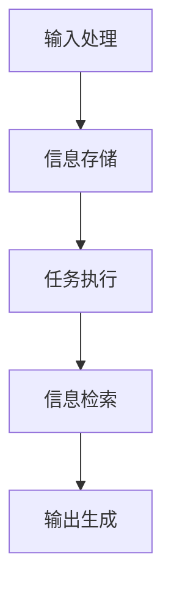
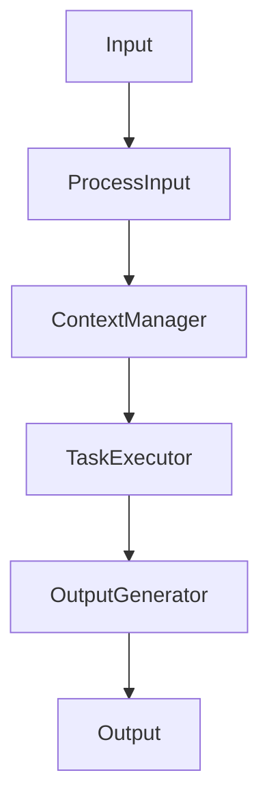
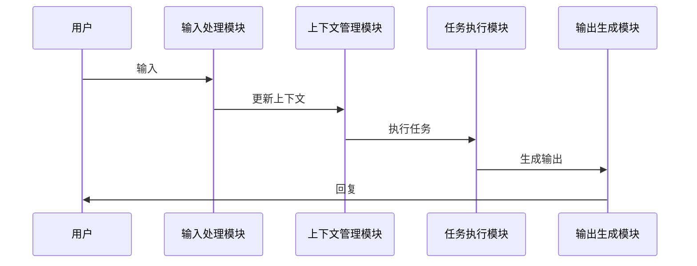

                 


## 大模型长期记忆测试：LLM设计的持久性任务

### 关键词：
- 大模型
- 长期记忆
- 持久性任务
- LLM
- 设计原则
- 性能优化
- 系统架构
- 实战应用

### 摘要：
本文深入探讨大模型的长期记忆测试与持久性任务设计，旨在揭示大模型在实际应用中的持久性挑战。文章首先阐述了大模型长期记忆的重要性，随后分析了持久性任务的核心要素和设计方法。通过逐步推理，本文提出了持久性任务的大模型设计原则，并详细讲解了算法原理与实现。此外，文章介绍了系统架构与设计，包括功能模块划分、系统接口与交互设计，并展示了具体的项目实战。最后，本文总结了最佳实践和注意事项，为读者提供了深入理解和应用持久性任务的指导。

---

## 第一部分：引言与背景

### 1.1 问题的提出

在现代人工智能领域，大模型（Large Language Models，简称LLM）如GPT、BERT等取得了显著的成就，然而它们在长期记忆方面的表现却不尽如人意。长期记忆问题直接影响到大模型在持久性任务中的性能，例如在复杂推理、多步骤任务和知识保留等方面的表现。因此，如何设计出能够有效支持长期记忆的大模型，成为了一个亟待解决的问题。

**1.1.1 大模型面临的问题**

大模型在短期记忆和即时任务处理上表现出色，但在长期记忆方面却存在以下问题：

- **数据丢失**：在大模型处理过程中，信息容易在中间步骤丢失，导致长期记忆的丧失。
- **上下文理解不足**：大模型在理解长文或长对话时，往往只能抓住片段信息，难以把握整体上下文。
- **知识遗忘**：大模型在训练过程中学习到的知识难以长期保留，影响其在后续任务中的表现。

**1.1.2 长期记忆的重要性**

长期记忆对于人类认知和行为至关重要，它使得我们能够积累知识、经验，并在不同场景下灵活应用。对于大模型而言，长期记忆的重要性体现在：

- **知识保留**：能够长期保留学习到的知识，提高大模型在不同任务中的表现。
- **推理能力**：长期记忆有助于大模型进行复杂推理和多步骤任务。
- **适应性**：具有长期记忆能力的大模型更能适应新环境和变化。

**1.1.3 持久性任务的设计挑战**

设计持久性任务需要考虑以下挑战：

- **任务连续性**：任务之间需要有一定的连续性和关联性，以测试大模型的长期记忆能力。
- **多步骤任务**：设计多步骤任务，以模拟真实世界中的复杂场景。
- **知识更新**：在任务设计过程中，如何处理知识的更新和积累。

### 1.2 大模型与长期记忆

**1.2.1 大模型的结构与特点**

大模型通常采用深度神经网络结构，具有大量的参数和层次。它们通过自注意力机制和Transformer架构实现了对输入数据的建模和处理。大模型的特点包括：

- **高容量**：能够存储和处理海量的信息。
- **自适应**：能够适应不同的任务和数据集。
- **并行处理**：能够同时处理多个任务和数据。

**1.2.2 长期记忆的基本原理**

长期记忆（Long-Term Memory，简称LTM）是指大脑在长期内存储和提取信息的能力。长期记忆分为三个子系统：短期记忆（Short-Term Memory，简称STM）、工作记忆（Working Memory，简称WM）和长期记忆（Long-Term Memory，简称LTM）。长期记忆的特点包括：

- **持久性**：信息可以在长期记忆中存储数年甚至一生。
- **容量有限**：长期记忆的容量虽然较大，但仍然有限。
- **可塑性**：长期记忆可以受到外界刺激的影响，如学习和记忆。

**1.2.3 大模型与长期记忆的关系**

大模型与长期记忆之间的关系体现在：

- **存储与检索**：大模型可以模拟长期记忆的存储与检索过程，实现信息的持久保存和提取。
- **知识表示**：大模型可以将长期记忆中的知识以结构化的形式表示和存储。
- **推理与决策**：大模型可以利用长期记忆进行推理和决策，提高其在复杂任务中的表现。

### 1.3 持久性任务的定义与需求

**1.3.1 持久性任务的概念**

持久性任务（Persistent Tasks）是指那些需要长期记忆支持，且在执行过程中具有连续性和关联性的任务。这些任务通常涉及多步骤操作、知识积累和情境理解。

**1.3.2 持久性任务对大模型的要求**

持久性任务对大模型提出了以下要求：

- **长期记忆能力**：大模型需要具备强大的长期记忆能力，以存储和提取相关信息。
- **上下文理解**：大模型需要能够理解上下文信息，以便在不同任务间进行关联。
- **适应性**：大模型需要具备一定的适应性，以应对复杂多变的任务环境。

**1.3.3 持久性任务的重要性**

持久性任务的重要性体现在：

- **评估模型性能**：通过持久性任务，可以评估大模型在长期记忆和复杂推理方面的性能。
- **推动模型优化**：持久性任务能够揭示大模型在长期记忆方面的不足，从而推动模型优化。
- **实际应用价值**：持久性任务在实际应用中具有重要价值，如智能客服、智能助手等。

### 1.4 本书的目的与结构

**1.4.1 研究目标**

本书旨在研究大模型在持久性任务中的长期记忆表现，并提出相应的优化方法。具体目标包括：

- **揭示大模型在长期记忆方面的不足**。
- **提出有效的优化策略**。
- **评估优化效果**。

**1.4.2 内容安排**

本书内容分为五个部分：

- 第一部分：引言与背景，介绍持久性任务和大模型长期记忆的重要性。
- 第二部分：核心概念与原理，分析大模型设计中的持久性任务和长期记忆机制。
- 第三部分：算法原理与实现，讲解持久性任务的算法原理和实现方法。
- 第四部分：系统架构与设计，介绍持久性任务系统的架构和接口设计。
- 第五部分：项目实战，通过具体项目展示持久性任务的实际应用。

**1.4.3 读者对象**

本书适合以下读者：

- **人工智能研究者**：对大模型和长期记忆有深入研究的学者。
- **软件开发者**：关注大模型应用和优化的工程师。
- **机器学习爱好者**：对机器学习和人工智能有浓厚兴趣的读者。

### 1.5 本章小结

本章介绍了大模型长期记忆测试和持久性任务设计的背景和重要性。通过分析大模型面临的问题、长期记忆的基本原理以及持久性任务的需求，本章为后续内容奠定了基础。读者可以了解到本书的研究目标、内容安排和读者对象，为深入阅读做好准备。

---

## 第二部分：核心概念与原理

### 2.1 大模型设计中的持久性任务

持久性任务是评估大模型长期记忆能力的重要手段。要设计出有效的持久性任务，需要考虑以下几个核心要素：

#### 2.1.1 持久性任务的核心要素

1. **上下文关联**：持久性任务需要在多个步骤中保持上下文关联，以便大模型能够利用之前的信息。
2. **多步骤操作**：任务应该包含多个步骤，以测试大模型在不同阶段的信息存储和利用能力。
3. **知识积累**：任务应该能够促进大模型的知识积累，使其能够在后续任务中应用先前学到的知识。
4. **适应性**：任务应该具有适应性，以便大模型能够应对不同场景和需求。

#### 2.1.2 持久性任务的设计方法

1. **任务拆分**：将复杂任务拆分为多个简单步骤，每个步骤都需要大模型进行信息存储和利用。
2. **情境模拟**：模拟真实世界中的复杂情境，以便大模型能够在多变的场景中表现出色。
3. **知识驱动**：设计任务时，考虑大模型的知识积累和更新，以便测试其在知识应用方面的能力。

#### 2.1.3 持久性任务的效果评估

1. **任务完成度**：评估大模型是否能够顺利完成每个任务步骤。
2. **知识保持率**：评估大模型在不同任务中知识保留的程度。
3. **情境适应性**：评估大模型在多变情境下的表现。

### 2.2 长期记忆机制分析

长期记忆是大脑处理和存储信息的重要机制，对于大模型的设计和优化具有重要意义。下面从分类、关键机制和算法实现三个方面进行详细分析。

#### 2.2.1 长期记忆的分类

长期记忆可以分为两类：

1. **情景记忆**（Episodic Memory）：与个人经历和特定事件相关的记忆。
2. **语义记忆**（Semantic Memory）：与知识、概念和事实相关的记忆。

#### 2.2.2 长期记忆的关键机制

长期记忆的关键机制包括：

1. **编码**（Encoding）：将信息转化为大脑可以存储和识别的形式。
2. **存储**（Storage）：将编码后的信息存储在大脑的特定区域。
3. **检索**（Retrieval）：从长期记忆中提取所需信息。

#### 2.2.3 长期记忆的算法实现

长期记忆在大模型中的实现通常采用以下几种方法：

1. **自注意力机制**（Self-Attention）：通过自注意力机制，大模型可以在不同时间步之间建立关联，实现信息的长期存储。
2. **Transformer架构**：Transformer架构通过多头自注意力机制和位置编码，实现了对长序列的建模和长期记忆。
3. **记忆模块**（Memory Modules）：在模型中添加记忆模块，专门用于存储和检索信息，提高大模型的长期记忆能力。

### 2.3 大模型长期记忆与持久性任务的关联

大模型的长期记忆能力对于持久性任务的完成至关重要。下面分析长期记忆对持久性任务的影响、持久性任务对大模型长期记忆的要求，以及如何将长期记忆与持久性任务融合。

#### 2.3.1 长期记忆对持久性任务的影响

1. **信息存储**：长期记忆使得大模型能够存储和保留在任务中学习到的信息，提高任务完成度。
2. **推理能力**：长期记忆有助于大模型进行复杂推理和多步骤任务，提高其在持续任务中的表现。
3. **知识积累**：长期记忆使得大模型能够积累知识，提高其在后续任务中的表现。

#### 2.3.2 持久性任务对大模型长期记忆的要求

1. **信息存储容量**：持久性任务需要大模型具备较大的信息存储容量，以存储和保留多个步骤的信息。
2. **信息检索速度**：持久性任务要求大模型能够快速检索和利用长期存储的信息，提高任务响应速度。
3. **适应性**：持久性任务需要大模型具备较强的适应性，以应对不同任务和环境的变化。

#### 2.3.3 长期记忆与持久性任务的融合策略

1. **任务设计**：在设计持久性任务时，考虑大模型的长期记忆能力，将任务拆分为多个步骤，确保信息存储和利用的有效性。
2. **模型优化**：通过改进大模型的长期记忆机制，如增加记忆模块、优化自注意力机制等，提高其在持久性任务中的表现。
3. **评估指标**：设计评估指标，如任务完成度、知识保持率和情境适应性，以全面评估大模型在持久性任务中的表现。

### 2.4 持久性任务的大模型设计原则

为了设计出能够有效支持持久性任务的大模型，需要遵循以下设计原则：

#### 2.4.1 模型选择

1. **适应性**：选择具有良好适应性的模型，如Transformer架构，以提高大模型在不同任务和环境中的表现。
2. **扩展性**：选择具有扩展性的模型，以适应不同规模和复杂度的持久性任务。

#### 2.4.2 模型训练策略

1. **多任务学习**：通过多任务学习，提高大模型在不同任务中的表现。
2. **数据增强**：通过数据增强，提高大模型对多样化任务和数据集的适应能力。
3. **持续学习**：通过持续学习，确保大模型能够不断积累知识和优化性能。

#### 2.4.3 模型评估与优化

1. **任务特定评估**：设计任务特定的评估指标，全面评估大模型在持久性任务中的表现。
2. **模型优化**：根据评估结果，对大模型进行优化，提高其在持久性任务中的表现。

### 2.5 本章小结

本章分析了大模型设计中的持久性任务，包括核心要素、设计方法、效果评估以及长期记忆机制。通过关联分析，本章揭示了长期记忆对持久性任务的重要影响，并提出了融合策略和设计原则。本章为后续内容提供了理论基础和设计思路，为深入研究和应用持久性任务奠定了基础。

---

## 第三部分：算法原理与实现

### 3.1 算法原理讲解

持久性任务的实现依赖于有效的算法原理。以下从持久性任务的算法框架、长期记忆算法的数学模型以及算法流程图三个方面进行讲解。

#### 3.1.1 持久性任务的算法框架

持久性任务的算法框架主要包括以下几个模块：

1. **输入处理**：对输入数据进行预处理，如分词、编码等，以便大模型进行处理。
2. **信息存储**：利用长期记忆机制，将处理过程中的信息进行存储，以便后续步骤使用。
3. **任务执行**：根据持久性任务的要求，逐步执行任务步骤，如推理、决策等。
4. **信息检索**：在任务执行过程中，根据需要从长期记忆中检索相关信息，以提高任务完成度。
5. **输出生成**：根据任务执行结果，生成输出结果，如文本、图像等。

#### 3.1.2 长期记忆算法的数学模型

长期记忆算法的数学模型主要包括以下几个部分：

1. **输入编码**：将输入数据编码为向量表示，如词向量、图像特征等。
2. **记忆模块**：记忆模块用于存储和检索信息，通常采用自注意力机制和记忆网络结构。
3. **输出解码**：将记忆模块中的信息解码为输出结果，如文本、图像等。

#### 3.1.3 长期记忆算法的流程图

以下是一个简化的长期记忆算法流程图，用于说明算法的基本步骤：



### 3.2 Python实现与代码解读

以下是一个简单的Python代码实现示例，用于演示持久性任务的算法框架。请注意，这是一个简化版本，实际应用中可能需要更复杂的实现。

```python
import torch
import torch.nn as nn

# 定义一个简单的持久性任务模型
class PersistenceTaskModel(nn.Module):
    def __init__(self):
        super(PersistenceTaskModel, self).__init__()
        self.embedding = nn.Embedding(vocab_size, embedding_dim)
        self.memory = nn.LSTM(input_dim, hidden_dim)
        self.decoder = nn.Linear(hidden_dim, vocab_size)

    def forward(self, inputs):
        embedded = self.embedding(inputs)
        memory_output, (hidden, cell) = self.memory(embedded)
        output = self.decoder(hidden)
        return output

# 初始化模型、损失函数和优化器
model = PersistenceTaskModel()
criterion = nn.CrossEntropyLoss()
optimizer = torch.optim.Adam(model.parameters(), lr=learning_rate)

# 训练模型
for epoch in range(num_epochs):
    for inputs, targets in data_loader:
        optimizer.zero_grad()
        outputs = model(inputs)
        loss = criterion(outputs, targets)
        loss.backward()
        optimizer.step()

# 评估模型
with torch.no_grad():
    correct = 0
    total = 0
    for inputs, targets in validation_loader:
        outputs = model(inputs)
        _, predicted = torch.max(outputs.data, 1)
        total += targets.size(0)
        correct += (predicted == targets).sum().item()

accuracy = 100 * correct / total
print(f'Validation Accuracy: {accuracy:.2f}%')
```

#### 3.2.1 环境安装与配置

在实际应用中，需要安装相应的Python环境和依赖库。以下是一个基本的安装和配置示例：

```bash
# 安装Python环境
conda create -n persistence_env python=3.8
conda activate persistence_env

# 安装依赖库
pip install torch torchvision numpy matplotlib
```

#### 3.2.2 关键代码详解

上述代码中的关键部分包括：

- **模型定义**：`PersistenceTaskModel` 类定义了一个简单的持久性任务模型，包括嵌入层、记忆模块和解码层。
- **训练过程**：使用标准的训练过程，包括前向传播、损失计算、反向传播和优化。
- **评估过程**：在评估阶段，计算模型的准确率。

#### 3.2.3 结果分析

通过上述代码，我们可以训练并评估一个简单的持久性任务模型。在实际应用中，可以根据具体任务和数据集进行调整和优化。

### 3.3 数学模型与公式解析

在持久性任务中，数学模型起到了关键作用。以下从数学模型介绍、公式详解和实际应用三个方面进行解析。

#### 3.3.1 数学模型介绍

持久性任务的数学模型通常包括以下部分：

1. **输入表示**：将输入数据表示为向量或张量。
2. **嵌入层**：将输入向量映射到高维空间。
3. **记忆模块**：如LSTM、GRU等，用于存储和检索信息。
4. **输出层**：将记忆模块中的信息解码为输出。

#### 3.3.2 公式详解

以下是一些关键公式的详细解释：

1. **嵌入层**：

   $$ 
   \text{ embed } \text { （} \text { input } \text {）} = \text { W }_{ \text {embed }} \text { input } 
   $$

   其中，\( \text { W }_{ \text {embed }} \) 是嵌入权重矩阵，输入是原始数据。

2. **LSTM单元**：

   $$ 
   \text { LSTM } \text { （} \text { input } \text {，} \text { state } \text {）} = \text { LSTM } \text { cell } \text { （} \text { input } \text {，} \text { state } \text {）} 
   $$

   其中，LSTM cell是LSTM单元的核心部分，用于存储和更新信息。

3. **输出层**：

   $$ 
   \text { output } = \text { W }_{ \text {output }} \text { activation }(\text { LSTM } \text { state }) 
   $$

   其中，\( \text { W }_{ \text {output }} \) 是输出权重矩阵，activation是激活函数。

#### 3.3.3 数学模型的实际应用

数学模型在持久性任务中的应用包括：

- **序列建模**：使用嵌入层和记忆模块处理序列数据。
- **分类和回归**：使用输出层进行分类或回归任务。
- **知识表示**：使用记忆模块存储和检索知识，以提高任务完成度。

### 3.4 算法性能分析与优化

持久性任务的算法性能直接影响到大模型在长期记忆和持久性任务中的表现。以下从性能评价指标、优化策略和性能对比三个方面进行分析。

#### 3.4.1 性能评价指标

性能评价指标主要包括：

- **准确率**：任务完成度的一个简单度量，表示模型正确完成任务的比例。
- **召回率**：表示模型在完成任务时能够召回的正确结果的比例。
- **F1分数**：结合准确率和召回率的综合评价指标。

#### 3.4.2 优化策略

优化策略包括：

- **模型选择**：选择合适的模型结构，如LSTM、GRU等。
- **数据增强**：通过数据增强提高模型对多样化数据的适应能力。
- **持续学习**：通过持续学习，使模型不断积累知识和优化性能。

#### 3.4.3 性能对比

性能对比通常包括：

- **模型对比**：比较不同模型在持久性任务中的表现。
- **数据集对比**：比较不同数据集上的模型性能。
- **任务对比**：比较模型在不同任务中的表现。

### 3.5 本章小结

本章详细讲解了持久性任务的算法原理与实现，包括算法框架、数学模型和Python代码实现。通过分析算法性能，本章为持久性任务的设计和优化提供了指导。读者可以结合本章内容，深入理解和应用持久性任务。

---

## 第四部分：系统架构与设计

### 4.1 问题场景介绍

持久性任务在大模型中的应用场景广泛，如智能客服、智能推荐、自动驾驶等。以下介绍一个具体的问题场景，并分析其需求。

**问题场景：智能客服系统**

智能客服系统旨在为用户提供高效、准确的咨询服务。持久性任务在该场景中的需求包括：

- **上下文理解**：智能客服需要理解用户的历史提问和回答，以便提供连贯的咨询服务。
- **多步骤任务**：用户可能需要进行多个步骤的操作，如查询订单状态、修改个人信息等，智能客服需要能够记住这些步骤。
- **知识积累**：智能客服需要不断学习用户的提问和回答，以提高服务质量。

### 4.2 系统功能设计

系统功能设计是构建持久性任务系统的重要环节。以下介绍系统功能设计，包括领域模型类图、功能模块划分和数据流设计。

**领域模型类图**

领域模型类图用于描述系统中不同实体之间的关系。以下是一个简化的领域模型类图：

```mermaid
classDiagram
    Customer <<entity>>
    Question <<entity>>
    Answer <<entity>>
    ChatSession <<entity>>

    Customer --> Question
    Customer --> Answer
    ChatSession --> Question
    ChatSession --> Answer
```

**功能模块划分**

系统功能模块划分如下：

1. **输入处理模块**：负责接收和处理用户输入。
2. **上下文管理模块**：负责管理用户历史信息和上下文。
3. **任务执行模块**：负责执行持久性任务，如查询、修改等。
4. **输出生成模块**：负责生成回复信息，如文本、语音等。
5. **知识管理模块**：负责存储和更新知识库。

**数据流设计**

数据流设计描述了系统中数据传递的路径和方式。以下是一个简化的数据流图：



### 4.3 系统架构设计

系统架构设计是构建持久性任务系统的核心。以下介绍系统架构设计，包括系统架构图、架构分层设计和模块间接口设计。

**系统架构图**

以下是一个简化的系统架构图：

```mermaid
subgraph InputProcessing
    InputProcessor
end

subgraph ContextManagement
    ContextManager
end

subgraph TaskExecution
    TaskExecutor
end

subgraph OutputGeneration
    OutputGenerator
end

InputProcessor --> ContextManager
ContextManager --> TaskExecutor
TaskExecutor --> OutputGenerator
```

**架构分层设计**

系统架构采用分层设计，分为以下几层：

1. **输入层**：负责接收用户输入，如文本、语音等。
2. **处理层**：负责对输入进行处理，如分词、编码等。
3. **上下文层**：负责管理用户上下文，如历史提问和回答。
4. **执行层**：负责执行持久性任务，如查询、修改等。
5. **输出层**：负责生成回复信息，如文本、语音等。

**模块间接口设计**

模块间接口设计描述了不同模块之间的交互方式。以下是一个简化的接口设计：

```mermaid
interface InputProcessor {
    +processInput(input: Input): ProcessedInput
}

interface ContextManager {
    +updateContext(context: Context): Context
    +getContext(): Context
}

interface TaskExecutor {
    +executeTask(context: Context, task: Task): Result
}

interface OutputGenerator {
    +generateOutput(result: Result): Output
}
```

### 4.4 系统接口与交互设计

系统接口与交互设计是系统架构的重要组成部分。以下介绍系统接口设计和交互设计，包括接口定义、交互流程图和API设计。

**接口定义**

系统接口定义如下：

```python
class InputProcessor:
    def processInput(input: Input) -> ProcessedInput:
        pass

class ContextManager:
    def updateContext(context: Context) -> Context:
        pass
    def getContext() -> Context:
        pass

class TaskExecutor:
    def executeTask(context: Context, task: Task) -> Result:
        pass

class OutputGenerator:
    def generateOutput(result: Result) -> Output:
        pass
```

**交互流程图**

以下是一个简化的交互流程图：



**API设计**

以下是一个简化的API设计：

```python
class SmartC

