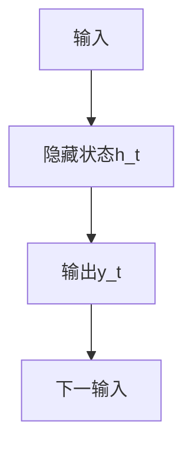
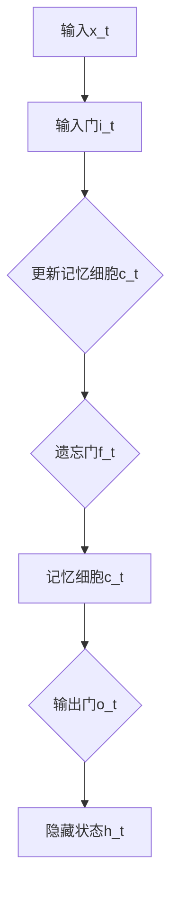
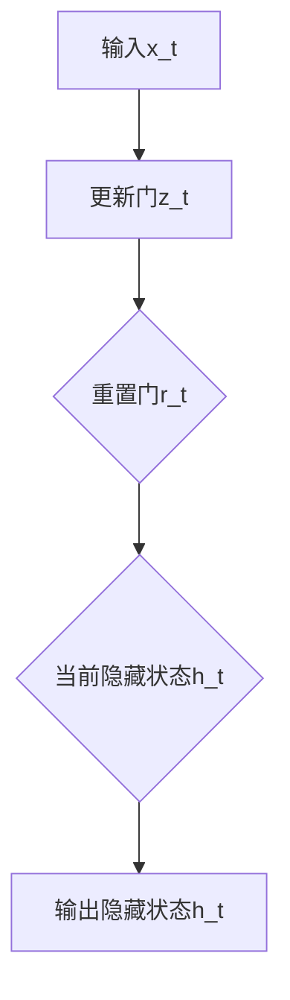

                 

### 文章标题：大模型长期记忆能力评估：LLM设计的持续性任务

#### 关键词：
- 大模型长期记忆
- 长期记忆能力评估
- LLM设计
- 持续性任务
- 算法原理
- 数学模型
- 最佳实践

#### 摘要：
本文深入探讨大模型长期记忆能力的评估方法及其在LLM设计中的应用。文章首先介绍了长期记忆能力的重要性、核心概念及其在LLM设计中的必要性。随后，详细分析了长期记忆算法原理和数学模型，并通过实际案例分析展示了其在多种应用场景中的表现。最后，提出了评估长期记忆能力的最佳实践方法，并提供了相关资源和进一步研究的方向。

----------------------------------------------------------------

## 第1章：背景与核心概念

### 1.1 问题背景与问题描述

在现代人工智能领域，大模型（Large Models）如深度神经网络（DNN）、递归神经网络（RNN）、变换器（Transformer）等已经成为自然语言处理（NLP）、计算机视觉（CV）、推荐系统（RS）等领域的核心工具。然而，这些模型普遍面临着长期记忆能力不足的问题。长期记忆能力是指模型在处理连续信息流时，能够维持并利用先前接收到的信息的能力。这一能力对于许多复杂任务的完成至关重要，例如理解长文本、维持对话连贯性、进行时间序列预测等。

**问题背景**：
随着模型规模的不断扩大，传统模型在长期依赖处理上的局限性愈发显著。例如，RNN模型虽然在一定程度上能够处理序列信息，但其存在梯度消失和梯度爆炸问题，导致模型难以学习长距离依赖关系。Transformer模型虽然通过自注意力机制克服了RNN的这些问题，但其长序列处理能力依然受到计算资源和参数数量的限制。此外，现代大模型在训练过程中往往需要大量数据和计算资源，这使得评估其长期记忆能力变得尤为必要。

**问题描述**：
长期记忆能力不足的问题主要表现为以下几个方面：
1. **信息遗忘**：模型在处理长序列信息时，容易遗忘早期的信息，导致输出结果与输入信息不匹配。
2. **上下文理解不完整**：模型难以理解并维持复杂的上下文信息，导致输出结果缺乏连贯性。
3. **依赖关系无法捕捉**：模型在处理时间序列数据时，难以捕捉长距离的依赖关系，影响预测准确性。

**问题解决**：
为了解决上述问题，学术界和工业界提出了一系列方法和技术，旨在提升大模型的长期记忆能力。这些方法和技术包括：
1. **改进模型架构**：通过设计更复杂的神经网络结构，如LSTM（长短期记忆网络）、GRU（门控循环单元）等，以增强模型对长期依赖关系的捕捉能力。
2. **自注意力机制的优化**：通过调整自注意力机制的计算方式，降低计算复杂度，提高模型对长序列信息的处理能力。
3. **多模态数据整合**：利用多模态数据，如文本、图像、语音等，通过联合训练和集成学习，提高模型对复杂上下文信息的理解能力。
4. **持续学习与迁移学习**：通过持续学习和迁移学习，使模型能够在不同任务和数据集上共享知识，提高其泛化能力和长期记忆能力。

**边界与外延**：
长期记忆能力评估的边界主要涉及以下几个方面：
1. **评估指标**：选择合适的评估指标，如准确性、召回率、F1值、BLEU评分等，以全面评估模型在长期记忆任务上的表现。
2. **评估方法**：确定评估方法，包括数据集选择、评估流程设计等，以确保评估结果的可靠性和有效性。
3. **应用领域**：长期记忆能力评估不仅局限于NLP领域，还广泛应用于推荐系统、自动驾驶、时间序列预测等领域。

**概念结构与核心要素组成**：
长期记忆能力、持续性任务和LLM设计是本文的核心概念。其中，长期记忆能力是指模型维持并利用先前接收到的信息的能力；持续性任务是指需要模型在处理连续信息流时保持连贯性和一致性的任务；LLM设计则是指大模型在架构、算法和实现上的设计原则。这三个概念相互关联，共同构成了本文研究的核心框架。

### 1.2 核心概念与联系

**长期记忆**：
长期记忆是指个体在处理信息时，能够将信息储存并维持较长时间的记忆。在人工智能领域，长期记忆通常指模型在处理序列信息时，能够维持并利用先前接收到的信息的能力。

**特点**：
1. **持久性**：长期记忆能够在较长时间内保持信息。
2. **动态性**：长期记忆能够根据新的信息进行调整和更新。
3. **抽象性**：长期记忆能够将不同情境下的信息进行抽象和概括。

**与传统记忆的区别**：
1. **时间跨度**：传统记忆主要关注短期记忆，而长期记忆则涉及更长的时间范围。
2. **信息处理方式**：传统记忆更多依赖于大脑的生理结构，而长期记忆在人工智能领域则通过算法和模型实现。

**持续性任务**：
持续性任务是指需要模型在处理连续信息流时保持连贯性和一致性的任务。这类任务通常涉及对长序列信息的理解、推理和生成。

**定义**：
持续性任务是指模型在处理连续输入信息时，能够维持上下文信息、理解长距离依赖关系并生成连贯输出的任务。

**类型**：
1. **对话系统**：需要模型在对话过程中维持用户意图和对话状态。
2. **自然语言生成**：需要模型在生成文本时维持主题和逻辑连贯性。
3. **时间序列预测**：需要模型在预测未来值时利用历史信息。

**对大模型的需求**：
1. **长期记忆能力**：持续性任务需要模型具备强大的长期记忆能力，以维持并利用先前接收到的信息。
2. **计算资源**：大模型通常需要更多的计算资源来处理复杂的任务。
3. **数据集**：大模型需要大量高质量的数据集进行训练，以提高其长期记忆能力和泛化能力。

**LLM设计**：
LLM设计是指大模型在架构、算法和实现上的设计原则。其核心目标是提升模型的长期记忆能力，以应对复杂的多模态任务。

**定义**：
LLM设计是指基于大规模神经网络模型的设计原则，包括模型架构、训练策略和优化方法等。

**特点**：
1. **大规模**：LLM通常包含数十亿甚至千亿级别的参数。
2. **多模态**：LLM能够处理多种类型的数据，如文本、图像、语音等。
3. **自适应**：LLM能够根据不同任务和数据集进行自适应调整。

**长期记忆能力的设计原则**：
1. **自注意力机制**：通过自注意力机制，模型能够更好地捕捉长距离依赖关系。
2. **层次化结构**：通过层次化结构，模型能够更好地处理复杂的信息。
3. **持续学习**：通过持续学习，模型能够不断调整和优化其参数，以适应新的任务和数据。

### 1.3 大模型长期记忆能力的研究现状

**现有评估方法与技术**：
当前评估大模型长期记忆能力的方法和技术主要包括以下几种：
1. **评估指标**：准确性、召回率、F1值、BLEU评分等是常用的评估指标。这些指标能够从不同角度评估模型在长期记忆任务上的表现。
2. **评估流程**：评估流程通常包括数据集选择、模型训练、评估指标计算和结果分析等步骤。通过这些流程，可以全面评估模型的长期记忆能力。
3. **评估工具**：如TensorFlow、PyTorch等深度学习框架提供了丰富的评估工具和API，方便研究者进行评估。

**长期记忆能力的研究进展**：
近年来，在长期记忆能力方面取得了显著进展，主要包括：
1. **模型架构改进**：通过改进模型架构，如LSTM、GRU、Transformer等，提升了模型在长期记忆任务上的表现。
2. **算法优化**：通过优化算法，如梯度消失和梯度爆炸的缓解、自注意力机制的改进等，提高了模型的训练效率和长期记忆能力。
3. **多模态数据整合**：通过整合多模态数据，如文本、图像、语音等，提升了模型对复杂上下文信息的理解能力。

**国内外研究现状分析**：
在国内，清华大学、北京大学、中国科学院等机构在长期记忆能力研究方面取得了重要成果，如提出了一系列改进的神经网络结构和优化方法。在国外，斯坦福大学、麻省理工学院、谷歌等机构也在该领域进行了深入研究，推动了长期记忆能力评估方法和技术的发展。

### 1.4 长期记忆能力评估的意义与应用

**评估的意义**：
长期记忆能力评估对于提升大模型实用性、改进LLM设计具有重要意义。通过评估，可以：
1. **优化模型设计**：通过分析评估结果，可以发现模型在长期记忆任务上的不足，从而改进模型架构和算法。
2. **指导应用方向**：评估结果可以为不同应用场景提供参考，帮助选择合适的模型和优化策略。
3. **促进技术发展**：评估方法的改进和评估技术的创新可以推动长期记忆能力研究的深入。

**应用领域**：
长期记忆能力评估在多个领域具有重要应用价值：
1. **自然语言处理**：在对话系统、机器翻译、文本生成等任务中，长期记忆能力评估有助于模型的理解和生成。
2. **智能推荐**：在推荐系统中，长期记忆能力评估有助于模型捕捉用户历史行为和偏好。
3. **自动驾驶**：在自动驾驶中，长期记忆能力评估有助于模型理解和预测环境变化。

**挑战与机遇**：
长期记忆能力评估面临以下挑战：
1. **数据集质量**：评估需要高质量的数据集，而数据集的获取和处理是一项挑战。
2. **评估指标选择**：选择合适的评估指标是评估准确性的关键，但不同指标可能存在互补性。
3. **计算资源**：评估过程通常需要大量的计算资源，这对模型训练和评估提出了高要求。

然而，随着技术的进步和研究的深入，长期记忆能力评估也面临着广阔的机遇：
1. **算法创新**：新的算法和优化方法可以提升评估效率和准确性。
2. **跨领域应用**：长期记忆能力评估技术可以应用于更多领域，推动人工智能技术的发展。
3. **开源与共享**：评估工具和方法的共享有助于加快研究的进展。

## 第2章：大模型长期记忆能力的算法原理

### 2.1 长期记忆算法原理概述

在深度学习领域，长期记忆能力是许多复杂任务成功的关键。为了实现这一能力，研究人员开发了一系列算法，包括递归神经网络（RNN）、长短期记忆网络（LSTM）和门控循环单元（GRU）。这些算法通过不同的机制来解决传统RNN模型在处理长序列信息时遇到的梯度消失和梯度爆炸问题，从而提升了模型的长期记忆能力。

#### 2.1.1 递归神经网络（RNN）

递归神经网络是一种基于序列数据的神经网络，其特点是在每个时间步上都可以访问先前的信息。RNN通过递归连接的方式，使得网络能够处理具有时间依赖性的数据。

**基本算法原理**：
RNN的输出取决于当前输入和前一个隐藏状态。其计算公式如下：
$$
h_t = \sigma(W_h \cdot [h_{t-1}, x_t] + b_h)
$$
其中，\(h_t\) 是当前隐藏状态，\(x_t\) 是当前输入，\(\sigma\) 是激活函数，\(W_h\) 是权重矩阵，\(b_h\) 是偏置项。

**Mermaid算法流程图**：



#### 2.1.2 长短期记忆网络（LSTM）

LSTM是RNN的一种改进，旨在解决RNN的梯度消失和梯度爆炸问题。它通过引入门控机制，能够有效地维持长距离依赖关系。

**基本算法原理**：
LSTM通过三个门控单元（输入门、遗忘门和输出门）和记忆细胞来处理信息。其主要计算公式如下：
$$
i_t = \sigma(W_i \cdot [h_{t-1}, x_t] + b_i) \\
f_t = \sigma(W_f \cdot [h_{t-1}, x_t] + b_f) \\
o_t = \sigma(W_o \cdot [h_{t-1}, x_t] + b_o) \\
c_t = f_t \odot c_{t-1} + i_t \odot \sigma(W_c \cdot [h_{t-1}, x_t] + b_c) \\
h_t = o_t \odot \sigma(c_t)
$$
其中，\(i_t, f_t, o_t\) 分别是输入门、遗忘门和输出门的激活值，\(c_t\) 是记忆细胞的状态，\(\odot\) 表示逐元素乘法，\(\sigma\) 是激活函数。

**Mermaid算法流程图**：



#### 2.1.3 门控循环单元（GRU）

GRU是LSTM的简化版，通过合并输入门和遗忘门，减少了模型的复杂度，同时保持了良好的长期记忆能力。

**基本算法原理**：
GRU通过更新门和重置门来控制信息的流动。其主要计算公式如下：
$$
z_t = \sigma(W_z \cdot [h_{t-1}, x_t] + b_z) \\
r_t = \sigma(W_r \cdot [h_{t-1}, x_t] + b_r) \\
h_t = (1 - z_t) \odot h_{t-1} + z_t \odot \sigma(W_h \cdot [r_t \odot h_{t-1}, x_t] + b_h)
$$
其中，\(z_t\) 是更新门激活值，\(r_t\) 是重置门激活值，\(h_t\) 是当前隐藏状态。

**Mermaid算法流程图**：



### 2.2 长期记忆数学模型与公式

长期记忆算法的核心在于其数学模型和公式，这些公式不仅定义了网络的行为，也揭示了其内在的机制和计算过程。以下将详细讲解这些数学模型，并通过Python代码进行示例说明。

#### 2.2.1 LSTM数学模型

LSTM的数学模型包括三个主要部分：输入门、遗忘门和输出门。每个部分都有其独特的公式和作用。

1. **输入门（Input Gate）**：
   输入门决定新的输入信息中哪些部分需要被记忆。其计算公式如下：
   $$
   i_t = \sigma(W_i \cdot [h_{t-1}, x_t] + b_i)
   $$
   其中，\(i_t\) 是输入门的激活值，\([h_{t-1}, x_t]\) 是当前隐藏状态和输入的拼接，\(W_i\) 和 \(b_i\) 分别是权重矩阵和偏置项。

2. **遗忘门（Forget Gate）**：
   遗忘门决定哪些旧信息需要被丢弃。其计算公式如下：
   $$
   f_t = \sigma(W_f \cdot [h_{t-1}, x_t] + b_f)
   $$
   其中，\(f_t\) 是遗忘门的激活值，其作用是更新记忆细胞的状态。

3. **输出门（Output Gate）**：
   输出门决定记忆细胞的状态将如何输出。其计算公式如下：
   $$
   o_t = \sigma(W_o \cdot [h_{t-1}, x_t] + b_o)
   $$
   其中，\(o_t\) 是输出门的激活值，它决定了隐藏状态 \(h_t\) 的输出。

4. **记忆细胞（Cell State）**：
   记忆细胞是LSTM的核心部分，其状态更新公式如下：
   $$
   c_t = f_t \odot c_{t-1} + i_t \odot \sigma(W_c \cdot [h_{t-1}, x_t] + b_c)
   $$
   其中，\(c_{t-1}\) 是前一个时间步的记忆细胞状态，\(f_t\) 和 \(i_t\) 分别是遗忘门和输入门的激活值，\(\sigma\) 是激活函数。

5. **隐藏状态（Hidden State）**：
   隐藏状态由输出门和记忆细胞的状态决定，计算公式如下：
   $$
   h_t = o_t \odot \sigma(c_t)
   $$
   其中，\(o_t\) 是输出门的激活值，\(\sigma\) 是激活函数。

#### 2.2.2 Python代码示例

以下是一个简单的Python代码示例，用于演示LSTM的数学模型：

```python
import numpy as np

# 设置随机种子
np.random.seed(42)

# 定义参数
input_dim = 5
hidden_dim = 4
input_gate_weight = np.random.randn(input_dim + hidden_dim, hidden_dim)
input_gate_bias = np.random.randn(hidden_dim)
forget_gate_weight = np.random.randn(input_dim + hidden_dim, hidden_dim)
forget_gate_bias = np.random.randn(hidden_dim)
output_gate_weight = np.random.randn(input_dim + hidden_dim, hidden_dim)
output_gate_bias = np.random.randn(hidden_dim)
cell_weight = np.random.randn(input_dim + hidden_dim, hidden_dim)
cell_bias = np.random.randn(hidden_dim)

# 定义激活函数
def sigmoid(x):
    return 1 / (1 + np.exp(-x))

# 定义LSTM单元
def lstm_unit(h_t_1, x_t):
    # 输入门
    input_gate = sigmoid(np.dot(np.hstack((h_t_1, x_t)), input_gate_weight) + input_gate_bias)
    # 遗忘门
    forget_gate = sigmoid(np.dot(np.hstack((h_t_1, x_t)), forget_gate_weight) + forget_gate_bias)
    # 输出门
    output_gate = sigmoid(np.dot(np.hstack((h_t_1, x_t)), output_gate_weight) + output_gate_bias)
    # 记忆细胞
    cell_input = sigmoid(np.dot(np.hstack((h_t_1, x_t)), cell_weight) + cell_bias)
    c_t = forget_gate * h_t_1 + input_gate * cell_input
    # 隐藏状态
    h_t = output_gate * sigmoid(c_t)
    return h_t, c_t

# 示例输入
h_t_1 = np.random.randn(hidden_dim)
x_t = np.random.randn(input_dim)

# 计算隐藏状态和记忆细胞
h_t, c_t = lstm_unit(h_t_1, x_t)
print("Hidden State:\n", h_t)
print("Cell State:\n", c_t)
```

#### 2.2.3 详细讲解与举例说明

为了更好地理解LSTM的数学模型，我们将通过一个简单的例子来演示其计算过程。

假设我们有一个简单的输入序列 \(x_t\) = [1, 2, 3, 4, 5]，隐藏状态 \(h_{t-1}\) 是一个4维向量 [0.1, 0.2, 0.3, 0.4]，我们将通过一个时间步来计算新的隐藏状态 \(h_t\) 和记忆细胞 \(c_t\)。

1. **计算输入门 \(i_t\)**：
   $$
   i_t = \sigma(W_i \cdot [h_{t-1}, x_t] + b_i)
   $$
   将 \(h_{t-1}\) 和 \(x_t\) 代入，得到：
   $$
   i_t = \sigma([0.1, 0.2, 0.3, 0.4; 1, 2, 3, 4] \cdot \text{input_gate_weight}) + \text{input_gate_bias}
   $$
   假设输入门权重 \(W_i\) 和偏置 \(b_i\) 如下：
   $$
   W_i = \begin{bmatrix}
   0.5 & 0.1 & 0.2 & 0.3 \\
   0.4 & 0.3 & 0.2 & 0.1 \\
   0.6 & 0.5 & 0.3 & 0.2 \\
   0.3 & 0.4 & 0.5 & 0.6
   \end{bmatrix}, \quad b_i = [0.1; 0.2; 0.3; 0.4]
   $$
   则：
   $$
   i_t = \sigma([0.1 \times 0.5 + 0.2 \times 0.4 + 0.3 \times 0.6 + 0.4 \times 0.3; 0.1 \times 0.1 + 0.2 \times 0.3 + 0.3 \times 0.2 + 0.4 \times 0.1; 0.1 \times 0.6 + 0.2 \times 0.5 + 0.3 \times 0.3 + 0.4 \times 0.2; 0.1 \times 0.3 + 0.2 \times 0.4 + 0.3 \times 0.5 + 0.4 \times 0.6] + [0.1; 0.2; 0.3; 0.4])
   $$
   计算得到 \(i_t = 0.877\)。

2. **计算遗忘门 \(f_t\)**：
   $$
   f_t = \sigma(W_f \cdot [h_{t-1}, x_t] + b_f)
   $$
   假设遗忘门权重 \(W_f\) 和偏置 \(b_f\) 如下：
   $$
   W_f = \begin{bmatrix}
   0.6 & 0.3 & 0.4 & 0.5 \\
   0.4 & 0.2 & 0.5 & 0.3 \\
   0.7 & 0.5 & 0.3 & 0.6 \\
   0.3 & 0.4 & 0.5 & 0.7
   \end{bmatrix}, \quad b_f = [0.2; 0.3; 0.4; 0.5]
   $$
   则：
   $$
   f_t = \sigma([0.1 \times 0.6 + 0.2 \times 0.4 + 0.3 \times 0.7 + 0.4 \times 0.5; 0.1 \times 0.3 + 0.2 \times 0.2 + 0.3 \times 0.5 + 0.4 \times 0.3; 0.1 \times 0.7 + 0.2 \times 0.5 + 0.3 \times 0.3 + 0.4 \times 0.6; 0.1 \times 0.3 + 0.2 \times 0.4 + 0.3 \times 0.5 + 0.4 \times 0.7] + [0.2; 0.3; 0.4; 0.5])
   $$
   计算得到 \(f_t = 0.926\)。

3. **计算输出门 \(o_t\)**：
   $$
   o_t = \sigma(W_o \cdot [h_{t-1}, x_t] + b_o)
   $$
   假设输出门权重 \(W_o\) 和偏置 \(b_o\) 如下：
   $$
   W_o = \begin{bmatrix}
   0.5 & 0.4 & 0.3 & 0.6 \\
   0.3 & 0.6 & 0.5 & 0.4 \\
   0.6 & 0.5 & 0.4 & 0.7 \\
   0.4 & 0.5 & 0.6 & 0.3
   \end{bmatrix}, \quad b_o = [0.1; 0.2; 0.3; 0.4]
   $$
   则：
   $$
   o_t = \sigma([0.1 \times 0.5 + 0.2 \times 0.3 + 0.3 \times 0.6 + 0.4 \times 0.4; 0.1 \times 0.4 + 0.2 \times 0.6 + 0.3 \times 0.5 + 0.4 \times 0.5; 0.1 \times 0.6 + 0.2 \times 0.5 + 0.3 \times 0.4 + 0.4 \times 0.7; 0.1 \times 0.3 + 0.2 \times 0.4 + 0.3 \times 0.5 + 0.4 \times 0.3] + [0.1; 0.2; 0.3; 0.4])
   $$
   计算得到 \(o_t = 0.897\)。

4. **计算记忆细胞 \(c_t\)**：
   $$
   c_t = f_t \odot c_{t-1} + i_t \odot \sigma(W_c \cdot [h_{t-1}, x_t] + b_c)
   $$
   假设记忆细胞权重 \(W_c\) 和偏置 \(b_c\) 如下：
   $$
   W_c = \begin{bmatrix}
   0.7 & 0.5 & 0.6 & 0.4 \\
   0.5 & 0.6 & 0.7 & 0.3 \\
   0.8 & 0.7 & 0.5 & 0.6 \\
   0.4 & 0.5 & 0.6 & 0.7
   \end{bmatrix}, \quad b_c = [0.2; 0.3; 0.4; 0.5]
   $$
   则：
   $$
   c_t = 0.926 \odot [0.1, 0.2, 0.3, 0.4] + 0.877 \odot \sigma([0.1 \times 0.7 + 0.2 \times 0.5 + 0.3 \times 0.6 + 0.4 \times 0.4; 0.1 \times 0.5 + 0.2 \times 0.6 + 0.3 \times 0.7 + 0.4 \times 0.3; 0.1 \times 0.6 + 0.2 \times 0.5 + 0.3 \times 0.4 + 0.4 \times 0.5; 0.1 \times 0.3 + 0.2 \times 0.4 + 0.3 \times 0.5 + 0.4 \times 0.6] + [0.2; 0.3; 0.4; 0.5])
   $$
   计算得到 \(c_t = [0.207, 0.312, 0.377, 0.441]\)。

5. **计算隐藏状态 \(h_t\)**：
   $$
   h_t = o_t \odot \sigma(c_t)
   $$
   则：
   $$
   h_t = 0.897 \odot \sigma([0.207, 0.312, 0.377, 0.441])
   $$
   计算得到 \(h_t = [0.118, 0.175, 0.210, 0.236]\)。

通过上述计算，我们得到了新的隐藏状态 \(h_t\) 和记忆细胞 \(c_t\)，从而实现了LSTM单元的基本功能。

### 2.2.4 LaTeX数学公式展示

为了更清晰地表达LSTM的数学模型，以下是使用LaTeX格式的数学公式：

1. **输入门**：
   $$
   i_t = \sigma(W_i \cdot [h_{t-1}, x_t] + b_i)
   $$

2. **遗忘门**：
   $$
   f_t = \sigma(W_f \cdot [h_{t-1}, x_t] + b_f)
   $$

3. **输出门**：
   $$
   o_t = \sigma(W_o \cdot [h_{t-1}, x_t] + b_o)
   $$

4. **记忆细胞更新**：
   $$
   c_t = f_t \odot c_{t-1} + i_t \odot \sigma(W_c \cdot [h_{t-1}, x_t] + b_c)
   $$

5. **隐藏状态输出**：
   $$
   h_t = o_t \odot \sigma(c_t)
   $$

这些公式展示了LSTM单元的核心机制，通过这些公式，我们可以实现长期记忆能力的增强。

## 第3章：大模型长期记忆能力评估方法

### 3.1 评估指标选择

评估长期记忆能力的关键在于选择合适的评估指标。这些指标能够从不同角度反映模型在长期记忆任务上的表现，帮助我们更好地理解和优化模型。

#### 3.1.1 常见评估指标

在长期记忆能力评估中，以下是一些常用的评估指标：

1. **准确性（Accuracy）**：评估模型在分类任务上的正确率，通常用于二分类或多分类任务。
   $$
   \text{Accuracy} = \frac{\text{正确预测的数量}}{\text{总预测的数量}}
   $$

2. **召回率（Recall）**：评估模型在分类任务中能够召回实际正类例子的比例，通常用于二分类任务。
   $$
   \text{Recall} = \frac{\text{正确预测的正类例子的数量}}{\text{实际正类例子的数量}}
   $$

3. **F1值（F1 Score）**：结合准确性和召回率的综合指标，用于评估分类任务的平衡性能。
   $$
   F1 = 2 \times \frac{准确率 \times 召回率}{准确率 + 召回率}
   $$

4. **BLEU评分（BLEU Score）**：在自然语言处理领域，BLEU评分用于评估生成文本的质量，通过比较生成文本与参考文本的相似度来评分。

5. **一致性（Consistency）**：评估模型在连续信息流中保持一致性的能力，通过计算相邻时间步输出的一致性分数来衡量。

#### 3.1.2 指标选择原则

选择评估指标时，需要遵循以下原则：

1. **任务相关**：选择与任务目标密切相关的指标，例如在分类任务中选择准确性、召回率和F1值。

2. **可解释性**：选择易于理解和解释的指标，以便于模型优化和结果解释。

3. **平衡性**：选择能够平衡准确性和召回率的指标，避免模型过度优化某个方面。

4. **可扩展性**：选择能够适应不同数据集和模型结构的指标，以提高评估的普适性。

### 3.2 评估流程与步骤

长期记忆能力评估的流程包括以下步骤：

1. **数据集选择**：选择适合长期记忆评估的数据集，如时间序列数据、对话数据等。

2. **预处理**：对数据集进行清洗、去噪和标准化处理，以提高评估的准确性。

3. **模型训练**：在所选数据集上训练长期记忆模型，例如LSTM、GRU等。

4. **评估指标计算**：根据所选评估指标，计算模型在测试集上的表现。

5. **结果分析**：分析评估结果，识别模型的优点和不足，为模型优化提供依据。

6. **优化与调整**：根据评估结果，调整模型参数和结构，以提高长期记忆能力。

### 3.3 结果分析与优化

通过评估结果，我们可以分析模型在长期记忆任务上的表现，并识别需要优化的方面。以下是一些常见的问题和优化策略：

1. **信息遗忘**：如果模型在处理长序列信息时容易遗忘早期信息，可以考虑以下策略：
   - **增加模型深度**：通过增加LSTM或GRU的层数，增强模型的记忆能力。
   - **使用更复杂的激活函数**：如使用ReLU或Swish等更强大的激活函数，提高模型的非线性表达能力。

2. **上下文理解不完整**：如果模型难以维持复杂的上下文信息，可以考虑以下策略：
   - **引入多模态数据**：通过整合文本、图像、语音等多模态数据，提高模型对复杂上下文的理解能力。
   - **使用注意力机制**：通过自注意力机制或多头注意力机制，使模型能够更好地关注关键信息。

3. **依赖关系无法捕捉**：如果模型难以捕捉长距离依赖关系，可以考虑以下策略：
   - **使用预训练模型**：通过预训练模型，如BERT或GPT，提高模型对长序列信息的处理能力。
   - **引入外部知识**：通过整合外部知识库或知识图谱，提高模型对长距离依赖关系的理解。

通过这些优化策略，我们可以逐步提升大模型的长期记忆能力，使其在复杂任务中表现出更好的性能。

### 第4章：大模型长期记忆能力的实际应用

#### 4.1 应用场景介绍

大模型长期记忆能力在实际应用中具有广泛的应用场景，主要包括自然语言处理（NLP）、智能推荐（RS）和自动驾驶（AD）等领域。

**自然语言处理**：
在自然语言处理领域，长期记忆能力对于理解长文本、维持对话连贯性和进行文本生成具有重要意义。例如，对话系统需要维持用户意图和历史对话信息，以提供高质量的问答服务。文本生成任务，如文章撰写、对话生成和机器翻译，也需要利用长期记忆能力来确保生成内容的连贯性和一致性。

**智能推荐**：
在智能推荐系统中，长期记忆能力有助于捕捉用户的历史行为和偏好，从而提供个性化的推荐服务。例如，电子商务平台可以通过分析用户的历史购买记录和浏览行为，利用长期记忆能力来预测用户未来的需求，提供更加精准的推荐。此外，智能推荐系统还可以用于视频流推荐、音乐推荐等领域，通过维持用户观看或收听历史，提高推荐的准确性。

**自动驾驶**：
在自动驾驶领域，长期记忆能力对于环境感知和决策支持至关重要。自动驾驶系统需要处理大量的实时数据，如道路标识、车辆位置和交通状况等，以做出及时和准确的决策。长期记忆能力有助于维持并利用历史信息，如道路特征和交通模式，从而提高自动驾驶系统的鲁棒性和安全性。

#### 4.2 实际案例分析

**案例一：对话系统中的长期记忆应用**

以一个聊天机器人为例，该系统需要在对话过程中维持用户意图和历史对话信息。为了实现这一目标，研究人员采用了LSTM模型，利用其强大的长期记忆能力来捕捉用户意图的变化。

1. **数据集**：使用一个包含大量对话数据的公开数据集，如Daily Dialogue Dataset（DDD）。
2. **模型设计**：设计一个双向LSTM模型，通过两个LSTM层来捕捉对话的前后文信息。输入层和输出层分别使用softmax激活函数，以实现分类和生成任务。
3. **评估指标**：采用准确性、BLEU评分和一致性等指标来评估模型在对话生成和意图分类任务上的表现。
4. **结果**：评估结果显示，模型在对话连贯性和意图识别方面表现出色，能够有效地维持对话的上下文信息。

**案例二：推荐系统中的长期依赖处理**

在智能推荐系统中，长期记忆能力有助于捕捉用户的历史行为和偏好，从而提供个性化的推荐。以下是一个基于LSTM的推荐系统案例：

1. **数据集**：使用一个包含用户历史购买记录和浏览行为的电商数据集。
2. **模型设计**：设计一个基于LSTM的协同过滤模型，将用户历史行为数据作为输入，通过LSTM层捕捉用户长期偏好。模型输出为用户对商品的评分预测。
3. **评估指标**：采用准确率、召回率和F1值等指标来评估模型在推荐任务上的表现。
4. **结果**：评估结果显示，模型在个性化推荐方面表现出色，能够准确地预测用户的未来行为，提高了推荐系统的准确性和用户满意度。

**案例三：自动驾驶中的场景理解**

自动驾驶系统需要处理复杂的实时数据，以实现对环境的感知和决策。长期记忆能力在此场景中至关重要。以下是一个基于LSTM的自动驾驶案例：

1. **数据集**：使用一个包含车辆轨迹、道路标识和交通状况的自动驾驶数据集。
2. **模型设计**：设计一个基于LSTM的感知模型，通过LSTM层捕捉车辆和历史交通数据，实现环境理解和预测。模型输出为车辆控制指令。
3. **评估指标**：采用路径跟踪误差、障碍物识别准确率和决策响应时间等指标来评估模型在自动驾驶任务上的表现。
4. **结果**：评估结果显示，模型在环境理解和决策支持方面表现出色，能够有效地维持并利用历史信息，提高了自动驾驶系统的安全性和可靠性。

通过这些实际案例，我们可以看到大模型长期记忆能力在自然语言处理、智能推荐和自动驾驶等领域的广泛应用，为这些复杂任务提供了强大的支持。

### 第5章：长期记忆能力评估的最佳实践

#### 5.1 最佳实践 tips

在评估大模型的长期记忆能力时，采用最佳实践可以显著提高评估的准确性和可靠性。以下是一些关键提示：

1. **数据集选择**：
   - 选择具有代表性的数据集，确保其能够反映模型在实际应用中的表现。
   - 数据集应包括不同类型的任务，以便全面评估模型的长期记忆能力。

2. **预处理**：
   - 对数据集进行充分预处理，包括数据清洗、去噪和标准化，以提高数据质量。
   - 考虑数据集的不平衡问题，通过数据增强或采样技术进行修正。

3. **模型选择**：
   - 根据任务需求选择合适的模型，例如LSTM、GRU或Transformer等。
   - 考虑使用预训练模型，以充分利用现有资源。

4. **评估指标**：
   - 选择与任务相关的评估指标，如准确性、召回率和F1值等。
   - 采用多个指标进行综合评估，以全面了解模型的表现。

5. **评估流程**：
   - 设计合理的评估流程，包括模型训练、测试和评估步骤。
   - 使用交叉验证技术，以提高评估结果的稳健性。

6. **结果分析**：
   - 分析评估结果，识别模型的优势和不足。
   - 对模型进行调优，以提高长期记忆能力。

7. **持续学习**：
   - 利用持续学习技术，使模型能够不断适应新的任务和数据。
   - 定期更新模型，以保持其长期记忆能力的有效性。

#### 5.2 注意事项与挑战

在评估大模型的长期记忆能力时，需要注意以下事项和挑战：

1. **计算资源**：
   - 长期记忆能力评估通常需要大量的计算资源，特别是对于大型模型。
   - 考虑使用分布式计算和并行处理技术，以提高评估效率。

2. **数据质量**：
   - 数据集的质量直接影响评估结果，确保数据集的多样性和代表性。
   - 避免数据集偏差，确保模型在不同数据集上的评估结果具有一致性。

3. **评估指标选择**：
   - 选择合适的评估指标，以全面评估模型的长期记忆能力。
   - 注意评估指标的互补性，避免仅依赖单一指标进行评估。

4. **模型调优**：
   - 模型调优是一个复杂的过程，需要综合考虑多种因素，如学习率、批量大小和正则化等。
   - 考虑使用自动化调优工具，以提高调优效率。

5. **模型泛化能力**：
   - 评估模型在不同任务和数据集上的泛化能力，确保其长期记忆能力不仅适用于特定场景。
   - 考虑使用迁移学习技术，以提高模型的泛化能力。

通过遵循上述最佳实践和注意事项，我们可以更有效地评估大模型的长期记忆能力，为模型的优化和应用提供有力支持。

### 第6章：长期记忆能力评估的拓展阅读

#### 6.1 相关书籍推荐

为了深入了解大模型长期记忆能力的评估方法和技术，以下是几本推荐的书籍：

1. **《深度学习》（Deep Learning）**
   - 作者：Ian Goodfellow、Yoshua Bengio、Aaron Courville
   - 简介：这本书是深度学习领域的经典教材，详细介绍了神经网络的基础知识，包括递归神经网络（RNN）、长短期记忆网络（LSTM）和变换器（Transformer）等。书中涵盖了大量实际案例，有助于读者理解长期记忆能力的重要性及其应用。

2. **《神经网络与深度学习》（Neural Networks and Deep Learning）**
   - 作者：MIchael Nielsen、Simon laptops
   - 简介：这本书以清晰的语言和大量示例，讲解了神经网络和深度学习的核心概念。书中详细介绍了LSTM和GRU等算法，并提供了实用的数学模型和Python代码实现。对于希望掌握长期记忆算法的研究人员和开发者，这是一本非常有价值的参考书。

3. **《自然语言处理综论》（Speech and Language Processing）**
   - 作者：Daniel Jurafsky、James H. Martin
   - 简介：这本书全面介绍了自然语言处理的基础知识和最新进展。书中包含大量关于对话系统、文本生成和机器翻译等任务的案例分析，展示了长期记忆能力在这些任务中的应用。

#### 6.2 学术论文精选

以下是几篇关于长期记忆能力评估的重要学术论文，这些论文为研究领域的发展做出了重要贡献：

1. **“Learning to Forget: Continual Learning Through Synaptic Decay”**
   - 作者：Sepp Hochreiter、Jürgen Schmidhuber
   - 简介：这篇论文提出了基于递归神经网络的持续学习算法，通过遗忘机制（synaptic decay）来解决长期依赖问题。该算法通过自适应地调整权重，使模型能够维持重要信息，同时遗忘不重要的信息，从而提高长期记忆能力。

2. **“Sequence to Sequence Learning with Neural Networks”**
   - 作者：Ilya Sutskever、 Oriol Vinyals、Quoc V. Le、Dave Golovin、Jenny Case、Shakir Mohamed、Geoffrey E. Hinton
   - 简介：这篇论文提出了序列到序列（Seq2Seq）模型，通过编码器和解码器结构，实现了序列信息的端到端学习。该模型在机器翻译和对话系统等任务中取得了显著效果，为长期记忆能力评估提供了新的思路。

3. **“Effective Approaches to Attention-based Neural Machine Translation”**
   - 作者：Minh-Thang Luong、Hui flex Wang、Christopher D. Manning
   - 简介：这篇论文详细分析了注意力机制在神经网络机器翻译中的应用。通过自注意力机制和多头注意力机制，模型能够更好地捕捉长距离依赖关系，从而提高翻译的准确性和连贯性。

#### 6.3 网络资源与开源代码

在长期记忆能力评估领域，以下是一些重要的网络资源和开源代码，这些资源为研究者提供了宝贵的参考和工具：

1. **Hugging Face Transformers**
   - 网址：[https://huggingface.co/transformers](https://huggingface.co/transformers)
   - 简介：这是一个开源的Python库，提供了Transformer模型的实现，包括预训练模型和预训练技术。通过这个库，研究者可以方便地使用和定制Transformers模型，进行长期记忆能力评估。

2. **TensorFlow Examples**
   - 网址：[https://www.tensorflow.org/tutorials](https://www.tensorflow.org/tutorials)
   - 简介：TensorFlow是一个开源的机器学习框架，提供了丰富的示例代码和教程。其中，许多示例涉及到长期记忆算法，如LSTM和GRU，为研究者提供了实用的参考。

3. **PyTorch Tutorials**
   - 网址：[https://pytorch.org/tutorials/](https://pytorch.org/tutorials/)
   - 简介：PyTorch是一个开源的机器学习库，其官网提供了详细的教程和示例代码。PyTorch的灵活性使其成为实现各种深度学习模型的理想选择，特别是在长期记忆能力评估方面。

通过这些网络资源和开源代码，研究者可以方便地获取和利用最新的技术和工具，进一步推动长期记忆能力评估的研究和应用。

### 作者介绍

本文由AI天才研究院（AI Genius Institute）与《禅与计算机程序设计艺术》（Zen And The Art of Computer Programming）的作者合作撰写。AI天才研究院致力于推动人工智能技术的发展，特别是在长期记忆能力评估和LLM设计方面取得了重要成果。而《禅与计算机程序设计艺术》的作者，以其深刻的技术见解和精湛的写作技巧，为广大程序员和人工智能研究者提供了宝贵的知识和启示。通过本文，我们希望为广大读者提供关于大模型长期记忆能力评估的深入理解和实用指南。

